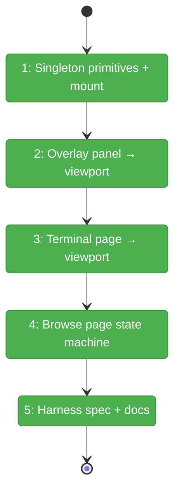
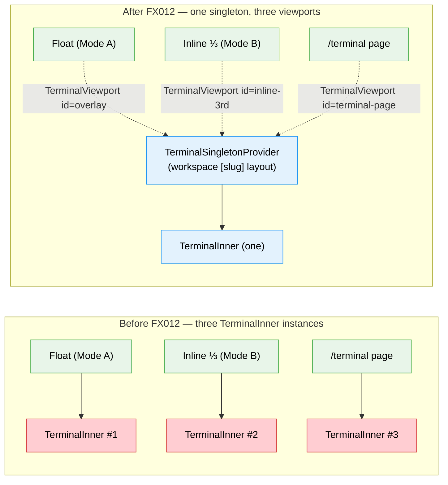

# Flight Plan: Fix FX012 — Single xterm instance across overlay / split / terminal-page

**Fix**: [FX012-single-xterm-singleton.md](./FX012-single-xterm-singleton.md)
**Plan**: [split-terminal-view-plan.md](../split-terminal-view-plan.md)
**Generated**: 2026-05-20
**Status**: Landed

---

## What → Why

**Problem**: Plan 084 mounts a **second** `<TerminalView>` for the inline split, so the browse page has its own xterm + WS + tmux-client separate from the right-edge overlay's. Three symptoms: (1) backtick while in the split spawns a second visible terminal, (2) scrollback is lost when switching surfaces, (3) tmux's smallest-client clamp (PL-03) can crush either xterm whenever both are attached.

**Fix**: Introduce a **singleton xterm** mounted once at the workspace `[slug]` layout. Three viewports portal the same DOM node into the floating overlay, the inline split's right ⅓, and the `/terminal` page. Plus a tiny A↔B state machine in `BrowserClient` so the split-toggle button and backtick keybinding drive the transitions cleanly.

---

## Domain Context

| Domain | Relationship | What Changes |
|--------|-------------|-------------|
| `terminal` | modify — new public primitives, no contract removal | `TerminalSingletonProvider` + `TerminalViewport` added; `TerminalOverlayPanel` and `TerminalPageClient` swap their direct `TerminalInner` / `TerminalView` mounts for `TerminalViewport`. `useTerminalOverlay` public API unchanged. |
| `file-browser` | modify | `BrowserClient` gains `splitOn` state, a backtick capture-phase listener, and renders `<TerminalViewport id="inline-3rd" active={splitOn}>` in the `rightPane` slot. |

---

## Flight Status

<!-- Updated by /plan-6-v2: pending → active → done. Use blocked for problems/input needed. -->

**Legend**: grey = pending | yellow = active | red = blocked/needs input | green = done

---

## Stages

<!-- Updated by /plan-6-v2 during implementation: [ ] → [~] → [x] -->

- [x] **Stage 1: Singleton primitives + provider mount** — Build `TerminalSingletonProvider` (mounts one `TerminalInner` into an offscreen park) and `TerminalViewport` (slot div + LIFO activation). Wrap the existing `TerminalOverlayWrapper` so the singleton lives above `/browser` and `/terminal`. (`terminal-singleton-provider.tsx`, `terminal-viewport.tsx` — new files; `terminal-overlay-wrapper.tsx` — modify)
- [x] **Stage 2: Migrate floating overlay panel to viewport** — `TerminalOverlayPanel` stops mounting its own xterm; renders `<TerminalViewport id="overlay" active={isOpen}>`. `useTerminalOverlay` API unchanged. (`terminal-overlay-panel.tsx` — modify)
- [x] **Stage 3: Migrate /terminal page to viewport** — `TerminalPageClient` swaps its `<TerminalView>` for `<TerminalViewport id="terminal-page" active={selectedSession != null}>`. (`terminal-page-client.tsx` — modify)
- [x] **Stage 4: Browse page A↔B state machine** — Replace `splitTerminalEnabled` with `splitOn`, add `useTerminalOverlay` consumption, register a backtick capture-phase listener, swap the inline pane JSX for `<TerminalViewport id="inline-3rd" active>`. (`browser-client.tsx`, `split-terminal-toggle-button.tsx` — modify)
- [x] **Stage 5: Harness state-machine spec + docs** — New Playwright spec covering all transitions + the `≤1 .xterm-screen` invariant + scrollback persistence. Retire or modify the old `browse-split-toggle.spec.ts`. Update `docs/how/split-terminal-view.md` and domain.md History rows. (`single-xterm-state-machine.spec.ts` — new file; docs)

---

## Architecture: Before & After

**Legend**: existing (green, unchanged outer shell) | problem (red, multiple instances cause symptoms) | new (blue, singleton path)

---

## Acceptance Criteria

- [ ] **AC-01** Split-toggle from A → Mode B with ⅔/⅓ split
- [ ] **AC-02** Split-toggle from B → A with float **open**
- [ ] **AC-03** Backtick from B → A with float **open**
- [ ] **AC-04** Backtick in A toggles float (regression-locked)
- [ ] **AC-05** `document.querySelectorAll('.xterm-screen').length ≤ 1` always
- [ ] **AC-06** Scrollback persists across A↔B transitions (same xterm)
- [ ] **AC-07** Scrollback persists across `/browser` ↔ `/terminal` nav (singleton survives)
- [ ] **AC-08** Tmux reports exactly 1 attached client (PL-03 resolved)
- [ ] **AC-09** `useTerminalOverlay` public API unchanged — sidebar / SDK / explorer callers untouched
- [ ] **AC-10** Mobile path unaffected
- [ ] **AC-11** No regression on Plan 084 AC-01/04/06/07/08/09/15/17
- [ ] **AC-12** React 19 strict-mode mount renders one `TerminalInner`, not two
- [ ] **AC-13** `pnpm vitest run` + `pnpm exec tsc --noEmit` clean on modified files

## Goals & Non-Goals

**Goals**:
- Single xterm DOM node + WS + tmux client across desktop surfaces
- Browse-page A↔B state machine with clean backtick + split-toggle semantics
- Floating overlay UX preserved verbatim (it IS Mode A)
- All scrollback survives every transition

**Non-Goals**:
- Mobile singleton sharing (mobile keeps its own `TerminalView`)
- Cross-tab singleton sharing (still one xterm per tab; multi-tab tmux war remains as L-01 from Plan 084)
- Removing the `data-terminal-overlay-anchor` attribute (float still uses it)
- Removing `TerminalView` (mobile still needs it)

---

## Checklist

- [x] FX012-1: Build `TerminalSingletonProvider` + `TerminalViewport` and mount singleton at workspace `[slug]` layout
- [x] FX012-2: Migrate `TerminalOverlayPanel` to consume the singleton via `<TerminalViewport id="overlay">`
- [x] FX012-3: Migrate `TerminalPageClient` to `<TerminalViewport id="terminal-page">`
- [x] FX012-4: Add A↔B state machine to `BrowserClient` + swap inline pane to `<TerminalViewport id="inline-3rd">`
- [x] FX012-5: Harness Playwright state-machine spec + docs (split-terminal-view.md, domain History rows)
