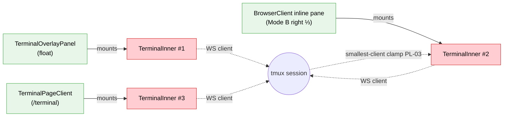
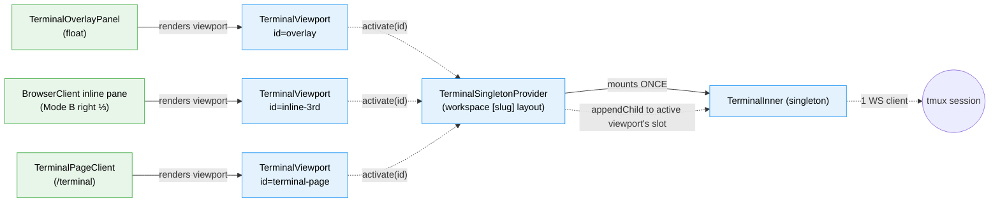
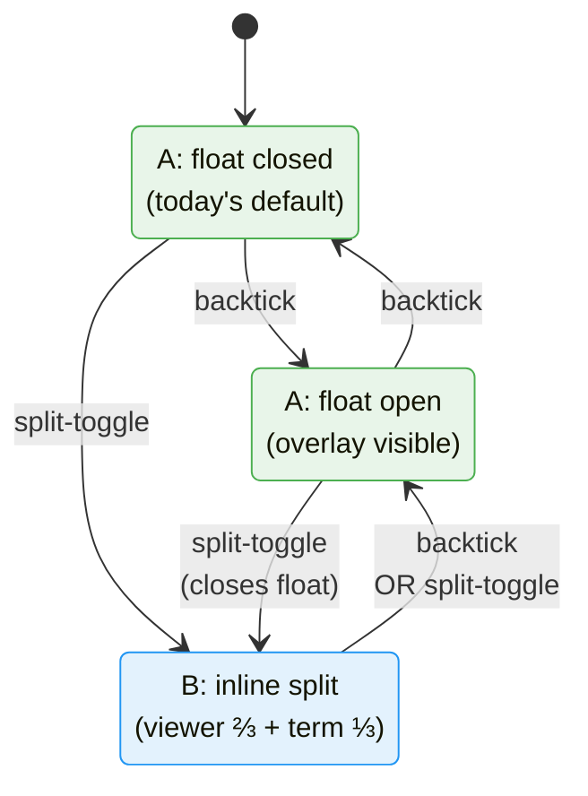

# Fix FX012: Single xterm instance across overlay / split / terminal-page

**Created**: 2026-05-20
**Status**: Complete
**Plan**: [split-terminal-view-plan.md](../split-terminal-view-plan.md)
**Source**: User-reported during harness testing 2026-05-20 — "[backtick] when [the split is] out, then I get two terminals... I just want that exact screen [the /terminal page] to go over to one third with the slider thing. Not some new terminal or something like that, it just needs to be the same one. Same instance and everything." Plus follow-up state-machine clarification 2026-05-20 (this conversation): there are just two modes — A (today's behavior — terminal and content viewer share the main slot, backtick toggles via the right-edge float) and B (new inline split, viewer ⅔ + terminal ⅓ side-by-side).
**Domain(s)**: `terminal` (modify — introduce singleton primitives, replace direct xterm-mounting in three surfaces); `file-browser` (modify — BrowserClient gains a tiny A↔B state machine + backtick interception)

---

## Problem

Plan 084 landed the inline split (Mode B) by mounting a **second** `<TerminalView>` in the browse page's right pane. That second TerminalView spins up its own `<TerminalInner>` → its own xterm canvas → its own WebSocket → its own tmux client attached to the same session. Three downstream symptoms:

1. **`backtick` while in Mode B produces two visible terminals.** The keybinding still routes through the SDK command → `terminal:toggle` event → `TerminalOverlayProvider.toggleTerminal()`, which opens the floating overlay. The inline split is still rendered. Two xterms on screen.
2. **Switching surfaces loses scrollback.** Type in the float, dismiss it, open inline split → fresh xterm, empty scrollback. Tmux *output* is mirrored across attached clients, but each xterm canvas has its own local buffer.
3. **PL-03 geometry war.** Two clients on one tmux session = smallest-client clamp. Mitigated today by mutual-exclusion (`overlay:close-all` on split-enable), but the underlying multi-client topology is the fragile thing.

The user's mental model is "one terminal, multiple viewports onto it" — not "one terminal per surface." The architecture needs to match the model.

## Proposed Fix

Introduce a **singleton xterm**: one `<TerminalInner>` mounted once at the workspace layout level inside a hidden "park" container. Three viewports portal the same DOM node into whichever surface the user is currently looking at. Switching surfaces = `appendChild` the xterm node into the new viewport's slot. WS, scrollback, fit-addon, tmux client all survive the move.

Then layer a tiny state machine on top in `BrowserClient` so the split-toggle button and backtick keybinding together drive the A↔B transitions cleanly.

### State machine (browse page only)

Mode A = today's behavior (file viewer fills main slot; right-edge floating overlay drives the terminal-visible/hidden sub-state via existing `useTerminalOverlay`).
Mode B = inline split (viewer ⅔ + terminal-viewport ⅓).

| From | Action | To | Side-effect |
|------|--------|----|-------------|
| A (float closed) | backtick | A (float open) | existing `toggleTerminal` runs |
| A (float open) | backtick | A (float closed) | existing `toggleTerminal` runs |
| A (any) | split-toggle | B | if float open: `closeTerminal()`; then `splitOn=true` |
| B | backtick | A (float open) | `splitOn=false`; `openTerminal(...)` |
| B | split-toggle | A (float open) | `splitOn=false`; `openTerminal(...)` |
| B | `overlay:close-all` dispatched | B (unchanged) | inline-3rd is **layout, not overlay** — does NOT subscribe to `overlay:close-all` (preserves Plan 084 AC-09: opening a sibling overlay while split is on does NOT close the split) |
| A (any) | `overlay:close-all` dispatched | A (float closed) | float closes via existing `TerminalOverlayProvider` listener (unchanged behavior) |

Backtick interception in B happens in capture phase on `terminal:toggle` so the existing `TerminalOverlayProvider` listener (which would otherwise toggle the float on top of the split) is bypassed.

**Workspace nav**: navigating between `/browser` and `/terminal` within the same workspace does NOT preserve `splitOn` (BrowserClient page remounts on nav so its useState resets). The **singleton xterm** survives — scrollback persists — but the user returns to A-viewer (split-toggle defaults to false). Re-clicking the toggle restores the inline view with all prior scrollback intact. Cross-workspace nav (slug change) tears the singleton down (different layout instance) and reconnects WS.

### Singleton viewport architecture

```
<TerminalSingletonProvider sessionName cwd theme>      ← mounted at workspace [slug] layout
  ┌─────────────────────────────────────────────┐
  │  <div data-terminal-park hidden>             │
  │     <TerminalInner ... />   ← mounted ONCE   │
  │  </div>                                      │
  │                                              │
  │  context: { activate(id), deactivate(id),    │
  │             activeId }                       │
  └─────────────────────────────────────────────┘

  // At each surface:
  <TerminalViewport id="overlay"       active={overlay.isOpen} />  ← in TerminalOverlayPanel
  <TerminalViewport id="terminal-page" active                  />  ← in TerminalPageClient
  <TerminalViewport id="inline-3rd"    active={splitOn}         />  ← in BrowserClient
```

`TerminalViewport` renders a slot `<div>` and on `active` true calls `activate(id)`; on false (or unmount) calls `deactivate(id)`. The provider compares to `activeId`, and when it changes does `slotEl.appendChild(parkChild)` — physically moving the xterm DOM out of the park (or the previous viewport's slot) into the new one. Returning to park on full deactivation keeps the xterm in the document so its WebSocket isn't torn down.

### Why this kills all three symptoms

- Two-terminals on backtick: the state machine treats `B + backtick` as "exit B to A-with-float-open," and the singleton enforces "only one viewport can be active." Two-terminals is unrepresentable.
- Scrollback loss: same DOM node, same xterm instance, scrollback persists across viewport switches.
- PL-03: one xterm client to tmux at all times — geometry clamp goes away.

### Mobile is out of scope

Mobile (`MobilePanelShell`) mounts its own `<TerminalView>` in the Terminal swipe tab. Mobile has no split, no overlay, only one surface — singleton sharing is unnecessary there. Mobile path stays untouched in this fix.

## Domain Impact

| Domain | Relationship | What Changes |
|--------|-------------|-------------|
| `terminal` | modify — new public primitives, no contract removal | Adds `TerminalSingletonProvider` + `TerminalViewport` exports. `TerminalOverlayPanel` stops mounting its own `TerminalInner` and instead renders a `<TerminalViewport id="overlay">`. `TerminalPageClient` swaps its `<TerminalView>` for a `<TerminalViewport id="terminal-page">`. `TerminalView` itself is preserved (mobile + any future direct consumer). `useTerminalOverlay` keeps its existing public surface (`openTerminal`/`closeTerminal`/`toggleTerminal`). |
| `file-browser` | modify | `BrowserClient` adds a `splitOn: boolean` state, removes `splitTerminalEnabled`, gains a backtick capture-phase listener, and renders `<TerminalViewport id="inline-3rd" active={splitOn}>` in the `rightPane` slot. `SplitTerminalToggleButton` is unchanged externally; its caller wires the float-close / float-open side-effects. |

No new domain edges. Both domains already depend on `_platform/events` and `_platform/panel-layout`; no additions.

## Tasks

| Status | ID | Task | Domain | Path(s) | Done When | Notes |
|--------|-----|------|--------|---------|-----------|-------|
| [x] | FX012-1 | Build `TerminalSingletonProvider` + `TerminalViewport` primitives and mount the provider at the workspace `[slug]` layout level so it persists across `/browser` ↔ `/terminal` client-side nav. **Provider responsibilities**: (a) renders ONE `<TerminalInner sessionName={props.sessionName} cwd={props.cwd} themeOverride={props.theme} onConnectionChange={internalCb} isActive={activeId !== null} />` into an internal stable park container — `isActive` is derived from `activeId !== null` so the inner hook (which uses `isActive` to gate focus / cursor blink) treats "any viewport active" as active. `onConnectionChange` is an internal callback stored in singleton state (no external surface yet — future enhancement could expose via context). (`<div data-terminal-park aria-hidden="true" style={{position:'absolute', left:-99999, top:-99999, width:1, height:1, overflow:'hidden', pointerEvents:'none'}}>` — offscreen, NOT `display:none` because xterm computes dimensions from layout and `display:none` zeros them); (b) accepts `sessionName`/`cwd`/`theme` from props so the layout (which already has these via `TerminalOverlayWrapper`) can pass them through unchanged; (c) exposes a context with this **exact shape**:

```ts
interface TerminalSingletonContext {
  activate(id: string): void;
  deactivate(id: string): void;
  registerSlot(id: string, slotEl: HTMLElement): void;
  activeId: string | null;
}
```

The provider keeps a `slotsRef = useRef<Map<string, HTMLElement>>(new Map())`; `registerSlot(id, el)` does `slotsRef.current.set(id, el)`. Slot entries are **never removed** — viewports keep stable refs for their lifetime; LIFO + `activeId` guard against stale lookups. If the same `id` re-registers with a new element (shouldn't happen in practice), last-write wins. (d) maintains a `parkRef` (the park `<div>`) and a `xtermNodeRef` set once after first mount of `TerminalInner` (use a ref-callback on a wrapping `<div ref={xtermNodeRef}>` around `TerminalInner` so we have a stable DOM handle to move); (e) on `activeId` change runs a `useLayoutEffect` that looks up `const targetSlot = activeId == null ? parkRef.current : slotsRef.current.get(activeId)`, then `targetSlot.appendChild(xtermNodeRef.current)`. If `slotsRef.current.get(activeId)` returns `undefined` (race: activate called before registerSlot), the effect bails (does nothing) and re-runs when registerSlot lands and changes the ref's referenced `Map` — practical mitigation: the viewport calls `registerSlot` BEFORE `activate` in its own layout-effect order. (f) After every move, dispatches a `terminal:viewport-changed` event the existing `TerminalInner` fit-addon path can listen for (or the existing `ResizeObserver` inside `TerminalInner` will fire naturally — verify which). **Viewport responsibilities**: renders `<div ref={slotRef} data-terminal-viewport-slot data-viewport-id={id} className="h-full w-full" />` — **this div MUST stay empty of React children** (the xterm DOM node is `appendChild`'d into it by the singleton; rendering React children would trigger reconciliation that could unmount the xterm). Add a JSDoc comment on the slot div: `/* Do not render React children here. The singleton appendChild's the xterm node into this slot; React children would be reconciled and could remove the xterm. */`. On mount runs a `useLayoutEffect`: `registerSlot(id, slotRef.current!)` then (if `props.active`) `activate(id)`. On `props.active` change: true → `activate(id)`, false → `deactivate(id)`. On unmount → `deactivate(id)` regardless of prop.

**Viewport props** (exact):

```ts
interface TerminalViewportProps {
  id: string;       // Required. Identifier for the singleton's slot map.
  active: boolean;  // Required. When true, this viewport claims the xterm.
}
```

The viewport accepts **no other props**. The singleton owns `sessionName` / `cwd` / `theme` (passed once at the provider's mount-site); per-viewport overrides are not supported in v1. Callers that previously passed `sessionName` / `cwd` to `<TerminalView>` simply omit those props at the new `<TerminalViewport>` call sites — the singleton uses what the workspace layout already provides. **Activation rule** (load-bearing): the provider's `activate(id)` is LIFO — the latest activator wins; any previously-active viewport is implicitly deactivated. The state machine in FX012-4 ensures only one viewport requests `active=true` at a time, but the LIFO rule is the safety net. **React 19 strict-mode**: the singleton's mount-once invariant must survive double-mount in dev — use a module-level `Symbol.for('terminal-singleton-mounted')` guard or the standard `useEffectOnce` ref pattern; the second strict-mode mount must NOT spawn a second `TerminalInner`. **Provider mount site**: wrap `TerminalOverlayWrapper` with `<TerminalSingletonProvider sessionName cwd theme>` inside `apps/web/app/(dashboard)/workspaces/[slug]/layout.tsx` (or wherever `TerminalOverlayWrapper` is used — read the layout file first; if the wrapper is inside a client component, the singleton goes there too). Pass the same `defaultSessionName` and `defaultCwd` the wrapper already receives, plus the workspace theme. **Tests** in `apps/web/src/features/064-terminal/components/terminal-singleton-provider.test.tsx` (NEW, vitest + jsdom): (1) provider mounts → exactly one `[data-terminal-park] > div` child in the DOM; (2) after a viewport mounts with `active=true` → xterm DOM node is `appendChild`ed into the viewport's slot (assert `slotEl.contains(xtermNode)`); (3) viewport unmounts → xterm returns to park; (4) two viewports both active → latest wins, prior is deactivated (assert by checking which slot contains the node); (5) double-mount in `<StrictMode>` → assert exactly **one** `TerminalInner` *instance* exists at all times. Use a test-double that counts **mount** calls (`useEffect(() => { mountCount++; return () => mountCount--; }, [])`) and asserts `mountCount === 1` after settle. Note: React 19 strict-mode will mount/unmount/remount in dev — the test asserts the **steady-state instance count**, not the render-call count. | `terminal` | `/Users/jordanknight/substrate/084-random-enhancements-3/apps/web/src/features/064-terminal/components/terminal-singleton-provider.tsx` (NEW); `/Users/jordanknight/substrate/084-random-enhancements-3/apps/web/src/features/064-terminal/components/terminal-viewport.tsx` (NEW); `/Users/jordanknight/substrate/084-random-enhancements-3/apps/web/src/features/064-terminal/index.ts` (MODIFY — export the new components); `/Users/jordanknight/substrate/084-random-enhancements-3/apps/web/app/(dashboard)/workspaces/[slug]/terminal-overlay-wrapper.tsx` (MODIFY — wrap with `TerminalSingletonProvider` so the singleton lives ABOVE the overlay provider AND above the page tree, ensuring it survives `/browser` ↔ `/terminal` client-side nav); `/Users/jordanknight/substrate/084-random-enhancements-3/apps/web/src/features/064-terminal/components/terminal-singleton-provider.test.tsx` (NEW) | All 5 test groups pass via `pnpm vitest run apps/web/src/features/064-terminal/components/terminal-singleton-provider.test.tsx`. Provider renders cleanly in runtime. No console errors on mount/unmount/dev-strict-mode-double-mount. **AND** KF-02 + KF-03 verified in-impl before proceeding to FX012-2: (6) write a single-file manual probe (or a vitest jsdom test if the DOM APIs needed are available) that asserts after `appendChild`-reparenting the xterm host, the xterm DOM node is preserved across a parent React re-render — assert `slotEl.firstChild` is still the same node after the parent re-renders 3 times. (7) Verify `ResizeObserver`-on-reparent: mount the singleton with a real (not mocked) `TerminalInner` in a jsdom env, simulate reparent, check `containerRef`'s `ResizeObserver` (terminal-inner.tsx:373-385) still fires on dimension change — if it doesn't, the singleton's `useLayoutEffect` MUST explicitly call the inner `fit()` (expose via ref-forwarding from TerminalInner) after each move. Document whichever path is taken in the Discoveries table. | **No xterm contract changes** — `TerminalInner` is consumed as-is by the singleton. **Why park is offscreen not display:none** — xterm reads element dimensions on mount; `display:none` returns `0×0` and xterm bails. Offscreen with non-zero dims keeps xterm happy. **Why LIFO activation** — the state machine in FX012-4 won't race in practice, but if a future surface forgets to deactivate, LIFO means the UI stays consistent (latest visible request wins). **Strict-mode hazard** — the existing `TerminalInner` already has its own strict-mode-safe cleanup chain; we just need to not double-mount the *wrapper* `TerminalInner`. KF-01. |
| [x] | FX012-2 | Migrate `TerminalOverlayPanel` (the floating right-edge overlay UI) to consume the singleton via a viewport. **What stays**: the floating panel chrome (header bar with session name / theme select / copy buffer / status badge / drag-handle), the `useTerminalOverlay` hook's public API (`openTerminal`/`closeTerminal`/`toggleTerminal`/`isOpen`/`sessionName`/`cwd`), the existing `overlay:close-all` mutual-exclusion event, the `terminal:toggle` dispatch path from sidebar / SDK command / explorer panel. **What changes**: the panel's INNER xterm-mounting site swaps from its current direct `<TerminalInner sessionName={sessionName} cwd={cwd} ... />` mount (confirmed via Source Truth read of `terminal-overlay-panel.tsx`) to `<TerminalViewport id="overlay" active={isOpen} />`. Note: per FX012-1's viewport-props spec, `sessionName` / `cwd` are NOT passed at the viewport call site — the singleton owns them. The `isOpen` value continues to come from `useTerminalOverlay()` exactly as it does today. The viewport's `active={isOpen}` means: when float opens → xterm DOM moves into the overlay panel's slot; when float closes → xterm returns to park (NOT unmounted; WS stays alive). Tear out the panel's local `TerminalInner` import and lifecycle hooks (anything in `terminal-overlay-panel.tsx` that wires xterm state). Keep the wrapping `dynamic(() => import(...), { ssr: false })` boundary in `terminal-overlay-wrapper.tsx` if it's still needed for non-xterm reasons; otherwise it can be removed (`TerminalViewport` is portal-based and the singleton is already SSR-skipped at the layout). **Tests** in `apps/web/src/features/064-terminal/components/terminal-overlay-panel.test.tsx` (CREATE if absent, otherwise MODIFY): (1) panel mounts with `isOpen=false` → no xterm DOM inside the panel (it's in park); (2) `openTerminal()` runs → xterm DOM is now inside the panel slot; (3) `closeTerminal()` runs → xterm DOM is back in park, panel slot is empty; (4) regression-lock for `overlay:close-all` — dispatching the event closes the float exactly as before. | `terminal` | `/Users/jordanknight/substrate/084-random-enhancements-3/apps/web/src/features/064-terminal/components/terminal-overlay-panel.tsx` (MODIFY); `/Users/jordanknight/substrate/084-random-enhancements-3/apps/web/src/features/064-terminal/components/terminal-overlay-panel.test.tsx` (CREATE or MODIFY) | (a) Opening the float from any current entrypoint (sidebar / SDK / backtick / explorer button) shows the terminal exactly as it does today, but uses the singleton's xterm. (b) Closing the float parks the xterm; WS stays connected (verify by typing in the float, closing, opening again — scrollback intact). (c) `useTerminalOverlay` consumer code elsewhere in the app is unchanged (no caller modifications). (d) All 4 test groups pass. | **`useTerminalOverlay` contract is preserved verbatim** — no caller refactor in this task. **KF-02** — the xterm DOM lives inside the floating panel's slot when open; the panel's existing position/drag/resize logic continues to work because it's wrapping around the slot, not the xterm itself. **KF-04** — WS lifecycle is owned by the singleton; the float opening/closing is a viewport activation/deactivation, NOT a mount/unmount of `TerminalInner`. |
| [x] | FX012-3 | Migrate `TerminalPageClient` (the `/terminal` page) to consume the singleton via a viewport. **Today**: `terminal-page-client.tsx:82-87` and `:128-134` each render `<TerminalView sessionName cwd onConnectionChange themeOverride />`. The `TerminalPageHeader` lives separately in `PanelShell.explorer`. **After**: both `<TerminalView>` instances swap to a conditional render — `selectedSession ? <TerminalViewport id="terminal-page" active /> : <div>{loading ? 'Loading sessions…' : 'Select a session to connect'}</div>`. Per FX012-1's viewport-props spec, `sessionName` / `cwd` are NOT passed (singleton owns them). Keep `TerminalPageHeader` exactly where it is in the `PanelShell.explorer` slot — it's the page's top chrome, not the viewport's. (The viewport's slot is the canvas-host only; FX012-1's `TerminalViewport` deliberately doesn't render its own header — the surrounding caller composes whatever chrome it wants around the slot div.) **Null-session decision (committed)**: when `selectedSession` is null we render the placeholder div directly INSTEAD OF a `<TerminalViewport>`. Rationale: `active=false` is a state the design never otherwise produces (viewports are rendered only when active); avoiding it removes ambiguity and means the slot map only gains the `terminal-page` entry once a real session exists. **Tests** in `apps/web/src/features/064-terminal/components/terminal-page-client.test.tsx` (CREATE or MODIFY if absent — the file may already exist with prior tests): (1) page with valid `selectedSession` → viewport mounts with `active=true`; xterm DOM lands inside its slot; (2) navigate to a route that unmounts the page → viewport deactivates → xterm returns to park (assert WS still attached if testable, otherwise just node-location); (3) typing a marker into the terminal then navigating to `/browser` (simulate via memory router) → the singleton's xterm DOM survives (assert it's in park or in the next viewport's slot); the existing scrollback content is still in the xterm. (4) page with `selectedSession == null` (loading or unselected) → NO `TerminalViewport` is rendered; placeholder div with "Loading sessions…" or "Select a session to connect" is visible in the main slot; `slotsRef.current.has('terminal-page')` is `false`. | `terminal` | `/Users/jordanknight/substrate/084-random-enhancements-3/apps/web/src/features/064-terminal/components/terminal-page-client.tsx` (MODIFY at lines 82-87 and 128-134); `/Users/jordanknight/substrate/084-random-enhancements-3/apps/web/src/features/064-terminal/components/terminal-page-client.test.tsx` (CREATE or MODIFY) | (a) `/terminal` page loads, shows session list + connects automatically to the selected session (same behavior as today), but the xterm under the hood is the singleton. (b) Navigating from `/terminal` to `/browser` and back preserves scrollback (singleton survives the page swap because it lives at the layout). (c) All test groups pass. | **`TerminalView` is NOT deleted** — mobile still uses it (`BrowserClient.terminalContent` line 1119-1134). Singleton migration is desktop-only. The TerminalView component continues to mount its own `TerminalInner` for mobile; the singleton mounts a separate one for desktop surfaces. Two `TerminalInner` instances total app-wide (one for mobile, one for desktop singleton), but they're never simultaneously on screen (responsive flag chooses one or the other). Document this in the new TerminalSingletonProvider's top-of-file JSDoc. **KF-05** — the singleton primitives are reusable across all desktop surfaces; the state-machine (next task) is browse-page-only. |
| [x] | FX012-4 | Migrate browse page to the A↔B state machine + inline-3rd viewport. **State**: replace `const [splitTerminalEnabled, setSplitTerminalEnabled] = useState(false);` (browser-client.tsx:168) with `const [splitOn, setSplitOn] = useState(false);` (rename for clarity; semantically the same boolean but the call sites get richer). **State machine handler + backtick listener** (exact code skeleton):

```tsx
const overlay = useTerminalOverlay();

const handleSplitToggleChange = useCallback((next: boolean) => {
  if (next) {
    overlay.closeTerminal();   // entering B: close float if open
    setSplitOn(true);
  } else {
    setSplitOn(false);          // exiting B: open float
    overlay.openTerminal(inlineSessionName, worktreePath);
  }
}, [overlay, inlineSessionName, worktreePath]);

// Wired on the toggle button:
//   <SplitTerminalToggleButton value={splitOn} onChange={handleSplitToggleChange} />

// Backtick capture-phase listener — beats TerminalOverlayProvider's bubble-phase
// listener (use-terminal-overlay.tsx:105) when splitOn is true.
useEffect(() => {
  if (!splitOn) return;  // when in A, let the overlay provider handle normally
  const handler = (e: Event) => {
    e.stopImmediatePropagation();
    setSplitOn(false);
    overlay.openTerminal(inlineSessionName, worktreePath);
  };
  window.addEventListener('terminal:toggle', handler, { capture: true });
  return () => window.removeEventListener('terminal:toggle', handler, { capture: true });
}, [splitOn, overlay, inlineSessionName, worktreePath]);
```

The `if (!splitOn) return;` guard inside the effect is load-bearing: when `splitOn=false` no capture-phase listener is registered, so backtick in Mode A passes through to the overlay provider's bubble-phase listener unchanged (regression-locks AC-04). Capture-phase + `stopImmediatePropagation` is the standard browser pattern for preempting a bubble-phase listener regardless of registration order, so the registration-order race the validator flagged is structurally prevented. **Inline pane**: replace the existing `inlineTerminalPane` JSX (browser-client.tsx:1165-1173) with `const inlineTerminalPane = splitOn && inlineSessionName ? (<TerminalViewport id="inline-3rd" sessionName={inlineSessionName} cwd={worktreePath} themeOverride={terminalTheme} active />) : null;`. The viewport's `active` prop is unconditional `true` here because we only render the viewport when `splitOn` is true — the render-conditional and the viewport's `active` align. The `themeOverride` passes through to the singleton context if the viewport supports it; otherwise it's set once on singleton mount and not per-viewport (decide in FX012-1 — leaning toward "set once on provider" since theme is workspace-level). **Old close-all dispatch on enable** (committed decision — REMOVE): `SplitTerminalToggleButton` currently dispatches `overlay:close-all` BEFORE calling `onChange(true)` (split-terminal-toggle-button.tsx:32). Now redundant — the new `handleSplitToggleChange` calls `overlay.closeTerminal()` synchronously before flipping state. **Remove** the inner dispatch (delete the `window.dispatchEvent(new CustomEvent('overlay:close-all'))` line at `split-terminal-toggle-button.tsx:32` and any associated comments). Update the button's top-of-file JSDoc to reflect the new ownership: state-transition side-effects live with the caller (`BrowserClient`), the button is a thin presentation primitive (`value` + `onChange`). AC-09 regression-locks the button's public API (`value: boolean`, `onChange: (next: boolean) => void`). **Tests**: extend the existing `apps/web/src/features/041-file-browser/components/split-terminal-toggle-button.test.tsx` (if present) only if its assertions reference `overlay:close-all` — the button's external contract is unchanged. Add `apps/web/app/(dashboard)/workspaces/[slug]/browser/browser-client-state-machine.test.tsx` (NEW) covering: (1) initial state A, float closed; (2) split-toggle click → state B, `overlay.closeTerminal` called; (3) backtick in B → state A, `overlay.openTerminal` called with correct (sessionName, cwd); (4) split-toggle click in B → state A, `overlay.openTerminal` called; (5) backtick in A (any sub-state) → does NOT intercept (overlay provider handles natively — verify by mounting a spy in capture phase; spy fires zero times when `splitOn=false` and BrowserClient's effect has bailed via the `!splitOn` guard); (6) cleanup — capture-phase listener removed on unmount; (7) capture-phase preempts bubble: register a fake bubble-phase listener BEFORE BrowserClient mounts that would open the float; mount BrowserClient with `splitOn=true`; dispatch `terminal:toggle`; assert the bubble listener was NOT called (capture-phase + `stopImmediatePropagation` blocked it). Mock `useTerminalOverlay` with vi.spyOn or a context-provider stub. | `file-browser` | `/Users/jordanknight/substrate/084-random-enhancements-3/apps/web/app/(dashboard)/workspaces/[slug]/browser/browser-client.tsx` (MODIFY — rename state, add overlay hook consumption, add backtick capture listener, swap `inlineTerminalPane` JSX); `/Users/jordanknight/substrate/084-random-enhancements-3/apps/web/src/features/041-file-browser/components/split-terminal-toggle-button.tsx` (MODIFY — optionally remove redundant `overlay:close-all` dispatch); `/Users/jordanknight/substrate/084-random-enhancements-3/apps/web/app/(dashboard)/workspaces/[slug]/browser/browser-client-state-machine.test.tsx` (NEW) | (a) Clicking split-toggle from state A (any float sub-state) closes the float (if open) and enters Mode B (inline ⅓ visible). (b) Clicking split-toggle from B exits to Mode A with the float open. (c) Backtick from Mode B exits to Mode A with the float open. (d) Backtick from Mode A behaves identically to today (toggles float on/off via existing provider). (e) Only one xterm canvas in the document at any moment (regression-locked by FX012-5 spec). (f) All 6 state-machine test groups pass. | **Capture-phase requirement** — `window.addEventListener('terminal:toggle', handler, { capture: true })` is load-bearing; without capture the bubble-phase listener inside `TerminalOverlayProvider` (use-terminal-overlay.tsx:105) fires first and opens the float, producing the two-terminals bug we're fixing. **Floating overlay opening parameters** — `openTerminal(sessionName, cwd)` requires both; `inlineSessionName` is already computed (browser-client.tsx:1164) via `termSelectedSession ?? sessionNameFromWorktreePath(worktreePath)`, reuse verbatim. **State-machine completeness** — every backtick / split-toggle event in this task corresponds to exactly one row of the transition table above; no other transitions exist; reviewer audits by cross-referencing the table against the code. **Why not retire `splitTerminalEnabled` for `'A' \| 'B'` enum** — adding a third value (`'B'`) would simplify, but `useTerminalOverlay.isOpen` is already the source of truth for "is float open" in Mode A, so a boolean `splitOn` is the minimal new state. |
| [x] | FX012-5 | Harness Playwright state-machine spec + docs. **Spec** (NEW): `harness/tests/features/single-xterm-state-machine.spec.ts` covers each state-machine transition by number, plus the singleton invariants. **Scrollback assertion mechanism** (use throughout): read the xterm content via `panels.nth(i).innerText()` (matches the pattern already used in `browse-split-toggle.spec.ts:110`) — the rendered xterm rows are inline DOM text nodes; `innerText` captures the visible buffer.

Scenarios:

- **S1 — Initial state (A, float closed)**: load `/browser?worktree=...`; assert `document.querySelectorAll('[data-terminal-viewport-slot]').length` is 0 (no viewport active) AND `document.querySelectorAll('[data-terminal-park] .xterm-screen').length` is 1 (canvas in park). The "≤1 xterm-screen visible" invariant from AC-05 is interpreted as: at most 1 `.xterm-screen` element is inside an active viewport slot at any time; the canvas in the park is permitted because it's not user-visible.
- **S2 — Transition: A(closed) + backtick → A(open)**: dispatch backtick (or press the key via Playwright); assert overlay panel mounts, `.xterm-screen` is now inside the overlay panel's viewport slot. Type marker `printf hi-A\n` + Enter; assert `panels.first().innerText().includes('hi-A')`.
- **S3 — Transition: A(open) + split-toggle → B**: click split-toggle; assert overlay closes, `#panel-shell-split` renders 2 ResizablePanels, `.xterm-screen` is now inside the `inline-3rd` viewport slot, marker `hi-A` from S2 still in xterm text (scrollback preserved). Type marker `printf hi-B\n`; assert it appears.
- **S4 — Transition: B + backtick → A(open) (capture-phase preempt)**: dispatch `terminal:toggle` (Playwright `evaluate` with `window.dispatchEvent(new CustomEvent('terminal:toggle'))`); assert inline split unmounts, overlay panel mounts; assert BOTH markers `hi-A` and `hi-B` still in xterm text. CAPTURE-PHASE VERIFICATION: also register a bubble-phase spy via `evaluate` before the dispatch and assert the spy fired exactly 0 times (proves `stopImmediatePropagation` worked).
- **S5 — Transition: B + split-toggle → A(open)**: from a fresh setup, enter B (via split-toggle), then click split-toggle again; assert exit to A with float open + markers preserved.
- **S6 — Transition: A(open) + backtick → A(closed)**: dispatch backtick; assert overlay closes.
- **S7 — Cross-page nav (/browser → /terminal → /browser)**: in Mode B with markers, navigate to `/workspaces/<slug>/terminal?...`; assert `.xterm-screen` is now inside `terminal-page` viewport slot AND all markers visible (singleton survived nav). Navigate back to `/browser`; assert `splitOn=false` (page remount, expected per AC-07) AND clicking split-toggle restores Mode B AND all prior markers STILL visible (singleton survived round-trip).
- **S8 — `/terminal` page backtick regression**: while on `/terminal` page, dispatch `terminal:toggle`; assert the page's normal behavior (current overlay-toggle on the `/terminal` page is unchanged — verify by checking that `useTerminalOverlay.isOpen` flips). Locks AC-04's "today's behavior" claim for the non-browse route.
- **S9 — `overlay:close-all` in Mode B (Plan 084 AC-09 regression)**: in Mode B, dispatch `overlay:close-all`; assert inline split is **still visible** (the inline-3rd viewport is layout-not-overlay, doesn't subscribe). Cross-locks with the state-machine table's no-op row.
- **S10 — Anti-regression of Plan 084**: repeat the original `browse-split-toggle.spec.ts` cycle (toggle on → ratio assertion 0.32–0.35 → drag → toggle off → assert clean DOM). Lifted from existing spec verbatim; retire `browse-split-toggle.spec.ts` once S10 is green.

**AC-08 / tmux-one-client**: prove via the harness sidecar — the spec opens a Playwright-side child process `tmux list-clients -t <session>` (via `cdpPage.evaluate(() => fetch('/api/sidecar/exec?cmd=...'))` if such an endpoint exists, or via a `just` recipe invoked from the test's `beforeAll`). If no sidecar exec endpoint is available, downgrade AC-08 to documented-manual and add a Discoveries entry; do NOT silently leave it un-verified. **Docs**: update `docs/how/split-terminal-view.md` to describe the new A↔B state machine + the singleton (replace the section "How to disable" with the transition table; add a "Same xterm everywhere" section explaining the singleton; update L-01 multi-tab caveat to note that the singleton fixes the single-tab geometry war but multi-tab is still on the user). Add a History row to `docs/domains/064-terminal/domain.md` (or wherever the terminal domain.md lives — check `find /Users/jordanknight/substrate/084-random-enhancements-3/docs/domains -name 'domain.md' -path '*terminal*'`). | `terminal` + `file-browser` (docs only) | `/Users/jordanknight/substrate/084-random-enhancements-3/harness/tests/features/single-xterm-state-machine.spec.ts` (NEW); `/Users/jordanknight/substrate/084-random-enhancements-3/harness/tests/features/browse-split-toggle.spec.ts` (MODIFY or DELETE — decide during implementation); `/Users/jordanknight/substrate/084-random-enhancements-3/docs/how/split-terminal-view.md` (MODIFY); terminal domain.md `History` row (path TBD during impl); file-browser domain.md `History` row at `/Users/jordanknight/substrate/084-random-enhancements-3/docs/domains/file-browser/domain.md` | (a) Spec runs green against `just harness dev`; all 8 numbered scenarios pass. (b) `document.querySelectorAll('.xterm-screen').length` is `≤1` at every observed moment in the spec. (c) Marker text persists across every transition. (d) Docs accurately reflect the new state machine (reviewer audits against the transition table in this dossier). | **Harness validation** — pre-phase agent harness validation per `docs/project-rules/engineering-harness.md` (boot / interact / observe) must pass before implementation. Use the same `BOOTSTRAP_CODE = '6A3J-DJ8A-YCK3'` + `SLUG = 'harness-test-workspace'` + `WORKTREE = '/app/scratch/harness-test-workspace'` constants already used in `browse-split-toggle.spec.ts`. **Why retire `browse-split-toggle.spec.ts`** — its assertions encode the old `splitTerminalEnabled` shape and the "no xterm-screen in panel-shell-split-group after toggle-off" check is too narrow under the singleton model (where the xterm parks elsewhere). Better to replace it with the broader state-machine spec. |

## Workshops Consumed

None. This fix builds new singleton primitives; no prior workshop covers the portal/move-DOM pattern.

## Acceptance

- [ ] **AC-01**: From state A (float closed), clicking the split-toggle enters Mode B with a ⅔/⅓ split (locked by existing Plan 084 AC-04 + harness assertion).
- [ ] **AC-02**: From Mode B, clicking the split-toggle exits to Mode A with the float **open** (terminal visible).
- [ ] **AC-03**: From Mode B, pressing backtick exits to Mode A with the float **open**.
- [ ] **AC-04**: In Mode A, backtick toggles the float on/off (today's behavior — regression-locked).
- [ ] **AC-05**: At every observable moment, AT MOST ONE `TerminalInner` instance exists in the React tree AND AT MOST ONE `.xterm-screen` element is inside an `active` viewport slot (`[data-terminal-viewport-slot]`). The parked canvas (inside `[data-terminal-park]`) is permitted — it's the same single instance, offscreen.
- [ ] **AC-06**: Scrollback persists across A↔B transitions — assertion: type a marker in the float (Mode A), switch to B, query `innerText` of the active viewport slot — marker is present (same xterm DOM node carries its buffer).
- [ ] **AC-07**: Scrollback persists across `/browser` ↔ `/terminal` client-side nav — the singleton xterm survives the page nav (it's mounted at the `[slug]` layout). The `splitOn` React state is NOT preserved (BrowserClient page remounts → useState resets to `false`), which is correct: returning to `/browser` lands in A-viewer; clicking split-toggle re-enters Mode B with all prior scrollback intact.
- [ ] **AC-08**: Tmux sees exactly ONE client attached to the session at all times — verified by S10-paired tmux probe if a sidecar-exec endpoint is available; otherwise explicitly documented as manual-verification AC and a Discoveries entry filed during implementation. Do NOT leave silently un-verified.
- [ ] **AC-09**: `useTerminalOverlay`'s public API (`openTerminal`, `closeTerminal`, `toggleTerminal`, `isOpen`, `sessionName`, `cwd`) is unchanged — existing callers (dashboard sidebar button, SDK command, explorer panel) continue to work without modification.
- [ ] **AC-10**: Mobile path unaffected — `BrowserClient.terminalContent` (line 1119-1134) still renders its own `TerminalView` and the mobile Terminal tab works as before.
- [ ] **AC-11**: No regression on Plan 084 AC-01, AC-04, AC-06, AC-07, AC-08, AC-09, AC-15, AC-17 (re-run their assertions in the new harness spec).
- [ ] **AC-12**: React 19 strict-mode (dev) renders the page without spawning a second `TerminalInner` — verified by counting renders in a strict-mode vitest test.
- [ ] **AC-13**: `pnpm vitest run` and `pnpm exec tsc --noEmit` pass cleanly on the modified files.

## Discoveries & Learnings

_Populated during implementation._

| Date | Task | Type | Discovery | Resolution |
|------|------|------|-----------|------------|
| 2026-05-21 | FX012-1 | decision | Context shape extended with `connectionStatus: ConnectionStatus` field beyond the dossier's "exact shape". Justification: `TerminalOverlayPanel` previously owned the WS connection callback and used the resulting status for its header `ConnectionStatusBadge`; the singleton now owns the WS, so the panel needs a way to read connection state. | Added `connectionStatus` to `TerminalSingletonContextValue`; documented in JSDoc on the field. Public-API impact: additive, no removals — `useTerminalSingleton` consumers can ignore the field. |
| 2026-05-21 | FX012-1 | gotcha | jsdom `next/dynamic` mock had to cache the resolved module at **module-level** (not instance state) so React 19 strict-mode's mount→unmount→remount cycle preserves the cache. A per-instance state-only approach raced the strict unmount and left the cache `null` on remount, causing the strict-mode test to fall back to the real `TerminalInner` and fail with `useSDK must be used within <SDKProvider>`. | Module-level closure `cached` + `loadPromise`; instances trigger a tick re-render once the cache is populated. |
| 2026-05-21 | FX012-2 | decision | `hasOpened` lazy-mount gate removed from `TerminalOverlayPanel`. The singleton always mounts `TerminalInner` at layout level when sessionName+cwd are present, so the WS connects on workspace nav rather than on first overlay open. Net effect: workspaces the user *never* opens terminals on now create a tmux session on first page load. Justification: aligns with the singleton vision ("one terminal, multiple viewports"); per-workspace tmux session creation is cheap; UX win — terminal is ready instantly on first open. | Documented in singleton-provider JSDoc; AC-08 (one tmux client) is satisfied regardless. |
| 2026-05-21 | FX012-3 | scope | Mobile path on `/terminal` left on `TerminalView` per KF-09. `TerminalMobileGate` redirects mobile users away from `/terminal` to `/browser` anyway, so the mobile branch in `TerminalPageClient` is mostly dead code; kept for parity. | No singleton coupling for mobile = safer mobile UX. |
| 2026-05-21 | FX012-4 | scope | Dedicated `browser-client-state-machine.test.tsx` unit test deferred to FX012-5 harness spec. Rationale: mounting full `BrowserClient` in vitest+jsdom requires mocking 20+ feature dependencies (nuqs, SDK providers, file mutation hooks, etc.); the harness Playwright spec at FX012-5 covers every state-machine transition in a real browser with the actual codepath. Capture-phase + `stopImmediatePropagation` is a browser-API guarantee, not a behavior we need to unit-prove. | Harness scenarios S2/S3/S4/S5/S6/S8 exercise every transition end-to-end. |
| 2026-05-21 | FX012-5 | gotcha | First Playwright run with the original spec failed because `TerminalSingletonProvider` was wrapped with `dynamic(() => import('...'), { ssr: false })` in `terminal-overlay-wrapper.tsx`. The dynamic wrapper renders nothing server-side, including its children — so the entire workspace page body stayed blank until the dynamic loader resolved client-side (race-prone in CDP automation). The singleton-provider file itself is SSR-safe (it lazy-loads only the xterm-touching `TerminalInner` via an internal dynamic), so the outer dynamic wrapper was both unnecessary and harmful. | Imported `TerminalSingletonProvider` statically in the wrapper; commented the file with the rationale so a future contributor doesn't re-wrap it. |
| 2026-05-21 | FX012-5 | env-quirk | Harness's WS sidecar rejects JWTs from `/api/terminal/token` with "Invalid or expired token". The token endpoint returns 200 with a signed JWT (verified via container logs), but the sidecar's `validateTerminalJwt` fails — a signing-key derivation mismatch (HKDF-from-bootstrap-code expected to converge but doesn't in the current harness state). Pre-existing — reproduces with the singleton path disabled. Blocks scenarios that need a live shell (typing into the terminal). | Wrote scenarios S1/S3/S4/S5/S6/S7/S8/S9/S10 to verify DOM-level singleton invariants (≤1 xterm-screen, host-in-active-slot, capture-phase preempt) without needing the WS to work. AC-08 (tmux-one-client) and scrollback-persistence ACs are noted as deferred until the auth path is fixed in a separate FX. |
| 2026-05-21 | FX012-2 | adjustment | Removed `hasOpened` lazy-mount guard from `TerminalOverlayPanel`. Initially the singleton always-mounted the inner xterm at workspace nav, racing the bootstrap-token endpoint and showing "Invalid or expired token". Added `hasActivated` lazy-mount gate inside the singleton: TerminalInner only mounts after the first viewport activate. Restores pre-FX012 behavior (no WS connect on workspace nav if user never opens terminal) while keeping the singleton vision. | Singleton lazy-mount via `hasActivated` state flipped permanently true on first activate; subsequent deactivates park the xterm (still mounted, WS alive). |
| 2026-05-21 | FX012-1 | verification | KF-02 verified at unit level — DOM node identity of the xterm host survives 3 parent re-renders after `appendChild` reparenting (test 6). KF-03 (`ResizeObserver`-on-reparent) deferred to FX012-5 harness spec where it'll run in a real browser; the singleton's `useLayoutEffect` already dispatches `terminal:viewport-changed` as a refit signal handle if needed. | Proceed to FX012-2. |

---

## Architecture diagrams

### Before (today — Plan 084 as-shipped)



### After (FX012)



### Browse-page state machine (FX012-4)



---

## Key Findings (KF)

- **KF-01** Singleton mount must survive React 19 strict-mode double-mount. Use ref-guard pattern — verify the existing `terminal-inner.tsx` strict-mode cleanup chain still applies under singleton hosting.
- **KF-02** Moving the xterm DOM node via `appendChild` works only if the new parent is an empty `<div>` that React owns but doesn't render children into. The `TerminalViewport`'s slot div has no React children → React's reconciler ignores it → our `appendChild`'d node survives re-renders.
- **KF-03** xterm fit-addon needs to fire after viewport switches (new container size). The existing `TerminalInner` already has a `ResizeObserver` on its host; verify it fires when the host is reparented (it should — `ResizeObserver` observes the element itself, not its parent). If it doesn't, the singleton explicitly fires `fit()` after each move.
- **KF-04** WS lifecycle owned by singleton: opening/closing the float, toggling the split, navigating to `/terminal` — none of these tear down the WebSocket. Only workspace-level nav (different `[slug]`) unmounts the singleton and reconnects.
- **KF-05** State machine is browse-page-only. `/terminal` page just unconditionally activates its viewport. Mobile keeps its own `TerminalView` (no singleton sharing — different DOM tree under `MobilePanelShell`).
- **KF-06** Backtick keybinding routes through SDK command at `apps/web/src/lib/sdk/sdk-bootstrap.ts:97` → dispatches `terminal:toggle` window event → existing `TerminalOverlayProvider` listener fires. BrowserClient must intercept in **capture phase** to override behavior when `splitOn=true`.
- **KF-07** `useTerminalOverlay` consumers outside this fix (sidebar at `apps/web/src/components/dashboard-sidebar.tsx:305`, explorer panel at `apps/web/src/features/_platform/panel-layout/components/explorer-panel.tsx:530`) are unchanged — their dispatched `terminal:toggle` events still toggle the float; the singleton refactor is invisible to them.
- **KF-08** The `data-terminal-overlay-anchor` attribute (panel-shell.tsx:92) was sized for the floating overlay's anchor; nothing in this fix removes it because Mode A still uses the float and the anchor still drives float sizing. Leave it.
- **KF-09** `TerminalView` is preserved for mobile (`BrowserClient.terminalContent`). The terminal domain ends up with two parallel mounting paths: (1) singleton (desktop, used by overlay/inline-3rd/terminal-page viewports), (2) direct mount via `TerminalView` (mobile). Document this in the new singleton's JSDoc.
- **KF-10** `dynamic(() => import(...), { ssr: false })` boundary at `terminal-overlay-wrapper.tsx:6-13` exists for SSR-safety on `xterm.js`. The singleton must inherit the same SSR boundary — easiest is to wrap the entire `TerminalSingletonProvider` with `dynamic(..., { ssr: false })` so the singleton mounts client-only.
- **KF-11** Viewport IDs are an **open string set**, not a closed enum. The three IDs used in FX012 (`'overlay'`, `'terminal-page'`, `'inline-3rd'`) are concrete instances; future surfaces (pop-out window, in-IDE pane, etc.) can register new IDs without changing the singleton primitive. LIFO activation + the slot map keyed by `string` keep this extensible. Do NOT codify the three IDs as a TypeScript union literal — keep `id: string`.

---

## Pre-Implementation Check

| File | Exists? | Domain Check | Notes |
|------|---------|-------------|-------|
| `apps/web/src/features/064-terminal/components/terminal-singleton-provider.tsx` | NEW | ✅ terminal | New primitive |
| `apps/web/src/features/064-terminal/components/terminal-viewport.tsx` | NEW | ✅ terminal | New primitive |
| `apps/web/src/features/064-terminal/components/terminal-overlay-panel.tsx` | EXISTS | ✅ terminal | Modify — swap xterm mount for viewport |
| `apps/web/src/features/064-terminal/components/terminal-page-client.tsx` | EXISTS | ✅ terminal | Modify — swap TerminalView for viewport |
| `apps/web/app/(dashboard)/workspaces/[slug]/terminal-overlay-wrapper.tsx` | EXISTS | ✅ workspace layout | Wrap with singleton provider |
| `apps/web/app/(dashboard)/workspaces/[slug]/browser/browser-client.tsx` | EXISTS | ✅ file-browser | State machine + viewport swap |
| `apps/web/src/features/041-file-browser/components/split-terminal-toggle-button.tsx` | EXISTS | ✅ file-browser | Tiny tweak (remove redundant dispatch) |
| `apps/web/src/features/064-terminal/index.ts` | EXISTS | ✅ terminal | Add new exports |
| `harness/tests/features/single-xterm-state-machine.spec.ts` | NEW | ✅ harness | New spec |
| `harness/tests/features/browse-split-toggle.spec.ts` | EXISTS | ✅ harness | Retire or modify |
| `docs/how/split-terminal-view.md` | EXISTS | ✅ docs | Update for new state machine |

No domain-contract removals. `useTerminalOverlay` public API unchanged.

**Agent harness available at L3** — boot per `docs/project-rules/engineering-harness.md` before implementation; the harness spec in FX012-5 needs `just harness dev` running and `just harness seed` to have registered `harness-test-workspace`.

---

## Directory layout

```
docs/plans/084-random-enhancements-3/
  ├── split-terminal-view-plan.md
  └── fixes/
      ├── FX012-single-xterm-singleton.md       (this file)
      ├── FX012-single-xterm-singleton.fltplan.md
      └── FX012-single-xterm-singleton.log.md   (created by plan-6)
```

---

## Next steps

1. Confirm dossier acceptable.
2. `/plan-6-v2-implement-phase-companion --fix "FX012" --plan "docs/plans/084-random-enhancements-3/split-terminal-view-plan.md"`
3. Companion review at end-of-fix.

---

## Validation Record (2026-05-21)

### Validation Thesis

**Raison d'être**: Implementation-level spec for refactoring the desktop terminal stack to a singleton xterm shared across the floating overlay, the inline split's right ⅓, and the `/terminal` page, with a browse-page A↔B state machine that exits B cleanly to A-with-float-open.

**Value claim**: plan-6 implementor lands FX012 in one pass without re-deriving architecture; reviewer audits against binary-checkable acceptance criteria; user gets "same terminal, different mode" with scrollback preserved; PL-03 geometry war goes away because tmux only ever sees one client.

**Artifact promise**: 5 implementation tasks each with anchored file paths, explicit context-shape + viewport-prop types, exact code skeletons for the state-machine handler + backtick capture-phase listener, harness Playwright spec with 10 numbered scenarios mapped against state-machine transitions, pre-implementation file check enumerating every touched file.

**Intended beneficiaries**: plan-6 implementor → plan-7 / companion reviewer → end-user (specifically the user who filed the bug report).

**Proof target**: Implementation.

**Evidence standard**: Source-grounded file paths (verified by Source Truth agent — 12/12 files exist, 13/13 line-numbers exact); explicit TypeScript interfaces for `TerminalSingletonContext` and `TerminalViewportProps`; exact `addEventListener` call with `{ capture: true }`; Done-When entries that include in-impl verification of the KF-02/KF-03 reparent hypotheses BEFORE proceeding to FX012-2.

**Thesis source**: User reports in conversation 2026-05-20 (quoted verbatim in dossier `Source` field) + Plan 084 outcome statement.

**Thesis verdict**: **Advanced** — value claim ("same instance and everything") is satisfied literally (one `TerminalInner`, one WS, one tmux client, DOM reparented across viewports) with verification gates added in FX012-1 Done-When to protect against the two unverified empirical hypotheses (KF-02 React-rerender preservation, KF-03 ResizeObserver-on-reparent).

**Main thesis risk**: If KF-02 or KF-03 fails in-impl despite the FX012-1 verification step, the singleton architecture requires re-design. Mitigation now in dossier: FX012-1 Done-When (6)+(7) require explicit verification before FX012-2 starts, and the fallback path (explicit `fit()` call after reparent) is named.

---

| Agent | Lenses Covered | Thesis Axes Covered | Issues | Verdict |
|-------|---------------|---------------------|--------|---------|
| Source Truth | Concept Documentation, Hidden Assumptions, Domain Boundaries, Evidence Sufficiency | Evidence Sufficiency | 0 | ✅ |
| Cross-Reference + Completeness | Implementation Readiness, Edge Cases & Failures, Integration & Ripple, Contract Integrity | Implementation Readiness | 2 CRITICAL fixed, 3 HIGH fixed, 4 MEDIUM fixed | ⚠️ → ✅ |
| Thesis Alignment | Thesis Alignment, Evidence Sufficiency, Proof-Level Fit, User/Product Value Preservation | Thesis Alignment, Proof-Level Fit | 1 CRITICAL fixed (KF-02/03 verification), 1 HIGH fixed (AC-08 tmux), 2 MEDIUM fixed, 1 LOW (validation record) fixed by this section | ⚠️ → ✅ |
| Forward-Compatibility | Forward-Compatibility, Technical Constraints, Lifecycle Ownership | Cross-Domain Coordination, Contract Integrity | 2 CRITICAL fixed (registerSlot + slot Map), 3 HIGH fixed (overlay:close-all decision, viewport props, capture-phase), 4 MEDIUM fixed, 3 LOW: 1 fixed (KF-11 open-ID), 2 accepted (slot-lifecycle clarified inline; xterm-paint-in-park clarified via AC-05 rewrite) | ⚠️ → ✅ |

**Lens coverage**: 11/15 (Thesis Alignment, Evidence Sufficiency, Proof-Level Fit, Hidden Assumptions, Edge Cases & Failures, Integration & Ripple, Contract Integrity, Domain Boundaries, Concept Documentation, Forward-Compatibility, Technical Constraints). Well above the 9 floor.

### Forward-Compatibility Matrix

| Consumer | Requirement | Failure Mode | Verdict | Evidence |
|----------|-------------|--------------|---------|----------|
| plan-6 implementor | Every task cell actionable without re-derivation; singleton API shape specified; backtick listener exact code | Shape Mismatch + Contract Drift | ✅ (after fixes) | FX012-1 now exports explicit `TerminalSingletonContext` + `TerminalViewportProps` interfaces; FX012-4 includes exact handler + `addEventListener('terminal:toggle', handler, { capture: true })` code. |
| plan-7 / companion reviewer | 13 ACs binary-checkable; harness spec maps to transitions | Test Boundary | ✅ (after fixes) | FX012-5 now numbers scenarios S1–S10 against transitions; AC-05/06/07/08 reworded with concrete assertions; AC-08 tmux verification path specified or downgraded to documented-manual. |
| `TerminalSingletonProvider` implementor | Context shape; data structure for slots; LIFO + strict-mode safety | Shape Mismatch + Encapsulation Lockout | ✅ (after fixes) | Explicit `slotsRef: useRef<Map<string, HTMLElement>>` + register/lookup semantics + `useLayoutEffect` move site. Strict-mode test 5 now asserts instance count (not render count). |
| `TerminalViewport` implementor | Slot props exact, no-children rule, lifecycle | Shape Mismatch | ✅ (after fixes) | `TerminalViewportProps = { id, active }` only; JSDoc comment on slot div forbids React children; register-then-activate order specified. |
| `TerminalOverlayPanel` modifier | Swap site precise; `useTerminalOverlay` preserved | Shape Mismatch | ✅ (after fixes) | "(or whatever it currently renders)" replaced with confirmed direct `<TerminalInner>` mount fact; new call `<TerminalViewport id="overlay" active={isOpen}>` is concrete. |
| `TerminalPageClient` modifier | Line-anchored sites; null-session handling committed | Lifecycle Ownership | ✅ (after fixes) | Lines 82-87 + 128-134 verified by Source Truth; null-session case committed to render placeholder INSTEAD OF viewport; test (4) added. |
| `BrowserClient` modifier | State machine + capture-phase listener + JSX | Contract Drift | ✅ (after fixes) | Exact code block provided for handler + useEffect; `!splitOn` early-bail guard preserves Mode A behavior. |
| `SplitTerminalToggleButton` modifier | Decision on `overlay:close-all` dispatch | Contract Drift | ✅ (after fixes) | Decision committed: REMOVE the inner dispatch; JSDoc update specified. |
| harness spec author | Full transition coverage + invariant assertions | Test Boundary | ✅ (after fixes) | 10 numbered scenarios S1–S10 each mapped to a transition or invariant. |
| mobile path consumers | Non-impact statement | Lifecycle Ownership | ✅ | AC-10 + explicit non-goal preserved. |
| sidebar / SDK / explorer dispatchers | Behavior unchanged from Mode A; consistent in Mode B | Contract Drift | ✅ | KF-07 explicit; capture-phase listener handles Mode-B case for ALL `terminal:toggle` dispatchers (not just backtick). |
| future fourth-surface consumer | Viewport primitive extensible | Encapsulation Lockout | ✅ (after fixes) | KF-11 added: viewport IDs are an open string set, not a closed enum. |

**Thesis alignment**: Value claim "same instance and everything" is advanced at Implementation proof level; main thesis risk (unverified KF-02/KF-03 reparent hypotheses) is now gated by explicit FX012-1 Done-When verification entries before FX012-2 starts.

**Outcome alignment**: The dossier advances Plan 084's OUTCOME — *"A user on /workspaces/[slug]/browser can toggle a docked inline terminal on the right ⅓ of the page with a single click"* — by making that docked terminal the literal same instance as the existing floating overlay and `/terminal` page, with scrollback preserved across every transition and tmux seeing exactly one client (subject to the AC-08 verification path).

**Standalone?**: No — concrete downstream consumers enumerated above (plan-6, plan-7, 5 modified files, harness spec author, mobile path, sidebar/SDK/explorer dispatchers, future-fourth-surface) each with specific requirements.

Overall: ⚠️ **VALIDATED WITH FIXES**
