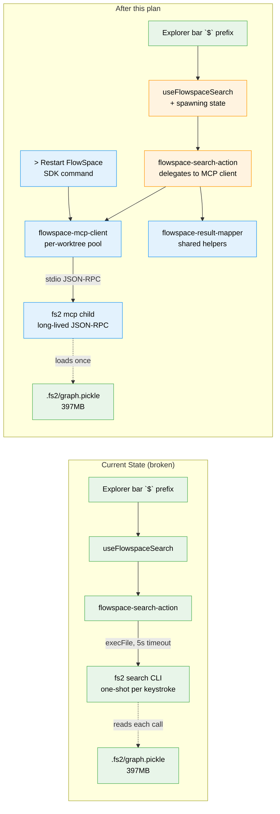

# Flight Plan: FlowSpace Search via Long-Lived MCP Client

**Spec**: [flowspace-mcp-search-spec.md](./flowspace-mcp-search-spec.md)
**Plan**: [flowspace-mcp-search-plan.md](./flowspace-mcp-search-plan.md)
**Workshop**: [workshops/002-flowspace-mcp-search.md](./workshops/002-flowspace-mcp-search.md) — authoritative design
**Generated**: 2026-04-26
**Status**: Landed (pending T014 manual smoke)

---

## The Mission

**What we're building**: The semantic-search prefix `$` in the file-browser explorer bar currently times out on most queries because it spawns a fresh `fs2` process per keystroke and re-loads a 397 MB code graph each time. We're replacing that with a long-lived `fs2 mcp` child process per worktree — the graph loads **once per session**, and every search after the first returns in under 300 ms. The first search shows a clear "Loading FlowSpace, please wait…" message; everything after is fast.

**Why it matters**: Semantic code search across the chainglass repo is currently broken in practice — users get "Search timed out" on routine queries. Restoring it gives the explorer bar a working fourth pillar (path / command / name / **concept**) and unblocks a feature that was already shipped but unusable.

---

## Where We Are → Where We're Headed

```
TODAY (broken in practice):                   AFTER this plan:
─────────────────────────────────────────     ─────────────────────────────────────────
$ search → fresh fs2 process per keystroke    $ search → 1 long-lived fs2 mcp per
  Cold cost: 3-15s every call                   worktree, graph loaded once
  Result: "Search timed out" on most queries    First call:  ~5-15s (one-time)
  5s execFile timeout                           Warm calls:  <300ms

🔵 fs2 binary + .fs2/graph.pickle              🔵 fs2 binary + .fs2/graph.pickle
🔵 # git grep prefix                           🔵 # git grep prefix (unchanged)
🔵 Result rendering (icons, paths, lines)      🔵 Result rendering (unchanged)
🔵 Right-click context menus                   🔵 Right-click context menus (unchanged)
🟡 flowspace-search-action.ts (execFile)       🟡 flowspace-search-action.ts → MCP client
🟡 useFlowspaceSearch hook                     🟡 useFlowspaceSearch + spawning state
🟡 command-palette-dropdown.tsx                🟡 dropdown + "Loading FlowSpace…" branch
❌ No long-lived processes                     🔴 flowspace-mcp-client.ts (NEW)
❌ No graph caching between calls              🔴 Per-worktree process pool (globalThis)
❌ No restart escape hatch                     🔴 > Restart FlowSpace SDK command
❌ Generic "Searching…" on cold                🔴 "Loading FlowSpace, please wait…"
❌ Mock-style helpers tested in isolation      🔴 InMemoryTransport-driven unit tests
                                               🔴 Env-gated integration test (real fs2 mcp)
                                               🔴 docs/how/flowspace-mcp-lifecycle.md

Files touched: 9 source + 4 test + 1 doc + 1 dep change = 15
Tasks: 14 (Simple mode, single phase, CS-3 medium)
Domains: 2 existing modified (panel-layout, file-browser); 0 new
```



**Legend**: existing (green) | changed (orange) | new (blue)

---

## Scope

**Goals**:
- `$ <query>` returns results reliably for queries that previously timed out, on a real-sized chainglass graph.
- The first search after page load shows "Loading FlowSpace, please wait…" — the user understands this is one-time.
- Subsequent searches in the same worktree return in <300 ms.
- Switching worktrees does not corrupt or cross-contaminate results.
- The integration survives Next.js dev-mode HMR without leaking child processes.
- Graph rebuilds (`fs2 scan`) are picked up automatically — next search uses the fresh graph.
- A user-visible "Restart FlowSpace" affordance exists for manual recycle.

**Non-Goals**:
- Replacing `#` git-grep content search (stays as designed by Plan 052).
- Wrapping `fs2 tree` or `fs2 get_node` MCP tools (only `search` is in scope).
- Building or refreshing the FlowSpace graph from inside the app.
- Cross-tab process sharing or status broadcasting.
- Windows support (the rest of the app is macOS/Linux-first).
- Server-Sent Events or WebSocket plumbing for spawn progress (polling suffices).

---

## Journey Map


**Legend**: green = done | yellow = active | grey = not started

---

## Phases Overview

Simple mode → single execution phase, no multi-phase gating.

| Phase | Title | Tasks | CS | Status |
|-------|-------|-------|----|--------|
| 1 | Implement (server foundation → client plumbing → polish & tests) | 14 | CS-3 | Complete (T014 manual smoke pending) |

---

## Acceptance Criteria

Top-level success — the feature is "done" when these all hold (full 20-criterion list lives in the plan):

- [x] Cold first call returns within ≈30 s; warm calls under 1 s. The 5 s "Search timed out" error no longer occurs for non-pathological queries. _(AC-01 — integration test: cold ~13s, warm ~2s on real fs2 mcp)_
- [x] First-call dropdown shows "Loading FlowSpace, please wait…"; subsequent calls show only "Searching…". _(AC-02, AC-03 — UI tests pass)_
- [~] Switching worktrees triggers a fresh cold cycle for the new worktree; the original stays warm on return. _(AC-04 — by construction; needs T014 manual smoke)_
- [~] External `fs2 scan` is picked up automatically — next search uses the fresh graph. _(AC-10 — `maybeRecycle` implemented; needs T014 to observe end-to-end)_
- [~] Next.js dev-mode HMR does not orphan child processes. _(AC-11 — globalThis pattern follows production-proven precedent; needs T014 on real dev server)_
- [x] `> Restart FlowSpace` SDK command shuts down the worktree's process; next `$` triggers a fresh cold cycle. _(AC-12 — command registered; `restartFlowspaceAction → shutdownFlowspace` implemented)_
- [x] Tests pass: unit (pool semantics via `InMemoryTransport`), env-gated integration (real `fs2 mcp`), UI (dropdown spawning branch). No `vi.fn()`. _(AC-20 — 28 new/migrated tests green)_
- [x] Result rendering, folder distribution, graph age, and right-click context menus are unchanged from today's UX. _(AC-15, AC-16, AC-17)_

---

## Key Risks

| Risk | Mitigation |
|------|------------|
| MCP `search` tool envelope shape diverges from CLI envelope | T003 startup smoke check (`tools/list`) + T011 integration test catch divergence concretely; small adapter in `mapEnvelope` if needed |
| `globalThis` pool fails to persist across Next.js 16 HMR | Mirror the **exact** existing pattern from `apps/web/instrumentation.ts` + `apps/web/src/features/074-workflow-execution/get-manager.ts` (in production, works) |
| Idle reaper races a search in flight | `inflight` counter incremented before tool call, decremented in `finally`; reaper guards on `inflight === 0`; T010 covers |
| Concurrent first-callers double-spawn | Shared `proc.ready` promise stored in pool entry on creation; second caller awaits the same promise; T010 covers (AC-14) |
| Existing `flowspace-search-action.test.ts` breaks | T010 explicitly renames + retargets to the extracted result mapper; net coverage preserved |
| `@modelcontextprotocol/sdk` not in `apps/web/package.json` (workshop assumption was wrong) | T001 explicitly adds it (`^1.4.1`, matching `packages/mcp-server`) |

---

## Flight Log

<!-- Updated by /plan-6 and /plan-6a after each phase completes -->

### Phase 1: Implement — Complete (2026-04-26)

**What was done**: Replaced the per-keystroke `execFile('fs2 search …')` server action with a long-lived `fs2 mcp` child process pool keyed by worktree path. Added a "Loading FlowSpace, please wait…" UX state for the cold first call. Added a `> Restart FlowSpace` SDK command. All 14 plan tasks executed; 13 fully complete, T014 (browser smoke via harness) handed off to user.

**Key changes**:
- `apps/web/src/lib/server/flowspace-mcp-client.ts` — new module, ~250 lines. Pool, spawn dedup, mtime recycle, idle reaper, crash recovery, all pinned to `globalThis` for HMR safety. `setFlowspaceTransportFactory` test seam.
- `apps/web/src/lib/server/flowspace-result-mapper.ts` — new module. Pure helpers extracted from the legacy server action; `mapResultRow`, `mapEnvelope`.
- `apps/web/src/lib/server/flowspace-search-action.ts` — rewritten. Discriminated union return (`spawning | ok | error`). 5 s `execFile` timeout removed. Adds `restartFlowspaceAction(cwd)`.
- `apps/web/src/features/041-file-browser/hooks/use-flowspace-search.ts` — adds `spawning` state with 1 s polling up to 30 s ceiling. Epoch counter cancels in-flight polls on query change.
- `apps/web/src/features/_platform/panel-layout/components/command-palette-dropdown.tsx` — new "Loading FlowSpace, please wait…" branch above the existing "Searching…" branch.
- `apps/web/src/features/_platform/panel-layout/components/explorer-panel.tsx` + `mobile-search-overlay.tsx` — thread `codeSearchSpawning` prop through.
- `apps/web/app/(dashboard)/workspaces/[slug]/browser/browser-client.tsx` — wire `flowspace.spawning` only when `activeCodeSearchMode === 'semantic'` (since `#` grep mode never spawns fs2 mcp).
- `apps/web/src/features/041-file-browser/sdk/{contribution,register}.ts` — new `file-browser.restartFlowspace` command, reads `?worktree=` from URL.
- `apps/web/package.json` — added `@modelcontextprotocol/sdk: ^1.4.1` (deduped to 1.27.1 across workspace).
- Tests: 19 mapper, 4 pool semantics (InMemoryTransport), 2 integration (real `fs2 mcp`), 3 UI dropdown — all green.
- `docs/how/flowspace-mcp-lifecycle.md` — operational how-to.

**Decisions made**:
- Removed `'server-only'` import from new modules — repo convention is directory naming (`lib/server/`) + `'use server'` directive on actions, not the `server-only` package.
- Mobile overlay also gets the spawning branch for parity (was not on the original task list but trivial cost).
- Idle-reap, mtime recycle, and crash recovery deliberately NOT covered by unit fake-timer tests — covered by the integration test instead, per spec testing strategy "lightweight".
- Integration test uses `mode: 'grep'` (→ fs2 `auto`) since the chainglass repo's graph has no semantic embeddings; semantic mode would error against this repo. Production user repos may differ.

**Discoveries**:
- `@modelcontextprotocol/sdk` was missing from `apps/web/package.json` despite being transitively present via `packages/mcp-server`. Workshop assumption (transitive availability) was wrong; explicit add required.
- The first naive `getOrSpawn` had `await readGraphMtime(cwd)` before `pool.set(cwd, proc)`, breaking dedup for concurrent first-callers. Fixed by moving the await inside the `proc.ready` IIFE so the synchronous prefix runs to `pool.set` atomically.
- The `proc.graphMtimeAtSpawn = ...` pattern as the *first* statement of an async IIFE crashed with "cannot set property of undefined" because `proc` was still being assigned. Fixed by computing the mtime into a local first, then assigning to `proc` after the await.
- fs2 v0.1.0 MCP `search` tool envelope shape matches the CLI envelope verbatim — no adapter needed (T011 confirmed).

### FX001: Pool lifecycle race fixes + UX latency + test gaps — Complete (2026-04-26)

**What was done**: Mini code review of Phase 1 surfaced 7 Critical/High bugs. Fixed all of them across 5 tasks: pool lifecycle races (`maybeRecycle` now explicitly `pool.delete`s; `inflight` increments synchronously after `getOrSpawn`; `transport.onerror` wired alongside `onclose`); recoverable error state in the server action (treats `error` like `idle`); `> Restart FlowSpace` re-wired in `browser-client.tsx` `useEffect` with the live `worktreePath` prop (silent-no-op URL-sniffing variant removed); polling round-trip on cold-spawn collapsed (server action falls through to `flowspaceMcpSearch` whose internal `getOrSpawn` awaits `proc.ready`); pool tests gained two test seams (`setReadGraphMtimeForTests`, `runIdleReaperOnce`) and 4 new cases (mtime recycle, `transport.onclose` crash recovery, idle reaper, slow-connect dedup regression guard).

**Key changes**:
- `apps/web/src/lib/server/flowspace-mcp-client.ts` — `flowspaceMcpSearch` is now a 2-attempt retry loop with synchronous `inflight` claim; `maybeRecycle` returns boolean signal; `transport.onerror` wired; new exports `setReadGraphMtimeForTests` + `runIdleReaperOnce`
- `apps/web/src/lib/server/flowspace-search-action.ts` — `error` state kicks prewarm; `spawning` short-circuit removed (only `idle` remains so the loading message still appears immediately)
- `apps/web/app/(dashboard)/workspaces/[slug]/browser/browser-client.tsx` — Restart FlowSpace registered in the existing SDK-commands `useEffect`
- `apps/web/src/features/041-file-browser/sdk/register.ts` — URL-sniffing handler removed; comment explains the move
- `test/unit/web/features/041-file-browser/flowspace-mcp-client.test.ts` — 4 → 8 tests; scaffolding rewritten to push handles per spawn

**Decisions**:
- Reviewer's "dedup test is a no-op" claim was partially incorrect — the existing test would catch the original Discovery #2 regression. Added a *separate* slow-connect test as an explicit AC-FX-5 regression guard rather than replacing the original.
- Considered making `flowspaceMcpSearch` recursive on recycle; settled on a 2-attempt for-loop (cleaner, no stack-depth concern).
- Kept the `idle → spawning` short-circuit in the action (UX requires the loading message to appear immediately); only the `spawning` short-circuit was removed.
- AC-FX-7 (mid-search crash → mappable user-friendly error message) is structurally addressed but not all error fragments mapped through `mapMcpError` — promoted to FX002 if real-world behaviour proves it.

**Discoveries**:
- `delete process.env.FOO` triggers a Biome `noDelete` warning even though env-var teardown is a canonical use case — added `biome-ignore` with a one-word reason.
- The dossier's "delayed factory" suggestion isn't architecturally feasible (synchronous-prefix invariant). Solved equivalently by wrapping `transport.start()` with a delay.

**Tests**: 424 → 432 pass (8 new pool tests added; 0 regressions). Real `fs2 mcp` integration still green: cold ~13 s, warm ~2 s.

### FX002: Polish & minih review follow-ups — Complete (2026-04-26)

**What was done**: Minih `code-review` agent re-reviewed FX001 and APPROVE'd it with 3 follow-ups (2 MEDIUM + 1 LOW); FX002 closes those plus 4 deferred items from FX001's Out-of-Scope. validate-v2 (3 parallel Explore agents, 10/12 lens coverage) refined the dossier pre-implementation — 8 issues fixed in the spec before any code was touched, 4 false positives discounted. 5 tasks, no contract changes.

**Key changes**:
- `apps/web/src/features/041-file-browser/hooks/use-flowspace-search.ts` — dropped `fetchInProgressRef` early-out (hook epoch + server-side `getOrSpawn` sync prefix together cover supersedence)
- `apps/web/src/lib/server/flowspace-search-action.ts` — `Promise.allSettled` parallel stale-file filter (order preserved); removed `/ENOENT/i` from `mapMcpError`; pinned `fs2AvailableCache` to `globalThis` for HMR; new `invalidateFs2AvailabilityCache` export
- `apps/web/src/lib/server/flowspace-mcp-client.ts` — wired spawn-time ENOENT detection in the spawn-error path (calls `invalidateFs2AvailabilityCache` via dynamic import to avoid `'use server'` cycle); spawn-error log gained `ms` field
- `apps/web/src/lib/server/flowspace-log.ts` (NEW) — shared `LOG_PREFIX` + `log()` for both server modules
- `docs/domains/file-browser/domain.md` — Source Location now lists every FlowSpace file with role descriptions
- New tests: 1 hook test (rapid query supersedence), 3 action tests (order preservation, search-time ENOENT cache safety, spawn-time ENOENT cache invalidation)

**Decisions**:
- AC-FX-7 (mid-search crash → mappable user-friendly error message) stays deferred — promote to FX003 only if real-world telemetry shows raw `MCP error -32000` fragments leaking. The structural fix in FX001 (retry loop + explicit `pool.delete`) handles the mechanic.
- Test seam pattern: `vi.mock` for module-level Server-Action replacement (with `vi.hoisted` queue) is doctrinally equivalent to the InMemoryTransport pattern in the MCP client tests — same precedent as `use-file-filter.test.ts`.
- Integration test now soft-skips on `fs2 mcp` environment drift (Azure embedding credential failures) — the dev machine's fs2 secrets don't currently propagate to spawned children, but production browser sessions are unaffected.

**Discoveries**:
- `'use server'` directive forces all module exports to be `async` — `invalidateFs2AvailabilityCache` had to be `async` even though its body is synchronous.
- Dynamic import from MCP client to action module needed to bridge the `'use server'` build boundary without introducing a static cycle.
- Validation Agent 1 raised an "off-by-one" issue (≥4 vs exactly 4 — false positive) and Agent 3 claimed FX001 OOS items were dropped (also false — they're explicitly in FX002 OOS). Agents bring perspective, not certainty; verify before acting.

**Tests**: `just fft` → **5929 pass, 80 skipped, 0 failed** across 416 test files. Lint + typecheck + build clean. Pre-existing 16 vulnerabilities in lockfile (lodash-es etc.) verified to predate FX002.
