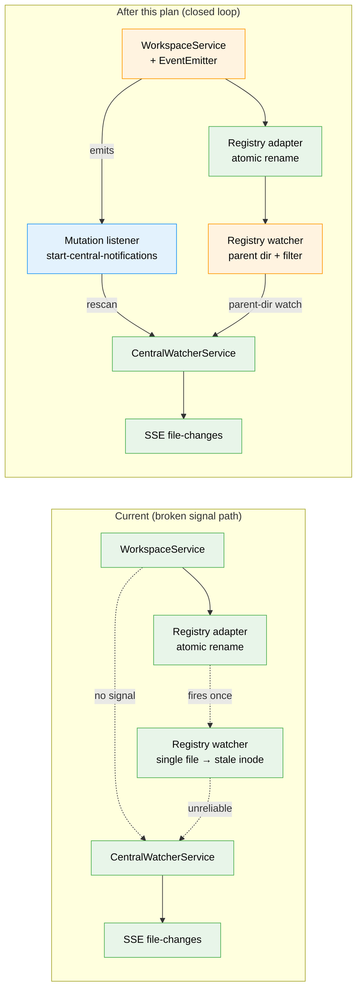

# Flight Plan: Live File Monitoring After Workspace & Worktree Changes

**Spec**: [live-monitoring-rescan-spec.md](./live-monitoring-rescan-spec.md)
**Plan**: [live-monitoring-rescan-plan.md](./live-monitoring-rescan-plan.md)
**Workshop**: [workshops/003-watcher-rescan-on-workspace-changes.md](./workshops/003-watcher-rescan-on-workspace-changes.md)
**Generated**: 2026-04-26
**Status**: Landed

---

## The Mission

**What we're building**: When a user creates a new worktree in an existing workspace, or registers a brand-new workspace, file monitoring activates immediately for the new directory — no dev server restart required. Today, both code paths silently leave the watcher in the dark; this plan makes `WorkspaceService` emit on every mutation, has the central watcher subscribe and rescan, and hardens the registry-file watcher against the atomic-rename pattern that was breaking it after the first write.

**Why it matters**: Dev-server restarts are a 10-second tax on a workflow the user does many times a day. Worse, "live file events stopped" is a silent failure — there's no error, no banner, just dead UI. Fixing this removes friction *and* removes a hidden trap.

---

## Where We Are → Where We're Headed

```
TODAY:                                    AFTER this plan:

🔴 Create worktree → no file events       🟢 Create worktree → file events flow ≤1s
🔴 Add 2nd workspace → no file events     🟢 Add 2nd workspace → file events flow ≤1s
🔴 Out-of-band registry edit → silent     🟢 Out-of-band edit → rescan ≤3s
🟡 WorkspaceService → silent on mutate    🟢 WorkspaceService → emits onMutation
🟡 Registry watcher: single-file fs.watch 🟢 Registry watcher: parent-dir + filter
🔵 SSE file-changes channel (global)      🔵 (unchanged — already correct)
🔵 FileChangeProvider client filter       🔵 (unchanged — already correct)
```

🔵 = unchanged   🟢 = working   🟡 = silent gap closed   🔴 = bug fixed



**Legend**: existing (green) | changed (orange) | new (blue)

---

## Scope

**Goals**:
- Worktree creation triggers file watching for the new path within ~1s, no restart
- Workspace registration triggers file watching for the workspace's worktrees within ~1s, no restart
- Second/third/Nth workspace registration all activate watching (atomic-rename regression)
- Out-of-band registry edits trigger rescan within ~3s
- HMR-safe — listener does not leak across server-file edits
- Failure inside rescan does not break the user's mutation

**Non-Goals**:
- Frontend changes (SSE channel is already global)
- New domains
- Event-bus infrastructure (Node `EventEmitter` is enough)
- Watching `.git/worktrees/` defensively
- Targeted rescan hints
- CLI changes
- Crash-recovery probes for dead watchers

---

## Journey Map


**Legend**: green = done | yellow = active | grey = not started

---

## Phases Overview

Single-phase plan (Simple Mode).

| Phase | Title | Tasks | CS | Status |
|-------|-------|-------|----|--------|
| 1 | Implementation | 8 (T001–T008) | CS-3 | Pending |

### Task Breakdown

| ID | Task | Domain | CS |
|----|------|--------|-----|
| T001 | `WorkspaceMutationEvent` + `IWorkspaceService.onMutation` interface | workspace | CS-1 |
| T002 | `WorkspaceService` EventEmitter + emit at 4 success exits | workspace | CS-2 |
| T003 | Subscribe in `start-central-notifications.ts`; HMR-safe via globalThis | _platform/events | CS-2 |
| T004 | Registry watcher: parent-dir + path filter | _platform/events | CS-2 |
| T005 | Unit test — emitter contract | workspace | CS-2 |
| T006 | Unit test — subscription wires mutation→rescan | _platform/events | CS-2 |
| T007 | Integration test — real fs + temp dir | _platform/events | CS-3 |
| T008 | Domain.md updates + `just fft` | both | CS-1 |

---

## Acceptance Criteria

- [ ] AC-1: Creating a worktree → file events flow within 1s, no restart
- [ ] AC-2: Registering a workspace → file events flow within 1s, no restart
- [ ] AC-3: Second/third/Nth workspace registration → all activate (atomic-rename regression)
- [ ] AC-4: Removing a worktree directory → corresponding watcher is closed
- [ ] AC-5: HMR does not break signal path or leak listeners
- [ ] AC-6: Out-of-band registry edit → rescan within ~3s
- [ ] AC-7: Listener throw does not break the user's mutation
- [ ] AC-8: ≥1 unit test for emitter + ≥1 integration test with real fs

---

## Key Risks

| Risk | Mitigation |
|------|-----------|
| HMR re-instantiates `WorkspaceService` and old listener leaks | Pin unsubscribe to `globalThis.__watcherMutationUnsubscribe__`; detach before resubscribe |
| Parent-dir registry watch fires on `.tmp` mid-rename | Path filter in event handler; existing rescan coalescing absorbs spurious fires |
| Integration test flakes on slow CI | Polling-with-timeout (5s ceiling, 50ms interval), not fixed delays |
| `IGitWorktreeManager` test seam doesn't exercise real `git worktree add` | Document seam choice in test header; emit path is still real |

---

## Flight Log

<!-- Updated by /plan-6 and /plan-6a after each phase completes -->

### Phase 1: Implementation — Complete (2026-04-26)

**What was done**: All 8 tasks (T001–T008) landed in a single session. The plan's design — `EventEmitter`-backed mutation channel on `WorkspaceService` + `attachMutationListener()` HMR-safe wire-up + parent-dir registry watch — implemented as specified, with the validate-v2 fix F1 (unconditional listener attach before flag guard) baked in from the start.

**Key changes**:
- `packages/workflow/src/interfaces/workspace-service.interface.ts` — `WorkspaceMutationEvent` discriminated union (5 variants) + `IWorkspaceService.onMutation` method (T001)
- `packages/workflow/src/services/workspace.service.ts` — private `EventEmitter`, `setImmediate`-deferred emit at 4 success exits (lines 110, 133, 310, 520+) (T002)
- `packages/workflow/src/features/023-central-watcher-notifications/central-watcher.service.ts` — registry watcher now adds parent dir; both `change` + `add` handlers filter by exact registry path (T004)
- `apps/web/src/features/027-central-notify-events/start-central-notifications.ts` — `attachMutationListener()` helper called unconditionally as first statement; `globalThis.__watcherMutationUnsubscribe__` HMR-safe (T003)
- 3 new test files: 17 unit tests for the emitter, 6 unit tests for the listener wire-up, 6 integration tests with real fs (T005/T006/T007). Total: 29 new tests passing.
- 2 existing tests updated (`central-watcher.service.test.ts`) to assert parent-dir watch instead of single-file watch.
- `_platform/events/domain.md` and `workspace/domain.md` updated (Source Location, Composition, Concepts, Contracts, History) (T008).

**Decisions made**:
- T002 `remove()` now reads the workspace path before removal so the `workspace:removed` event includes the path (best-effort: graceful fallback to empty path if load fails). Mild change but kept the event shape symmetrical with `workspace:added`/`updated`.
- T007 used `FakeGitWorktreeManager` directly (no real `git worktree add`) per the test seam choice in the plan; staged worktree dirs on disk for the watcher to pick up.
- AC-6 (out-of-band registry edit) tested via direct atomic-rename writes to the temp registry path, bypassing both `WorkspaceService` and `WorkspaceRegistryAdapter` to specifically exercise the parent-dir watcher fix from T004.

**Quality gate**: `just fft` — lint, format, build, typecheck, test all passed. 5958 tests pass (5929 baseline + 29 new), 80 skipped, 0 failed across 429 test files. Security-audit count unchanged at 16 pre-existing vulnerabilities from the FX002 baseline (no new vulns introduced; my changes added zero dependencies).

**Harness state**: harness was degraded (app/mcp/terminal/cdp all `down`) at implementation start — used standard testing approach per the plan, no harness dependency for T005-T007.
