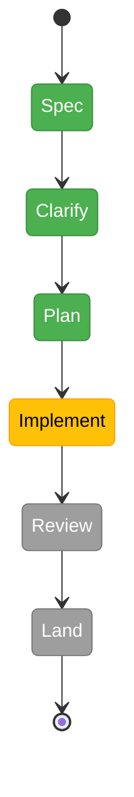

# Flight Plan: Multi-Folder File Browser Tree

**Plan**: [multi-folder-tree-plan.md](./multi-folder-tree-plan.md) (spec: [multi-folder-tree-spec.md](./multi-folder-tree-spec.md))
**Generated**: 2026-05-11
**Last Updated**: 2026-05-13
**Status**: Phase 1 dossier ready for `/plan-6-v2-implement-phase-companion`

---

## Where We Are → Where We're Going

**Where we are**: The file browser shows one top-level folder per workspace — the active git worktree. Single-root assumptions are baked into every layer (URL param, fetch hook, cache keys, expand state, React keys, repo-info, SSE filter). Workspace persistence has no field for user-pinned extra folders. Several file-API routes use defensive-only path validation; only FX007's `repo-info` route uses the canonical 2-layer closed-set match. The recursive file watcher uses raw `fs.watch`, which hits a hard ~4,096 ceiling on macOS regardless of `ulimit`.

**Where we're going**: A user can pin additional folders to a workspace via a `+` button in the file browser, see them as siblings in the same tree (with type indicators for git / cloud / local), and remove them with `−`. Pins persist per-workspace. Path validation is hardened across every read route. The watcher substrate scales to ~10 roots — including macOS CloudStorage folders, which fall through to a polling fallback because raw fs-events on file-provider mounts are unreliable.

---

## Phase Index (locked from plan-3)

| Phase | Title | Domain | Objective | Depends On |
|-------|-------|--------|-----------|------------|
| 1 | Watcher Library Migration + Pre-flight | `_platform/events` | Replace raw `fs.watch` with `@parcel/watcher`; add startup `ulimit` / `inotify` warning | None |
| 2 | Workspace Path Validation Harden | `workspace` | Shared `validateWorkspacePath` helper; route every existing read endpoint through it; tighten `resolveContextFromParams` lenient fallback | None |
| 3 | Extra Folders Contract | `workspace` | `ExtraFolder` type + `extraFolders[]`; add/remove/update service methods; closed-set extension | Phase 2 |
| 4 | Watcher Lifecycle + CloudStorage Routing | `_platform/events` | Subscribe to `workspace:updated`; CloudStorage prefix-detect + polling watcher; manual-refresh endpoint | Phases 1 + 3 |
| 5 | Multi-Root Tree Rendering | `file-browser` | Per-root state shape; namespaced React keys; N `<FileTree>` siblings; per-root header | Phase 3 |
| 6 | Add-Folder UI + Persistence Wiring | `file-browser` | `+` button; add-folder modal; `/api/.../extras` route; soft warning past 10 | Phase 5 |
| 7 | Per-Root Repo-Info + Type Indicators + Copy-URL Gate | `file-browser` (consumes `_platform/git`) | Per-root `repoInfo` Map (lazy); `[Git]`/`[Cloud]`/`[Local]` badges; FX007 menu gating | Phases 5 + 6 |
| 8 | Reorder + Alias + Removal + Settings + Docs | `file-browser` + docs | Move Up/Down primary + drag secondary; alias rename; instant remove + 5s undo; settings accordion; `docs/how/multi-folder-tree.md`; domain.md updates | Phase 7 |

---

## Domain Context

### Domains We're Changing

| Domain | What Changes |
|---|---|
| `workspace` | `WorkspacePreferences` gains `extraFolders[]`; service gains add/remove methods + closed-set validation helper |
| `file-browser` | Tree state shape becomes per-root; new `+`/`−` UI; settings page accordion; type indicators |
| `_platform/events` | Watcher substrate swap; hybrid watch+poll routing; per-root subscribe/unsubscribe lifecycle |

### Domains We Depend On (no changes)

| Domain | What We Consume |
|---|---|
| `_platform/git` | Per-root `RepoInfo` resolution (FX007's existing contract) — drives the `[Git]` indicator and gates the Copy-URL menu items |
| `_platform/state` | Existing per-workspace state lookups |

---

## Flight Status

**Legend**: grey = pending | yellow = active | red = blocked / needs input | green = done

---

## Stages (provisional)

- [x] **Stage 0: Research** — six exploration agents + three deep-research dossiers (`external-research/`)
- [x] **Stage 1: Spec drafted** — `multi-folder-tree-spec.md` written
- [x] **Stage 2: Clarify** — 8 questions answered or defaulted; 1 (CloudStorage default refresh) deferred with recommended default
- [x] **Stage 3: Plan** — `multi-folder-tree-plan.md` written: 8 phases, 50+ tasks, domain manifest complete, 10 key findings, constitution-compliant
- [~] **Stage 4: Validate** — `/plan-4-v2-complete-the-plan` to confirm readiness
- [ ] **Stage 4: Implement** — phase-by-phase (see Phase Index above)
- [ ] **Stage 5: Review** — companion-mode per phase; final ultrareview before merge
- [ ] **Stage 6: Land** — merge to main; update domain.md History rows

---

## Acceptance Criteria (summary; see spec § Acceptance Criteria for full list)

- [ ] AC-01 Add Folder via `+` button
- [ ] AC-02 Remove Folder via `−` (or context menu)
- [ ] AC-03 Persistence across page reload / dev-server restart
- [ ] AC-04 Mixed-type rendering (git + plain + cloud)
- [ ] AC-05 No path-name collision between roots
- [ ] AC-06 Live updates for local extras (≤ 1s)
- [ ] AC-07 Updates for CloudStorage extras (≤ 10s or manual refresh)
- [ ] AC-08 Type-aware Copy-URL menu (git only)
- [ ] AC-09 Path-validation closed-set rejection on every route
- [ ] AC-10 Add Folder validates input (exists, absolute, no `..`, readable)
- [ ] AC-11 Removing last extra returns to clean single-worktree state
- [ ] AC-12 Scale baseline: 10 roots, ≤ 2s initial render, no fd exhaustion
- [ ] AC-13 Harden pass observable from outside (400 on unknown paths)
- [ ] AC-14 Startup pre-flight warning for low `ulimit` / `inotify`

---

## Risks

| Risk | Likelihood | Impact | Mitigation |
|---|---|---|---|
| macOS CloudStorage event drops → stale tree | High | High | Polling fallback + manual Refresh; documented limitation |
| Harden pass misses a route | Medium | Critical | Shared helper + companion review |
| Watcher substrate swap regresses existing consumers | Low | High | Feature-flag during cutover |
| User adds enormous tree → fd exhaustion | Low | High | Refuse at add-time if depth/entries exceed threshold |
| React key collisions across roots | Medium | Medium | Namespace by `rootPath` + two-roots-same-subtree test |

---

## Flight Log

| Date | Event | Note |
|---|---|---|
| 2026-05-10 | Research kicked off | Six parallel exploration agents + three Perplexity deep-research prompts |
| 2026-05-10 | Research complete | `multi-folder-tree-research.md` + `external-research/{cloudstorage-watching,multiroot-ux-patterns,watcher-scaling}.md` |
| 2026-05-11 | Spec drafted | `multi-folder-tree-spec.md` — DRAFT, 9 open questions for clarify |
| 2026-05-11 | Flight plan generated | This file |
| 2026-05-12 | Clarify session | Full mode + Hybrid testing + Targeted mocks + Hybrid docs locked. 4 spec-specific resolved (cap, copy-path semantics, reorder, all 6 defaulted). CloudStorage default refresh deferred with auto-poll-silent recommendation. Spec → CLARIFIED. |
| 2026-05-13 | Plan generated | `multi-folder-tree-plan.md` written. 8 phases, full domain manifest, 10 key findings, constitution-compliant. Phase 1 (`@parcel/watcher` swap) + Phase 2 (path-validation harden pass) are independent prerequisites; Phase 3 unlocks Phases 4–8. Verification subagent confirmed dossier accuracy and surfaced `_resolve-worktree.ts` as the precedent to lift into the shared helper. |
| 2026-05-13 | plan-4 validation | 5 validators ran; 1 HIGH (helper location violating Clean Architecture / idioms.md § 11), 3 MEDIUM, 4 LOW. HIGH fixed: `validateWorkspacePath` helper → `validatePath()` method on `IWorkspaceService` (interface in `packages/workflow`). Other findings deferred to plan-5 / plan-6. |
| 2026-05-13 | Phase 1 dossier generated | `tasks/phase-1-watcher-library-migration/{tasks.md, tasks.fltplan.md}` written. Plan-3 Phase 1 (5 tasks) expanded to 8 plan-5 tasks (T001–T008) with TDD ordering (RED/GREEN for adapter swap + preflight). |
| 2026-05-13 | validate-v2 on Phase 1 dossier | 3 lenses (Structural / Thesis Alignment / Forward Compatibility) — all PASS; no HIGH. Strengthened T002 (clarified existing-tests-first), T004 (added multi-worktree SSE assertion for Phase 5 forward-compat), T007 (asserted remediation command verbatim in warning text for AC-14 observability). Ready for plan-6. |
