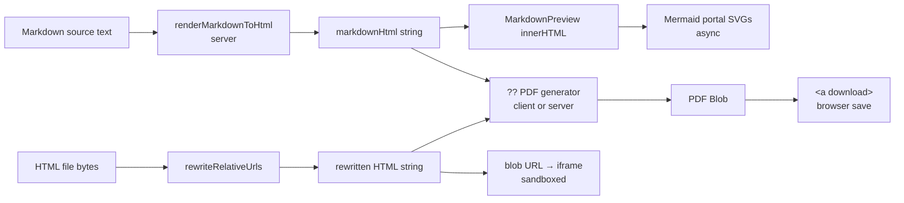
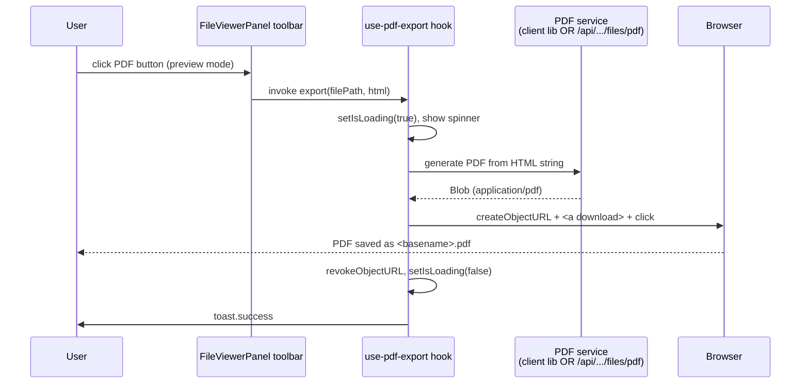

# Research Report: Single-Click "Download as PDF" from MD / HTML Preview

**Generated**: 2026-05-28T01:58:31Z
**Research Query**: "when looking at a md file or html page preview, i need a single click that creates a PDF of it and downloads it."
**Mode**: Plan-Associated (sub-feature of plan 084-random-enhancements-3)
**Location**: `docs/plans/084-random-enhancements-3/preview-pdf-download-research.md`
**FlowSpace**: Not used (standard Explore subagents — faster fan-out for this scope)
**Findings**: 65+ across 8 subagents (IA × 10, DC × 10, PS × 10, QT × 10, IC × 10, DE × 10, PL × 7, DB × 8)

---

## Executive Summary

### What the user wants

A single button in the existing file-viewer toolbar that, when clicked while the current file is being **previewed** (markdown rendered, or HTML rendered), generates a PDF of that rendered view and triggers a browser download. One click. No print dialog, no extra modal.

### What the codebase actually exposes today

- **One canonical viewer surface owns the placement**: `apps/web/src/features/041-file-browser/components/file-viewer-panel.tsx` already hosts a toolbar with mode toggles on the left (`[Source] [Rich] [Preview] [Diff]`) and a right-side action group (Refresh, Pop-out, Scroll-to-top, Word-wrap). The PDF button goes in the right-side group, conditionally rendered when `mode === 'preview'` (and, optionally, `'rich'`).
- **Markdown preview** is server-rendered via `apps/web/src/lib/server/markdown-renderer.ts → renderMarkdownToHtml(content: string): Promise<string>` and dropped into `<div ref>.innerHTML` by `markdown-preview.tsx`. Mermaid runs client-side via React portals **after** `innerHTML` is set — race condition risk for any naive DOM capture.
- **HTML preview** lives in `html-viewer.tsx` — a **sandboxed iframe** (`allow-scripts` only, opaque origin) loading a blob URL with relative asset references rewritten to authenticated `/api/.../files/raw?...&_at=<token>` URLs (FX011). The parent cannot inspect the iframe's rendered DOM, so PDF generation for HTML files must work from the original HTML source (pre-blob) or run server-side.
- **Zero PDF / printing libraries installed** in any `package.json` (apps/web, apps/cli, packages/*). This is a clean-slate dependency choice — bundle-size sensitive.
- **Download pattern is established**: `apps/web/src/features/041-file-browser/hooks/use-clipboard.ts:108-139` creates a Blob, `URL.createObjectURL`, `<a download>` element, click, revoke. Server-streamed downloads use `/api/workspaces/[slug]/files/raw?...&download=true` with `Content-Disposition: attachment`.

### Key Insights (top 3)

1. **The button placement and download mechanics are trivial** — proven patterns exist in this codebase (toolbar right-section, lucide `Download` icon, sonner toast, `Loader2` spinner for async state, blob+`<a download>` pattern, Tooltip wrapper). The work is essentially appending one button to one file (`file-viewer-panel.tsx`).
2. **The hard problem is the PDF generation itself.** Three architectural axes need a decision before any code is written:
   - **Client-side vs server-side rendering** (bundle cost vs. fidelity vs. dependency footprint)
   - **Library choice** (jsPDF+html2canvas, html2pdf.js, paged.js, headless Chromium via Puppeteer/Playwright, or just `window.print()` with print CSS)
   - **Fidelity scope** (does the PDF need to preserve Shiki syntax highlighting, mermaid SVGs, rendered tables, dark mode? Or is "looks reasonable, prints text" enough?)
3. **Mermaid + sandboxed HTML iframe are the two real engineering risks.** Mermaid renders asynchronously into the DOM after the React portal mounts — capturing the DOM the moment the user clicks may produce a PDF with empty `<div data-mermaid>` placeholders. The HTML iframe is opaque to the parent and uses ephemeral asset tokens; server-side regeneration is the clean answer there.

### Quick Stats

- **Surfaces touched**: 1 button file (new) + 1 toolbar edit (`file-viewer-panel.tsx`) + optional 1 server route + optional 1 hook (`use-pdf-export.ts`)
- **Domains touched**: primarily `file-browser`; possibly `_platform/viewer` (to formalize `renderMarkdownToHtml` as a public contract)
- **Existing PDF deps**: 0
- **Prior learnings directly on PDF/print/export**: 0 (clean topic; 7 adjacent learnings from plan 083 md-editor and plan 041 file-browser)
- **Complexity**: **Medium** — UI is small, generation is the design decision

---

## How It Currently Works

### Entry Points (where the button will live)

| Entry Point | Type | Location | Purpose |
|------------|------|----------|---------|
| `FileViewerPanel` toolbar — right action group | React subtree | `apps/web/src/features/041-file-browser/components/file-viewer-panel.tsx:354-394` | Hosts Refresh / Pop-out / Scroll-to-top. **This is where the PDF button goes.** |
| `MarkdownPreview` | Client component | `apps/web/src/features/041-file-browser/components/markdown-preview.tsx:37-191` | Receives pre-rendered HTML, sets `containerRef.innerHTML`, renders mermaid via portals. Holds the DOM we'd capture for client-side PDF generation. |
| `HtmlViewer` | Client component | `apps/web/src/features/041-file-browser/components/html-viewer.tsx:102-212` | Sandboxed iframe with rewritten asset URLs. Original HTML is in scope (line 157) **before** blob creation — capture point for HTML PDF. |
| `renderMarkdownToHtml(content)` | Server function | `apps/web/src/lib/server/markdown-renderer.ts:111-139` | Pure async function: markdown → sanitized HTML string. Reuse target for server-side PDF generation. |

### Core Execution Flow (today, viewing only)

1. **User selects markdown file** → `FileViewerPanel` receives `content` + `language='markdown'` + `markdownHtml` (server-rendered) as props.
2. **User clicks `[Preview]`** → `mode` becomes `'preview'` → `<MarkdownPreview html={markdownHtml} ...>` mounts.
3. **`MarkdownPreview` sets HTML** in a `useLayoutEffect`: `containerRef.current.innerHTML = html` (line 57).
4. **Second `useLayoutEffect`** scans the just-set DOM for `<div data-mermaid="true" data-mermaid-code="...">` markers, builds React portals into them, and `MermaidRenderer` renders the SVG **asynchronously** (no completion callback exposed today).
5. **HTML preview path** (`mode === 'preview' && contentType === 'text/html'` via `BinaryFileView`): fetch raw HTML → rewrite relative asset URLs through `/api/.../files/raw?...&_at=<token>` (token minted via `POST /api/bootstrap/asset-token`, 10-min TTL) → blob URL → iframe with `sandbox="allow-scripts"`.

### Data Flow (where the PDF feature would tap in)



The two preview pipelines converge at "we have an HTML string" before the PDF tap point. The PDF generator is the **only** new component.

---

## Architecture & Design

### Component Map (relevant subtree)

```
features/041-file-browser/
├── components/
│   ├── file-viewer-panel.tsx          ← toolbar lives here (modify)
│   ├── markdown-preview.tsx            ← consumes markdownHtml (read)
│   ├── html-viewer.tsx                 ← consumes raw HTML (read)
│   ├── binary-placeholder.tsx          ← reference: <a download> pattern
│   └── preview-cards/card-actions.tsx  ← reference: action button row
├── hooks/
│   ├── use-clipboard.ts                ← reference: handleDownload blob pattern
│   └── use-pdf-export.ts               ← NEW (if client-side path)
└── services/
    └── pdf-export.ts                   ← NEW (if server action)
                                         OR app/api/workspaces/[slug]/files/pdf/
```

### Design Patterns Available (use these, don't reinvent)

1. **Toolbar action button** — `<Tooltip><TooltipTrigger asChild><Button variant="ghost" size="icon">…</Button></TooltipTrigger><TooltipContent>Label</TooltipContent></Tooltip>`. Icon: `Download` or `FileDown` from `lucide-react`. (PS-01, PS-05, PS-10)
2. **Async-action UX** — `useState(false)` for `isLoading`, disable button, swap icon to `Loader2` with `animate-spin`. (PS-04)
3. **Feedback** — `toast.success('PDF downloaded')` / `toast.error(msg)` via `sonner` (already mounted in providers). (PS-03)
4. **Download trigger** — Blob → `URL.createObjectURL` → `<a download={name}>` → `.click()` → `URL.revokeObjectURL`. (PS-06, IA-06)
5. **Filename derivation** — `filePath.split('/').pop().replace(/\.[^.]+$/, '') + '.pdf'`. (PS-07)

### System Boundaries

- **`file-browser` owns**: the button, the trigger UX, the call site
- **`_platform/viewer` owns**: the markdown-to-HTML pipeline (`renderMarkdownToHtml`)
- **`_platform/auth` and `_platform/file-ops` apply**: if a server action is added, it MUST reuse `requireAuth()` + the existing path-traversal guards from `readFileAction`

---

## Dependencies & Integration

### Currently Installed (relevant subset)

| Package | Version | Purpose | Reuse for PDF? |
|---------|---------|---------|----------------|
| `unified`, `remark-parse`, `remark-gfm`, `remark-frontmatter`, `remark-rehype`, `rehype-stringify`, `rehype-slug` | 4.x – 11.x | Markdown pipeline (via `renderMarkdownToHtml`) | **Yes** — its HTML string output is the PDF source material |
| `@shikijs/rehype` | 3.21.0 | Syntax highlighting | **Yes** — emits inline `style` + CSS-variable fallbacks; PDF renderer must handle inline styles (CSS variables may not transfer) |
| `react-markdown` | (transitive) | Client-side markdown component | Indirect — same output as server pipeline |
| `mermaid` (transitive via remark-mermaid plugin) | — | Diagram rendering | **Risk** — runs client-side, async, no completion callback exposed |
| `dompurify` | ≥3.3.2 (pnpm override) | HTML sanitization | Available transitively if defensive sanitization is needed before PDF conversion |
| `lucide-react`, `sonner`, shadcn `Button` + `Tooltip` | various | UI primitives | **Yes** — direct reuse |
| `@tiptap/*` | 2.27+ | Rich/WYSIWYG editor | Indirect — if PDF must include rich-mode output, serialize editor HTML via `editor.getHTML()` |

### NOT Installed (the decision space)

| Candidate | Type | Approx. size (gz) | Pros | Cons |
|-----------|------|-------------------|------|------|
| `jspdf` + `html2canvas` | Client | ~200 KB + ~100 KB | No server needed; works fully offline | Rasterizes content (text becomes image-ish); large bundle; mermaid SVGs OK if rendered; Shiki CSS vars problematic |
| `html2pdf.js` | Client | ~20 KB wrapper (pulls jspdf+html2canvas) | Single import; convenience API | Same fidelity issues as the underlying stack |
| `paged.js` | Client | ~500 KB | True CSS Paged Media; best print fidelity | Heavy; opinionated |
| `puppeteer` / `playwright` | Server | 0 KB client; ~300 MB Chromium binary | True browser rendering — Shiki, mermaid, fonts all "just work" | New deployment dependency (Chromium); slow cold-start; not currently in the project |
| `window.print()` (DOM) | Browser-native | 0 KB | No deps; perfect fidelity | Opens system print dialog — **not "single click"**, fails the spec |
| `@react-pdf/renderer` | Client | ~600 KB | Pure-JS; no rasterization | Requires re-implementing the layout (it doesn't render existing HTML) |
| Server route w/ `@sparticuz/chromium` + Playwright | Server | Lambda-friendly | Works on Vercel-style deploys | Cold-start cost; complex; overkill for V1 |

### What Depends on This Today

Nothing. PDF export is a net-new capability. The viewer pipeline, file-browser surface, and download infrastructure are all stable upstream.

### Integration Architecture (proposed shape — to be finalized in spec)



---

## Quality & Testing

### Existing Test Patterns (reusable)

- **Toolbar action tests** (`test/unit/web/features/_platform/viewer/wysiwyg-toolbar.test.tsx`): query button by `data-testid^="toolbar-"`, simulate click, assert handler fires. (QT-07)
- **Viewer toggle tests** (`test/unit/web/components/viewers/markdown-viewer.test.tsx`, 605 lines): React Testing Library + `user-event`, "Test Doc" 5-field comment format. (QT-01)
- **Blob / URL.createObjectURL patterns are already used in production code** (HtmlViewer, PdfViewer, useClipboard); jsdom can render the wiring but **cannot verify an actual download**. (QT-04)
- **Constitutional constraint**: NO `vi.mock`, NO `vi.spyOn` — use real Fakes injected as deps. PDF generation should be testable via a fake `PdfGenerator` interface. (QT-05)

### Test Strategy for PDF Feature

| Layer | Approach | Tool | What it verifies |
|-------|----------|------|------------------|
| Unit | Hook unit test with fake generator | vitest + RTL | Loading state transitions, toast on success/failure, filename derivation, blob creation, anchor click invocation |
| Unit | Toolbar render test | vitest + RTL | Button is present/absent per mode, `aria-label`, `data-testid`, disabled state during loading |
| Integration | Harness (Playwright/CDP) | `docs/project-rules/harness.md` (legacy filename — note: doc still uses `harness.md`, not yet migrated to `engineering-harness.md`) | Real button click → real PDF file appears in downloads dir → optionally `pdf-parse` to assert text content |
| CI gate | 50% coverage threshold | vitest + v8 coverage | New code must clear the threshold (`vitest.config.ts:65-71`) |

### Known Gaps

- jsdom cannot execute `window.print()` nor verify file system downloads. PDF content assertions need either the harness or a separated pure-function generator. (QT-04)
- `pdf-viewer.tsx` and `binary-placeholder.tsx` ship without tests — same "passive download" pattern. Acceptable precedent if the PDF button is similarly thin. (QT-10)

---

## Modification Considerations

### ✅ Safe to Modify

- **`file-viewer-panel.tsx` right-side action group** (lines 354–394) — conditional render is the established pattern; FX012/FX011 history shows toolbar edits land cleanly.
- **Add a new hook** `apps/web/src/features/041-file-browser/hooks/use-pdf-export.ts` alongside `use-clipboard.ts` — feature-folder convention, isolated, easy to test in isolation.

### ⚠️ Modify with Caution

- **`markdown-preview.tsx`** — if PDF generation needs DOM capture **after** mermaid has rendered, you may need to add a completion signal. Currently `MermaidRenderer` has no callback. Adding one is feasible but touches a hot path. Prefer regenerating HTML server-side and rendering mermaid in the PDF pipeline instead of capturing the live DOM. (IA-10)
- **`renderMarkdownToHtml`** — formalizing it as a `_platform/viewer` public contract is a clean change but requires updating `docs/domains/_platform/viewer/domain.md § Contracts` and `docs/domains/domain-map.md`. (DB-08)

### 🚫 Danger Zones

- **HTML iframe sandbox** — DO NOT attempt to read DOM from the sandboxed iframe to feed into a client-side PDF lib. Opaque origin will block you. For HTML files, run PDF generation against the original HTML source (before blob URL creation) or do server-side conversion. (IA-04, DC-03)
- **Asset token security** — if HTML files reference relative assets and the PDF is generated server-side, do NOT bake the user's asset token into a long-lived PDF; mint a fresh token for the request, fetch, and inline assets as data URIs in the generated PDF. (DC-10)

### Extension Points (designed for this kind of work)

- **Toolbar action slot** — `file-viewer-panel.tsx` already has conditional renders gated on `mode` and binary `category`; add another `{(mode === 'preview') && <PDFButton ... />}` clause.
- **Tiptap rich-mode HTML** — `editor.getHTML()` exposes serialized HTML if you want PDF support in `[Rich]` mode too. (IA-09)

---

## Prior Learnings (From Previous Implementations)

> ✓ 7 entries surfaced from plan 083 (md-editor) and plan 041 (file-browser) — all `decision` / `insight` types. **Zero direct precedent for PDF / print / export work** in this codebase. The relevant adjacent lessons:

### 📚 PL-01: Toolbar action button pattern is established (plan 083, Phase 2)
**Source**: `docs/plans/083-md-editor/tasks/phase-2-toolbar-shortcuts/tasks.md` · 2026-04-18
**Action**: Use shadcn `<Button variant="ghost" size="icon">`, `data-testid="toolbar-<action-id>"`, ARIA labels, `role="toolbar"` on container. The WYSIWYG toolbar config registry (`apps/web/src/features/_platform/viewer/lib/wysiwyg-toolbar-config.ts`) is the model for action registration if you want consistency with the Rich-mode toolbar.

### 📚 PL-02: Heavy deps go behind `dynamic({ ssr: false })` (plan 083, Phase 1)
**Source**: `docs/plans/083-md-editor/tasks/phase-1-foundation/tasks.md`
**Action**: If the PDF library is >50 KB gz, lazy-load it. The cleanest pattern is `await import('html2pdf')` **inside the button click handler**, not at module top. This keeps `file-viewer-panel.tsx`'s initial bundle untouched. Plan 083 enforces a bundle-size acceptance gate (Phase 6.7) — assume the same scrutiny here.

### 📚 PL-03: Editor instance is accessible via ref; no new composition needed (plan 083, Phase 5)
**Source**: `docs/plans/083-md-editor/tasks/phase-5-fileviewerpanel-integration/execution.log.md`
**Action**: If supporting PDF from Rich mode, call `editor.storage.markdown.getMarkdown()` (or `editor.getHTML()`) on `richEditorRef.current`. The editor ref is already wired in `file-viewer-panel.tsx` lines 470–499. No new DOM wrapper.

### 📚 PL-04: File metadata + path security pattern (plan 041, Phase 4)
**Source**: `docs/plans/041-file-browser/tasks/phase-4-file-browser/tasks.md`
**Action**: If you add a server endpoint, reuse the realpath + workspace-root verification from `readFileAction`. NEVER trust client-provided paths.

### 📚 PL-05: `'use client'` boundary (plan 083, Phase 1 gotcha)
**Source**: `docs/plans/083-md-editor/tasks/phase-1-foundation/tasks.md`
**Action**: `file-viewer-panel.tsx` is already `'use client'`; no new boundary issues. The PDF button onClick stays in the client tree.

### 📚 PL-06: Library selection rigor — apply Tiptap-era gates (plan 083 research)
**Source**: `docs/plans/083-md-editor/research-dossier.md`, `md-editor-spec.md`
**Action**: Tiptap was picked over Milkdown / BlockNote / MDXEditor / Lexical via explicit gates: bundle size, React-19/StrictMode compat, round-trip fidelity, headless API. Mirror this discipline for PDF: write the gates first (size cap, fidelity scope, server vs client, mermaid handling), then evaluate candidates.

### 📚 PL-07: Harness gotcha — don't `waitForLoadState('networkidle')` (plan 083, Phase 5)
**Source**: `docs/plans/083-md-editor/tasks/phase-5-fileviewerpanel-integration/execution.log.md`
**Action**: For harness verification, wait on `data-testid` selectors and use `page.on('download')` to assert the download fired. Add `data-testid="file-viewer-download-pdf"` on the button.

### Prior Learnings Summary

| ID | Type | Source plan | One-liner | Action |
|----|------|-------------|-----------|--------|
| PL-01 | insight | 083-md-editor | Toolbar = shadcn Button + testid + ARIA | Reuse pattern verbatim |
| PL-02 | insight | 083-md-editor | Lazy-load heavy deps inside handler | `await import()` in onClick |
| PL-03 | insight | 083-md-editor | Editor ref accessible via existing wiring | `editor.getHTML()` for Rich mode |
| PL-04 | decision | 041-file-browser | Path security via `readFileAction` pattern | Reuse if server-side endpoint |
| PL-05 | gotcha  | 083-md-editor | `'use client'` already in scope | No new boundary work |
| PL-06 | decision | 083-md-editor | Library selection gated on size + fidelity + compat | Define gates before lib choice |
| PL-07 | workaround | 083-md-editor | Harness `networkidle` deadlocks under HMR | Use testid + `page.on('download')` |

---

## Domain Context

### Existing Domains Relevant to This Research

| Domain | Relationship | Relevant Contracts | Key Components |
|--------|-------------|--------------------|----------------|
| `file-browser` | **Direct host** — owns the button surface, the trigger UX, and (if added) the server endpoint | `FileViewerPanel` component contract; potential new `downloadAsPdf` server action | `file-viewer-panel.tsx`, `markdown-preview.tsx`, `html-viewer.tsx`, `use-clipboard.ts` |
| `_platform/viewer` | **Consumed** — supplies the HTML rendering pipeline | `renderMarkdownToHtml(content)` — currently de-facto public, not formalized in domain.md Contracts table | `markdown-renderer.ts`, `markdown-viewer.tsx`, `markdown-server.tsx` |
| `_platform/auth` | **Reused via existing edge** — if a server action is added | `requireAuth()`, middleware protection | (existing) |
| `_platform/file-ops` | **Reused via existing edge** — for path security if server-side | `IPathResolver` realpath checks | (existing) |
| `_platform/events` | **Not involved** | — | Synchronous user action, no SSE/pubsub |

### Domain Map Position

After this feature lands, the domain map would gain **at most one new edge**, only if `renderMarkdownToHtml` is formally promoted to a public contract:

```
fileBrowser -->|"renderMarkdownToHtml (server)"| viewer
```

If PDF generation is done entirely in the client from the already-passed `markdownHtml` prop, even this edge isn't required — the call would be encapsulated inside `MarkdownPreview` / `FileViewerPanel` without crossing the domain boundary.

### Potential Domain Actions

- **Most likely**: No new domain. Feature fits cleanly into `file-browser` composition.
- **If server-side PDF is chosen**: Formalize `renderMarkdownToHtml` in `_platform/viewer/domain.md § Contracts` (it's already used implicitly).
- **Only if PDF export becomes a multi-consumer capability later** (agents exporting reports? workflow exporting outputs?): extract `_platform/export` or `_platform/pdf` infrastructure domain. Premature for V1.

---

## Critical Discoveries

### 🚨 Critical Finding 01: Mermaid renders asynchronously with no completion signal
**Impact**: Critical for client-side DOM-capture PDF strategies
**Source**: IA-10
**What**: `markdown-preview.tsx` lines 73–95 mount mermaid via React portals **after** `innerHTML` is set, and `MermaidRenderer` has no exposed completion callback.
**Why it matters**: A client-side library that captures the rendered DOM at click time will see empty `<div data-mermaid>` placeholders. The PDF would show empty boxes where diagrams should be.
**Required action**: Either (a) prefer server-side PDF generation that re-runs mermaid headlessly, (b) add a `MutationObserver` or completion callback before capture, or (c) document mermaid-in-PDF as a non-goal for V1.

### 🚨 Critical Finding 02: HTML iframe is opaque to the parent (sandboxed origin)
**Impact**: Critical for HTML preview PDF
**Source**: IA-04, DC-03
**What**: `html-viewer.tsx:205` mounts an iframe with `sandbox="allow-scripts"`. The parent cannot reach into the iframe's document.
**Why it matters**: Any client-side "screenshot the iframe" approach is dead-on-arrival. Asset URLs are rewritten with ephemeral tokens; the rewritten HTML is the only client-side artefact available, and using it directly skips the asset-token flow.
**Required action**: For HTML files, PDF generation must operate against the original HTML source string (line 157 of `html-viewer.tsx`, before blob URL creation) — and if assets need to embed, do so server-side with a fresh asset token.

### 🚨 Critical Finding 03: Library choice is unresolved AND consequential
**Impact**: High — drives bundle size, deployment surface, fidelity
**Source**: DC-01, DC-06, DC-07, PL-06
**What**: Zero PDF libraries are installed; no print CSS exists; no export UI precedent exists in the codebase.
**Why it matters**: This choice locks in bundle cost (~20 KB to 600 KB gz client-side, or +300 MB Chromium binary server-side), fidelity (rasterized vs. true vector PDF), and operational model (offline-capable client lib vs. server route with its own caching/limits/auth).
**Required action**: Resolve via external research (deepresearch prompt at the end of this document) BEFORE the spec phase, OR explicitly accept the decision deferral and pick the lightest option (`html2pdf.js` ~20 KB shim + dynamic import) for V1 with a known list of fidelity tradeoffs.

### 🚨 Critical Finding 04: "Single click" eliminates `window.print()`
**Impact**: Medium — closes a tempting zero-dep path
**Source**: User intent in query (`"single click that creates a PDF of it and downloads it"`) + DC-07
**What**: `window.print()` would be the cleanest zero-dep solution but invokes the OS print dialog, which is not a download and is not a single click.
**Why it matters**: Confirms the feature requires real PDF generation, not a print delegation.
**Required action**: Treat `window.print()` as out of scope unless the spec explicitly relaxes "single click" to "single click then default-confirm in print dialog" — which I do NOT recommend without user confirmation.

---

## Recommendations

### If Building This Feature (V1, lean)

1. **Button placement**: `file-viewer-panel.tsx` right-side action group, conditional on `mode === 'preview'`. Add `mode === 'rich'` later if Rich-mode PDF is in scope (uses `editor.getHTML()`). Skip for `'source'` and `'diff'` modes in V1.
2. **Library candidate (recommended starting point)**: `html2pdf.js` — wraps `jspdf`+`html2canvas`, ~20 KB shim, `await import()`-able. Accept its fidelity limits (Shiki may degrade; mermaid SVGs OK if pre-rendered).
3. **Path**: Client-side first. Receive `markdownHtml` (already a prop) → write to an off-screen container → `html2pdf().from(container).save(name)` (or `.outputPdf('blob')` for blob+download control). For HTML files: capture the original source string from before iframe blob creation.
4. **Mermaid handling**: V1 — document as a known limitation (mermaid blocks may render as empty boxes). V2 — add a render-complete signal in `MarkdownPreview` and gate the button until ready, OR move to server-side rendering.
5. **Filename**: `basename(filePath).replace(/\.(md|markdown|html|htm)$/i, '') + '.pdf'`. For untitled/draft content fall back to `'document.pdf'`.
6. **UX states**: `Loader2` spinner + disabled button during async, `toast.success('PDF downloaded')` / `toast.error('PDF export failed: <msg>')` on completion.
7. **Domain stance**: Keep V1 entirely inside `file-browser`. Do NOT add server endpoints unless the V1 client path proves insufficient.
8. **Tests**: Hook unit test with a Fake generator (no `vi.mock`); harness test using `data-testid="file-viewer-download-pdf"` + `page.on('download')`.

### If Choosing a Different Strategy

- **Server-side (Puppeteer/Playwright)**: ONLY if fidelity is non-negotiable (Shiki, mermaid, mathjax all must render correctly). Adds Chromium dep — confirm deployment target supports it. Reuse `renderMarkdownToHtml`; add `/api/workspaces/[slug]/files/pdf?file=...&worktree=...` route with `requireAuth()` + path security.
- **Print CSS + relaxed "single click"**: If the user accepts a print-dialog flow, `window.print()` with a `@media print` stylesheet + `printable` body class is zero deps and perfect fidelity. **Confirm with user before considering — spec wording rules it out today.**

### If Refactoring Adjacent Surfaces (not required)

- Formalize `renderMarkdownToHtml` in `_platform/viewer/domain.md § Contracts` and update `domain-map.md`. Useful regardless of PDF strategy; clarifies a contract that's already in use.
- Add a `MermaidRenderer` completion callback. Useful for PDF and for any future feature that needs "preview is fully rendered" semantics.

---

## External Research Opportunities

### Research Opportunity 1: PDF library selection for markdown / HTML preview export

**Why needed**: The codebase has no PDF dependency today and no prior decision record. The choice locks in bundle size, fidelity ceiling, and deployment surface — all the criteria plan 083 used to gate the Tiptap selection.
**Impact on plan**: Determines whether this feature is a ~25 KB client-side addition, a ~200 KB client-side addition, or a server-side route with Chromium. Drives the spec's Non-Goals and the test strategy.
**Source findings**: DC-01, DC-06, IA-03, PL-06, QT-06

**Ready-to-use prompt:**
```
/deepresearch "Evaluate PDF generation libraries for a Next.js (App Router, React 19) app that needs to convert pre-rendered markdown HTML and pre-rendered HTML strings into a downloadable PDF from a single button click. Context:
- The HTML source is already produced server-side by a remark/rehype pipeline (remark-gfm, remark-mermaid, @shikijs/rehype dual-theme).
- Mermaid diagrams render client-side via React portals AFTER innerHTML is set (no completion callback today).
- HTML files are displayed in a sandboxed iframe (opaque origin) — parent has the raw HTML string but cannot reach into the iframe.
- Constitutional constraint: NO vi.mock in tests; library must be replaceable with a Fake injected via interface.
- Bundle-size sensitive: Tiptap was capped at ~120 KB gz lazy-loaded; PDF lib should aim for similar or smaller via dynamic import.
- Deployment: standard Next.js (server actions + API routes); Chromium binaries add ~300 MB and need confirmation.

Compare these candidates on bundle size (gz, lazy-loadable), Shiki/syntax-highlight CSS fidelity, mermaid SVG fidelity, table/list fidelity, dark-mode handling, maintenance status, React 19 compatibility, and serverless deploy compatibility:
1. html2pdf.js (jspdf + html2canvas)
2. jspdf + html2canvas directly
3. paged.js
4. @react-pdf/renderer
5. puppeteer with @sparticuz/chromium (serverless)
6. playwright headless
7. wkhtmltopdf (system binary)
8. Native window.print() with @media print CSS (excluded by 'single click' UX — confirm we shouldn't reconsider)

For the recommended option, provide: dynamic-import snippet, minimal API call, expected output fidelity for Shiki + mermaid + GFM tables, and known issues. Prefer 2024+ benchmarks."
```
**Results location**: `docs/plans/084-random-enhancements-3/external-research/pdf-library-selection.md`

### Research Opportunity 2: Mermaid render-complete detection in the existing markdown-preview pipeline

**Why needed**: `MermaidRenderer` is opaque to the parent. Without a completion signal, any client-side DOM capture risks empty diagrams. The current codebase doesn't expose this — best practice (MutationObserver vs. mermaid API hooks vs. patching `MermaidRenderer`) is not obvious from the code.
**Impact on plan**: Determines whether mermaid is V1-supported or V2-deferred.
**Source findings**: IA-10, DC-02

**Ready-to-use prompt:**
```
/deepresearch "Given a React 19 component that uses react-mermaid2 or @mermaid-js/mermaid React patterns rendered via React portals, what is the cleanest 2024+ pattern to detect when ALL mermaid diagrams on a page have finished rendering to SVG, so that a downstream consumer can capture the DOM safely? Compare:
1. MutationObserver watching for SVG insertion under each [data-mermaid='true'] container
2. Wrapping the mermaid renderer with a render-complete callback prop
3. Using mermaid.run() return promise directly
4. Polling for SVG count vs. expected count

Include a minimal TypeScript pattern showing the recommended approach integrated with an existing 'render markdown → set innerHTML → portal mount' component."
```
**Results location**: `docs/plans/084-random-enhancements-3/external-research/mermaid-render-complete.md`

---

## Workshop Opportunities

- **Agent harness migration**: The legacy `docs/project-rules/harness.md` still uses the legacy filename. The harness skill recommends migrating to `engineering-harness.md`. This is unrelated to the PDF feature but is a passive note. Do NOT touch in this research step.
- **PDF library evaluation workshop**: If Research Opportunity 1 leaves residual ambiguity, a `/plan-2c-v2-workshop` on "PDF library tradeoffs for Chainglass viewer surfaces" would consolidate the decision before the spec.

---

## Engineering Harness Status

**Part 1 — Engineering substrate**: PRESENT.
- Boot command: `just dev` (Next.js on PORT, terminal WS sidecar on PORT+1500).
- Healthy: yes — `justfile` has a stale-process pre-flight check; project type is multi-app pnpm monorepo (Next.js + CLI).

**Part 2 — Agent harness governance**: `docs/project-rules/harness.md` (legacy filename — migration to `engineering-harness.md` recommended but out of scope here).
- Maturity: L3 per plan-083 references (Boot + browser interaction via Playwright/CDP + structured evidence + CLI SDK).
- Boot/Interact/Observe loop is documented and exercised by recent plans (083, 084 sub-features).
- For this feature: harness can verify the download via `page.on('download')` and assert filename/size; PDF content assertion requires `pdf-parse` (not currently installed — would be a dev-only dep if test assertions need PDF text).

---

## Recommended Next Steps

The user's last explicit request — explore "single click PDF of MD/HTML preview" — has produced this dossier. From here:

1. **(Recommended) External research first** — run Research Opportunity 1's `/deepresearch` prompt to lock in the PDF library before specifying. Saves rework. Optionally also run Opportunity 2 if mermaid fidelity is required in V1.
2. **Then `/plan-1b-v3-specify-and-clarify "Single-click PDF download from MD/HTML preview"`** — creates the spec with the external research already in context. The spec should explicitly resolve:
   - Modes supported (Preview only? + Rich?)
   - Mermaid scope (V1 supported, V1 known-limitation, or V2 deferred)
   - HTML-preview scope (same button on HTML files? V1 or V2?)
   - Library + bundle-size acceptance gate
   - Test strategy (harness assertion + unit hook test)
3. **OR skip external research** — accept the recommended starting point (`html2pdf.js`, client-side, mermaid deferred to V2) and go straight to `/plan-1b-v3-specify-and-clarify`. Faster path; you'll revisit the lib choice if fidelity proves inadequate.

---

**Research Complete**: 2026-05-28T01:58:31Z
**Report Location**: `/Users/jordanknight/substrate/084-random-enhancements-3/docs/plans/084-random-enhancements-3/preview-pdf-download-research.md`
