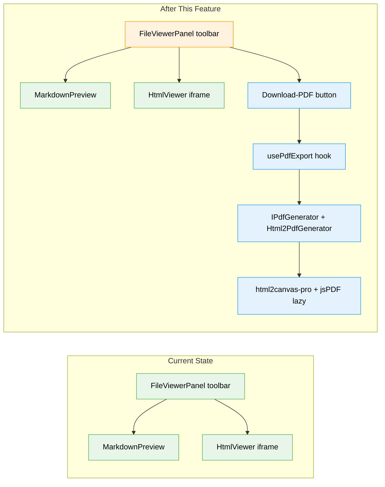
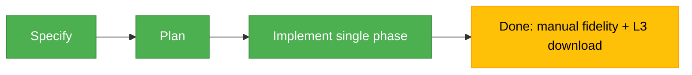

# Flight Plan: Single-Click PDF Download from MD / HTML Preview

**Spec**: [preview-pdf-download-spec.md](./preview-pdf-download-spec.md)
**Plan**: [preview-pdf-download-plan.md](./preview-pdf-download-plan.md)
**Generated**: 2026-05-28
**Status**: Implementation complete — manual fidelity + L3 download verification pending

---

## The Mission

**What we're building**: A single button in the file-viewer toolbar that, while you're previewing a markdown file or an HTML page, turns that rendered view into a PDF and downloads it — one click, no print dialog. Generation happens entirely in the browser via `html2canvas-pro` + `jsPDF`, loaded only on the first click so the page's initial bundle is untouched.

**Why it matters**: Today there is no way to get a shareable, portable copy of a rendered doc out of the app. This closes that gap with the lightest possible footprint.

---

## Where We Are → Where We're Headed

```
🔵 unchanged   🟢 enhanced   🟡 modified   🔴 new

TODAY:                                  AFTER this feature:
0 PDF libraries                         1 PDF library (lazy, ~45 KB gz, 0 eager cost)
No export affordance anywhere           1-click "Download as PDF" in preview

🔵 Markdown preview (renders)           🔵 Markdown preview (renders, unchanged)
🔵 HTML preview (sandboxed iframe)      🔵 HTML preview (unchanged; source string reused)
🟡 FileViewerPanel toolbar              🟡 FileViewerPanel toolbar (+ PDF button, preview mode)
❌ No PDF generation                     🔴 usePdfExport hook + IPdfGenerator seam
❌ No test seam for export               🔴 FakePdfGenerator for unit tests
```



**Legend**: existing (green, unchanged) | changed (orange, modified) | new (blue, created)

---

## Scope

**Goals**:
- One-click "Download as PDF" from the markdown preview surface.
- One-click "Download as PDF" from the HTML page preview surface.
- No system print dialog; file downloads as `<basename>.pdf`.
- Zero increase to the eager bundle (PDF lib lazy-loaded on first click).
- PDF visually matches the on-screen preview, including syntax highlighting and the active light/dark theme.
- Clear async feedback: spinner while working, success/failure toast on completion.

**Non-Goals**:
- Selectable/copyable text in the PDF (html2pdf rasterizes — accepted).
- Server-side generation / a PDF API endpoint (deferred).
- Export from `[Source]`, `[Diff]`, or `[Rich]` modes (Rich is a possible follow-up).
- Page-size/margin/orientation UI, headers/footers, watermarks, batch export.
- Perfect mermaid fidelity (V1 accepts known limitation + ~300ms stopgap).
- New documentation.

---

## Journey Map



**Legend**: green = done | yellow = active | grey = not started

---

## Phases Overview

**Mode: Simple** — single phase, 8 tasks. See [plan](./preview-pdf-download-plan.md#tasks).

| # | Task | CS |
|---|------|----|
| T001 | Add deps (`html2pdf.js`, `dompurify`, types) | CS-1 |
| T002 | `IPdfGenerator` + `Html2PdfGenerator` (element + sanitized-html paths) + `FakePdfGenerator` | CS-2 |
| T003 | `use-pdf-export` hook — download, async state, toast, filename, mermaid delay | CS-2 |
| T004 | Markdown PDF button in main toolbar + preview-wrapper ref (live-DOM capture) | CS-2 |
| T005 | HTML PDF button in `HtmlViewer` toolbar + store fetched source | CS-2 |
| T006 | Unit tests (Fake, no `vi.mock`) | CS-2 |
| T007 | Harness verify both surfaces (`page.on('download')`) | CS-2 |
| T008 | Manual fidelity pass + domain.md update | CS-1 |

> Note: capture strategy refined during planning — markdown captures the **live** preview node (mermaid SVGs + theme already correct), HTML stages a **DOMPurify-sanitized** source string (untrusted content).

---

## Acceptance Criteria

- [ ] "Download as PDF" button visible in the viewer toolbar in **preview** mode (MD + HTML), with `aria-label` + tooltip.
- [ ] Clicking it on a markdown preview downloads `<basename>.pdf` with rendered headings, lists, GFM tables, and highlighted code — no print dialog.
- [ ] Clicking it on an HTML preview downloads `<basename>.pdf` from the original HTML source string (not the sandboxed iframe).
- [ ] PDF reflects the active light/dark theme; code-block colors match the visible preview.
- [ ] Spinner + disabled button while generating; success/error toast on completion.
- [ ] Button absent in `[Source]` and `[Diff]` modes.
- [ ] Filename = source basename with extension replaced by `.pdf`; fallback `document.pdf`.
- [ ] Eager bundle does not grow — `html2pdf.js` fetched only on first click.

---

## Key Risks

| Risk | Mitigation |
|------|-----------|
| Shiki dual-theme CSS variables don't resolve in a detached staging node | Bake computed colors to inline styles before capture |
| Mermaid diagram not rendered at capture time → empty box | ~300ms pre-capture delay; accepted V1 limitation, documented |
| Wide GFM tables truncate in portrait | `table-layout: fixed` + word-break, auto-landscape when a table exceeds content width |
| HTML files with relative assets won't embed remote assets client-side | V1 accepts text/layout fidelity without guaranteed asset embedding |
| jsdom cannot verify a real PDF or download | Logic tested behind `IPdfGenerator` with a Fake; real download verified via L3 harness |

---

## Flight Log

<!-- Updated by /plan-6 and /plan-6a after each phase completes -->

### Single phase (T001–T008) — Implementation complete (2026-05-28)

**What was delivered**: Single-click "Download as PDF" on both preview surfaces, fully
client-side via lazy-loaded `html2pdf.js`. Implemented with a `code-review-companion`
running in parallel (Power-On-Mode) reviewing every commit.

**Key changes**:
- `lib/pdf-generator.ts` (NEW) — `IPdfGenerator` seam + `Html2PdfGenerator` (live-element
  capture for markdown; DOMPurify-sanitized off-screen staging for untrusted HTML) +
  `FakePdfGenerator`. Both heavy deps dynamic-import-only.
- `hooks/use-pdf-export.ts` (NEW) — filename, async/spinner state, toast, ~300ms mermaid
  delay, single-flight + unmount guards.
- `file-viewer-panel.tsx` / `html-viewer.tsx` — PDF buttons in each toolbar.
- 39 unit/component tests (no `vi.mock` of own code; no DI container per ADR-0013).

**Companion findings (all resolved)**: F001 (dompurify range → `^3.3.2`), **F002 HIGH**
(forbid `<style>` so untrusted CSS can't leak into the app document), F003 (doc wording),
**F004 HIGH** (no stale-source export on file switch). The companion caught two real HIGH
issues before release.

**Decisions**: `<style>` blocks stripped from untrusted HTML (security > fidelity in V1);
original pre-rewrite HTML exported so the `&_at=` token never leaks (Finding 11).

**Remaining (manual / live env)**: visual-fidelity pass (light/dark, wide tables, mermaid)
+ the L3 `page.on('download')` harness assertion — checklist in `preview-pdf-download.execution.log.md`.

### FX-PDF-1 — Post-ship runtime fix: engine swap (2026-05-28)

The shipped `html2pdf.js` engine could not generate a PDF in the live app: it bundles stock
`html2canvas@1.4.1`, which throws on the Tailwind v4 theme's CSS Color 4 values
(`lab()`/`oklch()` from `getComputedStyle`), and its prebuilt webpack interop does not compose
with Turbopack. Replaced it with **`html2canvas-pro` + `jsPDF` called directly** (own A4
pagination in `canvasToA4Pdf`); deps stay dynamic-import-only (AC-8). Added error logging to the
previously-silent `catch`. **Verified live via browser_eval**: markdown export downloads a real
2.2 MB PDF with 0 console errors (closes the markdown L3-download item). Full detail + root-cause
trace in `preview-pdf-download.execution.log.md` § FX-PDF-1.
