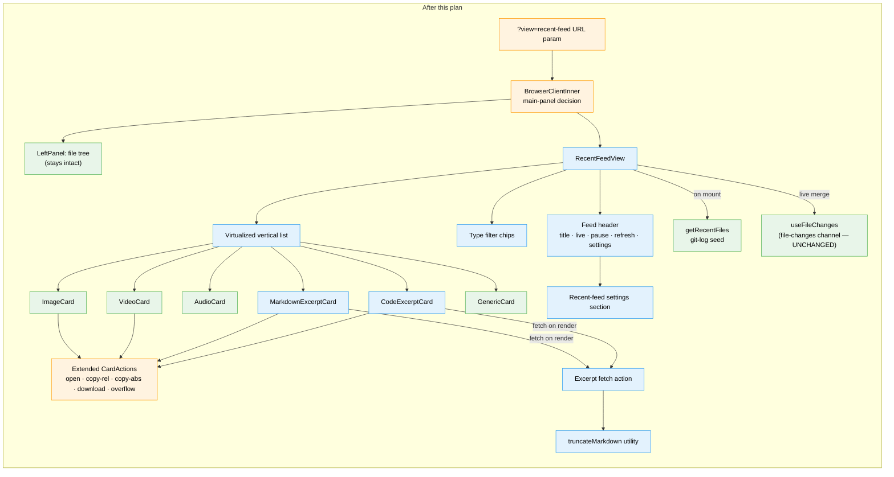
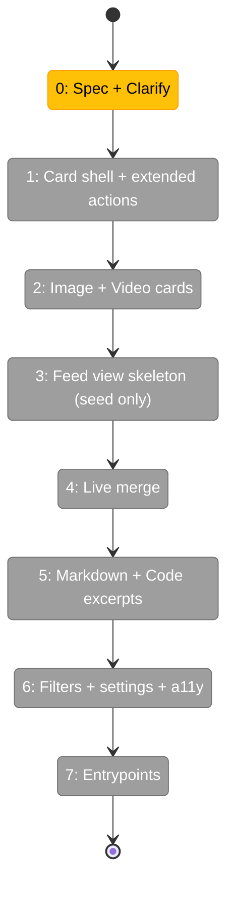

# Flight Plan: Recent Changes Feed

**Spec**: [recent-changes-feed-spec.md](./recent-changes-feed-spec.md)
**Research**: [recent-changes-feed-research.md](./recent-changes-feed-research.md)
**UI Workshop**: [workshops/005-recent-changes-feed-ui.md](./workshops/005-recent-changes-feed-ui.md) — authoritative design
**Plan**: [recent-changes-feed-plan.md](./recent-changes-feed-plan.md)
**Generated**: 2026-05-03
**Status**: VALIDATED WITH FIXES (Simple Mode, 36 tasks) — ready for `/plan-6-v2-implement-phase-companion`

---

## The Mission

**What we're building**: A new main-panel view in the file browser that shows a vertical, scrolling stack of the most-recently-changed files repo-wide — each card rendered with a type-specific media-rich preview (images inline, videos with native controls, markdown excerpts, code excerpts). The newest change is always at the top; live updates promote files into place via the **existing** `file-changes` SSE channel. Each card surfaces copy-relative-path, copy-absolute-path, download, open, and overflow actions inline.

**Why it matters**: The motivating flow is media review — generating a batch of images or videos in the workspace and wanting to scan the outputs without per-file click-back-click-back. The existing surfaces (file tree, working-changes list, folder gallery) all fall short for this: tree is text-only, working-changes is text-only, folder gallery is folder-scoped. The feed fills the "scroll a wall of stuff I just made, with the media playing inline, repo-wide" gap. It also works as a high-bandwidth "what's been happening" view for returning to a repo after time away.

---

## Where We Are → Where We're Headed

```
TODAY:                                          AFTER this plan:
─────────────────────────────────────────       ─────────────────────────────────────────
File tree + working-changes list = text only    Main panel can swap to a media-rich feed
Folder gallery = folder-scoped only             Feed is repo-wide, newest-first, live
"Where's that image I just generated?"          One scroll → see every recent output
  → click around the tree                       Inline copy-rel / copy-abs / download
"What's changed since I left?"                  Type filters, pause, settings, keyboard nav
  → scan filenames, click each one              Tree stays put; click feed card → file viewer

🔵 _platform/events file-changes SSE channel    🔵 file-changes SSE channel (UNCHANGED — consumed)
🔵 useFileChanges hook                          🔵 useFileChanges hook (UNCHANGED — consumed)
🔵 getRecentFiles(worktree, limit) git seed     🔵 getRecentFiles (UNCHANGED — consumed)
🔵 detectContentType + preview cards            🔵 preview cards (UNCHANGED — composed)
🔵 Shiki highlightCode action                   🔵 Shiki action (UNCHANGED — consumed)
🔵 Raw-file API with Range support              🔵 Raw-file API (UNCHANGED — consumed)
🟡 fileBrowserParams                            🟡 + view: 'recent-feed' enum
🟡 BrowserClientInner main-panel decision       🟡 + view === 'recent-feed' branch
🟡 ExplorerPanel header                         🟡 + entry-point button
🟡 CardActions (copy + download)                🟡 + copy-abs, open, overflow menu
                                                🔴 RecentFeedView (NEW)
                                                🔴 MarkdownExcerptCard (NEW)
                                                🔴 CodeExcerptCard (NEW)
                                                🔴 truncateMarkdown utility (NEW)
                                                🔴 Excerpt fetch action / route (NEW)
                                                🔴 Recent-feed settings section (NEW)

Domains touched: 1 modified (file-browser); 0 new; 6 consumed unchanged
SSE channels added: 0 — consumes existing file-changes only
```



---

## Domain Context

### Domains We're Changing

| Domain | What Changes | Key Files (estimated) |
|---|---|---|
| `file-browser` | New `RecentFeedView` component + sub-components, extended `CardActions`, new `view` URL-param branch in main-panel decision, settings entry, entry-point button | `apps/web/src/features/041-file-browser/components/recent-feed/*`, `params/file-browser.params.ts`, `components/browser-client-inner.tsx`, `components/explorer-panel.tsx`, `components/preview-cards/card-actions.tsx` |

### Domains We Depend On (no changes — consumed unchanged)

| Domain | What We Consume | Contract |
|---|---|---|
| `_platform/events` | Live file-change events | `useFileChanges`, `FileChangeProvider`, **existing `file-changes` SSE channel** |
| `_platform/viewer` | Type detection + media renderers + Shiki + image-URL resolver | `detectContentType`, `MarkdownServer`, `highlightCode`, `image-url.ts`. Optional small additive utility (`truncateMarkdown`) — placement decided in `/plan-3` |
| `_platform/panel-layout` | Main-panel composition | `MainPanel`, `LeftPanel`, `PanelShell` |
| `_platform/themes` | File-type icons | `FileIcon`, `resolveFileIcon` |
| `_platform/workspace-url` | URL state + navigation | `fileBrowserParams` (extended additively), `workspaceHref` |
| `_platform/sdk` | Persisted settings + open-feed command | `IUSDK`, `ISDKSettings`, `useSDKSetting` |

**SSE channels added**: zero. The feed is purely another client subscriber on the existing hub.

---

## Flight Status

<!-- Updated by /plan-6-v2 once architect (/plan-3) lands. Phases finalized post-/plan-2-clarify. -->



**Legend**: grey = pending | yellow = active | red = blocked / needs input | green = done

---

## Stages (preliminary — finalized by `/plan-3-v2-architect`)

- [~] **Stage 0: Spec + Clarify** — spec drafted; awaiting `/plan-2-v2-clarify` to settle workflow mode, defaults, and entrypoint set.
- [~] **Stage 1: Card shell + extended `CardActions`** — header strip (icon · title · path · meta), action-button set with copy-rel / copy-abs / open / download / overflow. Type-agnostic. Standalone testable. (T001 ✅ scaffold + types)
- [ ] **Stage 2: Image + Video card variants** — covers the headline higgs-jordo flow. Native video controls (NOT autoplay-loop). Lazy-load via existing `useLazyLoad`.
- [ ] **Stage 3: Feed view skeleton** — header bar, virtualized list, empty / loading / error states; wire to `getRecentFiles` seed only (no live yet).
- [ ] **Stage 4: Live merge** — subscribe to **existing** `file-changes` SSE via `useFileChanges('**')`; merge into feed state with promotion animation, burst coalescing, pause / resume + buffer pill.
- [ ] **Stage 5: Markdown + Code excerpt cards** — server-side `truncateMarkdown` utility, excerpt-fetch action / route, both card variants with fade-out gradient.
- [ ] **Stage 6: Filters + settings + a11y polish** — type filter chips (multi-select), settings page entry (feed size, defaults, excerpt sizing, autoplay policy, deleted window), keyboard shortcuts, ARIA pass, reduced-motion, contrast verification.
- [ ] **Stage 7: Entrypoints** — `ExplorerPanel` button, USDK command (`fileBrowser.openRecentFeed`), default keybinding, optional "open feed on workspace launch" setting.

---

## Acceptance Criteria (summary — full list in spec)

- [ ] `?view=recent-feed` URL param swaps the main panel; tree stays intact.
- [ ] Initial seed via `git log` orders newest-first; non-git workspaces show error state but live still works.
- [ ] Live updates flow through the **existing** `file-changes` SSE channel — **no new channel added**.
- [ ] Burst coalescing: 50+ events in < 1s → ≤ 3 React renders.
- [ ] Type-specific previews per § D of spec; videos do NOT autoplay-loop.
- [ ] Each card has copy-rel + copy-abs + download (where applicable) + open + overflow.
- [ ] Click on title or preview opens file in `FileViewerPanel`.
- [ ] Filter chips (multi-select), pause + buffer pill, settings panel, keyboard nav, ARIA `feed`/`article`, reduced-motion.
- [ ] Memory: bounded in-flight media; 50-card mixed-media feed remains responsive.

---

## Goals & Non-Goals (summary)

**Goals**: Generative-media review without per-file click-back-click-back · screenshot-triage timeline · high-bandwidth "what's changed" repo-wide · one-click copy-rel and copy-abs paths.

**Non-Goals**: Not a git history viewer · not a notification center · not folder-scoped · no v1 multi-select · **no new SSE channel** · no new domain.

---

## Checklist

- [x] Research dossier landed
- [x] UI workshop landed
- [x] Spec landed
- [x] `/plan-2-v2-clarify` — Simple Mode + Hybrid testing + Targeted mocks + Hybrid docs + Boundaries OK + L3 harness + 3-entrypoint set + v2 scope deferred (last-seen, pinning)
- [ ] (optional) `/plan-2c-v2-workshop` — Excerpt utilities (W1) / Bootstrap DTO (W2) / Live-merge state machine (W3)
- [x] `/plan-3-v2-architect` — Simple Mode single-phase plan with 36 inline tasks across 7 implementation slices; 14 Key Findings; Domain Manifest covers 36 files
- [x] `/plan-4-complete-the-plan` — READY (0 HIGH; 1 MEDIUM doctrine fix applied — `_platform/settings` added as cross-domain modify)
- [x] `/validate-v2` — VALIDATED WITH FIXES (3 HIGH + 6 MEDIUM applied; 4 LOW deferred). Forward-Compat Matrix all ✅ across C1–C5
- [ ] `/plan-6-v2-implement-phase-companion` — implementation with live companion review per § Companion Mode in `AGENTS.md`
- [ ] `/plan-7-v2-code-review` — final findings sweep
