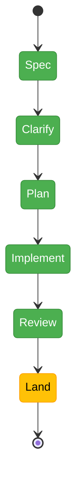

# Flight Plan: Split Terminal View on Browse Page

**Spec**: [split-terminal-view-spec.md](./split-terminal-view-spec.md)
**Research**: [split-terminal-view-research.md](./split-terminal-view-research.md)
**Generated**: 2026-05-19
**Last Updated**: 2026-05-19
**Status**: Landed — all 13 tasks complete; companion review applied; T007 reconnect re-arm fix landed inline

---

## Where We Are → Where We're Going

**Where we are**: The only way to see code and a shell at the same time on the browse page is the right-edge terminal overlay (Plan 064), which floats over the file viewer and cannot be docked. The workspace top strip and browse-page explorer bar already span the full width above a `PanelShell` two-column layout (left 280px file column + flex-1 main). `TerminalView` is already imported by `browser-client.tsx` for the mobile path. `react-resizable-panels@^4` and its shadcn wrapper are already in the codebase. The right-edge overlay positions itself by measuring `data-terminal-overlay-anchor` on the `main` column. tmux clamps geometry to the smallest connected client; xterm cleanup in React 19 strict mode requires a strict tear-down order.

**Where we're going**: A new toggle button in `ExplorerPanel.rightActions` on the browse page activates an inline split — left ⅔ keeps the existing menu / file-tree / viewer (still resizable inside), right ⅓ docks a `TerminalView`. The split is browse-page-only. The workspace top strip and explorer bar continue to span the full width. The outer divider is draggable. The inline pane attaches to **the same tmux session as the right-edge overlay and the `/terminal` page** — one terminal that follows the user across surfaces, preserving shell history. Toggling on auto-closes the right-edge overlay via `overlay:close-all`; on mount + on divider-drag-release the inline pane sends `{type:'resync'}` so tmux geometry tracks the current pane width. Toggle state is session-only (no persistence). Toggling off cleanly unmounts the inline pane.

---

## Phase Index (provisional — finalized by `/plan-3-v2-architect`)

| Phase | Title | Domain | Objective | Depends On |
|-------|-------|--------|-----------|------------|
| 1 | `PanelShell` `rightPane` slot landing | `_platform/panel-layout` | Add optional `rightPane?: ReactNode` to `PanelShell`. Internal `ResizablePanelGroup` only when the slot is set. Keep `data-terminal-overlay-anchor` on `main`. Unit tests for both branches. | None |
| 2 | Toggle component + browse-page wiring | `file-browser` (consumes `terminal`, `_platform/events`) | Build `<SplitTerminalToggleButton />` with in-memory `useState` (no SDK setting). Wire `BrowserClient` to hand `<TerminalView>` into the new slot, attached to the shared worktree tmux session. Dispatch `overlay:close-all` on enable. Send `{type:'resync'}` on mount + on divider-drag-release. | Phase 1 |
| 3 | Hardening + docs | `file-browser` + `terminal` (docs only) | Integration test (toggle/resize/teardown × 10 cycles). Harness Playwright scenario. Anchor-attribute assertion test. Domain.md History rows on `_platform/panel-layout`, `file-browser`, `terminal`. Brief `docs/how/split-terminal-view.md`. | Phase 2 |

---

## Domain Context

### Domains We're Changing

| Domain | What Changes |
|---|---|
| `_platform/panel-layout` | `PanelShell` gains optional `rightPane?: ReactNode`. When set, internal layout switches to `ResizablePanelGroup`. `data-terminal-overlay-anchor` placement unchanged. |
| `file-browser` | Browse page hosts the toggle state (in-memory `useState`), the new `<SplitTerminalToggleButton>` (in `ExplorerPanel.rightActions`), and the slot wiring that hands `<TerminalView>` into `PanelShell`. No SDK settings registered. |

### Domains We Depend On (no changes to their code)

| Domain | What We Consume |
|---|---|
| `terminal` | `TerminalView` (existing public contract: `sessionName`, `cwd`, `className`, `themeOverride`, `isActive`, `onConnectionChange`). `useTerminalSocket` lifecycle via `TerminalView`. **Shared session** with the right-edge overlay + `/terminal` page. |
| `_platform/events` | Global `overlay:close-all` CustomEvent dispatch (precedent: Plans 064 / 065 / 067 / 071). |

No new edges in `docs/domains/domain-map.md`.

---

## Flight Status

**Legend**: grey = pending | yellow = active | red = blocked / needs input | green = done

---

## Stages

- [x] **Stage 0: Research** — five parallel exploration agents → [`split-terminal-view-research.md`](./split-terminal-view-research.md). No external research opportunities identified.
- [x] **Stage 1: Spec drafted** — [`split-terminal-view-spec.md`](./split-terminal-view-spec.md). CS-2 (small). 17 acceptance criteria.
- [x] **Stage 2: Clarify** — 8 questions answered (Simple mode; Hybrid testing + targeted mocks; Hybrid docs; domain boundaries confirmed; shared tmux session; session-only React state; low-impact defaults accepted). C-01..C-08 recorded in spec.
- [x] **Stage 3: Plan** — [`split-terminal-view-plan.md`](./split-terminal-view-plan.md) drafted. Simple mode; 13 tasks (T001–T013) spanning the panel-layout slot, toggle component, terminal resync, browse-page wiring, three test layers, two doc layers. 9 Key Findings (KF-00..KF-09).
- [x] **Stage 4: Validate** — `validate-v2` cross-lens review applied 2026-05-19 (CRITICAL + HIGH fixed inline; 5 MEDIUM deferred with rationale).
- [x] **Stage 5: Implement** — `/plan-6-v2-implement-phase-companion` 2026-05-19. All 13 tasks landed across 11 commits. 21 vitest cases green. Companion ran end-to-end and surfaced one HIGH finding via farewell (resync re-arm gap) — fixed inline post-companion-exit.
- [x] **Stage 6: Review** — companion-mode review folded into the implement stage; companion farewell envelope recorded under `agents/code-review-companion/runs/2026-05-19T14-51-17-196Z-0917`.
- [ ] **Stage 7: Land** — merge to main; domain.md History rows updated via T012.

---

## Acceptance Criteria (summary; see spec § Acceptance Criteria for full list)

- [x] AC-01 — Default off, browse page unchanged
- [x] AC-02 — Toggle button visible in browse top bar
- [x] AC-03 — Toggle on splits the area
- [x] AC-04 — Default ratio is ⅔ / ⅓
- [x] AC-05 — Top bars span full width regardless of split state
- [x] AC-06 — Inner file-tree column still resizes
- [x] AC-07 — Outer divider drags (terminal re-fits cleanly)
- [x] AC-08 — Toggle off restores (clean unmount, no console errors)
- [x] AC-09 — Mutual exclusion with right-edge overlays
- [x] AC-10 — Browse-page-only (no leak to other routes)
- [x] AC-11 — Toggle state is session-only (resets on reload — by design)
- [x] AC-12 — Inline terminal is functional (I/O, reconnect)
- [x] AC-13 — Shared session + `overlay:close-all` + `resync` keeps geometry sane in steady state
- [x] AC-14 — Mobile unaffected
- [x] AC-15 — No regression on other PanelShell consumers
- [x] AC-16 — Repeated toggling (×10) leaves clean state
- [x] AC-17 — `data-terminal-overlay-anchor` preserved on `main`

---

## Risks

| Risk | Likelihood | Impact | Mitigation |
|---|---|---|---|
| R-01 xterm tear-down ordering on fast unmount (PL-02) | Medium | High | Reuse canonical `TerminalView`; integration test that toggles 10× and asserts clean console |
| R-02 tmux smallest-client geometry war (PL-03) | Medium (multi-tab only — L-01) | Medium | Single shared session + mutual-exclusion close on inline-open + `{type:'resync'}` on mount & drag-release. Multi-tab case accepted as L-01. |
| R-03 ~~Hydration flash on persisted-toggle reload~~ | n/a | n/a | Dropped — session-only state has no hydration concern (C-07). |
| R-04 `data-terminal-overlay-anchor` drift | Low | High | Assertion test; comment at panel-shell.tsx:77 documenting placement |
| R-05 Native `resize: horizontal` + `ResizablePanelGroup` interaction | Low | Low | Manual smoke test; fall-back is migrating inner handle to `ResizableHandle` (deferred) |
| R-06 Dynamic-import cost of `TerminalInner` on each toggle (L-03) | Certain | Low | Accept v1; keep-mounted optimization deferred |

---

## Clarifications Settled (2026-05-19)

| # | Topic | Resolution |
|---|---|---|
| C-01 | Workflow Mode | Simple |
| C-02 | Testing Strategy | Hybrid (TDD for slot + xterm cleanup; lightweight elsewhere) |
| C-03 | Mock Usage | Targeted (existing `fake-pty` / `fake-tmux-executor`) |
| C-04 | Documentation Strategy | Hybrid (domain.md + `docs/how/`) |
| C-05 | Domain Review | Confirmed as-is; `_platform/sdk` dropped from consumers |
| C-06 | Session strategy | Single shared tmux session; mutual-exclusion + `{type:'resync'}` mitigate PL-03 |
| C-07 | Persistence model | Session-only React state (no SDK setting, no URL mirror) |
| C-08 | Low-impact defaults (ratio / shortcut / mutual-ex scope / icon) | All accepted: 33.33 default ratio, click-only, close-all, `PanelRight` |

---

## References

- Spec: [`split-terminal-view-spec.md`](./split-terminal-view-spec.md)
- Research: [`split-terminal-view-research.md`](./split-terminal-view-research.md)
- Companion plan in this folder: [`multi-folder-tree-plan.md`](./multi-folder-tree-plan.md) (for `file-browser` patterns and flight-plan style)
- Terminal domain: [`docs/domains/terminal/domain.md`](../../domains/terminal/domain.md)
- File-browser domain: [`docs/domains/file-browser/domain.md`](../../domains/file-browser/domain.md)
