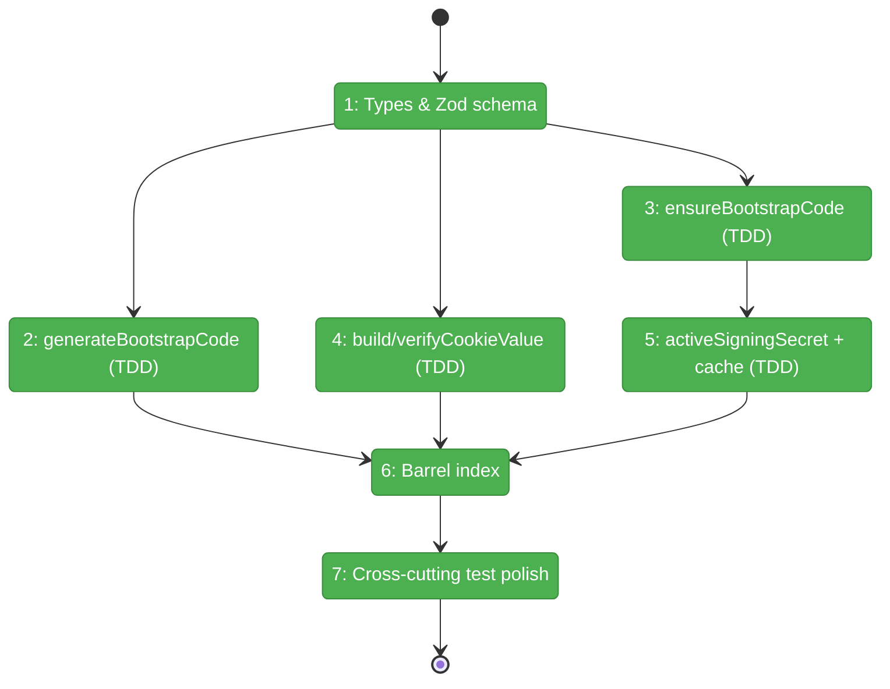

# Flight Plan: Phase 1 — Shared Primitives

**Plan**: [../../auth-bootstrap-code-plan.md](../../auth-bootstrap-code-plan.md)
**Tasks**: [tasks.md](./tasks.md)
**Phase**: Phase 1: Shared Primitives
**Generated**: 2026-04-30
**Status**: Landed (2026-04-30)

---

## Departure → Destination

**Where we are**: The plan is approved and validation-fix amendments are committed. The repo has no `packages/shared/src/auth/` directory yet. The atomic temp+rename helper exists at `packages/shared/src/event-popper/port-discovery.ts:139-160` (reference only). `node:crypto` (`randomInt`, `createHmac`, `timingSafeEqual`, `hkdfSync`) and `zod ^4.3.5` are available. Harness L3 is healthy but not exercised by this phase.

**Where we're going**: A developer can `import { generateBootstrapCode, ensureBootstrapCode, buildCookieValue, verifyCookieValue, activeSigningSecret, BOOTSTRAP_COOKIE_NAME, BOOTSTRAP_CODE_PATTERN } from '@chainglass/shared/auth-bootstrap-code'` and use those primitives anywhere — and the entire library is covered by unit tests using real `node:crypto` and real fs in temp dirs (no `vi.mock`). Phases 2–6 then consume this surface; nothing else in the repo changes.

---

## Domain Context

### Domains We're Changing

| Domain | What Changes | Key Files |
|--------|-------------|-----------|
| `@chainglass/shared` | New sub-module `auth/bootstrap-code/` with 5 source files + barrel + 4 test files + 1 fixtures helper | `packages/shared/src/auth/bootstrap-code/{types,generator,persistence,cookie,signing-key,index}.ts` plus `test/unit/shared/auth-bootstrap-code/{generator,persistence,cookie,signing-key,test-fixtures}.ts` |

### Domains We Depend On (no changes)

| Domain | What We Consume | Contract |
|--------|----------------|----------|
| `node:crypto` (built-in) | `randomInt`, `createHmac`, `timingSafeEqual`, `hkdfSync` | stdlib stable |
| `node:fs` (built-in) | `readFileSync`, `writeFileSync`, `renameSync`, `mkdirSync`, `existsSync` | stdlib stable |
| `node:path` (built-in) | `join`, `dirname` | stdlib stable |
| `zod` (npm, in `@chainglass/shared`) | Zod 4 schema + parse | `^4.3.5` already in `package.json` |

No domain.md contract is consumed. Phase 1 is at the bottom of the dependency tree.

---

## Flight Status

<!-- Updated by /plan-6-v2: pending → active → done. Use blocked for problems/input needed. -->



**Legend**: grey = pending | yellow = active | red = blocked/needs input | green = done

---

## Stages

<!-- Updated by /plan-6-v2 during implementation: [ ] → [~] → [x] -->

- [x] **Stage 1: Lock the contract** — Define types, Zod schema, regex, file-path constant, and cookie name (`packages/shared/src/auth-bootstrap-code/types.ts` — new file; flat layout per discovery S-D1)
- [x] **Stage 2: Generate** — Crockford-base32 generator with cryptographic randomness; tests written RED first (`generator.ts` — new file; `generator.test.ts` — new file)
- [x] **Stage 3: Persist** — Atomic temp+rename for the bootstrap-code file with full edge-case coverage (empty, malformed, missing fields, bad regex); tests written RED first (`persistence.ts` — new file; `persistence.test.ts` — new file) ✅ 14 tests pass
- [x] **Stage 4: Cookie sign/verify** — HMAC-SHA256 with `timingSafeEqual`; tests written RED first (`cookie.ts` — new file; `cookie.test.ts` — new file) ✅ 11 tests pass
- [x] **Stage 5: Signing key with cwd-keyed cache + HKDF fallback** — `AUTH_SECRET` if set, else HKDF from the bootstrap code; cache disciplined per-test; tests written RED first (`signing-key.ts` — new file; `signing-key.test.ts` — new file) ✅ 8 tests pass
- [x] **Stage 6: Public surface** — Barrel index re-exports the 14-name public surface; `_resetSigningSecretCacheForTests` exported with `@internal` JSDoc (`index.ts` — new file) ✅ typecheck clean; 38 tests across 4 files
- [x] **Stage 7: Cross-cutting test polish** — Cache-discipline audit, format-validation invalid-input sample set exported for Phase 3 reuse (`test-fixtures.ts` — new file; existing test files updated; new `format-validation.test.ts` parametric suite) ✅ 46 tests pass across 5 files

---

## Architecture: Before & After

```mermaid
flowchart LR
    classDef existing fill:#E8F5E9,stroke:#4CAF50,color:#000
    classDef changed fill:#FFF3E0,stroke:#FF9800,color:#000
    classDef new fill:#E3F2FD,stroke:#2196F3,color:#000

    subgraph Before["Before Phase 1"]
        B1[node:crypto]:::existing
        B2[zod ^4.3.5]:::existing
        B3[port-discovery.ts<br/>atomic-write reference]:::existing
        B4[@chainglass/shared barrel]:::existing
    end

    subgraph After["After Phase 1"]
        A1[node:crypto]:::existing
        A2[zod]:::existing
        A3[port-discovery.ts<br/>unchanged]:::existing
        A4[@chainglass/shared barrel<br/>+ /auth-bootstrap-code]:::changed
        A5[bootstrap-code/types.ts]:::new
        A6[bootstrap-code/generator.ts]:::new
        A7[bootstrap-code/persistence.ts]:::new
        A8[bootstrap-code/cookie.ts]:::new
        A9[bootstrap-code/signing-key.ts<br/>cwd-keyed cache]:::new
        A10[bootstrap-code/index.ts]:::new
        A11[test/unit/shared/auth-bootstrap-code/<br/>5 test files + fixtures]:::new

        A1 --> A6
        A1 --> A8
        A1 --> A9
        A2 --> A5
        A6 --> A10
        A7 --> A10
        A8 --> A10
        A9 --> A10
        A5 --> A10
        A10 --> A4
        A11 -.tests.-> A6
        A11 -.tests.-> A7
        A11 -.tests.-> A8
        A11 -.tests.-> A9
    end
```

**Legend**: existing (green, unchanged) | changed (orange, modified) | new (blue, created)

---

## Acceptance Criteria

- [ ] **AC-9 (helper-level)**: `ensureBootstrapCode(cwd)` returns existing valid file when present; regenerates only when missing or any of the 4 invalid states (empty / malformed JSON / missing fields / bad regex).
- [ ] **TDD discipline**: Every implementation task has its test file committed in a failing state first (RED), then made green.
- [ ] **No mocks**: `pnpm test --filter @chainglass/shared` audit confirms zero `vi.mock` / `vi.spyOn` / `jest.mock` usage in the new test files.
- [ ] **Cache discipline**: Every signing-key test that varies `AUTH_SECRET` or `cwd` calls `_resetSigningSecretCacheForTests()` in `beforeEach`.
- [ ] **HMR survival**: Signing-key cache demonstrates expected behaviour under module re-import.
- [ ] **Format-validation invalid samples** exported from `test-fixtures.ts` for Phase 3 reuse.
- [ ] **Public surface** importable as `@chainglass/shared/auth-bootstrap-code` with all 13 named exports resolved.
- [ ] **Build clean**: `pnpm typecheck --filter @chainglass/shared` and `pnpm test --filter @chainglass/shared` both pass.
- [ ] **Constitution P1, P2, P3, P4, P7** explicitly satisfied (no app imports, types-first, RED-GREEN, no mocks, shared by default).

---

## Goals & Non-Goals

**Goals**:
- Pure-function library at `packages/shared/src/auth/bootstrap-code/` covering 5 modules
- Public surface exported via barrel
- Unit tests using real `node:crypto` + real-fs temp-dir pattern, no mocking library
- Cache discipline enforced; edge cases covered; HMR survival proven
- Test fixtures exported for Phase 2/3/5 reuse

**Non-Goals**:
- Any web app code (`apps/web/...`)
- Boot-time wiring (Phase 2)
- HTTP routes / proxy / popup (Phase 3 / 6)
- Terminal-WS hardening (Phase 4)
- `requireLocalAuth` (Phase 5)
- Operator docs (Phase 7)
- Mobile UX considerations
- Performance benchmarks (the library is hot-path-light by design)

---

## Checklist

- [x] T001: Types & Zod schema — `BootstrapCodeFile`, `EnsureResult`, `BOOTSTRAP_CODE_PATTERN`, `BOOTSTRAP_COOKIE_NAME`, `BOOTSTRAP_CODE_FILE_PATH_REL`, `BootstrapCodeFileSchema`
- [x] T002: `generateBootstrapCode()` (TDD: RED → GREEN) ✅ 5 tests pass
- [x] T003: `read/write/ensureBootstrapCode` with atomic temp+rename + edge-case coverage (TDD) ✅ 14 tests pass
- [x] T004: `buildCookieValue` / `verifyCookieValue` HMAC-SHA256 timing-safe (TDD) ✅ 11 tests pass
- [x] T005: `activeSigningSecret(cwd)` cwd-keyed cache + HKDF fallback + `_resetSigningSecretCacheForTests` (TDD) ✅ 8 tests pass — closes silent-bypass
- [x] T006: Barrel `index.ts` with 14-name public surface ✅ typecheck clean
- [x] T007: Cross-cutting test polish — cache discipline audit, `INVALID_FORMAT_SAMPLES` for Phase 3 reuse, `test-fixtures.ts`, `format-validation.test.ts` ✅ 46/46 pass
