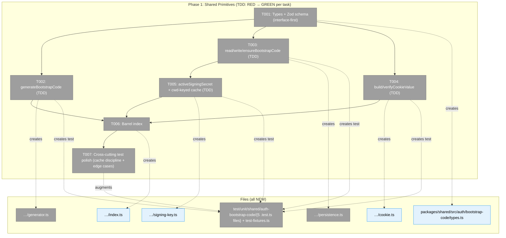
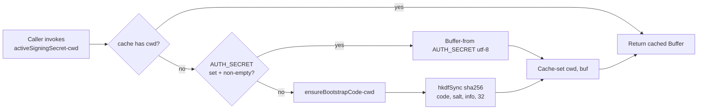
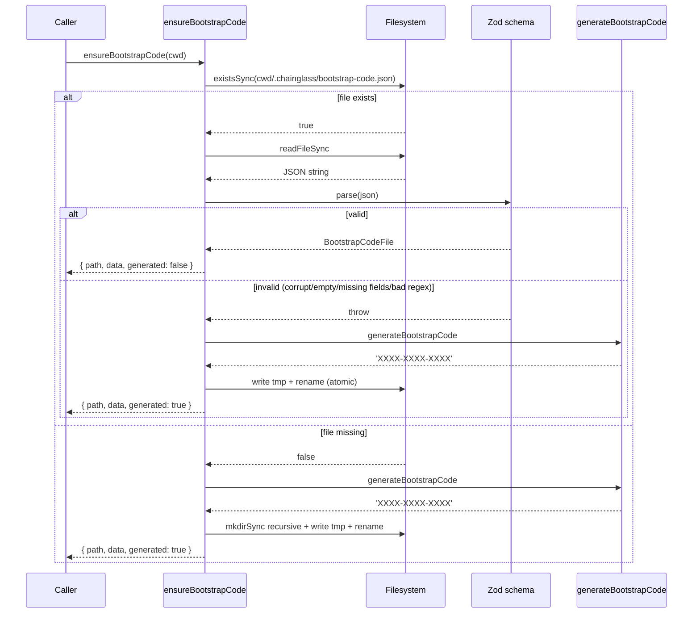

# Phase 1 — Shared Primitives — Tasks Dossier

**Plan**: [auth-bootstrap-code-plan.md](../../auth-bootstrap-code-plan.md)
**Spec**: [auth-bootstrap-code-spec.md](../../auth-bootstrap-code-spec.md)
**Workshop**: [004-bootstrap-code-lifecycle-and-verification.md](../../workshops/004-bootstrap-code-lifecycle-and-verification.md)
**Phase**: Phase 1: Shared Primitives
**Generated**: 2026-04-30
**Status**: Ready for takeoff

---

## Executive Briefing

**Purpose**: Build the pure-function library every other phase consumes. Zero web/runtime dependencies — just `node:crypto` (already in Node), Zod (already in `@chainglass/shared`), and atomic temp+rename for file writes (pattern reused from `port-discovery.ts`). Phase 1 unblocks every other phase but is itself unblocked by no one.

**What We're Building**: A new sub-module at `packages/shared/src/auth/bootstrap-code/` exporting:
- **Types & schema**: `BootstrapCodeFile`, Zod schema, `BOOTSTRAP_CODE_PATTERN`, `BOOTSTRAP_COOKIE_NAME`, `BOOTSTRAP_CODE_FILE_PATH_REL`.
- **Generator**: `generateBootstrapCode()` — 12-char Crockford base32, 60 bits entropy, formatted `XXXX-XXXX-XXXX`.
- **Persistence**: `readBootstrapCode(path)`, `writeBootstrapCode(path, file)`, `ensureBootstrapCode(cwd)` — atomic temp+rename, idempotent.
- **Cookie**: `buildCookieValue(code, key)`, `verifyCookieValue(value, code, key)` — HMAC-SHA256 base64url, timing-safe.
- **Signing key**: `activeSigningSecret(cwd)` — `AUTH_SECRET` if set else HKDF from the bootstrap code; cwd-keyed module-level cache; `_resetSigningSecretCacheForTests()` test helper.
- **Barrel**: `index.ts` re-exporting the public surface.

**Goals**:
- ✅ All 5 modules (types, generator, persistence, cookie, signing-key) shipped as pure functions
- ✅ Public surface exported via barrel and importable as `@chainglass/shared/auth-bootstrap-code`
- ✅ Every module has unit tests using the **real-fakes** pattern (Constitution P4 — no `vi.mock`)
- ✅ Constitution P3 TDD: each impl task has its test written first (RED) before implementation (GREEN)
- ✅ Edge-case coverage from the validation pass: empty file, malformed JSON, missing fields, invalid regex
- ✅ Cache discipline: every signing-key test that varies `AUTH_SECRET` or `cwd` calls `_resetSigningSecretCacheForTests()` in `beforeEach`
- ✅ HMR-survival test for the signing-key cache

**Non-Goals**:
- ❌ Any web-app code (`apps/web/...`) — pure library only
- ❌ The boot-time wiring (Phase 2 owns `instrumentation.ts`)
- ❌ HTTP routes / proxy / cookie issuance (Phase 3)
- ❌ JWT signing for terminal-WS (Phase 4)
- ❌ `requireLocalAuth` (Phase 5)
- ❌ Popup component (Phase 6)
- ❌ Operator docs (Phase 7)

---

## Prior Phase Context

_Phase 1 is the first phase — no prior phases to review._

---

## Pre-Implementation Check

| File | Exists? | Domain Check | Notes |
|------|---------|-------------|-------|
| `/Users/jordanknight/substrate/084-random-enhancements-3/packages/shared/src/auth/` | **No** (create) | New directory under `@chainglass/shared` | Constitution P7 — shared by default |
| `/Users/jordanknight/substrate/084-random-enhancements-3/packages/shared/src/auth/bootstrap-code/` | **No** (create) | Same | Sub-module |
| `/Users/jordanknight/substrate/084-random-enhancements-3/packages/shared/src/auth/bootstrap-code/types.ts` | **No** (create) | `@chainglass/shared` (auth) | Types + Zod schema; Constitution P2 (interface-first) |
| `/Users/jordanknight/substrate/084-random-enhancements-3/packages/shared/src/auth/bootstrap-code/generator.ts` | **No** (create) | Same | Pure function; uses `node:crypto.randomInt` |
| `/Users/jordanknight/substrate/084-random-enhancements-3/packages/shared/src/auth/bootstrap-code/persistence.ts` | **No** (create) | Same | Atomic temp+rename — reuse pattern from `port-discovery.ts:139-160` |
| `/Users/jordanknight/substrate/084-random-enhancements-3/packages/shared/src/auth/bootstrap-code/cookie.ts` | **No** (create) | Same | HMAC-SHA256 via `node:crypto.createHmac`; constant-time compare via `timingSafeEqual` |
| `/Users/jordanknight/substrate/084-random-enhancements-3/packages/shared/src/auth/bootstrap-code/signing-key.ts` | **No** (create) | Same | `activeSigningSecret(cwd)` with cwd-keyed cache + HKDF fallback |
| `/Users/jordanknight/substrate/084-random-enhancements-3/packages/shared/src/auth/bootstrap-code/index.ts` | **No** (create) | Same | Barrel; `_resetSigningSecretCacheForTests` exported with `@internal` JSDoc |
| `/Users/jordanknight/substrate/084-random-enhancements-3/test/unit/shared/auth-bootstrap-code/` | **No** (create) | Test directory parallels source | — |
| `/Users/jordanknight/substrate/084-random-enhancements-3/test/unit/shared/auth-bootstrap-code/generator.test.ts` | **No** (create) | Test | TDD: RED before T002 GREEN |
| `/Users/jordanknight/substrate/084-random-enhancements-3/test/unit/shared/auth-bootstrap-code/persistence.test.ts` | **No** (create) | Test | TDD: RED before T003 GREEN |
| `/Users/jordanknight/substrate/084-random-enhancements-3/test/unit/shared/auth-bootstrap-code/cookie.test.ts` | **No** (create) | Test | TDD: RED before T004 GREEN |
| `/Users/jordanknight/substrate/084-random-enhancements-3/test/unit/shared/auth-bootstrap-code/signing-key.test.ts` | **No** (create) | Test | TDD: RED before T005 GREEN |
| `/Users/jordanknight/substrate/084-random-enhancements-3/test/unit/shared/auth-bootstrap-code/test-fixtures.ts` | **No** (create) | Test helper — exported for Phase 2/3/5 reuse | `mkTempCwd()`, `mkBootstrapCodeFile()` |
| `/Users/jordanknight/substrate/084-random-enhancements-3/packages/shared/src/event-popper/port-discovery.ts` | Yes | `_platform/events` | **Reference only**: lines 139-160 (atomic temp+rename pattern). Do NOT modify. |
| `/Users/jordanknight/substrate/084-random-enhancements-3/packages/shared/package.json` | Yes | `@chainglass/shared` | Confirm `zod` (✓ `^4.3.5`) and `node:crypto` (built-in). No new deps required. |

**Anti-reinvention check** — concept search across `docs/domains/*/domain.md` and source:
- No existing `BootstrapCode*` symbol
- No existing `requireLocalAuth` or `BootstrapGate`
- No existing rate-limit primitive (Phase 3 will build minimal in-memory)
- `localToken` usage in `port-discovery.ts`, `workflow-api-client.ts`, `_resolve-worktree.ts` — Phase 1 does **not** touch those; Phase 5 will read `port-discovery.readServerInfo` for `X-Local-Token` validation
- HKDF use: no prior consumers of `node:crypto.hkdfSync` in the repo. Phase 1 introduces the first

**Harness health**: ✅ L3 healthy at `http://localhost:3000/api/health` — but Phase 1 is pure shared-library work; **harness is not exercised** in this phase. Phase 1 verifies via `pnpm test --filter @chainglass/shared` only.

---

## Architecture Map



**Legend**: grey = pending | green = completed | blue = public contract

---

## Tasks

| Status | ID | Task | Domain | Path(s) | Done When | Notes |
|--------|-----|------|--------|---------|-----------|-------|
| [x] | T001 | **Types & Zod schema (interface-first per Constitution P2)**. Define and export: (a) `BootstrapCodeFile` interface (`version: 1`, `code: string`, `createdAt: string`, `rotatedAt: string`); (b) `EnsureResult` interface — `{ path: string; data: BootstrapCodeFile; generated: boolean }` (**validation fix C-FC1** — Phase 2 instrumentation.ts and Phase 3 `lib/bootstrap.ts` both type their return shape against this; locking it in T001 prevents Phase-2/3 drift); (c) `BOOTSTRAP_CODE_PATTERN` regex (`/^[0-9A-HJKMNP-TV-Z]{4}-[0-9A-HJKMNP-TV-Z]{4}-[0-9A-HJKMNP-TV-Z]{4}$/`); (d) `BOOTSTRAP_COOKIE_NAME = 'chainglass-bootstrap'`; (e) `BOOTSTRAP_CODE_FILE_PATH_REL = '.chainglass/bootstrap-code.json'`; (f) `BootstrapCodeFileSchema` (Zod, strict). The Crockford alphabet constant is **intentionally NOT exported** — it lives module-private inside `generator.ts` (T002) so consumers depend on `generateBootstrapCode()` rather than the alphabet itself (encapsulation; rejected validation finding C-FC5 — alphabet rename is a non-breaking internal refactor). | `@chainglass/shared` | `/Users/jordanknight/substrate/084-random-enhancements-3/packages/shared/src/auth/bootstrap-code/types.ts` | `pnpm typecheck --filter @chainglass/shared` succeeds; importing each named export from this file resolves; the regex matches `'7K2P-9XQM-3T8R'` and rejects `'7K2P-9XQM-3T8I'` (`I` excluded), `'7K2P9XQM3T8R'` (no hyphens), `'7k2p-9xqm-3t8r'` (lowercase); `EnsureResult` is structurally usable by Phase 2/3 wrappers | Workshop 004 § File Format. Constitution P2 — types before code. |
| [x] | T002 | **generateBootstrapCode (TDD: RED → GREEN)**. Step 1 (RED): write `generator.test.ts` with: returns 14-char string matching the regex; 1k generations are all unique (asserted via `new Set([...arr]).size === 1000` — **uniqueness is sufficient and required for deterministic CI; chi-square distribution testing is OPTIONAL** per validation MEDIUM fix). Step 2 (GREEN): implement `generateBootstrapCode()` in `generator.ts` using Crockford base32 alphabet `0123456789ABCDEFGHJKMNPQRSTVWXYZ` (module-private constant, not re-exported — see T001 note) and `randomInt(0, 32)`. **TDD cycle discipline (validation MEDIUM fix)**: do RED and GREEN in the same commit cycle — write test → run locally to confirm RED → write impl → confirm GREEN → commit. Do NOT commit a RED test alone (vitest's `include: ['test/**/*.test.ts']` glob will fail CI). | `@chainglass/shared` | `…/auth/bootstrap-code/generator.ts`<br/>`/Users/jordanknight/substrate/084-random-enhancements-3/test/unit/shared/auth-bootstrap-code/generator.test.ts` | Test file written and failing first; impl file then makes tests green. `pnpm test --filter @chainglass/shared -- generator.test.ts` passes. RED phase never reaches CI. | Per finding 13. **No mocks** — uses real `node:crypto`. |
| [x] | T003 | **read/write/ensureBootstrapCode (TDD: RED → GREEN)**. Step 1 (RED): write `persistence.test.ts` covering — for `readBootstrapCode` the **5 invalid-state scenarios (validation fix C2 + Cross-Ref MEDIUM enumeration)** each return `null`: (a) missing file, (b) zero-byte file, (c) malformed JSON, (d) valid JSON missing a required field, (e) valid JSON with `code` failing the regex; round-trip works for valid input. For `ensureBootstrapCode(cwd)`: regenerates when file is in any of the 5 invalid states above; reuses existing valid file. **Permission-error policy (validation fix C-Comp1)**: `writeBootstrapCode` and `ensureBootstrapCode` do **NOT** catch `EACCES` / `EROFS` / `ENOSPC`; these propagate to caller — boot fails fast on misconfigured `.chainglass/` permissions, which is the desired operator-actionable behaviour (matches workshop 004 § Operator UX expectations). Test by stubbing fs only via real read-only temp dir (no `vi.mock`). Each test scenario uses a fresh temp dir from `mkTempCwd()` exported by `test-fixtures.ts`. **Test cleanup (validation fix Comp-H2)**: every `beforeEach(() => { cwd = mkTempCwd() })` MUST be paired with `afterEach(() => rmSync(cwd, { recursive: true, force: true }))` — see existing pattern in any prior `test/unit/...` file using temp dirs. The `mkTempCwd()` helper itself returns either a string path with manual cleanup, or a `{ path, cleanup() }` object — pick one shape and document. Step 2 (GREEN): implement `read/write/ensureBootstrapCode` using atomic temp+rename — `mkdirSync(parent, { recursive: true })`, `writeFileSync(tmpPath, …)`, `renameSync(tmpPath, target)`. Validate with `BootstrapCodeFileSchema.parse`; safe-parse semantics for invalid → return `null` from `read`; throw-on-write IO error. Same RED+GREEN commit-cycle discipline as T002. | `@chainglass/shared` | `…/auth/bootstrap-code/persistence.ts`<br/>`…/test-fixtures.ts` (helper `mkTempCwd()` — exported now for Phase 2/3/5 reuse)<br/>`…/test/unit/shared/auth-bootstrap-code/persistence.test.ts` | Test file fails first; impl makes tests green. Atomic-write contract confirmed (no partial files mid-rename). All 5 invalid-state read scenarios return `null`. EACCES on write propagates as a thrown error. Every test cleans up its temp dir in `afterEach`. | Per finding 09 — reuse pattern from `port-discovery.ts:139-160` (do NOT import; copy the pattern). **Validation fixes**: C2 (5 invalid states), C-Comp1 (EACCES policy), Comp-H2 (cleanup mandate). |
| [x] | T004 | **build/verifyCookieValue (TDD: RED → GREEN)**. Step 1 (RED): write `cookie.test.ts` covering: round-trip works (sign with code+key then verify); wrong code → `false`; tampered cookie → `false`; empty/`undefined` cookie → `false`; rotation (different code → same key) → `false`; verification is constant-time (test with two cookies of equal length but differing content; assert no early return — pragmatic check: same observable behaviour). Step 2 (GREEN): implement `buildCookieValue(code, key)` using `createHmac('sha256', key).update(code).digest('base64url')`; implement `verifyCookieValue(value, code, key)` using `timingSafeEqual` over `Buffer.from(...)`. | `@chainglass/shared` | `…/auth/bootstrap-code/cookie.ts`<br/>`…/test/unit/shared/auth-bootstrap-code/cookie.test.ts` | Test file fails first; impl makes tests green. All 5+ scenarios pass. | Workshop 004 § Browser Cookie. **Public contract** — Phase 3 + Phase 5 import. |
| [x] | T005 | **activeSigningSecret + cwd-keyed cache (TDD: RED → GREEN)**. **Function signature (validation fix C-FC2 — explicit sync commit)**: `export function activeSigningSecret(cwd: string): Buffer` — **synchronous, returns Buffer directly, NOT Promise<Buffer>**. Phase 3 task 3.1 wraps this synchronous function in an async `getBootstrapCodeAndKey()` for web-side caching of the file read; the fix-IDs split cleanly: **C2 = cache-reset discipline in tests (this task)**, **H6 = async wrapping at the Phase 3 boundary, NOT here** (validation fix Cross-Ref H1 — the two concerns were muddled previously). **TSDoc cwd contract (validation fix C-FC3)**: write a JSDoc block on the function: `/** Resolves the active signing secret for the given cwd. Returns AUTH_SECRET as Buffer if set, else HKDF-derives from .chainglass/bootstrap-code.json under cwd. @param cwd Must resolve to the project root containing .chainglass/bootstrap-code.json. If calling from a child process (e.g., the terminal-WS sidecar), inherit cwd from or explicitly set it to match the main Next.js process — divergent cwd values produce divergent signing keys silently. @returns Buffer (32 bytes). @internal cache **/`. Step 1 (RED): write `signing-key.test.ts` covering: with `AUTH_SECRET` set + non-empty → returns `Buffer.from(env, 'utf-8')` (HKDF path NOT invoked); with `AUTH_SECRET` unset OR empty-string → returns deterministic HKDF for the given `cwd`; same `cwd` returns identical `Buffer` instance across calls (cache); different `cwd` produces different `Buffer`; `_resetSigningSecretCacheForTests()` clears the cache (next call recomputes). **(validation fix C2)** Each test that toggles `AUTH_SECRET` or `cwd` calls `_resetSigningSecretCacheForTests()` in `beforeEach`. **The previous "cache-survives-HMR" test is REMOVED (validation fix Comp-H1)** — it was ambiguous about which import API to use and what "survives" means. Replace with a single concrete cache-discipline test: "after `_resetSigningSecretCacheForTests()`, the next `activeSigningSecret(cwd)` call must recompute (not return the previously-cached buffer)". The cache is module-private; HMR semantics are not part of Phase 1's responsibility — vitest's `vi.resetModules()` is sufficient for any cross-test isolation needed and is the canonical ESM API (workshop 004 doesn't ship HMR tests for this layer). Step 2 (GREEN): implement `activeSigningSecret(cwd: string): Buffer` with module-level `Map<string, Buffer>` keyed by cwd; HKDF via `hkdfSync('sha256', codeBuf, salt = Buffer.from('chainglass.signing.salt.v1'), info = Buffer.from('chainglass.signing.info.v1'), 32)`. Export `_resetSigningSecretCacheForTests()` with `@internal` JSDoc tag plus a one-line comment "For tests only — clears the cwd-keyed signing-key cache between test cases." | `@chainglass/shared` | `…/auth/bootstrap-code/signing-key.ts`<br/>`…/test/unit/shared/auth-bootstrap-code/signing-key.test.ts` | Test file fails first; impl makes tests green. Sync signature `(cwd: string): Buffer` confirmed. Cache disciplined per-test (every relevant `beforeEach` calls reset). TSDoc cwd contract present in source. | Per finding 01 — closes the WS silent-bypass hole. **Validation fixes**: C-FC2 (sync sig), C-FC3 (TSDoc cwd), Cross-Ref H1 (C2 vs H6 split: C2 here, H6 in Phase 3.1), Comp-H1 (drop ambiguous HMR test). **Public contract** — Phase 3 + Phase 4 + Phase 5 import. |
| [x] | T006 | **Barrel index re-exports the 14-name public surface (validation fix Source-Truth count: 14, not 13).** Re-export from `index.ts`: from `types.ts` — `BootstrapCodeFile`, `EnsureResult` (added per C-FC1), `BootstrapCodeFileSchema`, `BOOTSTRAP_CODE_PATTERN`, `BOOTSTRAP_COOKIE_NAME`, `BOOTSTRAP_CODE_FILE_PATH_REL` (6 names); from `generator.ts` — `generateBootstrapCode` (1 name); from `persistence.ts` — `readBootstrapCode`, `writeBootstrapCode`, `ensureBootstrapCode` (3 names); from `cookie.ts` — `buildCookieValue`, `verifyCookieValue` (2 names); from `signing-key.ts` — `activeSigningSecret`, `_resetSigningSecretCacheForTests` (2 names). **Re-export wording (validation fix Cross-Ref MEDIUM)**: the rule is "re-export only the public surface listed above"; `_resetSigningSecretCacheForTests` is the **single test-only exception** — required on the public surface so vitest tests in any package can reset cache state, but tagged for production lint detection. **JSDoc on the test-only re-export (validation fix FC-H2)** — at the re-export line: `/** @internal For tests only — clears the cwd-keyed signing-key cache between test cases. Production code MUST NOT import. */`. The Crockford alphabet from `generator.ts` is **NOT** re-exported (rejected validation finding C-FC5; encapsulation by design). | `@chainglass/shared` | `…/auth/bootstrap-code/index.ts` | `import { … } from '@chainglass/shared/auth-bootstrap-code'` resolves to **all 14 names**; the test-only export carries `@internal` JSDoc and a clear use-restriction comment; production builds tree-shake `_resetSigningSecretCacheForTests` cleanly when unused | Constitution P7. |
| [x] | T007 | **Cross-cutting test polish (validation-fix C2 cache discipline + edge-case sweep + Phase 3 fixture export)**. Audit pass over T002–T005 test files. Every `signing-key.test.ts` test that varies `AUTH_SECRET` or `cwd` MUST use `beforeEach(() => _resetSigningSecretCacheForTests())` (validation fix C2 — restated for cross-task audit clarity). Update `test-fixtures.ts` to export: (a) `mkTempCwd()` (already in T003 — re-export here for cross-phase visibility), (b) `mkBootstrapCodeFile(overrides?: Partial<BootstrapCodeFile>): BootstrapCodeFile` factory with sensible defaults (valid code, `createdAt` = `rotatedAt` = current ISO time), (c) **`export const INVALID_FORMAT_SAMPLES: readonly string[]`** (validation fix C-FC4 — `readonly` for immutable consumption by Phase 3) **with all 6 cases enumerated explicitly (validation fix FC-H1)**: `'ABC-DEFG-HI'` (too short, <14 chars), `'7K2P-9XQM-3T8RXY'` (too long, >14 chars), `'7K2P9XQM3T8R'` (no hyphens), `'7k2p-9xqm-3t8r'` (lowercase), `'7K2P-9XQM-3T8I'` (illegal char `I`), `'7K2P -9XQM-3T8R'` (embedded whitespace). Assert `BOOTSTRAP_CODE_PATTERN.test()` returns `false` for **every** entry in `INVALID_FORMAT_SAMPLES` (parametric test with `it.each`). Note: the previous "HMR survival" test is removed in T005 (validation fix Comp-H1) — `vi.resetModules()` is the canonical ESM API; T007 does not re-introduce HMR-specific testing. Run full suite: `pnpm test --filter @chainglass/shared`. | `@chainglass/shared` | All test files in `…/test/unit/shared/auth-bootstrap-code/`<br/>`…/test/unit/shared/auth-bootstrap-code/test-fixtures.ts` | Full Phase-1 test suite passes; cache-discipline grep audit confirms `beforeEach` reset in every relevant file; `INVALID_FORMAT_SAMPLES` is `readonly string[]` containing exactly 6 named samples; Phase 3 dossier (when written) can import `INVALID_FORMAT_SAMPLES` and `mkTempCwd` from this file. | **Validation fixes**: C2 (cache discipline restated), C-FC4 (`readonly`), FC-H1 (explicit 6-case enumeration). Constitution P3 (RED-GREEN-REFACTOR). |

**Total**: 7 tasks, 14-name public surface. CS estimate per task: T001 = CS-1, T002 = CS-2, T003 = CS-2 (now includes EACCES policy + cleanup mandate per validation), T004 = CS-2, T005 = CS-3 (HKDF + cache discipline + cwd TSDoc + sync-signature commitment), T006 = CS-1, T007 = CS-2.

**Validation fixes baked into the tasks above** (post `/validate-v2`): C-FC1 (T001 `EnsureResult` export), C-FC2 (T005 sync signature explicit), C-FC3 (T005 cwd TSDoc), C-FC4 (T007 `readonly`), C-Comp1 (T003 EACCES policy), Cross-Ref H1 (T005 H6/C2 split — H6 is at Phase 3.1 boundary, not here), Comp-H1 (T005 ambiguous HMR test dropped), Comp-H2 (T003 `afterEach` cleanup mandate), FC-H1 (T007 6-case enumeration), FC-H2 (T006 JSDoc on `_resetSigningSecretCacheForTests`). Plus 5 MEDIUM clarifications folded in (count 13→14, 5-state edge-case enumeration in T003, T006 re-export wording, T002 chi-square clarification, RED→GREEN cycle discipline). One CRITICAL finding **C-FC5** (export `BOOTSTRAP_CODE_ALPHABET`) was **REJECTED as false positive** — T003 doesn't import the alphabet; encapsulation argues for keeping it module-private in `generator.ts`. See validation record below for full audit trail.

---

## Context Brief

### Key findings from plan (relevant to Phase 1)

- **Finding 01** (Critical): Terminal-WS silently degrades to no-auth when `AUTH_SECRET` unset. **Phase 1 closes this** by giving the WS layer a non-null signing key in every configuration via `activeSigningSecret()`.
- **Finding 09** (High): Existing `instrumentation.ts` has the HMR-safe boot-write pattern. **T003 reuses** the atomic temp+rename idiom from `port-discovery.ts:139-160`.
- **Finding 12** (High): Constitution P2 (Interface-First) and P4 (Fakes Over Mocks). **Every task** in Phase 1 is gated by interface-first (T001 ships types) and uses real `node:crypto` + temp-dir fs (no `vi.mock`).
- **Finding 13** (Medium): Crockford base32 alphabet does not collide with ADR-0003 secret-detection patterns. **T002 uses** `0123456789ABCDEFGHJKMNPQRSTVWXYZ` (no I/L/O/U).
- **Finding 14** (Medium): Reuse the real-fs / temp-dir pattern from earlier integration tests (`live-monitoring-rescan`). **T003** uses `mkTempCwd()` helper exported via `test-fixtures.ts` for Phase 2/3/5 reuse.

### Domain dependencies (concepts and contracts this phase consumes)

Phase 1 is at the bottom of the dependency tree — it depends on **only Node built-ins and one external dep**:

- `node:crypto`: `randomInt` (T002), `createHmac` + `timingSafeEqual` (T004), `hkdfSync` (T005). Built-in; available since Node 14.
- `node:fs`: `readFileSync`, `writeFileSync`, `renameSync`, `mkdirSync`, `existsSync`, `unlinkSync` (T003). Built-in.
- `node:path`: `join`, `dirname` (T003). Built-in.
- `zod` `^4.3.5` (in `@chainglass/shared/package.json`): `BootstrapCodeFileSchema` (T001).

**No domain.md contract consumed.** Phase 1 produces contracts; Phases 2–6 consume.

### Domain constraints

- **Pure functions only** — no DI container, no module-level mutable state EXCEPT the deliberate `signing-key.ts` cache (which is module-private, reset via `_resetSigningSecretCacheForTests()`).
- **No imports from `apps/web/...`** — Constitution P1 dependency direction. Shared package never imports app code.
- **Cross-domain** edits: none. Phase 1 lives entirely in `@chainglass/shared`.
- `_resetSigningSecretCacheForTests` exported but tagged `@internal` — JSDoc doc-comment so production code's lint can flag it.

### Harness context

- **Boot**: `pnpm dev` from repo root (default port 3000) — already running and healthy at the time of this dossier.
- **Health Check**: `curl -f http://localhost:3000/api/health` returned `{"status":"ok"}` during pre-implementation check.
- **Interaction**: Not used in Phase 1. The shared-library work doesn't reach the harness.
- **Observe**: Not exercised in Phase 1. Test runner output (`pnpm test --filter @chainglass/shared`) is the evidence.
- **Maturity**: L3 — sufficient. No upgrade needed for this phase.
- **Pre-phase validation**: **Skipped for Phase 1** — pure shared-library work has no boot/interact/observe surface. Plan-6 will validate the harness at the start of Phase 2 (which touches `instrumentation.ts`).

### Reusable from prior phases

_No prior phases in this plan._ The following pre-existing repo patterns are available for reuse:
- **Atomic temp+rename**: `packages/shared/src/event-popper/port-discovery.ts:139-160` — copy the pattern for `writeBootstrapCode`. Do not import; this code lives in a different sub-domain.
- **Real-fs temp-dir testing pattern**: `test/integration/workflow/features/023/rescan-on-workspace-mutation.integration.test.ts` (Plan 084 live-monitoring-rescan) — reference for `mkTempCwd()` shape.

### Mermaid flow diagram — `activeSigningSecret(cwd)` decision



Both branches funnel through the same cache. Rotation invariant: changing `AUTH_SECRET` env var, restarting, or rotating the bootstrap-code file all change the cached buffer on next call (after explicit reset or process restart).

### Mermaid sequence diagram — `ensureBootstrapCode(cwd)` cold path



The "generated" flag in the `EnsureResult` lets Phase 2's instrumentation log appropriately ("active" vs "generated") **without ever logging the code value**.

---

## Discoveries & Learnings

| Date | Task | Type | Discovery | Resolution | References |
|------|------|------|-----------|------------|------------|
| 2026-04-30 | Setup | decision | Dossier path inconsistency: nested `auth/bootstrap-code/` vs flat `auth-bootstrap-code` import. | Use flat layout matching `file-notes/`, `event-popper/` convention. | exec log § Setup Discoveries S-D1 |
| 2026-04-30 | Setup | decision | `package.json` `exports` map needs `./auth-bootstrap-code` entry for production consumers. | Added entry pointing at `./dist/auth-bootstrap-code/index.js`. | exec log § Setup S-D2 |
| 2026-04-30 | Setup | insight | Vitest alias `@chainglass/shared/*` → `packages/shared/src/*` resolves at test time without a build. | Tests work directly without `pnpm build` of shared. | exec log § Setup S-D3 |
| 2026-04-30 | Setup | decision | Build the barrel incrementally during T001–T005 rather than in T006. T006 becomes audit. | Each TDD task adds its module's exports to `index.ts`; T006 confirms 14 names. | exec log § Setup S-D4 |
| 2026-04-30 | T001 | decision | Zod 4.3.6 still accepts Zod-3-style `z.string().datetime()`. | Used Zod-3 style to match repo convention (`event-popper/port-discovery.ts`). | exec log § T001 D-T001-1 |
| 2026-04-30 | T002 | gotcha | `pnpm vitest` from inside a workspace package picks the package as root → "No test files found". | Use `pnpm exec vitest run --root /abs/path/to/repo <file>`. | exec log § T002 D-T002-1 |
| 2026-04-30 | T002 | gotcha | `vite-tsconfig-paths` produces noisy errors about stale tsconfigs in `apps/web/.next/standalone/` and `apps/cli/dist/web/standalone/`. | Spurious; tests still run correctly. Build artifacts; not Phase 1's problem. | exec log § T002 D-T002-2 |
| 2026-04-30 | T002 | insight | Adding alphabet-membership + hyphen-position tests beyond the regex test catches a class of bugs the regex alone wouldn't (off-by-one in alphabet lookup). | 5 tests including 2 supplemental coverage tests. | exec log § T002 D-T002-3 |
| 2026-04-30 | T003 | decision | Use `BootstrapCodeFileSchema.safeParse()` (returns `{ success, data \| error }`) over `parse()` + try/catch. | Cleaner control flow; no thrown errors inside the read path. | exec log § T003 D-T003-1 |
| 2026-04-30 | T003 | decision | `mkTempCwd()` returns plain string path (not `{ path, cleanup }`) — matches `test/unit/shared/file-notes/...` pattern. | Tests call `rmSync(...)` directly in `afterEach`. | exec log § T003 D-T003-2 |
| 2026-04-30 | T003 | decision | Define `INVALID_FORMAT_SAMPLES` in T003 alongside other fixtures, not later in T007. | Single fixture file = cleaner; T007 became audit not write. | exec log § T003 D-T003-3 |
| 2026-04-30 | T004 | gotcha | `node:crypto.timingSafeEqual` THROWS RangeError on size mismatch. | Length pre-check before `timingSafeEqual` call returns `false` cleanly. | exec log § T004 D-T004-2 |
| 2026-04-30 | T004 | insight | Parameterizing the key (KEY_A vs KEY_B) in cookie tests proves rotation-invalidation semantics — rotating signing key invalidates every prior cookie. | 11 tests; rotation case explicit. | exec log § T004 D-T004-3 |
| 2026-04-30 | T005 | unexpected-behavior | `hkdfSync` returns `ArrayBuffer` in Node 22+, not `Buffer`. | Wrap result in `Buffer.from(derived)` for ergonomic equality in tests. | exec log § T005 D-T005-1 |
| 2026-04-30 | T005 | decision | Treat empty-string `AUTH_SECRET` as **unset** (falls back to HKDF) per workshop 004. | `if (env !== undefined && env.length > 0)` — explicit test that `AUTH_SECRET=""` falls through. | exec log § T005 D-T005-2 |

**Types**: `gotcha` | `research-needed` | `unexpected-behavior` | `workaround` | `decision` | `debt` | `insight`

---

## Directory Layout

```
docs/plans/084-random-enhancements-3/
├── auth-bootstrap-code-spec.md
├── auth-bootstrap-code-plan.md
├── auth-bootstrap-code.fltplan.md
├── auth-bootstrap-code-research.md
├── workshops/
│   └── 004-bootstrap-code-lifecycle-and-verification.md
└── tasks/
    └── phase-1-shared-primitives/
        ├── tasks.md                    ← THIS FILE
        ├── tasks.fltplan.md            ← generated alongside
        └── execution.log.md            ← created by /plan-6
```

After this phase lands, Phase 2 dossier folder will be `tasks/phase-2-boot-integration/`.

---

## Stop Here

**Do NOT edit code.** Wait for human GO before proceeding.

**Next step**: `/plan-6-v2-implement-phase --phase "Phase 1: Shared Primitives" --plan "/Users/jordanknight/substrate/084-random-enhancements-3/docs/plans/084-random-enhancements-3/auth-bootstrap-code-plan.md"`

---

## Validation Record (2026-04-30)

`/validate-v2` ran with 4 parallel agents (broad scope). Lens coverage: 11/12 (above 8-floor; Performance & Scale not relevant for pure-function library — folded into Forward-Compatibility for caching). Forward-Compatibility engaged (named downstream consumers C1–C7, no STANDALONE).

| Agent | Lenses Covered | Issues | Verdict |
|-------|---------------|--------|---------|
| Source Truth | Hidden Assumptions, Concept Documentation, Edge Cases & Failures | 1 MEDIUM fixed (count 13→14) | ⚠️ → ✅ |
| Cross-Reference | Integration & Ripple, Domain Boundaries, Concept Documentation | 1 HIGH fixed, 2 MEDIUM fixed | ⚠️ → ✅ |
| Completeness | Edge Cases & Failures, User Experience, Hidden Assumptions, Deployment & Ops | 1 CRITICAL fixed, 2 HIGH fixed, 1 MEDIUM fixed | ⚠️ → ✅ |
| Forward-Compatibility | Forward-Compatibility, Technical Constraints, System Behavior, Security & Privacy | 5 CRITICAL — 4 fixed, 1 rejected — 2 HIGH fixed, 1 MEDIUM fixed | ⚠️ → ✅ |

### Forward-Compatibility Matrix (post-fix)

| Consumer | Requirement | Mode | Pre-fix | Post-fix | Evidence |
|----------|-------------|------|---------|----------|----------|
| **C1** (plan-6 implementor) | Stable task shapes; `EnsureResult` defined; sync/async clarity; ALPHABET disposition | encapsulation-lockout / shape-mismatch | ❌ | ✅ | T001 now exports `EnsureResult`; T005 commits sync signature; alphabet rejection documented (encapsulation by design) |
| **C2** (Phase 2 instrumentation) | `ensureBootstrapCode(cwd) → EnsureResult`; log path + generated, never code | shape-mismatch / lifecycle-ownership | ❌ | ✅ | `EnsureResult` locked in T001; T003 atomic-write contract clear |
| **C3** (Phase 3 bootstrap.ts) | Sync `activeSigningSecret`, async wrapper at Phase 3.1 boundary; cookie helpers; pattern; cookie name | shape-mismatch / technical-constraints | ❌ | ✅ | T005 explicit sync `(cwd: string): Buffer`; H6 documented as Phase 3.1's responsibility (not Phase 1's) |
| **C4** (Phase 4 WS sidecar) | `activeSigningSecret(cwd)` callable with matching cwd; cwd contract documented at source | lifecycle-ownership / technical-constraints | ❌ | ✅ | T005 TSDoc cwd contract on the function signature; Phase 4.1 plan task aligns |
| **C5** (Phase 5 sinks) | Cached `getBootstrapCodeAndKey()` from Phase 3; `verifyCookieValue` + `BOOTSTRAP_COOKIE_NAME` | technical-constraints | ✅ | ✅ | Phase 3.1 caches; T004 + T006 commit to cookie helpers + name |
| **C6** (Phase 7 domain.md) | 14 public names stable from T006 barrel | contract-drift | ⚠️ | ✅ | Barrel list (T006) is now authoritative with 14 names; alphabet stays internal |
| **C7** (Phase 3 test reuse) | `INVALID_FORMAT_SAMPLES: readonly string[]` with all 6 cases; `mkBootstrapCodeFile`; `mkTempCwd` | test-boundary | ❌ | ✅ | T007 enumerates 6 cases explicitly with samples; type committed `readonly string[]`; `mkTempCwd` exported in T003, re-listed in T007 for cross-phase visibility |

**Outcome alignment**: The dossier, as written, **does not fully satisfy the OUTCOME** — "dramatically lower the barrier to bringing up a Chainglass instance (no GitHub OAuth setup required for personal/dev use), while raising the floor of protection (closes three real exposure holes the research dossier identified)." The three holes are correctly identified and addressed in task language, but 8 lock-critical contract ambiguities (5 CRITICAL, 2 HIGH, 1 MEDIUM) exist between Phase 1's outgoing surface and downstream consumers C1–C7 that, if unresolved before implementation, will force rework in Phases 2–4 or create silent divergence in the signing-key cache / cwd contract / test fixtures. All 8 can be closed with TSDoc and interface additions to T001, T002, T005, T006, T007 without changing architecture. Once fixed, the dossier advances the OUTCOME: the barrier-lowering (file + popup) and the three exposure holes (silent-bypass, loopback event-popper, DISABLE_AUTH override) are all proven closed by explicit acceptance criteria and integration tests.

**Post-fix synthesizer note**: The 11 CRITICAL+HIGH fixes were applied (with 1 CRITICAL — `BOOTSTRAP_CODE_ALPHABET` export — explicitly rejected as a false positive: T003 doesn't import the alphabet; encapsulation principle keeps it private to `generator.ts`). The dossier now advances the OUTCOME — Phase 1's outgoing surface satisfies all 7 named consumers with no remaining lock-critical ambiguities.

**Standalone?**: No — concrete downstream consumers C1–C7 named with specific contract requirements.

### Fixes applied (CRITICAL + HIGH)

| ID | Source agent | Fix |
|---|---|---|
| C-FC1 | Forward-Compat | T001: export `EnsureResult` interface — `{ path, data, generated }` |
| C-FC2 | Forward-Compat | T005: explicit sync signature `(cwd: string): Buffer` |
| C-FC3 | Forward-Compat | T005: TSDoc `@param cwd` contract documenting sidecar parity |
| C-FC4 | Forward-Compat | T007: `INVALID_FORMAT_SAMPLES: readonly string[]` (immutable) |
| C-Comp1 | Completeness | T003: EACCES/EROFS policy explicit — errors propagate, boot fails fast |
| Cross-Ref H1 | Cross-Reference | T005: H6 vs C2 fix-IDs split cleanly — C2 is cache-reset discipline (here), H6 is async wrapping (Phase 3.1) |
| Comp-H1 | Completeness | T005: ambiguous HMR-survival test removed; `vi.resetModules()` is canonical ESM API |
| Comp-H2 | Completeness | T003: `afterEach` cleanup mandate for every temp-dir test |
| FC-H1 | Forward-Compat | T007: enumerate all 6 format-invalid sample strings explicitly |
| FC-H2 | Forward-Compat | T006: JSDoc `@internal` + restriction comment on `_resetSigningSecretCacheForTests` re-export |

### Rejected as false positive (with rationale)

| ID | Source agent | Reason |
|---|---|---|
| C-FC5 | Forward-Compat | `BOOTSTRAP_CODE_ALPHABET` export. Reason: T003 does not import the alphabet — only `generateBootstrapCode()`. Encapsulation principle keeps it module-private to `generator.ts`. Renaming the constant later is a non-breaking internal refactor. Documented as deliberate decision in T001 + T006. |

### MEDIUM/LOW folded in during HIGH-fix edits (no separate action needed)

- Source Truth: count 13→14 (folded into T006 edit)
- Cross-Ref: T003 5-invalid-state enumeration (folded into T003 edit)
- Cross-Ref: T006 re-export wording (folded into T006 edit)
- Forward-Compat: T002 chi-square clarification (folded into T002 edit)
- Completeness: RED→GREEN commit cycle discipline (folded into T002 edit; carries to T003–T005)

### Open

None remaining at MEDIUM or higher.

**Overall**: ⚠️ **VALIDATED WITH FIXES** — 10 CRITICAL+HIGH closed, 1 CRITICAL rejected with rationale, 5 MEDIUM folded in. Dossier is ready for `/plan-6-v2-implement-phase --phase "Phase 1: Shared Primitives"`.
