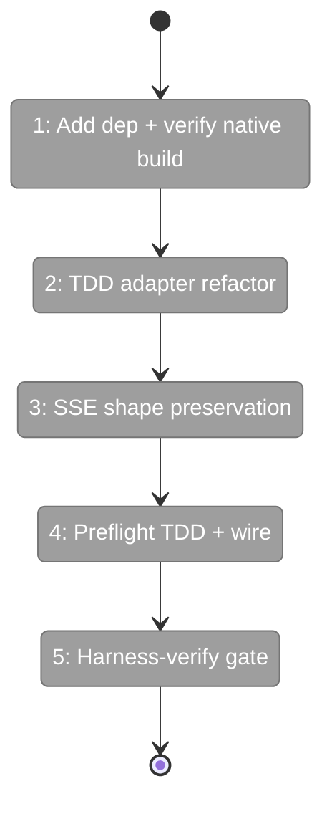
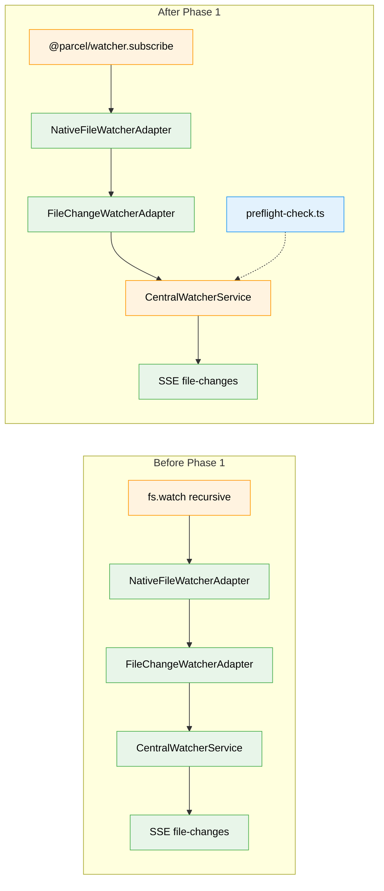

# Flight Plan: Phase 1 — Watcher Library Migration + Pre-flight

**Plan**: [../../multi-folder-tree-plan.md](../../multi-folder-tree-plan.md)
**Phase**: Phase 1: Watcher Library Migration + Pre-flight
**Tasks Dossier**: [./tasks.md](./tasks.md)
**Generated**: 2026-05-13
**Status**: Ready for takeoff

---

## Departure → Destination

**Where we are**: `_platform/events` watches files via raw `node:fs.watch` (since plan 060 removed chokidar). One recursive watcher per worktree. macOS hits a hard ~4,096 fd ceiling under `fs.watch` regardless of `ulimit`. Going from 1–3 worktrees to 5–15 user-pinned extra folders risks silent failure with no diagnostic signal.

**Where we're going**: The `_platform/events` watcher service uses `@parcel/watcher` (native FSEvents on macOS, inotify or FTS on Linux) behind the unchanged `IFileWatcher` interface. The dev server warns at boot when `ulimit -n` < 10,000 (macOS) or `fs.inotify.max_user_watches` < 500,000 (Linux). Every existing consumer (recent-changes-feed, PR-view, file-browser live updates) sees identical SSE payloads before and after.

---

## Domain Context

### Domains We're Changing

| Domain | What Changes | Key Files |
|--------|-------------|-----------|
| `_platform/events` | Adapter swap; new preflight module | `native-file-watcher.adapter.ts`, `file-change-watcher.adapter.ts`, `central-watcher.service.ts`, NEW `lib/preflight-check.ts` |

### Domains We Depend On (no changes)

| Domain | What We Consume | Contract |
|--------|----------------|----------|
| `workspace` | `IWorkspaceService.onMutation` (already subscribed) | `WorkspaceMutationEvent` |

---

## Flight Status



**Legend**: grey = pending | yellow = active | red = blocked / needs input | green = done

---

## Stages

- [ ] **Stage 1: Add `@parcel/watcher` dependency** — install, verify native build on macOS + Linux (`package.json`)
- [ ] **Stage 2: TDD-refactor `NativeFileWatcherAdapter`** — write failing tests against `@parcel/watcher`-backed contract, then refactor impl (`native-file-watcher.adapter.ts`, test file)
- [ ] **Stage 3: SSE event-shape preservation** — integration test asserts SSE payload byte-for-byte unchanged from pre-migration shape
- [ ] **Stage 4: TDD-build preflight check** — failing tests for `checkSystemLimits()` covering macOS + Linux paths; implement; wire into `CentralWatcherService` boot
- [ ] **Stage 5: Harness-verify gate** — `just harness-verify "/workspaces/test/browser"` after the phase lands; capture evidence; no Turbopack errors, no console errors beyond baseline

---

## Architecture: Before & After



**Legend**: existing (green) | changed (orange) | new (blue)

---

## Acceptance Criteria

Tied to plan-level ACs:

- [ ] AC-14 — Startup pre-flight warning for low `ulimit` / `fs.inotify.max_user_watches`
- [ ] (partial) AC-12 — Substrate-side prerequisite for the scale baseline; full AC-12 verification happens in Phase 8 with 10-extras fixture
- [ ] No regression to AC-06 (live updates for local roots) — SSE event shape preserved

## Goals & Non-Goals

**Goals**:
- Library swap is transparent to every consumer.
- Pre-flight warning is informational and unmissable.
- Harness verification gates the phase.

**Non-Goals**:
- No new event types or channels.
- No hybrid watch+poll routing (Phase 4).
- No `extraFolders[]` lifecycle (Phase 4).
- No auto-raising system limits.

---

## Checklist

- [ ] T001: Add `@parcel/watcher` to `packages/workflow/package.json`; verify native build macOS + Linux
- [ ] T002: Write failing `NativeFileWatcherAdapter` tests (RED)
- [ ] T003: Refactor adapter to `@parcel/watcher.subscribe` (GREEN)
- [ ] T004: SSE event-shape preservation integration test
- [ ] T005: Write failing `preflight-check` tests (RED)
- [ ] T006: Implement `lib/preflight-check.ts` (GREEN)
- [ ] T007: Wire preflight into `CentralWatcherService` boot path
- [ ] T008: `just harness-verify "/workspaces/test/browser"` gate

---

## Directory Layout

```
docs/plans/084-random-enhancements-3/
├── multi-folder-tree-plan.md
└── tasks/phase-1-watcher-library-migration/
    ├── tasks.md
    ├── tasks.fltplan.md           # this file
    └── execution.log.md           # created by plan-6
```
