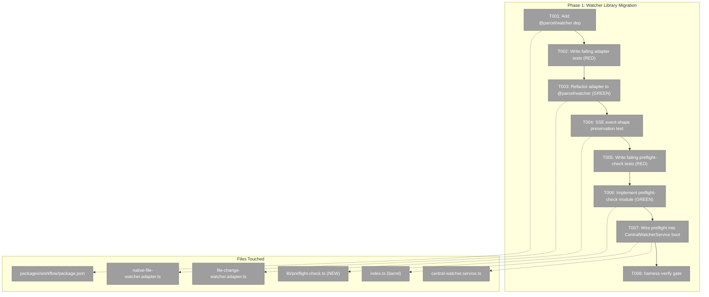
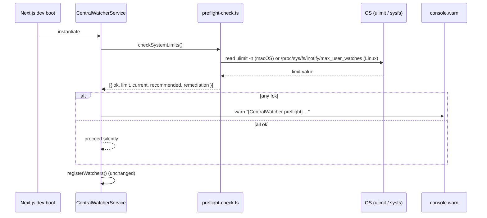

# Phase 1: Watcher Library Migration + Pre-flight — Tasks Dossier

**Plan**: [../../multi-folder-tree-plan.md](../../multi-folder-tree-plan.md)
**Spec**: [../../multi-folder-tree-spec.md](../../multi-folder-tree-spec.md)
**Phase Flight Plan**: [./tasks.fltplan.md](./tasks.fltplan.md)
**Generated**: 2026-05-13
**Status**: Ready for takeoff

---

## Executive Briefing

**Purpose**: Replace the raw `node:fs.watch` backend in `_platform/events` with `@parcel/watcher` while preserving the `IFileWatcher` interface for every downstream consumer. Add a startup pre-flight check that emits a console warning when the host system's `ulimit -n` (macOS) or `fs.inotify.max_user_watches` (Linux) is below the threshold the multi-root feature will need.

**What we're building**: An adapter swap (one library out, one library in) with zero observable change for consumers, plus a tiny new module that reads system limits at boot and warns on a low value. **No new features ship in this phase — it is foundational substrate work.**

**Goals**:
- ✅ macOS `fs.watch` ~4,096-fd ceiling no longer caps the watcher service.
- ✅ Recent-changes-feed, PR-view, file-browser, and any other existing consumer of `_platform/events` see identical SSE event payloads before and after.
- ✅ A developer booting on a constrained system sees a clear console warning naming the failing limit and the remediation command.
- ✅ The harness verifies the swap caused no Turbopack chunking error (the FX007 class of regression).

**Non-Goals**:
- ❌ Adding any new event types, channels, or consumer-visible behavior.
- ❌ Hybrid watch+poll routing — that lives in Phase 4.
- ❌ Subscribing to `WorkspaceMutationEvent` for `extraFolders[]` — that also lives in Phase 4.
- ❌ Auto-raising system limits. v1 warns; users tune.

---

## Prior Phase Context

Phase 1 is the first phase in the plan. There is no prior implementation in this plan to summarize. Relevant prior plan landings that inform Phase 1:

### From Plan 084 FX007 (Copy URL — already landed)
- **Pattern**: Barrel split for client/server boundary. `apps/web/src/features/_platform/git/index.ts` (browser-safe) vs `index.server.ts` (server-only). Phase 1 should keep `_platform/events` server-only modules out of any client barrel.
- **Lesson encoded**: `just harness-verify <path>` is the canonical post-task verification recipe (caught the FX007 chunking error after the fact). Phase 1 will run it explicitly.
- **Mock-failure precedent**: `vi.mock('node:child_process', ...)` silently fell through because Node's real `execFile` has a `[util.promisify.custom]` symbol the mock didn't replicate. Workflow tests now use real git in tmpdir. Phase 1's adapter tests should do the same: real file changes in `fs.mkdtempSync`, not mocked `fs.watch`.

### From Plan 084 live-monitoring-rescan (already landed)
- **Pattern**: `CentralWatcherService` already subscribes to `IWorkspaceService.onMutation()` and calls `performRescan()` on `workspace:updated`. Phase 4 will extend this; Phase 1 must not break this contract.
- **HMR singleton pinning**: any new server-side singleton needs `globalThis.__watcher_unsub__` (or similar) to survive Next.js dev HMR. Phase 1's new preflight module is a one-shot at boot — no singleton needed.

### From Plan 084 recent-changes-feed (already landed)
- **Event shape**: SSE `file-changes` channel carries `{ path: string, eventType: 'add'|'change'|'unlink', worktreePath: string, timestamp: number }`. This is the consumer contract Phase 1 **must** preserve byte-for-byte.

---

## Pre-Phase Harness Validation

The agent harness is at L3 (per `docs/project-rules/harness.md`). Validate before starting Task T001.

| Stage | Command | Expected | Outcome |
|---|---|---|---|
| Boot | `just harness dev` (or skip if `just harness health` returns ok) | Container up; health endpoint responds within 60s | TBD by implementor |
| Interact | `just harness cg check-route "/workspaces/test/browser" --server` | HTTP 200; JSON envelope structure intact | TBD |
| Observe | Capture `data.checks.consoleErrors.messages` from check-route output | Pre-existing HMR/favicon noise only; no Turbopack `⨯` markers | TBD |

If unhealthy → stop and ask. If healthy → proceed to T001.

---

## Pre-Implementation Check

| File | Exists? | Current State | Notes |
|---|---|---|---|
| `packages/workflow/package.json` | YES | No `@parcel/watcher` dep present (confirmed by plan-3 verification subagent) | T001 adds it |
| `packages/workflow/src/features/023-central-watcher-notifications/native-file-watcher.adapter.ts` | YES | Wraps raw `fs.watch` with 200ms write-stabilization (post-Plan 060 chokidar removal) | T003 refactors to use `@parcel/watcher` |
| `packages/workflow/src/features/023-central-watcher-notifications/file-change-watcher.adapter.ts` | YES | Filters `.chainglass/` paths, converts absolute→relative, 300ms debounce, last-event-wins dedup | T004 verifies unchanged event shape |
| `packages/workflow/src/features/023-central-watcher-notifications/central-watcher.service.ts` | YES | Maintains `sourceWatchers` / `dataWatchers` / `registryWatcher` maps; subscribes to `workspace:updated` | No structural change in Phase 1; T003's adapter swap is transparent |
| `packages/workflow/src/features/023-central-watcher-notifications/lib/preflight-check.ts` | NO | — | T006 creates |
| `test/unit/workflow/features/023-central-watcher-notifications/native-file-watcher.adapter.test.ts` | check | Existing tests will become the contract spec for the new adapter | T002 writes failing tests for new impl first (RED) |

**Anti-reinvention check**: No existing `@parcel/watcher` integration anywhere; no existing preflight-check module; no other library candidate already in dependencies (verified by plan-3 subagent). Proceed.

**Domain check**: All files are under `packages/workflow/src/features/023-central-watcher-notifications/` — single domain (`_platform/events`). No cross-domain imports added.

---

## Architecture Map



---

## Tasks

| Status | ID | Task | Domain | Path(s) | Done When | Notes |
|--------|-----|------|--------|---------|-----------|-------|
| [ ] | T001 | Add `@parcel/watcher` to `packages/workflow/package.json`; run `pnpm install`; verify native build on macOS (developer's box) and Linux (CI). Note Node 22 compatibility in execution log. | `_platform/events` | `/Users/jordanknight/substrate/084-random-enhancements-3/packages/workflow/package.json` | `pnpm install` exits 0; `pnpm tsc --noEmit` clean across packages/workflow; `node -e "require('@parcel/watcher')"` loads the native binding | Finding 03. If macOS native build fails on dev box, escalate immediately — no Phase 1 progress without working build. |
| [ ] | T002 | Read existing `native-file-watcher.adapter.test.ts` first. If existing tests already cover the `IFileWatcher` contract (subscribe → callback on real file change; unsubscribe → no more callbacks; recursive subdir change → callback fires), those become T003's success criteria — no new file. If coverage is incomplete, extend the existing file with the missing assertions. Use `fs.mkdtempSync` (no `vi.mock` of `node:fs` per spec C-3). | `_platform/events` | `/Users/jordanknight/substrate/084-random-enhancements-3/test/unit/workflow/features/023-central-watcher-notifications/native-file-watcher.adapter.test.ts` | Either: existing tests are sufficient and pass (record in execution log) OR: extended tests fail because the contract isn't covered yet | TDD RED step. Real tmpdir fixtures only — see FX007 mock-failure lesson in Prior Phase Context. |
| [ ] | T003 | Refactor `NativeFileWatcherAdapter` to call `@parcel/watcher.subscribe(path, callback, { recursive: true })`. Preserve `IFileWatcher` interface signature byte-for-byte. Preserve any write-stabilization logic if `@parcel/watcher` doesn't already coalesce. | `_platform/events` | `/Users/jordanknight/substrate/084-random-enhancements-3/packages/workflow/src/features/023-central-watcher-notifications/native-file-watcher.adapter.ts` | T002 tests pass; existing `central-watcher.service.test.ts` still passes; `pnpm tsc --noEmit` clean | TDD GREEN step. If `@parcel/watcher`'s event shape differs from the current adapter's callback signature, map at the adapter boundary — do **not** change the consumer-facing event shape. |
| [ ] | T004 | Integration test for SSE event-shape preservation: boot the dev server; subscribe to `/api/events/mux?channels=file-changes`; touch a file in a watched worktree; assert the SSE payload matches the pre-migration shape `{ path: <relative>, eventType: 'add'\|'change'\|'unlink', worktreePath: <absolute>, timestamp: <number> }`. **Include a second assertion** with two distinct worktrees registered (use existing test fixtures): touch a file in worktree A and a file in worktree B; assert each event carries the correct `worktreePath` and that downstream consumers can unambiguously route by it. This second assertion future-proofs Phase 5's per-root state refactor. | `_platform/events` | `/Users/jordanknight/substrate/084-random-enhancements-3/test/integration/web/file-changes-sse.test.ts` (NEW or extend existing) | Both single-worktree and two-worktree assertions pass against the new adapter; recent-changes-feed and PR-view consumers unaffected | Critical: this is the contract for **every** existing consumer. Failure here regresses recent-changes-feed, PR-view, file-browser live-update, and breaks Phase 5's downstream per-root routing. (Strengthened from validate-v2 Lens-3 finding.) |
| [ ] | T005 | Write failing tests for `lib/preflight-check.ts`. Cover: macOS path → reads `ulimit -n` → returns `{ ok: true }` when ≥10,000 and `{ ok: false, limit: 'ulimit -n', current: <n>, recommended: 10000, remediation: 'ulimit -n 100000' }` when below. Linux path → same shape via `fs.inotify.max_user_watches` from `/proc/sys/fs/inotify/max_user_watches`. | `_platform/events` | `/Users/jordanknight/substrate/084-random-enhancements-3/test/unit/workflow/features/023-central-watcher-notifications/preflight-check.test.ts` | Tests fail with no preflight-check module present | TDD RED. Mock only `os.platform()` and the limit-reading functions at the helper boundary — never mock `child_process` or `fs` core modules. |
| [ ] | T006 | Implement `lib/preflight-check.ts` exporting `checkSystemLimits(): Promise<{ ok: boolean; limit: string; current: number; recommended: number; remediation: string }[]>`. On macOS: shell out to `ulimit -n` (or use `process.getrlimit?.()` if available on Node 22). On Linux: read `/proc/sys/fs/inotify/max_user_watches`. Return one entry per check; warnings printed by caller. | `_platform/events` | `/Users/jordanknight/substrate/084-random-enhancements-3/packages/workflow/src/features/023-central-watcher-notifications/lib/preflight-check.ts` | T005 tests pass; module compiles cleanly | TDD GREEN. Keep the API result-shaped so the caller can format warnings consistently. |
| [ ] | T007 | Wire `checkSystemLimits()` into `CentralWatcherService` boot path. On any non-ok result, emit a clearly-labeled `console.warn` with the limit name, current value, recommended value, and the verbatim shell remediation command (e.g. `ulimit -n 100000` on macOS, `sudo sysctl -w fs.inotify.max_user_watches=1048576` on Linux). Do **not** throw; this is informational only (per AC-14). Update the barrel `index.ts` if a new public type is exposed. | `_platform/events` | `/Users/jordanknight/substrate/084-random-enhancements-3/packages/workflow/src/features/023-central-watcher-notifications/central-watcher.service.ts`, `.../index.ts` | Boot a dev server: low-limit env → warning visible AND **warning text contains the literal remediation command** (asserted via grep on stderr); healthy env → no warning. No tests regress. | AC-14. Keep the warning text searchable (include the literal `"[CentralWatcher preflight]"` prefix) so users can grep their dev logs. (Strengthened from validate-v2 Lens-2 finding: ensure remediation command is observable.) |
| [ ] | T008 | Harness verification: `just harness-verify "/workspaces/test/browser"` after the full Phase 1 lands. Verify no Turbopack chunking errors (FX007 class), no console errors beyond the pre-existing HMR/favicon noise, and that browser tree still renders. Capture evidence into execution log. | `_platform/events` | (no source files — verification step) | `harness-verify` exits 0; evidence captured | Per `docs/project-rules/harness.md § History` — encoded after FX007. Non-negotiable. |

---

## Context Brief

### Key Findings From Plan

- **Finding 03 (High)** — `fs.watch` ~4,096 ceiling on macOS regardless of `ulimit`. T001–T003 swap to `@parcel/watcher` which uses FSEvents directly on macOS (no per-file fd cost).
- **Finding 05 (High)** — `WorkspaceMutationEvent('workspace:updated')` already exists; `CentralWatcherService.performRescan()` already responds to it. Phase 1 must not break this contract; the adapter swap is transparent to the service layer.
- **Finding 04 (High)** — SSE consumers depend on a stable event shape. T004 is the explicit gate.

### Domain Dependencies (Concepts/Contracts This Phase Consumes)

- `_platform/events` (self): owns `IFileWatcher` interface (preserved), `CentralWatcherService` (preserved), SSE `file-changes` channel (event shape preserved).
- `workspace` (consume — no changes): `IWorkspaceService.onMutation()` is subscribed today; Phase 1 does not touch this wire.

### Domain Constraints

- All Phase 1 files live under `packages/workflow/src/features/023-central-watcher-notifications/`. No cross-domain imports added.
- The new `@parcel/watcher` dependency is a runtime adapter behind `IFileWatcher` — per Constitution Principle 1 (Clean Architecture), service code never references `@parcel/watcher` directly; it talks to the interface.

### Harness Context (from `docs/project-rules/harness.md`)

- **Boot**: `just harness dev`
- **Health**: `just harness health`
- **Interact**: `just harness cg check-route "<path>" --server`
- **Observe**: JSON response from `check-route` includes `data.checks.consoleErrors.messages` and `data.httpStatus`
- **Maturity**: L3 — Boot + Browser Interaction + Structured Evidence + CLI SDK
- **Pre-phase validation**: required (see § Pre-Phase Harness Validation above)
- **Per-task gate**: `just harness-verify "/workspaces/<slug>/browser"` after Task T003 (adapter swap might trigger chunking error) and T007 (preflight wire-up). Mandatory after T007 as the phase-end gate (T008).

### Reusable From Prior Phases

- **FX007**: harness-verify recipe (`justfile`), real-git-in-tmpdir testing convention.
- **live-monitoring-rescan plan**: `WorkspaceMutationEvent` subscription pattern; `performRescan()` reflex.
- **recent-changes-feed plan**: SSE `file-changes` channel + consumer pattern (`useFileChanges('*', cb)`).

### Flow Diagram — Before / After the Adapter Swap

```mermaid
flowchart LR
    subgraph Before["Before Phase 1"]
        FS1[fs.watch recursive] --> NA1[NativeFileWatcherAdapter]
        NA1 --> FCA1[FileChangeWatcherAdapter<br/>filter + debounce]
        FCA1 --> CWS1[CentralWatcherService]
        CWS1 --> SSE1[SSE file-changes channel]
    end

    subgraph After["After Phase 1"]
        PW1[@parcel/watcher subscribe] --> NA2[NativeFileWatcherAdapter<br/>same IFileWatcher iface]
        NA2 --> FCA2[FileChangeWatcherAdapter<br/>filter + debounce]
        FCA2 --> CWS2[CentralWatcherService]
        CWS2 --> SSE2[SSE file-changes channel<br/>same shape]
    end

    classDef changed fill:#FFF3E0,stroke:#FF9800
    classDef unchanged fill:#E8F5E9,stroke:#4CAF50
    class FS1,PW1 changed
    class NA1,NA2,FCA1,FCA2,CWS1,CWS2,SSE1,SSE2 unchanged
```

### Sequence Diagram — Preflight Check at Boot



---

## Discoveries & Learnings

_Populated during implementation by plan-6._

| Date | Task | Type | Discovery | Resolution | References |
|------|------|------|-----------|------------|------------|

**Types**: `gotcha` | `research-needed` | `unexpected-behavior` | `workaround` | `decision` | `debt` | `insight`

---

## Directory Layout After Phase 1

```
packages/workflow/src/features/023-central-watcher-notifications/
├── central-watcher.service.ts          # MOD — calls preflight on boot
├── native-file-watcher.adapter.ts       # MOD — @parcel/watcher under IFileWatcher
├── file-change-watcher.adapter.ts       # MOD — verified unchanged event shape
├── index.ts                             # MOD — exports new types if any
└── lib/
    └── preflight-check.ts               # NEW

test/unit/workflow/features/023-central-watcher-notifications/
├── native-file-watcher.adapter.test.ts  # MOD — TDD baseline
└── preflight-check.test.ts              # NEW

test/integration/web/
└── file-changes-sse.test.ts             # NEW or MOD — event-shape gate

docs/plans/084-random-enhancements-3/tasks/phase-1-watcher-library-migration/
├── tasks.md                             # this file
├── tasks.fltplan.md                     # phase flight plan
└── execution.log.md                     # created by plan-6
```
