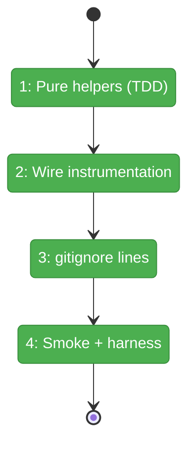
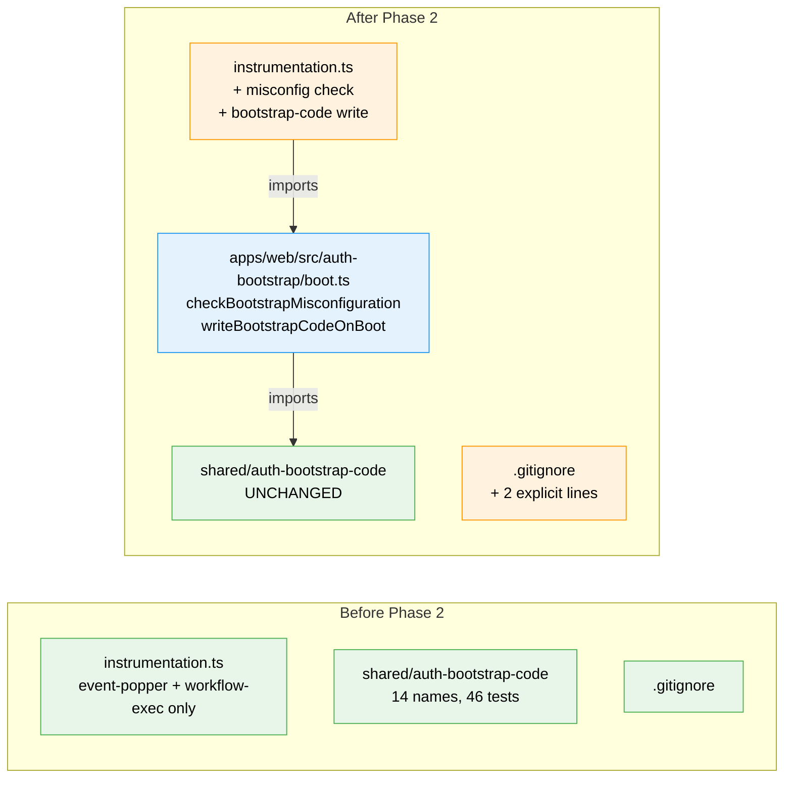

# Flight Plan: Phase 2 — Boot Integration

**Plan**: [auth-bootstrap-code-plan.md](../../auth-bootstrap-code-plan.md)
**Phase**: Phase 2: Boot Integration
**Generated**: 2026-05-02
**Status**: Landed (operator runbook for live `pnpm dev` matrix outstanding — see execution.log.md § T004)

---

## Departure → Destination

**Where we are**: Phase 1 shipped a pure shared library at `@chainglass/shared/auth-bootstrap-code` with 14 public names and 46 passing tests. Nothing in `apps/web/` consumes it yet — the shared lib is dormant. The web app still boots without ever creating `.chainglass/bootstrap-code.json`, the GitHub-OAuth-on / no-`AUTH_SECRET` misconfiguration silently runs in degraded mode, and `process.cwd()/.chainglass/bootstrap-code.json` would not be gitignored if it existed.

**Where we're going**: Every `pnpm dev` (and prod) boot writes (or reuses) `<cwd>/.chainglass/bootstrap-code.json` exactly once per process via an HMR-safe block in `instrumentation.ts`. Boots that have GitHub OAuth on with no `AUTH_SECRET` exit with code 1 and one clear log line. The bootstrap file is gitignored at the repo root. Phase 3 can rely on the file existing and the signing-key cache being valid without re-asserting.

---

## Domain Context

### Domains We're Changing

| Domain | What Changes | Key Files |
|--------|-------------|-----------|
| `_platform/auth` | Add boot-helper module + boot wiring | `apps/web/src/auth-bootstrap/boot.ts` (new), `apps/web/instrumentation.ts` (additive) |
| infra (gitignore) | Two new ignore lines for repo-root sidecar files | `.gitignore` |

### Domains We Depend On (no changes)

| Domain | What We Consume | Contract |
|--------|----------------|----------|
| `@chainglass/shared` (auth-bootstrap-code) | `ensureBootstrapCode`, `EnsureResult`, `BOOTSTRAP_CODE_FILE_PATH_REL` | Phase 1 barrel `@chainglass/shared/auth-bootstrap-code` |
| `@chainglass/shared` (test-fixtures) | `mkTempCwd()` for `writeBootstrapCodeOnBoot` tests | `test/unit/shared/auth-bootstrap-code/test-fixtures.ts` |

---

## Flight Status

<!-- Updated by /plan-6-v2: pending → active → done. Use blocked for problems/input needed. -->

**Legend**: grey = pending | yellow = active | red = blocked/needs input | green = done

---

## Stages

<!-- Updated by /plan-6-v2 during implementation: [ ] → [~] → [x] -->

- [x] **Stage 1: Pure helpers (TDD)** — boot.test.ts (RED → GREEN, 14 cases pass in 7ms); boot.ts ships `checkBootstrapMisconfiguration` + `writeBootstrapCodeOnBoot` with `[bootstrap-code]` log prefix. (`apps/web/src/auth-bootstrap/boot.ts`; `test/unit/web/auth-bootstrap/boot.test.ts`)
- [x] **Stage 2: Wire instrumentation** — additive `__bootstrapCodeWritten` HMR block; misconfig check INSIDE `NEXT_RUNTIME === 'nodejs'` branch; container-skip warning. (`apps/web/instrumentation.ts`)
- [x] **Stage 3: gitignore lines** — `.chainglass/server.json` and `.chainglass/bootstrap-code.json` added at repo root; `git check-ignore -v` verification all 4 cases pass (workflow-negation regression check intact). (`.gitignore`)
- [x] **Stage 4: Smoke + harness** — pre-phase harness validation passed; full Phase 1+2 regression sweep 60/60 in 1.32s; gitignore verified at runtime; live `pnpm dev` matrix captured as operator runbook (D-T004-1 — user's harness was active).

---

## Architecture: Before & After

**Legend**: existing (green, unchanged) | changed (orange, modified) | new (blue, created)

---

## Acceptance Criteria

- [ ] AC-9 — `.chainglass/bootstrap-code.json` exists after first boot; second boot reuses it; corrupt/missing file regenerates (helper-level proof in Phase 1; boot-level proof in T004 smoke step 2 + step 4)
- [ ] AC-17 — HMR re-imports do not regenerate the file (T004 smoke step 3)
- [ ] AC-20 — Booting with GitHub OAuth on + `AUTH_SECRET` unset exits with code 1 and one clear actionable log line; booting with `DISABLE_AUTH=true` + no `AUTH_SECRET` succeeds (T001 cases a,b,c,d,e,f + T004 smoke step 5,6)
- [ ] AC-22 — No log line at boot contains the bootstrap code value (T001 case i + T002 logging discipline by construction)
- [ ] AC-23 — `.chainglass/bootstrap-code.json` is gitignored at repo root (T003 + T004 smoke step 7)

## Goals & Non-Goals

**Goals**:
- `apps/web/src/auth-bootstrap/boot.ts` ships with two pure, testable helpers (zero `vi.mock`)
- `apps/web/instrumentation.ts` calls them in correct order (assert first, then write) and is HMR-safe
- `.gitignore` adds two explicit lines (no wildcards that could conflict with workflow negations)
- Boot-time misconfig fail-fast verified end-to-end via T004's manual matrix
- Test evidence captured in execution log

**Non-Goals**:
- Cookie issuance / verify route / forget route (Phase 3)
- RootLayout integration / popup component (Phase 3 stub / Phase 6 real)
- Terminal-WS sidecar changes (Phase 4)
- `DISABLE_AUTH → DISABLE_GITHUB_OAUTH` rename + deprecation warning (Phase 5)
- Operator docs (Phase 7)
- Automated end-to-end integration test of Next.js boot under vitest (Phase 7 e2e via harness)

---

## Checklist

- [x] T001: Pure helpers (TDD) — `checkBootstrapMisconfiguration` + `writeBootstrapCodeOnBoot` in `boot.ts`; 14 tests pass in 7ms
- [x] T002: Wire `instrumentation.ts` — third HMR-safe global flag (`__bootstrapCodeWritten`); misconfig check + write inside nodejs branch; container-skip warn; additive diff only
- [x] T003: `.gitignore` — explicit lines for `.chainglass/bootstrap-code.json` (line 162) and `.chainglass/server.json` (line 160); 4 `git check-ignore -v` checks pass
- [x] T004: Smoke test — pre-phase harness ✅; regression 60/60 in 1.32s; gitignore runtime-verified; 8-step live `pnpm dev` matrix in operator runbook
