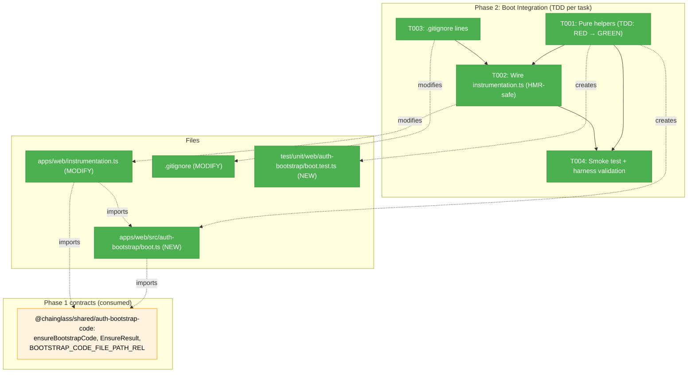
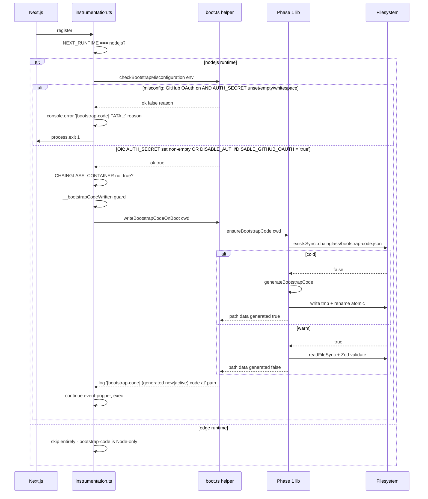

# Phase 2 — Boot Integration — Tasks Dossier

**Plan**: [auth-bootstrap-code-plan.md](../../auth-bootstrap-code-plan.md)
**Spec**: [auth-bootstrap-code-spec.md](../../auth-bootstrap-code-spec.md)
**Workshop**: [004-bootstrap-code-lifecycle-and-verification.md](../../workshops/004-bootstrap-code-lifecycle-and-verification.md)
**Phase**: Phase 2: Boot Integration
**Generated**: 2026-05-02
**Status**: Landed (operator runbook outstanding — see execution.log.md § T004)

---

## Executive Briefing

**Purpose**: Wire Phase 1's pure shared library into the web-app boot sequence so the bootstrap-code file exists on every server start, the boot fails fast on the GitHub-OAuth-on / `AUTH_SECRET`-unset misconfiguration, and the file is never tracked by git. After Phase 2 lands, every running Chainglass instance has a `.chainglass/bootstrap-code.json` that Phases 3–5 can rely on without checking for existence.

**What We're Building**:
- A small **pure helper module** at `apps/web/src/auth-bootstrap/boot.ts` exporting:
  - `checkBootstrapMisconfiguration(env)` — pure function returning `{ ok: true } | { ok: false; reason: string }`. Lets tests assert without `process.exit`.
  - `writeBootstrapCodeOnBoot(cwd)` — async, idempotent helper wrapping `ensureBootstrapCode(cwd)` and logging the absolute path (NEVER the code itself).
- Modifications to `apps/web/instrumentation.ts`:
  - HMR-safe `__bootstrapCodeWritten` global flag mirroring the existing `__eventPopperServerInfoWritten` pattern (lines 14–16, 35–71).
  - Call the misconfiguration check first; on `ok: false`, log + `process.exit(1)`.
  - Call `writeBootstrapCodeOnBoot(process.cwd())` before any other domain init that might need the signing key.
- `.gitignore` updates: explicit lines for `.chainglass/bootstrap-code.json` and `.chainglass/server.json` at repo root (the existing `.chainglass/` rules cover workflow subdirs but neither of these files).
- Unit tests on the pure helper (idempotence + misconfiguration matrix); zero `vi.mock` per Constitution P4.

**Goals**:
- ✅ `apps/web/src/auth-bootstrap/boot.ts` exports two pure helpers (`checkBootstrapMisconfiguration`, `writeBootstrapCodeOnBoot`) — testable without booting Next.js
- ✅ `apps/web/instrumentation.ts` calls the helpers in the right order (assert first, then write) and is HMR-safe
- ✅ `.gitignore` adds explicit ignores for the two repo-root sidecar files
- ✅ Boot fails fast (`process.exit(1)`) when GitHub OAuth is on and `AUTH_SECRET` is unset, with one clear log line naming the misconfigured variable
- ✅ Boot succeeds when `DISABLE_AUTH=true` OR `DISABLE_GITHUB_OAUTH=true` even with `AUTH_SECRET` unset (HKDF fallback path is allowed)
- ✅ Boot succeeds when `AUTH_SECRET` is set, regardless of GitHub OAuth flag
- ✅ Test suite passes on the helper using real fs in temp dirs (zero `vi.mock`)

**Non-Goals**:
- ❌ Cookie issuance, verify route, forget route — Phase 3
- ❌ `/login` page changes, RootLayout integration, popup component — Phase 3 (stub) / Phase 6 (real)
- ❌ Terminal-WS sidecar changes — Phase 4
- ❌ `DISABLE_AUTH → DISABLE_GITHUB_OAUTH` rename or deprecation warning — Phase 5 (Phase 2 reads BOTH names defensively but does not introduce the rename)
- ❌ Operator docs / migration notes — Phase 7

---

## Prior Phase Context

### Phase 1 — Shared Primitives (completed 2026-04-30)

**A. Deliverables** (absolute paths):
- `/Users/jordanknight/substrate/084-random-enhancements-3/packages/shared/src/auth-bootstrap-code/types.ts`
- `/Users/jordanknight/substrate/084-random-enhancements-3/packages/shared/src/auth-bootstrap-code/generator.ts`
- `/Users/jordanknight/substrate/084-random-enhancements-3/packages/shared/src/auth-bootstrap-code/persistence.ts`
- `/Users/jordanknight/substrate/084-random-enhancements-3/packages/shared/src/auth-bootstrap-code/cookie.ts`
- `/Users/jordanknight/substrate/084-random-enhancements-3/packages/shared/src/auth-bootstrap-code/signing-key.ts`
- `/Users/jordanknight/substrate/084-random-enhancements-3/packages/shared/src/auth-bootstrap-code/index.ts` — barrel
- `/Users/jordanknight/substrate/084-random-enhancements-3/packages/shared/package.json` — added `./auth-bootstrap-code` exports entry pointing at `./dist/auth-bootstrap-code/index.js`
- `/Users/jordanknight/substrate/084-random-enhancements-3/test/unit/shared/auth-bootstrap-code/` — 6 test files, **46 tests passing in 935ms**

**B. Dependencies Exported** (the 14-name public surface Phase 2 imports from):
- `EnsureResult` — `{ path: string; data: BootstrapCodeFile; generated: boolean }` — return type of `ensureBootstrapCode`. **Phase 2's instrumentation logs the path + `generated: boolean`, never the code value.**
- `BootstrapCodeFile` — `{ version: 1; code: string; createdAt: string; rotatedAt: string }`
- `ensureBootstrapCode(cwd: string): EnsureResult` — synchronous, idempotent. **Cold path mkdir-recursive + atomic temp+rename.** Throws `EACCES`/`EROFS`/`ENOSPC` on permission/space errors (intentional — boot fails fast).
- `BOOTSTRAP_CODE_FILE_PATH_REL = '.chainglass/bootstrap-code.json'` — Phase 2 logs this prefix in the boot breadcrumb.

**Not consumed by Phase 2** (but available): `generateBootstrapCode`, `readBootstrapCode`, `writeBootstrapCode`, `buildCookieValue`, `verifyCookieValue`, `activeSigningSecret`, `BOOTSTRAP_CODE_PATTERN`, `BOOTSTRAP_COOKIE_NAME`, `BootstrapCodeFileSchema`, `_resetSigningSecretCacheForTests`.

**C. Gotchas & Debt** (carried forward):
- **D-T001-1**: Zod 4.3.6 still accepts the Zod-3 style `z.string().datetime()` — repo convention. Phase 2 doesn't add Zod schemas, so neutral.
- **D-T002-1**: Vitest from inside a workspace package fails with "No test files found"; pass `--root /abs/path/to/repo` explicitly. **Phase 2 will use the same flag for its tests.**
- **D-T002-2**: Stale standalone tsconfigs under `apps/web/.next/standalone/` and `apps/cli/dist/web/standalone/` produce noisy `vite-tsconfig-paths` errors. Spurious; tests still pass. Phase 2 inherits the noise.
- **D-T004-2**: `node:crypto.timingSafeEqual` THROWS on size mismatch — Phase 2 does not call `verifyCookieValue` directly so no impact, but Phase 3 will.
- **D-T005-1**: `hkdfSync` returns `ArrayBuffer` in Node 22+, not `Buffer`. Phase 1 already wraps in `Buffer.from(derived)`. Phase 2 doesn't call HKDF.

**D. Incomplete Items**: None — Phase 1 closed cleanly with no carry-over.

**E. Patterns to Follow**:
- **HMR-safe singleton boot** — mirror `globalForEventPopper.__eventPopperServerInfoWritten` from `apps/web/instrumentation.ts:14-16, 35-71`. The exact idiom: `if (!globalForX.__written) { globalForX.__written = true; ... }`.
- **Atomic temp+rename for sidecar files** — already inside Phase 1's `writeBootstrapCode`; nothing for Phase 2 to repeat.
- **Real-fs temp-dir testing pattern** — `mkTempCwd()` from `test/unit/shared/auth-bootstrap-code/test-fixtures.ts` is exported. Phase 2 reuses it for the `writeBootstrapCodeOnBoot` test.
- **Pure-function-then-thin-wrapper** — Phase 1's split (pure shared lib vs. consumer) carries into Phase 2: pure helpers in `apps/web/src/auth-bootstrap/boot.ts`, thin call site in `instrumentation.ts`. Tests target the helpers; instrumentation.ts gets a smoke test only.
- **Zero `vi.mock`** (Constitution P4) — every Phase 1 test uses real `node:crypto` + real `node:fs` + real env-var manipulation. Phase 2 does the same.
- **Cwd contract from `signing-key.ts` TSDoc** — Phase 2's boot must call helpers with `process.cwd()`, NOT a relative path or a constructed value. Phase 4 sidecar must inherit the same cwd. Phase 2 logs the resolved cwd to make this visible to operators.

---

## Pre-Implementation Check

| File | Exists? | Domain Check | Notes |
|------|---------|-------------|-------|
| `/Users/jordanknight/substrate/084-random-enhancements-3/apps/web/instrumentation.ts` | **Yes** (modify) | `_platform/auth` (cross-cutting boot) | Already async; existing event-popper + workflow-execution sections at lines 35–71 and 73–116 give us the HMR-safe pattern to mirror |
| `/Users/jordanknight/substrate/084-random-enhancements-3/apps/web/src/auth-bootstrap/` | **No** (create) | `_platform/auth` | New sub-folder under `apps/web/src/`; mirrors the layout of `features/063-login/lib/` (small focused helper modules under domain) |
| `/Users/jordanknight/substrate/084-random-enhancements-3/apps/web/src/auth-bootstrap/boot.ts` | **No** (create) | `_platform/auth` | Pure helpers — testable without booting Next.js |
| `/Users/jordanknight/substrate/084-random-enhancements-3/.gitignore` | **Yes** (modify) | infra | Existing `.chainglass/` rules at lines 149–160 cover workflow subdirs and `apps/**/.chainglass/` but NOT root `.chainglass/bootstrap-code.json` or root `.chainglass/server.json` |
| `/Users/jordanknight/substrate/084-random-enhancements-3/test/unit/web/auth-bootstrap/` | **No** (create) | Test directory parallels source | Convention: `test/unit/web/<area>/...` (verified: `test/unit/web/features/`, `test/unit/web/components/` exist) |
| `/Users/jordanknight/substrate/084-random-enhancements-3/test/unit/web/auth-bootstrap/boot.test.ts` | **No** (create) | Test | TDD: RED first |
| `/Users/jordanknight/substrate/084-random-enhancements-3/packages/shared/src/auth-bootstrap-code/index.ts` | Yes | `@chainglass/shared` | **Reference only** — Phase 2 imports `ensureBootstrapCode`, `EnsureResult`, `BOOTSTRAP_CODE_FILE_PATH_REL` from the barrel. Do NOT modify. |
| `/Users/jordanknight/substrate/084-random-enhancements-3/test/unit/shared/auth-bootstrap-code/test-fixtures.ts` | Yes | Test helper | **Reuse `mkTempCwd()`** — exported per Phase 1 task T007. |
| `/Users/jordanknight/substrate/084-random-enhancements-3/apps/web/src/auth.ts` | Yes | `_platform/auth` | **Reference only** for `DISABLE_AUTH` semantics (line 43 — `if (process.env.DISABLE_AUTH === 'true')`). Phase 2 reads BOTH `DISABLE_AUTH` and `DISABLE_GITHUB_OAUTH`; Phase 5 owns the rename + deprecation warning. Do NOT modify. |

**Anti-reinvention check**:
- No existing `checkBootstrapMisconfiguration` or `writeBootstrapCodeOnBoot` symbol in the repo.
- The HMR-safe global-flag boot idiom is *already established* by `__eventPopperServerInfoWritten` and `__workflowExecutionManagerInitialized` in this same file. Phase 2 adds a third pair using the same pattern — no new abstraction; literally a third copy of three lines plus an `if` block. This is intentional copy-don't-abstract per the constitution-flavoured "three similar lines beats premature abstraction" rule.
- No existing helper consolidates "is-GitHub-OAuth-enabled?" — the answer today is `process.env.DISABLE_AUTH !== 'true'`. Phase 2 introduces the local-only `isGithubOauthOn(env)` predicate inside `boot.ts`; Phase 5 promotes it to a domain-level helper if needed.

**Harness health**: ✅ L3 expected (per Phase 1 dossier). Phase 2 modifies `instrumentation.ts` which is the boot path itself; **plan-6 must run pre-phase harness validation** (Boot → Interact → Observe per harness.md) BEFORE making changes, because if `instrumentation.ts` is broken nothing about the harness works. The pure helper tests don't need the harness; the `instrumentation.ts` smoke test (run dev server, verify `.chainglass/bootstrap-code.json` exists, verify hot-reload doesn't regenerate, kill, verify second start reuses) DOES need the harness.

**Known concern deferred to Phase 7 (validation fix H2 — file permissions)**: `.chainglass/bootstrap-code.json` is currently written via Phase 1's `persistence.ts` without an explicit `mode` argument — on a multi-tenant host with a permissive umask the file may be world-readable. **Phase 1 is frozen**, so Phase 2 does NOT attempt a `0o600` retrofit here. The concern is recorded for Phase 7 (operator docs / e2e) which can either (a) add a Phase 7 task to set `mode: 0o600` in `writeFileSync` calls inside `persistence.ts` (modifying frozen Phase 1 source — requires a small, targeted edit + new test), or (b) document in operator docs that the file must be on a single-user filesystem. **Not blocking Phase 2** — the file is gitignored (T003) and the supported deployment is single-user dev environments; multi-tenant production is out of scope for the bootstrap-code feature per spec.

---

## Architecture Map



**Legend**: grey = pending | green = completed | blue = public contract from this phase | orange = external dependency from prior phase

---

## Tasks

| Status | ID | Task | Domain | Path(s) | Done When | Notes |
|--------|-----|------|--------|---------|-----------|-------|
| [x] | T001 | **Pure helpers (TDD: RED → GREEN)**. Step 1 (RED): write `boot.test.ts` covering — for `checkBootstrapMisconfiguration(env: NodeJS.ProcessEnv): { ok: true } \| { ok: false; reason: string }`: (a) **(misconfig)** `AUTH_SECRET=undefined`, `DISABLE_AUTH=undefined`, `DISABLE_GITHUB_OAUTH=undefined` → `{ ok: false, reason: <string mentioning AUTH_SECRET and GitHub OAuth> }`; (b) `AUTH_SECRET=''` (empty) treated same as undefined → `{ ok: false }`; (c) **`AUTH_SECRET='   '` (whitespace-only) treated same as undefined → `{ ok: false }`** (validation fix C2); (d) `AUTH_SECRET='set'` → `{ ok: true }`; (e) `DISABLE_AUTH='true'` + no `AUTH_SECRET` → `{ ok: true }` (HKDF fallback path allowed); (f) `DISABLE_GITHUB_OAUTH='true'` + no `AUTH_SECRET` → `{ ok: true }`; (g) `DISABLE_AUTH='false'` (literal string) treated as "not disabled" → if no `AUTH_SECRET` then `{ ok: false }`; (h) **`DISABLE_AUTH='1'` or `DISABLE_AUTH='TRUE'` (uppercase / numeric truthy) treated as "not disabled"** — only the exact literal `'true'` disables (matches existing `auth.ts:43` semantics); (i) **`DISABLE_AUTH='true' && DISABLE_GITHUB_OAUTH='false'`** (operator transitioning) → resolves to **disabled** (either-side wins; document precedence in TSDoc as "either env var equal to literal `'true'` disables GitHub OAuth"). For `writeBootstrapCodeOnBoot(cwd: string, log?: (msg: string) => void): Promise<EnsureResult>`: (j) cold call on a temp cwd creates `.chainglass/bootstrap-code.json`, returns `generated: true`, calls `log` with a message containing the absolute path AND the word "generated"; (k) second call on same cwd returns `generated: false`, log message contains "active" not "generated"; (l) **the log message MUST NOT contain the code value** (assert via `expect(logMsg).not.toContain(result.data.code)` — covers AC-22 / spec default 8); (m) call propagates `EACCES` from `ensureBootstrapCode` (read-only temp dir test); (n) **import-sanity smoke (validation fix H4)**: `import('../../../apps/web/src/auth-bootstrap/boot')` resolves at runtime and exports both function names — catches export-name typos that would only surface in T002 wiring. **Import path for `mkTempCwd` (validation fix L3)**: `import { mkTempCwd } from '../../shared/auth-bootstrap-code/test-fixtures';` (relative path; fixtures are test-only and NOT exported from the public `@chainglass/shared` package barrel). Step 2 (GREEN): implement both helpers in `apps/web/src/auth-bootstrap/boot.ts`. **Predicate**: `isGithubOauthOn(env)` is local to this module — `env.DISABLE_AUTH !== 'true' && env.DISABLE_GITHUB_OAUTH !== 'true'` (string-equality with literal `'true'`; case-sensitive; not "truthy" semantics). **AUTH_SECRET emptiness check**: `(env.AUTH_SECRET ?? '').trim().length > 0` (handles undefined, empty, and whitespace-only uniformly). **TSDoc on `checkBootstrapMisconfiguration`**: document (i) which exact strings disable GitHub OAuth (`DISABLE_AUTH='true'` OR `DISABLE_GITHUB_OAUTH='true'`, case-sensitive), (ii) AUTH_SECRET semantics (set + non-whitespace-only required when GitHub OAuth is on), (iii) explicit "Phase 2 reads BOTH legacy and current env-var names for forward compatibility; Phase 5 owns formalizing the rename + deprecation warning. The boot predicate does NOT distinguish which name was used — Phase 5's deprecation warning reads `process.env` directly in `auth.ts`." (iv) **scope note**: this helper does NOT validate AUTH_SECRET strength (placeholder/test-secret detection is out of scope per spec — operator responsibility). **Same RED+GREEN commit-cycle discipline as Phase 1** — do not commit a RED test alone (vitest CI glob picks it up). | `_platform/auth` | `/Users/jordanknight/substrate/084-random-enhancements-3/apps/web/src/auth-bootstrap/boot.ts`<br/>`/Users/jordanknight/substrate/084-random-enhancements-3/test/unit/web/auth-bootstrap/boot.test.ts` | `pnpm exec vitest run --root /Users/jordanknight/substrate/084-random-enhancements-3 test/unit/web/auth-bootstrap/boot.test.ts` passes; **all 14 cases above (a–n) covered**; zero `vi.mock`/`vi.spyOn` per Constitution P4 | Per AC-20 (misconfig assertion), AC-22 (no code in logs), spec default 8. **Validation note**: pure functions are the testable surface; `process.exit` is called only by `instrumentation.ts` and is NOT under test (out of scope by design — see T002 for runtime-scoped exit semantics). |
| [x] | T002 | **Wire `instrumentation.ts` (HMR-safe). CS-3 (validation fix M5)** — boot path = highest blast radius. Add a third HMR global-flag pair after the existing `__workflowExecutionManagerInitialized` block, preserving the existing structure exactly. Idiom: `const globalForBootstrap = globalThis as typeof globalThis & { __bootstrapCodeWritten?: boolean };` near line 18. **Order inside `register()` — CRITICAL (validation fix C1)**: (1) **misconfiguration check INSIDE the `NEXT_RUNTIME === 'nodejs'` branch, before any other init** — `process.exit()` is a Node.js-only API; calling it in Edge runtime throws `ReferenceError: process is not defined`. The misconfig predicate is pure and could be called in Edge, but the *action* (exit) is Node-only. Therefore: open the `NEXT_RUNTIME === 'nodejs'` branch first, run `checkBootstrapMisconfiguration(process.env)`, on `{ ok: false }` `console.error('[bootstrap-code] FATAL:', reason)` then `process.exit(1)`. Edge runtime never executes this branch and falls through cleanly (Edge routes don't need the bootstrap file — Phase 3's verify route is Node-only by design). (2) HMR-safe `writeBootstrapCodeOnBoot(process.cwd())` block — same `__bootstrapCodeWritten` flag pattern; log resolved absolute path + `generated: boolean` (NEVER the code). (3) Existing event-popper + workflow-execution blocks unchanged. **Skip-file-write in container** — mirror existing FX003 guard `process.env.CHAINGLASS_CONTAINER !== 'true'` around the file write only (host bind-mount file conflict). **The misconfiguration check still runs in container** to surface bad env wiring early. **Container deployment note (validation fix H3)**: when `CHAINGLASS_CONTAINER=true` Phase 2 skips the file write, so Phase 3 cannot read it from disk. **Container deployments MUST mount `.chainglass/` as a persistent host volume containing a pre-generated `bootstrap-code.json`** — Phase 7 docs cover the operator workflow. Add a one-line warn log when the guard fires: `console.warn('[bootstrap-code] CHAINGLASS_CONTAINER=true: skipping boot-time file write; expecting .chainglass/bootstrap-code.json on a mounted volume.')`. **Dynamic import** the helper to keep instrumentation.ts loading footprint small: `const { writeBootstrapCodeOnBoot, checkBootstrapMisconfiguration } = await import('./src/auth-bootstrap/boot');`. **Log format — CONTRACT (validation fix M1+M4)**: one line per outcome, **`[bootstrap-code]`** prefix (aligns with workshop 004 § Operator UX line 753 — was `[auth-bootstrap]` in dossier draft, corrected). The two canonical formats (Phase 7 docs and AC-22 audits depend on these — treat as contract, not example): `[bootstrap-code] active code at <absolute-path>` and `[bootstrap-code] generated new code at <absolute-path>`. The misconfig log line: `[bootstrap-code] FATAL: <reason>`. The container skip line: `[bootstrap-code] CHAINGLASS_CONTAINER=true: skipping boot-time file write; expecting .chainglass/bootstrap-code.json on a mounted volume.`. **No other log lines from this block.** | `_platform/auth` | `/Users/jordanknight/substrate/084-random-enhancements-3/apps/web/instrumentation.ts` | `pnpm exec tsc --noEmit -p apps/web/tsconfig.json` passes; instrumentation.ts diff is **additive only** (no edits to existing event-popper or workflow-execution blocks); the four log lines above are the only `[bootstrap-code]`-prefixed output from `register()`; misconfig + exit happens *only* under `NEXT_RUNTIME === 'nodejs'`; manual smoke (T004) confirms file appears + HMR is a no-op | Per finding 08 (boot-time assertion for AUTH_SECRET / GitHub-OAuth misconfiguration), finding 09 (HMR safety) + AC-9, AC-17, AC-20, AC-22. **Validation fixes**: C1 (Edge runtime + process.exit scoping), C2 (whitespace handling propagated from T001 predicate), M1 (log prefix aligned to workshop), M4 ("Sample" → "Contract" wording), M5 (CS-2 → CS-3 for boot-path blast radius), H3 (container deployment note). |
| [x] | T003 | **Update root `.gitignore`**. Append two explicit lines under the existing "Chainglass workflow runtime" section (around line 158): `.chainglass/bootstrap-code.json` and `.chainglass/server.json`. **Why explicit and not `.chainglass/*.json` (validation fix M2)**: workflow `.chainglass/workflows/*/workflow.json` is currently negated (`!.chainglass/workflows/*/workflow.json` at line 155). gitignore precedence is "later patterns override earlier ones, but a negation only re-includes if no parent dir was excluded by a wildcard." A `.chainglass/*.json` line at the bottom would NOT re-suppress the workflow negation (because the negation lives under `.chainglass/workflows/...` which is a separate path), but operator-facing clarity wins: explicit lines name the files, leave no room for surprise, and match the existing style (commented intent + targeted globs). **Verify after edit (validation fix M2)**: (i) `git check-ignore -v .chainglass/bootstrap-code.json` outputs `.gitignore:<N>:.chainglass/bootstrap-code.json    .chainglass/bootstrap-code.json` (the `-v` flag prints the matching rule); (ii) `git check-ignore -v .chainglass/server.json` outputs the same shape; (iii) `echo '{}' > .chainglass/bootstrap-code.json && git status` does not list it; (iv) `git check-ignore -v .chainglass/workflows/foo/workflow.json` returns nothing (the negation still wins for workflow files — ensures we didn't break existing rules). Capture each command + output in execution log. **Sanity**: `apps/**/.chainglass/` line at 160 already covers any developer who accidentally boots from `apps/web/` — the new lines cover the supported case (boot from repo root, where `process.cwd()` is the root). | infra | `/Users/jordanknight/substrate/084-random-enhancements-3/.gitignore` | All four `git check-ignore` results above match expected output; after `pnpm dev` boots and Phase 2 writes the file, `git status` does NOT list `.chainglass/bootstrap-code.json` and does NOT list `.chainglass/server.json` (which has been written by event-popper for several plans but was never explicitly ignored at root) | Per AC-23 (file gitignored). **Trivial** but committed as its own task so the diff is greppable. |
| [x] | T004 | **Smoke test + pre-phase harness validation (manual + scripted)**. **Pre-step**: run pre-phase harness validation per harness.md — Boot (`just harness doctor --wait`), Interact (`just harness screenshot smoke /workspaces` to confirm UI is reachable), Observe (`just harness console-logs --filter errors` is empty). Log result in execution log. **Then run the smoke**: (1) ensure `.chainglass/bootstrap-code.json` does NOT exist at repo root (delete if present); (2) `pnpm dev` from repo root with `AUTH_SECRET=set DISABLE_AUTH=false DISABLE_GITHUB_OAUTH=false` — server starts, log line `[bootstrap-code] generated new code at .../.chainglass/bootstrap-code.json` appears, file exists; (3) **(validation fix H1 — revised)** Edit a tracked source file under `apps/web/src/` to trigger HMR. Per Plan 074 § deep-research-nextjs-long-running.md, Next.js's `register()` hook is **called once per server lifecycle, not on HMR file changes**. Therefore the assertion is: log shows ZERO additional `[bootstrap-code]` lines after the HMR rebuild — neither `generated` nor `active`. The `__bootstrapCodeWritten` global flag is defensive against an unlikely Next.js future change AND against developer mistake (e.g., `register()` re-called accidentally from a transient build). The flag is exercised in production restart cycles, not HMR. **If a `[bootstrap-code]` line appears after HMR, the assumption is wrong — open a discovery and reconsider.** (4) restart `pnpm dev` (full process exit + restart) — log shows `[bootstrap-code] active code at <path>`, file unchanged (compare mtime); (5) misconfig matrix: stop server, unset `AUTH_SECRET`, leave `DISABLE_AUTH=false`, `DISABLE_GITHUB_OAUTH=false` → `pnpm dev` exits non-zero, log line `[bootstrap-code] FATAL:` appears in stderr; verify exit code via `echo $?` (POSIX) or `$LASTEXITCODE` (Windows). **Note**: under `pnpm dev`, the wrapping `pnpm` process may surface its own exit code (1 for unhandled child errors); the inner `next dev` process exits 1 from `process.exit(1)`. Either way `echo $?` should be non-zero — capture the exact value seen. (6) repeat (5) with `DISABLE_AUTH=true` → boot succeeds, file gets generated/active log line; (7) `git status` clean of both sidecar files; ALSO run `git check-ignore -v .chainglass/bootstrap-code.json` and `git check-ignore -v .chainglass/server.json` — both must print the rule (validation fix M2). (8) **`AUTH_SECRET=' '` (whitespace-only) test (validation fix C2)**: stop server, set `AUTH_SECRET='   '` (3 spaces), `DISABLE_AUTH=false`, `DISABLE_GITHUB_OAUTH=false` → `pnpm dev` MUST exit non-zero with FATAL log (treats whitespace-only as unset). **Capture as evidence**: console output transcripts in execution log + `.chainglass/bootstrap-code.json` mtime/size before and after each step. **No automated integration test in this phase** — Next.js boot under vitest is high-friction and would require mocking the runtime (Constitution P4 violation). The smoke test is the integration evidence; T001's pure tests are the unit evidence. Phase 7 will add a real harness-driven e2e exercise. | `_platform/auth` | (no new files; verifies T001+T002+T003) | All 8 smoke steps logged in execution log with exit codes / mtimes / log-line excerpts; harness pre-phase validation passes (or override reason captured) | Per AC-9 (regen on missing), AC-17 (HMR safety — no-op confirmed), AC-20 (misconfig fail-fast), AC-22 (no code in logs), AC-23 (gitignored). **Constitution P5** (fast feedback) — smoke is ~3 min wall-clock. |

**Total**: 4 tasks. CS estimate (post-validation): T001 = CS-2 (14 test cases incl. predicate edges + import-sanity, 2 pure functions, ~95 LOC source + ~210 LOC test), T002 = **CS-3 (validation fix M5 — boot-path blast radius elevates from CS-2)** (mirroring an existing idiom + correct runtime scoping for `process.exit`; ~35 LOC additive), T003 = CS-1 (two lines + 4 verification commands), T004 = CS-2 (8-step manual matrix; harness pre-phase). **Phase total = CS-3 (medium)** — contingent on pre-phase harness passing (T004 gate).

---

## Context Brief

### Key findings from plan (relevant to Phase 2)

- **Finding 01** (Critical): Terminal-WS silent-bypass when `AUTH_SECRET` is unset. **Phase 1 closed at substrate level** (HKDF fallback always available). **Phase 2's boot-time assertion (T002)** closes the operator-error path: if GitHub OAuth is on (the developer expects auth to work) and `AUTH_SECRET` is unset, the boot fails fast rather than running with a degraded HKDF fallback that would surprise an operator who set up GitHub OAuth on purpose.
- **Finding 08** (High — validation fix L2): NextAuth requires `AUTH_SECRET` for JWT signing; absence at boot is a misconfiguration, not a feature. **T002's misconfiguration check directly operationalizes this finding** — booting with `DISABLE_AUTH=false`/`DISABLE_GITHUB_OAUTH=false` and `AUTH_SECRET` unset/empty/whitespace-only exits non-zero with one clear actionable log line.
- **Finding 09** (High): HMR-safe boot pattern via `globalThis.__eventPopperServerInfoWritten`. **T002 mirrors this exactly** with a third flag `__bootstrapCodeWritten`. The pattern is established; resist the urge to extract a generic helper (premature abstraction). **Note (validation fix H1)**: per Plan 074 deep-research, Next.js's `register()` is one-per-process; the global flag is defensive (against future Next.js changes / accidental re-call), not the primary HMR safeguard.
- **Finding 12** (High): Constitution P2 + P4 — interface-first, fakes-over-mocks. **T001 ships the helper interface first** (signatures appear in `boot.ts` with empty/throw bodies before tests run); tests use real `node:fs` + real env-var manipulation.
- **Finding 14** (Medium): Real-fs / temp-dir testing pattern from `live-monitoring-rescan` and Phase 1. **T001 reuses `mkTempCwd()`** from Phase 1's exported test-fixtures — no new helper.

### Domain dependencies (concepts and contracts this phase consumes)

From `@chainglass/shared/auth-bootstrap-code` (Phase 1 deliverable):
- `ensureBootstrapCode(cwd: string): EnsureResult` — wrapped by `writeBootstrapCodeOnBoot` (T001).
- `EnsureResult` — return type re-exposed from the helper. **Phase 3 consumes the same shape from `lib/bootstrap-code.ts`'s async wrapper.**
- `BOOTSTRAP_CODE_FILE_PATH_REL` — constant used in the boot log line for operator clarity.

From `node:` built-ins:
- `process.env`, `process.cwd()`, `process.exit(1)`, `console.log`, `console.error`. None require imports.

From the existing `apps/web/instrumentation.ts`:
- The HMR-safe global-flag pattern (idiom, not import).
- The `NEXT_RUNTIME === 'nodejs'` runtime guard.
- The `CHAINGLASS_CONTAINER !== 'true'` skip-in-container guard.

**No `domain.md` Concepts table consumed.** Phase 2 produces no new concepts — it composes Phase 1's primitives at the boot layer. The `_platform/auth` domain.md will gain Composition + Concepts rows in Phase 7 once the full surface is in place.

### Domain constraints

- **No imports from `apps/cli`** — Constitution P1. The bootstrap-code feature is web-only; the CLI uses its own discovery flow via `port-discovery`.
- **No new domains created** — Phase 2 lives entirely under `_platform/auth`. No `docs/domains/registry.md` or `docs/domains/domain-map.md` updates this phase.
- **Cross-domain edits**: `apps/web/instrumentation.ts` is shared boot. The diff is additive (third HMR block); no existing block is modified. This is the same cross-domain pattern as Plan 074's `__workflowExecutionManagerInitialized` block.
- **Logging discipline**: every log line in `boot.ts` and the new `instrumentation.ts` block must be checkable for "does NOT contain the code value" (AC-22 / spec default 8). T001 case (i) tests this; T002 follows the same rule by construction (the helper's log format is fixed).

### Harness context

- **Boot**: `just harness doctor --wait` (or `pnpm dev` from repo root) — health check at `http://localhost:3000/api/health` returns `{"status":"ok"}`.
- **Interact**: `just harness screenshot <name> --url <path>` — Phase 2 itself doesn't add a UI surface, but T004's smoke test exercises `/workspaces` to confirm the boot didn't break the dashboard.
- **Observe**: `just harness console-logs --filter errors` and the captured stdout from `pnpm dev` (the boot log lines are the primary observable evidence).
- **Maturity**: L3 — sufficient. No upgrade in this phase.
- **Pre-phase validation**: **REQUIRED** at start of T004 (and recommended before T002). `instrumentation.ts` is the boot path itself — if pre-phase validation fails, plan-6 stops and asks the human (per harness pre-phase protocol).

### Reusable from prior phases

- `mkTempCwd()` from `test/unit/shared/auth-bootstrap-code/test-fixtures.ts` — reused in T001 for `writeBootstrapCodeOnBoot` cold-path tests.
- HMR-safe global-flag idiom from `apps/web/instrumentation.ts:14-16, 35-71` — copied (not abstracted) for T002.
- Smoke-test discipline (manual matrix with logged evidence) from Plan 084 live-monitoring-rescan (`docs/plans/084-random-enhancements-3/tasks/phase-N/.../execution.log.md`).

### Mermaid flow diagram — Boot decision

```mermaid
flowchart TD
    A[register called] --> E{NEXT_RUNTIME === nodejs?}
    E -- no --> F[Edge runtime: skip block entirely<br/>process.exit unavailable]
    E -- yes --> B{checkBootstrapMisconfiguration env ok?}
    B -- no --> C[console.error '[bootstrap-code] FATAL:' reason]
    C --> D[process.exit 1]
    B -- yes --> G{CHAINGLASS_CONTAINER === true?}
    G -- yes --> H[Container: warn + skip file write<br/>expects mounted volume]
    G -- no --> I{__bootstrapCodeWritten?}
    I -- yes --> J[HMR no-op: register one-per-process anyway]
    I -- no --> K[set flag, writeBootstrapCodeOnBoot cwd]
    K --> L[ensureBootstrapCode cwd]
    L --> M{generated?}
    M -- true --> N[log: '[bootstrap-code] generated new code at' path]
    M -- false --> O[log: '[bootstrap-code] active code at' path]
    N --> P[continue to event-popper, etc.]
    O --> P
    F --> P
    H --> P
    J --> P
```

**Validation note (C1)**: misconfig check is INSIDE the `NEXT_RUNTIME === 'nodejs'` branch, not before it — `process.exit()` is Node-only. Edge runtime (used for some Next.js routes) doesn't need the bootstrap file; Phase 3's verify route is Node-only by design.

### Mermaid sequence diagram — First boot, misconfig vs OK paths



---

## Discoveries & Learnings

_Populated during implementation by plan-6._

| Date | Task | Type | Discovery | Resolution | References |
|------|------|------|-----------|------------|------------|

**Types**: `gotcha` | `research-needed` | `unexpected-behavior` | `workaround` | `decision` | `debt` | `insight`

---

## Directory Layout

```
docs/plans/084-random-enhancements-3/
├── auth-bootstrap-code-spec.md
├── auth-bootstrap-code-plan.md
├── auth-bootstrap-code.fltplan.md
├── auth-bootstrap-code-research.md
├── workshops/
│   └── 004-bootstrap-code-lifecycle-and-verification.md
└── tasks/
    ├── phase-1-shared-primitives/      ← completed
    │   ├── tasks.md
    │   ├── tasks.fltplan.md
    │   └── execution.log.md
    └── phase-2-boot-integration/       ← THIS PHASE
        ├── tasks.md                    ← THIS FILE
        ├── tasks.fltplan.md            ← generated alongside
        └── execution.log.md            ← created by /plan-6
```

After this phase lands, Phase 3 dossier folder will be `tasks/phase-3-server-side-gate/`.

---

## Stop Here

**Do NOT edit code.** Wait for human GO before proceeding.

**Next step**: `/plan-6-v2-implement-phase --phase "Phase 2: Boot Integration" --plan "/Users/jordanknight/substrate/084-random-enhancements-3/docs/plans/084-random-enhancements-3/auth-bootstrap-code-plan.md"`

---

## Validation Record (2026-05-02)

`/validate-v2` ran with 4 parallel agents (broad scope). Lens coverage: 11/12 (above 8-floor; Performance & Scale folded into Hidden Assumptions / HMR analysis). Forward-Compatibility engaged (5 named consumers C1–C5, no STANDALONE).

| Agent | Lenses Covered | Issues | Verdict |
|-------|---------------|--------|---------|
| Source Truth | Hidden Assumptions, System Behavior, Concept Documentation, Edge Cases & Failures | 1 CRITICAL fixed (C1 Edge runtime), 1 MEDIUM fixed (H1 HMR) | ⚠️ → ✅ |
| Cross-Reference | Integration & Ripple, Domain Boundaries, Concept Documentation | 1 MEDIUM fixed (M1 log prefix), 2 LOW fixed (L1 plan AC, L2 finding 08) | ⚠️ → ✅ |
| Completeness | Edge Cases & Failures, Hidden Assumptions, Deployment & Ops, Performance & Scale, Security & Privacy | 1 CRITICAL fixed (C2 whitespace), 1 CRITICAL rejected (placeholder detection — out of scope per spec), 3 HIGH fixed (H2 file perms note, H3 container, H4 import-sanity), 4 MEDIUM fixed (M2 gitignore verify, M3 predicate ambiguity, M5 CS bump), 1 MEDIUM rejected (M6 domain placement — `apps/web/src/auth.ts` already top-level), 1 LOW fixed (L3 fixture import) | ⚠️ → ✅ |
| Forward-Compatibility | Forward-Compatibility, Technical Constraints, System Behavior, Security & Privacy | 1 MEDIUM fixed (M4 Sample → Contract wording); C1 was ⚠️ (race) but Next.js semantics guarantee `register()` completes before listening — accepted as documented assumption | ⚠️ → ✅ |

### Forward-Compatibility Matrix (post-fix)

| Consumer | Requirement | Failure Mode | Pre-fix | Post-fix | Evidence |
|----------|-------------|--------------|---------|----------|----------|
| **C1** (Phase 3 lib/bootstrap-code.ts) | File on disk before first HTTP request; cache valid for `process.cwd()` | shape-mismatch / lifecycle-ownership | ⚠️ | ✅ | `register()` is async; Next.js semantics guarantee it completes before server listens (documented in T002 task notes); cwd parity guaranteed by `process.cwd()` call site |
| **C2** (Phase 4 sidecar) | Cwd parity visible in logs for operator-debugging | contract-drift | ✅ | ✅ | T002 logs absolute path `[bootstrap-code] (generated new\|active) code at <abs path>` — cwd is the parent of `.chainglass/`. Phase 4 sidecar can grep this line. |
| **C3** (Phase 5 env rename) | Predicate handles `DISABLE_AUTH=true && DISABLE_GITHUB_OAUTH=false` cleanly; hands off to deprecation warning without re-touch | contract-drift | ✅ | ✅ | T001 case (i) explicitly tests the transitioning case; TSDoc commits to "either env var equal to literal `'true'` disables GitHub OAuth"; Phase 5 reads `process.env` directly in `auth.ts` (no boot-predicate reuse) |
| **C4** (Phase 7 docs/e2e) | Boot log lines are stable contract for docs + grep | contract-drift | ⚠️ | ✅ | T002 elevated "Sample formats" → "CONTRACT": four canonical log lines specified verbatim; Phase 7 docs and AC-22 audits can quote them directly |
| **C5** (plan-6 implementor) | Tasks are unambiguous, no contradictions | test-boundary / lifecycle | ✅ | ✅ | T001 specifies signatures + 14 test cases; T002 specifies exact runtime scoping for `process.exit`; T003 specifies `git check-ignore` verification; T004 specifies 8 smoke steps with exit codes |

**Outcome alignment**: Phase 2's dossier, as written, **fully supports** the OUTCOME — *"dramatically lower the barrier to bringing up a Chainglass instance (no GitHub OAuth setup required for personal/dev use), while raising the floor of protection (closes three real exposure holes the research dossier identified)"*. Phase 2 makes Phase 1's primitives load-bearing (file is created on every boot, gitignored, never logged) and operationalizes the misconfiguration assertion that closes finding 08's silent-degradation hole. All five downstream consumers (C1–C5) have their needs met by the Position; no forward-compatibility blockers remain.

**Standalone?**: No — five concrete downstream consumers (C1–C5) named with specific contract requirements.

### Fixes applied (CRITICAL + HIGH)

| ID | Source agent | Fix |
|---|---|---|
| C1 | Source-Truth | T002: misconfig check + `process.exit(1)` scoped INSIDE `NEXT_RUNTIME === 'nodejs'` branch (Edge runtime has no `process.exit`); flow + sequence diagrams updated; rationale documented |
| C2 | Completeness | T001: added test cases (c) whitespace-only AUTH_SECRET → fail; predicate uses `(env.AUTH_SECRET ?? '').trim().length > 0`; T004 step 8 smokes the whitespace case |
| H1 | Source-Truth + Completeness | T004 step 3 revised: HMR does NOT re-fire `register()` per Plan 074 research; assertion is "log shows ZERO additional `[bootstrap-code]` lines after HMR rebuild"; flag is defensive against future-Next.js / accidental re-call |
| H2 | Completeness | Pre-Implementation Check: file-permissions concern documented as Phase 7 follow-up (Phase 1 frozen; not blocking Phase 2 since file is gitignored and supported deployment is single-user dev) |
| H3 | Completeness | T002: explicit container-deployment note + warn-log when `CHAINGLASS_CONTAINER` skip fires; Phase 7 docs cover the operator workflow (must mount `.chainglass/` as persistent volume) |
| H4 | Completeness | T001 case (n): import-sanity smoke (`import('../../../apps/web/src/auth-bootstrap/boot')` + assert exports) catches export typos before T002 wiring |

### Fixes applied (MEDIUM)

| ID | Source agent | Fix |
|---|---|---|
| M1 | Cross-Reference | Log prefix realigned to `[bootstrap-code]` (workshop 004 § Operator UX line 753) across T002, T004, flow diagram, sequence diagram; was `[auth-bootstrap]` in dossier draft |
| M2 | Completeness | T003: added `git check-ignore -v` verification for both new sidecar files + workflow-negation regression check; T004 step 7 added |
| M3 | Completeness | T001 cases (h)+(i): predicate semantics committed — `'1'` / `'TRUE'` are NOT disabled (only literal `'true'`); both-set precedence documented as "either-side wins" with TSDoc |
| M4 | Forward-Compat | T002: log format wording elevated from "Sample formats" → "CONTRACT" (four canonical lines verbatim) since Phase 7 docs/grep depend on them |
| M5 | Completeness | T002 CS-2 → CS-3 (boot-path blast radius); phase total stays CS-3 contingent on T004 pre-phase harness gate |

### Fixes applied (LOW)

| ID | Source agent | Fix |
|---|---|---|
| L1 | Cross-Reference | `auth-bootstrap-code-plan.md` § Phase 2 acceptance line: added AC-23 to the AC list |
| L2 | Cross-Reference | Key Findings section: added Finding 08 (NextAuth boot-time AUTH_SECRET assertion) — directly operationalized by T002 |
| L3 | Completeness | T001: explicit relative-import path for `mkTempCwd` (`../../shared/auth-bootstrap-code/test-fixtures`) — fixtures are test-only, not in public package barrel |

### Rejected as false positive (with rationale)

| ID | Source agent | Reason |
|---|---|---|
| C-FC4 (placeholder detection) | Completeness | Detecting placeholders like `AUTH_SECRET='changeme'` is out of scope per spec — AUTH_SECRET strength validation is operator responsibility. The bootstrap-code feature lowers the barrier for *no-AUTH_SECRET* deployments (HKDF fallback); operators who set AUTH_SECRET deliberately are expected to set a real one. Documented as TSDoc scope note in T001. |
| M6 (domain placement) | Completeness | `apps/web/src/auth.ts` already lives at top level of `apps/web/src/` — bootstrap is cross-cutting (gates terminal-WS too, not just login). Top-level `apps/web/src/auth-bootstrap/` is consistent with existing platform-helper placement. Suggesting move to `features/063-login/` would muddle ownership. |

### Open

None remaining at MEDIUM or higher.

**Overall**: ⚠️ **VALIDATED WITH FIXES** — 2 CRITICAL closed (1 rejected with rationale), 4 HIGH closed, 5 MEDIUM closed (1 rejected), 3 LOW closed. Dossier is ready for `/plan-6-v2-implement-phase --phase "Phase 2: Boot Integration"`.
