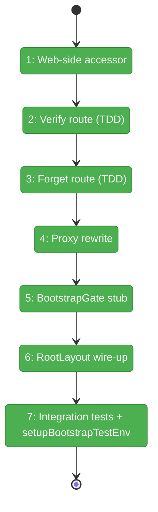
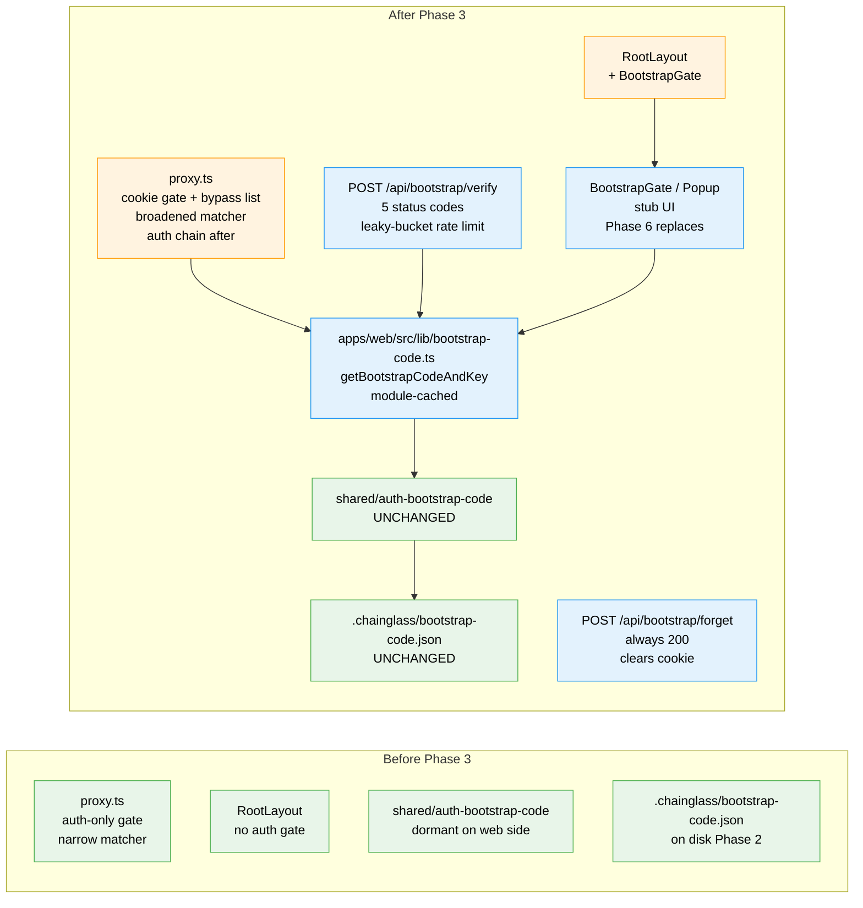

# Flight Plan: Phase 3 — Server-Side Gate (Verify/Forget + Proxy + RootLayout Stub)

**Plan**: [auth-bootstrap-code-plan.md](../../auth-bootstrap-code-plan.md)
**Phase**: Phase 3: Server-Side Gate (Verify/Forget + Proxy + RootLayout Stub)
**Generated**: 2026-05-02
**Status**: Landed (2026-05-02 — 53 unit tests + 7 integration tests pass; 1952/1952 web + shared regression sweep clean)

---

## Departure → Destination

**Where we are**: After Phase 2, every `pnpm dev` boot writes `.chainglass/bootstrap-code.json` once per process, GitHub-OAuth-on / no-`AUTH_SECRET` exits with code 1, and the file is gitignored. But nothing in the request path uses it: every page renders without a popup, every API route is gated only by the existing Auth.js chain (which itself can be bypassed via `DISABLE_AUTH=true`). The cookie helpers from Phase 1 are dormant on the server.

**Where we're going**: After Phase 3, every browser request without a valid `chainglass-bootstrap` cookie either gets a 401 from the proxy (API routes) or paints a stub popup overlay inside RootLayout (page routes); a `POST /api/bootstrap/verify` round-trips the user's code → constant-time HMAC compare → HttpOnly cookie set → next page render shows children. `POST /api/bootstrap/forget` clears the cookie. Phase 6 polishes the popup UI, but the entire server-side contract — verify-route status codes, 429 body shape `{ retryAfterMs }`, cookie attributes, RootLayout `bootstrapVerified` prop — is locked from this phase forward.

---

## Domain Context

### Domains We're Changing

| Domain | What Changes | Key Files |
|--------|-------------|-----------|
| `_platform/auth` | Adds verify/forget routes, web-side accessor, BootstrapGate stub component, broadened proxy with bypass list | `apps/web/src/lib/bootstrap-code.ts` (NEW), `apps/web/app/api/bootstrap/{verify,forget}/route.ts` (NEW), `apps/web/proxy.ts` (REWRITE), `apps/web/src/features/063-login/components/{bootstrap-gate,bootstrap-popup}.tsx` (NEW), `apps/web/app/layout.tsx` (MODIFY — cross-domain edit on app shell) |

### Domains We Depend On (no changes)

| Domain | What We Consume | Contract |
|--------|----------------|----------|
| `@chainglass/shared` (auth-bootstrap-code) | `verifyCookieValue`, `buildCookieValue`, `activeSigningSecret`, `ensureBootstrapCode`, `BOOTSTRAP_CODE_PATTERN`, `BOOTSTRAP_COOKIE_NAME` | Phase 1 barrel `@chainglass/shared/auth-bootstrap-code` |
| `_platform/auth` (existing) | `auth()` Auth.js wrapper from `@/auth` | Existing GitHub OAuth chain — Phase 3 runs **before** it |
| `next/headers` | Server-component `cookies()` | RSC pattern for BootstrapGate |
| `next/server` | `NextRequest`, `NextResponse` | Route handlers + proxy |

---

## Flight Status

<!-- Updated by /plan-6-v2: pending → active → done. Use blocked for problems/input needed. -->

**Legend**: grey = pending | yellow = active | red = blocked/needs input | green = done

---

## Stages

<!-- Updated by /plan-6-v2 during implementation: [ ] → [~] → [x] -->

- [x] **Stage 1: Web-side accessor (TDD)** — Implement async `getBootstrapCodeAndKey()` with module-level cache + `_resetForTests()` + JSDoc on cwd contract & cache lifecycle; cover happy/cached/reset/missing-file. (`apps/web/src/lib/bootstrap-code.ts` — new file; renamed from plan's `bootstrap.ts` to avoid existing DI/config file collision)
- [x] **Stage 2: Verify route (TDD)** — Implement `POST /api/bootstrap/verify` with format check, leaky-bucket rate limit, 5 status codes (200/400/401/429/503), HttpOnly cookie set; cover all paths including parametric format-invalid. (`apps/web/app/api/bootstrap/verify/route.ts` — new file)
- [x] **Stage 3: Forget route (TDD)** — Implement `POST /api/bootstrap/forget` always-200 with cookie-clearing Set-Cookie; cover idempotence. (`apps/web/app/api/bootstrap/forget/route.ts` — new file)
- [x] **Stage 4: Proxy rewrite** — Broaden matcher; explicit `AUTH_BYPASS_ROUTES`; cookie gate before `auth()` chain; page-fall-through (no redirect) for unauthed pages; cover bypass + page-fall-through + API-401. (`apps/web/proxy.ts` — full rewrite)
- [x] **Stage 5: BootstrapGate stub** — Server component reads cookie via `cookies()`, calls `verifyCookieValue`, passes `bootstrapVerified` to client stub; pure-helper test for `computeBootstrapVerified`. (`apps/web/src/features/063-login/components/bootstrap-gate.tsx` + `bootstrap-popup.tsx` — new files)
- [x] **Stage 6: RootLayout wire-up** — Insert `<BootstrapGate>` between `<Providers>` and `{children}` in `apps/web/app/layout.tsx`. (`apps/web/app/layout.tsx` — modify)
- [x] **Stage 7: Integration tests + setupBootstrapTestEnv** — End-to-end scenarios (8 cases) hitting real route handlers; export `setupBootstrapTestEnv()` from `test/helpers/auth-bootstrap-code.ts` (NEW). 7/7 integration tests pass in 18ms; 1952/1952 across web + shared (0 regressions).

---

## Architecture: Before & After

**Legend**: existing (green, unchanged) | changed (orange, modified) | new (blue, created)

---

## Acceptance Criteria

- [ ] **AC-1** (with stub) — Fresh-browser request to any page renders the stub `<BootstrapGate>` overlay; verified request renders normal layout.
- [ ] **AC-2** (verify-route side) — POST `/api/bootstrap/verify` with the correct code returns 200 + `Set-Cookie: chainglass-bootstrap=<value>; HttpOnly; SameSite=Lax; Path=/`; subsequent gated request passes.
- [ ] **AC-3** — Cookie persists across browser-tab reload (HttpOnly session cookie with no Max-Age; rotation is the only expiry mechanism).
- [ ] **AC-4** — Wrong code (correct format) → 401 `{ error: 'wrong-code' }`.
- [ ] **AC-5** — Format-invalid (6 cases) → 400 `{ error: 'invalid-format' }`.
- [ ] **AC-6** — 6th attempt within 60s window from same IP → 429 + `Retry-After` header + body `{ error: 'rate-limited', retryAfterMs }`.
- [ ] **AC-7** — Cookie persists across server restart (HMAC depends on stable signing key, which depends on stable bootstrap code on disk).
- [ ] **AC-8** — Rotating the code (overwrite `bootstrap-code.json`) invalidates all existing cookies.
- [ ] **AC-10** (with stub) — Stub popup gates `/login` (proven by hitting `/login` without cookie → RootLayout renders the stub overlay).
- [ ] **AC-18** — `/api/health` reachable without cookie.
- [ ] **AC-19** — `/api/auth/*` reachable without cookie (NextAuth callbacks must work).
- [ ] **AC-24** — `/api/bootstrap/forget` returns 200 + `Set-Cookie: chainglass-bootstrap=; Max-Age=0` on every call.
- [ ] **AC-25** — Cookie attributes: HttpOnly + SameSite=Lax + Path=/ + (Secure when `NODE_ENV === 'production'`).

## Goals & Non-Goals

**Goals**:
- Server-side bootstrap-cookie gate is wired end-to-end and locked behind 8 integration scenarios + 6 format-invalid cases + per-route unit tests.
- The 429 body shape `{ retryAfterMs }`, cookie attributes, and `BootstrapPopupProps` shape are committed contracts Phase 6 inherits.
- `setupBootstrapTestEnv()` is exported for Phase 6 to reuse (test-boundary FC fix).
- Existing Auth.js chain (GitHub OAuth) continues to run after the cookie gate succeeds — no regression.

**Non-Goals**:
- Real popup UX (Phase 6 — autoformat hyphens, error states, focus trap, ARIA, mobile rendering).
- `DISABLE_AUTH` → `DISABLE_GITHUB_OAUTH` rename (Phase 5).
- Sidecar route hardening (Phase 5: `requireLocalAuth` for event-popper / tmux events).
- Terminal-WS silent-bypass closure (Phase 4).
- File permissions retrofit on `.chainglass/bootstrap-code.json` (Phase 7 follow-up).

---

## Checklist

- [x] T001: Implement `getBootstrapCodeAndKey()` async accessor with module-level cache + `_resetForTests()`
- [x] T001-test: Unit tests for accessor — happy / cached / reset / missing-file
- [x] T002: Implement `POST /api/bootstrap/verify` — 5 status codes, leaky-bucket rate limit, HttpOnly cookie
- [x] T002-test: Unit tests for verify route — 14 cases (200/401/400×8/429×2/503) all passing in 23ms
- [x] T003: Implement `POST /api/bootstrap/forget` — always 200 + Max-Age=0
- [x] T003-test: Unit tests for forget route — 3/3 pass in 6ms
- [x] T004: Rewrite `proxy.ts` — broadened matcher, explicit `AUTH_BYPASS_ROUTES`, cookie gate before auth, page-fall-through (extracted pure helper `evaluateCookieGate` in `apps/web/src/lib/cookie-gate.ts`)
- [x] T004-test: Proxy/cookie-gate tests — 30/30 pass in 2ms covering all 4 bypass routes, /api/events / event-popper / tmux/events / terminal-token cookie-missing-api, page-fall-through, valid-cookie layering (e1)
- [x] T005: Implement `BootstrapGate` server component + `BootstrapPopup` stub client component (stable prop shape) — `BootstrapPopupProps` named export landed; `computeBootstrapVerified` pure helper with 4/4 tests passing
- [x] T006: Wire `<BootstrapGate>` into `app/layout.tsx`
- [x] T006-test: Pure-helper test for `computeBootstrapVerified` — 4 states (missing/valid/tampered/empty), 4/4 pass
- [x] T007: Integration test `auth-bootstrap-code.integration.test.ts` — 7 scenarios + smoke test for `setupBootstrapTestEnv()`. 7/7 pass in 18ms.
