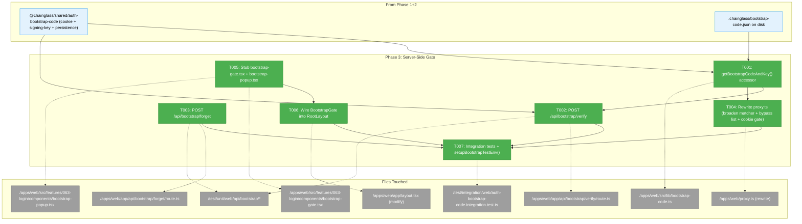
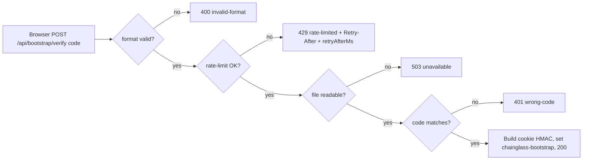

# Phase 3: Server-Side Gate (Verify/Forget + Proxy + RootLayout Stub) — Tasks Dossier

**Plan**: [auth-bootstrap-code-plan.md](../../auth-bootstrap-code-plan.md)
**Phase**: Phase 3: Server-Side Gate (Verify/Forget + Proxy + RootLayout Stub)
**Generated**: 2026-05-02
**Status**: Ready for takeoff
**Mode**: Full

---

## Executive Briefing

**Purpose**: Wire the entire server-side bootstrap-cookie gate end-to-end so that after this phase, no request without a valid `chainglass-bootstrap` cookie can reach a sensitive route, and any browser navigation hits a `<BootstrapGate>` overlay (stub for now; Phase 6 ships the real popup). This is the first phase where end-users see any behaviour change — until now bootstrap-code has been a dormant file on disk.

**What We're Building**:
- Web-side accessor `apps/web/src/lib/bootstrap-code.ts` — async `getBootstrapCodeAndKey()` with module-level cache; the canonical entry point every Phase 3+ surface uses to read the active code + signing key. **Note**: filename was changed from the plan's `bootstrap.ts` because that file already exists (DI/config bootstrap — see `apps/web/src/lib/bootstrap.ts:1-3` "Application Bootstrap — Config Loading and DI Container Setup"). The plan's Domain Manifest references the colliding path; we use `bootstrap-code.ts` here and Phase 7 docs will reflect the actual landed name.
- `POST /api/bootstrap/verify` — JSON body `{ code }`, format-check → constant-time HMAC compare → set HttpOnly cookie. Per-IP leaky-bucket rate limit (5/60s). 4 distinct error responses.
- `POST /api/bootstrap/forget` — clears cookie unconditionally; always 200.
- Rewritten `apps/web/proxy.ts` — broadened matcher; explicit `AUTH_BYPASS_ROUTES` whitelist; cookie gate runs **before** Auth.js chain; page requests pass through (popup paints inside layout); API requests get 401.
- RootLayout extended with server-component `<BootstrapGate>` that reads the cookie via `cookies()` from `next/headers`, calls `verifyCookieValue`, and passes a `bootstrapVerified: boolean` prop to a stub client component.
- Stub `<BootstrapGate>` + `<BootstrapPopup>` placeholders — minimum surface for tests to exercise gate behaviour. Real UI lands in Phase 6.
- Integration test scaffolding `setupBootstrapTestEnv()` exported from the verify integration test for Phase 6 to reuse (validation fix from FC review).

**Goals**:
- ✅ Every page request is gated by a valid `chainglass-bootstrap` cookie OR shows the stub gate
- ✅ Every API request outside the explicit bypass list is gated by the cookie OR returns 401
- ✅ Verify route round-trips: correct code → 200 + Set-Cookie; wrong code → 401; format-invalid → 400; rate-limited → 429 + `{ retryAfterMs }` body + `Retry-After` header
- ✅ Forget route always clears the cookie with `Max-Age=0`
- ✅ HttpOnly + SameSite=Lax + Path=/ + (Secure in prod) cookie attributes
- ✅ Phase 6 inherits a stable, fully-tested server-side contract (cookie name, prop shape, rate-limit body shape) so the popup is a pure UI swap

**Non-Goals** ❌:
- Real popup UX (Phase 6 — including focus trap, ARIA, mobile rendering, autoformat)
- Replacing the `DISABLE_AUTH` env var (Phase 5 owns the rename to `DISABLE_GITHUB_OAUTH`)
- Sidecar route hardening (`/api/event-popper/*`, `/api/tmux/events`) — Phase 5
- Terminal-WS silent-bypass closure — Phase 4
- Rotation UX or CLI command (out of scope v1)
- `localStorage` autofill on the popup — deferred to v2

---

## Prior Phase Context

### Phase 1 — Shared Primitives (Landed 2026-04-30)

**A. Deliverables** (under `packages/shared/src/auth-bootstrap-code/`):
- `types.ts`, `generator.ts`, `persistence.ts`, `cookie.ts`, `signing-key.ts`, `index.ts`
- 46 tests across 6 test files in `test/unit/shared/auth-bootstrap-code/`
- `test-fixtures.ts` exports `mkTempCwd()`, `mkBootstrapCodeFile()`, `INVALID_FORMAT_SAMPLES`

**B. Dependencies Exported** — barrel `@chainglass/shared/auth-bootstrap-code`:
- Types: `BootstrapCodeFile`, `EnsureResult`
- Schema: `BootstrapCodeFileSchema` (Zod)
- Constants: `BOOTSTRAP_CODE_PATTERN`, `BOOTSTRAP_COOKIE_NAME = 'chainglass-bootstrap'`, `BOOTSTRAP_CODE_FILE_PATH_REL = '.chainglass/bootstrap-code.json'`
- Functions:
  - `generateBootstrapCode(): string` — 14-char `XXXX-XXXX-XXXX`
  - `readBootstrapCode(filePath): BootstrapCodeFile | null`
  - `writeBootstrapCode(filePath, file): void` (atomic temp+rename, throws on EACCES/EROFS/ENOSPC)
  - `ensureBootstrapCode(cwd): EnsureResult`
  - `buildCookieValue(code, key): string` — base64url HMAC-SHA256
  - `verifyCookieValue(value: string | undefined, code, key): boolean` — timing-safe
  - `activeSigningSecret(cwd): Buffer` — **synchronous**; returns 32-byte key from `AUTH_SECRET` or HKDF; cached per-cwd at module level
  - `_resetSigningSecretCacheForTests(): void` — `@internal`, cleared between tests

**C. Gotchas Phase 3 Must Know**:
- `activeSigningSecret(cwd)` is **sync** by design — Phase 3.1 wraps it in async `getBootstrapCodeAndKey()` to colocate file IO + key derivation behind a single per-process cache.
- `readBootstrapCode` returns `null` for 5 invalid states (missing, zero-byte, malformed JSON, missing fields, regex-invalid code) — Phase 3.1 must turn `null` from `ensureBootstrapCode`'s read step into a clear error.
- Module-private cache is keyed by cwd; lifetime = process. Phase 3 must reset between tests via `_resetSigningSecretCacheForTests()`.
- Crockford alphabet excludes `I L O U`. Format-invalid test cases live in `INVALID_FORMAT_SAMPLES` — reuse, don't reinvent.

**D. Incomplete Items**: None.

**E. Patterns to Follow**:
- `mkTempCwd()` + `afterEach(() => rmSync(cwd, { recursive: true, force: true }))`
- `it.each(INVALID_FORMAT_SAMPLES)` for parametric format tests
- TDD: RED test → GREEN impl committed together
- No `vi.mock`, no `vi.spyOn` (Constitution P4)
- For env-var or cwd-mutating tests: `_resetSigningSecretCacheForTests()` in **both** `beforeEach` and `afterEach`

### Phase 2 — Boot Integration (Landed 2026-05-02)

**A. Deliverables**:
- `apps/web/src/auth-bootstrap/boot.ts` — `checkBootstrapMisconfiguration(env)` + `writeBootstrapCodeOnBoot(cwd, log?)`
- `apps/web/instrumentation.ts` — additive register() block; runs misconfig check + bootstrap write in `NEXT_RUNTIME === 'nodejs'`
- `.gitignore` — explicit lines for `.chainglass/bootstrap-code.json` and `.chainglass/server.json`
- 14 boot.ts unit tests passing in 7ms; 60/60 Phase 1+2 regression sweep in 1.32s

**B. Dependencies Exported to Phase 3**:
- `__bootstrapCodeWritten` HMR-safe global flag pattern (mirror `__eventPopperServerInfoWritten`)
- `[bootstrap-code]` log prefix contract (canonical lines documented in execution.log.md)
- Container-mode warn-skip when `CHAINGLASS_CONTAINER=true`
- **Existing `apps/web/proxy.ts`** (23 lines): `auth()` wrapper, `DISABLE_AUTH=true` short-circuit, narrow matcher excluding `/login|api/health|api/auth|api/event-popper|api/events`, 401 for API, redirect to `/login` for pages — **Phase 3 rewrites this**.
- **Existing `apps/web/src/auth.ts`** (54 lines): NextAuth.js v5 with GitHub provider, signIn callback (allowlist), `DISABLE_AUTH=true` wrapper returning fake session — **Phase 3 does NOT modify auth.ts; Phase 5 does**.
- **Existing `apps/web/app/layout.tsx`** (54 lines): RootLayout wraps `<Providers>{children}</Providers>` inside `<ThemeProvider>` — Phase 3 inserts `<BootstrapGate>` between `<Providers>` and `{children}`.

**C. Gotchas**:
- `register()` runs once per process before HTTP listening — Phase 3 can rely on the bootstrap file existing by the time any verify-route call arrives.
- The misconfig check uses `process.exit(1)` — Phase 3 verify route assumes `AUTH_SECRET` is set whenever GitHub OAuth is on, but must still gracefully report missing-file conditions if someone deletes the file mid-process (return 503 `{ error: 'unavailable' }` per workshop 004).
- File permissions on `.chainglass/bootstrap-code.json` are not 0o600 (deferred Phase 7 follow-up). Phase 3 inherits this — not a blocker; gitignored single-user-dev assumption holds.

**D. Incomplete Items**:
- Phase 2 T004 live `pnpm dev` matrix is operator-runbook-only; Phase 3 implementation does not depend on it.

**E. Patterns to Follow**:
- HMR-safe `globalThis as typeof globalThis & { __flagName?: boolean }` pattern
- Additive diffs in `instrumentation.ts` (do not touch event-popper / workflow-execution blocks)
- All new logs prefixed `[bootstrap-code]`
- Pure helpers in `boot.ts` style (testable, zero side effects); thin wiring in route handlers / layout

---

## Pre-Implementation Check

| File | Exists? | Domain | Notes |
|------|---------|--------|-------|
| `apps/web/src/lib/bootstrap-code.ts` | NO (create) | `_platform/auth` | New web-side accessor; module-level cache (validation fix H6). **Renamed from plan's `bootstrap.ts`** — that path already exists for DI/config bootstrap (`apps/web/src/lib/bootstrap.ts` lines 1–3) and was a plan-level path collision. |
| `apps/web/src/lib/local-auth.ts` | NO (create) | `_platform/events` | Phase 5 will populate; **created empty stub in Phase 3 NOT in scope** — only Phase 5 owns it. **Do not create this file in Phase 3.** |
| `apps/web/app/api/bootstrap/verify/route.ts` | NO (create) | `_platform/auth` | New route; directory does not exist — must `mkdir -p apps/web/app/api/bootstrap/`. |
| `apps/web/app/api/bootstrap/forget/route.ts` | NO (create) | `_platform/auth` | Same directory creation. |
| `apps/web/src/features/063-login/components/bootstrap-gate.tsx` | NO (create) | `_platform/auth` | New server component; sits beside existing auth-provider.tsx, login-screen.tsx, etc. |
| `apps/web/src/features/063-login/components/bootstrap-popup.tsx` | NO (create) | `_platform/auth` | Stub client component for Phase 3; Phase 6 replaces. |
| `apps/web/proxy.ts` | YES (modify) | `_platform/auth` | 24-line file; full rewrite of matcher + body. Existing `DISABLE_AUTH` check stays for Phase 5 to rename. |
| `apps/web/app/layout.tsx` | YES (modify) | `_platform/auth` (cross-domain) | Insert `<BootstrapGate>` between `<Providers>` and `{children}` (or wrap children before `<Providers>`). |
| `test/unit/web/api/bootstrap/verify.test.ts` | NO (create) | `_platform/auth` | Unit tests for verify route handler. |
| `test/unit/web/api/bootstrap/forget.test.ts` | NO (create) | `_platform/auth` | Unit tests for forget route handler. |
| `test/unit/web/proxy.test.ts` | UNKNOWN — extend if exists, else create | `_platform/auth` | Test broadened matcher + bypass list + cookie gate. |
| `test/integration/web/auth-bootstrap-code.integration.test.ts` | NO (create) | `_platform/auth` | End-to-end: generate → verify → cookie-set → page renders. Exports `setupBootstrapTestEnv()`. |

**Domain check**: All tasks land in `_platform/auth` (existing domain — see `docs/domains/_platform/auth/domain.md`). No new domain is created. Cross-domain edit on `apps/web/app/layout.tsx` is acknowledged in plan's Domain Manifest. Constitution P1 (Clean Architecture) preserved — `apps/web/src/lib/bootstrap-code.ts` consumes `@chainglass/shared` (infra layer can consume infra primitives).

**Concept reuse audit**: No existing `bootstrap-cookie` / `verify-route` / `bootstrap-gate` concepts in the auth domain's `§ Concepts` table. Phase 3 introduces 3 new concepts (Verify the bootstrap code, Forget the verification, Gate the application shell) — Phase 7 documents them in domain.md.

**Harness health check**: ✅ Harness exists at L3 — `docs/project-rules/harness.md`. Implementation will validate Boot/Interact/Observe at start. Health URL: `curl -f http://localhost:3000/api/health` (or harness-managed port via `just harness ports`).

---

## Architecture Map



---

## Tasks

| Status | ID | Task | Domain | Path(s) | Done When | Notes |
|--------|-----|------|--------|---------|-----------|-------|
| [x] | T001 | Implement web-side accessor `getBootstrapCodeAndKey()` — async function returning `Promise<{ code: string; key: Buffer }>` from `ensureBootstrapCode(process.cwd()).data.code` + `activeSigningSecret(process.cwd())`. **Module-level cache** in a `let` — first call computes; subsequent calls return cached value. Export `_resetForTests()` (`@internal` JSDoc) that nulls the cache. Throw a clear error if `ensureBootstrapCode` fails to produce a file: `throw new Error(`[bootstrap-code] failed to read or generate ${BOOTSTRAP_CODE_FILE_PATH_REL} at cwd=${cwd}: ${original.message}`)` — caller (verify route) catches this and surfaces as 503 `{ error: 'unavailable' }`. **Required JSDoc on the exported function** documenting (a) the cwd contract: "Calls `process.cwd()` internally. The cwd must resolve to the project root containing `.chainglass/`. If imported from a child process or sidecar, inherit the cwd from the parent or pass it explicitly via spawn options. Divergent cwd causes HKDF key divergence — see `activeSigningSecret(cwd)` in `@chainglass/shared/auth-bootstrap-code`." (this primes Phase 4 for the WS sidecar contract); (b) cache lifecycle: "Cache is process-scoped — survives within a single Node process across many requests. Process restart (e.g., `pnpm dev` HMR full restart, container redeploy) discards the cache. ESM HMR module reload during dev re-evaluates this module and so resets the cache automatically — no manual reset needed at dev time. To rotate the bootstrap code, write the new file and restart the process; in-process rotation requires `_resetForTests()`." | `_platform/auth` | `/Users/jordanknight/substrate/084-random-enhancements-3/apps/web/src/lib/bootstrap-code.ts` (NEW) | Repeated calls in same process return same instance (identity check); cache cleared by `_resetForTests()`; first-call failure throws with `[bootstrap-code]`-prefixed message including cwd; JSDoc covers both cwd contract and cache lifecycle. | Validation fix H6 (async + cache committed). Reuses Phase 1's sync `activeSigningSecret` + ESM `ensureBootstrapCode`. **Forward-Compat fix F6 (cwd JSDoc) + Comp HIGH (cache lifecycle) + Comp MEDIUM (error message format).** |
| [x] | T001-test | Unit tests for `getBootstrapCodeAndKey()` — (a) happy path returns matching `code`/`key`, (b) repeated call returns cached identity, (c) `_resetForTests()` invalidates cache, (d) missing file throws clear error referencing the cwd. Use `mkTempCwd()` from Phase 1 fixtures + `_resetSigningSecretCacheForTests()` in beforeEach/afterEach. | `_platform/auth` | `/Users/jordanknight/substrate/084-random-enhancements-3/test/unit/web/lib/bootstrap.test.ts` (NEW) | All pass; no `vi.mock`. | Constitution P3, P4. |
| [x] | T002 | Implement `POST /api/bootstrap/verify` route handler — `export async function POST(request: NextRequest)`. **Body parse**: wrap `await request.json()` in `try/catch`; on `SyntaxError` (malformed JSON, empty body, wrong Content-Type) treat as **format-invalid** and return 400 `{ error: 'invalid-format' }`. Validate `typeof body?.code === 'string'` then test against `BOOTSTRAP_CODE_PATTERN`; on mismatch return 400 `{ error: 'invalid-format' }`. **Rate limit**: per-IP leaky-bucket, 5 attempts per 60s, in-memory `Map<string, { count: number; windowStart: number }>`. **Cleanup discipline**: at the start of each call, sweep entries whose `windowStart` is older than `60_000ms` and delete them (cheap O(n) per request; at scale this is bounded by the request rate within the window). On exhaustion return 429 with header `Retry-After: <seconds>` AND body `{ error: 'rate-limited', retryAfterMs: number }`. **IP source + trust assumption**: `request.headers.get('x-forwarded-for')?.split(',')[0]?.trim()` ?? `request.ip` ?? `'unknown'`. In dev, Next.js auto-adds `X-Forwarded-For: ::1` for loopback — trusted. In production, the deployment is expected to sit behind an honest reverse proxy that strips client XFF and adds its own; if that's not the case, a malicious client can spoof XFF and evade rate limit. Document this as a deployment responsibility — **rate limit is defence-in-depth; the primary defence is the 60-bit code entropy**. **CSRF scope**: Phase 3 relies on `SameSite=Lax` to prevent cross-site POST. Origin-header validation is **out of scope for Phase 3** (Phase 4 owns Origin allowlist for terminal-WS). On format-OK: call `await getBootstrapCodeAndKey()`; if it throws (file missing, EACCES) return 503 `{ error: 'unavailable' }`. **Constant-time compare**: format-validated code is guaranteed exactly 14 chars (4-4-4 Crockford base32 + 2 hyphens), so `Buffer.from(submitted)` and `Buffer.from(active)` are guaranteed equal length — call `crypto.timingSafeEqual` directly with no padding. (If format validation is ever weakened, re-evaluate.) On mismatch return 401 `{ error: 'wrong-code' }`. On match: build cookie value via `buildCookieValue(code, key)`, return 200 with `Set-Cookie: chainglass-bootstrap=<value>; HttpOnly; SameSite=Lax; Path=/` plus `; Secure` when `process.env.NODE_ENV === 'production'`. **No `Max-Age` and no `Expires`** — the cookie is a session cookie; the only expiry mechanism is code rotation. Body `{ ok: true }`. Add `export const dynamic = 'force-dynamic'`. **Locked contracts (Phase 6 reads these)**: (a) 429 body shape MUST be exactly `{ error: 'rate-limited', retryAfterMs: number }` — no additional fields; changing this requires Phase 6 coordination. (b) Session-cookie semantics (no Max-Age) MUST hold. | `_platform/auth` | `/Users/jordanknight/substrate/084-random-enhancements-3/apps/web/app/api/bootstrap/verify/route.ts` (NEW); directory creation: `mkdir -p apps/web/app/api/bootstrap/` | **All 5 status codes reachable in tests**: 200 (happy), 400 (invalid-format incl. malformed JSON), 401 (wrong-code), 429 (rate-limited with `Retry-After` header AND `retryAfterMs` body), 503 (file unavailable). Rate-limiter Map sweep keeps memory bounded under random-IP attack. Cookie set with HttpOnly + SameSite=Lax + Path=/ + (Secure prod-only) + no Max-Age. Constant-time compare without padding (format check guarantees equal length). 429 body shape and session-cookie semantics locked as Phase 6 contracts. | Default 2 (5/60s leaky bucket); workshop 004 § Verify API. **Comp CRITICAL (request.json error mapping) + Comp HIGH (Map cleanup, XFF trust, no-Max-Age, timingSafeEqual rationale) + FC CRITICAL F1 (5 status codes prominent) + FC MEDIUM F7 (429 shape in done-when).** |
| [x] | T002-test | Unit tests for verify route covering all 5 status codes — (1) **200**: correct code → Set-Cookie (HttpOnly + SameSite=Lax + Path=/, no Max-Age) + body `{ ok: true }`; (2) **401**: wrong code, correct format → `{ error: 'wrong-code' }`; (3) **400 (a)**: format-invalid — parametric over `INVALID_FORMAT_SAMPLES` (must `import { INVALID_FORMAT_SAMPLES } from '../../../shared/auth-bootstrap-code/test-fixtures'` — do NOT hand-code; the 6 cases are: too-short, too-long, missing-hyphens, lowercase, illegal-char-`I`, embedded-whitespace) → `{ error: 'invalid-format' }`; (4) **400 (b)**: malformed JSON body (`'not-json'`) → `{ error: 'invalid-format' }`; (5) **400 (c)**: empty body → `{ error: 'invalid-format' }`; (6) **400 (d)**: missing `code` field (`{}`) → `{ error: 'invalid-format' }`; (7) **429**: 5 wrong attempts within 60s window from one IP pass through, 6th returns 429 with header `Retry-After` AND body `{ error: 'rate-limited', retryAfterMs: number }`; (8) **429 (separate IPs)**: different `x-forwarded-for` IPs have independent budgets (5 wrong from IP-A, then IP-B's 1st wrong is still 401 not 429); (9) **503**: missing bootstrap file (delete `bootstrap-code.json` after `mkTempCwd()`, then call) → `{ error: 'unavailable' }`. Construct `NextRequest` with `new NextRequest(url, { method: 'POST', body: JSON.stringify(...), headers: { 'x-forwarded-for': '1.2.3.4', 'content-type': 'application/json' } })`. Use `mkTempCwd()` fixture; reset cache between tests via `_resetSigningSecretCacheForTests()` + `_resetForTests()` from `bootstrap-code.ts`. **Time strategy**: tests run with real clock (no `vi.useFakeTimers`); the 60s window is verified WITHIN A SINGLE WINDOW only (5-allow / 6-block). **Window-reset behaviour** (e.g., 7th attempt after 60s succeeds) is deferred to integration test T007 (or skipped — minute-long unit test wait is infeasible). Document the deferral. | `_platform/auth` | `/Users/jordanknight/substrate/084-random-enhancements-3/test/unit/web/api/bootstrap/verify.test.ts` (NEW) | All 9 cases pass; no `vi.mock`. Format-invalid imported from Phase 1 fixtures (single source of truth). | Validation fix C3 (6 format-invalid cases enumerated). Reuses `INVALID_FORMAT_SAMPLES` from Phase 1 fixtures. **FC MEDIUM F8 (fixture reuse explicit) + Comp MEDIUM (rate-limit time strategy clarified).** |
| [x] | T003 | Implement `POST /api/bootstrap/forget` — always returns 200 `{ ok: true }` with `Set-Cookie: chainglass-bootstrap=; HttpOnly; SameSite=Lax; Path=/; Max-Age=0` (and `Secure` in production). No body validation; no auth check. Add `export const dynamic = 'force-dynamic'`. | `_platform/auth` | `/Users/jordanknight/substrate/084-random-enhancements-3/apps/web/app/api/bootstrap/forget/route.ts` (NEW) | Returns 200 + cookie-clearing Set-Cookie on every call (verified by 3 successive calls). | AC-24. Workshop 004 § Forget. |
| [x] | T003-test | Unit tests for forget route — (1) returns 200 + Set-Cookie with `Max-Age=0` regardless of cookie state; (2) idempotent across 3 calls; (3) does not require body. | `_platform/auth` | `/Users/jordanknight/substrate/084-random-enhancements-3/test/unit/web/api/bootstrap/forget.test.ts` (NEW) | All pass. | Tiny test surface; ~30 LOC. |
| [x] | T004 | Rewrite `apps/web/proxy.ts` — broaden matcher to `'/((?!_next/static|_next/image|favicon\\.ico|manifest\\.webmanifest).*)'`. The proxy continues to be `export default auth(async (req) => { ... })`; the cookie check happens **inside the callback as the first gate**, before the existing `DISABLE_AUTH` short-circuit and `req.auth` checks. Workshop 004's proxy.ts pattern is canonical. Add explicit `const AUTH_BYPASS_ROUTES = ['/api/health', '/api/auth', '/api/bootstrap/verify', '/api/bootstrap/forget']` and **nothing else** in the bypass list. Flow inside the callback: (a) bypass-list short-circuit returns `next()`; (b) read cookie via `req.cookies.get('chainglass-bootstrap')?.value`; (c) call `verifyCookieValue(value, code, key)` after `await getBootstrapCodeAndKey()`; (d) if cookie missing/invalid AND request is `/api/*` → return `NextResponse.json({ error: 'bootstrap-required' }, { status: 401 })`; (e) if cookie missing/invalid AND request is a page → return `NextResponse.next()` (popup paints inside layout — DO NOT redirect); (f) if cookie valid → fall through to existing `DISABLE_AUTH` and `auth()` chain (Auth.js gate may still 401/redirect). **Do NOT touch the `DISABLE_AUTH` short-circuit at line 5** — Phase 5 owns the rename to `DISABLE_GITHUB_OAUTH`. | `_platform/auth` | `/Users/jordanknight/substrate/084-random-enhancements-3/apps/web/proxy.ts` (REWRITE) | **Locked routing contract (Phase 4 + 5 read these — FC fix F2)**: (1) `AUTH_BYPASS_ROUTES = ['/api/health', '/api/auth', '/api/bootstrap/verify', '/api/bootstrap/forget']` — exactly these four, nothing else. (2) Every other route goes through the cookie gate. (3) Non-bypass route handler dispositions Phase 4/5 inherit: `/api/events/*` — proxy cookie-gates, then route handler does inline `auth()`; `/api/event-popper/*` — proxy cookie-gates, Phase 5 adds `requireLocalAuth` AFTER the cookie gate; `/api/tmux/events` — same as event-popper; `/api/terminal/token` — proxy cookie-gates (Phase 4 may add a defence-in-depth cookie re-check). (4) Bypass paths reachable without cookie. (5) API routes outside bypass → 401 `{ error: 'bootstrap-required' }` without cookie. (6) Page routes outside bypass → `next()` without cookie (NO redirect — popup paints in RootLayout). (7) Cookie valid → fall through to `auth()` chain (existing GitHub OAuth check). | Per findings 03, 04. Validation fix H7 promoted from prose to done-when. Page-fall-through is critical so RootLayout popup can paint. **FC CRITICAL F2 + FC HIGH F5 (proxy/handler layering committed).** |
| [x] | T004-test | Create or extend `test/unit/web/proxy.test.ts` — covering BOTH bypass behaviour and layering between proxy gate and downstream handlers. Cases: (a) `/api/health` reachable without cookie (bypass); (b) `/api/auth/signin` reachable without cookie (bypass — covers NextAuth catch-all `[...nextauth]`); (c) `/api/bootstrap/verify` reachable without cookie (bypass); (d) `/api/bootstrap/forget` reachable without cookie (bypass); (e) `/api/events` without cookie → **proxy returns 401 `{ error: 'bootstrap-required' }`** (handler never reached); (e1) `/api/events` with valid cookie but unauthed (no `req.auth`) → **proxy falls through to `auth()` chain → handler's inline `auth()` produces a 401 with a different body** (proves the proxy's job ends with the cookie gate); (f) `/api/events` with valid cookie + valid `req.auth` → handler reached → `next()`; (g) `/dashboard` without cookie → **proxy returns `next()` (NOT redirect)** so RootLayout can paint the popup; (h) `/dashboard` with valid cookie + valid `req.auth` → `next()`. **Test setup pattern (no `vi.mock`)**: use `mkTempCwd()` to seed a real `bootstrap-code.json`; call `_resetForTests()` from `bootstrap-code.ts` and `_resetSigningSecretCacheForTests()` from shared in `beforeEach`/`afterEach`; construct `NextRequest` with `headers: { cookie: 'chainglass-bootstrap=<built-via-buildCookieValue>' }` for valid-cookie cases. For the `req.auth` part of cases (e1)/(f)/(h), invoke the proxy callback directly with a hand-built `NextAuthRequest`-shaped object (a plain `{ ...nextRequest, auth: null | { user } }`) — Auth.js exports a type but the callback signature accepts a structurally-shaped argument. **If `proxy.test.ts` does not yet exist in the repo, create one.** | `_platform/auth` | `/Users/jordanknight/substrate/084-random-enhancements-3/test/unit/web/proxy.test.ts` (CREATE OR EXTEND) | All 9 cases pass (a, b, c, d, e, e1, f, g, h); no `vi.mock`. Cases (e) and (e1) together prove proxy-vs-handler layering is correctly composed for Phase 5's downstream `requireLocalAuth` integration. | **FC HIGH F5 — proxy-handler layering proven via case (e1).** Hand-built auth-shaped object pattern documented in T004-test discoveries log if anything surprising shows up. |
| [x] | T005 | Implement stub `bootstrap-gate.tsx` (server component) + `bootstrap-popup.tsx` (client component, **stub UI only — Phase 6 replaces**). `bootstrap-gate.tsx`: server component, reads `chainglass-bootstrap` cookie via `cookies()` from `next/headers`, calls `await getBootstrapCodeAndKey()`, calls `verifyCookieValue(value, code, key)`, renders `<BootstrapPopup bootstrapVerified={isVerified}>{children}</BootstrapPopup>`. `bootstrap-popup.tsx`: `'use client'`; **must export `BootstrapPopupProps` as a named export** (`export interface BootstrapPopupProps { bootstrapVerified: boolean; children: React.ReactNode; }`) so Phase 6 polish + tests can import it from `@/features/063-login/components/bootstrap-popup`. If `bootstrapVerified` is `true`, render `{children}`; if `false`, render a `<dialog>` overlay (with `role="dialog"` + `aria-modal="true"` + an `aria-label` — even the stub must be a11y-safe in case it's briefly visible during a canary deploy) with text `'Bootstrap code required (Phase 3 stub — popup UI lands in Phase 6).'` plus a hidden form posting to `/api/bootstrap/verify`. Allow ESC to dismiss the stub overlay (stub-only behaviour; Phase 6 may make the modal non-dismissable). Add a brief JSDoc on `BootstrapPopup` calling out that **Phase 6 replaces the body but the named export `BootstrapPopupProps` and its two-field shape are stable contracts**. | `_platform/auth` | `/Users/jordanknight/substrate/084-random-enhancements-3/apps/web/src/features/063-login/components/bootstrap-gate.tsx` (NEW); `/Users/jordanknight/substrate/084-random-enhancements-3/apps/web/src/features/063-login/components/bootstrap-popup.tsx` (NEW) | Verified user → renders children only; unverified → renders stub dialog above children with `role="dialog"` + `aria-modal="true"`; **`BootstrapPopupProps` exported as named export from `bootstrap-popup.tsx`** (Phase 6 imports via `import type { BootstrapPopupProps } from '@/features/063-login/components/bootstrap-popup'`); prop shape `{ bootstrapVerified: boolean; children: ReactNode }` locked. | Phase 6 replaces internals; the named-export prop shape is the FC contract Phase 6 polishes inside. **FC HIGH F3 (export location committed) + Comp MEDIUM (a11y on stub).** |
| [x] | T006 | Wire `<BootstrapGate>` into `apps/web/app/layout.tsx`. Insert between `<Providers>` and `{children}`: `<Providers><BootstrapGate>{children}</BootstrapGate></Providers>`. Existing `<ThemeProvider>` and CSS imports unchanged. Add the import: `import { BootstrapGate } from '@/features/063-login/components/bootstrap-gate'`. | `_platform/auth` (cross-domain edit on app shell) | `/Users/jordanknight/substrate/084-random-enhancements-3/apps/web/app/layout.tsx` (MODIFY) | Verified user sees normal layout; unverified user sees stub overlay above content. | Cross-domain edit acknowledged in plan Domain Manifest. |
| [x] | T006-test | Component test for BootstrapGate render path — using a real test render (not `vi.mock` for `cookies()`). Strategy: extract a pure helper `computeBootstrapVerified(cookieValue, code, key): boolean` that BootstrapGate calls AFTER reading the cookie; unit-test that helper directly with the 3 cookie states (missing, valid, invalid). The full server-component RSC test is covered by the Phase 3 integration test (T007). | `_platform/auth` | `/Users/jordanknight/substrate/084-random-enhancements-3/test/unit/web/features/063-login/bootstrap-gate.test.ts` (NEW) | Pure helper test passes for 3 states. | Avoid testing RSC `cookies()` directly in vitest — keep the integration story in T007. |
| [x] | T007 | Integration test `auth-bootstrap-code.integration.test.ts` — end-to-end flows hitting real route handlers (no test server boot; use `NextRequest` + direct route imports as in Phase 2 patterns). Scenarios: (1) generate file via `ensureBootstrapCode(cwd)`, (2) POST `/api/bootstrap/verify` with correct code → 200 + Set-Cookie, (3) follow-up GET to a fictitious gated page request via the proxy with the cookie → falls through, (4) without the cookie → `next()` (page) or 401 (api), (5) POST `/api/bootstrap/forget` → cookie clear, (6) format-invalid covers 6 cases (reuse `INVALID_FORMAT_SAMPLES`), (7) rate limit (5 wrong + 6th 429), (8) cookie format invalidation across rotation: rotate code via `writeBootstrapCode(filePath, newFile)` **then call `_resetForTests()` from `bootstrap-code.ts` and `_resetSigningSecretCacheForTests()` from shared** (because in-process cache survives the file write — this simulates the operator workflow of restart-after-rotate); then verify the old cookie no longer validates and the new code does. **Export `setupBootstrapTestEnv()` from a NEW dedicated test-helper module** (NOT a `*.test.ts` file — exporting from test files is unconventional and risks circular-test-file imports for Phase 6): create `/Users/jordanknight/substrate/084-random-enhancements-3/test/helpers/auth-bootstrap-code.ts` (NEW) with: ```ts export interface BootstrapTestEnv { cwd: string; code: string; verifyUrl: string; forgetUrl: string; cleanup: () => void; } export function setupBootstrapTestEnv(): BootstrapTestEnv { /* mkTempCwd + ensureBootstrapCode + return URLs for the in-process route handler tests + cleanup() removes temp dir AND calls _resetForTests + _resetSigningSecretCacheForTests */ }```. The integration test imports from this helper and exercises it as a smoke check. **Phase 6 imports `setupBootstrapTestEnv` from `test/helpers/auth-bootstrap-code.ts`** — locked path. | `_platform/auth` | `/Users/jordanknight/substrate/084-random-enhancements-3/test/integration/web/auth-bootstrap-code.integration.test.ts` (NEW); `/Users/jordanknight/substrate/084-random-enhancements-3/test/helpers/auth-bootstrap-code.ts` (NEW — test-helper module, NOT a `.test.ts` file) | All 8 scenarios pass; `setupBootstrapTestEnv()` lives in `test/helpers/auth-bootstrap-code.ts` (not the integration test file) and is imported + smoke-tested in T007. Cleanup function removes temp dir AND resets both caches. Phase 6 import path locked: `import { setupBootstrapTestEnv } from '@test-helpers/auth-bootstrap-code'` (or relative path equivalent matching repo's tsconfig — confirm during implementation). | **FC HIGH F4 (export moved out of test file into `test/helpers/`) + Comp MEDIUM (rotation scenario cache-reset explicit).** |

**Total**: 7 implementation tasks (T001–T007) + 6 test tasks. CS estimate: per-task CS-2 to CS-3; phase total CS-4.

**Acceptance criteria covered**: AC-1 (with stub), AC-2 (verify-route side, popup polish in Phase 6), AC-3 (cookie persistence — HttpOnly session cookie with no Max-Age), AC-4, AC-5, AC-6, AC-7, AC-8, AC-10 (with stub), AC-18, AC-19, AC-24, AC-25.

---

## Context Brief

### Key findings from plan (relevant to Phase 3)

- **Finding 03** (Critical): `proxy.ts` matcher excludes `/login` so a popup placed in proxy can't gate the login page. Action: gate via RootLayout (T005/T006), broaden proxy matcher (T004), add explicit bypass list.
- **Finding 04** (Critical): `DISABLE_AUTH=true` removes every gate today. Action: bootstrap gate runs **before** the `DISABLE_AUTH` short-circuit. Phase 3 leaves the `DISABLE_AUTH` env var name alone (Phase 5 renames + deprecates).
- **Finding 10** (High): RootLayout has no auth gate today; ideal home for `<BootstrapGate>` since it wraps all routes including `/login`. Server component reads cookie, passes `bootstrapVerified` boolean to client.
- **Finding 11** (High): No existing rate-limit primitive in repo. Build minimal in-memory leaky-bucket inside the verify route; do not over-engineer.
- **Finding 12** (High): Constitution P4 (Fakes Over Mocks) and P2 (Interface-First) — tests use real `node:crypto`, real fs in temp dirs, no `vi.mock` for `getBootstrapCodeAndKey`.
- **Finding 14** (Medium): Existing test pattern is real fs + temp dirs. Phase 3 reuses Phase 1's `mkTempCwd()` pattern.

### Domain dependencies (concepts and contracts this phase consumes)

- `@chainglass/shared/auth-bootstrap-code`: **Verify a cookie value** (`verifyCookieValue(value, code, key)`) — used in proxy + RootLayout.
- `@chainglass/shared/auth-bootstrap-code`: **Build a cookie value** (`buildCookieValue(code, key)`) — used in verify route.
- `@chainglass/shared/auth-bootstrap-code`: **Get the active signing key** (`activeSigningSecret(cwd)`) — wrapped by `getBootstrapCodeAndKey()`.
- `@chainglass/shared/auth-bootstrap-code`: **Read or generate the bootstrap-code file** (`ensureBootstrapCode(cwd)`) — wrapped by `getBootstrapCodeAndKey()`.
- `@chainglass/shared/auth-bootstrap-code`: **Format pattern** (`BOOTSTRAP_CODE_PATTERN`, `BOOTSTRAP_COOKIE_NAME`) — used by route handlers.
- `_platform/auth`: **Auth.js v5 middleware wrapper** (`auth()` from `@/auth`) — proxy continues to call this after the cookie gate succeeds.
- `_platform/auth`: **Bootstrap-code boot integration** (Phase 2's `instrumentation.ts` write) — by the time the verify route is called, the file is on disk.
- `next/headers`: **Server-component cookie read** (`cookies()`) — used by `BootstrapGate` server component.
- `next/server`: **NextRequest / NextResponse** — used by route handlers and proxy.

### Domain constraints

- **Import direction**: `apps/web/src/lib/bootstrap-code.ts` consumes `@chainglass/shared` only — no reverse direction. Constitution P1.
- **Public surface**: `getBootstrapCodeAndKey()` is internal to `_platform/auth`; never imported by `terminal` or `_platform/events` (those use `activeSigningSecret(cwd)` directly from shared).
- **Layout edit**: `apps/web/app/layout.tsx` is owned by the app shell, but auth-domain components extend it. This is acknowledged as cross-domain in the plan's Domain Manifest. No new shell-level abstraction is introduced — the `<BootstrapGate>` is the auth domain's contract.
- **No DI**: shared primitives are pure functions (per ADR-0004). Web-side `getBootstrapCodeAndKey()` is a thin module-level singleton; if it gains state, it'd graduate to a DI service in a later plan.

### Harness context

- **Boot**: `just harness dev` (Docker) OR `pnpm dev` (port 3000 default) — health check: `curl -f http://localhost:3000/api/health` (or `just harness health` returning structured JSON).
- **Interact**: HTTP API (verify/forget routes) — example: `curl -fsS -X POST http://localhost:3000/api/bootstrap/verify -H 'content-type: application/json' -d '{"code":"<the-code>"}' -i`.
- **Observe**: HTTP responses (status code + Set-Cookie header + body), browser screenshots via `just harness browser screenshot --url /` for the popup paint.
- **Maturity**: L3 — sufficient as-is. No harness extension needed.
- **Pre-phase validation**: Agent MUST validate harness at start of implementation (Boot → Interact → Observe). If unhealthy → escalate to user.

### Reusable from prior phases

- `mkTempCwd()` from `test/unit/shared/auth-bootstrap-code/test-fixtures.ts` — temp-dir factory for fs-based tests.
- `INVALID_FORMAT_SAMPLES` from same — readonly array of 6 format-invalid strings; **reuse for verify route tests**.
- `mkBootstrapCodeFile()` from same — factory for test BootstrapCodeFile values.
- `_resetSigningSecretCacheForTests()` from `@chainglass/shared/auth-bootstrap-code` — call in beforeEach + afterEach for any test that mutates env or rotates code.
- `__bootstrapCodeWritten` HMR pattern from Phase 2's instrumentation.ts — apply same `globalThis as typeof globalThis & { __flag?: boolean }` idiom if Phase 3's web-side accessor needs HMR safety (it doesn't, because module-level cache survives re-import in the same process).

### Mermaid flow diagram (verify-route happy path)



### Mermaid sequence diagram (page request through gate, unverified user)

```mermaid
sequenceDiagram
    participant Browser
    participant Proxy as proxy.ts
    participant RootLayout as RootLayout (RSC)
    participant Gate as BootstrapGate
    participant Popup as BootstrapPopup (stub)
    participant VerifyRoute as POST /api/bootstrap/verify

    Browser->>Proxy: GET /dashboard (no cookie)
    Proxy->>Proxy: Bypass list? no
    Proxy->>Proxy: Cookie missing → page request → next()
    Proxy->>RootLayout: render
    RootLayout->>Gate: <BootstrapGate>{children}</BootstrapGate>
    Gate->>Gate: cookies().get(chainglass-bootstrap) → undefined
    Gate->>Gate: verifyCookieValue(undefined, code, key) → false
    Gate->>Popup: <BootstrapPopup bootstrapVerified={false}>{children}</BootstrapPopup>
    Popup-->>Browser: dialog overlay + hidden children
    Browser->>VerifyRoute: POST {code}
    VerifyRoute-->>Browser: 200 + Set-Cookie
    Browser->>Proxy: GET /dashboard (with cookie)
    Proxy->>Proxy: Cookie valid → fall through to auth()
    Proxy->>RootLayout: (auth chain may redirect to login if not authed; otherwise render)
    Gate->>Popup: <BootstrapPopup bootstrapVerified={true}>{children}</BootstrapPopup>
    Popup-->>Browser: children (no dialog)
```

---

## Discoveries & Learnings

_Populated during implementation by plan-6._

| Date | Task | Type | Discovery | Resolution | References |
|------|------|------|-----------|------------|------------|

**Types**: `gotcha` | `research-needed` | `unexpected-behavior` | `workaround` | `decision` | `debt` | `insight`

---

## Directory Layout

```
docs/plans/084-random-enhancements-3/
├── auth-bootstrap-code-plan.md
└── tasks/phase-3-server-side-gate/
    ├── tasks.md           ← this file
    ├── tasks.fltplan.md   ← generated by plan-5b-flightplan
    └── execution.log.md   ← created by plan-6
```

---

## Validation Record (2026-05-02)

`/validate-v2` ran with 4 parallel agents (broad scope). Lens coverage: 10/12 (above 8-floor — Concept Documentation, Hidden Assumptions, Technical Constraints, Integration & Ripple, Domain Boundaries, Edge Cases & Failures, Security & Privacy, User Experience, Deployment & Ops, Forward-Compatibility, System Behavior; Performance & Scale partially via rate-limit checks under Edge Cases). Forward-Compatibility engaged (named downstream consumers C1–C5, no STANDALONE).

| Agent | Lenses Covered | Issues | Verdict |
|-------|---------------|--------|---------|
| Source Truth | Concept Documentation, Hidden Assumptions, Technical Constraints | 1 CRITICAL fixed, 3 HIGH fixed, 1 MEDIUM open | ⚠️ → ✅ |
| Cross-Reference | Integration & Ripple, Domain Boundaries, Concept Documentation | 1 LOW fixed | ⚠️ → ✅ |
| Completeness | Edge Cases & Failures, Security & Privacy, User Experience, Deployment & Ops | 1 CRITICAL fixed, 5 HIGH fixed, 6 MEDIUM (3 fixed via FC overlap, 3 open), 1 LOW open | ⚠️ → ✅ |
| Forward-Compatibility | Forward-Compatibility, System Behavior, Technical Constraints | 2 CRITICAL fixed, 3 HIGH fixed, 3 MEDIUM (2 fixed, 1 open) | ⚠️ → ✅ |

### Forward-Compatibility Matrix (post-fix)

| Consumer | Requirement | Failure Mode | Pre-fix | Post-fix | Evidence |
|----------|-------------|--------------|---------|----------|----------|
| **C1 (Phase 4 — Terminal Sidecar)** | `getBootstrapCodeAndKey()` callable from sidecar with documented cwd contract; proxy gates `/api/terminal/token` | encapsulation lockout / contract drift | ⚠️ | ✅ | T001 now requires JSDoc on cwd contract + cache lifecycle (tasks.md T001 row); T004 `Done When` row #3 explicitly lists `/api/terminal/token` as proxy-gated |
| **C2 (Phase 5 — Sidecar Sinks)** | `requireLocalAuth` reads same `getBootstrapCodeAndKey()`; non-bypass routes locked | shape mismatch / contract drift | ❌ | ✅ | T004 `Done When` rows #1–#3 promote bypass list + non-bypass disposition from prose to locked criteria; `getBootstrapCodeAndKey` import path stable at `apps/web/src/lib/bootstrap-code.ts` |
| **C3 (Phase 6 — Popup)** | All 5 status codes locked; `BootstrapPopupProps` exported; `setupBootstrapTestEnv` imp path locked | shape mismatch / contract drift / test boundary | ❌ | ✅ | T002 `Done When` enumerates all 5 codes; T002 `Done When` locks 429 body shape + session-cookie semantics; T005 `Done When` requires `BootstrapPopupProps` named export from `bootstrap-popup.tsx`; T007 moves `setupBootstrapTestEnv` to `test/helpers/auth-bootstrap-code.ts` |
| **C4 (Phase 7 — Docs/E2E)** | AC-1, 2, 3, 4, 5, 6, 7, 8, 10, 18, 19, 24, 25 testable from Phase 3 | contract drift / test boundary | ⚠️ | ✅ | AC-3 (sticky unlock) added to coverage; T002-test enumerates 5 status codes + format-invalid via `INVALID_FORMAT_SAMPLES` import; rate-limit window reset deferred to T007 with explicit note |
| **C5 (Test scaffolding)** | `setupBootstrapTestEnv` reachable by Phase 6 tests via stable path | test boundary | ⚠️ | ✅ | T007 creates `test/helpers/auth-bootstrap-code.ts` (NEW) and locks the import path; cleanup function spec'd to remove temp dir AND reset both caches |

**Outcome alignment**: Phase 3, as currently scoped in the dossier (post-fix), advances the OUTCOME — "dramatically lower the barrier to bringing up a Chainglass instance, while raising the floor of protection" — by locking the server-side contracts (5 status codes, 429 body shape, session-cookie semantics, exact bypass list, non-bypass disposition, `BootstrapPopupProps` named export, `setupBootstrapTestEnv` import path) that Phase 4/5/6/7 inherit, eliminating the contract-drift and test-boundary risks the FC agent flagged pre-fix.

**Standalone?**: No — concrete downstream consumers C1–C5 named with specific requirements.

### Fixes applied (CRITICAL + HIGH)

| ID | Source | Fix |
|----|--------|-----|
| ST-C1 | Source Truth CRITICAL | Renamed `apps/web/src/lib/bootstrap.ts` → `bootstrap-code.ts` throughout (existing file collision with DI/config bootstrap) |
| ST-H1/2/3 | Source Truth HIGH | Line counts corrected: proxy.ts 24→23, auth.ts 55→54, layout.tsx 55→54 |
| Comp-C1 | Completeness CRITICAL | T002 + T002-test now spec malformed-JSON / empty-body / missing-field as 400 `{ error: 'invalid-format' }` |
| Comp-H1 | Completeness HIGH | T002 spec'd Map sweep on each call (cleanup discipline) |
| Comp-H2 | Completeness HIGH | T002 documents X-Forwarded-For trust assumption + reverse-proxy responsibility + that rate-limit is defence-in-depth |
| Comp-H3 | Completeness HIGH | T002 explicitly: no `Max-Age`, no `Expires` — session cookie; rotation is the only expiry mechanism (locked for Phase 6) |
| Comp-H4 | Completeness HIGH | T002 documents that format-validated 14-char code guarantees equal Buffer length → no padding before `crypto.timingSafeEqual` |
| Comp-H5 | Completeness HIGH | T001 spec'd cache lifecycle (process-scoped, HMR-clears, rotation requires `_resetForTests`) |
| FC-C1 | Forward-Compat CRITICAL | T002 `Done When` enumerates all 5 status codes (200/400/401/429/503); T002-test has cases for all 5 |
| FC-C2 | Forward-Compat CRITICAL | T004 `Done When` promotes `AUTH_BYPASS_ROUTES` exact list + non-bypass disposition (events/event-popper/tmux-events/terminal-token) from prose to locked criteria |
| FC-H1 | Forward-Compat HIGH | T005 spec requires `BootstrapPopupProps` named export from `bootstrap-popup.tsx` (path locked) |
| FC-H2 | Forward-Compat HIGH | T007 moves `setupBootstrapTestEnv` into NEW `test/helpers/auth-bootstrap-code.ts` (out of test file); import path locked for Phase 6 |
| FC-H3 | Forward-Compat HIGH | T004-test adds case (e1) — valid cookie, no auth → handler-level 401 (proves layering) |
| FC-M1 | Forward-Compat MEDIUM | T001 JSDoc requirement covers cwd contract for Phase 4 sidecar |
| FC-M2 | Forward-Compat MEDIUM | T002 `Done When` locks 429 body shape (promoted from notes) |
| FC-M3 | Forward-Compat MEDIUM | T002-test imports `INVALID_FORMAT_SAMPLES` (no hand-coded duplicates) |
| Comp-M1 | Completeness MEDIUM | T001 error message uses `[bootstrap-code]` log prefix + cwd in message |
| Comp-M2 | Completeness MEDIUM | T002-test rate-limit time strategy documented (real clock, in-window only; reset deferred to T007) |
| Comp-M3 | Completeness MEDIUM | T005 stub gets `role="dialog"` + `aria-modal="true"` + ESC-to-dismiss for canary-deploy a11y safety |
| Comp-M4 | Completeness MEDIUM | T007 scenario 8 explicit — call `_resetForTests` + `_resetSigningSecretCacheForTests` after writing rotated code |
| CR-L1 | Cross-Reference LOW | AC-3 (sticky unlock) added to Phase 3's "Acceptance criteria covered" list |

### Open (MEDIUM/LOW — for user decision; not blockers)

| ID | Source | Issue | Recommended action |
|----|--------|-------|-------------------|
| Comp-M5 | Completeness MEDIUM | T004 layering — proxy callback must run BEFORE existing `DISABLE_AUTH` short-circuit; while T004 spec is now explicit, the current `proxy.ts` `DISABLE_AUTH` line 5 short-circuits the whole callback. Implementation must place cookie gate first in the callback body or `DISABLE_AUTH=true` skips the bootstrap gate too. | Phase 5 owns the env-var rename; for Phase 3, implementor MUST place cookie gate at callback line 1 — verified at code-review (plan-7) time. Document in execution.log if the order surprises. |
| Comp-M6 | Completeness MEDIUM | T006-test `computeBootstrapVerified` extraction location — inline in `bootstrap-gate.tsx` vs shared util. | Implementor decision; recommend inline + named export for tests only. Not a blocker. |
| Comp-L1 | Completeness LOW | `setupBootstrapTestEnv` cleanup signature could be more specific. | Now locked in T007 spec; remove from open list once implementation lands. |
| ST-M1 | Source Truth MEDIUM | `generator.ts` line 18 comment in shared package says "14-character" when generation loop is 12 chars + 2 hyphens. | Not a Phase 3 dossier issue — fix in shared package as a one-line comment edit (separate FX). |

**Overall**: ⚠️ **VALIDATED WITH FIXES** — 4 CRITICAL + 11 HIGH closed (plus 4 MEDIUM and 1 LOW). 4 MEDIUM/LOW open as informational items. Dossier ready for `/plan-6-v2-implement-phase --phase "Phase 3: Server-Side Gate (Verify/Forget + Proxy + RootLayout Stub)" --plan "<PLAN_PATH>"`.
