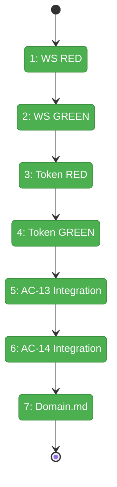
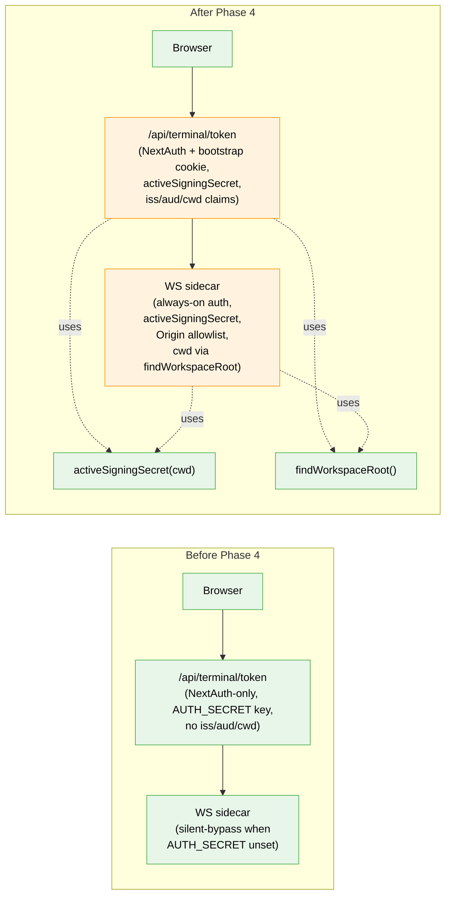

# Flight Plan: Phase 4 — Terminal Sidecar Hardening

**Plan**: [auth-bootstrap-code-plan.md](../../auth-bootstrap-code-plan.md)
**Phase**: Phase 4 — Terminal Sidecar Hardening
**Generated**: 2026-05-03
**Status**: Landed (2026-05-03)

---

## Departure → Destination

**Where we are**: Bootstrap-code primitives ship (Phase 1); the boot block writes `.chainglass/bootstrap-code.json` at the workspace root every Node start (Phase 2 + FX003). The proxy and verify/forget routes gate the browser surface (Phase 3); the popup component renders over `{children}` when the cookie is missing (Phase 6 — landed out of order). However, the **terminal-WS sidecar still silently degrades to no-auth when `AUTH_SECRET` is unset** (`terminal-ws.ts:235-240`), and `/api/terminal/token` JWTs lack any `iss`/`aud`/`cwd` binding — the worst remaining hole in the plan.

**Where we're going**: A developer can run `pnpm dev` without setting `AUTH_SECRET` and the terminal WS still rejects unauthenticated upgrades — the HKDF-derived bootstrap signing key takes over, and the JWT carries `iss: 'chainglass'` / `aud: 'terminal-ws'` / `cwd` claims that the sidecar verifies. Cross-origin upgrades and cross-cwd token replay are both rejected with 4403. The sidecar derives its cwd via `findWorkspaceRoot()`, so its HKDF key matches the main process — even if forked from a subdirectory.

---

## Domain Context

### Domains We're Changing

| Domain | What Changes | Key Files |
|--------|-------------|-----------|
| `terminal` | Sidecar always-on auth; `activeSigningSecret(cwd)` adoption; `iss`/`aud`/`cwd` claims; Origin allowlist; startup cwd assertion | `apps/web/src/features/064-terminal/server/terminal-ws.ts`, `apps/web/app/api/terminal/token/route.ts` |
| `terminal` (tests) | New scenarios (HKDF path, claims, Origin) + new integration test file | `test/unit/web/features/064-terminal/terminal-ws.test.ts`, `test/unit/web/api/terminal/token.test.ts`, `test/integration/web/features/064-terminal/terminal-bootstrap.integration.test.ts` |
| `terminal` (docs) | History row + Composition note | `docs/domains/terminal/domain.md` |
| cross-cutting (docs) | New `terminal -> _platform/auth (signing-key)` edge if missing | `docs/domains/domain-map.md` |

### Domains We Depend On (no changes)

| Domain | What We Consume | Contract |
|--------|----------------|----------|
| `_platform/auth` | Active signing secret | `activeSigningSecret(cwd: string): Buffer` |
| `_platform/auth` | Cached bootstrap accessor | `getBootstrapCodeAndKey(): Promise<{code,key}>` |
| `_platform/auth` | Cookie verification | `verifyCookieValue(value, code, key): boolean`, `BOOTSTRAP_COOKIE_NAME` |
| `@chainglass/shared` | Workspace-root walk-up | `findWorkspaceRoot(startDir: string): string` (FX003) |
| `terminal` (test scaffolding) | WS test fakes | `FakePty`, `FakeTmuxExecutor`, `setupBootstrapTestEnv()` |

---

## Flight Status

**Legend**: grey = pending | yellow = active | red = blocked/needs input | green = done

---

## Stages

- [x] **Stage 1: WS RED** — Extend `terminal-ws.test.ts` with five failing scenarios (HKDF path, missing-token, wrong-iss/aud/cwd, Origin missing/mismatch, startup cwd assertion) using real `jose` + `node:crypto` (`terminal-ws.test.ts`).
- [x] **Stage 2: WS GREEN** — Rewrite `terminal-ws.ts` auth block: always-on auth, `activeSigningSecret(findWorkspaceRoot(cwd))`, Origin allowlist, startup assertion + `process.exit(1)` on missing `bootstrap-code.json` (`terminal-ws.ts`).
- [x] **Stage 3: Token RED** — New `test/unit/web/api/terminal/token.test.ts` with four failing scenarios (no cookie, no session, claim assertions, tampered cookie) (`token.test.ts` — new file).
- [x] **Stage 4: Token GREEN** — Rewrite `route.ts` GET handler: keep `auth()`, add cookie pre-check, sign with `activeSigningSecret`, embed `iss`/`aud`/`cwd` claims (`route.ts`).
- [x] **Stage 5: AC-13 Integration** — Two-scenario test (cookie set + cookie missing) proving silent-bypass closure under `AUTH_SECRET=unset` (`terminal-bootstrap.integration.test.ts` — new file).
- [x] **Stage 6: AC-14 Integration** — `AUTH_SECRET=set` parity test ensures no regression vs current shipping behaviour (same file).
- [x] **Stage 7: Domain.md** — `docs/domains/terminal/domain.md` History row + Composition note; `docs/domains/domain-map.md` edge if missing.

---

## Architecture: Before & After

**Legend**: existing (green, unchanged) | changed (orange, modified) | new (blue, created)

---

## Acceptance Criteria

- [ ] AC-13 — Terminal WS rejects unauthenticated upgrades when `AUTH_SECRET` unset (HKDF path proves auth, two-scenario integration test passes).
- [ ] AC-14 — `AUTH_SECRET=set` flows continue to work end-to-end (parity test passes).
- [ ] AC-15 — `/api/terminal/token` returns 401 without bootstrap cookie even when NextAuth session is present.
- [ ] WS validator enforces `iss === 'chainglass'`, `aud === 'terminal-ws'`, and `payload.cwd === sidecar cwd`.
- [ ] WS validator rejects upgrades whose `Origin` is missing or not in the allowlist.
- [ ] Sidecar uses `findWorkspaceRoot(process.cwd())` for its signing-key derivation cwd.
- [ ] Sidecar fails fast with a clear error when `bootstrap-code.json` cannot be read at startup.
- [ ] All existing terminal-ws tests continue to pass.

## Goals & Non-Goals

**Goals**:
- Close the silent-bypass identified in the spec as the worst remaining hole.
- Bind JWTs to `iss` / `aud` / `cwd` so cross-tab and cross-service token replay is impossible.
- Mitigate CSWSH via Origin allowlist (default same-origin localhost).
- Adopt FX003's `findWorkspaceRoot()` so the sidecar HKDF key matches the main Next.js process.

**Non-Goals**:
- WSS-only mandate (deferred future hardening).
- Replacing NextAuth `auth()` on the token route (additive defence-in-depth, not replacement).
- Renaming any Plan 064 env vars.
- Modifying `event-popper` / `tmux/events` HTTP sinks (Phase 5 owns those).

---

## Checklist

- [x] T001: WS unit tests RED — five failing cases for HKDF path, missing token, wrong claims, Origin allowlist, startup cwd assertion.
- [x] T002: WS GREEN — `terminal-ws.ts` always-on auth + `activeSigningSecret` + Origin allowlist + startup assertion.
- [x] T003: Token route unit tests RED — four failing cases for no cookie / no session / claim assertions / tampered cookie.
- [x] T004: Token route GREEN — bootstrap-cookie pre-check + `activeSigningSecret` signing + `iss`/`aud`/`cwd` claims.
- [x] T005: AC-13 integration — silent-bypass closed under `AUTH_SECRET=unset`, both scenarios.
- [x] T006: AC-14 integration — `AUTH_SECRET=set` parity preserved.
- [x] T007: Domain.md History + Composition + domain-map edge.
