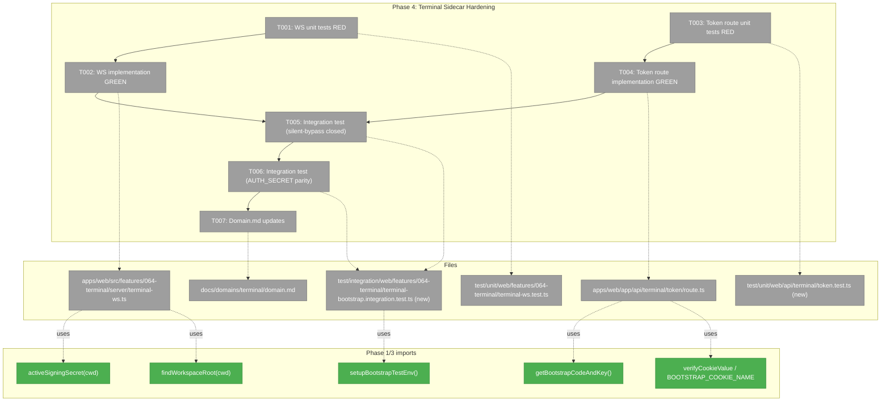
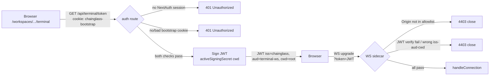
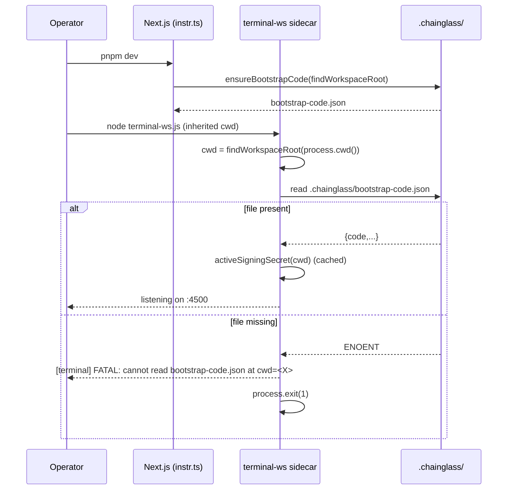

# Phase 4 — Terminal Sidecar Hardening

**Plan**: [auth-bootstrap-code-plan.md](../../auth-bootstrap-code-plan.md)
**Phase**: Phase 4 — Terminal Sidecar Hardening
**Generated**: 2026-05-03
**Status**: Ready for takeoff

---

## Executive Briefing

**Purpose**: Close the silent-bypass in the terminal-WS sidecar, switch token signing to the unified `activeSigningSecret(cwd)`, and bind JWTs to `iss`/`aud`/`cwd` so a token from one tab/cwd cannot be replayed against another. Also enforce an `Origin` header allowlist on WS upgrade to close the residual CSWSH vector.

**What We're Building**:
- `apps/web/src/features/064-terminal/server/terminal-ws.ts` no longer accepts unauthenticated connections under any env-var combination.
- `apps/web/app/api/terminal/token/route.ts` signs with `activeSigningSecret()`, embeds `iss: 'chainglass'` / `aud: 'terminal-ws'` / `cwd`, and requires the bootstrap cookie as defence-in-depth on top of the proxy gate.
- WS validator enforces `iss`/`aud`/`cwd` and an Origin allowlist (default same-origin localhost; opt-in via `TERMINAL_WS_ALLOWED_ORIGINS`).
- Sidecar uses `findWorkspaceRoot(process.cwd())` (FX003) to derive its cwd, eliminating the cross-process key-drift risk.
- Two new integration tests prove (a) silent-bypass closure and (b) `AUTH_SECRET=set` parity (no regression).

**Goals**:
- ✅ AC-13 — Terminal WS rejects unauthenticated upgrades when `AUTH_SECRET` unset (HKDF path proves auth, no silent fall-through).
- ✅ AC-14 — Existing `AUTH_SECRET=set` flows still work end-to-end.
- ✅ AC-15 — `/api/terminal/token` is gated by the bootstrap cookie (defence-in-depth on top of proxy).
- ✅ Mitigate CSWSH via Origin allowlist (Plan risk row + validation fix H3).
- ✅ Mitigate cwd-divergence via `findWorkspaceRoot()` adoption (Plan risk row + FX003 R6).

**Non-Goals**:
- ❌ WSS mandate (deferred future hardening — documented, not enforced).
- ❌ Replacement of NextAuth `auth()` session check on the token route — we keep the existing pre-check and **add** the bootstrap-cookie pre-check.
- ❌ Renaming `TERMINAL_WS_HOST` or other Plan 064 env vars.
- ❌ Out-of-process state for rate-limiting; this phase ships no rate-limit changes.
- ❌ Touching the `event-popper` / `tmux/events` HTTP sinks — that's Phase 5.
- ❌ Escape-hatch env var to re-enable the silent-bypass (e.g., `DISABLE_BOOTSTRAP_TERMINAL_AUTH`). Phase 4 closes the bypass permanently — rollback to a prior release is the only mitigation for catastrophic misconfig. This is intentional security-first stance; documented here so operators know.

---

## Prior Phase Context

### Phase 1 — Shared Primitives ✅ Landed

**A. Deliverables** — `packages/shared/src/auth-bootstrap-code/{types,generator,persistence,cookie,signing-key,workspace-root,index}.ts`. Pure functions; sync API; zero `vi.mock`.

**B. Dependencies Phase 4 consumes**:
- `activeSigningSecret(cwd: string): Buffer` — `AUTH_SECRET` if set + non-empty, else 32-byte HKDF-SHA256(code). Module-level cache keyed by cwd; `_resetSigningSecretCacheForTests()` for tests.
- `findWorkspaceRoot(startDir: string): string` — walk-up via `pnpm-workspace.yaml` → `package.json.workspaces` → `.git/`; cached + `_resetWorkspaceRootCacheForTests()`.
- `BOOTSTRAP_COOKIE_NAME = 'chainglass-bootstrap'` (from barrel).
- `verifyCookieValue(value: string | undefined, code: string, key: Buffer): boolean` (timing-safe).

**C. Gotchas relevant to Phase 4**:
- Cwd parity discipline — TSDoc on `activeSigningSecret(cwd)` warns sidecar must pass the *same* cwd as the main Next.js process. Divergent cwds silently produce divergent keys. **Phase 4 swap to `findWorkspaceRoot(process.cwd())` enforces parity at the substrate level.**
- Signing-key cache never times out — process restart is the rotation mechanism.
- `AUTH_SECRET=""` (empty/whitespace) treated as unset → HKDF path activates.

**D. Incomplete**: None.

**E. Patterns**: TDD RED→GREEN per task; real-fs via `mkTempCwd`; cache reset in `beforeEach`; `_resetXxxForTests` exports tagged `@internal`.

### Phase 2 — Boot Integration ✅ Landed

**A. Deliverables** — `instrumentation.ts` writes `<workspace-root>/.chainglass/bootstrap-code.json` on every Node boot via `findWorkspaceRoot()` + `ensureBootstrapCode()`; misconfig hard-fail; HMR-safe via `__bootstrapCodeWritten`.

**B. Dependencies Phase 4 consumes**:
- `bootstrap-code.json` is **load-bearing on every boot** — Phase 4 sidecar can rely on its presence at the canonical path (after `CHAINGLASS_CONTAINER` check).
- Boot log line: `[bootstrap-code] (generated new|active) code at <absolute-path>` — operators can grep this to confirm cwd alignment when running the sidecar separately.

**C. Gotchas relevant to Phase 4**:
- Container mode (`CHAINGLASS_CONTAINER=true`) skips the boot write; sidecar must handle "file missing" gracefully (log + exit, never silent-bypass).
- File write is atomic (temp+rename); concurrent reads are safe.

**D. Incomplete**: None (T004 operator runbook deferred to Phase 7 — non-blocking).

**E. Patterns**: HMR-safe via global flag; misconfig = `console.error` + `process.exit(1)` inside `NEXT_RUNTIME === 'nodejs'` branch.

### Phase 3 — Server-Side Gate ✅ Landed

**A. Deliverables** — `getBootstrapCodeAndKey()` accessor (cached, async wrapper around shared sync helpers); `/api/bootstrap/{verify,forget}/route.ts`; proxy cookie gate via `bootstrapCookieStage()`; `<BootstrapGate>` server component stub.

**B. Dependencies Phase 4 consumes**:
- `getBootstrapCodeAndKey(): Promise<{code, key}>` — Phase 4 token route imports this for cookie pre-check + JWT signing.
- Proxy already gates `/api/terminal/token` via `bootstrapCookieStage()` (cookie pre-check is upstream defence; Phase 4 task 4.3 adds the in-route check as defence-in-depth).
- `setupBootstrapTestEnv()` from `test/helpers/auth-bootstrap-code.ts` — Phase 4 integration tests reuse this for cwd / cookie scaffolding.

**C. Gotchas relevant to Phase 4**:
- `bootstrap-code.ts` is **server-only** (`node:fs` imports). Phase 4 sidecar is server-side, so safe to import.
- `getBootstrapCodeAndKey()` is module-scoped per process — sidecar gets one cache; no per-request cost.
- `verifyCookieValue` signature: `(value: string | undefined, code: string, key: Buffer) => boolean`. Phase 4 inherits this exact signature.

**D. Incomplete**: None (5 review findings applied; 83/83 phase tests + 1952/1952 regression sweep green).

**E. Patterns**: Server-only fs imports; cookie helpers always include `HttpOnly + SameSite=Lax + Path=/`; integration test setup via `setupBootstrapTestEnv()`.

### FX003 — Bootstrap-code workspace-root walk-up ✅ Landed (2026-05-03)

Adds `findWorkspaceRoot(startDir): string` to the shared barrel and swaps both web-side callsites (verify-route accessor + boot block). **R6 explicitly mandates Phase 4 sidecar adopts the same helper** so the WS process derives its cwd identically to the main Next.js process — eliminating the HKDF key-drift risk row in the plan.

---

## Pre-Implementation Check

| File | Exists? | Domain Check | Notes |
|------|---------|-------------|-------|
| `apps/web/src/features/064-terminal/server/terminal-ws.ts` | yes (350 LOC) | `terminal` ✅ | Modify lines 44–47 (auth config), 49–58 (validateToken), 234–240 (warn block), 242–276 (connection handler). Keep 0.0.0.0 binding behaviour; add Origin check. |
| `apps/web/app/api/terminal/token/route.ts` | yes (40 LOC) | `terminal` ✅ | Modify GET handler — keep NextAuth `auth()` pre-check, add bootstrap-cookie pre-check, swap signing key + claims. |
| `apps/web/src/lib/bootstrap-code.ts` | yes | `_platform/auth` ✅ | Re-use `getBootstrapCodeAndKey()` — no changes here. |
| `test/unit/web/features/064-terminal/terminal-ws.test.ts` | yes (extending) | `terminal` ✅ | Add scenarios: AUTH_SECRET unset (HKDF path) + iss/aud/cwd assertions + Origin allowlist (whitelist-match, mismatch, missing). |
| `test/unit/web/api/terminal/token.test.ts` | **NEW** (path needs verify) | `terminal` ✅ | Cookie pre-check + JWT claim assertions. Confirm directory layout under `test/unit/web/api/`. |
| `test/integration/web/features/064-terminal/terminal-bootstrap.integration.test.ts` | **NEW** | `terminal` ✅ | Two-scenario AC-13 test + AC-14 parity test. Reuse `setupBootstrapTestEnv()` helper. |
| `docs/domains/terminal/domain.md` | yes | `terminal` ✅ | Append History row; note `activeSigningSecret` consumption in Composition. |

**Concept-search check**: `requireLocalAuth` is being introduced in **Phase 5**, NOT this phase. Phase 4 stays scoped to terminal-only auth changes — do not creep into the events sinks.

**Contract surface**: Phase 4 does NOT change any shared package contracts. All new symbols stay inside `apps/web/`. Only the JWT shape (claims) is a new outward contract — documented in the route file's header comment.

**Harness available at L3**: Boot=`pnpm dev`; health=`curl -f http://localhost:3000/api/health`. Verified healthy on dossier generation date.

**TDD / CI safety**: RED test files (T001, T003) MUST be committed in the same git commit as their GREEN counterparts (T002, T004). Vitest's `test/**/*.test.ts` glob picks up new files immediately — pushing RED-only would fail CI. Pattern matches Phases 1 + 3.

**Container deployment** (`CHAINGLASS_CONTAINER=true`): Phase 2's boot block skips the `bootstrap-code.json` write in container mode. T002's startup assertion therefore doubles as a deployment validation gate — operators MUST mount `.chainglass/` as a host volume containing a pre-generated `bootstrap-code.json`, otherwise the sidecar exits at start. This is intentional, not a regression. Phase 7 task 7.x will document the host-volume mount in the operator runbook.

**Port discovery**: T002's Origin allowlist needs the active Next.js port. Plan 067's `port-discovery.ts` writes `.chainglass/server.json` at boot; T002 reads it via `readServerInfo()`. Race: if the sidecar boots before Next writes `server.json`, fall back to `process.env.PORT ?? '3000'` and `console.warn` — the operator can fix by setting `TERMINAL_WS_ALLOWED_ORIGINS` explicitly.

---

## Architecture Map



---

## Tasks

| Status | ID | Task | Domain | Path(s) | Done When | Notes |
|--------|-----|------|--------|---------|-----------|-------|
| [x] | T001 | **RED** — Extend `terminal-ws.test.ts` with cases that fail today: (a) `AUTH_SECRET` unset + valid HKDF JWT → upgrade succeeds; (b) `AUTH_SECRET` unset + missing token → 4401 reject (not silent accept); (c) wrong `iss`/`aud`/`cwd` claim → 4403; **(c2) MISSING `iss`/`aud`/`cwd` claim (claim absent from payload entirely) → 4403** (not silent pass via `undefined === undefined`); (d) `Origin` header in allowlist (both `http://localhost:<port>` and `http://127.0.0.1:<port>` variants tested) → accept; **(d2) `Origin` header missing → 4403; (d3) `Origin: null` → 4403; (d4) cross-origin (e.g. `http://evil.com`) → 4403**; (e) startup-cwd assertion fails when `bootstrap-code.json` cannot be read at sidecar cwd; **(e2) startup-assertion error log MUST contain the cwd path but MUST NOT contain the bootstrap CODE value (AC-22)**; (f) periodic `msg.type === 'auth'` refresh handler still works after the always-on switch. Use real `node:crypto` + `jose` SignJWT to produce real tokens; reuse `FakeTmuxExecutor` + `FakePty` patterns. **No `vi.mock` (Constitution P4).** | `terminal` | `/Users/jordanknight/substrate/084-random-enhancements-3/test/unit/web/features/064-terminal/terminal-ws.test.ts` | All cases fail with the *current* `terminal-ws.ts` (no GREEN until T002) | Per finding 01, finding 12; **validation fixes C5, H3, C4, plus 2026-05-03 fixes for missing-claim presence / origin variants / AC-22 log-leak / reconnect handler** |
| [x] | T002 | **GREEN** — Rewrite auth block in `terminal-ws.ts`: (a) `authEnabled = true` always; (b) compute `cwd = findWorkspaceRoot(process.cwd())` once at module init; (c) signing key from `activeSigningSecret(cwd)` — pass the returned `Buffer` **directly to `jose.jwtVerify`** with no re-encoding (do NOT wrap in `TextEncoder` — that creates a Uint8Array of UTF-8 bytes which only matches the AUTH_SECRET path for ASCII inputs and breaks the HKDF Buffer path entirely); HMAC-SHA256 accepts arbitrary key length, do not assume 32 bytes; (d) `validateToken` enforces (with explicit `typeof === 'string'` presence checks before equality) `iss === 'chainglass'`, `aud === 'terminal-ws'`, `payload.cwd === cwd` — missing or non-string claim → 4403, not silent pass; (e) WS `connection` handler reads `req.headers.origin`, rejects with 4403 if not in allowlist. **Allowlist construction** — discover the Next.js port via `port-discovery.readServerInfo()` (Plan 067's `.chainglass/server.json`); if missing, fall back to `process.env.PORT ?? '3000'` and emit a `console.warn`. Default allowlist enumerates BOTH `http://localhost:<port>` and `http://127.0.0.1:<port>` (and the `https://` pair when `TERMINAL_WS_CERT` is set). IPv6 `[::1]` is NOT default — operators using IPv6 add it via `TERMINAL_WS_ALLOWED_ORIGINS` (comma-separated). `Origin: null` (private mode / file://) is rejected with 4403. Define a constant `ALLOWED_ORIGINS_HEADER_DOC` (or JSDoc above the allowlist code) so the env-var contract is documented in-source, not just in this dossier; (f) startup assertion — wrap the eager `activeSigningSecret(cwd)` (or `getBootstrapCodeAndKey()` equivalent) call in try/catch at server `start()`. On failure, log `[terminal] FATAL: cannot read bootstrap-code.json at cwd=<absolute-cwd>. Sidecar cwd must match main Next.js process cwd. In container deployments, mount .chainglass/ as a host volume containing a pre-generated bootstrap-code.json (see CHAINGLASS_CONTAINER docs, Plan 067).` then `process.exit(1)`. **Never log the bootstrap CODE itself** (AC-22 — only the cwd path is allowed); (g) keep the existing `msg.type === 'auth'` periodic-refresh handler (terminal-ws.ts:161-167) intact — `authEnabled = true` makes it always active, which is the intended behaviour; just verify the test path still passes; (h) one-line comment at signing-key callsite: `// Signing-key derivation requires sidecar cwd === main Next.js process cwd; if forking the sidecar, inherit cwd or pass it explicitly via spawn options.` | `terminal` | `/Users/jordanknight/substrate/084-random-enhancements-3/apps/web/src/features/064-terminal/server/terminal-ws.ts` | All T001 cases now pass; existing terminal-ws tests still pass; in-source JSDoc documents `TERMINAL_WS_ALLOWED_ORIGINS` and the cwd contract | Per finding 01; **validation fixes C5, H3, plus validate-v2 2026-05-03 fixes for port-discovery / IPv6 / Buffer-key / claim-presence / container-mode / AC-22 logging**; FX003 R6 — sidecar adopts walk-up |
| [x] | T003 | **RED** — New unit-test file `test/unit/web/api/terminal/token.test.ts`: (a) no `chainglass-bootstrap` cookie → 401; (b) NextAuth session missing → 401 (existing behaviour, regression-guarded); (c) cookie + session present → 200 + JWT with `iss === 'chainglass'`, `aud === 'terminal-ws'`, `cwd === findWorkspaceRoot(cwd)`, signed via `activeSigningSecret(cwd)` Buffer passed directly to `jwtVerify` (verify); (d) cookie present but tampered → 401. **For session faking**: use the production-proven `DISABLE_AUTH=true` path that `apps/web/src/auth.ts:36–54` already wires up (Phase 3 integration tests use this same pattern). Set `process.env.DISABLE_AUTH = 'true'` in `beforeEach` (or `DISABLE_GITHUB_OAUTH=true` per Phase 5 alias) to get the deterministic fake session — **do NOT use `vi.mock`, do NOT add a new test seam to `auth.ts`**. Reuse `setupBootstrapTestEnv()` for cwd/cookie scaffolding. Confirm directory layout under `test/unit/web/api/` matches existing convention before writing (sibling: `test/unit/web/api/bootstrap/`). | `terminal` | `/Users/jordanknight/substrate/084-random-enhancements-3/test/unit/web/api/terminal/token.test.ts` | All four cases fail with the *current* `route.ts` (no GREEN until T004) | Per findings 05, 07, 12; AC-15; **2026-05-03 fix — explicit DISABLE_AUTH path replaces ambiguous "real fake" wording** |
| [x] | T004 | **GREEN** — Rewrite `route.ts` GET handler: (a) keep NextAuth `auth()` pre-check at top (returns 401 if no session); (b) add bootstrap-cookie pre-check after that — read `chainglass-bootstrap` cookie via `cookies()` from `next/headers`, get `{code, key}` from `getBootstrapCodeAndKey()`, run `verifyCookieValue(cookieValue, code, key)`, return 401 if false; (c) compute `cwd = findWorkspaceRoot(process.cwd())`; (d) sign JWT with `activeSigningSecret(cwd)` — Buffer key passed **directly** to `jose.SignJWT.sign(...)` with **no `TextEncoder` re-wrap** (keeps the HKDF and AUTH_SECRET paths byte-identical to the verifier in T002); (e) JWT claims: `sub: session.user.name`, `iss: 'chainglass'`, `aud: 'terminal-ws'`, `cwd: <resolved-cwd>`, plus `iat` + `exp` (5min); (f) **mandatory header JSDoc block at top of `route.ts`** documenting the JWT shape contract — exact claim names, types, semantics, expiry, and the consumer (`terminal-ws.ts` sidecar). Without this in-source contract, Phase 7 docs and future maintainers must reverse-engineer the shape. Suggested comment: `/**\n * Issues short-lived JWTs for terminal-WS upgrade auth (Plan 084 Phase 4).\n * JWT claims (validated by terminal-ws.ts sidecar):\n *   sub: session.user.name (string)\n *   iss: 'chainglass' (string literal — must match)\n *   aud: 'terminal-ws' (string literal — must match)\n *   cwd: findWorkspaceRoot(process.cwd()) (absolute path; sidecar must resolve same)\n *   iat, exp: 5-minute window\n * Pre-checks (in order): NextAuth session → bootstrap cookie. Both required.\n */`; (g) update outdated header reference (currently says `Plan 064 Phase 6`). | `terminal` | `/Users/jordanknight/substrate/084-random-enhancements-3/apps/web/app/api/terminal/token/route.ts` | All T003 cases pass | Per findings 05, 07; AC-15; **2026-05-03 fix — explicit JWT shape JSDoc + Buffer-direct signing, no TextEncoder** |
| [x] | T005 | **Integration** — Two-scenario test for AC-13 silent-bypass closure: (a) **AUTH_SECRET unset, cookie set**: call `/api/terminal/token` (in-process via Next handler invocation) → expect 200 + valid JWT → simulate WS upgrade with that JWT against an in-process `createTerminalServer()` instance → expect connection accepted; (b) **AUTH_SECRET unset, NO cookie**: call `/api/terminal/token` → expect 401 → hand-craft an unsigned (or wrong-key-signed) WS upgrade → expect 4401/4403 close. Both scenarios use `setupBootstrapTestEnv()` for cwd + bootstrap-code file; both reset signing-secret cache between scenarios. | `terminal` | `/Users/jordanknight/substrate/084-random-enhancements-3/test/integration/web/features/064-terminal/terminal-bootstrap.integration.test.ts` | Both scenarios behave as specified | AC-13; **validation fix C4** |
| [x] | T006 | **Integration** — AUTH_SECRET parity test: with `AUTH_SECRET=set-to-32-byte-hex`, the token route returns a JWT signed with that key, and the WS sidecar accepts it. Same in-process scaffolding as T005; flip env-var; reset signing-secret cache. | `terminal` | `/Users/jordanknight/substrate/084-random-enhancements-3/test/integration/web/features/064-terminal/terminal-bootstrap.integration.test.ts` | No regression vs current shipping behaviour | AC-14 |
| [x] | T007 | **Domain doc updates** — `docs/domains/terminal/domain.md`: (a) History row `Plan 084 Phase 4 / 2026-05-DD / Closed silent-bypass; switched to activeSigningSecret + iss/aud/cwd claims; Origin allowlist; sidecar adopts findWorkspaceRoot`; (b) Composition note that `terminal-ws` and `terminal/token` now consume `_platform/auth` via `activeSigningSecret`/`getBootstrapCodeAndKey`. Also update `docs/domains/domain-map.md` if a new edge `terminal -> _platform/auth (signing-key)` is missing. | `terminal` | `/Users/jordanknight/substrate/084-random-enhancements-3/docs/domains/terminal/domain.md`, `/Users/jordanknight/substrate/084-random-enhancements-3/docs/domains/domain-map.md` | History row present; Composition mentions the new dependency; domain-map edge present | Domain compliance |

**Status legend**: `[ ]` pending, `[~]` in progress, `[x]` complete, `[!]` blocked.

---

## Context Brief

### Key findings from plan

- **Finding 01 (Critical)** — Terminal-WS silently degrades to no-auth when `AUTH_SECRET` unset (`terminal-ws.ts:235-240`). Action: replace `authEnabled = !!authSecret` with `authEnabled = true`; signing key from `activeSigningSecret()`. **Closed by T001+T002.**
- **Finding 05 (High)** — `/api/terminal/token` JWTs lack `iss`/`aud`/`cwd` — token from one tab/cwd valid in another. Action: add `iss: 'chainglass'`, `aud: 'terminal-ws'`, `cwd` claims; enforce in WS validator. **Closed by T002+T004.**
- **Finding 07 (High)** — Plan 064 token route already implements HTTP→JWT→WS pattern. Action: extend (not replace) — add bootstrap-cookie pre-check + `activeSigningSecret()` substitution. **Honoured by T004.**
- **Finding 12 (High)** — Constitution P3 (TDD) + P4 (Fakes Over Mocks). All test tasks must use real `node:crypto`, real `jose`, real fs in temp dirs. **Honoured by T001/T003/T005/T006.**

### Domain dependencies

- `_platform/auth`: **Active signing secret** (`activeSigningSecret(cwd)`) — 32-byte HKDF-derived key (or `AUTH_SECRET` Buffer) used to sign + verify the WS JWT.
- `_platform/auth`: **Cached bootstrap accessor** (`getBootstrapCodeAndKey()`) — token route uses this for cookie verification.
- `_platform/auth`: **Cookie verification** (`verifyCookieValue` + `BOOTSTRAP_COOKIE_NAME`) — token route validates the chainglass-bootstrap cookie before signing a JWT.
- `_platform/auth`: **Workspace-root walk-up** (`findWorkspaceRoot(startDir)`) — Phase 4 sidecar uses this so its cwd matches the Next.js process cwd (FX003 R6).

### Domain constraints

- **Layer direction**: `terminal` → `_platform/auth` is `business → infrastructure`, allowed.
- **No cross-domain internals**: Import only from the public barrel (`@chainglass/shared/auth-bootstrap-code` or `apps/web/src/lib/bootstrap-code`); never reach into `_platform/auth` internals.
- **No reverse direction**: Phase 4 must NOT add any import from `_platform/auth` *into* `terminal` (e.g., do not add a "terminal-aware" hook in `auth-bootstrap-code/`).
- **Server-only**: Both files (`terminal-ws.ts`, `route.ts`) are server-side; safe to import `node:fs`-backed modules.

### Harness context

- **Boot**: `pnpm dev` (port 3000). Health check: `curl -f http://localhost:3000/api/health`.
- **Interact**: HTTP API + WS upgrade. For T005/T006, in-process invocation (no real network); for end-to-end smoke (Phase 7), real boot + curl + wscat.
- **Observe**: HTTP responses; WS close codes (4401, 4403, 4400); structured stderr from sidecar.
- **Maturity**: L3 — sufficient as-is.
- **Pre-phase validation**: Boot/Interact/Observe verified healthy on 2026-05-03.

### Reusable from prior phases

- `test/helpers/auth-bootstrap-code.ts` — `setupBootstrapTestEnv()` factory.
- `test/fakes/fake-pty.ts`, `test/fakes/fake-tmux-executor.ts` — existing terminal-ws test fakes.
- `apps/web/src/lib/bootstrap-code.ts` — `getBootstrapCodeAndKey()` cached accessor.
- `_resetSigningSecretCacheForTests()` from `@chainglass/shared/auth-bootstrap-code` — clear between scenarios.

### Mermaid flow — token request → WS upgrade (after Phase 4)



### Mermaid sequence — sidecar boot



---

## Discoveries & Learnings

_Populated during implementation by plan-6._

| Date | Task | Type | Discovery | Resolution | References |
|------|------|------|-----------|------------|------------|
| 2026-05-03 | T001 | gotcha | jose 6.x rejects Buffer in jsdom env (`payload instanceof Uint8Array` fails — cross-realm Uint8Array). | `// @vitest-environment node` directive on all server-side terminal tests. | vitest.config.ts:42 |
| 2026-05-03 | T004 | gotcha | macOS tmpdir symlink `/var → /private/var` — `mkdtempSync` returns unresolved path; `process.cwd()` after chdir returns resolved path. | Test computes `expectedCwd = findWorkspaceRoot(process.cwd())` to match the route. | token.test.ts |
| 2026-05-03 | T004 (mid-flight) | decision | Importing `TERMINAL_JWT_ISSUER` from `terminal-ws.ts` into a route handler pulled `ws`/`node-pty`/activity-log into the Next.js bundle (Module not found for `.js` ESM). | Extracted pure auth surface to new `terminal-auth.ts`; route imports from there. `terminal-ws.ts` re-exports for backward-compat. | terminal-auth.ts (new) |
| 2026-05-03 | post-T007 | gotcha | User browsing via LAN IP (`192.168.1.32:3000`) hit `Origin not allowed` because default allowlist only enumerated `localhost`/`127.0.0.1`. | Added `getLocalNetworkHosts()` helper enumerating non-internal IPv4 interfaces; sidecar passes the broader set to `buildDefaultAllowedOrigins`. CSWSH protection unchanged (JWT remains the gate). IPv6 still operator opt-in. | terminal-auth.ts |

**Types**: `gotcha` | `research-needed` | `unexpected-behavior` | `workaround` | `decision` | `debt` | `insight`

---

## Directory Layout

```
docs/plans/084-random-enhancements-3/
├── auth-bootstrap-code-plan.md
└── tasks/phase-4-terminal-sidecar-hardening/
    ├── tasks.md           ← this file
    ├── tasks.fltplan.md
    └── execution.log.md   ← created by plan-6
```

---

## Acceptance Criteria (mirrored from plan)

- [ ] AC-13 — Terminal WS without `AUTH_SECRET`: silent-bypass closed; HKDF path proves auth.
- [ ] AC-14 — Terminal WS with `AUTH_SECRET`: existing flow regression-free.
- [ ] AC-15 — `/api/terminal/token` route gated by bootstrap cookie (defence-in-depth).
- [ ] CSWSH residual mitigated — Origin header allowlist enforced.
- [ ] Cwd-divergence mitigated — sidecar uses `findWorkspaceRoot()`.

---

## Goals & Non-Goals (mirror)

**Goals**: Close silent-bypass; bind JWT to `iss`/`aud`/`cwd`; enforce Origin allowlist; align sidecar cwd via FX003.
**Non-Goals**: WSS mandate; replacing NextAuth `auth()`; renaming Plan 064 env vars; touching event sinks (Phase 5).

---

## Validation Record (2026-05-03)

| Agent | Lenses Covered | Issues | Verdict |
|-------|---------------|--------|---------|
| Source-Truth | Hidden Assumptions, Integration & Ripple, Concept Documentation | 0 | ✅ All line numbers / paths / exports / non-existence claims confirmed |
| Cross-Reference | Hidden Assumptions, Integration & Ripple, Domain Boundaries | 0 | ✅ Plan↔dossier alignment, FX003 R6, AC mapping, workshop 004 fidelity, validation-fix codes — all clean |
| Edge / Security / Ops | Edge Cases & Failures, Security & Privacy, Deployment & Ops, Performance & Scale | 9 (2 CRIT + 3 HIGH + 4 MED — all folded into T001/T002/T003/T004 + Pre-Implementation Check + Non-Goals) | ✅ Fixed |
| Forward-Compatibility | Forward-Compatibility (5 modes) | 2 (1 MED + 1 LOW — both folded into T002/T004 JSDoc requirements) | ✅ Fixed |

### Forward-Compatibility Matrix

| Consumer | Requirement | Failure Mode | Verdict | Evidence |
|----------|-------------|--------------|---------|----------|
| Plan §Phase 5 (event sinks) | No structural dep on Phase 4 JWT shape; uses independent `requireLocalAuth()` | encapsulation lockout | ✅ | Phase 5 tasks are wholly distinct; no coupling to terminal claims |
| Plan §Phase 7 (e2e + harness) | Stable JWT shape contract documented in source | contract drift | ✅ (after fix) | T004 now mandates header JSDoc enumerating `sub/iss/aud/cwd/iat/exp` claims and consumer (`terminal-ws.ts`) |
| Future operators forking the sidecar | cwd contract clear in code; `TERMINAL_WS_ALLOWED_ORIGINS` discoverable; recovery path on missing file | lifecycle ownership | ✅ (after fix) | T002 now mandates JSDoc/constant for `TERMINAL_WS_ALLOWED_ORIGINS`; cwd contract comment at signing-key callsite (R6); container-mode operator note in startup-assertion error |
| Browser terminal client (`use-terminal-socket.ts`) | Same `?token=...&session=...&cwd=...` query shape; same close-code semantics; client doesn't construct claims | shape mismatch | ✅ | Phase 4 only adds embedded claims (server-side); client query-param shape unchanged; close codes 4400/4401/4403 unchanged |
| CLI sidecars (Plan 067) | Zero accidental coupling | encapsulation lockout | ✅ | Phase 4 changes scoped to `apps/web/`; CLI imports unchanged; verified by absence of `terminal-ws` references in `apps/cli/` |

**Outcome alignment**: "Bootstrap-code becomes the always-on outer gate so an operator with no AUTH_SECRET still has a signed terminal data plane" — Phase 4, as dossier'd post-fix, **advances this outcome unconditionally**. The silent-bypass closes via `authEnabled = true` always with HKDF-fallback signing (T002); the token route adds bootstrap-cookie defence-in-depth (T004); FX003's `findWorkspaceRoot()` ensures sidecar cwd parity (T002); JWT shape is documented in-source (T004 JSDoc). The data plane is no longer the weak link.

**Standalone?**: No — engaged. Downstream consumers enumerated above; engagement-policy three-condition check did not apply.

**Overall**: ✅ VALIDATED WITH FIXES — 11 issues found, 11 folded into task-spec language. Dossier now ready for `/plan-6-v2-implement-phase` GO.
