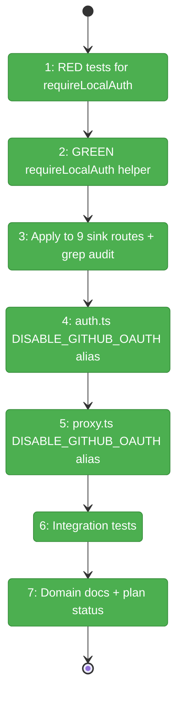
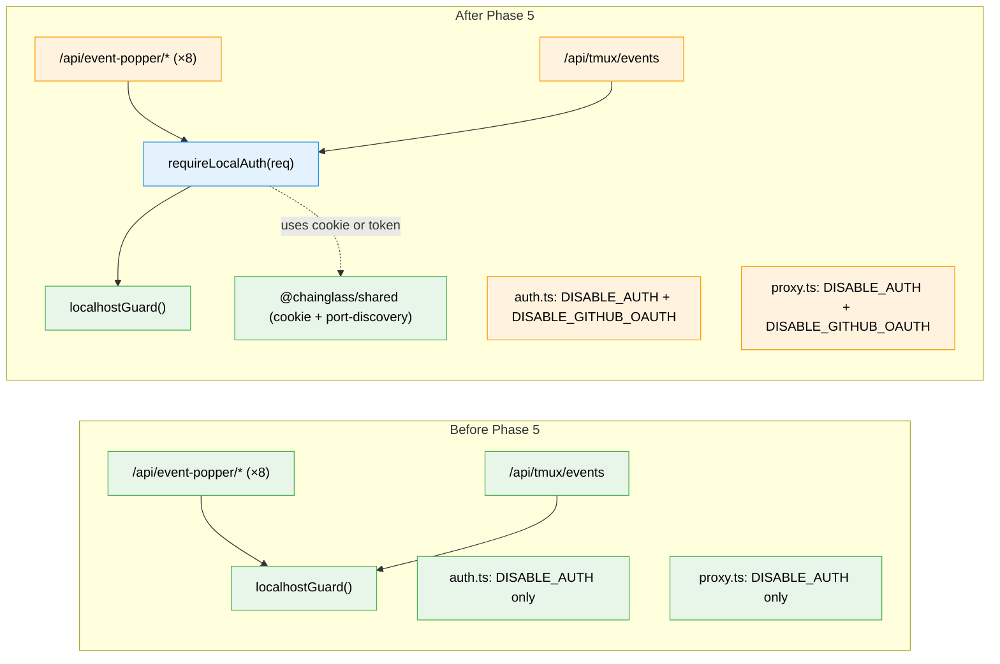

# Flight Plan: Phase 5 — Sidecar HTTP-Sink Hardening + Env-Var Rename

**Plan**: [auth-bootstrap-code-plan.md](../../auth-bootstrap-code-plan.md)
**Phase**: Phase 5: Sidecar HTTP-Sink Hardening + Env-Var Rename
**Generated**: 2026-05-03
**Status**: ✅ Landed 2026-05-03

---

## Departure → Destination

**Where we are**: Phases 1–4 + 6 are landed. The terminal sidecar's silent-bypass is closed (Phase 4). Bootstrap-code popup gate is wired through proxy + RootLayout. But two holes remain on the local-process surface: (a) every `/api/event-popper/*` and `/api/tmux/events` route still uses **`localhostGuard` alone**, so any process on loopback can POST events with no proof of trust; (b) `DISABLE_AUTH=true` still blanket-disables auth — and after Phase 4's tightening, nothing prevents an operator from setting it and silently re-opening the sidecar bypass.

**Where we're going**: Every sidecar HTTP sink requires both localhost AND a credential — bootstrap cookie (browser) or `X-Local-Token` (CLI). `DISABLE_AUTH` becomes a deprecation alias that logs once at boot; `DISABLE_GITHUB_OAUTH` is the new canonical name and only disables the second-factor OAuth check, never the bootstrap-code gate. Operator can `curl /api/event-popper/list` and get 401 without credentials; CLI sinks keep working unchanged because they already send `X-Local-Token`.

---

## Domain Context

### Domains We're Changing

| Domain | What Changes | Key Files |
|--------|-------------|-----------|
| `_platform/events` | New `requireLocalAuth(req)` helper; all 9 sink routes (8 event-popper + tmux/events) wrap their handlers with it. Replaces `localhostGuard`-only pattern. | `apps/web/src/lib/local-auth.ts` (new); `apps/web/app/api/event-popper/**/route.ts` (×8 modified); `apps/web/app/api/tmux/events/route.ts` (modified) |
| `_platform/auth` | Env-var alias: both `DISABLE_AUTH` (deprecated, warn-once) and `DISABLE_GITHUB_OAUTH` (new) accepted by `auth.ts` and `proxy.ts`. | `apps/web/src/auth.ts`; `apps/web/proxy.ts` |

### Domains We Depend On (no changes)

| Domain | What We Consume | Contract |
|--------|----------------|----------|
| `@chainglass/shared` (auth-bootstrap-code) | `verifyCookieValue`, `BOOTSTRAP_COOKIE_NAME`, `findWorkspaceRoot` | Phase 1 deliverables (locked) |
| `@chainglass/shared` (event-popper / port-discovery) | `readServerInfo()` returning optional `localToken` | Plan 067 (locked) |
| `_platform/auth` (web side) | `getBootstrapCodeAndKey()` cached accessor | Phase 3 deliverable (locked) |
| `_platform/events` (existing) | `localhostGuard`, `isLocalhostRequest` | Existing helper, kept available |

---

## Flight Status

<!-- Updated by /plan-6-v2: pending → active → done. Use blocked for problems/input needed. -->

**Legend**: grey = pending | yellow = active | red = blocked/needs input | green = done

---

## Stages

<!-- Updated by /plan-6-v2 during implementation: [ ] → [~] → [x] -->

- [x] **Stage 1: RED test suite for `requireLocalAuth`** — write the 9-case test file with all paths covered and watch them fail (`test/unit/web/lib/local-auth.test.ts` — new file)
- [x] **Stage 2: GREEN implementation of `requireLocalAuth`** — the composite localhost + cookie-or-token helper (`apps/web/src/lib/local-auth.ts` — new file)
- [x] **Stage 3: Apply to all 9 sink routes + grep audit** — uniform `requireLocalAuth(req)` wrapper at top of every event-popper + tmux/events handler; `grep -L 'requireLocalAuth' …` returns zero (`apps/web/app/api/event-popper/**/*.ts` ×8 + `apps/web/app/api/tmux/events/route.ts`)
- [x] **Stage 4: `auth.ts` DISABLE_GITHUB_OAUTH alias + warn-once** — accept both env-var names; deprecation warning on legacy (`apps/web/src/auth.ts`)
- [x] **Stage 5: `proxy.ts` DISABLE_GITHUB_OAUTH alias** — same alias at proxy layer; bootstrap gate still runs first regardless (`apps/web/proxy.ts`)
- [x] **Stage 6: Integration tests** — end-to-end event-popper sinks (`test/integration/web/event-popper-sinks.integration.test.ts` — new file)
- [x] **Stage 7: Domain docs + plan status** — `_platform/events/domain.md`, `_platform/auth/domain.md`, `domain-map.md`, plan Phase Index status

---

## Architecture: Before & After

**Legend**: existing (green, unchanged) | changed (orange, modified) | new (blue, created)

---

## Acceptance Criteria

- [ ] **AC-11** — GitHub OAuth disabled mode: with `DISABLE_GITHUB_OAUTH=true` (or legacy `DISABLE_AUTH=true`), the bootstrap-code gate still enforces; only the OAuth second-factor short-circuits.
- [ ] **AC-16** — Sidecar sinks gated: every `/api/event-popper/*` and `/api/tmux/events` returns 401 without a valid bootstrap cookie or `X-Local-Token`, even from localhost.
- [ ] **AC-17** — CLI continues to work: existing `X-Local-Token` consumers (workflow API client, etc.) keep posting successfully without code changes.
- [ ] **AC-21** — Deprecation alias: `DISABLE_AUTH=true` triggers fake-session path AND emits a deprecation warning exactly once per process.

## Goals & Non-Goals

**Goals**:
- Composite localhost + credential check applied uniformly across 9 sink routes.
- One-release deprecation horizon for the env-var rename (per plan-decisions table item 7).
- Tests use real fs only (Constitution P4).
- `grep -L 'requireLocalAuth' …` audit returns zero files post-T003.

**Non-Goals**:
- No removal of `DISABLE_AUTH` (Phase 7 docs item).
- No `requireLocalAuth` extension to non-sink routes (workflow execution + terminal token already have their own gates).
- No LAN-IP support for sink routes (rejected when not loopback even with valid bootstrap cookie — known limitation; revisit in Phase 7 if reported).
- No new "rotate code" UI.

---

## Checklist

- [x] T001: RED tests for `requireLocalAuth` (11 cases including bootstrap-file-missing path)
- [x] T002: GREEN implementation of `apps/web/src/lib/local-auth.ts` (11/11 tests GREEN)
- [x] T003: Apply `requireLocalAuth` to all 9 sink routes + sink-auth unit tests (10/10 passing) + `grep -L` audit zero
- [x] T004: `auth.ts` accepts `DISABLE_GITHUB_OAUTH`; legacy `DISABLE_AUTH` triggers warn-once (7/7 tests passing — incl. HMR-safe via `globalThis.__CHAINGLASS_DISABLE_AUTH_WARNED`)
- [x] T005: `proxy.ts` accepts `DISABLE_GITHUB_OAUTH` (43/43 proxy tests passing — refactored to share `isOAuthDisabled()` helper)
- [x] T006: Integration test — event-popper sinks end-to-end (5/5 cases × 3 routes = 15 effective scenarios; full sweep 95/95 incl. Phase 3 regressions)
- [x] T007: Domain docs + plan Phase Index status update (events + auth + domain-map edge + Phase Index → Landed)
