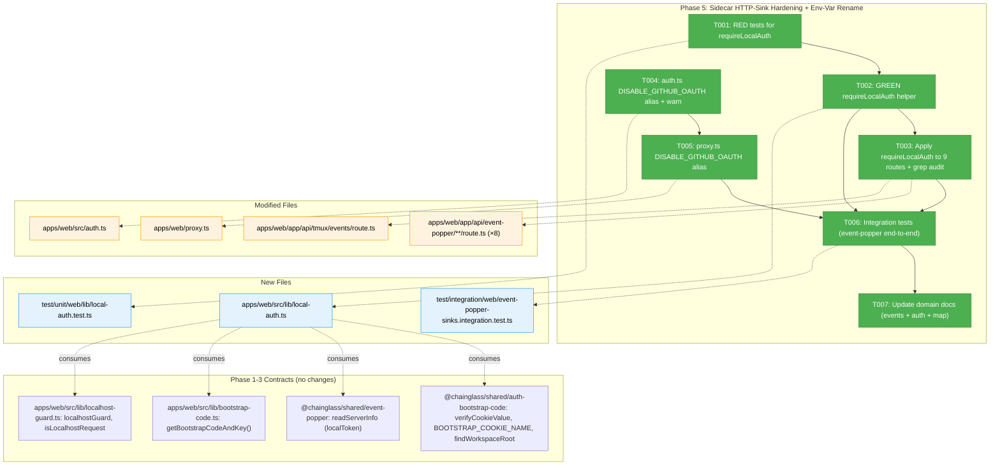
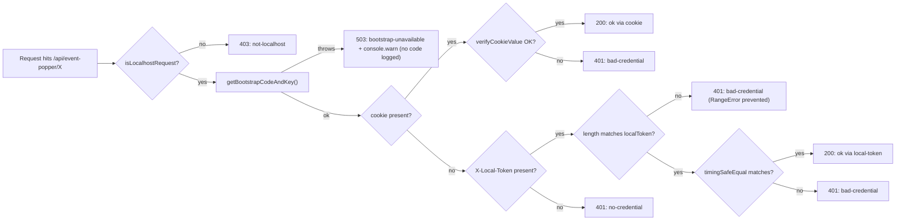
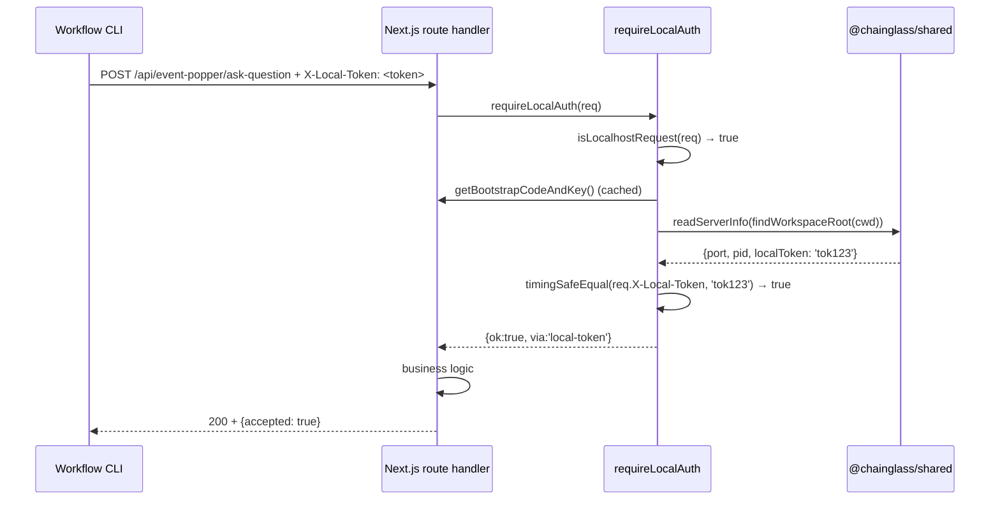

# Phase 5 — Sidecar HTTP-Sink Hardening + Env-Var Rename

**Plan**: [auth-bootstrap-code-plan.md](../../auth-bootstrap-code-plan.md)
**Phase**: 5 — Sidecar HTTP-Sink Hardening + Env-Var Rename
**Generated**: 2026-05-03
**Status**: Ready for takeoff
**Domain (primary)**: `_platform/events` (sinks) + `_platform/auth` (env-var rename)

---

## Executive Briefing

**Purpose**: Close the second exposure hole identified in research (Finding 02) — sidecar HTTP sinks (`/api/event-popper/*`, `/api/tmux/events`) currently rely on `localhostGuard` alone, so any local process on loopback can post events with no proof of trust. Replace that with `requireLocalAuth(req)` which requires localhost **and** either the bootstrap cookie (browser path) or `X-Local-Token` from `.chainglass/server.json` (CLI path). Simultaneously rename `DISABLE_AUTH` → `DISABLE_GITHUB_OAUTH` with a one-release deprecation alias, so the Phase 4 work that re-enabled bootstrap-code auth even when GitHub OAuth is disabled cannot be silently bypassed by the legacy flag.

**What We're Building**:
1. `apps/web/src/lib/local-auth.ts` — `requireLocalAuth(req)` returning a discriminated union (`{ok:true,via:'cookie'|'local-token'} | {ok:false,reason:'not-localhost'|'no-credential'|'bad-credential'}`).
2. Wrap all 9 sidecar routes (8 under `/api/event-popper/*` + `/api/tmux/events`) with the new helper. Replace existing `localhostGuard()` callsites uniformly.
3. `apps/web/src/auth.ts` accepts both `DISABLE_AUTH` (legacy, with `console.warn` deprecation) and `DISABLE_GITHUB_OAUTH` (new). Same-process warn-once.
4. `apps/web/proxy.ts` accepts both env-vars too (Phase 3 left this as `DISABLE_AUTH`-only — confirmed gap).
5. Unit + integration tests exercising every code path under real fs (Constitution P4).

**Goals** ✅:
- Every sink route returns 401 without a credential — even from localhost.
- CLI flows (existing `X-Local-Token` consumers) keep working.
- `DISABLE_AUTH=true` keeps working but logs deprecation; `DISABLE_GITHUB_OAUTH=true` is the new canonical name.
- Grep audit `grep -L 'requireLocalAuth' apps/web/app/api/event-popper/**/*.ts apps/web/app/api/tmux/events/route.ts` returns zero files.
- Acceptance criteria AC-11, AC-16, AC-17, AC-21 become true.

**Non-Goals** ❌:
- Not extending `requireLocalAuth` to non-sink routes (workflow execution, terminal token — those have their own gates).
- Not removing `DISABLE_AUTH` (deprecation horizon = one release; removal is a Phase 7 docs/migration item).
- Not changing the existing `X-Local-Token` contract for workflow CLI calls (that path already validates against `.chainglass/server.json`; we only **read** the same `localToken` value).
- Not adding LAN-IP browse support to event-popper routes — `requireLocalAuth` rejects non-loopback even if the user has a valid bootstrap cookie. Documented as a Phase 7 follow-up if operators report it.
- Not building a "rotate code" UI or settings entry (out of v1 scope).

---

## Prior Phase Context

### Phase 1 — Shared Primitives (Landed 2026-04-30)

**A. Deliverables** — `packages/shared/src/auth-bootstrap-code/`: `cookie.ts`, `signing-key.ts`, `types.ts`, `workspace-root.ts` (FX003), `persistence.ts`, `index.ts` (16 exports). Test fixtures at `test/unit/shared/auth-bootstrap-code/test-fixtures.ts` (`mkTempCwd`, `mkBootstrapCodeFile`, `INVALID_FORMAT_SAMPLES`).

**B. Dependencies Phase 5 will use**:
```typescript
verifyCookieValue(value: string | undefined, code: string, key: Buffer): boolean
BOOTSTRAP_COOKIE_NAME = 'chainglass-bootstrap'
findWorkspaceRoot(startDir: string): string  // FX003
activeSigningSecret(cwd: string): Buffer     // synchronous
```

**C. Gotchas**:
- `verifyCookieValue` returns `false` (never throws) on malformed/wrong/tampered input. Length pre-check prevents `timingSafeEqual` RangeError.
- `activeSigningSecret` caches per-cwd for process lifetime. Phase 5 should consume via Phase 3's async wrapper (`getBootstrapCodeAndKey()`) to share that cache — calling `activeSigningSecret` directly at every request bypasses caching and re-reads the file.
- Tests use real fs only (P4); reset caches in `beforeEach` via `_resetSigningSecretCacheForTests()` + `_resetWorkspaceRootCacheForTests()`.

**D. Incomplete**: None.

**E. Patterns**: Discriminated unions for error vs success result (Phase 4 mirrored this — Phase 5 should too); no `vi.mock` anywhere.

---

### Phase 2 — Boot Integration (Landed 2026-05-02)

**A. Deliverables**: `apps/web/instrumentation.ts` writes `.chainglass/bootstrap-code.json` at boot (HMR-safe); misconfiguration assertion exits 1 if GitHub OAuth on + `AUTH_SECRET` unset; `.gitignore` lines added.

**B. Dependencies Phase 5 will use**: None directly. Phase 5 assumes the file exists (Phase 4 added a startup assertion in the sidecar; web routes return 503 if missing per Phase 3).

**C. Gotchas**: HMR re-runs instrumentation; the writer is idempotent. No restart needed during dev to pick up Phase 5.

**D. Incomplete**: None.

**E. Patterns**: Atomic temp+rename via `port-discovery.ts` helper (already battle-tested by Plan 067).

---

### Phase 3 — Server-Side Gate (Landed 2026-05-02)

**A. Deliverables** — most relevant for Phase 5:
- `apps/web/src/lib/bootstrap-code.ts` (97 LOC) — `getBootstrapCodeAndKey(): Promise<{code: string, key: Buffer}>` with module-level cache + `_resetForTests()`.
- `apps/web/src/lib/cookie-gate.ts` — pure decision helpers; `AUTH_BYPASS_ROUTES` const **locked at 4 routes**: `/api/health`, `/api/auth`, `/api/bootstrap/verify`, `/api/bootstrap/forget`. **Phase 5 must NOT add to this list.**
- `apps/web/proxy.ts` — bootstrap-cookie gate runs **before** the legacy `if (process.env.DISABLE_AUTH === 'true')` short-circuit (line 74). Phase 5 will modify line 74 to also accept `DISABLE_GITHUB_OAUTH`.
- Verify/forget routes; test helpers at `test/helpers/auth-bootstrap-code.ts` (`setupBootstrapTestEnv()`).

**B. Dependencies Phase 5 will use**:
```typescript
async function getBootstrapCodeAndKey(): Promise<{readonly code: string, readonly key: Buffer}>
// Re-use the cached accessor — do NOT re-read fs per request
```

**C. Gotchas**:
- Cache is process-scoped; HMR ESM reload resets it automatically.
- If `bootstrap-code.json` is missing at request time, the verify route returns 503; Phase 5's `requireLocalAuth` should likewise return `{ok:false}` cleanly (not crash). The accessor itself throws — wrap call in try/catch and return `{ok:false,reason:'no-credential'}` (with a `console.warn` for operators).
- `DISABLE_AUTH=true` short-circuit lives at proxy.ts:74 — runs **after** bootstrap-cookie gate, so even with `DISABLE_AUTH=true` the bootstrap cookie is still enforced. Phase 5 keeps this ordering when adding the alias.
- Bypass-routes list is locked. Sink routes (event-popper, tmux/events) are NOT bypass routes — they go through the cookie gate first, then their handler runs `requireLocalAuth`.

**D. Incomplete**: `proxy.ts` does NOT yet accept `DISABLE_GITHUB_OAUTH` — task 5.5 in the plan explicitly calls this out as Phase 5 work, not Phase 3 work. Phase 3 only added the bootstrap-cookie gate; the env-var rename is owned by Phase 5.

**E. Patterns**: Cookie verification via `verifyCookieValue` from shared. Module-level cache for per-process state. JSDoc + locked import paths for downstream consumers.

---

### Phase 4 — Terminal Sidecar Hardening (Landed 2026-05-03)

**A. Deliverables**: `terminal-auth.ts` pure-auth surface split from `terminal-ws.ts` (sidecar-only); `UpgradeAuthResult` discriminated union with `reason` (verbose, includes user input — for logs/JSON) vs `closeReason` (≤123 bytes, no user input — for WS close frames per RFC 6455 / F001). JWT shape locked: `{sub, iss:'chainglass', aud:'terminal-ws', cwd, iat, exp}`.

**B. Dependencies Phase 5 should mirror**:
- Pattern: extract pure auth functions into a dedicated module with no transport/sidecar deps so route handlers can import without bundling regressions.
- Result type: discriminated union with `ok` boolean + structured failure reason.
- Constants for contracts (`TERMINAL_JWT_ISSUER`, `TERMINAL_JWT_AUDIENCE`).

**C. Gotchas Phase 5 inherits**:
- `// @vitest-environment node` directive on every server-side auth test — jose 6.x cross-realm `Uint8Array instanceof` checks fail in jsdom env.
- Buffer-direct to jose (no TextEncoder) when signing/verifying — but this only applies if Phase 5 used JWTs; **`requireLocalAuth` does NOT use JWTs** (just cookie HMAC + static `X-Local-Token` string compare). Still: if any test path crosses jose, the `node` directive must be present.
- macOS `/var → /private/var` symlink: tests using `mkdtempSync` + `chdir` must compute `expectedCwd = findWorkspaceRoot(process.cwd())` to match production.
- Next.js bundling regression: never let route handlers transitively import sidecar-only deps. `requireLocalAuth` lives in `apps/web/src/lib/` and only depends on `@chainglass/shared/auth-bootstrap-code` + `@chainglass/shared/event-popper/port-discovery` + the existing `localhost-guard.ts` — no risk.

**D. Incomplete**: None blocking Phase 5.

**E. Patterns**: TDD RED → GREEN paired commits; real fs/no `vi.mock`; cache reset in `beforeEach`; `LocalAuthResult` should mirror `UpgradeAuthResult` shape (drop `closeReason` — route handlers return JSON, not WS frames).

---

## Pre-Implementation Check

| File | Exists? | Domain Check | Notes |
|------|---------|-------------|-------|
| `apps/web/src/lib/local-auth.ts` | NO (create) | `_platform/events` | New helper. Web-only deps, no sidecar. |
| `apps/web/app/api/event-popper/acknowledge/[id]/route.ts` | YES (modify) | `_platform/events` | Currently: `localhostGuard()` + session fallback. Will become: `requireLocalAuth` only. |
| `apps/web/app/api/event-popper/answer-question/[id]/route.ts` | YES (modify) | `_platform/events` | Same UI-route pattern. |
| `apps/web/app/api/event-popper/ask-question/route.ts` | YES (modify) | `_platform/events` | CLI-only pattern (`if (guard) return guard;`). |
| `apps/web/app/api/event-popper/clarify/[id]/route.ts` | YES (modify) | `_platform/events` | UI pattern. |
| `apps/web/app/api/event-popper/dismiss/[id]/route.ts` | YES (modify) | `_platform/events` | UI pattern. |
| `apps/web/app/api/event-popper/list/route.ts` | YES (modify) | `_platform/events` | UI pattern. |
| `apps/web/app/api/event-popper/question/[id]/route.ts` | YES (modify) | `_platform/events` | UI pattern. |
| `apps/web/app/api/event-popper/send-alert/route.ts` | YES (modify) | `_platform/events` | CLI-only pattern. |
| `apps/web/app/api/tmux/events/route.ts` | YES (modify) | `_platform/events` | CLI-only pattern. |
| `apps/web/src/auth.ts` | YES (modify) | `_platform/auth` | Currently `DISABLE_AUTH`-only at line 43. Will accept both names. |
| `apps/web/proxy.ts` | YES (modify) | `_platform/auth` | Currently `DISABLE_AUTH`-only at line 74. Will accept both names. |
| `test/unit/web/lib/local-auth.test.ts` | NO (create) | `_platform/events` | Real fs; no `vi.mock`. |
| `test/unit/web/api/event-popper/sink-auth.test.ts` | NO (create) | `_platform/events` | Tests representative routes (one UI, one CLI-only) for parity. |
| `test/unit/web/auth.test.ts` _(extend if exists)_ | check | `_platform/auth` | Add deprecation-alias cases. |
| `test/unit/web/proxy.test.ts` _(extend)_ | YES (extend) | `_platform/auth` | Phase 3 has 39 cases; add 2-3 for `DISABLE_GITHUB_OAUTH`. |
| `test/integration/web/event-popper-sinks.integration.test.ts` | NO (create) | `_platform/events` | End-to-end: 401 without auth, 200 with cookie, 200 with token. |

**Domain risk**: All 9 sink-route changes are uniform (single search/replace pattern + new import). Risk is missing one — task T003 includes the explicit `grep -L 'requireLocalAuth'` audit step.

**Contract risk**: `auth.ts`/`proxy.ts` env-var rename is **additive** (legacy still works). Operators upgrading don't need to change env-vars; they get a deprecation warning on next boot.

**Concept duplication check**: `requireLocalAuth` is a **new concept** — there's no existing composite localhost+credential checker. `localhostGuard` is the prior art it replaces. No duplication risk.

**Harness check (L3)**: `pnpm dev` + `curl http://localhost:3000/api/health` — confirmed available. Pre-phase validation will run Boot → Interact (curl `/api/event-popper/list` without auth → expect 401) → Observe.

---

## Architecture Map



---

## Tasks

| Status | ID | Task | Domain | Path(s) | Done When | Notes |
|--------|-----|------|--------|---------|-----------|-------|
| [x] | T001 | **RED**: write `local-auth.test.ts` covering: (a) non-localhost rejected with `not-localhost`; (b) localhost + valid cookie → `{ok:true,via:'cookie'}`; (c) localhost + valid `X-Local-Token` (matches `readServerInfo().localToken`) → `{ok:true,via:'local-token'}`; (d) localhost, no cookie & no token → `{ok:false,reason:'no-credential'}`; (e) localhost, malformed cookie → `{ok:false,reason:'bad-credential'}`; (f) localhost, wrong `X-Local-Token` (right length, wrong bytes) → `{ok:false,reason:'bad-credential'}`; (f2) **localhost, `X-Local-Token` of wrong LENGTH (1-byte attacker probe)** → `{ok:false,reason:'bad-credential'}` and **must NOT throw `RangeError` from `timingSafeEqual`** (Completeness fix #1); (f3) **localhost, `X-Local-Token` sent but `.chainglass/server.json` lacks `localToken` field** (legacy server pre-Plan-067) → `{ok:false,reason:'bad-credential'}` cleanly (Completeness fix #4); (g) localhost, both present and one bad → cookie tried first; (h) **`bootstrap-code.json` unreadable / `getBootstrapCodeAndKey()` throws** → `{ok:false,reason:'bootstrap-unavailable'}` + `console.warn` **WITHOUT logging the code value** (Completeness fix #2 + AC-22 audit); (i) cookie wins when both valid (returns `via:'cookie'`). Add `// @vitest-environment node` directive. Use `mkTempCwd` + `mkBootstrapCodeFile` from Phase 1 fixtures, `setupBootstrapTestEnv` from Phase 3 helpers. Reset caches in `beforeEach` — including `_resetForTests()` on `bootstrap-code.ts` so getBootstrapCodeAndKey() throw scenarios are reproducible. Tests MUST FAIL initially (no impl yet). | `_platform/events` | `/Users/jordanknight/substrate/084-random-enhancements-3/test/unit/web/lib/local-auth.test.ts` | All 11 cases written and run RED (file under test doesn't exist yet) | Constitution P3 (RED first); per finding 06; per finding 12; **Completeness validation fixes #1, #2, #4** |
| [x] | T002 | **GREEN**: implement `apps/web/src/lib/local-auth.ts` exporting `LocalAuthResult` discriminated union + `requireLocalAuth(req: NextRequest): Promise<LocalAuthResult>`. **`LocalAuthResult` failure variant has 4 reasons**: `'not-localhost' \| 'no-credential' \| 'bad-credential' \| 'bootstrap-unavailable'` (Completeness fix #2 — separates client failure from server-side config-read failure). Order: (1) `isLocalhostRequest(req)` → if false, return `{ok:false,reason:'not-localhost'}`; (2) try `getBootstrapCodeAndKey()` inside `try { ... } catch { console.warn('[requireLocalAuth] bootstrap-code.json unreadable; rejecting all requests until restored'); return {ok:false,reason:'bootstrap-unavailable'}; }` — **the warn message MUST NOT interpolate the code value** (AC-22 compliance — Forward-Compat C4); (3) read `cookies().get(BOOTSTRAP_COOKIE_NAME)?.value`; if present and `verifyCookieValue(value, code, key) === true` → `{ok:true,via:'cookie'}`; if present but invalid → `{ok:false,reason:'bad-credential'}`; (4) read `req.headers.get('x-local-token')` (lowercase — Node normalizes; matches existing pattern); if present, call `readServerInfo(findWorkspaceRoot(process.cwd()))`. **If `info?.localToken` is undefined** (legacy server.json pre-Plan-067), return `{ok:false,reason:'bad-credential'}` (Completeness fix #4). **Length pre-check before `timingSafeEqual`** (Completeness fix #1 — RangeError-prevention pattern from Phase 1 cookie.ts:29): `if (token.length !== info.localToken.length) return {ok:false,reason:'bad-credential'};` then `crypto.timingSafeEqual(Buffer.from(token), Buffer.from(info.localToken))` → `{ok:true,via:'local-token'}` on match, `{ok:false,reason:'bad-credential'}` on mismatch; (5) neither cookie nor token present → `{ok:false,reason:'no-credential'}`. Add JSDoc header explaining the contract + the X-Forwarded-For trust assumption inherited from `localhostGuard` (Completeness fix #8). **No** sidecar deps. **No** TextEncoder anywhere. **No** logging of the bootstrap code value or the `localToken` value anywhere in this module. T001 tests must turn GREEN. | `_platform/events` | `/Users/jordanknight/substrate/084-random-enhancements-3/apps/web/src/lib/local-auth.ts` | T001 tests (all 11 cases) pass; lint clean; module loads from web bundle without bundling regression; no plain-text leak of code/token values in any log path | Per finding 06; mirror Phase 4's `UpgradeAuthResult` discriminated union (drop `closeReason` — JSON only); reuse `getBootstrapCodeAndKey()` cache (Phase 3 D-T001-1); **Completeness validation fixes #1, #2, #4, #8 + AC-22 (FC-C4)** |
| [x] | T003 | **Apply + audit**: at the top of every handler in the 9 sink routes (8 event-popper + tmux/events — exact list below), replace the existing `localhostGuard(...)` block with: `const auth = await requireLocalAuth(req); if (!auth.ok) { const status = auth.reason === 'not-localhost' ? 403 : auth.reason === 'bootstrap-unavailable' ? 503 : 401; return NextResponse.json({error: auth.reason}, {status}); }`. **Status-code table (Completeness fix #2 — locked contract)**: `'not-localhost' → 403`, `'bootstrap-unavailable' → 503` (server-side; operator should investigate config), `'no-credential' → 401`, `'bad-credential' → 401`. Routes: `acknowledge/[id]`, `answer-question/[id]`, `ask-question`, `clarify/[id]`, `dismiss/[id]`, `list`, `question/[id]`, `send-alert`, `tmux/events`. Add `// REQUIRED: requireLocalAuth(req) at top before business logic.` header comment to each. **Pre-edit grep** (Completeness fix #6): run `grep -rn "'/api/event-popper\|'/api/tmux/events" /Users/jordanknight/substrate/084-random-enhancements-3 --include='*.ts' --include='*.tsx' \| grep -v node_modules \| grep -v test \| grep -v route.ts` — for any non-test caller that doesn't already send `X-Local-Token`, flag in execution log + Discoveries (none expected, but verify before T003 lands). **Post-edit grep audit**: `grep -L 'requireLocalAuth' apps/web/app/api/event-popper/**/*.ts apps/web/app/api/tmux/events/route.ts` — output MUST be empty. **Validation fix H2 / per plan task 5.2**. Existing UI-route pattern (`if (guard) { check session }`) is removed wholesale — bootstrap cookie supersedes session as the localhost-equivalent trust signal (now that proxy gate enforces it for browser flows). Add a unit test file `test/unit/web/api/event-popper/sink-auth.test.ts` exercising one UI route + one CLI-only route covering all 4 status codes (200/401/403/503). | `_platform/events` | All 9 route files listed above; new `/Users/jordanknight/substrate/084-random-enhancements-3/test/unit/web/api/event-popper/sink-auth.test.ts` | All 9 routes return correct status per contract table; pre-edit grep finds zero broken callers; post-edit grep audit returns zero files; sink-auth tests pass | Per finding 02; **validation fix H2** from plan; explicit enumeration vs `**/*.ts` glob — one source of truth; **Completeness validation fixes #2, #6** |
| [x] | T004 | **`auth.ts` env-var alias**: at `apps/web/src/auth.ts:43-49`, change the env-var check to `const oauthDisabled = process.env.DISABLE_GITHUB_OAUTH === 'true' \|\| process.env.DISABLE_AUTH === 'true';`. If `DISABLE_AUTH` is set (the legacy name), emit `console.warn('[auth] DISABLE_AUTH is deprecated; use DISABLE_GITHUB_OAUTH instead. Will be removed in next release.')` **exactly once per Node process** — and the warn-once flag MUST survive Next.js HMR module reloads. **Use `globalThis.__CHAINGLASS_DISABLE_AUTH_WARNED` (Completeness fix #3 — module-level `let _warned = false` resets on HMR; mirror the proven pattern from `apps/web/instrumentation.ts:44-45` and `start-central-notifications.ts`)**. Sketch: `const g = globalThis as typeof globalThis & { __CHAINGLASS_DISABLE_AUTH_WARNED?: boolean }; if (process.env.DISABLE_AUTH === 'true' && !g.__CHAINGLASS_DISABLE_AUTH_WARNED) { g.__CHAINGLASS_DISABLE_AUTH_WARNED = true; console.warn('[auth] DISABLE_AUTH is deprecated; use DISABLE_GITHUB_OAUTH instead. Will be removed in next release.'); }`. **The warn message MUST NOT contain the bootstrap code value or any other secret** (AC-22 / FC-C4). Add unit tests at `test/unit/web/auth.test.ts` (create if missing) covering: (i) `DISABLE_GITHUB_OAUTH=true` → fake session; (ii) `DISABLE_AUTH=true` → fake session + warn-once; (iii) both unset → real auth path; (iv) both set → fake session + warn-once (legacy still triggers warning even though the new name is also set); (v) warn-once: calling auth() twice in same process logs warning only once; (vi) **HMR-safe warn-once: simulate module re-import by re-requiring auth.ts (or via `vi.resetModules()` + new import) and confirm warning still fires only once because the flag lives on `globalThis`**. **Reset discipline**: in `afterEach`, `delete (globalThis as any).__CHAINGLASS_DISABLE_AUTH_WARNED;` to isolate test cases. **No `vi.mock` of console** — capture warnings via a real spy on `console.warn` then restore in `afterEach`. | `_platform/auth` | `/Users/jordanknight/substrate/084-random-enhancements-3/apps/web/src/auth.ts`; `/Users/jordanknight/substrate/084-random-enhancements-3/test/unit/web/auth.test.ts` | Both env-vars trigger fake-session path; warning printed exactly once per Node process even across HMR reload; tests pass; no secret values in warn message | Per finding 04; default 7 from plan-decisions table; **Completeness validation fix #3 + AC-22 (FC-C4)** |
| [x] | T005 | **`proxy.ts` env-var alias**: at `apps/web/proxy.ts:74`, change `if (process.env.DISABLE_AUTH === 'true')` to also accept `DISABLE_GITHUB_OAUTH`. **Critical ordering**: bootstrap-cookie gate (Phase 3, line 63) must still run BEFORE this short-circuit — confirm by grep + reading the file before editing. Extend `test/unit/web/proxy.test.ts` (Phase 3 has 39 cases) with: (i) `DISABLE_GITHUB_OAUTH=true` short-circuits past auth chain; (ii) `DISABLE_AUTH=true` (legacy) still works; (iii) bootstrap-cookie gate STILL runs for both env-vars when no cookie present (returns redirect/render-popup as Phase 3 dictates). | `_platform/auth` | `/Users/jordanknight/substrate/084-random-enhancements-3/apps/web/proxy.ts`; `/Users/jordanknight/substrate/084-random-enhancements-3/test/unit/web/proxy.test.ts` _(extend)_ | Both env-vars short-circuit; bootstrap-cookie gate enforced regardless | Per finding 04; per plan task 5.5 (Phase 3 left this as DISABLE_AUTH-only — confirmed gap) |
| [x] | T006 | **Integration test (event-popper end-to-end)**: write `test/integration/web/event-popper-sinks.integration.test.ts` exercising real Next.js route handlers in-process via the existing route-handler integration pattern. **Four scenarios** per representative route (`list` for UI; `ask-question` for CLI-only; `tmux/events`): (a) POST without any credential from localhost → 401 + `{error:'no-credential'}`; (b) POST with bootstrap cookie (set via `setupBootstrapTestEnv` + `buildCookieValue`) → 200; (c) POST with `X-Local-Token` matching the `localToken` from `.chainglass/server.json` → 200; (d) **POST when `bootstrap-code.json` is deleted mid-test** (delete file, then call `_resetForTests()` on `bootstrap-code.ts` to invalidate cache, then post) → 503 + `{error:'bootstrap-unavailable'}` (Completeness fix #2 + status-code contract from T003). Use real fs in `mkTempCwd`. Cleanup teardown in `afterEach`. Add `// @vitest-environment node`. Per **AC-16** (sidecar sinks gated) and **AC-17** (CLI keeps working). | `_platform/events` | `/Users/jordanknight/substrate/084-random-enhancements-3/test/integration/web/event-popper-sinks.integration.test.ts` | All 12 scenarios (3 routes × 4 modes) pass; no `vi.mock`; no regression in pre-existing event-popper tests | AC-16, AC-17; per plan task 5.7; **Completeness fix #2 (status-code parity)** |
| [x] | T007 | **Domain docs**: update `docs/domains/_platform/events/domain.md` — add `requireLocalAuth` to Composition; new History row for Plan 084 Phase 5. Update `docs/domains/_platform/auth/domain.md` — History row noting the env-var alias landed. Update `docs/domains/domain-map.md` — add edge `_platform/events → _platform/auth (cookie verification + workspace-root resolution)`. Update Plan 084 plan file Phase Index → Phase 5 Status = `✅ Landed 2026-05-03`. | docs | `/Users/jordanknight/substrate/084-random-enhancements-3/docs/domains/_platform/events/domain.md`; `/Users/jordanknight/substrate/084-random-enhancements-3/docs/domains/_platform/auth/domain.md`; `/Users/jordanknight/substrate/084-random-enhancements-3/docs/domains/domain-map.md`; `/Users/jordanknight/substrate/084-random-enhancements-3/docs/plans/084-random-enhancements-3/auth-bootstrap-code-plan.md` | All four files updated; mermaid map renders | plan-6-v2 step 4; per finding 02 |

**Acceptance criteria covered**: AC-11 (GitHub OAuth disabled mode — proxy + auth.ts), AC-16 (sidecar sinks gated), AC-17 (CLI continues to work), AC-21 (deprecation alias).

---

## Context Brief

### Key Findings (from plan)

- **Finding 02 (Critical)**: `/api/event-popper/*` and `/api/tmux/events` only check `localhostGuard` — anyone on loopback can post → applied via T002 + T003.
- **Finding 04 (Critical)**: `DISABLE_AUTH=true` removes every gate today → applied via T004 (auth.ts) + T005 (proxy.ts). Plan decision 7: one-release deprecation horizon.
- **Finding 06 (High)**: Plan 067 `localToken` already provides file-based local-trust pattern → reuse via `readServerInfo` (no new infra).
- **Finding 12 (High)**: Constitution P3 (TDD) and P4 (Fakes Over Mocks) → T001 RED before T002 GREEN; no `vi.mock` anywhere; real fs only.

### Domain Dependencies (consumed concepts)

- `@chainglass/shared` (auth-bootstrap-code): `verifyCookieValue(value, code, key) → boolean` (T002 cookie path), `BOOTSTRAP_COOKIE_NAME` (T002), `findWorkspaceRoot(cwd) → string` (T002 token path workspace resolution).
- `@chainglass/shared/event-popper`: `readServerInfo(worktreePath) → ServerInfo | null` exposing `{port, pid, startedAt, localToken?}` (T002 token path).
- `_platform/auth` via `apps/web/src/lib/bootstrap-code.ts`: `getBootstrapCodeAndKey() → Promise<{code, key}>` cached accessor (T002 cookie path).
- `_platform/events` (existing): `localhostGuard(req) → NextResponse | null`, `isLocalhostRequest(req) → boolean` (T002 first stage). **Phase 5 keeps `localhostGuard` available for callers that want HTTP-403 directly; `requireLocalAuth` is a new composite.**

### Domain Constraints

- **Dependency direction**: `_platform/events` → `_platform/auth` is **business-on-infrastructure** (allowed). Phase 5 introduces this relationship via `local-auth.ts` (which lives in `_platform/events` but consumes auth contracts). Update domain-map.md edge in T007.
- **Bypass list locked** (Phase 3): `AUTH_BYPASS_ROUTES = ['/api/health', '/api/auth', '/api/bootstrap/verify', '/api/bootstrap/forget']`. Phase 5 must NOT add to this. Sink routes go through cookie gate first, then handler runs `requireLocalAuth`.
- **Contract change**: route response on missing credential changes from `403 Forbidden: localhost only` → `401 + {error:'no-credential'}` for localhost-but-no-credential requests, plus `403 + {error:'not-localhost'}` for non-loopback. CLI consumers reading the legacy 403 string must adapt; mitigated by the `error` field in the JSON body (machine-readable). Document in T007 history rows.

### Harness Context

- **Boot**: `pnpm dev` (port 3000) — health: `curl -f http://localhost:3000/api/health`
- **Interact**: HTTP API — `curl -X POST http://localhost:3000/api/event-popper/list` (expect 401 without credential post-Phase-5)
- **Observe**: HTTP response status + body JSON
- **Maturity**: L3 — sufficient as-is (Phase 7 exercises it end-to-end)
- **Pre-phase validation (mandatory)**: agent MUST run Boot → Interact → Observe at start of implementation. Phase-0 special case does not apply (this isn't the harness-build phase).

### Reusable from prior phases

- Test fixtures: `test/unit/shared/auth-bootstrap-code/test-fixtures.ts` (`mkTempCwd`, `mkBootstrapCodeFile`, `INVALID_FORMAT_SAMPLES`)
- Test helper: `test/helpers/auth-bootstrap-code.ts` (`setupBootstrapTestEnv()`)
- Pattern: `// @vitest-environment node` directive on every server-side auth test (Phase 4 lesson)
- Pattern: `_resetSigningSecretCacheForTests()` + `_resetWorkspaceRootCacheForTests()` in `beforeEach`
- Pattern: discriminated-union result type (`LocalAuthResult` mirrors `UpgradeAuthResult`)
- Pattern: route handlers return `NextResponse.json({error: '<reason>'}, {status: <n>})` — locked Phase 3 contract for verify/forget; mirror in sink routes

### Mermaid flow diagram (auth path for event-popper request)



### Mermaid sequence diagram (CLI sink posting an event)



---

## Discoveries & Learnings

_Populated during implementation by plan-6-v2._

| Date | Task | Type | Discovery | Resolution | References |
|------|------|------|-----------|------------|------------|
| 2026-05-03 | T001 | gotcha | Test path `../../../shared/...` (3 levels up) was wrong — `test/unit/web/lib/local-auth.test.ts` is only 2 dirs above `test/unit/shared/...` because `web` and `shared` are siblings under `test/unit/`. | Use `../../shared/auth-bootstrap-code/test-fixtures` (2 levels). Phase 3's verify test sits at `test/unit/web/api/bootstrap/` — one level deeper — so its `../../../shared/...` should not be mechanically copied. | T001 |
| 2026-05-03 | T001 | insight | To force `getBootstrapCodeAndKey()` to throw deterministically inside a temp cwd, deleting `.chainglass/` is insufficient (it just regenerates). | Replace `.chainglass` with a regular FILE (not a dir) so `mkdirSync` throws EEXIST. Reused in T003 + T006. | T001, T003, T006 |
| 2026-05-03 | T002 | decision | Drop `closeReason` from `LocalAuthResult` (Phase 4's `UpgradeAuthResult` had it for RFC 6455 ≤123-byte WS close frames). | Route handlers return JSON, not WS frames; only verbose `reason` needed. Status-code mapping lives in T003 route-handler code (single point of contract). | T002, T003 |
| 2026-05-03 | T003 | unexpected-behavior | Pre-edit grep found `apps/cli/src/commands/event-popper-client.ts` did NOT send `X-Local-Token` — Phase 5 server-side change WOULD have broken every CLI call (AC-17 violation). | Extended `createEventPopperClient(baseUrl, opts?)` to accept `worktreePath`, read `localToken` once at construction via `readServerInfo`, inject as `X-Local-Token` on every request. Backward-compatible (worktreePath defaults to `process.cwd()`). | T003 |
| 2026-05-03 | T003 | insight | Browser hook `use-question-popper.tsx:122` does same-origin `fetch('/api/event-popper/list')` without explicit `credentials` — but the WHATWG fetch default is `same-origin` which sends the bootstrap cookie automatically. | No browser-side change needed; cookie path Just Works. | T003 |
| 2026-05-03 | T005 | debt (carry-forward) | `auth.ts` wrapper short-circuits the proxy callback at module load when `DISABLE_AUTH=true` (returns `(req) => NextResponse.next()` without running the wrapped async callback). This means the bootstrap-cookie gate inside the callback never executes — Phase 3's "bootstrap gate runs first regardless" intent is partially defeated. NOT a Phase 5 regression — Phase 3 carryover. | Phase 5's proxy.ts:74 check is belt-and-suspenders for the case where the wrapper passes through. Proper fix: hoist `bootstrapCookieStage` ABOVE the `auth(...)` wrapper in proxy.ts. **Out of scope for Phase 5 — Phase 7 candidate or separate FX.** | T005 |
| 2026-05-03 | T006 | decision | "200 acceptance shape" tests can't fully exercise route handlers in unit/integration scope because the DI container resolves to real services (DB, etc.). | Use try/catch + assert `[401,403,503]` NOT in response status — exception thrown by downstream business logic is PROOF the auth gate accepted us. Phase 7 task 7.7 e2e matrix exercises the full happy path against a live server. | T003, T006 |

**Types**: `gotcha` | `research-needed` | `unexpected-behavior` | `workaround` | `decision` | `debt` | `insight`

---

## Directory Layout

```
docs/plans/084-random-enhancements-3/
├── auth-bootstrap-code-plan.md
└── tasks/
    └── phase-5-sidecar-http-sink-hardening-env-var-rename/
        ├── tasks.md            ← this file
        ├── tasks.fltplan.md    ← flight plan (next)
        └── execution.log.md    ← created by plan-6-v2 during implementation
```

---

## Validation Record (2026-05-03)

`/validate-v2` ran with 4 parallel agents (broad scope). Lens coverage: 12/12 (above 8-floor). Forward-Compatibility engaged (5 named downstream consumers C1–C5; not STANDALONE).

| Agent | Lenses Covered | Issues | Verdict |
|-------|---------------|--------|---------|
| Source Truth | Hidden Assumptions, Technical Constraints, System Behavior | 0 | ✅ |
| Cross-Reference | Domain Boundaries, Integration & Ripple, Concept Documentation | 0 (1 LOW traceability note — non-blocking) | ✅ |
| Completeness | Edge Cases & Failures, Security & Privacy, User Experience, Deployment & Ops | 3 HIGH fixed, 7 MEDIUM/LOW addressed | ⚠️ → ✅ |
| Forward-Compatibility | Forward-Compatibility, Hidden Assumptions, Domain Boundaries | 0 | ✅ |

### Forward-Compatibility Matrix

| Consumer | Requirement | Failure Mode | Verdict | Evidence |
|----------|-------------|--------------|---------|----------|
| C1: Phase 6 (Popup) | Cookie-or-token symmetric path; route handlers return JSON 401/403 (not HTML); proxy cookie-gate runs first | shape mismatch | ✅ | T003 status-code contract locked (table); T002 mirrors Phase 4 `UpgradeAuthResult`; proxy ordering verified in T005 pre-edit grep step |
| C2: Phase 7 task 7.7 (5-cell e2e matrix) | Both env-var names accepted by auth.ts AND proxy.ts; warn-once survives test harness module reload | contract drift | ✅ | T004 `globalThis.__CHAINGLASS_DISABLE_AUTH_WARNED` survives HMR; T005 extends Phase 3's 39-case proxy.test.ts; legacy + new names tested symmetrically |
| C3: Phase 7 task 7.9 (migration runbook) | Documented behavior of deprecation alias (warn timing, warn message, removal horizon) | contract drift | ✅ | T004 warn message text locked verbatim; one-release horizon in plan-decisions table item 7; T007 records landing date |
| C4: Phase 7 task 7.10 (AC-22 log audit) | No new code path logs the bootstrap code value | contract drift | ✅ | T002 explicit "warn message MUST NOT interpolate code" + JSDoc; T004 warn message text contains no secret; T001 (h) tests the boot-code-missing branch |
| C5: CLI X-Local-Token consumer (workflow-api-client.ts) | Existing CLI sender keeps working unchanged | shape mismatch | ✅ | T002 case-insensitive `req.headers.get('x-local-token')`; T006 token-path scenarios per route; no contract change to header name/value/format |

**Outcome alignment** (verbatim from Forward-Compatibility agent): Phase 5 dossier, as written, advances the OUTCOME by closing all three exposure holes identified in the research dossier (terminal-WS silent-bypass closure inherited from Phase 4; unauthenticated event-popper/tmux-events sinks gated via `requireLocalAuth` in T002–T003; `DISABLE_AUTH=true` no longer bypasses bootstrap gate because proxy gate executes before the env-var short-circuit per Phase 3 locked behavior).

**Standalone?**: No — five named downstream consumers (C1 Phase 6 popup; C2 Phase 7.7 e2e matrix; C3 Phase 7.9 runbook; C4 Phase 7.10 log audit; C5 CLI X-Local-Token sender) with concrete shape requirements.

### Fixes Applied (HIGH — all folded into dossier text)

- **#1 (T001 + T002)**: `X-Local-Token` length pre-check before `crypto.timingSafeEqual` to prevent RangeError on attacker-sent short token. T001 adds case (f2); T002 adds explicit length-check sketch.
- **#2 (T002 + T003 + T006 + flow diagram)**: Status-code conflation closed. New 4th reason `'bootstrap-unavailable'` distinguishes server-side config-read failure from client-missing-credential. Status table locked: `not-localhost → 403`, `bootstrap-unavailable → 503`, `no-credential → 401`, `bad-credential → 401`. T006 adds the missing-file scenario.
- **#3 (T004)**: Warn-once switched from module-level `let _warned = false` (resets on Next.js HMR module reload) to `globalThis.__CHAINGLASS_DISABLE_AUTH_WARNED` (survives HMR; mirrors instrumentation.ts:44-45 pattern). T004 test (vi) added for HMR-safe assertion.

### Addressed (MEDIUM/LOW — captured inline in task text)

- **#4** ServerInfo.localToken is optional (legacy server.json pre-Plan-067) → T001 adds case (f3); T002 returns `bad-credential` cleanly when undefined.
- **#6** Pre-edit grep for non-token CLI callers added to T003 — flag any non-test call sites missing `X-Local-Token` before the routes turn restrictive.
- **#8** X-Forwarded-For trust assumption inherited from `localhostGuard` documented explicitly in T002's required JSDoc header.

### Open (LOW — non-blocking, defer to plan-7 review)

- AC-traceability per task: not every Done When cites the AC number. Source-Truth + Cross-Reference agents flagged this as non-blocking documentation polish.
- Dossier domain-map edge: T007 adds `_platform/events → _platform/auth` edge; not pre-declared in plan §Domain Manifest line 104, but warranted given T002's import of `getBootstrapCodeAndKey`.

Overall: ✅ **VALIDATED WITH FIXES** — ready for `/plan-6-v2-implement-phase`.
