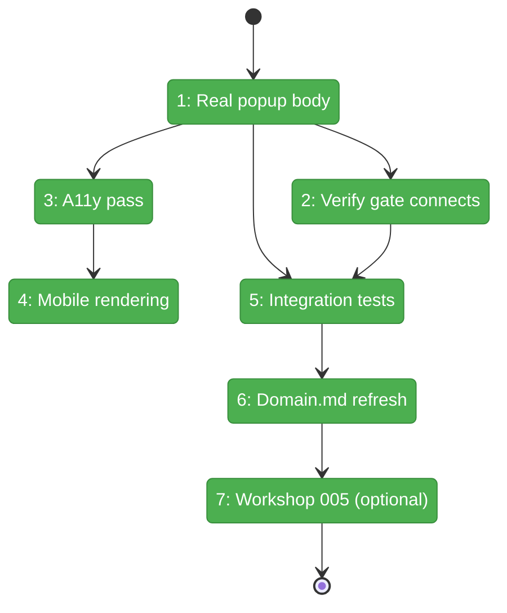
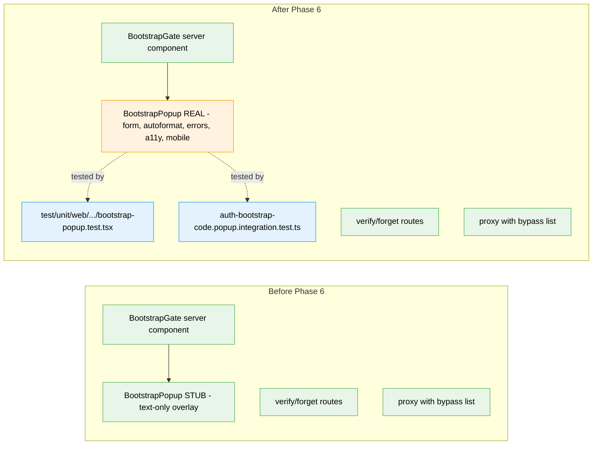

# Flight Plan: Phase 6 — Popup Component & RootLayout Integration

**Plan**: [auth-bootstrap-code-plan.md](../../auth-bootstrap-code-plan.md)
**Phase**: Phase 6: Popup Component & RootLayout Integration
**Generated**: 2026-05-02
**Status**: Landed (2026-05-02)

---

## Departure → Destination

**Where we are**: Phase 3 server-side gate is fully landed (143/143 tests passing as of 2026-05-02). Cookie machinery, verify/forget routes, proxy gate, and RootLayout integration all work end-to-end. The popup is currently a text-only stub (`apps/web/src/features/063-login/components/bootstrap-popup.tsx`, 78 LOC) that paints `Bootstrap code required (Phase 3 stub — popup UI lands in Phase 6)` over the page tree and tells operators to recover via `.chainglass/bootstrap-code.json`. The user is actively blocked by this stub on this development branch — every page load shows the stub overlay because dev sessions don't carry the cookie.

**Where we're going**: An operator on a fresh workspace types the bootstrap code into a real, accessible, mobile-friendly popup, hits Enter, and the app renders normally — entire round-trip without leaving the browser. Wrong-code, format-invalid, rate-limited (with countdown), and 503 errors are visually distinct and actionable. Modal is non-dismissable until verification succeeds. Phase 7 inherits a UI surface fully exercisable end-to-end via integration tests + manual harness smoke.

---

## Domain Context

### Domains We're Changing

| Domain | What Changes | Key Files |
|--------|-------------|-----------|
| `_platform/auth` | Replace stub popup body with real form + autoformat + error states + a11y + mobile rendering; preserve the `BootstrapPopupProps` named export shape (Phase 3 locked contract) | `apps/web/src/features/063-login/components/bootstrap-popup.tsx`; `apps/web/src/features/063-login/components/bootstrap-popup.test.tsx` (new); `test/integration/web/auth-bootstrap-code.popup.integration.test.ts` (new); `docs/domains/_platform/auth/domain.md` (history + concept narrative refresh) |

### Domains We Depend On (no changes)

| Domain | What We Consume | Contract |
|--------|----------------|----------|
| `@chainglass/shared/auth-bootstrap-code` | `BOOTSTRAP_CODE_PATTERN` for client-side autoformat + format-validation | `BOOTSTRAP_CODE_PATTERN: RegExp` |
| `_platform/auth` (Phase 3) | `<BootstrapGate>` server component, `getBootstrapCodeAndKey()`, verify route's 5 status codes + 429 body shape, exact `AUTH_BYPASS_ROUTES` list | All locked at Phase 3 |
| Test scaffolding (Phase 3) | `setupBootstrapTestEnv()` from `test/helpers/auth-bootstrap-code.ts` | Phase 3 T007 |
| `@radix-ui/react-dialog` | Modal primitive (non-shadcn-wrapped) for focus trap + ARIA + non-dismissable behaviour | `^1.1.15` (existing dependency) |
| `next/navigation` | `useRouter().refresh()` for RSC re-render after successful verification | Next.js 16 |

---

## Flight Status

**Legend**: grey = pending | yellow = active | red = blocked/needs input | green = done

---

## Stages

- [x] **Stage 1: Replace popup body with real UX** — Radix `react-dialog` primitive directly (not shadcn), input with hyphen autoformat, submit button, 6 error states (`invalid-format`, `wrong-code`, `rate-limited` with countdown, `unavailable`, `network`, `idle`), success → `router.refresh()` (`bootstrap-popup.tsx`)
- [x] **Stage 2: Verify the gate continues to gate** — read-only verify of `bootstrap-gate.tsx` and `layout.tsx`; conditional `dynamic = 'force-dynamic'` add only if integration test surfaces staleness
- [x] **Stage 3: Accessibility pass** — focus trap (Radix), ARIA `role="dialog"` + `aria-modal="true"` + `aria-labelledby` + dynamic `aria-describedby`, ESC disabled, click-outside disabled, no close button, error has `role="alert"` (`bootstrap-popup.tsx` polish)
- [x] **Stage 4: Mobile rendering smoke** — mobile-safe Tailwind CSS shipped in T001 impl; live screenshot capture deferred per `evidence/README.md` rubric (harness app down at impl time)
- [x] **Stage 5: Integration tests** — `auth-bootstrap-code.popup.integration.test.tsx` (renamed .ts→.tsx for JSX); 7 cases (happy / wrong / format-client-reject / format-server-reject / rate-limited / 503 / smoke) using real verifyPOST in-process
- [x] **Stage 6: Domain.md refresh** — `_platform/auth/domain.md`: history row + "Gate the application shell" concept narrative + composition row updated
- [x] **Stage 7: Workshop 005 cross-check (optional)** — skipped per plan default; no UX decisions surfaced that aren't already locked in the dossier

---

## Architecture: Before & After

**Legend**: existing (green, unchanged) | changed (orange, modified body but locked exports) | new (blue, created)

---

## Acceptance Criteria

- [ ] AC-1 (real) — Fresh-browser gate: visiting any route without a cookie shows the real popup
- [ ] AC-2 (real) — Correct-code unlock: typing the code, hitting Enter, popup unmounts, app renders normally
- [ ] AC-3 — Sticky unlock: cookie persists across reload (verified by integration test rerender)
- [ ] AC-4 (real) — Wrong-code rejection: popup remains with "Wrong code — try again" error, input retained
- [ ] AC-5 (real) — Format validation: client-side reject + server-side defence-in-depth confirmed
- [ ] AC-9 (UI side) — A fresh-boot flow with the popup never blocks regeneration on missing-file
- [ ] AC-10 (real) — Popup gates `/login` (because it's wrapped in RootLayout above the login screen)
- [ ] All 5 verify-route status codes display visually-distinct popup states (200, 400, 401, 429, 503)
- [ ] Modal is non-dismissable: ESC, click-outside, swipe-down all do nothing
- [ ] Focus trap: Tab cycles only through input + submit
- [ ] Mobile: 375×667 + 414×896 render without horizontal scroll; submit reachable above on-screen keyboard
- [ ] `BootstrapPopupProps` named export shape unchanged; Phase 3 locked contracts honoured
- [ ] `setupBootstrapTestEnv()` reused at locked path

## Goals & Non-Goals

**Goals**:
- Real popup UX humane enough to ship to operators
- Visual distinction across all 5 verify-route status codes
- Accessibility + mobile rendering MVP
- Integration test coverage end-to-end via real route handlers

**Non-Goals**:
- `localStorage` autofill (deferred to v2)
- Forget endpoint UX (deferred to v2)
- Settings UI for code rotation (out of scope v1)
- Playwright e2e (Phase 7 task 7.8 owns harness end-to-end)
- Workshop 005 deep-dive (only written if implementation surfaces a decision worth capturing)

---

## Checklist

- [x] T001: Replace `<BootstrapPopup>` body with real UX (form, autoformat, error states, success → router.refresh)
- [x] T001-test: RTL test for `<BootstrapPopup>` (18 cases incl. autoformat, error states, countdown, vi.spyOn(fetch+console) exception)
- [x] T002: Verify `<BootstrapGate>` continues to gate correctly with new popup body (read-only)
- [x] T003: Accessibility pass — focus trap, ARIA, ESC disabled, non-dismissable
- [x] T004: Mobile rendering smoke at 375×667 + 414×896 (CSS shipped; screenshot evidence deferred per evidence/README.md)
- [x] T005: Integration tests against real route handlers (7 scenarios — happy/wrong/format-client/format-server/rate-limited/503/smoke)
- [x] T006: Update `_platform/auth/domain.md` (History + concept narrative + composition row)
- [x]* T007 (optional): Workshop 005 cross-check — skipped per plan default
