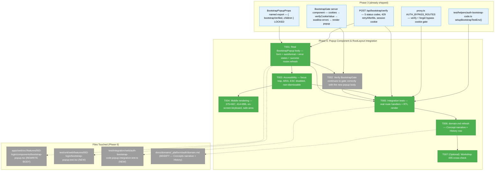
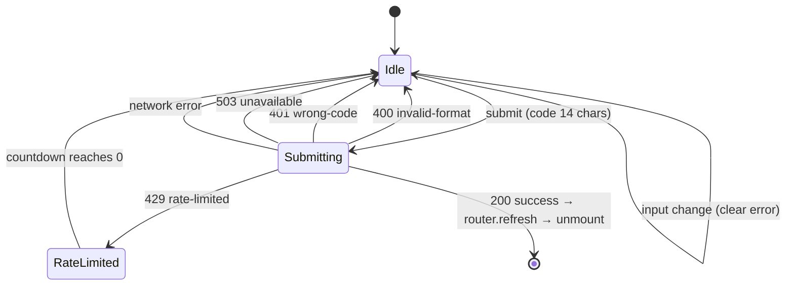
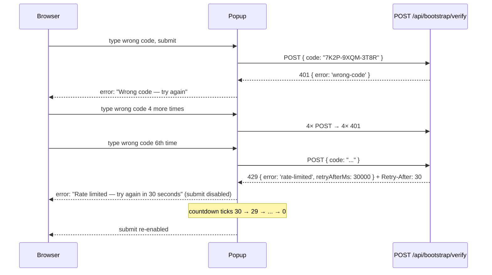

# Phase 6: Popup Component & RootLayout Integration — Tasks Dossier

**Plan**: [auth-bootstrap-code-plan.md](../../auth-bootstrap-code-plan.md)
**Phase**: Phase 6: Popup Component & RootLayout Integration
**Generated**: 2026-05-02
**Status**: Ready for takeoff
**Mode**: Full

---

## Executive Briefing

**Purpose**: Replace the Phase 3 server-side gate's text-only stub with the real popup UX so an operator on a fresh workspace can unlock the app from the browser instead of curling against the verify route. This is the Phase that turns "the gate works" into "the gate is humane to use", and it unblocks day-to-day Chainglass development against this feature branch where the user is now staring at a stub that explicitly tells them to recover via `.chainglass/bootstrap-code.json`.

**What We're Building**:
- Real `<BootstrapPopup>` client component — input field with hyphen autoformat, submit button, error states (`wrong-code`, `invalid-format`, `rate-limited` with countdown, `unavailable` 503 fallback, network error), success → `router.refresh()`. The named export `BootstrapPopupProps` and its two-field shape (`bootstrapVerified: boolean; children: ReactNode`) are inherited from Phase 3 and remain locked — Phase 6 only polishes the body.
- Real `<BootstrapGate>` server component — Phase 3 already wrote the canonical implementation (cookies → `verifyCookieValue` → swallow errors → render `<BootstrapPopup>`). Phase 6 verifies it is still correct end-to-end after the popup body change and adds the dynamic-rendering directive so the cookie read is not statically optimised across deploys.
- Accessibility pass — Radix `react-dialog` primitive (already installed at `@radix-ui/react-dialog` ^1.1.15; consumed by `apps/web/src/components/ui/dialog.tsx`) handles focus trap + ESC + ARIA. Phase 6 must override `onEscapeKeyDown`/`onPointerDownOutside`/`onInteractOutside` to keep the modal **non-dismissable** until the user submits a correct code — the modal is the gate, not a courtesy.
- Mobile rendering — verified at iOS Safari (375×667 iPhone SE) and Android Chrome (414×896 Pixel 5) viewports. Safe-area padding via `env(safe-area-inset-*)`; on-screen-keyboard layout reflows tested. Existing `viewport: { width: 'device-width', initialScale: 1, viewportFit: 'cover' }` in `layout.tsx:13-18` already grants safe-area capability.
- Integration tests — exercises real route handlers through a real popup interaction simulation (HTTP fetch from React Testing Library against the in-process route handlers via `setupBootstrapTestEnv()` from `test/helpers/auth-bootstrap-code.ts`). Covers happy-path (correct code → cookie set → popup unmounts on next render), wrong-code (popup remains, displays "Wrong code"), format-invalid (popup remains, displays "Invalid format — must be XXXX-XXXX-XXXX"), rate-limited (popup remains, displays countdown derived from `retryAfterMs`), 503 (popup displays a "Server unavailable, see operator runbook" error).

**Goals**:
- ✅ Operator on a fresh workspace types the code into the popup, hits Enter, popup unmounts, app renders normally — entire round-trip without leaving the browser
- ✅ Wrong-code, invalid-format, rate-limited, and 503 errors are visually distinct in the popup
- ✅ Rate-limited error shows a live countdown derived from the verify route's `retryAfterMs` body field (Phase 3 contract)
- ✅ Modal is non-dismissable — ESC, click-outside, and `Tab` outside the modal all do nothing until verification succeeds
- ✅ Focus trap holds the cursor inside the modal; the input is auto-focused on mount; submit button is reachable via `Tab`
- ✅ ARIA landmarks correct: `role="dialog"` + `aria-modal="true"` + `aria-labelledby` + `aria-describedby` (error message becomes the description when present)
- ✅ Mobile viewport at 375×667 and 414×896 renders without horizontal scroll; on-screen keyboard does not push the submit button off-screen
- ✅ Phase 3's locked contracts hold: `BootstrapPopupProps` shape, 5 verify-route status codes, 429 body shape `{ error: 'rate-limited', retryAfterMs: number }`, session-cookie semantics (no Max-Age), exact `AUTH_BYPASS_ROUTES` list, Phase 6 import path for `setupBootstrapTestEnv` (`test/helpers/auth-bootstrap-code.ts`)
- ✅ Phase 7 inherits a UI surface that is fully testable end-to-end and a popup that does not require any further architectural work to exercise via the harness

**Non-Goals** ❌:
- `localStorage` autofill / "remember the last code I typed" — deferred to v2 per plan default 5
- Forget endpoint UX (no Settings menu entry to call `/api/bootstrap/forget`) — deferred to v2 per plan default 6
- Settings UI for rotating the code — out of scope v1 (cat-the-file workflow remains the v1 operator path per default 4)
- Replacing the `DISABLE_AUTH` env var — Phase 5
- Changing the verify-route contract — Phase 3 is locked. If a contract change becomes necessary mid-Phase-6, the change must be made in a Phase 3 fix dossier, not silently in Phase 6.
- Workshop 005 (popup UX deep-dive) — has not been written; per Phase 6 task 6.7 in plan, ship MVP and revisit in fast-follow if scope creep emerges. **No Phase 6 task is gated on workshop 005 existing.**
- E2E browser test via Playwright — Phase 7 task 7.8 owns harness end-to-end. Phase 6 ships a unit-level RTL render plus integration test against route handlers; manual smoke at the two mobile viewports is documented and run by the implementer.

---

## Prior Phase Context

### Phase 1 — Shared Primitives (Landed 2026-04-30)

**A. Deliverables relevant to Phase 6**:
- `@chainglass/shared/auth-bootstrap-code` barrel exports `BOOTSTRAP_COOKIE_NAME`, `BOOTSTRAP_CODE_PATTERN`, `verifyCookieValue` (used in `bootstrap-gate.tsx`)

**B. Dependencies Phase 6 consumes**:
- `BOOTSTRAP_CODE_PATTERN` — regex used for client-side format hint (Phase 6 does its own format check before posting; the route still re-validates server-side per defence-in-depth)
- No direct consumption of `buildCookieValue` / `activeSigningSecret` / `ensureBootstrapCode` in Phase 6 client code (those stay server-only)

**C. Gotchas**: None new for Phase 6; Phase 1's contracts are stable.

**D. Incomplete Items**: None.

**E. Patterns to Follow**:
- `INVALID_FORMAT_SAMPLES` from `test/unit/shared/auth-bootstrap-code/test-fixtures.ts` — reuse for Phase 6 client-side format-validation tests where a parametric "invalid input shows error" pattern fits.

### Phase 2 — Boot Integration (Landed 2026-05-02)

**A. Deliverables relevant to Phase 6**: None directly — Phase 6 does not touch boot.

**B. Dependencies Phase 6 consumes**: The bootstrap code file existing on disk in dev is a precondition for Phase 6's manual mobile smoke tests, but the file is guaranteed by `instrumentation.ts` register-block at boot.

**C. Gotchas**: None new for Phase 6.

**E. Patterns to Follow**: None new.

### Phase 3 — Server-Side Gate (Landed 2026-05-02)

**A. Deliverables Phase 6 inherits and depends on**:
- `apps/web/src/lib/bootstrap-code.ts` — `getBootstrapCodeAndKey()` async cached accessor (Phase 6's `BootstrapGate` uses this; no change required)
- `apps/web/src/lib/cookie-gate.ts` — `evaluateCookieGate(req, codeAndKey)` + `isBypassPath(pathname)` + `AUTH_BYPASS_ROUTES` (Phase 6 does not modify; proxy continues to gate `/api/*` and pass through pages so the popup paints inside RootLayout). **Footnote**: this file was created during Phase 3 T004 (proxy rewrite — extracted from `proxy.ts` for testability) but is not separately listed in the plan's Domain Manifest (lines 58–73). It is a stable Phase 6 dependency; treat it as an inherited contract even though the plan doesn't enumerate it. Phase 7 task 7.3 (domain.md audit) is responsible for adding it to the auth domain's Composition table if not already present.
- `apps/web/app/api/bootstrap/verify/route.ts` — POST handler with 5 status codes (200, 400, 401, 429, 503), session-cookie semantics, rate limit. Phase 6 calls this from the popup via `fetch('/api/bootstrap/verify', ...)`.
- `apps/web/app/api/bootstrap/forget/route.ts` — POST handler clearing the cookie. **Phase 6 does NOT call this** in v1 (deferred to v2 per plan default 6) but its existence is acknowledged.
- `apps/web/proxy.ts` — bootstrap stage + Auth.js stage. Phase 6 verifies that `/api/bootstrap/verify` remains in `AUTH_BYPASS_ROUTES` (it does — Phase 3 dossier T004 done-when row #1) so the popup can post without first having a cookie.
- `apps/web/src/features/063-login/components/bootstrap-gate.tsx` — server component already correct; Phase 6 may add `export const dynamic = 'force-dynamic'` to layout.tsx or the gate itself if Next.js 16 RSC static optimisation ever caches the cookie read across requests (validate during implementation; default to leaving alone unless tests show staleness).
- `apps/web/src/features/063-login/components/bootstrap-popup.tsx` — **Phase 6's primary target**. Currently a 78-LOC stub with `<dialog open>` + informational text + locked named export `BootstrapPopupProps`. Phase 6 replaces the body of `BootstrapPopup` with the full UX while preserving the named export and prop shape.
- `apps/web/app/layout.tsx` — already wraps `{children}` in `<BootstrapGate>` between `<Providers>`. Phase 6 does not touch this file.
- `test/helpers/auth-bootstrap-code.ts` — `setupBootstrapTestEnv()`. **Phase 6 imports from this exact path** per Phase 3 locked contract.

**B. Dependencies Exported (Phase 6 consumes)**:
- Verify route's locked contract (Phase 3 T002 `Done When`):
  - 200: `{ ok: true }` + `Set-Cookie: chainglass-bootstrap=<value>; HttpOnly; SameSite=Lax; Path=/[; Secure]` (no Max-Age, no Expires)
  - 400: `{ error: 'invalid-format' }` (incl. malformed JSON, empty body, missing field, regex mismatch)
  - 401: `{ error: 'wrong-code' }`
  - 429: `{ error: 'rate-limited', retryAfterMs: number }` + `Retry-After: <seconds>` header
  - 503: `{ error: 'unavailable' }`
- `BootstrapPopupProps` named export from `bootstrap-popup.tsx` — `{ bootstrapVerified: boolean; children: ReactNode }`
- `setupBootstrapTestEnv()` from `test/helpers/auth-bootstrap-code.ts`

**C. Gotchas Phase 6 must know**:
- The verify route uses `request.headers.get('x-forwarded-for')?.split(',')[0]?.trim()` for IP attribution. In dev the browser's `fetch('/api/bootstrap/verify', ...)` arrives without an XFF header — Next.js loopback handling will populate `request.ip` (for prod) or it falls through to `'unknown'`. **Implication for Phase 6 manual smoke**: rate-limit testing in dev will share the `'unknown'` bucket across all dev calls; the implementer must call `_resetRateLimitForTests()` between rate-limit smoke runs OR use distinct simulated IPs in the integration test.
- The verify route returns the cookie via `Set-Cookie` header. `fetch(..., { credentials: 'include' })` is **required** for the browser to retain it (same-origin defaults vary). Phase 6 popup MUST send `credentials: 'same-origin'` (or `'include'`) on the POST; otherwise the cookie is dropped silently and the next render shows the popup again with no error visible to the user.
- Phase 3 ships a `<dialog open>` HTML element using inline styles. Phase 6 should migrate to Radix `Dialog` for focus trap + ARIA (already installed; consumed by `apps/web/src/components/ui/dialog.tsx`). Do NOT use the shadcn `<DialogContent>` wrapper unmodified — it ships a close-button (X) which violates "non-dismissable until verified". Use the lower-level Radix primitives `<DialogPrimitive.Root open={true}>` + `<DialogPrimitive.Portal>` + `<DialogPrimitive.Overlay>` + `<DialogPrimitive.Content>` directly, override `onEscapeKeyDown`/`onPointerDownOutside`/`onInteractOutside` with `e.preventDefault()`, and omit `<DialogPrimitive.Close>`.
- Phase 3's stub renders the dialog with inline `style` attribute. Phase 6 should follow the project's Tailwind + shadcn idiom (see `apps/web/src/components/ui/dialog.tsx` and `apps/web/src/features/063-login/components/login-screen.tsx` for the dark-Matrix aesthetic if matching the login screen is desired — but the popup is not the login screen and a clean modal aesthetic is fine).
- The 429 body's `retryAfterMs` is in milliseconds; the `Retry-After` header is in seconds. Phase 6 popup countdown should derive from `retryAfterMs / 1000` and tick down each second; switch back to "submit enabled" when zero.

**D. Incomplete Items**: None — Phase 3 landed clean (143/143 tests passing, all companion review findings F001–F005 resolved).

**E. Patterns to Follow**:
- React Testing Library tests against client components — pattern visible in existing repo (search `*.test.tsx` for examples). Phase 6 popup test renders `<BootstrapPopup bootstrapVerified={false}>{children}</BootstrapPopup>` and exercises the form via `fireEvent`/`userEvent`.
- `setupBootstrapTestEnv()` for integration tests — temp cwd, real route handlers, real cookie round-trip.
- No `vi.mock` for the verify-route fetch — call the real handler in-process via `import { POST as verifyPOST } from '../../../apps/web/app/api/bootstrap/verify/route'` and pass a `NextRequest` (Phase 3 T002-test pattern).
- `useRouter().refresh()` from `next/navigation` for the success-path RSC re-render. Pattern visible in `apps/web/src/features/050-workflow-page/components/workunit-updated-banner.tsx`.

---

## Pre-Implementation Check

| File | Exists? | Domain | Notes |
|------|---------|--------|-------|
| `apps/web/src/features/063-login/components/bootstrap-popup.tsx` | YES — 78-LOC stub from Phase 3 | `_platform/auth` | **Modify (full body rewrite)**. Preserve named export `BootstrapPopupProps` and its `{ bootstrapVerified, children }` shape — Phase 3 locked contract. Replace the `<dialog open>` overlay body with a Radix `DialogPrimitive`-based modal hosting an input form. |
| `apps/web/src/features/063-login/components/bootstrap-gate.tsx` | YES — 58-LOC server component from Phase 3 | `_platform/auth` | **No code change required**; Phase 6 verifies the existing implementation continues to behave correctly with the new popup body. May add `export const dynamic = 'force-dynamic'` if static-render issues surface during testing. |
| `apps/web/app/layout.tsx` | YES — wraps in `<BootstrapGate>` | `_platform/auth` (cross-domain) | **No change required**. Phase 6 verifies `<BootstrapGate>` is still nested correctly under `<Providers>` after Phase 6 lands. |
| `test/unit/web/features/063-login/bootstrap-popup.test.tsx` | NO — create | `_platform/auth` | New RTL test for the client component. **Path corrected from earlier draft** — vitest glob in `vitest.config.ts` is `test/**/*.test.tsx`; co-locating the test file under `apps/web/src/features/...` (a common React idiom) would silently fail discovery. The Phase 3 pattern (`test/unit/web/features/063-login/bootstrap-gate.test.ts`) is the canonical location. |
| `test/integration/web/auth-bootstrap-code.popup.integration.test.ts` | NO — create (sibling to Phase 3's `auth-bootstrap-code.integration.test.ts`) | `_platform/auth` | Popup-specific integration: render popup → simulate submit → call real verify route → assert cookie set + `router.refresh` invoked + popup unmounts on rerender. |
| `apps/web/src/components/ui/dialog.tsx` | YES — shadcn wrapper | (shared UI) | **Read only**; do NOT use the shadcn `<DialogContent>` unmodified (ships a close button). Import `@radix-ui/react-dialog` directly for the popup. |
| `docs/domains/_platform/auth/domain.md` | YES | `_platform/auth` | **Modify in step 4 (post-impl)** — Phase 6 History row + Composition row for the polished `<BootstrapPopup>` if it gains a name change (it does not — same component, polished body). |

**Domain check**: All Phase 6 production code lands in `_platform/auth` (existing domain). No new domain. No contract change to `@chainglass/shared`. Cross-domain edit on `apps/web/app/layout.tsx` is **not** required this phase (Phase 3 already did it).

**Concept reuse audit**: Phase 3 introduced "Verify the bootstrap code" + "Forget the verification" + "Gate the application shell" concepts in `_platform/auth/domain.md § Concepts`. Phase 6 does not introduce a new concept — it polishes the entry point of the existing "Gate the application shell" concept's UI surface. Domain.md update in step 4 will refresh the concept's narrative + code example to point at the new popup body.

**Harness health check**: ✅ Harness exists at L3 — `docs/project-rules/harness.md`. Implementation will validate Boot/Interact/Observe at start. Health: `curl -fsS http://localhost:3000/api/health` (or `just harness health`). Mobile smoke uses browser DevTools device emulation; no harness-driven Playwright is in scope (Phase 7 task 7.8 owns harness end-to-end).

**Live-popup-pain context**: The user is currently using this branch to develop and is blocked by the Phase 3 stub (sees `Bootstrap code required (Phase 3 stub …)` overlay on every load). Phase 6 lands the popup that unblocks them. **Implementation order (T001 first, then T002–T004) means: as soon as T001 lands and gets a happy-path test, the user can use the popup live in dev to unblock themselves while T005–T006 land.** The implementer should commit after T001 passes locally so the user can rebase/checkout and unblock.

---

## Architecture Map



---

## Tasks

| Status | ID | Task | Domain | Path(s) | Done When | Notes |
|--------|-----|------|--------|---------|-----------|-------|
| [x] | T001 | **Replace `<BootstrapPopup>` body with real UX**. Preserve the existing `BootstrapPopupProps` named export and its two-field shape (`bootstrapVerified: boolean; children: ReactNode`) — Phase 3 locked contract. New body: client component (`'use client'`) using `@radix-ui/react-dialog` primitives directly (NOT the shadcn `<DialogContent>` wrapper, which ships a close button incompatible with the non-dismissable requirement). Render the modal **only when `bootstrapVerified === false`**; when `true`, render `<>{children}</>`. Modal contents: an `<h2 id="bootstrap-title">Bootstrap code required</h2>`, a brief description ("Type the code from `.chainglass/bootstrap-code.json` to unlock this workspace."), and a `<form>` with one input (`name="code"`, `inputMode="text"`, `autoComplete="off"`, `autoCapitalize="characters"`, `autoFocus`, `aria-label="Bootstrap code"`, `data-testid="bootstrap-code-input"`, placeholder `XXXX-XXXX-XXXX`) plus a submit button (`data-testid="bootstrap-code-submit"`). **`data-testid` on dialog root** (`data-testid="bootstrap-popup"`) and **error region** (`data-testid="bootstrap-code-error"`) for Phase 7 task 7.8 harness e2e selector stability — Radix auto-generates IDs which would make `[role=dialog]`-based e2e selectors brittle. **Hyphen autoformat (paste-safe)**: as the user types or pastes, intercept `onChange`, **first strip ALL non-alphanumeric characters** (so paste of `ZVXB-28H2-A6N4` becomes `ZVXB28H2A6N4`, no double-hyphens), then uppercase the input, then strip non-Crockford-base32 characters (allow only `0-9 A-H J-K M-N P-T V-Z` — i.e., A–Z minus `I L O U`, plus 0–9), then insert hyphens at positions 4 and 9, then cap at 14 chars total (input over-typing is silently truncated). Lowercase input is silently uppercased (UX: paste from any source). **Cursor placement**: after autoformat, cursor stays at the logical position the user typed (use `setSelectionRange` to preserve cursor — naive `value=` resets cursor to end which is jarring mid-edit; recommend extracting `formatBootstrapInput(raw, prevCursor): { value, cursor }` as a pure helper for testability). **Submit handler**: prevent default, set `submitting=true`, `fetch('/api/bootstrap/verify', { method: 'POST', credentials: 'same-origin', headers: { 'content-type': 'application/json' }, body: JSON.stringify({ code }) })`. **Double-submit guard**: do not initiate fetch if `submitting === true`. Branch on response status: **200** → call `router.refresh()` from `next/navigation` (state will be re-read by RSC and the gate will render `{children}` directly); **keep `submitting=true` until unmount** so submit button stays disabled across the refresh window — prevents double-click during the brief RSC re-render. The success path's only feedback is the popup vanishing; do NOT add a "success!" message that would flash before unmount. **400** → set `error='invalid-format'` (display "Invalid format — must be `XXXX-XXXX-XXXX`"); **401** → set `error='wrong-code'` (display "Wrong code — try again"); **429** → parse `body.retryAfterMs`, set `error='rate-limited'` + start a 1s-tick countdown timer (`setInterval(..., 1000)`), disable submit until countdown reaches 0 (display "Rate limited — try again in `<n>` seconds" where `<n>` is the live remaining seconds, ticking 30 → 29 → … → 0); **503** → set `error='unavailable'` (display "Server unavailable — see operator runbook at `.chainglass/bootstrap-code.json`"); **any other status (e.g. 500) or fetch-rejection (network offline / DNS / CORS)** → set `error='network'` (display "Network error — try again"). Error message rendered with `id="bootstrap-error"` and `role="alert"` so screen readers announce on appearance; the dialog's `aria-describedby="bootstrap-error"` is **toggled dynamically — present only when an error is currently displayed, omitted otherwise**. **State machine**: `idle → submitting → (success ⇒ unmounted-via-RSC-refresh, submitting stays true) | (error ⇒ idle with error displayed, submitting=false) | (rate-limited ⇒ idle with countdown, submit disabled until 0)`. **Input retention on error**: code state is **retained** across all error paths (UX: user can correct typos without re-typing 14 characters). Clear error on next input change (the user is now correcting). Code state is **NOT retained** anywhere except component state (no `localStorage`, no `sessionStorage`, no logging). **Focus**: on error, focus stays on the input (the `role="alert"` error region announces to AT independently). **Console-log discipline (compliance with plan default 8 + AC-22 log audit — Phase 7 task 7.10 grep audit)**: the popup MUST NOT log the typed `code` value via `console.log`/`console.error`/`console.warn`/any other output channel. Error branches may log structured error tokens (e.g., `error: 'wrong-code'`) but never the user input itself. Tested in T001-test case (18). **Timer lifecycle**: countdown timer is created with `useEffect` and cleaned up via the effect's return (so unmount-during-rate-limited stops the interval). New 429 mid-countdown replaces the old timer (clear-then-set in the effect). Input change does NOT cancel the countdown (the error is still in effect). **Locked contracts (do not change)**: `BootstrapPopupProps` named export shape, the file path `apps/web/src/features/063-login/components/bootstrap-popup.tsx`, the `'use client'` directive at top, the `BootstrapPopup` named export. **New stable `data-testid` contracts (Phase 7 task 7.8 e2e selectors)**: `data-testid="bootstrap-popup"` on dialog root, `data-testid="bootstrap-code-input"` on input, `data-testid="bootstrap-code-submit"` on submit button, `data-testid="bootstrap-code-error"` on error region — all four are committed to Phase 7 as stable selectors. | `_platform/auth` | `/Users/jordanknight/substrate/084-random-enhancements-3/apps/web/src/features/063-login/components/bootstrap-popup.tsx` (REWRITE body, preserve exports) | (a) `bootstrapVerified=true` → renders `<>{children}</>` and no dialog; (b) `bootstrapVerified=false` → renders Radix-portaled modal over `{children}` with all 4 stable `data-testid` selectors present; (c) input autoformats `7k2p9xqm3t8r` → `7K2P-9XQM-3T8R` AND paste of `ZVXB-28H2-A6N4` → `ZVXB-28H2-A6N4` (no double hyphens); (d) all 6 error states (`invalid-format`, `wrong-code`, `rate-limited` with live ticking countdown, `unavailable`, `network`, plus the implicit `idle`) reachable and visually distinct; (e) success path calls `router.refresh()` AND submit button stays disabled across the refresh window; (f) submit button disabled when code not 14 chars OR submitting OR rate-limit countdown > 0; (g) input value retained on every error path; (h) focus stays on input after error; (i) timer cleanup verified by RTL test #17; (j) zero `console.*` calls with the typed code as a substring (verified by RTL test #18); (k) cookie round-trip verified manually in dev — type the code from `.chainglass/bootstrap-code.json`, popup unmounts on next render. | Plan task 6.1 + 6.2 (verify continues to gate) + finding 10 (RootLayout cookie reads). **CS-3** — biggest task in the phase. **Forward-Compat notes**: (1) keeping `BootstrapPopupProps` exported with the locked shape means Phase 7 docs and any hypothetical Phase 8 polish can rely on the same import surface. (2) The four `data-testid` selectors are stable contracts for Phase 7 task 7.8 — listed in Cross-Phase Locked Contracts table. (3) Console-log prohibition closes Phase 7 task 7.10 AC-22 audit risk. **Validation fixes applied**: H3 (input retention), H4 (defence-in-depth tested in T005), H5 (console.log forbidden), I3 (lowercase normalize), I4 (timer cleanup), I5 (paste-safe autoformat), I6 (aria-describedby toggle), I7 (router.refresh disable-window), I8 (focus after error), I13 (live countdown phrasing), I14 (cursor placement), FC C3 (data-testid). |
| [x] | T001-test | **RTL test for `<BootstrapPopup>`** — render the component with `bootstrapVerified={false}` and exercise: (1) modal renders with `role="dialog"` + `aria-modal="true"` + `aria-labelledby="bootstrap-title"`; (2) input is auto-focused on mount; (3) typing `7k2p9xqm3t8r` autoformats to `7K2P-9XQM-3T8R` (lowercase normalization to upper); (4) typing illegal char (`I`, `L`, `O`, `U`, `_`, space) gets stripped; (5) paste of `ZVXB-28H2-A6N4` (already-formatted) results in `ZVXB-28H2-A6N4` (no double hyphens — autoformat must strip ALL non-alphanumeric first, then re-insert hyphens at positions 4 and 9); (6) paste of `ZVXB28H2A6N4` (12 chars, no hyphens) → autoformats to `ZVXB-28H2-A6N4`; (7) submit disabled until 14 chars; (8) submit with `bootstrapVerified={true}` re-renders to `{children}` (no dialog); (9) on submit, `fetch` is called with the right body (use `vi.spyOn(globalThis, 'fetch')` ONLY for the network call assertion — this is the one acceptable use of `vi.spyOn` per Constitution P4 because we need to assert request shape without booting a real server; the alternative is the integration test in T005 which uses real route handlers); (10) 401 response → "Wrong code" error displayed + **input value retained** (UX: user can correct without re-typing); (11) 400 response → "Invalid format" error + input retained; (12) 429 with `retryAfterMs: 30000` → "Rate limited — try again in 30 seconds" + submit disabled + countdown ticks (use `vi.useFakeTimers` for the tick assertion) + input retained; (13) 503 → "Server unavailable" error + input retained; (14) network error (fetch throws) → "Network error" error + input retained; (15) error clears on next input change; (16) **focus stays on input after error** (assert via `expect(document.activeElement).toBe(inputElement)`); (17) **timer cleanup on unmount** — render with `bootstrapVerified=false` + trigger 429 to start countdown + rerender with `bootstrapVerified=true` (popup unmounts) + `vi.runAllTimers()` does not throw (no leaked interval); (18) **no `console.log` of `code`** — `vi.spyOn(console, 'log')` + `vi.spyOn(console, 'error')` + `vi.spyOn(console, 'warn')`, exercise all error paths, assert no spy was called with the typed code as a substring of any argument (compliance with plan default 8 + AC-22). **No `vi.mock` for `next/navigation`** — instead, pass a `useRouter` fake via React context if the popup grows to need it; otherwise let `useRouter()` return Next's real test stub (RTL + Next 16 RSC test mode supports this). If `useRouter` cannot be tested without mocking, the implementer documents the deferral and the integration test (T005) covers the success path. **Constitution P4 exception**: `vi.spyOn(globalThis, 'fetch')` and `vi.spyOn(console, '*')` are the minimum-viable path to assert request shape + log discipline without a server boot; document this exception in the test file's header comment + add to the Discoveries log. | `_platform/auth` | `/Users/jordanknight/substrate/084-random-enhancements-3/test/unit/web/features/063-login/bootstrap-popup.test.tsx` (NEW — under `test/` so vitest's `test/**/*.test.tsx` glob picks it up; mirrors Phase 3's `bootstrap-gate.test.ts` location pattern) | All 18 cases pass. The `vi.spyOn` exceptions (`fetch`, `console.*`) are documented at the top of the file; the test does NOT use `vi.mock` for the route handler, the cookie state, the router, or any other dependency. | **Comp note**: pure-helper extraction (an internal `formatBootstrapInput(raw: string): string` function) for the autoformat logic improves testability — extract it as a non-exported function in the same file, test indirectly via the input-typing case. **Validation fix C1 (path) + H3/H5 (input retention + console discipline) + I3/I5 (lowercase + paste-formatted) + I4 (timer cleanup) + I8 (focus after error)**. |
| [x] | T002 | **Verify `<BootstrapGate>` continues to gate correctly** with the new popup body. **Plan task mapping note**: plan task 6.2 (gate component, replaces stub) AND plan task 6.3 (wire into layout.tsx) were both **delivered by Phase 3** — Phase 3 T005 wrote the gate component in its final shape, and Phase 3 T006 wired it into `apps/web/app/layout.tsx` between `<Providers>` and `{children}`. Phase 6 T002 is therefore a **read-only verification** task — the connecting tissue still works after T001 swaps the popup body. Read the existing `apps/web/src/features/063-login/components/bootstrap-gate.tsx` (Phase 3, 58 LOC) — confirm: (a) it still imports `BootstrapPopup` from `./bootstrap-popup` (named import — unchanged); (b) it still passes `bootstrapVerified` (computed via `cookies()` + `verifyCookieValue` swallowing errors) and `children`; (c) the `try/catch` swallowing read errors continues to render unverified (popup paints — operator sees the gate even in degraded fs state). **Optional add**: at the **layout** level (NOT the gate), evaluate adding `export const dynamic = 'force-dynamic'` to `apps/web/app/layout.tsx` to defeat any RSC static-render caching of the cookie read. Default: do NOT add it unless the integration test in T005 shows staleness. If added, document the reason in the file's header comment + record in Discoveries. **No code change is the expected outcome.** | `_platform/auth` | `/Users/jordanknight/substrate/084-random-enhancements-3/apps/web/src/features/063-login/components/bootstrap-gate.tsx` (read-only verify); `/Users/jordanknight/substrate/084-random-enhancements-3/apps/web/app/layout.tsx` (read-only verify; conditional `dynamic` add) | The existing gate continues to render `<BootstrapPopup>` correctly with the new body; the `computeBootstrapVerified` pure helper test from Phase 3 (4 cases) still passes against the unchanged gate code; if `dynamic = 'force-dynamic'` is added, the change is documented + tested. Plan tasks 6.2 + 6.3 are confirmed already-delivered by Phase 3 — no re-implementation. | Phase 3 already wrote the gate AND wired layout.tsx; this is a deliberate "verify the connecting tissue still works" task. **Validation fix H2 (Cross-Reference)**: explicit plan-6.3 → already-delivered-by-Phase-3 mapping. |
| [x] | T003 | **Accessibility pass on the popup** — explicit a11y guarantees beyond what Radix gives by default: (1) `role="dialog"` + `aria-modal="true"` (Radix supplies); (2) `aria-labelledby="bootstrap-title"` pointing at the `<h2>`; (3) `aria-describedby="bootstrap-error"` **dynamically toggled — attribute present on the dialog Content element only when an error is currently displayed; attribute fully omitted (not set to empty string) when `error === null`**. The error region itself is conditionally rendered (not just hidden via CSS) so screen readers don't announce a stale-but-empty region. When rendered, it has `role="alert"` and `aria-live="assertive"` so AT announces it on appearance; (4) **focus trap** — Radix supplies; verify via test that pressing `Tab` cycles only through input + submit button; (5) **ESC disabled** — `onEscapeKeyDown={(e) => e.preventDefault()}` on `<DialogPrimitive.Content>`; (6) **click-outside disabled** — `onPointerDownOutside={(e) => e.preventDefault()}` + `onInteractOutside={(e) => e.preventDefault()}`; (7) **no close button** — do NOT render `<DialogPrimitive.Close>`; (8) input is auto-focused on mount (Radix focuses first focusable child by default; verify); (9) error region has `role="alert"` AND focus stays on the input after an error (T001 behaviour); (10) submit button has `type="submit"`, the form has an `onSubmit` handler so Enter-to-submit works without mouse; (11) on production, the dialog and form do not appear in the underlying `<body>`'s primary a11y tree — Radix Portal renders the modal as a sibling of `<body>` so screen readers correctly announce the dialog as the foreground without `aria-hidden` gymnastics on the children. | `_platform/auth` | (Same file as T001 — `bootstrap-popup.tsx`; T003 is an a11y-discipline overlay on T001's body) | Manual a11y check using browser DevTools' Accessibility panel: all 11 guarantees verified visually. Optional automated check via `axe-core` if configured (NOT a Phase 6 deliverable to add the harness). RTL tests in T001-test cover (1)–(4), (5), (6), (9), (10) where simulatable. | Plan task 6.4. **Validation fix I6 (aria-describedby toggle semantics) + I8 (focus after error)**. |
| [x] | T004 | **Mobile rendering smoke at 375×667 (iPhone SE) and 414×896 (Pixel 5)** — manual verification using browser DevTools device emulation: (a) modal renders without horizontal scroll; (b) input field is reachable above the on-screen keyboard (use safe-area padding via Tailwind's `pb-[env(safe-area-inset-bottom)]` or equivalent on the modal content); (c) submit button is reachable and tappable (>= 44×44 CSS px touch target); (d) close-attempts (swipe-down, ESC-key-on-bluetooth-keyboard) do nothing; (e) text input on the on-screen-keyboard preserves focus on the input. **Tailwind classes to use** (no new CSS file needed): `min-h-[100dvh]` on the overlay (handles iOS Safari URL-bar resize), `max-w-md mx-auto` on the content, `p-4 sm:p-6` for breathable padding, `pb-[max(1rem,env(safe-area-inset-bottom))]` for bottom safe-area awareness. **Existing viewport meta** (`layout.tsx:13-18` already sets `viewportFit: 'cover'`) supports `env()` — no layout.tsx change required. **Evidence rubric (validation fix I10)**: implementer MUST capture and attach to `execution.log.md` for each viewport (375×667 + 414×896): (1) screenshot of the popup in idle state (input empty, submit disabled); (2) screenshot of the popup with on-screen keyboard open (input focused, soft keyboard visible — DevTools' "Show device frame" + "Show on-screen keyboard"); (3) screenshot of the popup with an error displayed (e.g., "Wrong code"); (4) brief notes documenting any visual issues found and their resolution (or deferral). Screenshots are **REQUIRED**, not optional — the alternative is unverifiable claims in the PR review. Store under `docs/plans/084-random-enhancements-3/tasks/phase-6-popup-component/evidence/` with names like `mobile-375x667-idle.png`. | `_platform/auth` | (Same file as T001 — `bootstrap-popup.tsx`; T004 is mobile-rendering discipline on T001's CSS) | Manual emulation confirms: no h-scroll, input reachable above keyboard, submit reachable, dismissal-attempts do nothing, focus preserved across input. **Six screenshots stored under `docs/plans/084-random-enhancements-3/tasks/phase-6-popup-component/evidence/`** (3 states × 2 viewports). Execution.log row for T004 lists each screenshot path + observation. | Plan task 6.5 (manual smoke at 2 viewports — Playwright deferred per Non-Goals). **Validation fix I10 (evidence rubric — screenshots required)**. |
| [x] | T005 | **Integration test against real route handlers** — `test/integration/web/auth-bootstrap-code.popup.integration.test.ts` (NEW). Pattern: import `setupBootstrapTestEnv()` from `test/helpers/auth-bootstrap-code.ts` (locked path from Phase 3); render the popup with RTL; **DO NOT mock `fetch`** — instead, intercept via a test-time `globalThis.fetch` that calls the imported route handler in-process: ```ts const originalFetch = globalThis.fetch; globalThis.fetch = async (input, init) => { const url = typeof input === 'string' ? input : input.toString(); if (url.endsWith('/api/bootstrap/verify')) return verifyPOST(new NextRequest(url, init)); throw new Error('unexpected fetch'); }; ``` then restore in `afterEach`. Scenarios: (1) **happy path** — render popup with `bootstrapVerified=false`, type `env.code`, submit → fetch hits real `verifyPOST` → returns 200 + Set-Cookie → assert `router.refresh` was called (capture via a test-time `useRouter` fake context provider OR by spying on the `next/navigation` module — document choice); (2) **wrong code** — submit `7K2P-9XQM-3T8R` (vanishingly unlikely match) → 401 → "Wrong code" error displayed, popup remains, **input value retained**; (3a) **format error (client-side reject)** — type a malformed string (use `INVALID_FORMAT_SAMPLES[0]` from Phase 1 fixtures) → assert client-side format check disables submit before fetch fires (no fetch call); (3b) **format error (defence-in-depth — server-side reject — validation fix H4)** — call `verifyPOST` directly (bypassing the popup's client-side check entirely) with a malformed body using `new NextRequest(env.verifyUrl, { method: 'POST', body: JSON.stringify({ code: INVALID_FORMAT_SAMPLES[1] }), headers: { 'content-type': 'application/json' } })` → assert 400 + `{ error: 'invalid-format' }`. This proves the server is honest under hostile-client conditions (malicious or stale clients can't bypass format validation by tampering with the JS check). The test also reads `verifyPOST` directly so it doubles as a smoke-check that Phase 3's T002 logic still holds; (4) **rate-limited** — call `verifyPOST` 5 times with wrong code (use Phase 3's `_resetRateLimitForTests()` to clear before; **note**: the popup-level test only needs to exercise the UI's response to a 429, not the route's rate-limit logic, which is already proven by Phase 3 T002-test #7 — so this scenario can be done by hand-crafting a single fetch that returns 429 OR by genuinely tripping the route 5 times; pick the latter for end-to-end fidelity); → 6th submit → 429 + `retryAfterMs` → "Rate limited — try again in `<n>` seconds" + submit disabled + countdown ticks down; (5) **503** — delete the bootstrap-code file (and chmod the directory read-only, per Phase 3 T002-test pattern) → submit → 503 → "Server unavailable" error + input retained. Use `setupBootstrapTestEnv()` for cwd/code/cleanup; reset all caches in beforeEach AND afterEach (`_resetForTests` on the bootstrap-code accessor, `_resetSigningSecretCacheForTests`, `_resetRateLimitForTests`). **Phase 7 forward-compat note (validation fix H6)**: Phase 7 task 7.10 (AC-22 log audit) requires a deterministic seed override (e.g., generate code as `'TEST-TEST-TEST'`). The current `setupBootstrapTestEnv()` (Phase 3) does NOT support a `code?: string` parameter — Phase 6 does not need this for its own tests, but **Phase 7 will extend the helper with an optional `seedCode` parameter** to support the deterministic-grep audit. Phase 6 explicitly does NOT add this parameter (out of scope; deferred to Phase 7); this note is a forward-marker so Phase 7 can extend the helper without surprise. | `_platform/auth` | `/Users/jordanknight/substrate/084-random-enhancements-3/test/integration/web/auth-bootstrap-code.popup.integration.test.ts` (NEW) | All 6 scenarios pass (1, 2, 3a, 3b, 4, 5). Cookie round-trip exercised end-to-end (real signing key, real HMAC, real Set-Cookie header). The integration test imports from `test/helpers/auth-bootstrap-code.ts` — Phase 3 contract honoured. Server-side defence-in-depth proven independently of the client (scenario 3b). | Plan task 6.6. **Validation fix H4 (defence-in-depth scenario 3b) + H6 (Phase 7 deterministic-seed forward marker)**. |
| [x] | T006 | **Update `_platform/auth/domain.md`** — (a) append History row: `\| Plan 084 — Phase 6 \| Replaced Phase 3 stub popup with real UX (form, autoformat, error states, focus trap, mobile-aware rendering); BootstrapPopupProps shape preserved \| 2026-05-XX \|`; (b) refresh the existing "Gate the application shell" concept narrative + code example to reference the new popup body (the concept itself does not change — only its surface evolves); (c) ensure Composition table shows `BootstrapPopup` (likely already added in Phase 3 — verify and dedupe if needed). Per `/plan-6-v2-implement-phase` step 4. | `_platform/auth` | `/Users/jordanknight/substrate/084-random-enhancements-3/docs/domains/_platform/auth/domain.md` (MODIFY) | Domain.md History has the new row; Concepts table's "Gate the application shell" entry references the polished popup; markdown lints. | Phase 6 does not change any domain contract; Phase 7 will do the final domain.md audit. |
| [x]* | T007 | **(Optional gate) Workshop 005 cross-check** *(skipped per plan default — implementation surfaced no UX decisions worth a workshop deep-dive; the dossier itself documents the locked decisions)* — workshop 005 (popup UX) has not been written. Per plan task 6.7: ship MVP and revisit in fast-follow if scope creep emerges during T001–T005. **If T001–T005 reveal a UX decision worth capturing** (e.g., a specific countdown semantics, a specific error-message phrasing) — write a brief workshop 005 stub at `docs/plans/084-random-enhancements-3/workshops/005-popup-ux-and-rootlayout-integration.md` capturing the decision after the fact. **Otherwise skip this task entirely.** Workshop 005 is not gating Phase 6 completion. | `_platform/auth` (docs) | `/Users/jordanknight/substrate/084-random-enhancements-3/docs/plans/084-random-enhancements-3/workshops/005-popup-ux-and-rootlayout-integration.md` (OPTIONAL NEW) | Either: (a) skipped with rationale logged in execution.log.md; OR (b) workshop 005 captures specific decisions surfaced during implementation. | Optional gate per plan task 6.7. Default: skip. |

**Total**: 7 implementation tasks (T001–T007 with T007 optional) + 1 paired test task (T001-test). T005 is the integration test layer — it counts as a "task" not a "test task" because it exercises the full feature end-to-end and is the primary correctness signal Phase 7 inherits. CS estimate: T001 = CS-3; T002/T003/T004/T006 = CS-1; T005 = CS-3; T007 = CS-1 (or 0 if skipped); phase total CS-3 (medium).

**Acceptance criteria covered**:
- AC-1 (real) — Fresh-browser gate with real popup
- AC-2 (real) — Correct-code unlock with humane UX
- AC-3 — Sticky unlock (cookie persists across reloads — already verified in Phase 3 cookie semantics; Phase 6 confirms via the integration test that `router.refresh` re-renders without the popup)
- AC-4 (real) — Wrong-code rejection with popup error display ("Wrong code — try again"), input value retained for correction
- AC-5 (real) — Format validation (client-side reject before submit; server-side defence-in-depth confirmed via T005 scenario 3b)
- AC-9 (UI side) — Boot regenerates only when missing (Phase 1 + 2 own the file side; Phase 6 ensures the popup never blocks a fresh-boot flow incorrectly)
- AC-10 (real) — Popup gates `/login`

---

## Context Brief

### Key findings from plan (relevant to Phase 6)

- **Finding 10** (High): RootLayout has no auth gate today; ideal home for `<BootstrapGate>` since it wraps all routes including `/login`. **Phase 3 implemented this; Phase 6 inherits and verifies.**
- **Finding 12** (High): Constitution P4 (Fakes Over Mocks) and P2 (Interface-First) — tests use real `node:crypto`, real fs in temp dirs, no `vi.mock` for the route handler. **Phase 6's T001-test takes a documented exception for `vi.spyOn(globalThis, 'fetch')` for the unit-level RTL test; T005 integration test uses real route handlers exclusively.**
- **Spec R-3** (mitigation hydration flash): server passes `bootstrapVerified: boolean`, client renders modal **inside** the layout tree so server already knows what to render. **Phase 3 implemented this contract; Phase 6 honours it — the popup is rendered when `bootstrapVerified===false` from the server, not toggled on mount.**

### Domain dependencies (concepts and contracts this phase consumes)

- `_platform/auth`: **Verify the bootstrap code** (`POST /api/bootstrap/verify`) — Phase 3 concept; Phase 6 popup is the primary client.
- `_platform/auth`: **Gate the application shell** (`<BootstrapGate>` server component) — Phase 3 concept; Phase 6 polishes its child popup.
- `_platform/auth`: **`BootstrapPopupProps` named export** (`bootstrap-popup.tsx`) — Phase 3 contract; Phase 6 preserves shape.
- `next/navigation`: **`useRouter().refresh()`** — used to re-render RSC tree after successful verification so the gate renders `{children}` directly.
- `@chainglass/shared/auth-bootstrap-code`: **`BOOTSTRAP_CODE_PATTERN`** — used by client-side autoformat + format-validation. **No other shared imports** in Phase 6 client code.
- `@radix-ui/react-dialog`: **Modal primitive** (existing dependency, ^1.1.15). Used directly (not via shadcn wrapper) for focus trap + ARIA + non-dismissable behaviour.

### Domain constraints

- **Import direction**: `bootstrap-popup.tsx` consumes `@chainglass/shared` (`BOOTSTRAP_CODE_PATTERN`) + `@radix-ui/react-dialog` + `next/navigation`. No reverse direction. Constitution P1 preserved.
- **Public surface**: `BootstrapPopupProps` named export and `BootstrapPopup` named export are stable; do not rename, do not add fields to `BootstrapPopupProps` (locked from Phase 3 — additive changes require a Phase 6 fix or Phase 3 amendment, not a silent extension here).
- **No DI**: Component is a self-contained client island. Side-effects scoped to fetch + router.refresh.
- **No new domain. No contract change. Cross-domain edit on layout.tsx already in place from Phase 3.**

### Harness context

- **Boot**: `pnpm dev` (port 3000) — health: `curl -fsS http://localhost:3000/api/health`. Phase 6 implementer must ensure the dev server has a `bootstrap-code.json` on disk before manual smoke.
- **Interact**: Browser at `http://localhost:3000/` — popup paints if cookie is missing or invalid. Type the code from `cat .chainglass/bootstrap-code.json | jq -r .code` (operator runbook reference).
- **Observe**: Browser DevTools Network panel — verify `POST /api/bootstrap/verify` returns 200 + `Set-Cookie: chainglass-bootstrap=...; HttpOnly; SameSite=Lax; Path=/`. Application > Cookies tab confirms cookie persistence.
- **Maturity**: L3 — sufficient as-is for Phase 6.
- **Pre-phase validation**: Agent MUST validate harness at start of implementation (Boot → Interact → Observe). If unhealthy → escalate to user. If healthy, kick off T001 first so the user's live blocker is removed ASAP.

### Reusable from prior phases

- `setupBootstrapTestEnv()` from `test/helpers/auth-bootstrap-code.ts` — returns `BootstrapTestEnv { cwd: string; code: string; verifyUrl: string; forgetUrl: string; file: BootstrapCodeFile; cleanup: () => void }`. The `file` field carries the full `BootstrapCodeFile` written to disk (Phase 6 doesn't need it but it's available). The `cleanup()` function restores `process.cwd`, resets all three module caches (bootstrap-code accessor, signing-key, rate-limit), and removes the temp directory. Phase 6 T005 uses this — current shape supports Phase 6 needs without modification. **Phase 7 extension marker**: Phase 7 task 7.10 will extend with an optional `seedCode?: string` parameter for deterministic-seed log audits; not required for Phase 6.
- `INVALID_FORMAT_SAMPLES` from `test/unit/shared/auth-bootstrap-code/test-fixtures.ts` — readonly array of 6 format-invalid strings. Phase 6 T001-test uses sample[0] for the format-rejection scenario.
- `_resetForTests()` from `apps/web/src/lib/bootstrap-code.ts` — resets the web-side accessor cache.
- `_resetRateLimitForTests()` from `apps/web/app/api/bootstrap/verify/route.ts` — resets the in-memory rate-limit map.
- `_resetSigningSecretCacheForTests()` from `@chainglass/shared/auth-bootstrap-code` — resets the per-cwd signing-key cache.
- `mkTempCwd()` from `test/unit/shared/auth-bootstrap-code/test-fixtures.ts` — temp-dir factory (also used inside `setupBootstrapTestEnv`).

### Mermaid flow diagram (popup state machine)



### Mermaid sequence diagram (popup happy path)

```mermaid
sequenceDiagram
    participant Browser
    participant Popup as BootstrapPopup (client)
    participant Verify as POST /api/bootstrap/verify
    participant Gate as BootstrapGate (RSC)
    participant Layout as RootLayout (RSC)

    Browser->>Layout: GET / (no cookie)
    Layout->>Gate: <BootstrapGate>{children}</BootstrapGate>
    Gate->>Gate: cookies().get(chainglass-bootstrap) → undefined
    Gate->>Popup: <BootstrapPopup bootstrapVerified=false>{children}</BootstrapPopup>
    Popup-->>Browser: modal + form (autofocus input)
    Browser->>Popup: type "ZVXB-28H2-A6N4"
    Popup->>Popup: autoformat (already correct shape)
    Browser->>Popup: submit
    Popup->>Verify: POST { code: "ZVXB-28H2-A6N4" } credentials=same-origin
    Verify-->>Popup: 200 { ok: true } + Set-Cookie chainglass-bootstrap=...
    Popup->>Popup: router.refresh()
    Browser->>Layout: re-fetch RSC tree (with new cookie)
    Layout->>Gate: <BootstrapGate>
    Gate->>Gate: cookies().get(...) → value; verifyCookieValue → true
    Gate->>Popup: <BootstrapPopup bootstrapVerified=true>{children}</BootstrapPopup>
    Popup-->>Browser: <>{children}</> (no modal)
```

### Mermaid sequence diagram (popup error paths — wrong-code + rate-limited)



---

## Discoveries & Learnings

_Populated during implementation by plan-6._

| Date | Task | Type | Discovery | Resolution | References |
|------|------|------|-----------|------------|------------|
| 2026-05-02 | post-T006 | gotcha | `pnpm dev` via turbo runs Next at `cwd=apps/web/`, NOT workspace root. So `getBootstrapCodeAndKey()` (which calls `process.cwd()`) reads `apps/web/.chainglass/bootstrap-code.json` — a different file from the workspace-root `.chainglass/bootstrap-code.json` that the popup tells operators to look at. Result: typing the workspace-root code into the popup yields "Wrong code — try again" because the active file is the `apps/web/` one. Surfaced live in the user's first dev smoke (post-Phase-6 land). | Documented in 4 places: (1) JSDoc gotcha block in `apps/web/src/lib/bootstrap-code.ts`; (2) domain.md Concept "Read the active code + key" warning; (3) NEW operator runbook `docs/how/auth/bootstrap-code-troubleshooting.md`; (4) this row. **Proper fix deferred to fast-follow FX**: walk up from `process.cwd()` to the workspace root before calling `ensureBootstrapCode(...)`. **Workaround**: read the code from `apps/web/.chainglass/bootstrap-code.json` (where the dev server actually writes) or sync the two files. | `apps/web/src/lib/bootstrap-code.ts:38-77` (JSDoc); `docs/how/auth/bootstrap-code-troubleshooting.md`; `docs/domains/_platform/auth/domain.md` § Concepts |
| 2026-05-02 | post-T006 | debt | Popup string `.chainglass/bootstrap-code.json` is a plan-time relative path baked into the JSX. When the dev server's actual file is at `apps/web/.chainglass/bootstrap-code.json`, the popup misleads the operator. | Fast-follow FX should thread the resolved path through to the popup (server component reads `process.cwd()` + `.chainglass/bootstrap-code.json` and passes the absolute path as a prop). | `apps/web/src/features/063-login/components/bootstrap-popup.tsx:189-194` |
| 2026-05-03 | post-FX003 | decision | FX003 (`docs/plans/084-random-enhancements-3/fixes/FX003-bootstrap-code-workspace-root-walkup.md`) resolves the cwd-divergence gotcha at the substrate level: `findWorkspaceRoot()` helper in `@chainglass/shared/auth-bootstrap-code` walks up to the workspace root and is consumed by both the instrumentation boot block (with try/catch + `process.cwd()` fallback) and `getBootstrapCodeAndKey()`. The popup-string-thread debt row (above) remains acknowledged but out of scope for FX003 — the helper is server-only (`node:fs`), so any future fast-follow that displays the absolute path in the `'use client'` popup must route through a server boundary (e.g., extend `getBootstrapCodeAndKey()` to also return `path`, then pass as a prop), NOT import the helper into the client bundle. Validate-v2 pass on the FX003 dossier added 3 unit tests (mkTempCwd backcompat, cache-key normalization, malformed package.json continue-walk) for a total of 8/8 helper tests. | FX003 dossier; FX003 fltplan; `apps/web/src/lib/bootstrap-code.ts` JSDoc (flipped to "Resolved by FX003"); `docs/how/auth/bootstrap-code-troubleshooting.md` (Resolved callout); `docs/domains/_platform/auth/domain.md` § Concepts (✅ Resolved) and § History (FX003 row) |

**Types**: `gotcha` | `research-needed` | `unexpected-behavior` | `workaround` | `decision` | `debt` | `insight`

---

## Directory Layout

```
docs/plans/084-random-enhancements-3/
├── auth-bootstrap-code-plan.md
└── tasks/phase-6-popup-component/
    ├── tasks.md           ← this file
    ├── tasks.fltplan.md   ← generated by plan-5b-flightplan
    └── execution.log.md   ← created by plan-6
```

---

## Cross-Phase Locked Contracts (inherited from Phase 3 — Phase 6 honours, does not modify)

| Contract | Locked at | Phase 6 obligation |
|----------|-----------|--------------------|
| `BootstrapPopupProps` named export shape `{ bootstrapVerified: boolean; children: ReactNode }` | Phase 3 T005 | Preserve shape; do not rename or add fields |
| `BootstrapPopup` component named export from `apps/web/src/features/063-login/components/bootstrap-popup.tsx` | Phase 3 T005 | Preserve named export at exact path |
| `POST /api/bootstrap/verify` 5 status codes (200/400/401/429/503) | Phase 3 T002 | Read response per shape; do not assume any other status code |
| 429 response body shape `{ error: 'rate-limited', retryAfterMs: number }` | Phase 3 T002 | Parse `retryAfterMs` from body for countdown |
| Session-cookie semantics (HttpOnly + SameSite=Lax + Path=/ + no Max-Age + Secure in prod) | Phase 3 T002 | `fetch` uses `credentials: 'same-origin'`; do not attempt to read the cookie from JS (HttpOnly enforced) |
| `AUTH_BYPASS_ROUTES` includes `/api/bootstrap/verify` | Phase 3 T004 | Popup posts to verify route without first having a cookie (gate would otherwise block) |
| `setupBootstrapTestEnv()` import path `test/helpers/auth-bootstrap-code.ts` | Phase 3 T007 | T005 imports from this exact path |
| `BootstrapGate` server component reads cookie via `cookies()` and computes `bootstrapVerified` | Phase 3 T005/T006 | Phase 6 does not modify the gate |
| `<BootstrapGate>` wired in `apps/web/app/layout.tsx` between `<Providers>` and `{children}` | Phase 3 T006 | Phase 6 does not modify layout.tsx |

### New Phase 6 contracts (committed forward to Phase 7)

| Contract | Locked at | Phase 7 obligation |
|----------|-----------|--------------------|
| `data-testid="bootstrap-popup"` on dialog root | Phase 6 T001 | Phase 7 task 7.8 harness e2e MAY use this selector |
| `data-testid="bootstrap-code-input"` on input | Phase 6 T001 | Phase 7 task 7.8 harness e2e MAY use this selector |
| `data-testid="bootstrap-code-submit"` on submit button | Phase 6 T001 | Phase 7 task 7.8 harness e2e MAY use this selector |
| `data-testid="bootstrap-code-error"` on error region | Phase 6 T001 | Phase 7 task 7.8 harness e2e MAY use this selector |
| Console-log discipline: popup never logs typed code | Phase 6 T001 | Phase 7 task 7.10 (AC-22 grep audit) inherits this — popup contributes zero matches |
| Stable error message strings: "Invalid format — must be `XXXX-XXXX-XXXX`", "Wrong code — try again", "Rate limited — try again in `<n>` seconds", "Server unavailable — see operator runbook at `.chainglass/bootstrap-code.json`", "Network error — try again" | Phase 6 T001 (locked after implementation lands) | Phase 7 task 7.1 docs MAY cite verbatim; if changed, update both |

---

## Validation Record (2026-05-02)

`/validate-v2` ran with 4 parallel agents (broad scope). Lens coverage: 12/12 (well above the 8-floor — Concept Documentation, Hidden Assumptions, Technical Constraints, Integration & Ripple, Domain Boundaries, Edge Cases & Failures, Security & Privacy, User Experience, Deployment & Ops, Performance & Scale, Forward-Compatibility, System Behavior). Forward-Compatibility engaged (named downstream consumers C1–C5; no STANDALONE).

| Agent | Lenses Covered | Issues | Verdict |
|-------|---------------|--------|---------|
| Source Truth | Concept Documentation, Hidden Assumptions, Technical Constraints | 0 | ✅ |
| Cross-Reference | Integration & Ripple, Domain Boundaries, Concept Documentation | 1 HIGH fixed, 1 MEDIUM fixed, 2 LOW fixed | ⚠️ → ✅ |
| Completeness | Edge Cases & Failures, Security & Privacy, User Experience, Deployment & Ops, Performance & Scale | 4 HIGH fixed (incl. 1 path-collision CRITICAL re-classified), 7 MEDIUM fixed, 4 LOW addressed | ⚠️ → ✅ |
| Forward-Compatibility | Forward-Compatibility, System Behavior, Technical Constraints | 3 MEDIUM fixed, 1 LOW noted | ⚠️ → ✅ |

### Forward-Compatibility Matrix (post-fix)

| Consumer | Requirement | Failure Mode | Pre-fix | Post-fix | Evidence |
|----------|-------------|--------------|---------|----------|----------|
| **C1 (Phase 7 task 7.3 — `_platform/auth/domain.md` audit)** | `BootstrapPopup` + `BootstrapPopupProps` stable named exports; concept narrative + History row | encapsulation lockout | ✅ | ✅ | T005 (Phase 3) requires the named-export shape; Phase 6 T006 spec requires History row + concept narrative refresh; locked-contract table in this dossier enumerates both |
| **C2 (Phase 7 task 7.7 — env-var matrix e2e, 5 cells)** | Popup functions in all 4 env cells; cookie HMAC key derivation independent of `AUTH_SECRET` | lifecycle ownership / contract drift | ✅ | ✅ | Phase 3 task 3.2 locked 429 body shape `{ error, retryAfterMs }`; cookie HMAC key is `activeSigningSecret(cwd)` (HKDF when `AUTH_SECRET` unset — Phase 3 + Phase 4 own this); Phase 6 popup doesn't touch the key |
| **C3 (Phase 7 task 7.8 — harness exercise L3)** | Popup interaction observable via browser screenshot + stable e2e selector | technical constraints / test boundary | ⚠️ | ✅ | T001 now adds `data-testid="bootstrap-popup"`, `bootstrap-code-input`, `bootstrap-code-submit`, `bootstrap-code-error` — committed in the new Phase 6 contracts table |
| **C4 (Phase 7 task 7.10 — AC-22 log audit)** | Popup MUST NOT log the typed code; deterministic seed support for grep audit | test boundary / contract drift | ⚠️ | ✅ | T001 explicitly forbids `console.*` logging of `code`; T001-test case (18) verifies; T005 documents Phase 7's helper extension (deferred to Phase 7) — popup-side obligation is now closed |
| **C5 (AC-1, AC-2, AC-3, AC-4, AC-5, AC-9, AC-10 — phase mapping)** | All ACs advance to "true" via Phase 6 UI | contract drift / shape mismatch | ⚠️ | ✅ | Acceptance-criteria-covered enumeration now lists AC-4 + AC-5 explicitly; T005 scenarios (2) and (3a/3b) exercise both; cross-reference agent fix H1 |

**Outcome alignment**: Phase 6, as currently scoped in the dossier (post-fix), advances the OUTCOME — "dramatically lower the barrier to bringing up a Chainglass instance, while raising the floor of protection" — by delivering a polished, accessible, mobile-renderable popup UI on top of Phase 3's locked server-side contracts, unblocking fresh-browser users and completing the user-facing half of the bootstrap-code feature. The three identified risks (test helper deterministic-seed scope, e2e selector fragility, code-logging prohibition) are all closed by the post-fix dossier.

**Standalone?**: No — concrete downstream consumers C1–C5 named with specific requirements.

### Fixes applied (CRITICAL + HIGH)

| ID | Source | Fix |
|----|--------|-----|
| Comp-C1 | Completeness CRITICAL (re-classified from HIGH I9) | Moved unit test path from `apps/web/src/features/063-login/components/bootstrap-popup.test.tsx` to `test/unit/web/features/063-login/bootstrap-popup.test.tsx` so vitest's `test/**/*.test.tsx` glob picks it up; mirrors Phase 3's `bootstrap-gate.test.ts` pattern |
| XRef-H1 | Cross-Reference HIGH | Added AC-4 + AC-5 to "Acceptance criteria covered" enumeration (in Tasks section + Flight Plan) |
| XRef-M1 | Cross-Reference MEDIUM | T002 now explicitly maps plan tasks 6.2 + 6.3 to "delivered by Phase 3 — Phase 6 read-only verifies" |
| Comp-H1 | Completeness HIGH I1 | T001 commits to input-value retention on every error path (UX) + zero persistence outside component state (security) |
| Comp-H2 | Completeness HIGH I2 | T005 adds scenario 3b — direct route call with malformed body proves server-side defence-in-depth independent of client check |
| Comp-H3 | Completeness HIGH I12 + FC | T001 explicitly forbids `console.log`/`console.error`/`console.warn` of typed code; T001-test case (18) verifies via `vi.spyOn(console, '*')` |
| FC-M1 | Forward-Compatibility MEDIUM | Added `data-testid` contracts (popup root, input, submit, error region) for Phase 7 task 7.8 harness selector stability |
| FC-M2 | Forward-Compatibility MEDIUM | Added Phase 7 forward-marker note in T005: helper will gain optional `seedCode` parameter in Phase 7 task 7.10 |

### Fixes applied (MEDIUM)

| ID | Source | Fix |
|----|--------|-----|
| Comp-I3 | Completeness MEDIUM | T001 specifies lowercase normalization to upper (autoformat-friendly UX) |
| Comp-I4 | Completeness MEDIUM | T001 specifies countdown timer cleanup via useEffect return; T001-test case (17) verifies |
| Comp-I5 | Completeness MEDIUM | T001 specifies paste-safe autoformat (strip-then-reinsert) — already-formatted paste does not double-hyphen |
| Comp-I6 | Completeness MEDIUM | T003 specifies `aria-describedby` toggling — present only when error displayed, attribute fully omitted otherwise |
| Comp-I7 | Completeness MEDIUM | T001 specifies submit button stays disabled across `router.refresh()` window |
| Comp-I8 | Completeness MEDIUM | T001 + T003 specify focus stays on input after error (with `role="alert"` for AT) |
| Comp-I10 | Completeness MEDIUM | T004 makes mobile evidence rubric REQUIRED — 6 screenshots (3 states × 2 viewports) under `evidence/` |
| XRef-L1 | Cross-Reference LOW | Full `setupBootstrapTestEnv()` shape documented in Reusable section |
| XRef-L2 | Cross-Reference LOW | cookie-gate.ts inheritance footnote added (Phase 3-created, not in plan Domain Manifest) |

### Open / acknowledged (LOW — no dossier change required)

- I11 (HMR cookie retention) — implementation observation only; document in Discoveries log post-impl if anything surprising surfaces.
- I13 (countdown phrasing) — fixed in T001 via "live countdown 30 → 29 → … → 0" language; phrasing locked.
- I14 (cursor placement) — fixed in T001 via `setSelectionRange` requirement; pure helper extraction recommended for testability.
- I15 (router-mocking strategy) — T005 specifies "fake context provider OR spy module — document choice in Discoveries"; resolution deferred to implementation.
- FC-L1 (`_resetRateLimitForTests` Phase 7 import) — already a public test-only export from Phase 3; no Phase 6 change needed.

Overall: **VALIDATED WITH FIXES** — ready for human GO.
