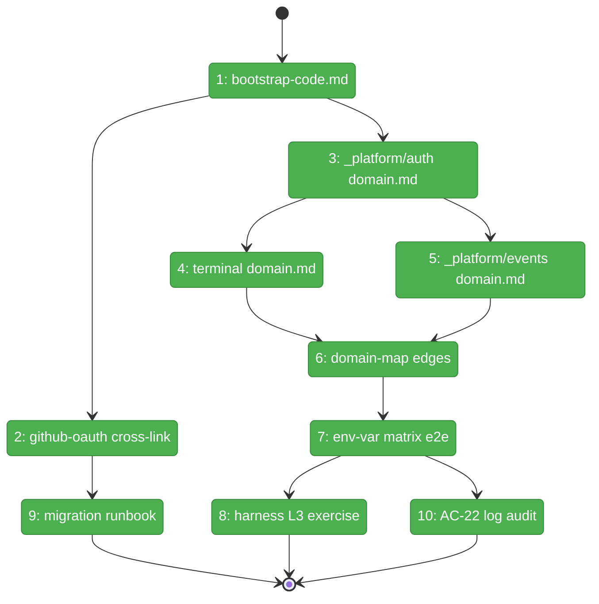

# Flight Plan: Phase 7 — Operator Docs, Migration, End-to-End

**Plan**: [../../auth-bootstrap-code-plan.md](../../auth-bootstrap-code-plan.md)
**Phase**: Phase 7: Operator Docs, Migration, End-to-End
**Generated**: 2026-05-03
**Status**: Landed (2026-05-03)

---

## Departure → Destination

**Where we are**: Phases 1–6 of Plan 084 are landed. The runtime ships: shared primitives at `@chainglass/shared/auth-bootstrap-code` (generator/persistence/cookie HMAC/signing-key + FX003 walk-up); boot wiring in `apps/web/instrumentation.ts` with the misconfig-fail-fast contract; the server-side gate (verify/forget routes, proxy bypass list, BootstrapGate); the hardened terminal WS sidecar with JWT iss/aud/cwd binding and Origin allowlist; the composite-localhost-or-cookie `requireLocalAuth` gate guarding all 9 sink routes plus the env-var rename + deprecation alias; and the real popup UX with 4 stable `data-testid` selectors. Tests across Phases 1–6 are green. Domains `_platform/auth`, `terminal`, `_platform/events` have History rows for every prior phase. Workshop 004 is the design source of truth. **What's missing**: a canonical operator-facing guide, a migration runbook, a domain-map edge update, an env-var matrix e2e, a system-level harness exercise, and a CI-grade AC-22 log audit.

**Where we're going**: A developer reading `docs/how/auth/bootstrap-code.md` understands the full lifecycle (file location, rotation, OAuth composition, container deployment, troubleshooting). An operator upgrading from a pre-Plan-084 release follows `migration-bootstrap-code.md` to land safely with explicit env-var actions for every existing setup. The 5 auth-pass cells of the env-var matrix run on every CI build. An automated AC-22 grep audit prevents any future log of the bootstrap code value. The `_platform/auth`, `terminal`, and `_platform/events` domain.md files plus `domain-map.md` reflect every shipped Phase 1–6 piece (Composition, Concepts, Source Location, Dependencies, two new edges).

---

## Domain Context

### Domains We're Changing

| Domain | What Changes | Key Files |
|--------|-------------|-----------|
| docs | New canonical bootstrap-code guide; new migration runbook; OAuth setup cross-link; domain-map edges | `docs/how/auth/bootstrap-code.md` (new), `docs/how/auth/migration-bootstrap-code.md` (new), `docs/how/auth/github-oauth-setup.md`, `docs/domains/domain-map.md` |
| `_platform/auth` | History row for Phase 7; Composition + Concepts + Source Location + Dependencies refreshed to reflect Phase 1–6 cumulative shipped state | `docs/domains/_platform/auth/domain.md` |
| `terminal` | History row for Phase 7 (new dependency edge to `_platform/auth`) | `docs/domains/terminal/domain.md` |
| `_platform/events` | History row + Composition row for `requireLocalAuth` + Dependency on `_platform/auth` | `docs/domains/_platform/events/domain.md` |

### Domains We Depend On (no changes)

| Domain | What We Consume | Contract |
|--------|----------------|----------|
| `@chainglass/shared` | `BOOTSTRAP_CODE_PATTERN`, `BOOTSTRAP_COOKIE_NAME`, `findWorkspaceRoot`, `setupBootstrapTestEnv` | `@chainglass/shared/auth-bootstrap-code` barrel |
| `_platform/auth` (read-only at test-time) | `getBootstrapCodeAndKey()`, `evaluateCookieGate()`, `bootstrapCookieStage()`, `requireLocalAuth()`, `isOAuthDisabled()` | Their public exports |
| harness | Boot, health, browser CDP, evidence capture | `just harness {dev,health,doctor,ports,...}` (L3) |

---

## Flight Status

<!-- Updated by /plan-6-v2: pending → active → done. Use blocked for problems/input needed. -->

**Legend**: grey = pending | yellow = active | red = blocked/needs input | green = done

---

## Stages

<!-- Updated by /plan-6-v2 during implementation: [ ] → [~] → [x] -->

- [x] **Stage 1: Author the canonical operator guide** — write `bootstrap-code.md` covering the 8 mandated sections (`docs/how/auth/bootstrap-code.md` — new file)
- [x] **Stage 2: Cross-link OAuth setup** — add the "Composition with bootstrap-code" section near the top of `docs/how/auth/github-oauth-setup.md`
- [x] **Stage 3: Refresh `_platform/auth/domain.md`** — append Phase 7 History row + verify Composition / Concepts / Source Location / Dependencies reflect Phase 1–6 cumulative shipped state (`docs/domains/_platform/auth/domain.md`)
- [x] **Stage 4: Append terminal History row** — one row noting the new dependency edge to `_platform/auth` (`docs/domains/terminal/domain.md`)
- [x] **Stage 5: Refresh `_platform/events/domain.md`** — Composition row for `requireLocalAuth` + History row + Dependency on `_platform/auth` (`docs/domains/_platform/events/domain.md`)
- [x] **Stage 6: Verify domain-map edges + add Plan-084 attribution** — both edges already exist from Phases 4 + 5; T006 verifies presence + adds attribution comments in `docs/domains/domain-map.md`
- [x] **Stage 7: Land the env-var matrix integration test** — 6 cells (5 auth-pass + 1 hard-fail boot) at `test/integration/web/auth-bootstrap-code.envmatrix.integration.test.ts` (new file)
- [x] **Stage 8: Run the harness L3 system exercise** — boot fresh worktree → exercise verify/token/WS/sink endpoints → persist evidence to `test/integration/web/auth-bootstrap-code.harness.evidence.md` (new file). Pre-step: `just harness doctor --wait 60` (harness was degraded at dossier-write time)
- [x] **Stage 9: Author the migration runbook** — `docs/how/auth/migration-bootstrap-code.md` with all 6 mandated sections (a–f) plus cross-link from bootstrap-code.md (new file)
- [x] **Stage 10: Land the AC-22 automated log audit** — in-process integration test using the actual generated code as the grep needle (no DI required) + capture `console.*` via spies + assert zero matches + file path appears at least once via `[bootstrap-code]` log line (`test/integration/web/auth-bootstrap-code.log-audit.integration.test.ts` — new file)

---

## Architecture: Before & After

```mermaid
flowchart LR
    classDef existing fill:#E8F5E9,stroke:#4CAF50,color:#000
    classDef changed fill:#FFF3E0,stroke:#FF9800,color:#000
    classDef new fill:#E3F2FD,stroke:#2196F3,color:#000

    subgraph Before["Before Phase 7"]
        B1[Phase 1-6 runtime]:::existing
        B2[domain.md History rows for P1-6]:::existing
        B3[bootstrap-code-troubleshooting.md FX003]:::existing
        B4[github-oauth-setup.md]:::existing
        B5[Phase 3 + Phase 5 integration tests]:::existing
    end

    subgraph After["After Phase 7"]
        A1[Phase 1-6 runtime]:::existing
        A2[domain.md History P7 + Composition refreshed]:::changed
        A3[bootstrap-code-troubleshooting.md FX003]:::existing
        A4[github-oauth-setup.md + composition section]:::changed
        A5[Phase 3 + Phase 5 integration tests]:::existing
        A6[bootstrap-code.md canonical operator guide]:::new
        A7[migration-bootstrap-code.md runbook]:::new
        A8[domain-map.md + 2 new edges]:::changed
        A9[envmatrix integration test]:::new
        A10[harness.evidence.md L3 transcript]:::new
        A11[log-audit integration test]:::new
    end
```

**Legend**: existing (green, unchanged) | changed (orange, modified) | new (blue, created)

---

## Acceptance Criteria

- [ ] AC-11 (GitHub OAuth disabled mode) — exercised in cell C2 + C3 + C4 of T007 env-var matrix
- [ ] AC-12 (GitHub OAuth enabled mode) — exercised in cell C1 of T007
- [ ] AC-13 (Terminal WS without `AUTH_SECRET`) — exercised in cell C3 of T007 + harness step 4–5 of T008
- [ ] AC-14 (Terminal WS with `AUTH_SECRET`) — exercised in cells C1/C2/C4 of T007
- [ ] AC-16 (Sidecar sinks gated) — exercised by T008 step 6 (real curl with `X-Local-Token`)
- [ ] AC-17 (CLI continues to work) — covered by T008 step 6 + Phase 5 regression in T007
- [ ] AC-20 (Hard fail on misconfiguration) — exercised by T007 cell C5
- [ ] AC-21 (Deprecation alias) — exercised by T007 cell C4 (warn-once verified)
- [ ] AC-22 (No code in logs) — enforced by T010 automated grep audit
- [ ] AC-23 (HMR safety) — fully owned by Phase 2 per plan AC-mapping line 393; Phase 7 owns NO new task for AC-23; the final regression sweep at end of Phase 7 confirms Phase 2's HMR-safe singleton pattern still passes (cross-references plan line 363's "(final audit)" wording — interpreted as "regression sweep continues to pass", not a new audit task)
- [ ] AC-26 (`AUTH_SECRET` rotation invalidates all sessions) — exercised by T007 cell C5 (via the misconfig path) + T009 § (e) recovery runbook
- [ ] All 8 mandated sections present in T001 bootstrap-code.md; markdown lints clean
- [ ] All 6 mandated sections present in T009 migration-bootstrap-code.md; cross-link from bootstrap-code.md
- [ ] domain-map.md adds `terminal → _platform/auth` and `_platform/events → _platform/auth` edges; Mermaid renders cleanly
- [ ] Domain.md History rows added (not rewritten) for `_platform/auth`, `terminal`, `_platform/events`
- [ ] T008 evidence file lands with `status: ok` harness health and AC mapping table
- [ ] Final regression sweep stays green across all Phase 1–7 unit + integration tests

## Goals & Non-Goals

**Goals**:
- Canonical operator-facing bootstrap-code documentation lands
- Migration runbook with all 6 mandated sections lands
- Every Phase 1–6 piece is reflected in domain.md / domain-map.md
- Env-var matrix and AC-22 log audit run as part of the test suite
- Harness L3 evidence captured for AC-1/2/13/16

**Non-Goals**:
- Runtime code changes (Phases 1–6 frozen)
- File-permission hardening (`mode: 0o600`) — documented for follow-up FX, not implemented
- CLI command to print the bootstrap code (out-of-scope per plan; v2 candidate)
- Workshop 005 popup-UX deepening
- Settings-UI rotate button

---

## Checklist

- [x] T001: Author `docs/how/auth/bootstrap-code.md` (8 sections; workshop 004 + reality)
- [x] T002: Cross-link `docs/how/auth/github-oauth-setup.md` to bootstrap-code as outer gate
- [x] T003: Refresh `_platform/auth/domain.md` (Phase 7 History row + Composition + Concepts + Source Location + Dependencies)
- [x] T004: Append `terminal/domain.md` Phase 7 History row
- [x] T005: Refresh `_platform/events/domain.md` (Composition `requireLocalAuth` + History + Dependency on `_platform/auth`)
- [x] T006: Verify both edges already present in `docs/domains/domain-map.md` + add Plan-084 attribution comments
- [x] T007: Env-var matrix integration test (5 cells + hard-fail) — AC-11/12/13/14/20/21/26
- [x] T008: Harness L3 exercise capturing AC-1/2/13/16 evidence + AC-17 system-level gap documented
- [x] T009: Migration runbook `docs/how/auth/migration-bootstrap-code.md` (6 sections)
- [x] T010: AC-22 in-process automated log audit (real-generated code as needle)
