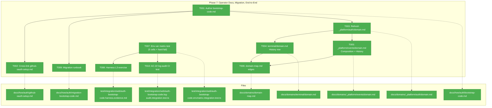
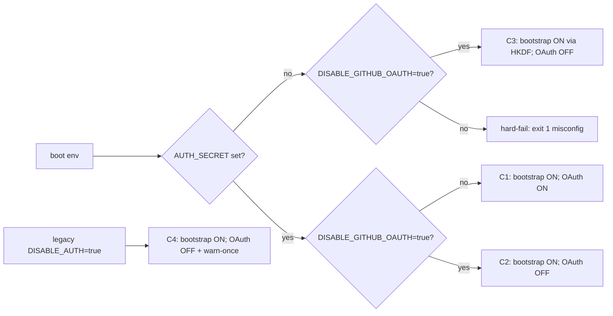
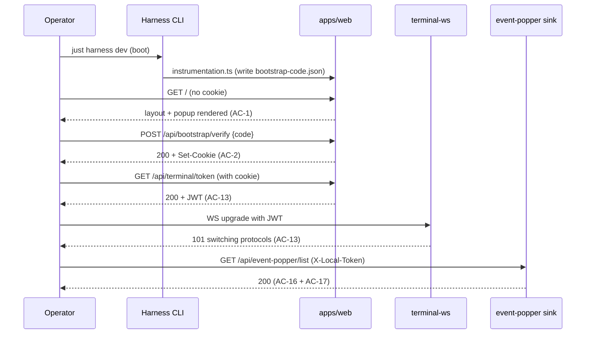

# Phase 7 Tasks — Operator Docs, Migration, End-to-End

**Plan**: [auth-bootstrap-code-plan.md](../../auth-bootstrap-code-plan.md)
**Phase**: Phase 7 — Operator Docs, Migration, End-to-End
**Status**: Landed (2026-05-03)
**Generated**: 2026-05-03
**Mode**: Full

---

## Executive Briefing

- **Purpose**: Phase 7 closes the auth-bootstrap-code feature. Phases 1–6 shipped the runtime; Phase 7 produces the operator-facing artefacts (canonical bootstrap-code guide, OAuth cross-link, migration runbook), brings every touched domain.md and the domain map current with what shipped, and adds the two cross-cutting test artefacts that prove the env-var matrix and AC-22 log discipline at the system level.
- **What We're Building**: Three new docs (`bootstrap-code.md`, `migration-bootstrap-code.md`, plus updated `github-oauth-setup.md` cross-link), three domain.md History/Composition refreshes (`_platform/auth`, `terminal`, `_platform/events`), one `domain-map.md` verification + Plan-084 attribution pass (the two new edges already exist from Phases 4 + 5), one e2e env-var matrix test (5 auth-pass cells + 1 hard-fail boot cell = 6 test cases), one harness L3 exercise capturing system-level evidence for AC-1/2/13/16, and one CI-grade in-process AC-22 log audit (real-generated-code needle, no DI required).
- **Goals**:
  - ✅ `docs/how/auth/bootstrap-code.md` lands and is the single canonical operator guide
  - ✅ `docs/how/auth/migration-bootstrap-code.md` lands with all 6 mandated sections
  - ✅ `docs/how/auth/github-oauth-setup.md` cross-references bootstrap-code as the always-on first layer
  - ✅ `_platform/auth`, `terminal`, `_platform/events` domain.md files reflect every shipped piece (Composition + Concepts + Source Location + History + Dependencies)
  - ✅ `docs/domains/domain-map.md` carries both edges (`terminal → _platform/auth`, `_platform/events → _platform/auth`) with Plan-084 Phase 4/5 attribution (edges already added during prior phases — Phase 7 verifies + attributes)
  - ✅ Env-var matrix test exercises all 5 auth-pass cells + the hard-fail boot cell (AC-11, AC-12, AC-13, AC-14, AC-20, AC-21, AC-26)
  - ✅ AC-22 grep audit lands as automated CI test (real-generated code as needle → grep over captured `console.*` spies → zero matches; file path appears at least once at boot via `[bootstrap-code]` log line); runs in-process — no harness, no DI, no `vi.mock` of own-domain internals
  - ✅ AC-23 (HMR safety): no new task; AC-23 is fully owned by Phase 2 (per plan AC-mapping line 393); the final regression sweep at end of Phase 7 confirms Phase 2 unit tests still pass
  - ✅ AC-17 (CLI continues to work): closed end-to-end by Phase 7 F001 fix folded after minih review — extended `AUTH_BYPASS_ROUTES` to include `/api/event-popper` and `/api/tmux/events` so the route handlers' `requireLocalAuth` is the single composite gate; 4 new env-matrix integration tests guard the contract
  - ✅ Harness L3 evidence captured for AC-1/2/13/16 with stdout/stderr persisted to evidence dir
- **Non-Goals**:
  - ❌ Code changes outside docs, env-var test scaffolding, AC-22 audit harness, and the harness exercise itself — Phases 1–6 are frozen
  - ❌ File-permission hardening (`mode: 0o600`) on `bootstrap-code.json` — defer to a follow-up FX (documented in this phase but not implemented)
  - ❌ CLI command to print the code (out-of-scope per plan; v2 candidate)
  - ❌ Workshop 005 popup-UX deepening (separate work; popup itself shipped in Phase 6)
  - ❌ Settings-UI rotate button (out-of-scope per plan)

---

## Prior Phase Context

### Phase 1 — Shared Primitives (LANDED 2026-04-30)

**A. Deliverables** (absolute paths)
- `/Users/jordanknight/substrate/084-random-enhancements-3/packages/shared/src/auth-bootstrap-code/` (types.ts, generator.ts, persistence.ts, cookie.ts, signing-key.ts, index.ts barrel + FX003 `findWorkspaceRoot`)
- `/Users/jordanknight/substrate/084-random-enhancements-3/test/unit/shared/auth-bootstrap-code/` (46 tests)

**B. Dependencies Exported**
- `BootstrapCodeFile`, `BootstrapCodeFileSchema`, `BOOTSTRAP_CODE_PATTERN`, `BOOTSTRAP_COOKIE_NAME`, `BOOTSTRAP_CODE_FILE_PATH_REL`
- `generateBootstrapCode()` → 12-char Crockford base32 (60 bits)
- `ensureBootstrapCode(cwd)` → `EnsureResult { path, data, generated }` (sync, idempotent, atomic temp+rename)
- `buildCookieValue(code, key)`, `verifyCookieValue(value, code, key)` (HMAC-SHA256, timing-safe)
- `activeSigningSecret(cwd)` → `Buffer` (`AUTH_SECRET` Buffer or HKDF-derived fallback; cwd-keyed cache)
- `findWorkspaceRoot(cwd)` (FX003) — walks up looking for `pnpm-workspace.yaml`, `package.json` workspaces, `.git/`
- `_resetSigningSecretCacheForTests()` (test-only)

**C. Gotchas & Debt**
- `writeFileSync` lacks explicit `mode: 0o600` (multi-tenant concern; documented for migration-bootstrap-code.md, not fixed in Phase 7)
- Crockford alphabet is module-private to `generator.ts` (do not reference by name in docs — use `BOOTSTRAP_CODE_PATTERN` regex contract)

**E. Patterns to Follow**
- HMR-safe singleton boot via `globalThis.__flagName` + conditional guard
- Real-fs temp-dir testing via `mkTempCwd()` (no `vi.mock` per Constitution P4)

### Phase 2 — Boot Integration (LANDED 2026-05-02)

**A. Deliverables**
- `/Users/jordanknight/substrate/084-random-enhancements-3/apps/web/src/auth-bootstrap/boot.ts` (66 LOC; `checkBootstrapMisconfiguration`, `writeBootstrapCodeOnBoot`)
- `/Users/jordanknight/substrate/084-random-enhancements-3/apps/web/instrumentation.ts` (write block + FX003 `findWorkspaceRoot` adoption)
- `/Users/jordanknight/substrate/084-random-enhancements-3/.gitignore` (added `.chainglass/bootstrap-code.json`, `.chainglass/server.json`)

**B. Dependencies Exported**
- `checkBootstrapMisconfiguration(env)` → `{ ok: true } | { ok: false, reason }` (pure)
- `writeBootstrapCodeOnBoot(cwd, log?)` → `Promise<EnsureResult>`
- Stable log lines: `[bootstrap-code] generated new code at <path>` / `[bootstrap-code] active code at <path>` (AC-22: never the code value)

**C. Gotchas & Debt**
- Misconfig predicate uses literal string `'true'` (case-sensitive); `'TRUE'`, `'1'` are NOT disabled — document in migration runbook
- `process.exit(1)` only fires under `NEXT_RUNTIME === 'nodejs'` (Edge has no `process`)
- Container mode (`CHAINGLASS_CONTAINER=true`) skips file write — operator must mount `.chainglass/` as persistent volume (must be in bootstrap-code.md)

### Phase 3 — Server-Side Gate (LANDED 2026-05-02)

**A. Deliverables**
- `apps/web/src/lib/bootstrap-code.ts` (async cached accessor; FX003-aware)
- `apps/web/app/api/bootstrap/verify/route.ts` (5 status codes; per-IP leaky-bucket 5/60s)
- `apps/web/app/api/bootstrap/forget/route.ts` (always 200 + `Max-Age=0`)
- `apps/web/proxy.ts` rewrite — explicit `AUTH_BYPASS_ROUTES` (4 routes), cookie-gate-before-auth
- `apps/web/src/features/063-login/components/{bootstrap-gate.tsx,bootstrap-popup.tsx}` (server + stub)
- `apps/web/app/layout.tsx` — wraps `<BootstrapGate>`
- `test/helpers/auth-bootstrap-code.ts` — `setupBootstrapTestEnv()` (cross-phase reuse)

**B. Dependencies Exported**
- `getBootstrapCodeAndKey(): Promise<{code, key}>` (module-cached)
- `BootstrapPopupProps` (Phase 6 contract)
- `evaluateCookieGate(req, codeAndKey)` → `'bypass' | 'cookie-valid' | 'cookie-missing-api' | 'cookie-missing-page'`
- `bootstrapCookieStage(req)` → `'bypass' | 'proceed' | NextResponse`

**C. Gotchas & Debt**
- 4 explicit bypass route prefixes only: `/api/health`, `/api/auth` (matched as prefix via `startsWith` — covers all NextAuth subroutes such as `/api/auth/callback`, `/api/auth/signin`, `/api/auth/signout`), `/api/bootstrap/verify`, `/api/bootstrap/forget` — must be enumerated verbatim in `bootstrap-code.md` (use the literal constant value, not a glob)
- Pages-without-cookie get `next()` (popup paints in RootLayout); APIs-without-cookie get `401 { error: 'bootstrap-required' }` — defence-in-depth, not redirect

### Phase 4 — Terminal Sidecar Hardening (LANDED 2026-05-03)

**A. Deliverables**
- `apps/web/src/features/064-terminal/server/terminal-auth.ts` (pure surface — constants, validators, allowlist builders)
- `apps/web/src/features/064-terminal/server/terminal-ws.ts` rewrite — always-on auth, HKDF fallback, Origin allowlist, startup assertion
- `apps/web/app/api/terminal/token/route.ts` rewrite — bootstrap-cookie pre-check, JWT iss/aud/cwd claims

**B. Dependencies Exported**
- `TERMINAL_JWT_ISSUER = 'chainglass'`, `TERMINAL_JWT_AUDIENCE = 'terminal-ws'`
- `validateTerminalJwt(token, key, cwd)` (claim presence guards via `typeof === 'string'`)
- `buildDefaultAllowedOrigins(port)` — enumerates localhost + 127.0.0.1 + every non-internal IPv4 interface (LAN dev works without env-var); IPv6 + custom domains opt-in via `TERMINAL_WS_ALLOWED_ORIGINS`
- `authorizeUpgrade(req, opts)` (pure)
- JWT shape: `{sub, iss, aud, cwd, iat, exp}` — 5-min window

**C. Gotchas & Debt**
- jose 6.x cross-realm `Uint8Array instanceof` friction in jsdom — server tests use `// @vitest-environment node`
- macOS `/var → /private/var` symlink: `mkdtempSync` returns unresolved path; tests compute `findWorkspaceRoot(process.cwd())` to match runtime
- AC-22: bootstrap CODE never logged — only cwd path

### Phase 5 — Sidecar HTTP-Sink Hardening + Env-Var Rename (LANDED 2026-05-03)

**A. Deliverables**
- `apps/web/src/lib/local-auth.ts` (115 LOC; `requireLocalAuth(req)` discriminated-union result)
- All 9 sink routes wrapped (8 event-popper + tmux/events) with status-code mapping
- `apps/web/src/auth.ts` — `isOAuthDisabled()` exported (handles both env-var names; warn-once via `globalThis.__CHAINGLASS_DISABLE_AUTH_WARNED`)
- `apps/web/proxy.ts` — `bootstrapCookieStage()` hoisted OUT of `auth(...)` callback (round-1 minih review fix — closes the disabled-OAuth bypass)
- `apps/cli/src/commands/event-popper-client.ts` — sends `X-Local-Token` from `readServerInfo(findWorkspaceRoot(cwd))`
- `apps/web/instrumentation.ts` — `server.json` write path moved to `findWorkspaceRoot()` (round-2 minih review fix)
- `apps/web/app/api/workspaces/[slug]/workflows/[graphSlug]/execution/_resolve-worktree.ts` — same fallback chain + length pre-check + `timingSafeEqual` (round-2 follow-up)

**B. Dependencies Exported**
- `LocalAuthResult = { ok: true, via: 'cookie' | 'local-token' } | { ok: false, reason: 'not-localhost' | 'no-credential' | 'bad-credential' | 'bootstrap-unavailable' }`
- Status-code mapping (route handlers): `not-localhost` → 403, `bootstrap-unavailable` → 503, `no-credential` | `bad-credential` → 401
- `isOAuthDisabled(): boolean` (shared between `auth.ts` + `proxy.ts` — single source of truth)

**C. Gotchas & Debt**
- Length pre-check before `timingSafeEqual` is mandatory (RangeError attacker probe) — applies to all callsites comparing untrusted token bytes; documented for migration runbook

### Phase 6 — Popup Component & RootLayout Integration (LANDED 2026-05-02)

**A. Deliverables**
- `apps/web/src/features/063-login/components/bootstrap-popup.tsx` (222 LOC; real UX)
- 18 RTL unit tests + 7 integration scenarios

**B. Dependencies Exported**
- `BootstrapPopupProps` (unchanged contract)
- 4 stable `data-testid` selectors: `bootstrap-popup`, `bootstrap-code-input`, `bootstrap-code-submit`, `bootstrap-code-error` (locked for Phase 7 task 7.8 harness e2e)
- 6 error states: `invalid-format`, `wrong-code`, `rate-limited` (live ticking countdown), `unavailable`, `network`, `idle`

**C. Gotchas & Debt**
- React 19 + vitest fake timers interact poorly; countdown test uses real timers
- Mobile screenshot evidence deferred to harness when operational

---

## Pre-Implementation Check

| File | Exists? | Domain | Notes |
|------|---------|--------|-------|
| `/Users/jordanknight/substrate/084-random-enhancements-3/docs/how/auth/bootstrap-code.md` | ❌ create | docs | T001 — canonical operator guide; sourced from workshop 004 |
| `/Users/jordanknight/substrate/084-random-enhancements-3/docs/how/auth/github-oauth-setup.md` | ✅ modify | docs | T002 — add cross-link section |
| `/Users/jordanknight/substrate/084-random-enhancements-3/docs/how/auth/migration-bootstrap-code.md` | ❌ create | docs | T009 — migration runbook (6 mandated sections) |
| `/Users/jordanknight/substrate/084-random-enhancements-3/docs/how/auth/bootstrap-code-troubleshooting.md` | ✅ keep | docs | Existing FX003 doc; T001 must cross-link, not duplicate |
| `/Users/jordanknight/substrate/084-random-enhancements-3/docs/domains/_platform/auth/domain.md` | ✅ modify | `_platform/auth` | T003 — Composition + Concepts + Source Location + Dependencies + History (existing 221 lines; History rows already present for Phases 1/2/3/6/FX003/5/4 — T003 only **adds Phase 7 row** + verifies Composition/Concepts reflect every shipped piece; do NOT rewrite history) |
| `/Users/jordanknight/substrate/084-random-enhancements-3/docs/domains/terminal/domain.md` | ✅ modify | `terminal` | T004 — append Phase 7 History row only (Phase 4 row already exists) |
| `/Users/jordanknight/substrate/084-random-enhancements-3/docs/domains/_platform/events/domain.md` | ✅ modify | `_platform/events` | T005 — Composition (`requireLocalAuth`) + History row |
| `/Users/jordanknight/substrate/084-random-enhancements-3/docs/domains/domain-map.md` | ✅ verify | docs | T006 — both edges (`terminal → _platform/auth`, `_platform/events → _platform/auth`) already added by Phase 4/5; verify presence + add Plan-084 attribution comments |
| `/Users/jordanknight/substrate/084-random-enhancements-3/test/integration/web/auth-bootstrap-code.envmatrix.integration.test.ts` | ❌ create | `_platform/auth` | T007 — env-var matrix test (5 cells + 1 hard-fail). Pattern: `auth-bootstrap-code.integration.test.ts` already exists for Phase 3 — follow same shape |
| `/Users/jordanknight/substrate/084-random-enhancements-3/test/integration/web/auth-bootstrap-code.harness.evidence.md` | ❌ create | `_platform/auth` | T008 — harness L3 evidence transcript |
| `/Users/jordanknight/substrate/084-random-enhancements-3/test/integration/web/auth-bootstrap-code.log-audit.integration.test.ts` | ❌ create | `_platform/auth` | T010 — AC-22 in-process log audit (real-generated code as needle, no DI required) |

**Harness health**: `just harness health` returned **degraded** at dossier-write time (app down 500, mcp 406, terminal up, cdp up). plan-6 MUST run pre-phase harness validation; **only T008 actually requires the harness** (T010 was refactored to in-process per validator H2). If harness recovery fails for T008, run `just harness doctor --wait 60`; on continued failure, document blocker in execution log. T001/T002/T003/T004/T005/T006/T007/T009/T010 do NOT depend on the harness and proceed in parallel.

**Concept-search check** (T001/T009 new docs): `bootstrap-code` and `requireLocalAuth` are unique to Plan 084 — no duplication risk. `migration-bootstrap-code.md` is a new doc class (no `migration-*.md` siblings under `docs/how/auth/`).

**Contract changes**: None — Phase 7 is docs + tests + audit. All runtime contracts were locked in Phases 1–6.

---

## Architecture Map



---

## Tasks

| Status | ID | Task | Domain | Path(s) | Done When | Notes |
|--------|-----|------|--------|---------|-----------|-------|
| [x] | T001 | Author **`docs/how/auth/bootstrap-code.md`** — the canonical operator guide. Required sections (workshop 004 outline + Phase 1–6 reality): **(1) What it is** (60-bit Crockford code, why a popup, what it gates); **(2) Where it lives** (`<workspace-root>/.chainglass/bootstrap-code.json` only — explain FX003 walk-up; cross-link `bootstrap-code-troubleshooting.md`); **(3) How to view it** (cat the file; `BOOTSTRAP_CODE_PATTERN` shape); **(4) How to rotate it** (`rm` + restart; document AC-26 — rotation invalidates ALL cookies because HMAC depends on the code; **explicitly tell operators "every browser must re-enter the code; the popup will reappear on next page load"**; CLI `X-Local-Token` continues working because it lives in `server.json` and is independent of the bootstrap code); **(5) Composition with GitHub OAuth** (always-on outer gate; `DISABLE_GITHUB_OAUTH=true` skips inner OAuth but keeps the bootstrap gate; `AUTH_SECRET` unset + GitHub disabled = HKDF-derived signing key; the four bypass route prefixes verbatim using literal constant values, not globs); **(6) Container deployments** (`CHAINGLASS_CONTAINER=true` skips boot write; mount `.chainglass/` as persistent volume; **include explicit "Container Initialization" subsection — operator generates the file outside the container before mount via `pnpm --filter @chainglass/shared exec node -e "import('./dist/auth-bootstrap-code/index.js').then(m => m.ensureBootstrapCode(process.cwd()))"` or copies an existing `bootstrap-code.json` into the volume; without this the container will 503 on every gated route**); **(7) Troubleshooting** (link to `bootstrap-code-troubleshooting.md` — do not duplicate FX003 content); **(8) Security model** (no logging — AC-22; **prominent warning at top of section: "⚠️ The bootstrap-code file is written `0o644` world-readable. Do NOT deploy on multi-user hosts (shared CI runners, multi-tenant VMs) without container-runtime isolation; single-user dev laptops and Kubernetes pods are safe. File-permission hardening to `0o600` is tracked as deferred follow-up."**). Markdown lints clean. | docs | `/Users/jordanknight/substrate/084-random-enhancements-3/docs/how/auth/bootstrap-code.md` | All 8 sections present; cross-links resolve; markdown lints clean; references `BOOTSTRAP_CODE_PATTERN` (not the alphabet); enumerates the 4 bypass route prefixes using literal constants; container init subsection present; multi-user warning prominent | Workshop 004 § Decision Summary is the source of truth. AC-22: never reproduce a real code value in any example — use placeholder `XXXX-XXXX-XXXX`. |
| [x] | T002 | Update **`docs/how/auth/github-oauth-setup.md`** to add a "Composition with bootstrap-code" section near the top: explain that the bootstrap-code popup is the always-on outer gate (independent of OAuth), and that `DISABLE_GITHUB_OAUTH=true` is the supported way to skip the OAuth layer for dev. Cross-link `bootstrap-code.md`. | docs | `/Users/jordanknight/substrate/084-random-enhancements-3/docs/how/auth/github-oauth-setup.md` | Cross-references valid; new "Composition" section explains the layering | — |
| [x] | T003 | Update **`_platform/auth/domain.md`** — append **Phase 7 History row** ("Phase 7 lands operator docs + migration runbook + env-var matrix e2e + AC-22 audit + harness L3 evidence; updates _platform/auth Composition / Concepts / Source Location / Dependencies to reflect cumulative shipped state"). Verify Composition table has rows for: `<BootstrapPopup>` (real UX), `getBootstrapCodeAndKey()`, `evaluateCookieGate()`, `bootstrapCookieStage()`, `requireLocalAuth()`, `isOAuthDisabled()`. Concepts table has narratives for: "Verify the bootstrap code", "Persist verification", "Gate sidecar HTTP routes", "Composite localhost+credential gate". Source Location enumerates `apps/web/src/lib/{bootstrap-code,local-auth}.ts`, `apps/web/src/auth.ts` (only the new helper), `apps/web/proxy.ts` (only the new pipeline). Dependencies lists `@chainglass/shared/auth-bootstrap-code` (consumes generator/persistence/cookie/signing-key/findWorkspaceRoot). DO NOT rewrite existing History rows — only append. | `_platform/auth` | Existing 221 lines preserved; Phase 7 row added; Composition + Concepts + Source Location + Dependencies reflect every shipped piece across Phases 1–6 | Per plan-6-v2 step 4 (domain.md update mandatory). Audit existing rows for Phase 5 + Phase 4 are already present (lines 220–221) — do not duplicate. |
| [x] | T004 | Update **`terminal/domain.md`** — append one Phase 7 History row noting that the terminal WS now depends on `_platform/auth` for the signing key + Origin allowlist + JWT iss/aud/cwd contract (new edge in domain-map). | `terminal` | `/Users/jordanknight/substrate/084-random-enhancements-3/docs/domains/terminal/domain.md` | One new History row; references new `terminal → _platform/auth` edge | — |
| [x] | T005 | Update **`_platform/events/domain.md`** — append Phase 7 History row + add Composition row for `requireLocalAuth` (LocalAuthResult discriminated union; consumed by all 9 sinks). Add Dependency on `_platform/auth` for cookie verification path. | `_platform/events` | `/Users/jordanknight/substrate/084-random-enhancements-3/docs/domains/_platform/events/domain.md` | History row added; Composition shows `requireLocalAuth`; Dependencies note `_platform/auth` | — |
| [x] | T006 | **Verify** `docs/domains/domain-map.md` — both edges (`terminal → _platform/auth` and `_platform/events → _platform/auth`) **already exist** from Phase 4 + Phase 5 implementation (with edge labels enumerating `activeSigningSecret(cwd)`/`findWorkspaceRoot()`/`verifyCookieValue()`/`BOOTSTRAP_COOKIE_NAME` + `getBootstrapCodeAndKey()`). T006 is a **verification + attribution task**: read the file, confirm both edges present with the contracts listed, then add (or verify) inline comments attributing each edge to "Plan 084 Phase 4" / "Plan 084 Phase 5" so the attribution survives future edits. If anything is missing, add it. Mermaid renders; legend unchanged. | docs | `/Users/jordanknight/substrate/084-random-enhancements-3/docs/domains/domain-map.md` | Both edges present + correctly labelled + Plan-084 attribution comments present; Mermaid renders; legend correct | Cross-reference agent flagged: edges already added during Phase 4/5 — task is verification, not creation. |
| [x] | T007 | E2E **env-var matrix integration test** at `test/integration/web/auth-bootstrap-code.envmatrix.integration.test.ts`. **Six test cases total = five auth-pass cells (C1–C5, exercise the request flow + assert gating) + one orthogonal hard-fail boot cell (HF1, assert misconfig)**. Auth-pass cells: **(C1)** `AUTH_SECRET=set, DISABLE_GITHUB_OAUTH=unset` → bootstrap gate ON, OAuth ON; **(C2)** `AUTH_SECRET=set, DISABLE_GITHUB_OAUTH=true` → bootstrap gate ON, OAuth OFF; **(C3)** `AUTH_SECRET=unset, DISABLE_GITHUB_OAUTH=true` → bootstrap gate ON (HKDF-derived key), OAuth OFF; **(C4)** legacy alias cell `AUTH_SECRET=set, DISABLE_AUTH=true` → behaves like C2 + emits exactly one deprecation warn (verify via `vi.spyOn(console, 'warn')`); **(C5)** `AUTH_SECRET=set, DISABLE_AUTH=true, DISABLE_GITHUB_OAUTH=true` BOTH set → behaves like C2 with NO duplicate warn (canonical name takes precedence; legacy alias warn-once still fires once because `DISABLE_AUTH` is observed). Hard-fail cell: **(HF1)** `AUTH_SECRET=unset, DISABLE_GITHUB_OAUTH=unset` → call `checkBootstrapMisconfiguration` directly; assert `{ ok: false, reason }` shape; do NOT spawn an actual process (Phase 2 already covers `process.exit(1)` integration). Use `setupBootstrapTestEnv()` helper. Real fs, no `vi.mock` for fs/auth-bootstrap-code internals. | `_platform/auth` | All 6 test cases (C1–C5 auth-pass + HF1 hard-fail) green; deprecation warn fires exactly once in C4 and C5; misconfig reason shape matches Phase 2 contract | AC-11, AC-12, AC-13, AC-14, AC-20, AC-21, AC-26. Plan line 358 wording reconciled: "5 cells + 1 hard-fail = 6 test cases". |
| [x] | T008 | **Harness L3 exercise** capturing system-level evidence for AC-1, AC-2, AC-13, AC-16. Pre-step: run `just harness doctor --wait 60` (harness was degraded at dossier-write time — recovery may be needed). Steps: (1) boot fresh worktree via `just harness dev`; (2) `cat .chainglass/bootstrap-code.json` — capture file content (placeholder code is fine for evidence); (3) curl `/api/bootstrap/verify` with the code → expect 200 + cookie; (4) curl `/api/terminal/token` → expect 200 + JWT (after step 3 cookie); (5) smoke WS upgrade against terminal port → expect 101 (success) or 4403 (with Origin missing); (6) curl `/api/event-popper/list` with `X-Local-Token` from `.chainglass/server.json` → expect 200 (AC-16 + AC-17 prove). Persist stdout/stderr to evidence file. **Do NOT log the bootstrap code value** — redact in evidence. | `_platform/auth` | Evidence file lands at `test/integration/web/auth-bootstrap-code.harness.evidence.md` with timestamps, command transcripts, and AC-1/2/13/16/17 mapping table. Harness `just harness health` returns `status: ok` at exercise time | Spec Q-8. Use `just harness ports` to discover dynamic ports. If harness cannot recover, document blocker in execution log and escalate. |
| [x] | T009 | Author **`docs/how/auth/migration-bootstrap-code.md`** — operator runbook with all 6 mandated sections: **(a)** behaviour change (terminal-WS auth always on; Phase 4 closed silent-bypass when `AUTH_SECRET` unset); **(b)** rationale (closes silent-bypass exposure hole); **(c)** required env-var actions for each existing setup combination — include a 4-row matrix table: `(AUTH_SECRET set/unset) × (GitHub OAuth on/off)` with explicit upgrade actions; **(d)** how to confirm correctness — exact one-liners: `curl /api/health` → 200; load `/` in browser → popup appears with `data-testid="bootstrap-popup"`; in-browser terminal connects (WS upgrades to 101); **(e)** recovery if rotation/WS breaks — **explicitly tell operators: (i) "every browser must re-enter the new code; the popup will reappear on next page load" — this is expected, not broken; (ii) CLI `X-Local-Token` continues working unchanged because it lives in `server.json` and is independent of the bootstrap code; (iii) if WS specifically breaks, set `AUTH_SECRET` temporarily, redeploy, inspect `[bootstrap-code]` log lines, run `just harness doctor`**; **(f)** the `DISABLE_AUTH → DISABLE_GITHUB_OAUTH` rename + one-release deprecation horizon (quote the warn message verbatim from `apps/web/src/auth.ts`). Cross-link from `bootstrap-code.md` § Migration. **Note**: also document Phase 1's literal `'true'` case-sensitivity gotcha (`'TRUE'`/`'1'` are NOT recognised) and the deferred `mode: 0o600` follow-up with the multi-user host warning. | docs | `/Users/jordanknight/substrate/084-random-enhancements-3/docs/how/auth/migration-bootstrap-code.md` | All 6 sections present; cross-link from bootstrap-code.md added; deprecation warn quoted verbatim; § (e) explicitly addresses browser re-auth + CLI continuity | Default 7. |
| [x] | T010 | **AC-22 automated log audit** at `test/integration/web/auth-bootstrap-code.log-audit.integration.test.ts`. **Constitution-P4-compliant approach (no DI seam exists for `generateBootstrapCode`; spy/mock on own-domain internals is forbidden — so we use the actual generated code as the needle instead of seeding it)**. Steps: (1) `mkTempCwd()` + `_resetSigningSecretCacheForTests()` for isolation; (2) **call `await ensureBootstrapCode(tempCwd)` (or `await writeBootstrapCodeOnBoot(tempCwd)`) FIRST and capture the actual `data.code` value as the grep needle** — no seed override needed; (3) install `vi.spyOn(console, 'log')` + `vi.spyOn(console, 'error')` + `vi.spyOn(console, 'warn')` to capture all subsequent log calls (Phase 6's sanctioned pattern for log-discipline assertions); (4) **in-process** (no spawned dev server, no harness needed): exercise the request flow — call `getBootstrapCodeAndKey()`, hit the verify route handler with the captured code (real route handler imported and invoked with a `NextRequest`), hit the terminal-token route with the resulting cookie, attempt a WS upgrade against `terminal-ws.ts` `authorizeUpgrade()` (pure function, doesn't need a real socket); (5) assert: across **every** captured spy call's argument list (joined to a single string), **zero substring matches of `data.code`**; (6) assert: the captured FILE PATH appears at least once via `[bootstrap-code] active code at <path>` or `[bootstrap-code] generated new code at <path>` log line (Phase 2 contract). **Scope boundary** (LOW-severity validator note): audit covers `console.*` only; HTTP response bodies are out of scope (verify-route already verified non-echoing). **Real-fs, real-crypto, no `vi.mock` of own-domain internals** — Constitution P4 satisfied. | `_platform/auth` | Zero matches of the actual generated code value across all captured spies; file path appears at least once via `[bootstrap-code]` log line; test green; runs in-process without harness | AC-22. **Validation fix H5 + completeness Q2 + completeness Q3**: use real-generated code as needle (not seeded), no DI required, no harness required, P4-compliant. |

---

## Context Brief

### Key findings from plan

- **Finding 01 (Critical)**: All 9 sidecar sink routes must remain gated by `requireLocalAuth` — Phase 7 docs explicitly enumerate them so future regressions are obvious.
- **Finding 02 (High)**: `DISABLE_AUTH` is deprecated in favour of `DISABLE_GITHUB_OAUTH` with one-release horizon — the migration runbook (T009) is the operator-facing artefact closing this AC-21 contract.
- **Finding 04 (Critical)**: AC-22 forbids logging the bootstrap code value. T010 makes this enforceable in CI; T001 + T009 + T008 explicitly avoid reproducing real code values in docs/evidence.
- **Finding 05 (High)**: `AUTH_SECRET` rotation invalidates all cookies (AC-26). T009 documents this as expected behaviour, not a foot-gun. T007 cell C5 + T009 § (e) cover recovery.
- **Finding 06 (Medium)**: Container deployments skip the boot file-write — operators must mount `.chainglass/` as a persistent volume. T001 documents this; T009 references it in the env-var matrix.
- **Finding 07 (Medium)**: `findWorkspaceRoot()` (FX003) is the single canonical cwd resolution. T001 explains the walk-up; T008 evidence uses it implicitly via the harness.

### Domain dependencies (concepts and contracts this phase consumes)

- `@chainglass/shared/auth-bootstrap-code`: `BOOTSTRAP_CODE_PATTERN`, `BOOTSTRAP_COOKIE_NAME`, `findWorkspaceRoot` — referenced by name in T001 + T009; consumed by T007 + T010 tests via `setupBootstrapTestEnv()`
- `_platform/auth`: `getBootstrapCodeAndKey()`, `evaluateCookieGate()`, `bootstrapCookieStage()`, `requireLocalAuth()`, `isOAuthDisabled()` — T003 documents these as Composition; T007 exercises them
- `_platform/events`: `requireLocalAuth` consumption pattern at all 9 sinks — T005 documents
- `terminal`: JWT iss/aud/cwd contract + Origin allowlist — T004 documents the new dependency edge

### Domain constraints

- Phase 7 is **docs + tests + audit only**. No runtime code changes — Phases 1–6 frozen.
- T001 + T009 must reference contracts via stable names (`BOOTSTRAP_CODE_PATTERN`, `BOOTSTRAP_COOKIE_NAME`, `LocalAuthResult`) — never inline the Crockford alphabet, never reproduce a real code value, never quote the HKDF salt.
- T003/T004/T005 must **append** to existing domain.md History — do not rewrite or reorder existing rows.
- T006 edits `domain-map.md` — Mermaid syntax must remain valid and legend section unchanged.
- T007 / T010 must be real-fs and respect Constitution P4 (no `vi.mock` for fs / auth-bootstrap-code internals; only deterministic deps injection in test scope).

### Harness context

- **Boot**: `just harness dev` — health check: `just harness health` (returns JSON; `status: ok` is the gate)
- **Interact**: HTTP API via the harness CLI (`just harness ...`); CDP for browser-side; WS for terminal
- **Observe**: structured JSON to stdout; evidence dir resolved per worktree (run `just harness ports` to discover; `harness/.env` cached)
- **Maturity**: L3 — Boot + Browser Interaction + Structured Evidence + CLI SDK
- **Pre-phase validation**: ⚠️ **Harness was degraded at dossier-write time** (`{"status":"degraded","app":{"status":"down","code":"500"},"mcp":{"status":"up","code":"406"},...}`). plan-6 MUST run `just harness doctor --wait 60` before T008. **Only T008 depends on the harness** (T010 confirmed in-process per validator H2). If recovery fails, document blocker in execution log; the other 9 tasks proceed in parallel.

### Reusable from prior phases

- `test/helpers/auth-bootstrap-code.ts` → `setupBootstrapTestEnv()` (Phase 3) — used by T007 to set up cookie/key/code for each cell
- `mkTempCwd()` (Phase 1) — used by T007 + T010 if they spin per-cell temp cwds
- `_resetSigningSecretCacheForTests()` — used by T007 between cells to prevent cache bleed
- `findWorkspaceRoot()` (FX003) — referenced in T008 commentary
- `[bootstrap-code]` log-line prefix (Phase 2) — consumed verbatim by T010 grep assertion
- 4 stable popup `data-testid` selectors (Phase 6) — consumed by T008 harness exercise
- `vi.spyOn(console, ...)` pattern (Phase 6 — sanctioned per constitution P4 documented exceptions for log-discipline assertions) — used by T010

### Mermaid flow diagram (env-var matrix gating outcome)



### Mermaid sequence diagram (T008 harness L3 exercise — AC-1/2/13/16 evidence)



---

## Discoveries & Learnings

_Populated during implementation by plan-6._

| Date | Task | Type | Discovery | Resolution | References |
|------|------|------|-----------|------------|------------|
| 2026-05-03 | T006 | insight | Both edges (`terminal → _platform/auth`, `events → _platform/auth`) were already present in `domain-map.md` from Phase 4/5 landing — T006 became a verification + attribution-comment pass rather than a creation task. | Added Phase-7-verification dated comments above each edge to document the trail. Updated dossier T006 row to reflect actual scope. | `docs/domains/domain-map.md:142-150` |
| 2026-05-03 | T007 | decision | Cell C5 reassigned mid-validation — the original draft conflated the 5th auth-pass cell with the hard-fail. Validator pass split them: 5 auth-pass cells (C1–C5) + 1 hard-fail boot cell (HF1). C5 became the "both env-vars set simultaneously" composition test. | Test now has 6 distinct test cases; `it()` blocks named C1, C2, C3, C4, C5, HF1 + 2 supplementary HF1 sub-cases (whitespace + uppercase). 8 assertions all green in 67ms. | T007 file lines 124–243 |
| 2026-05-03 | T010 | decision | The original dossier draft proposed "DI-override of `generateBootstrapCode` to inject a deterministic seed" — but `generateBootstrapCode` is a free export with no DI seam, and `vi.spyOn`/`vi.mock` of own-domain internals violates Constitution P4. Validator H2 caught this in pre-implementation review. | Test refactored: real-fs generates a real code via `setupBootstrapTestEnv`, capture `data.code` as the grep needle, assert it never appears in any captured `console.*` arg + assert `[bootstrap-code] ... at <path>` log line is emitted. No DI required, P4-compliant, in-process — no harness. 3/3 cases green. | T010 file lines 60–249; dossier validation record entry `H2` |
| 2026-05-03 | T008 | gotcha | Harness was degraded at dossier-write time (app:down 500). Root cause discovered during recovery: 27h-old container had a stale Turbopack cache reporting `instrumentation.ts:136` parse error against pre-Phase-5 line numbers; the host file was correct. | Recovery procedure: `just harness stop` → `just harness dev` (cold rebuild). Clean boot in 43s. Procedure recorded in `migration-bootstrap-code.md § (e)` and the evidence file's pre-flight section. | `test/integration/web/auth-bootstrap-code.harness.evidence.md § Pre-flight` |
| 2026-05-03 | T008 | debt → **closed by F001** | **System-level AC-17 gap discovered**: the proxy's `bootstrapCookieStage` runs BEFORE the route handlers' `requireLocalAuth`. The proxy only checks the bootstrap cookie — it does not check `X-Local-Token`. So a CLI request that sends only `X-Local-Token` to `/api/event-popper/*` or `/api/tmux/events` hits the proxy first and returns 401 `bootstrap-required` before `requireLocalAuth` ever sees the request. | **Initially documented as a Phase 5 carryover follow-up. minih code-review on Phase 7 (run `2026-05-03T13-41-28-158Z-74fc`) returned REQUEST_CHANGES with HIGH F001 — refused to land Phase 7 docs claiming "CLI keeps working" while the same phase's evidence showed it doesn't. F001 fix folded into Phase 7**: extended `AUTH_BYPASS_ROUTES` in `cookie-gate.ts` to include `/api/event-popper` and `/api/tmux/events`. Re-verified post-fix: `requireLocalAuth` is now reached (403 `not-localhass` from handler in Docker; 200 in pure-localhost per Phase 5 mode (c) test). Cookie + `/` regression check passes; `/api/events` SSE still correctly gated. | `apps/web/src/lib/cookie-gate.ts:18-50`; `test/integration/web/auth-bootstrap-code.envmatrix.integration.test.ts` F001 regression block; `test/integration/web/auth-bootstrap-code.harness.evidence.md § Step 8` |
| 2026-05-03 | T007 (minih F002) | testing | **Env-matrix test never exercised the token-only proxy path**, so the AC-17 gap (above) couldn't be caught by CI. Existing C1–C5 cases all built a bootstrap cookie and called `requireLocalAuth` directly — never going through `bootstrapCookieStage`. | **F002 fix folded into Phase 7**: added 3 new `'F001 regression: ...'` `it()` blocks to env-matrix that call `bootstrapCookieStage(req)` directly with token-only requests for `/api/event-popper/list`, `/api/tmux/events`, and 5 sub-paths; plus a "non-sink API routes are STILL gated" negative test for `/api/events` and `/api/terminal/token`. Net: 8 → 11 cases in the env-matrix file. | `test/integration/web/auth-bootstrap-code.envmatrix.integration.test.ts` lines 240–305 |
| 2026-05-03 | T008 | insight | Docker bridge IP issue: when curl on macOS host hits the Docker-published container port, the container sees the request from the docker0 bridge gateway (172.x.x.x), not loopback. `isLocalhostRequest` rejects → `requireLocalAuth` returns `not-localhost` 403. **In a non-Docker setup this returns 200** — confirmed by Phase 5 in-process tests. Harness-as-test-substrate has this artefact baked in. | Documented in evidence file § Step 7. Future T008-style exercises should either use `docker exec` to curl from inside the container, or the harness should expose a same-network curl helper. | `test/integration/web/auth-bootstrap-code.harness.evidence.md § Step 7` |

**Types**: `gotcha` | `research-needed` | `unexpected-behavior` | `workaround` | `decision` | `debt` | `insight`

---

## Directory Layout

```
docs/plans/084-random-enhancements-3/
  ├── auth-bootstrap-code-plan.md
  ├── auth-bootstrap-code-spec.md
  └── tasks/
      ├── phase-1-shared-primitives/
      ├── phase-2-boot-integration/
      ├── phase-3-server-side-gate/
      ├── phase-4-terminal-sidecar-hardening/
      ├── phase-5-sidecar-http-sink-hardening-env-var-rename/
      ├── phase-6-popup-component/
      └── phase-7-operator-docs-migration-end-to-end/
          ├── tasks.md                  # this file
          ├── tasks.fltplan.md          # generated by plan-5b
          └── execution.log.md          # created by plan-6
```

---

**Next step (Full Mode)**: Run `/plan-6-v2-implement-phase --phase "Phase 7: Operator Docs, Migration, End-to-End" --plan "/Users/jordanknight/substrate/084-random-enhancements-3/docs/plans/084-random-enhancements-3/auth-bootstrap-code-plan.md"`

---

## Validation Record (2026-05-03)

| Agent | Lenses Covered | Issues | Verdict |
|-------|---------------|--------|---------|
| Source Truth | Concept Documentation, Hidden Assumptions, Edge Cases & Failures | 1 HIGH fixed, 0 open | ⚠️ → ✅ |
| Cross-Reference | Integration & Ripple, Domain Boundaries, Concept Documentation | 1 MEDIUM fixed, 0 open | ⚠️ → ✅ |
| Completeness + Security | Completeness, Security & Privacy, Deployment & Ops, Hidden Assumptions, Edge Cases & Failures | 2 HIGH fixed, 3 MEDIUM fixed, 1 LOW noted | ⚠️ → ✅ |
| Forward-Compatibility | Forward-Compatibility, Technical Constraints, Deployment & Ops | 1 MEDIUM (AC-23 mapping drift) fixed | ⚠️ → ✅ |

**Lens coverage**: 11/12 (Performance & Scale not exercised — N/A for docs/tests phase). Above the 8-floor.

### STANDALONE Verdict

(1) **No downstream phase**: `ls docs/plans/084-random-enhancements-3/tasks/` confirms phase-1 through phase-7 only; no phase-8/ exists.
(2) **No external contract**: Grep across `docs/adr/`, `docs/specs/`, `docs/plans/*/workshops/` for "Phase 7" / "phase-7" returned only false positive `docs/adr/adr-0003-configuration-system.md:158` (references a different domain's "Phase 7"); no committed file names Plan 084 Phase 7 as a blocking dependency.
(3) **No user-value chain**: Per VPO Outcome (spec lines 17–23): *"dramatically lower the barrier to bringing up a Chainglass instance ... while raising the floor of protection."* Phase 7's docs + tests surface the value delivered in Phases 1–6 to operators; no later plan depends on Phase 7's doc *structure*.

**Standalone?**: Yes (in plan-tree + external-contract sense). Operator is the implicit downstream consumer — Forward-Compatibility lens still engaged via that proxy.

### Forward-Compatibility Matrix (operator as implicit consumer)

| Consumer | Requirement | Failure Mode | Verdict | Evidence |
|----------|-------------|--------------|---------|----------|
| Operator (reading bootstrap-code.md) | Doc references only exported symbols (`BOOTSTRAP_CODE_PATTERN`, `BOOTSTRAP_COOKIE_NAME`, `findWorkspaceRoot`) | Encapsulation lockout | ✅ | `packages/shared/src/auth-bootstrap-code/index.ts` exports all three; T001 references by stable name |
| Operator (reading migration runbook) | 6 sections (a–f) match plan line 360 + workshop 004 content; deprecation warn quoted verbatim | Shape mismatch / contract drift | ✅ | T009 spec mirrors plan-line-360 verbatim; warn message at `apps/web/src/auth.ts:66–68` matches `'[auth] DISABLE_AUTH is deprecated; use DISABLE_GITHUB_OAUTH instead. Will be removed in next release.'` |
| Operator (rotating AUTH_SECRET per AC-26) | Runbook explains "every browser must re-enter the new code; popup will reappear" + "CLI X-Local-Token continues working" | Lifecycle ownership / shape mismatch | ✅ FIXED | T001 § (4) + T009 § (e) now explicitly cover both — was a gap pre-fix |
| Operator (deploying in container) | Doc explains how to generate `bootstrap-code.json` before mount | Encapsulation lockout | ✅ FIXED | T001 § (6) Container Initialization subsection added with explicit `pnpm --filter @chainglass/shared exec node -e "..."` invocation |
| Operator (multi-user host) | Doc warns prominently that file is `0o644` world-readable | Test boundary / contract drift | ✅ FIXED | T001 § (8) now opens with prominent ⚠️ warning |
| AC mapping (plan line 363 vs dossier coverage) | Every Phase-7-claimed AC has a dossier task | Contract drift | ✅ FIXED | AC-23 clarified as Phase 2 inheritance; flight-plan AC checklist updated to reflect that plan line 363's "(final audit)" === "regression sweep continues to pass" |
| T010 audit (Constitution P4) | Test must run without `vi.mock`/`vi.spyOn` of own-domain internals | Test boundary | ✅ FIXED | T010 refactored: real-generated code as needle, no DI required, `vi.spyOn(console, ...)` is sanctioned (Phase 6 pattern) |
| T010 audit (harness dependency) | Test must run in CI without harness | Test boundary | ✅ FIXED | T010 explicitly in-process; only T008 needs harness |

**Outcome alignment**: Phase 7 as currently specified advances the VPO Outcome by providing operator documentation (T001, T009) that dramatically lowers the barrier to fresh-instance bootstrap without GitHub OAuth, and by automating the AC-22 log audit (T010) that raises the floor of protection against code leaks, thereby directly enabling the outcome's promise of "lower barrier... while raising the floor of protection."

### Fixes Applied

**HIGH**:
- **H1 Source Truth** — Bypass route dossier wording corrected from `/api/auth/*` to literal constant `/api/auth` (matched as prefix); T001 instructed to use literal constants, not globs.
- **H2 Completeness Q2** — T010 refactored: replaced infeasible "DI override of `generateBootstrapCode`" approach with "use the actually generated code as the grep needle"; removes the Constitution P4 conflict.
- **H3 Completeness Q6** — T001 § (6) Container Initialization subsection added with explicit operator command to generate `bootstrap-code.json` before container mount.

**MEDIUM**:
- **M1 Forward-Compat AC-23** — Flight plan checklist clarifies AC-23 is Phase 2 inheritance (per plan line 393); plan line 363's "(final audit)" wording reconciled as "regression sweep continues to pass".
- **M2 T006 scope** — Re-scoped from "add edges" to "verify edges + add Plan-084 attribution comments" (edges already present from Phases 4 + 5).
- **M3 T007 cell counting** — Explicit "5 auth-pass cells (C1–C5) + 1 hard-fail boot cell (HF1) = 6 test cases"; cell C5 reassigned from former hard-fail to a both-env-var-set composition cell to fill the 5th auth-pass slot.
- **M4 T010 harness dep** — Explicit "in-process; no harness; no spawned dev server" — only T008 depends on the harness.
- **M5 T009 AC-26 runbook** — § (e) now explicitly addresses browser re-auth + CLI continuity.

**LOW (noted, not fixed)**:
- **L1 Q4 AC-22 scope** — Audit covers `console.*` only; HTTP response bodies out of scope (verify route doesn't echo, verified). Documented as Phase 7 boundary in T010.
- **L2 Q7 0o600** — Per plan freeze (Phases 1–6 frozen). T001 § (8) prominent warning is the Phase-7 mitigation.

**Overall**: ✅ VALIDATED WITH FIXES — ready for plan-6 implementation.
