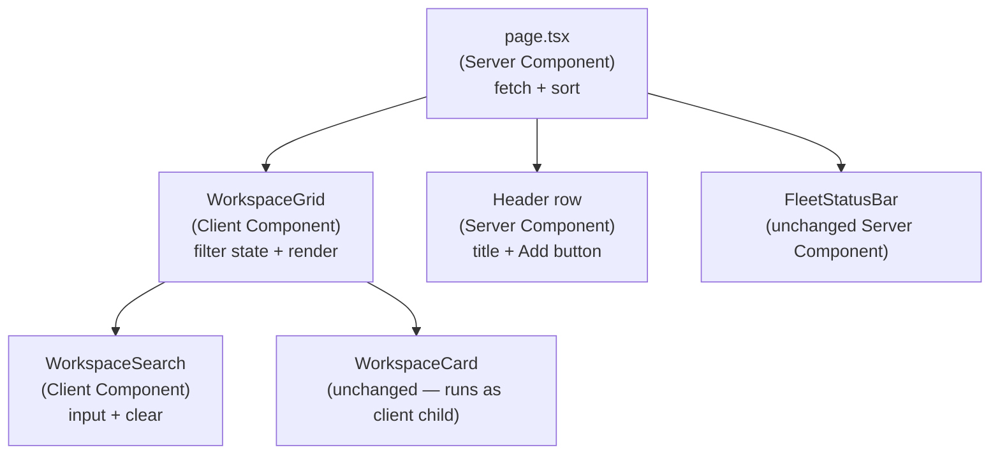

# Workshop: "Your Workspaces" Page — Search Filter + Header Layout

**Type**: UX Flow + Component Design
**Plan**: 084-random-enhancements-3
**Spec**: _(not yet authored — workshop precedes spec for this enhancement)_
**Created**: 2026-04-26
**Status**: Draft

**Related Documents**:
- Current page: [`apps/web/app/(dashboard)/page.tsx`](../../../../apps/web/app/(dashboard)/page.tsx)
- Card component: [`apps/web/src/features/041-file-browser/components/workspace-card.tsx`](../../../../apps/web/src/features/041-file-browser/components/workspace-card.tsx)
- Fleet status bar: [`apps/web/src/features/041-file-browser/components/fleet-status-bar.tsx`](../../../../apps/web/src/features/041-file-browser/components/fleet-status-bar.tsx)
- Sibling page (admin list): [`apps/web/app/(dashboard)/workspaces/page.tsx`](../../../../apps/web/app/(dashboard)/workspaces/page.tsx)
- Reference pattern (settings search): [`apps/web/src/features/settings/components/settings-search.tsx`](../../../../apps/web/src/features/settings/components/settings-search.tsx)
- Reference pattern (worktree picker filter): [`apps/web/src/features/041-file-browser/components/worktree-picker.tsx`](../../../../apps/web/src/features/041-file-browser/components/worktree-picker.tsx)
- UX vision: [041-file-browser/workshops/ux-vision-workspace-experience.md §2](../../../041-file-browser/workshops/ux-vision-workspace-experience.md)

**Domain Context**:
- **Primary Domain**: `041-file-browser` (workspace landing surface)
- **Related Domains**: `014-workspaces` (data model: `IWorkspaceService`, preferences)

---

## Purpose

The landing page (`/`) renders every workspace as a card in a responsive grid. Two friction points have appeared as the page fills up:

1. **No way to filter** — finding one workspace among 15+ requires eyeballing emoji/colour or `Cmd+F` in the browser.
2. **"Add workspace" sits at the bottom of the grid** — once cards wrap to multiple rows, the entry point disappears below the fold.

This workshop specifies a small, surgical UI change:

- Add a **search filter** (client-side, name + path + branches) above the grid.
- Promote the **"Add workspace" affordance** out of the grid and into the header row, next to the title.

Everything else (cards, fleet status bar, starred-first sort, server-side data load) stays as-is.

## Key Questions Addressed

- Where exactly does the search input sit, and what does it filter against?
- How does "Add workspace" change shape — full button vs. icon-only?
- Does this stay a Server Component, or does the page need to become a Client Component?
- What happens when the filter has zero matches?
- What about keyboard shortcuts (`/` to focus, `Esc` to clear)?
- How do starred items behave when filtered?

---

## Current State

### Layout (today)

```
┌──────────────────────────────────────────────────────────────────┐
│  Your Workspaces                                                 │
├──────────────────────────────────────────────────────────────────┤
│  [ FleetStatusBar — hidden when idle ]                           │
├──────────────────────────────────────────────────────────────────┤
│  ┌────────────┐  ┌────────────┐  ┌────────────┐                  │
│  │ ⭐ chainglass│  │ ⭐ fastcode │  │   fs2      │                  │
│  │ main · 084 │  │ main       │  │ main · dev │                  │
│  └────────────┘  └────────────┘  └────────────┘                  │
│  ┌────────────┐  ┌────────────┐  ┌────────────┐                  │
│  │   nextjs   │  │   redux    │  │   sandbox  │                  │
│  └────────────┘  └────────────┘  └────────────┘                  │
│  ┌────────────┐  ┌────────────┐  ┌────────────┐                  │
│  │   demo-1   │  │   demo-2   │  │   demo-3   │                  │
│  └────────────┘  └────────────┘  └────────────┘                  │
│  ┌─────────────────────────────────┐                              │
│  │ + Add workspace  (dashed card)  │  ← below the fold once       │
│  └─────────────────────────────────┘    >9 workspaces             │
└──────────────────────────────────────────────────────────────────┘
```

### Code shape (today)

`apps/web/app/(dashboard)/page.tsx` — async **Server Component**:

```tsx
export default async function HomePage() {
  const workspaces = await workspaceService.list();
  const enriched = await Promise.all(/* fetch worktree counts/names */);
  const sorted = [...enriched].sort(/* starred first, then sortOrder */);

  return (
    <div className="mx-auto max-w-5xl space-y-6 p-6">
      <div>
        <h1 className="text-2xl font-bold">Your Workspaces</h1>
      </div>
      <FleetStatusBar />
      <div className="grid gap-4 sm:grid-cols-2 lg:grid-cols-3">
        {sorted.map((ws) => <WorkspaceCard key={ws.slug} {...ws} />)}
        <Link href="/workspaces" className="…dashed border…">
          <Plus /> Add workspace
        </Link>
      </div>
    </div>
  );
}
```

Two facts that constrain the design:

1. The page is a **Server Component**. `WorkspaceCard` is also a Server Component (uses `<form action>` for star toggling).
2. The card grid has both real cards **and** the "Add workspace" tile mixed together — the dashed tile is just the last grid child.

---

## Proposed Layout

### Header row (new)

```
┌──────────────────────────────────────────────────────────────────┐
│  Your Workspaces                          [ + Add workspace ]    │
│  ┌──────────────────────────────────────────────────────────┐    │
│  │ 🔍  Filter workspaces…                            12/14 ✕ │    │
│  └──────────────────────────────────────────────────────────┘    │
├──────────────────────────────────────────────────────────────────┤
│  [ FleetStatusBar — unchanged ]                                  │
├──────────────────────────────────────────────────────────────────┤
│  ┌────────────┐  ┌────────────┐  ┌────────────┐                  │
│  │ ⭐ chainglass│  │ ⭐ fastcode │  │   fs2      │                  │
│  └────────────┘  └────────────┘  └────────────┘                  │
│  …                                                               │
└──────────────────────────────────────────────────────────────────┘
```

Three changes, nothing else:

1. **Header row** becomes a flex row: `<h1>` on the left, `Add workspace` button on the right.
2. **Search input** is a new row directly below the header.
3. The dashed `"+ Add workspace"` tile inside the grid is **removed** (the header button replaces it).

### Why this placement (rationale)

| Decision | Rationale |
|---|---|
| Button next to `<h1>` (top-right) | Most-used action, never below fold. Mirrors `dashboard-sidebar` "new tab" pattern. |
| Search below header, full-width | Matches `SettingsSearch` placement; gives input full visual weight; below the title where users look first. |
| Single search row (not in header) | Header on mobile is too cramped to share with both title + button + search. |
| Remove dashed tile from grid | Avoids two paths to the same action; simplifies the grid to "real workspaces only". |
| Keep FleetStatusBar between filter and grid | Status bar is a global signal, not workspace-specific; logically belongs above the listing it summarises. |

### Empty / zero-match states

```
filter empty, 0 workspaces:                filter active, 0 matches:
┌────────────────────────────────┐         ┌────────────────────────────────┐
│ Your Workspaces      [+ Add]   │         │ Your Workspaces      [+ Add]   │
│ 🔍 Filter…                     │         │ 🔍 demo                  0/14 ✕│
├────────────────────────────────┤         ├────────────────────────────────┤
│  No workspaces yet.            │         │  No workspaces match "demo".   │
│  [ + Create your first ]       │         │  [ Clear filter ]              │
└────────────────────────────────┘         └────────────────────────────────┘
```

Both states reuse the same empty-state container (centered, dashed border, single CTA).

---

## Component Architecture

### Question: Server Component or Client Component?

The page is currently a Server Component that does `await workspaceService.list()`. The search input needs `useState`. Options:

| Option | Description | Trade-offs |
|---|---|---|
| **A. Whole page becomes Client** | Add `'use client'` to `page.tsx`, fetch via Server Action or route handler in `useEffect` | ❌ Loses SSR for the most-visited page. ❌ Adds a fetch flash. ❌ Adds a Server Action. |
| **B. Split: page stays Server, grid extracts to Client** | New `<WorkspaceGrid>` client component receives the enriched list as props from the server page; owns filter state + renders cards. | ✅ Keeps SSR. ✅ Cards are still pre-rendered HTML inside the client wrapper. ⚠️ `WorkspaceCard` form action still works (forms work in client subtrees). |
| **C. URL param + page re-render** | Filter via `?q=…` query param; page re-runs server-side. | ❌ Roundtrip per keystroke. ❌ Janky on slow connections. |

**Choose B**. This is the standard Next.js 16 pattern: data on the server, interactivity in a client wrapper. The cards remain Server Components nested under a client parent (allowed since React 19 — client components can render server-rendered children passed as `children` or props with `ReactNode` types, **but** here the cards are constructed inside the client component from data, so they will execute as client components in this context. The card has no server-only code (no `fs`, no DI), so this is fine — `<form action={toggleWorkspaceStar}>` still works because Server Actions are callable from client components).

### Component split



**Files added**:
- `apps/web/src/features/041-file-browser/components/workspace-grid.tsx` — client wrapper, owns filter state.
- `apps/web/src/features/041-file-browser/components/workspace-search.tsx` — input primitive (mirrors `SettingsSearch`).

**Files changed**:
- `apps/web/app/(dashboard)/page.tsx` — header row layout, render `<WorkspaceGrid items={sorted} />` instead of inline `.map`.

**Files unchanged**:
- `workspace-card.tsx`, `fleet-status-bar.tsx`, `app/actions/workspace-actions.ts`.

---

## Filter Semantics

### What the filter matches

Filter is **case-insensitive substring**, OR-matched across:

| Field | Source | Example match |
|---|---|---|
| Workspace `name` | `WorkspaceCardProps.name` | "Chain" matches "Chainglass" |
| Workspace `slug` | computed from name (already on enriched item) | "fast" matches "fastcode" |
| Workspace `path` | `WorkspaceCardProps.path` | "substrate" matches `/Users/.../substrate/...` |
| Worktree branch names | `worktreeNames[]` (already enriched server-side, capped at 3 in display but full list for filter) | "main" matches workspaces that have a `main` branch |

**Why include worktree names**: A user thinks "where's my `084-random-enhancements-3` branch?" not "which workspace is that in?" — branches are how they remember.

**Note**: today the page only enriches `worktreeNames` when count ≤ 3 to avoid cluttering the card. For filtering we want the full list. Two paths:
- **Path A (cheap)**: Always send full `worktreeNames` to the client; card display still truncates to 3.
- **Path B**: Add a separate `searchableNames` field. Same data, different name.

**Choose A** — same data, simpler. The names are already loaded server-side; sending them is free.

### Sort behaviour during filter

- Filter does **not** reorder. The existing `starred-first → sortOrder` ordering is preserved.
- Starred matches show first in the filtered list (just by virtue of the source order).
- Empty filter ↔ everything visible (no state change).

### Match counter

`{matchCount}/{totalCount}` is shown only while the input has a value. Mirrors `SettingsSearch`.

### Keyboard shortcuts

| Key | Behaviour | Scope |
|---|---|---|
| `/` | Focus the search input | Page-level (only fires when not already in an input/textarea) |
| `Esc` | Clear input + blur | While input is focused |
| `Enter` (single match) | Navigate to that workspace's URL | While input is focused |

`Enter`-with-single-match is the cheap cousin of a command palette. **Open question** — implement now or defer? Recommend **defer** (out of scope for the "page is filling up" friction).

---

## Concrete Component Specs

### 1. `WorkspaceSearch` (new)

**Path**: `apps/web/src/features/041-file-browser/components/workspace-search.tsx`

**Modeled directly on**: `apps/web/src/features/settings/components/settings-search.tsx`. Same shape, different placeholder + aria-label.

```tsx
'use client';

import { Input } from '@/components/ui/input';
import { Search, X } from 'lucide-react';
import { useCallback, useRef } from 'react';

export interface WorkspaceSearchProps {
  value: string;
  onChange: (value: string) => void;
  matchCount: number;
  totalCount: number;
}

export function WorkspaceSearch({ value, onChange, matchCount, totalCount }: WorkspaceSearchProps) {
  const inputRef = useRef<HTMLInputElement>(null);

  const handleKeyDown = useCallback(
    (e: React.KeyboardEvent) => {
      if (e.key === 'Escape') {
        onChange('');
        inputRef.current?.blur();
      }
    },
    [onChange]
  );

  return (
    <div className="relative">
      <Search className="absolute left-3 top-1/2 -translate-y-1/2 h-4 w-4 text-muted-foreground" />
      <Input
        ref={inputRef}
        type="text"
        value={value}
        onChange={(e) => onChange(e.target.value)}
        onKeyDown={handleKeyDown}
        placeholder="Filter workspaces by name, path, or branch…"
        className="pl-9 pr-20"
        aria-label="Filter workspaces"
      />
      <div className="absolute right-3 top-1/2 -translate-y-1/2 flex items-center gap-2">
        {value && (
          <>
            <span className="text-xs text-muted-foreground">
              {matchCount}/{totalCount}
            </span>
            <button
              type="button"
              onClick={() => onChange('')}
              className="rounded p-0.5 text-muted-foreground hover:text-foreground"
              aria-label="Clear filter"
            >
              <X className="h-3.5 w-3.5" />
            </button>
          </>
        )}
      </div>
    </div>
  );
}
```

**Why a separate component (not inline)**:
- Mirrors the existing `SettingsSearch` pattern — readers will recognise it.
- Trivial to unit-test in isolation (Esc clears, button clears, count renders only when filled).

### 2. `WorkspaceGrid` (new)

**Path**: `apps/web/src/features/041-file-browser/components/workspace-grid.tsx`

```tsx
'use client';

import { useMemo, useState } from 'react';
import type { WorkspaceCardProps } from './workspace-card';
import { WorkspaceCard } from './workspace-card';
import { WorkspaceSearch } from './workspace-search';

export interface WorkspaceGridItem extends WorkspaceCardProps {
  // worktreeNames is the FULL list for filtering (card still truncates display to 3)
  searchableNames: string[];
}

export interface WorkspaceGridProps {
  items: WorkspaceGridItem[];
}

export function WorkspaceGrid({ items }: WorkspaceGridProps) {
  const [query, setQuery] = useState('');

  const filtered = useMemo(() => {
    const term = query.trim().toLowerCase();
    if (!term) return items;
    return items.filter((ws) => {
      if (ws.name.toLowerCase().includes(term)) return true;
      if (ws.slug.toLowerCase().includes(term)) return true;
      if (ws.path.toLowerCase().includes(term)) return true;
      return ws.searchableNames.some((b) => b.toLowerCase().includes(term));
    });
  }, [items, query]);

  return (
    <div className="space-y-4">
      <WorkspaceSearch
        value={query}
        onChange={setQuery}
        matchCount={filtered.length}
        totalCount={items.length}
      />

      {filtered.length === 0 ? (
        <div className="rounded-lg border border-dashed p-8 text-center text-sm text-muted-foreground">
          {query ? (
            <>
              No workspaces match <span className="font-mono">&quot;{query}&quot;</span>.
              <button
                type="button"
                onClick={() => setQuery('')}
                className="ml-2 underline hover:text-foreground"
              >
                Clear filter
              </button>
            </>
          ) : (
            <>No workspaces yet. Use “Add workspace” above to get started.</>
          )}
        </div>
      ) : (
        <div className="grid gap-4 sm:grid-cols-2 lg:grid-cols-3">
          {filtered.map((ws) => (
            <WorkspaceCard
              key={ws.slug}
              slug={ws.slug}
              name={ws.name}
              path={ws.path}
              preferences={ws.preferences}
              worktreeCount={ws.worktreeCount}
              worktreeNames={ws.worktreeCount <= 3 ? ws.searchableNames : undefined}
            />
          ))}
        </div>
      )}
    </div>
  );
}
```

### 3. `page.tsx` (changed)

```tsx
// apps/web/app/(dashboard)/page.tsx
import { WORKSPACE_DI_TOKENS } from '@chainglass/shared';
import type { IWorkspaceService } from '@chainglass/workflow';
import { Plus } from 'lucide-react';
import Link from 'next/link';
import { Button } from '@/components/ui/button';
import { FleetStatusBar } from '../../src/features/041-file-browser/components/fleet-status-bar';
import { WorkspaceGrid } from '../../src/features/041-file-browser/components/workspace-grid';
import { getContainer } from '../../src/lib/bootstrap-singleton';

export const dynamic = 'force-dynamic';

export default async function HomePage() {
  const container = getContainer();
  const workspaceService = container.resolve<IWorkspaceService>(
    WORKSPACE_DI_TOKENS.WORKSPACE_SERVICE
  );

  const workspaces = await workspaceService.list();

  const enriched = await Promise.all(
    workspaces.map(async (ws) => {
      const info = await workspaceService.getInfo(ws.slug);
      const names = (info?.worktrees ?? []).map(
        (wt) => wt.branch || wt.path.split('/').pop() || wt.path
      );
      return {
        slug: ws.slug,
        name: ws.name,
        path: ws.path,
        preferences: ws.toJSON().preferences,
        worktreeCount: info?.worktrees?.length ?? 0,
        searchableNames: names,
      };
    })
  );

  const sorted = [...enriched].sort((a, b) => {
    if (a.preferences.starred !== b.preferences.starred) {
      return a.preferences.starred ? -1 : 1;
    }
    return a.preferences.sortOrder - b.preferences.sortOrder;
  });

  return (
    <div className="mx-auto max-w-5xl space-y-6 p-6">
      <div className="flex items-center justify-between gap-4">
        <h1 className="text-2xl font-bold">Your Workspaces</h1>
        <Button asChild size="sm">
          <Link href="/workspaces">
            <Plus className="h-4 w-4" />
            <span>Add workspace</span>
          </Link>
        </Button>
      </div>

      <FleetStatusBar />

      <WorkspaceGrid items={sorted} />
    </div>
  );
}
```

**Note** the dashed `+ Add workspace` tile is gone from the grid — replaced by the header `Button`.

### 4. Mobile considerations

At `<sm` (single column grid), the header row could overflow. Two cheap fixes:

- **Compact button on small screens**: keep icon + label everywhere; use `size="sm"` (`h-8 px-3`). The button is short ("Add workspace" ≈ 110px) — it fits next to the title at 320px width.
- **Wrap if needed**: `flex-wrap gap-2` on the header `div` so the button drops to its own line on very narrow screens.

Both can be expressed in one classlist:

```tsx
<div className="flex flex-wrap items-center justify-between gap-2">
```

No extra component — Tailwind handles it.

---

## Validation Rules / Edge Cases

1. **Empty input** → all workspaces visible, no count badge, sort unchanged.
2. **Whitespace-only input** → treat as empty (use `query.trim()`).
3. **Zero matches** → empty-state with `Clear filter` action; grid is hidden (not "all greyed out").
4. **One workspace** → no special case; filter still works; counter reads `1/1`.
5. **Filter persists across navigation?** → No. Local component state only. Coming back to `/` is a fresh start. (Open question — could promote to URL param later.)
6. **Star toggle while filtered** → server action mutates, page revalidates, filter state stays in client (preserved through React tree). Star toggling does **not** reset the query.
7. **New workspace created elsewhere** → page revalidates on next navigation (`force-dynamic`). No live update; out of scope.

---

## Quick Reference

```tsx
// Add a search filter to a list of typed items
const [query, setQuery] = useState('');
const filtered = useMemo(() => {
  const term = query.trim().toLowerCase();
  if (!term) return items;
  return items.filter((it) =>
    [it.name, it.slug, it.path, ...it.searchableNames]
      .some((s) => s.toLowerCase().includes(term))
  );
}, [items, query]);
```

```tsx
// Promote primary action into header row
<div className="flex flex-wrap items-center justify-between gap-2">
  <h1 className="text-2xl font-bold">Your Workspaces</h1>
  <Button asChild size="sm">
    <Link href="/workspaces"><Plus className="h-4 w-4" /> Add workspace</Link>
  </Button>
</div>
```

---

## Open Questions

### Q1: Should the filter persist across reloads?

**OPEN**. URL param (`?q=foo`) makes filtered views shareable and survives reload. State-only is simpler.

- **Option A**: state-only (proposed). Simpler, fewer round-trips.
- **Option B**: URL param via `useSearchParams` + `router.replace`. Shareable; tiny perf cost.

**Lean**: A for now. Promote to B only if users start asking for shareable filters.

### Q2: Should `Enter` navigate to a single match?

**OPEN**. Cheap power-user feature; small risk of accidental navigation when the user is mid-typing.

**Lean**: Defer. Out of scope for "page is filling up". Add later if asked.

### Q3: Should the `/` keyboard shortcut be added?

**OPEN**. Trivial to add; risks colliding with any existing global shortcut.

**Action**: Grep for existing global `/` handlers before adding. If clear, add it (the affordance is invisible without the shortcut).

### Q4: What happens to the dashed "Add workspace" tile — keep it as a third entry point?

**RESOLVED — remove it.** Two paths to the same target add cognitive load. The header button is now the canonical entry; the empty-state CTA is the fallback.

### Q5: Should `WorkspaceCard` accept the full `searchableNames` and decide internally how many to show?

**RESOLVED — keep card unchanged.** The grid passes `worktreeNames={count <= 3 ? names : undefined}` exactly like today. The card remains pure-presentational; the filter happens above it.

### Q6: Does the search need to debounce?

**RESOLVED — no.** It's an in-memory filter on ≤ N workspaces (realistic N ≤ 50). `useMemo` over a `.filter` is sub-millisecond. Debounce adds latency for no gain.

---

## Implementation Checklist

- [ ] Add `searchableNames` to enriched item shape in `page.tsx` (always full list).
- [ ] Create `workspace-search.tsx` (mirrors `SettingsSearch`).
- [ ] Create `workspace-grid.tsx` (client component, owns filter state).
- [ ] Update `page.tsx`:
  - [ ] Header `<div>` becomes flex row with `<h1>` + `<Button>`.
  - [ ] Replace inline grid + dashed tile with `<WorkspaceGrid items={sorted} />`.
- [ ] Verify `<form action={toggleWorkspaceStar}>` still works inside the client wrapper (manual: star a card, page reloads, star sticks).
- [ ] Verify mobile (`<sm`): header wraps cleanly, search is full-width, grid is single column.
- [ ] Verify zero-match state shows + clear-filter works.
- [ ] (Optional) Add `/` shortcut if no existing global handler conflicts.
- [ ] `just fft` clean before commit.

---

## Out of Scope (explicit)

- Server-side search / pagination — N is small.
- Live updates from SSE when workspaces are added/removed elsewhere.
- Advanced query syntax (`branch:main`, `starred:true`, etc.).
- Reordering workspaces by drag.
- Multi-select / bulk actions.
- Search within `agentSummary` or fleet status data.
