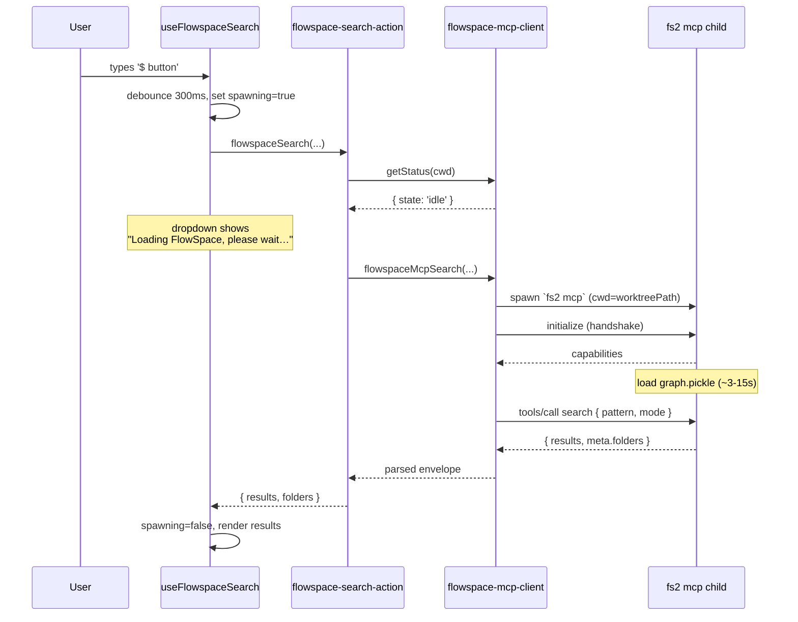
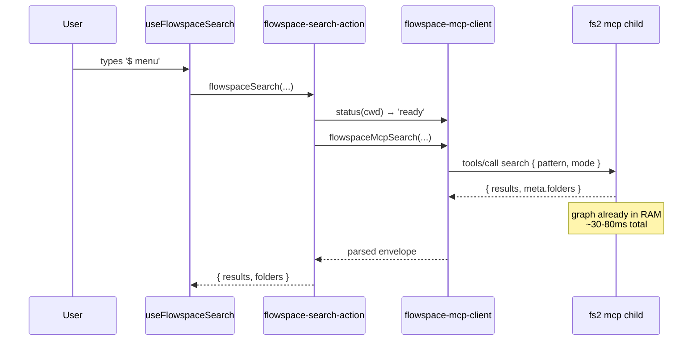
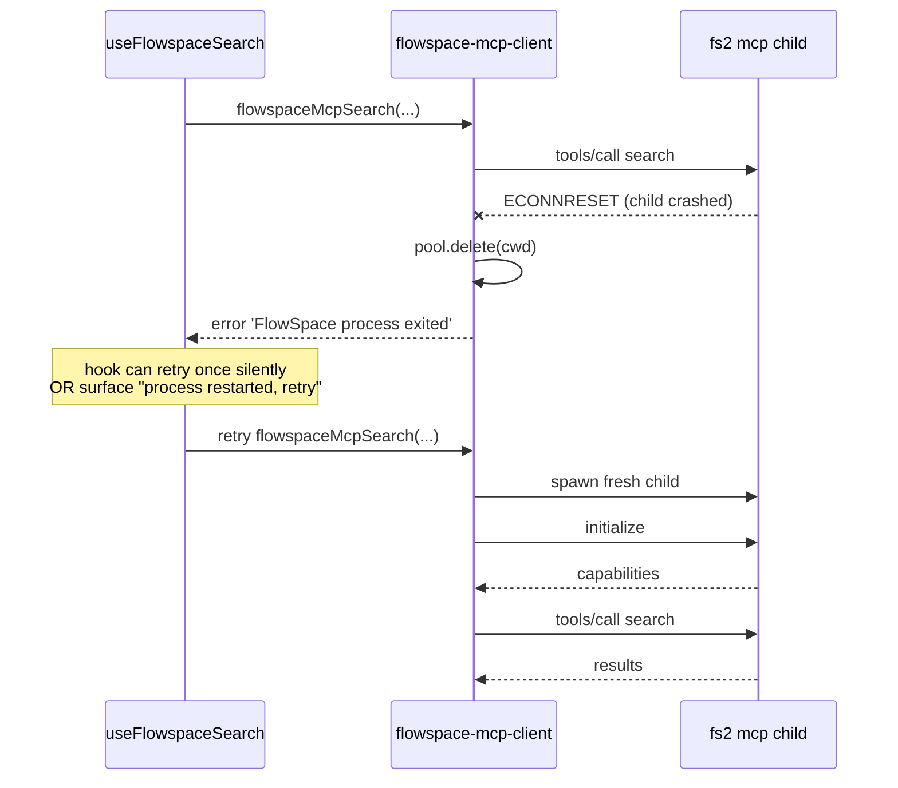
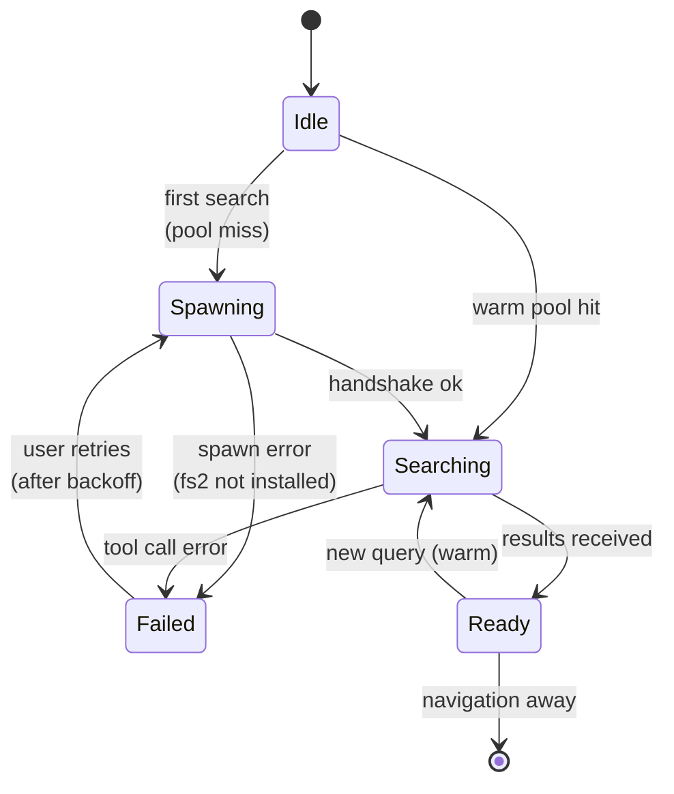

# Workshop: FlowSpace Search via Long-Lived MCP Client

**Type**: Integration Pattern + State Machine
**Plan**: 084-random-enhancements-3
**Spec**: _(this workshop precedes the spec — write it first, derive a small spec from §11 checklist)_
**Created**: 2026-04-26
**Status**: Draft

**Related Documents**:
- Current server action: [`apps/web/src/lib/server/flowspace-search-action.ts`](../../../../apps/web/src/lib/server/flowspace-search-action.ts)
- Current hook: [`apps/web/src/features/041-file-browser/hooks/use-flowspace-search.ts`](../../../../apps/web/src/features/041-file-browser/hooks/use-flowspace-search.ts)
- Current dropdown UI: [`apps/web/src/features/_platform/panel-layout/components/command-palette-dropdown.tsx`](../../../../apps/web/src/features/_platform/panel-layout/components/command-palette-dropdown.tsx)
- Original plan (CLI-based): [`docs/plans/051-flowspace-search/`](../../../051-flowspace-search/)
- Research dossier (FlowSpace tool surface): [`docs/plans/051-flowspace-search/research-dossier.md`](../../../051-flowspace-search/research-dossier.md)
- Existing MCP server (reference for SDK usage): [`packages/mcp-server/src/server.ts`](../../../../packages/mcp-server/src/server.ts)
- Reference MCP config (how `fs2` is invoked elsewhere): `~/.copilot/mcp-config.json` → `flowspace` entry

**Domain Context**:
- **Primary Domain**: `_platform/panel-layout` (search infrastructure for the explorer bar)
- **Related Domains**: `041-file-browser` (consumes the hook in `browser-client.tsx`)

---

## Purpose

The current FlowSpace integration shells out to `fs2 search …` per keystroke via `execFile`. Each call pays the full `fs2` startup cost (Python interpreter boot + ~397 MB graph deserialisation for the chainglass repo) — frequently overshooting the 5-second timeout in `flowspace-search-action.ts:173`. Result: `$ <query>` reliably surfaces **"Search timed out. Try a simpler query."** even when the query is a single word.

This workshop redesigns the integration to **host `fs2 mcp` as a long-lived child process**, talked to over JSON-RPC stdio with the official `@modelcontextprotocol/sdk` client. The graph is loaded once per worktree, then reused for every subsequent call. The first call shows a clear **"Loading FlowSpace, please wait…"** state; everything after is sub-100 ms.

## Key Questions Addressed

- Why move from `fs2 search` (one-shot CLI) to `fs2 mcp` (long-lived server) when we are not an agent?
- How do we manage one MCP child process per worktree without leaking processes across Next.js dev-mode HMR cycles?
- What's the precise UX state for "first call vs warm call vs failed spawn"?
- How does the existing `useFlowspaceSearch` hook surface a `spawning` status so the dropdown can render a tailored message?
- What gets cached, where (process / module / hook / SWR), and when is the cache invalidated?
- What happens when the child crashes mid-session, when the worktree is unmounted, when the graph is rebuilt?
- Does `#` (git grep) change at all, or is this purely the `$` semantic flow? (TL;DR: `$` first; `#` optional follow-up.)

---

## Current State

### What ships today

```
apps/web/src/lib/server/flowspace-search-action.ts
  ├─ checkFlowspaceAvailability(cwd)        ← `command -v fs2`, stat .fs2/graph.pickle
  └─ flowspaceSearch(query, mode, cwd)      ← execFile('fs2 search …', timeout: 5000ms) ← 💥
```

```
                                 Server Action (one-shot)
 user types $                ┌──────────────────────────────────┐
   ↓                         │ execFile('fs2', ['search', q,…]) │
 useFlowspaceSearch          │   1. fork() Python (~80ms)       │
   ↓ (debounce 300ms)        │   2. import fs2 (~120ms)         │
 flowspaceSearch(q,'sem',cwd)│   3. open graph.pickle (~?ms)    │
                             │   4. unpickle 397MB (~3-15s)     │ ← TIMES OUT here
                             │   5. run search (~50ms)          │
                             │   6. exit                        │
                             └──────────────────────────────────┘
                                 next keystroke → repeat from step 1
```

### Why it times out

| Stage             | Cold time      | Warm time |
|-------------------|----------------|-----------|
| Process fork+exec | ~80–150 ms     | n/a       |
| Python interpreter+import | ~120–200 ms | n/a |
| Pickle deserialise (397 MB graph) | **~3–15 s** | **0 ms (already in memory)** |
| Search execution  | ~30–80 ms      | ~30–80 ms |
| **Total per query** | **3–15 s**   | **~100 ms** |

`fs2 mcp` collapses the cold cost into a one-time startup. After that, every search re-uses the loaded graph in the same process.

### Touch points

| File                                                                                  | Role                                                              | Change |
|---------------------------------------------------------------------------------------|-------------------------------------------------------------------|--------|
| `apps/web/src/lib/server/flowspace-search-action.ts`                                  | Server action — calls `execFile`                                  | rewire to MCP client |
| `apps/web/src/features/041-file-browser/hooks/use-flowspace-search.ts`                | Client hook — `setQuery`, exposes `loading`, `error`, etc.        | add `spawning` state |
| `apps/web/src/features/_platform/panel-layout/components/command-palette-dropdown.tsx`| Dropdown UI — renders `Searching…` spinner                        | render `Loading FlowSpace, please wait…` for the spawning state |
| `apps/web/src/features/_platform/panel-layout/types.ts`                               | `CodeSearchAvailability` union                                    | add `'spawning'` (or surface as a separate field — see Q3) |
| **NEW** `apps/web/src/lib/server/flowspace-mcp-client.ts`                             | Process pool + MCP client wrapper                                 | new module |
| `packages/mcp-server/package.json` already pins `@modelcontextprotocol/sdk: ^1.4.1`   | We re-use the same SDK as a **client** (different submodule)      | depend on it from `apps/web` |

---

## Proposed Architecture

### High-level

```
┌─────────────────────────────────────────────────────────────────────────┐
│  Browser                                                                │
│    useFlowspaceSearch(worktreePath)                                     │
│       state: { results, loading, spawning, error, availability }        │
└─────────────────────────┬───────────────────────────────────────────────┘
                          │ Server Action call (RPC)
                          ▼
┌─────────────────────────────────────────────────────────────────────────┐
│  Next.js Server (Node)                                                  │
│    flowspace-search-action.ts                                           │
│      ├─ flowspaceSearch(query, mode, cwd)                               │
│      │     └─ flowspaceMcpClient.search(...)  ← thin façade             │
│      └─ checkFlowspaceAvailability(cwd) (unchanged on disk; reuses pool)│
│                                                                         │
│    flowspace-mcp-client.ts (singleton, module-scope)                    │
│      ├─ pool: Map<worktreePath, FlowspaceProcess>                       │
│      ├─ getOrSpawn(cwd): Promise<FlowspaceProcess>                      │
│      ├─ search(cwd, query, mode): Promise<Results>                      │
│      └─ status(cwd): 'idle' | 'spawning' | 'ready' | 'error'            │
└─────────────────────────┬───────────────────────────────────────────────┘
                          │ stdio JSON-RPC (MCP)
                          ▼
┌─────────────────────────────────────────────────────────────────────────┐
│  fs2 mcp child process (one per worktree)                               │
│    cwd: worktreePath                                                    │
│    holds graph.pickle in RAM                                            │
│    tools/call name="search" args={pattern, mode, limit}                 │
└─────────────────────────────────────────────────────────────────────────┘
```

### Module: `flowspace-mcp-client.ts` (new)

This is the only new file. It is **server-only** — uses `node:child_process` indirectly through `StdioClientTransport`. Lives next to `flowspace-search-action.ts`.

```ts
// apps/web/src/lib/server/flowspace-mcp-client.ts
import 'server-only';
import { Client } from '@modelcontextprotocol/sdk/client/index.js';
import { StdioClientTransport } from '@modelcontextprotocol/sdk/client/stdio.js';
import type { CodeSearchMode } from '@/features/_platform/panel-layout/types';

type ProcState = 'spawning' | 'ready' | 'error';

interface FlowspaceProcess {
  cwd: string;
  client: Client;
  state: ProcState;
  /** Resolves once the MCP `initialize` handshake completes. */
  ready: Promise<void>;
  /** Set if state === 'error'. */
  error?: string;
  /** Last activity timestamp — used by idle reaper. */
  lastUsedAt: number;
  /** Number of in-flight requests. */
  inflight: number;
  /** Graph mtime captured at spawn — used to detect re-index need. */
  graphMtimeAtSpawn: number;
}

// Module-scope, but parked on globalThis to survive Next.js dev HMR.
declare global {
  // eslint-disable-next-line no-var
  var __FLOWSPACE_MCP_POOL__: Map<string, FlowspaceProcess> | undefined;
}
const pool = (globalThis.__FLOWSPACE_MCP_POOL__ ??= new Map());

export type FlowspaceStatus =
  | { state: 'idle' }            // never spawned in this worktree
  | { state: 'spawning' }        // child running, init not done
  | { state: 'ready' }           // ok to call
  | { state: 'error'; error: string };

export function getFlowspaceStatus(cwd: string): FlowspaceStatus {
  const p = pool.get(cwd);
  if (!p) return { state: 'idle' };
  if (p.state === 'ready') return { state: 'ready' };
  if (p.state === 'spawning') return { state: 'spawning' };
  return { state: 'error', error: p.error ?? 'unknown' };
}

export async function flowspaceMcpSearch(
  cwd: string,
  query: string,
  mode: CodeSearchMode,
  opts?: { limit?: number; signal?: AbortSignal }
): Promise<{ results: SearchEnvelopeResult[]; folders: Record<string, number> }> {
  const proc = await getOrSpawn(cwd);
  proc.lastUsedAt = Date.now();
  proc.inflight += 1;
  try {
    // Map UI mode to fs2 mode flag
    const fs2Mode = mode === 'semantic' ? 'semantic' : 'auto';
    const response = await proc.client.callTool({
      name: 'search',
      arguments: {
        pattern: query,
        mode: fs2Mode,
        limit: opts?.limit ?? 20,
      },
    });
    return parseSearchResponse(response);
  } finally {
    proc.inflight -= 1;
    proc.lastUsedAt = Date.now();
  }
}

async function getOrSpawn(cwd: string): Promise<FlowspaceProcess> {
  const existing = pool.get(cwd);
  if (existing && existing.state !== 'error') {
    await existing.ready; // reused if already resolved
    return existing;
  }

  // De-dupe concurrent first-callers via the same `ready` promise.
  const transport = new StdioClientTransport({
    command: 'fs2',
    args: ['mcp'],
    cwd,
    // stderr goes to our logs; stdout is reserved for protocol.
    stderr: 'pipe',
  });
  const client = new Client({ name: 'chainglass-web', version: '0.1.0' });

  const proc: FlowspaceProcess = {
    cwd,
    client,
    state: 'spawning',
    ready: client.connect(transport).then(() => { proc.state = 'ready'; }),
    inflight: 0,
    lastUsedAt: Date.now(),
    graphMtimeAtSpawn: await readGraphMtime(cwd),
  };
  pool.set(cwd, proc);

  proc.ready.catch((e) => {
    proc.state = 'error';
    proc.error = (e as Error).message;
  });

  // Crash detection: re-create on next call.
  transport.onclose = () => {
    if (pool.get(cwd) === proc) pool.delete(cwd);
  };

  await proc.ready;
  return proc;
}
```

**Why `globalThis.__FLOWSPACE_MCP_POOL__`**: Next.js dev mode reloads server modules on every save, which would orphan child processes and re-spawn `fs2 mcp` constantly. Pinning the pool to `globalThis` is the standard Next.js pattern (used for Prisma, etc.) and survives HMR. Production builds run a single process anyway, so the global is harmless there.

---

## Sequence Diagrams

### First search after page load (cold)



### Second search (warm)



### Crash & recovery



---

## State Machine: hook surface



### State table

| State      | UI label shown in dropdown                          | What's true            | Triggered by                          |
|------------|-----------------------------------------------------|------------------------|---------------------------------------|
| Idle       | (nothing — empty hint)                              | No process for this cwd| Hook mount or worktree change         |
| Spawning   | **"Loading FlowSpace, please wait…"** + spinner     | Child spawning + handshake | First search OR crash recovery   |
| Searching  | **"Searching…"** + spinner                          | Child ready, RPC pending | Subsequent search (warm)            |
| Ready      | Results list                                        | Results delivered      | Tool call resolved                    |
| Failed     | Error message + remediation                         | Spawn or RPC error     | spawn fail / tool error               |

### How the hook decides which label to render

```ts
// inside use-flowspace-search.ts
const label =
  status === 'spawning' ? 'Loading FlowSpace, please wait…' :
  loading              ? 'Searching…' :
  null;
```

`status` comes from a new field returned by the server action (or polled separately). See Q3 for two protocol options.

---

## Caching Strategy

Three caches at three layers — each with a clear lifetime.

| Layer | What it caches | Key | TTL / Invalidation | Why here |
|-------|---------------|-----|--------------------|----------|
| **fs2 process** | Loaded graph in RAM | (none — implicit) | Process lifetime | This is the whole point — kills the 3-15s cold cost |
| **`flowspace-mcp-client`** | None by default; optional LRU of `(query, mode) → results` | `${query}${mode}` | Until `graph.pickle` mtime changes; cap at 32 entries | Saves identical re-searches when user back-spaces |
| **`useFlowspaceSearch` hook** | Last result for last query (existing) | n/a | Component lifetime | Already there |

### Mtime-based invalidation

```ts
// On every search call, compare current graph.pickle mtime to graphMtimeAtSpawn.
// If newer → kill the process and respawn so the next call re-loads the fresh graph.
async function maybeRecycle(proc: FlowspaceProcess) {
  const current = await readGraphMtime(proc.cwd);
  if (current > proc.graphMtimeAtSpawn) {
    await proc.client.close(); // triggers transport.onclose → pool.delete
  }
}
```

Done at the start of `flowspaceMcpSearch`, before `tools/call`. Cheap (one `stat`).

### Idle reaping

A single setInterval (registered once, also on `globalThis` to survive HMR) scans the pool every 60 s and kills any process where `Date.now() - lastUsedAt > IDLE_MS && inflight === 0`. Default `IDLE_MS = 10 * 60 * 1000` (10 min).

### What we deliberately do **not** cache

- Cross-worktree: each worktree has its own `.fs2/graph.pickle`; pool key is `worktreePath`.
- Negative results: a "no matches" answer for a typo isn't worth holding onto.
- Availability: `checkFlowspaceAvailability` already has `fs2AvailableCache` — leave it; safe assumption that `fs2` doesn't appear/disappear from PATH at runtime.

---

## UX States in the Dropdown

The existing `command-palette-dropdown.tsx` (lines 482–539) handles `mode === 'semantic'` with this branch tree. Two minor edits, same visual structure:

```
┌─────────────────────────────────────────────────────────────────────────┐
│ availability !== 'available'                                            │
│   → "FlowSpace not installed" + GitHub link                             │
│   → "Run fs2 scan to index your codebase"                               │
│ ─────────────────────────────────────────────────────────────────────── │
│ availability === 'available' AND no query yet                           │
│   → "FlowSpace semantic search"            (existing)                   │
│ ─────────────────────────────────────────────────────────────────────── │
│ status === 'spawning'                                                   │ ← NEW
│   → "Loading FlowSpace, please wait…"      + AsciiSpinner               │
│   subtle: "(first search loads the code graph)"                         │
│ ─────────────────────────────────────────────────────────────────────── │
│ status === 'ready' AND loading                                          │
│   → "Searching…"                            + AsciiSpinner              │
│ ─────────────────────────────────────────────────────────────────────── │
│ error                                                                   │
│   → error message verbatim (e.g., "Semantic search requires embeddings")│
│ ─────────────────────────────────────────────────────────────────────── │
│ results.length > 0                                                      │
│   → CodeSearchResultsList (unchanged)                                   │
│ ─────────────────────────────────────────────────────────────────────── │
│ no results                                                              │
│   → "No matches"                            (existing)                  │
└─────────────────────────────────────────────────────────────────────────┘
```

### ASCII mock (cold first search)

```
┌─────────────────────────────────────────────────────────┐
│ $ command palette                                       │
├─────────────────────────────────────────────────────────┤
│  ⠋ Loading FlowSpace, please wait…                      │
│     first search loads the code graph (≈ 5–10 s)        │
└─────────────────────────────────────────────────────────┘
```

### ASCII mock (warm)

```
┌─────────────────────────────────────────────────────────┐
│ $ command palette                                       │
├─────────────────────────────────────────────────────────┤
│ 12 results · src/ 8 · packages/ 3 · 🧠 semantic         │
├─────────────────────────────────────────────────────────┤
│  ƒ  CommandPalette       L42-78    apps/web/src/…       │
│       Floating command surface                          │
│  ƒ  openCommandPalette   L114      packages/sdk/…       │
│  📦 CommandPaletteHandle L18-25    apps/web/src/…       │
│  …                                                      │
└─────────────────────────────────────────────────────────┘
```

---

## Module Interface (TypeScript)

### Server-only client (`flowspace-mcp-client.ts`)

```ts
export type FlowspaceStatus =
  | { state: 'idle' }
  | { state: 'spawning' }
  | { state: 'ready' }
  | { state: 'error'; error: string };

export interface FlowspaceMcpSearchEnvelope {
  results: FlowSpaceSearchResult[];   // existing wire type
  folders: Record<string, number>;
}

export function getFlowspaceStatus(cwd: string): FlowspaceStatus;
export async function flowspaceMcpSearch(
  cwd: string,
  query: string,
  mode: CodeSearchMode,
  opts?: { limit?: number; signal?: AbortSignal }
): Promise<FlowspaceMcpSearchEnvelope>;
export async function prewarmFlowspace(cwd: string): Promise<void>;
export async function shutdownFlowspace(cwd: string): Promise<void>;
```

### Server action update (`flowspace-search-action.ts`)

```ts
'use server';

export async function flowspaceSearch(
  query: string,
  mode: CodeSearchMode,
  cwd: string
): Promise<
  | { kind: 'spawning' }                                          // ← NEW
  | { kind: 'ok'; results: FlowSpaceSearchResult[]; folders: Record<string, number> }
  | { kind: 'error'; error: string }
> {
  if (!query.trim()) return { kind: 'ok', results: [], folders: {} };

  const status = getFlowspaceStatus(cwd);
  if (status.state === 'idle') {
    // Kick off spawn, return immediately so UI can render the loading message.
    void prewarmFlowspace(cwd);
    return { kind: 'spawning' };
  }
  if (status.state === 'spawning') {
    return { kind: 'spawning' };
  }
  if (status.state === 'error') {
    return { kind: 'error', error: status.error };
  }

  try {
    const env = await flowspaceMcpSearch(cwd, query, mode, { limit: 20 });
    return { kind: 'ok', results: env.results, folders: env.folders };
  } catch (e) {
    return { kind: 'error', error: friendlyError(e) };
  }
}
```

### Hook update (`use-flowspace-search.ts`)

```ts
export interface UseFlowspaceSearchReturn {
  results: FlowSpaceSearchResult[] | null;
  loading: boolean;
  spawning: boolean;                                              // ← NEW
  error: string | null;
  availability: CodeSearchAvailability;
  graphAge: string | null;
  folders: Record<string, number> | null;
  setQuery: (query: string, mode: CodeSearchMode) => void;
}
```

When the hook receives `{ kind: 'spawning' }`, it sets `spawning=true` and **schedules a re-fetch in 1 s** until it gets a non-spawning answer (simple polling with a hard cap of 30 s, then surfaces an error). Cleaner than streaming responses, no SSE plumbing, fits the existing server-action shape.

### Dropdown update (`command-palette-dropdown.tsx`)

Add one prop `codeSearchSpawning?: boolean` and one branch in the existing semantic-mode tree:

```tsx
codeSearchSpawning ? (
  <div className="px-3 py-4 text-center text-sm text-muted-foreground">
    <AsciiSpinner active /> Loading FlowSpace, please wait…
    <div className="mt-1 text-xs text-muted-foreground/70">
      first search loads the code graph
    </div>
  </div>
) : codeSearchLoading ? (
  /* existing "Searching…" branch */
) : …
```

Threading: `browser-client.tsx` already wires `flowspace.{loading,error,results,…}` into `<ExplorerPanel codeSearch…>`. Add `flowspace.spawning` alongside `flowspace.loading`.

---

## MCP Tool Contract (what we send / receive)

The fs2 MCP server exposes the tools listed in the research dossier. We only need `search` for this workshop; `tree` and `get_node` are out of scope.

### `tools/call` — search

```jsonc
// → request
{
  "name": "search",
  "arguments": {
    "pattern": "command palette",
    "mode": "semantic",          // 'auto' | 'text' | 'regex' | 'semantic'
    "limit": 20
  }
}
```

```jsonc
// ← response (content[0].text contains the JSON envelope)
{
  "content": [{
    "type": "text",
    "text": "{ \"meta\": { \"total\": 12, \"folders\": {\"apps/\":8,\"packages/\":3} }, \"results\": [ … ] }"
  }]
}
```

### Parser (in `flowspace-mcp-client.ts`)

```ts
function parseSearchResponse(r: { content: { type: string; text: string }[] }) {
  const text = r.content.find((c) => c.type === 'text')?.text;
  if (!text) throw new Error('FlowSpace returned empty response');
  const env = JSON.parse(text);
  // Reuse existing extractFilePath / extractName / sanitizeSmartContent helpers
  // (move them out of flowspace-search-action.ts to a shared helper if needed).
  return mapEnvelope(env);
}
```

The existing `extractFilePath`, `extractName`, `sanitizeSmartContent` helpers in `flowspace-search-action.ts:80–142` are pure node-id parsers — keep them and re-use, or extract into `flowspace-result-mapper.ts` so both old (CLI) and new (MCP) paths can share until removal.

---

## Edge Cases

| # | Scenario | Expected behaviour |
|---|----------|-------------------|
| 1 | `fs2` binary not on PATH | Same as today: availability check returns `not-installed`, dropdown shows install link. Pool never spawns. |
| 2 | `.fs2/graph.pickle` missing | Same as today: availability returns `no-graph`, dropdown shows "Run fs2 scan". |
| 3 | Two near-simultaneous first searches | Both observe pool miss; second caller awaits the same `proc.ready` promise (de-dupe via `pool.get(cwd)` after creation). Only one child spawns. |
| 4 | Child crashes during search | `transport.onclose` deletes from pool; current call rejects; hook surfaces error and on next user keystroke pool re-spawns. |
| 5 | Worktree deleted (folder gone) | First call to `getOrSpawn` fails with ENOENT from cwd; mark error, surface "Worktree path missing". |
| 6 | Graph rebuilt during session (`fs2 scan`) | Mtime check at start of each `search` recycles the process. Next call shows `spawning` again briefly. |
| 7 | Multiple worktrees open in tabs | One process per worktree path. RAM cost = N × graph size. Document; rely on idle reaper to bound. |
| 8 | Semantic embeddings missing | MCP `tools/call` returns an error string; we map it the same way the CLI path does ("Run fs2 scan --embed"). |
| 9 | Next.js HMR (dev) | `globalThis` pool survives; processes outlive code reloads. |
| 10 | App shutdown / SIGTERM | Optional: register `process.on('exit', closeAll)` on the singleton. Children will exit anyway when stdin closes. |
| 11 | Slow query (semantic on huge corpus) | Add per-call `AbortSignal` with a generous 30 s ceiling — distinct from the 5 s timeout we're removing. |
| 12 | Multiple concurrent searches in same worktree | MCP supports concurrent `tools/call` (request id matched in protocol). No serialisation needed. |

---

## Open Questions

### Q1: Do we extend `#` (git grep) to also use fs2 MCP, or leave it alone?

**OPEN**.

- **Option A (scoped)**: Only rewire `$` semantic. `#` continues to use git grep. ✅ Smallest blast radius. Matches user phrasing about "semantic search etc". Recommended.
- **Option B (unified)**: Rewire `#` to use `fs2 search --mode auto` (text/regex via MCP). Gives symbol-name-aware results (`# useFileFilter` finds the function definition, not just any line containing the substring). Trade-off: depends on `fs2` being installed for `#`, regresses the "zero-dep grep" property of Plan 052.

**Recommendation**: A for this plan. Park B in `Future Work`.

### Q2: Do we polish the `spawning` state via polling, SSE, or a status-only server action?

**OPEN**.

- **Option A (simple poll)**: Server action returns `{ kind: 'spawning' }` immediately, hook polls every 1 s up to 30 s. ✅ No new infrastructure, fits server-action model, easy to reason about.
- **Option B (SSE)**: New `/api/flowspace/status` event stream emitting `idle → spawning → ready`. Heavier; only worth it if we add cross-tab status display.
- **Option C (long-poll)**: Server action awaits `proc.ready` internally, returns `{ kind: 'ok' }` directly. Removes the loading UI affordance entirely (from the user's perspective the first search is just "slow"). ❌ The brief explicitly asks for a "Loading FlowSpace" message — rules this out.

**Recommendation**: A. Simple, debuggable, fits.

### Q3: Where exactly does the `spawning` flag live on the wire?

**OPEN — coupled to Q2**.

- **Option A**: New discriminated union for the action result (shown above: `spawning | ok | error`). Hook reads `kind`. ✅ Explicit, type-safe.
- **Option B**: Add `spawning?: boolean` alongside `results`/`error` in the existing shape. Less invasive but ambiguous (results+spawning together is meaningless).

**Recommendation**: A.

### Q4: Idle timeout default — 10 min, 30 min, never?

**OPEN**.

- A 10-minute idle reap on a 397 MB process matters in dev (developer leaves browser open overnight) and barely matters in production (one user → bounded by app lifetime).
- A graph rebuild always recycles, so reaping isn't required for correctness.

**Recommendation**: 10 min default, expose as `FLOWSPACE_IDLE_MS` env var. Document in code comment.

### Q5: Do we surface a manual "restart FlowSpace" command in the SDK command palette?

**OPEN**.

A command like `> Restart FlowSpace` that calls `shutdownFlowspace(cwd)` would be useful when the graph appears stale or the process misbehaves. Cheap to add. **Recommendation**: ship in this plan.

### Q6: Pre-warm on bar focus, or only on first search?

**OPEN**.

- Pre-warm on focus (keystroke before `$`) hides the spawn cost behind user typing. Slightly aggressive — wastes a process if user never searches. ✅ Recommended for desktop.
- First-search-only spawn is simpler and matches the brief verbatim.

**Recommendation**: First-search-only in the initial cut; revisit if the loading message ever feels slow.

### Q7: What's the behaviour on Windows?

**OPEN**.

`StdioClientTransport` works on Windows when `fs2.exe` is on PATH. We currently target macOS/Linux — mark Windows as **not in scope** unless a tester confirms. Same disclaimer as the rest of the app.

### Q8: Tests — how do we cover the process pool without a real `fs2` binary in CI?

**OPEN**.

- The MCP SDK's `InMemoryTransport` lets us test client wiring without a child process — point the client at a fake server that returns canned envelopes. ✅ Recommended for unit tests.
- Integration test: `fs2` is available on dev machines; behind an env-gated `it.skipIf(!hasFs2)` it, this can run locally without breaking CI.

**Recommendation**: Unit + opt-in integration. No vi.fn() per repo doctrine — the in-memory MCP transport replaces mocks.

---

## Implementation Checklist

Numbered for direct conversion into a small spec / phase plan.

1. **Add SDK dependency** — `apps/web/package.json` gains `@modelcontextprotocol/sdk` (the existing `packages/mcp-server/package.json` already has it; we need it transitively from web too).
2. **Move shared mappers** — extract `extractFilePath`, `extractName`, `sanitizeSmartContent`, and the result mapping logic from `flowspace-search-action.ts` to `apps/web/src/lib/server/flowspace-result-mapper.ts`.
3. **New `flowspace-mcp-client.ts`** — pool, spawn, search, status, prewarm, shutdown, mtime recycle, idle reaper. `globalThis` pool. `'server-only'` import.
4. **Rewrite `flowspace-search-action.ts`** — new discriminated union return; delegate to MCP client; keep `checkFlowspaceAvailability` as-is (still useful for the install/no-graph branches).
5. **Update `use-flowspace-search.ts`** — add `spawning` state; on `kind: 'spawning'` schedule a re-call after 1 s (polling, capped at 30 s).
6. **Update `command-palette-dropdown.tsx`** — accept `codeSearchSpawning`, render the new "Loading FlowSpace, please wait…" branch above the existing "Searching…" branch.
7. **Thread the prop** — `explorer-panel.tsx` (props) → `browser-client.tsx` (wires `flowspace.spawning`).
8. **Optional `> Restart FlowSpace` SDK command** — new command in the relevant SDK registration that calls `shutdownFlowspace(currentWorktreePath)`.
9. **Tests**:
   - Unit: pool dedupes concurrent first-callers; mtime recycle; idle reap.
   - Integration (env-gated): spawn real `fs2 mcp`, run a known query, assert results parse.
   - UI: dropdown renders spawn message before search message.
10. **Telemetry / logging** — `[flowspace-mcp]` prefix; log spawn time, search latency, recycle events. Keeps the existing CLI logger style.
11. **Remove the 5 s timeout** — that was a CLI-warmup-cost-management hack that no longer applies. Replace with the per-call 30 s ceiling described in Edge Case 11.
12. **Docs** — short note in `docs/plans/051-flowspace-search/` cross-linking this workshop as the successor design. Don't rewrite that plan.

---

## Quick Reference

```ts
// What changes vs. today
- execFile('fs2', ['search', q, …], { timeout: 5000 })   // ⛔
+ flowspaceMcpSearch(cwd, q, mode, { limit: 20 })        // ✅

// First-time UX
status: 'spawning'  →  "Loading FlowSpace, please wait…"

// Subsequent UX
loading: true       →  "Searching…"

// Cache layers
fs2 process    : graph in RAM (forever, until idle reap or graph rebuild)
mcp client     : optional LRU per (query, mode) — capped at 32 entries
hook           : last result for last query (existing behaviour)

// Pool key
worktreePath  →  one fs2 mcp process

// Persistence across HMR
globalThis.__FLOWSPACE_MCP_POOL__
```
