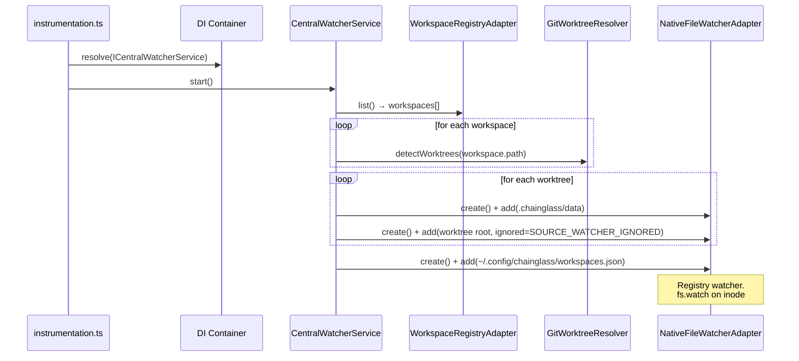
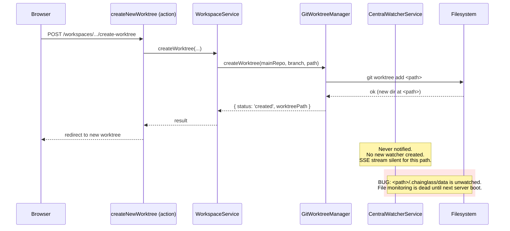
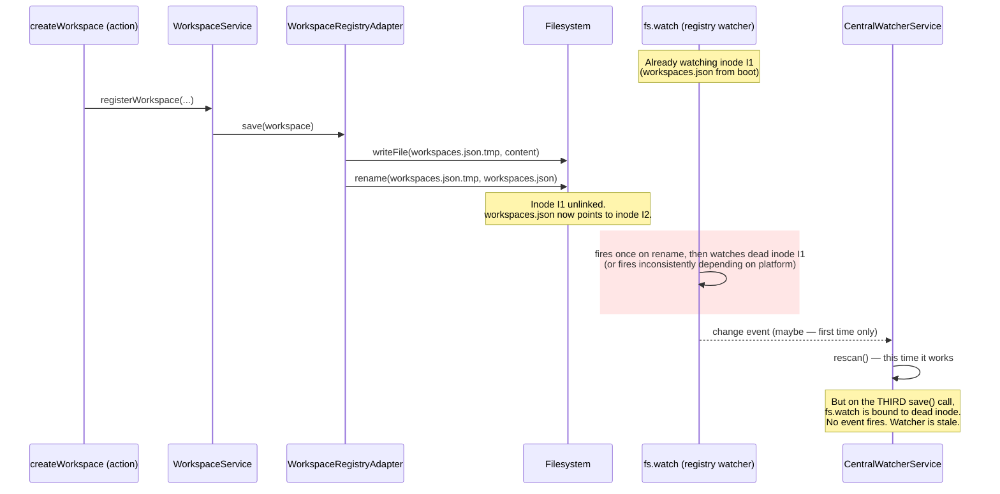
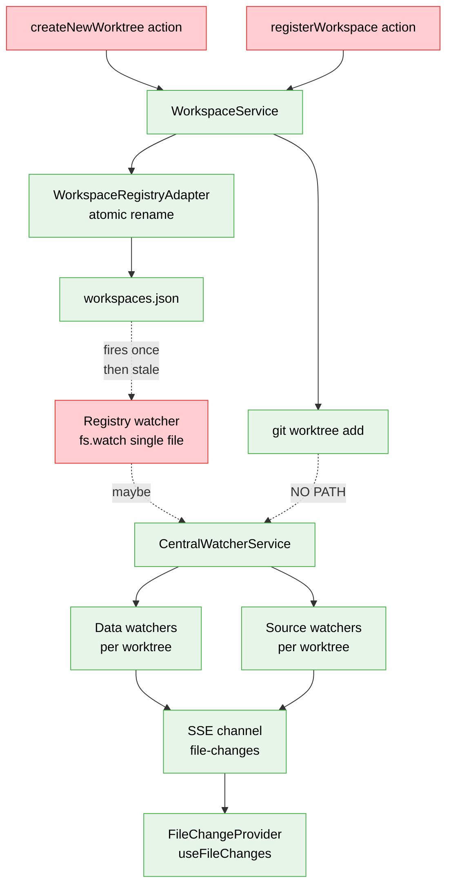
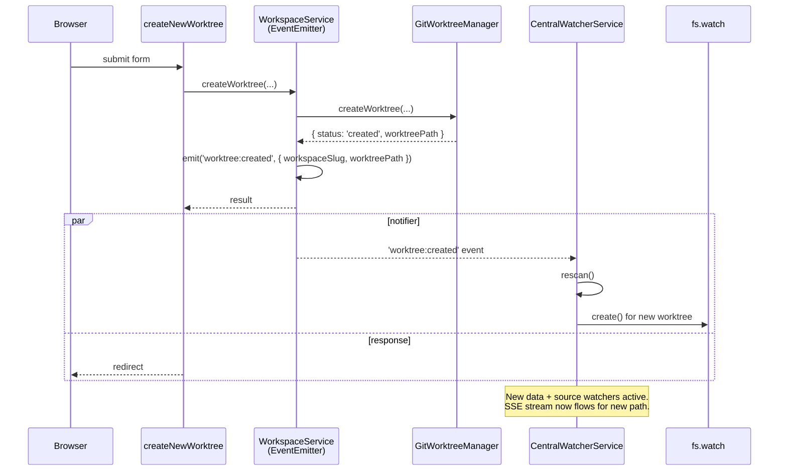
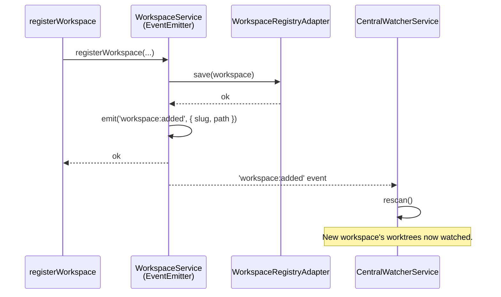

# Workshop: Watcher Rescan on Workspace & Worktree Changes

**Type**: Integration Pattern
**Plan**: 084-random-enhancements-3
**Spec**: [../live-monitoring-rescan-spec.md](../live-monitoring-rescan-spec.md)
**Created**: 2026-04-26
**Status**: Approved (open questions resolved 2026-04-26)

**Related Documents**:
- [Plan 023: Central Watcher Notifications](../../023-central-watcher-notifications/) — original design of `CentralWatcherService`
- [Plan 060: Replace Chokidar with Native File Watcher](../../060-native-file-watcher/) — why we use `fs.watch({recursive: true})`
- [Plan 069: Worktree Creation Server Actions](../../069-worktree-creation/) — `createNewWorktree` action

**Domain Context**:
- **Primary Domain**: `_platform/events` — central watcher service & file-change SSE pipeline
- **Related Domains**: `workflow` (workspace service, worktree lifecycle), `file-browser` (consumes `useFileChanges`), `_platform/sse` (multiplexed channel transport)

---

## Purpose

Design how the **`CentralWatcherService` is told to expand its watch-set** when new workspaces are registered or new worktrees are created in existing workspaces. Today, both code paths silently fail to notify the watcher, so file monitoring for the new directory does not work until the dev server is restarted.

This workshop drives the integration contract between **`WorkspaceService`** (the writer of workspace/worktree state) and **`CentralWatcherService`** (the reader of workspace/worktree state for watch enumeration).

## Key Questions Addressed

1. Why does file monitoring break after `git worktree add`?
2. Why does file monitoring break after registering a second workspace? (Less obvious — the registry watcher is *supposed* to handle this.)
3. What is the right signaling mechanism: direct method call, event emitter, file-system polling, or "watch a wider directory"?
4. Where does the rescan trigger live in the call graph — the server action, the workspace service, or somewhere else?
5. How do we keep this idempotent, race-free, and HMR-survivable?
6. Does the frontend need any changes, or is this purely a server-side fix?

---

## Symptoms (User Report, 2026-04-26)

> "When I create a new worktree in an existing workspace, or add an entirely new workspace, the file monitoring doesn't work and I have to restart the dev server to get it."

Both symptoms are real. The **first** is more obvious; the **second** is surprising because the registry watcher *exists* — so why doesn't it work?

---

## Current Architecture

### Watcher startup (works correctly at boot)



At boot, every existing worktree gets a data watcher and a source watcher. This works.

### Two failure modes after boot

#### Failure mode A — `git worktree add` in an existing workspace



`git worktree add` does **not** modify `~/.config/chainglass/workspaces.json` — it only creates a directory and updates `.git/worktrees/`. The registry watcher therefore never fires. `WorkspaceService.executeCreate` (workspace.service.ts:461-526) returns success without informing `CentralWatcherService`. No DI wiring exists between the two — see workspace-actions.ts:660-668: the action resolves `IWorkspaceService` but never `ICentralWatcherService`.

#### Failure mode B — registering a second workspace



`WorkspaceRegistryAdapter.writeRegistry()` (workspace-registry.adapter.ts:326-344) uses an **atomic rename pattern**: write to `.tmp`, rename over the target. This is correct for write durability but **breaks `fs.watch`**, which is bound to the inode. After the first rename, the watched file path resolves to a *new* inode, while the watcher still holds the *old* (now-unlinked) inode. Subsequent writes do not fire the change event reliably.

Platform variation makes this confusing:
- **macOS FSEvents** (used by `fs.watch({recursive: true})` on darwin): partially path-aware — *may* fire on rename-replace, but only with `recursive: true`. The registry watcher calls `add(filePath)` with `recursive: true`, so this *might* work intermittently — explaining why the bug is reported as "sometimes works, sometimes doesn't."
- **Linux inotify**: watches the inode. After unlink, `IN_IGNORED` fires once and the watch descriptor is gone forever. Subsequent writes do nothing.

The bug is therefore: **the registry watcher is fundamentally an unreliable signal for atomic-rename writes**, and even when it fires once, the second registration after boot will likely miss.

### Architectural summary



Red = broken signal path. Green = healthy. The **only** signal path from `WorkspaceService` mutations to `CentralWatcherService` is the unreliable registry file watcher, and `git worktree add` doesn't even cross that path.

---

## Design Space

### Option A — Direct method call from server action to watcher

After `workspaceService.createWorktree()` returns success, the action resolves `ICentralWatcherService` from DI and calls `watcher.rescan()`.

**Pros**:
- Trivial wiring; no new abstractions.
- Explicit at the call site.

**Cons**:
- Couples every workspace/worktree-mutating action to the watcher service.
- Easy to forget when adding new actions (no compile-time enforcement).
- Bleeds infrastructure concerns into the action layer.
- Does nothing for non-action callers (CLI, tests, future workers).

### Option B — Notifier injected into `WorkspaceService`

Add an `IWorkspaceMutationNotifier` (or pass `ICentralWatcherService` directly) into `WorkspaceService`. The service calls `notifier.notifyMutation()` after each successful createWorktree / removeWorktree / save / remove.

**Pros**:
- Mutation point is the right place to fire.
- One change covers all callers (actions, CLI, tests).
- Simple: just a side-effect call after the DB-equivalent write completes.

**Cons**:
- `WorkspaceService` now has a dependency on a notifier interface — small DI surface area increase.
- Still imperative; not as decoupled as an event bus.

### Option C — Event emitter on `IWorkspaceService`

`WorkspaceService extends EventEmitter`. After a mutation, it emits `'worktree:created'`, `'worktree:removed'`, `'workspace:added'`, `'workspace:removed'`. `CentralWatcherService` subscribes during DI wire-up and calls `rescan()` on any of those events.

**Pros**:
- Decoupled — neither service knows the other.
- Extensible: SSE invalidation, audit logging, cache busting can subscribe later.
- Maps naturally onto Node's stdlib (`EventEmitter`).

**Cons**:
- Slightly more code than Option B.
- Subscription lifecycle to manage (must unsubscribe on stop / HMR).

### Option D — Watch the parent directory instead of the registry file

Replace `registryWatcher.add('~/.config/chainglass/workspaces.json')` with `add('~/.config/chainglass/')` and filter events to `workspaces.json`. Directory watches are inode-stable across atomic renames inside them — `fs.watch` on the parent directory will see `rename` events for both the `.tmp` creation and the rename itself.

**Pros**:
- Fixes failure mode B at its root (atomic rename detection).
- No new abstractions.

**Cons**:
- Doesn't fix failure mode A (worktree creation doesn't touch the registry).
- Surface for spurious events (any other file in `~/.config/chainglass/` would fire).

### Option E — Watch `.git/worktrees/` for each main repo

For each registered workspace's main repo, also watch `<mainRepo>/.git/worktrees/` (where `git worktree add` creates a metadata directory per worktree). On `addDir` events there, trigger a rescan.

**Pros**:
- Fixes failure mode A defensively — even out-of-band `git worktree add` from the terminal would be picked up.

**Cons**:
- Only fixes mode A. Mode B still needs a separate fix.
- Adds another watcher per workspace (small but real).
- Not all `.git/worktrees/` writes correspond to user-visible worktree creation.

---

## Recommended Design: **Option C (event emitter) + Option D (parent-dir registry watch) as defense-in-depth**

The primary signal path is the event emitter (catches every code-path mutation). The parent-directory watch is a fallback for out-of-band registry edits (e.g., a developer manually editing `workspaces.json`).

We **do not** need Option E — once the primary path works, `git worktree add` always flows through `WorkspaceService.createWorktree()`, so the emitter covers it.

### Sequence — happy path (worktree creation)



### Sequence — happy path (workspace registration)



### Interface contract

```typescript
// packages/workflow/src/services/workspace.service.ts (or a new interface file)

export type WorkspaceMutationEvent =
  | { kind: 'workspace:added'; slug: string; path: string }
  | { kind: 'workspace:removed'; slug: string; path: string }
  | { kind: 'workspace:updated'; slug: string; path: string }
  | { kind: 'worktree:created'; workspaceSlug: string; worktreePath: string }
  | { kind: 'worktree:removed'; workspaceSlug: string; worktreePath: string };

export interface IWorkspaceService {
  // ... existing methods (createWorktree, registerWorkspace, etc.)

  /**
   * Subscribe to workspace mutation events.
   *
   * Listener is invoked AFTER the mutation has been persisted.
   * Listener errors are logged but do not propagate to the caller.
   *
   * Returns an unsubscribe function for HMR/test cleanup.
   */
  onMutation(listener: (event: WorkspaceMutationEvent) => void): () => void;
}
```

### Wire-up (start-central-notifications.ts)

```typescript
// apps/web/src/features/027-central-notify-events/start-central-notifications.ts

const workspaceService = container.resolve<IWorkspaceService>(
  WORKSPACE_DI_TOKENS.WORKSPACE_SERVICE
);

const unsubscribe = workspaceService.onMutation((event) => {
  log('mutation event', event);
  watcher.rescan().catch((err) => log('rescan failed', err));
});

// Pin unsubscribe to globalThis for HMR cleanup
declare global {
  var __watcherMutationUnsubscribe__: (() => void) | undefined;
}
globalThis.__watcherMutationUnsubscribe__?.();
globalThis.__watcherMutationUnsubscribe__ = unsubscribe;
```

### Implementation in `WorkspaceService`

```typescript
import { EventEmitter } from 'node:events';

export class WorkspaceService implements IWorkspaceService {
  private readonly emitter = new EventEmitter();

  // ...existing constructor

  onMutation(listener: (event: WorkspaceMutationEvent) => void): () => void {
    this.emitter.on('mutation', listener);
    return () => this.emitter.off('mutation', listener);
  }

  private emit(event: WorkspaceMutationEvent): void {
    // setImmediate so the emit doesn't block the caller's await chain
    setImmediate(() => {
      try {
        this.emitter.emit('mutation', event);
      } catch (err) {
        // Listener errors must not propagate
        console.error('[WorkspaceService] mutation listener threw', err);
      }
    });
  }

  // After successful mutations:
  // ... at end of executeCreate (workspace.service.ts:520):
  this.emit({
    kind: 'worktree:created',
    workspaceSlug: request.workspaceSlug,
    worktreePath,
  });
  return { status: 'created', branchName, worktreePath, bootstrapStatus };
}
```

### Defense-in-depth: parent-directory registry watch

In `CentralWatcherService.start()`:

```typescript
// Replace single-file watch with parent-dir watch + filter
import { dirname } from 'node:path';
const registryDir = dirname(this.registryPath);

this.registryWatcher = this.fileWatcherFactory.create({
  ignoreInitial: true,
  atomic: true,
  awaitWriteFinish: { stabilityThreshold: 200, pollInterval: 100 },
});
this.registryWatcher.add(registryDir);
this.registryWatcher.on('change', (path) => {
  if (typeof path === 'string' && path === this.registryPath) {
    this.rescan().catch((err) => this.logError('Rescan from registry watch failed', err));
  }
});
this.registryWatcher.on('add', (path) => {
  if (typeof path === 'string' && path === this.registryPath) {
    this.rescan().catch(() => {});
  }
});
```

This survives atomic renames — when the inode changes, the parent directory still fires `add` for the new file at the same path.

---

## Edge Cases & Failure Modes

| # | Scenario | Behavior | Notes |
|---|----------|----------|-------|
| EC-1 | `createWorktree` succeeds but bootstrap hook fails | Still emit `worktree:created`. Watcher should pick it up regardless of bootstrap outcome. | The worktree directory exists; user can navigate to it. |
| EC-2 | `createWorktree` returns `status: 'blocked'` | Do NOT emit. Nothing was created on disk. | Easy to forget — emit must be inside the success branch. |
| EC-3 | Two simultaneous `createWorktree` calls | Both emit. `rescan()` already serializes via `isRescanning`/`rescanQueued` (central-watcher.service.ts:170-186). Second call queues. | Existing rescan-coalescing logic handles this. |
| EC-4 | `rescan()` itself throws | Listener catches, logs, does not propagate. The mutation already succeeded. | UX: user might still need a restart in the rare error case. Log loudly. |
| EC-5 | HMR reload | Old emitter is GC'd; new `WorkspaceService` instance created. The unsubscribe-via-`globalThis` pattern (mirrors `__FLOWSPACE_MCP_POOL__`) detaches the prior listener cleanly. | Critical: without this, listener leaks on every save. |
| EC-6 | Worktree removed from disk out-of-band (`git worktree remove` from terminal) | Not covered by this design. Existing registry watcher would not fire either. | Out of scope. The next deliberate UI action will trigger a rescan and clean it up. |
| EC-7 | Workspace path is the same as another workspace's worktree path | `detectWorktrees` already deduplicates. `rescan()` handles add/remove correctly. | Existing logic. |
| EC-8 | Many rapid mutations | Listener fires N times → `rescan()` coalesces via `rescanQueued` flag. Net: ~2 rescans regardless of N. | Existing coalescing — no debounce needed. |

---

## Frontend Coordination — Required?

**Probably not.** Tracing the path:

1. `CentralWatcherService.dispatchEvent` (line 333) fans out to all registered adapters.
2. `FileChangeWatcherAdapter` (file-change-watcher.adapter.ts:30-130) batches with 300ms debounce and emits.
3. The adapter's events flow into the SSE multiplexed channel (multiplexed-sse-provider.tsx).
4. The browser's `MultiplexedSSEProvider` subscribes once at mount with a hardcoded channel list. The `file-changes` channel carries events for *every* worktree.
5. `FileChangeProvider` (file-change-provider.tsx:38-78) **filters by `worktreePath`** client-side (line 54-55) and dispatches to a per-worktree `FileChangeHub`.

Because the SSE channel is global (not per-worktree) and filtering happens client-side, **once the watcher is rescanned and starts emitting events for the new path, the frontend should pick them up automatically** when the user navigates to the new worktree (which re-keys `FileChangeProvider`'s `useMemo([worktreePath])`).

**Verification needed**: Confirm the SSE channel `file-changes` is global. If it's per-worktree, the multiplexed provider's channel list (locked at mount) would need to be reactive, which is a much larger change.

---

## Open Questions

All questions resolved during spec authoring (2026-04-26). Resolutions captured in [`../live-monitoring-rescan-spec.md`](../live-monitoring-rescan-spec.md) § Open Questions.

### Q1: Are there other code paths that mutate workspace state outside `WorkspaceService`?

**RESOLVED — No.** Grep across `apps/web` + `packages/workflow/src` (excluding tests/fakes/mocks) for `registryAdapter.save|remove|update` and `gitManager.createWorktree` returns 4 hits, **all** in `workspace.service.ts:95, 124, 295, 470`. The event-emitter approach covers every existing mutation path. The parent-dir registry watch (defense-in-depth) is then purely belt-and-suspenders for genuinely out-of-band edits (e.g., `vim ~/.config/chainglass/workspaces.json`).

### Q2: Should the `IWorkspaceService` interface live in the contracts boundary, or stay package-internal?

**RESOLVED — Stay internal initially.** YAGNI — there is no second subscriber planned. Promote to contracts only when SSE cache invalidation (or another consumer) actually needs the signal. The internal interface keeps the surface area small and the change reversible.

### Q3: Per-event handlers vs single `'mutation'` channel?

**RESOLVED — single channel with discriminated union**. Matches the existing pattern in this repo (the FlowSpace search action uses a discriminated union `{ kind: 'spawning' | 'ok' | 'error' }`). Subscribers switch on `event.kind` if they care about granularity.

### Q4: Should `rescan()` accept a hint about *which* path changed?

**RESOLVED — defer.** Today `performRescan()` re-lists all workspaces and diffs against current watchers. For typical workspace counts (<20), this is fast (~tens of ms). If profiling shows it's a hotspot, we can pass `{ workspaceSlug?: string; worktreePath?: string }` as a hint for targeted rescan.

### Q5: How do we test this end-to-end?

**RESOLVED via plan-3 testing strategy**. Two unit tests + one integration test:

- **Unit (workspace service)**: Verify `createWorktree` emits `worktree:created` on success and does NOT emit on `'blocked'`.
- **Unit (central watcher)**: Verify `rescan()` is called when a `mutation` event fires.
- **Integration (end-to-end)**: Spin up a temp workspace, register it, call `createWorktree` via the service, assert that `dataWatchers.has(newWorktreePath)` becomes true within ~50ms.

No mocks of `fs.watch` itself — use real filesystem in temp dir.

### Q6: HMR survivability — is `globalThis.__watcherMutationUnsubscribe__` enough?

**RESOLVED — Yes, with detach-then-resubscribe order.** The pattern is proven by `__FLOWSPACE_MCP_POOL__` and `__centralNotificationsStarted` already in this codebase (instrumentation.ts:22-31). The plan-3 implementation must (1) detach the prior listener stored at `globalThis.__watcherMutationUnsubscribe__` *before* (2) re-resolving the service from DI and (3) re-subscribing. If `WorkspaceService` identity changes on HMR, the prior listener is harmlessly attached to a dead instance and gets GC'd; no leak.

### V1: SSE channel scope (verification, originally tagged "needs verification")

**RESOLVED — global channel.** `MultiplexedSSEProvider` (multiplexed-sse-provider.tsx:74-75) bakes the channel list into the URL at mount: `useMemo(() => '/api/events/mux?channels=' + channelsKey, [channelsKey])`. `file-changes` is one such channel. Filtering by `worktreePath` happens client-side in `FileChangeProvider` (file-change-provider.tsx:54-55). **No frontend changes are required** for new worktree paths to flow through.

---

## Quick Reference — Implementation Checklist

```
Server-side (packages/workflow):
  [ ] Define WorkspaceMutationEvent type (discriminated union)
  [ ] Add IWorkspaceService.onMutation(listener) → unsubscribe
  [ ] WorkspaceService extends EventEmitter (or holds one)
  [ ] Emit at the success exit of executeCreate, registerWorkspace, removeWorkspace, removeWorktree, update
  [ ] DO NOT emit on 'blocked' / failure paths
  [ ] Listener errors caught and logged (never propagate)

Server-side (apps/web/.../start-central-notifications.ts):
  [ ] Resolve IWorkspaceService from container
  [ ] Subscribe: workspaceService.onMutation(() => watcher.rescan())
  [ ] Pin unsubscribe to globalThis for HMR
  [ ] On HMR / re-register, detach prior listener first

Server-side (CentralWatcherService — defense in depth):
  [ ] Replace registryWatcher.add(filePath) with .add(parentDir)
  [ ] Filter events to the registry file path inside the listener
  [ ] Handle both 'change' and 'add' events (atomic rename = unlink + create)

Tests:
  [ ] Unit: createWorktree(success) emits; createWorktree(blocked) does not
  [ ] Unit: registerWorkspace / removeWorkspace emit
  [ ] Unit: CentralWatcherService rescans on mutation event
  [ ] Integration: temp dir + real fs.watch; assert dataWatchers grows after createWorktree

Manual verification:
  [ ] Boot dev server, register workspace A, create worktree A1 — file events flow
  [ ] Without restart, register workspace B → file events flow for B's worktrees
  [ ] Without restart, create worktree A2 → file events flow for A2
  [ ] Without restart, create worktree B1, then B2, then A3 → all flow
  [ ] Trigger HMR (touch a server file), repeat — no listener leak (check process memory + log noise)
```

---

## Decision Rationale Summary

| Decision | Why |
|----------|-----|
| EventEmitter on WorkspaceService (not direct method call) | Decouples the writer from the watcher; opens future subscribers (SSE invalidation, audit). |
| Single `'mutation'` channel, discriminated union | Matches the codebase's existing `{ kind: ... }` pattern (FlowSpace search action). |
| Defense-in-depth parent-dir registry watch | Atomic rename + `fs.watch` is broken by design on Linux inotify; parent-dir watch fixes the root cause for out-of-band edits. |
| `setImmediate` before emitting | Decouples listener execution from the caller's await chain — listener errors can't break the mutation result. |
| Pin unsubscribe to `globalThis` | Mirrors the `__FLOWSPACE_MCP_POOL__` HMR-survival idiom already in use. |
| No frontend changes | SSE channel is global; client-side filtering by worktreePath already handles new paths. (Verification pending.) |
| Don't emit on `blocked` results | Nothing on disk changed — emitting would cause spurious rescans. |
