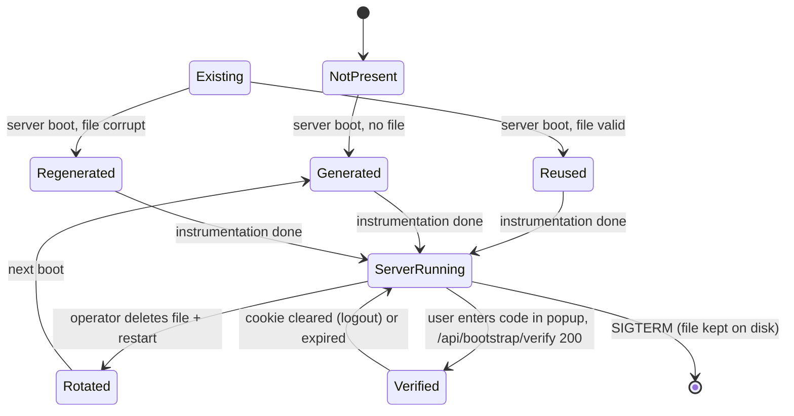
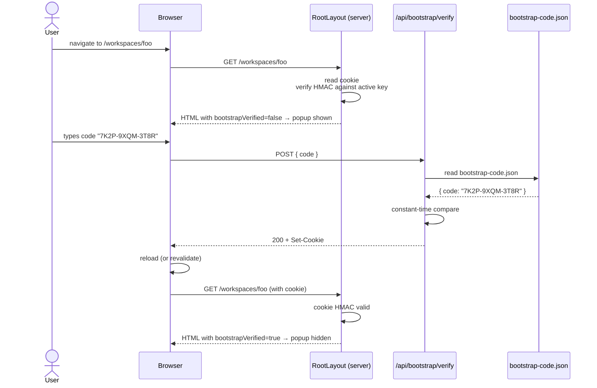

# Workshop: Bootstrap-Code Lifecycle and Server-Side Verification

**Type**: Storage Design + Integration Pattern (hybrid)
**Plan**: 084-random-enhancements-3
**Spec**: _not yet — research-only at this stage_
**Research**: [`auth-bootstrap-code-research.md`](../auth-bootstrap-code-research.md)
**Created**: 2026-04-30
**Status**: Draft

**Related documents**:
- [Plan 064 / Terminal WS Auth workshop](../../064-tmux/workshops/002-terminal-ws-authentication.md) — closest prior art for the JWT-on-WS pattern we're extending
- [Plan 067 / event-popper](../../067-popper/) (and Plan 076 CLI server-mode) — established the file-based local-trust pattern we're following
- [`docs/domains/_platform/auth/domain.md`](../../../domains/_platform/auth/domain.md) — domain we're extending
- [`docs/adr/adr-0003-configuration-system-architecture.md`](../../../adr/adr-0003-configuration-system-architecture.md) — secret detection patterns to avoid

**Domain Context**:
- **Primary Domain**: `_platform/auth` (extending — bootstrap-code becomes the outer gate; GitHub OAuth becomes the inner second factor)
- **Related Domains**: `terminal` (WS sidecar consumes the code derivation), `_platform/events` (sidecar HTTP sinks gain composite auth), `_platform/sdk` (future "rotate code" command)

---

## Purpose

Define the complete server-side story for the always-on bootstrap-code auth feature: where the secret lives on disk, how it's generated, how the browser proves possession, and how every server-side gate (proxy, terminal-WS sidecar, event-popper sinks, tmux events sink) consumes it.

**Out of scope for this workshop** — covered separately:
- The browser-side popup UX (component placement, hydration handling, localStorage autofill, mobile behaviour) → workshop 005.
- The CLI/operator command surface (e.g. `cg auth show-code`) → defer to a later workshop or address in plan-3.

This workshop is what a developer keeps open while implementing the file format, the verify endpoint, and the proxy/WS/sidecar composition layer.

---

## Key Questions Addressed

From the research dossier's Open Questions:

- **Q-1**: Which `/api/*` routes still bypass the bootstrap cookie? → resolved (§ Server-side enforcement matrix)
- **Q-2**: Bootstrap-code persistence policy → resolved as **persist across boots, regenerate on missing file, operator-rotates by deletion** (§ Lifecycle state machine)
- **Q-3**: Cookie vs Authorization-header transport → resolved as **HttpOnly cookie for browsers; existing `X-Local-Token` for CLI** (§ Cookie format)
- **Q-4**: Layering with optional GitHub OAuth → resolved as **bootstrap is always outer gate; GitHub is inner second factor** (§ DISABLE_GITHUB_OAUTH semantics)
- **Q-5**: Lost-code recovery → resolved as **delete file + restart; banner hint at boot** (§ Operator UX)
- **Q-6**: Does popup gate `/login`? → **yes** (popup lives in RootLayout — handled by workshop 005, but the cookie check in proxy must also include `/login`)

What this workshop **does not resolve**:
- Q-7 (mobile UX) — popup-specific, defer to workshop 005.
- Exact rate-limit numbers — proposed defaults below; tunable in spec.

---

## Decision Summary

| Decision | Resolution | Rationale |
|---|---|---|
| **Where the code lives** | `.chainglass/bootstrap-code.json` (a sibling of `.chainglass/server.json`, not merged into it) | Different lifecycles: `server.json` is ephemeral (deleted on SIGTERM); the code persists. Merging would force one or the other policy. Two files = two clear lifecycles. |
| **Code format** | 12-character Crockford base32, grouped `XXXX-XXXX-XXXX` (60 bits of entropy) | Human-readable, no ambiguous characters (no `I L O U`), easy to dictate, doesn't collide with secret-detection patterns from ADR-0003 (`sk-`, `ghp_`, `xoxb-`, etc.) |
| **Generation** | At server boot, in `instrumentation.ts`, after the existing `localToken` write block | Reuse existing HMR-safe pattern; one boot-time hook to reason about |
| **Persistence** | Persist across boots; reuse if file exists; regenerate only if missing | "Saveable" UX requires it. Operator regen = `rm` + restart |
| **Browser bearer** | HttpOnly cookie `chainglass-bootstrap=<HMAC of code>`, no expiry, `SameSite=Lax`, `Secure` in prod | Stateless, browser handles automatically; rotating the code naturally invalidates all cookies (HMAC changes) |
| **CLI bearer** | Existing `X-Local-Token` header (Plan 067 `localToken` from `server.json`) — unchanged | Don't invent a new header; CLI sidecars already support this |
| **HMAC signing key** | `AUTH_SECRET` if set, else HKDF-derived from the bootstrap code | One unified `activeSigningSecret()` helper; works whether GitHub OAuth is on or off |
| **`/api/health`** | Stays public (LB probes) | No regression for ops; the file says "service is up", nothing more |
| **`/api/auth/*`** | Stays public (NextAuth requires it) | OAuth callback URLs cannot be gated; documented intentional exclusion |
| **`/api/event-popper/*` and `/api/tmux/events`** | Tightened — accept bootstrap cookie *or* `X-Local-Token` (composite check) | Closes the "anyone on loopback can post arbitrary events" hole |
| **Terminal WS silent-bypass when `AUTH_SECRET` unset** | **Closed** — derive WS signing key from bootstrap code via HKDF | Removes the worst hole; bootstrap code is always available, so the WS layer always has *something* to validate |
| **`DISABLE_AUTH` env var** | Renamed to `DISABLE_GITHUB_OAUTH`; old name kept as deprecated alias for one release | New name is self-documenting; alias avoids breaking dev setups overnight |

---

## The Artifacts

```
.chainglass/
├── bootstrap-code.json    ← NEW. Persistent. The user-facing secret.
├── server.json             ← existing. Ephemeral — Plan 067 localToken (CLI).
├── auth.yaml               ← existing. GitHub-allowlist (Plan 063).
├── data/
├── runs/
├── workspaces/
└── ...
```

### Why two files (not merged)

| Concern | `bootstrap-code.json` | `server.json` |
|---|---|---|
| Audience | Operator types it into a popup once per browser | CLI processes read it on every command |
| Lifetime | Persists across server restarts | Created on boot, deleted on SIGTERM |
| Rotation cadence | Rare (operator-driven) | Every restart |
| Sensitivity | Higher (long-lived) | Lower (process-lifetime only) |

Merging into a single file forces both fields to share one lifecycle. The bootstrap code being *deleted on SIGTERM* would break the "saveable" UX. The `localToken` *persisting across boots* would weaken the `localToken` security model. Keep them separate.

---

## File Format

### `bootstrap-code.json`

```json
{
  "version": 1,
  "code": "7K2P-9XQM-3T8R",
  "createdAt": "2026-04-30T11:34:22.018Z",
  "rotatedAt": "2026-04-30T11:34:22.018Z"
}
```

| Field | Type | Required | Notes |
|---|---|---|---|
| `version` | integer | yes | Schema version. Always `1` in v1 of this feature. |
| `code` | string | yes | Crockford base32, exactly 14 chars including two hyphens, format `XXXX-XXXX-XXXX`. Validated against `/^[0-9A-HJKMNP-TV-Z]{4}-[0-9A-HJKMNP-TV-Z]{4}-[0-9A-HJKMNP-TV-Z]{4}$/`. |
| `createdAt` | ISO-8601 string | yes | First time this code was generated (informational only). |
| `rotatedAt` | ISO-8601 string | yes | Last time it was regenerated (= `createdAt` on first boot). |

### Crockford base32 alphabet

`0123456789ABCDEFGHJKMNPQRSTVWXYZ` (32 chars). Excluded: `I`, `L`, `O`, `U`. `I` and `L` look like `1`; `O` looks like `0`; `U` is excluded by the spec to prevent accidental obscenity. 12 characters of entropy = 12 × 5 bits = **60 bits**. Online-guessing infeasible at any reasonable rate limit.

### Why grouped `XXXX-XXXX-XXXX`?

Hyphens are dictation-friendly and visually anchor the popup input. They're stripped before validation and re-applied for display. The popup input field itself can autoformat as the user types.

### TypeScript types (in `packages/shared/src/auth/bootstrap-code/types.ts`)

```typescript
export interface BootstrapCodeFile {
  version: 1;
  code: string;       // 'XXXX-XXXX-XXXX' Crockford base32
  createdAt: string;  // ISO-8601
  rotatedAt: string;  // ISO-8601
}

export const BOOTSTRAP_CODE_PATTERN =
  /^[0-9A-HJKMNP-TV-Z]{4}-[0-9A-HJKMNP-TV-Z]{4}-[0-9A-HJKMNP-TV-Z]{4}$/;

export const BOOTSTRAP_CODE_FILE_PATH_REL = '.chainglass/bootstrap-code.json';
```

### Zod schema

```typescript
import { z } from 'zod';

export const BootstrapCodeFileSchema = z.object({
  version: z.literal(1),
  code: z.string().regex(BOOTSTRAP_CODE_PATTERN),
  createdAt: z.string().datetime(),
  rotatedAt: z.string().datetime(),
}).strict();
```

### `.gitignore` update

```diff
 # Plan 018: Workspace-scoped agent data (events, sessions)
 .chainglass/workspaces/
 .chainglass/data/
+.chainglass/bootstrap-code.json
+.chainglass/server.json
```

(Add `server.json` too — it's been gitignored by virtue of being in an ignored parent path in some setups but not consistently. Make explicit.)

---

## Code Generation Algorithm

### Function shape

```typescript
// packages/shared/src/auth/bootstrap-code/generator.ts
import { randomInt } from 'node:crypto';

const ALPHABET = '0123456789ABCDEFGHJKMNPQRSTVWXYZ';

/**
 * Generate a 12-character Crockford base32 bootstrap code.
 * Format: 'XXXX-XXXX-XXXX'. 60 bits of entropy.
 *
 * Why randomInt: cryptographically strong; no modulo bias on a 32-element
 * alphabet (32 divides 2^32 evenly).
 */
export function generateBootstrapCode(): string {
  const out: string[] = [];
  for (let i = 0; i < 12; i++) {
    if (i > 0 && i % 4 === 0) out.push('-');
    out.push(ALPHABET[randomInt(0, ALPHABET.length)]);
  }
  return out.join('');
}
```

### Atomic write helper

Reuse `writeServerInfo`'s atomic temp+rename pattern from `packages/shared/src/event-popper/port-discovery.ts:139-160`. Create a generalised version (or inline it):

```typescript
// packages/shared/src/auth/bootstrap-code/persistence.ts
import { existsSync, readFileSync, writeFileSync, renameSync } from 'node:fs';
import { join, dirname } from 'node:path';
import { mkdirSync } from 'node:fs';
import { BootstrapCodeFileSchema, type BootstrapCodeFile } from './types';

export function readBootstrapCode(filePath: string): BootstrapCodeFile | null {
  if (!existsSync(filePath)) return null;
  try {
    const raw = readFileSync(filePath, 'utf-8');
    const parsed = JSON.parse(raw);
    return BootstrapCodeFileSchema.parse(parsed);
  } catch {
    return null;  // Corrupt or malformed — caller decides whether to regenerate
  }
}

export function writeBootstrapCode(filePath: string, file: BootstrapCodeFile): void {
  mkdirSync(dirname(filePath), { recursive: true });
  const tmp = `${filePath}.tmp`;
  writeFileSync(tmp, JSON.stringify(file, null, 2), 'utf-8');
  renameSync(tmp, filePath);
}
```

### Boot-time integration in `apps/web/instrumentation.ts`

After the existing `localToken`-write block, insert:

```typescript
// Plan 084: bootstrap-code generation. Idempotent — reuses existing file if valid.
const globalForBootstrap = globalThis as typeof globalThis & {
  __bootstrapCodeWritten?: boolean;
};
if (!globalForBootstrap.__bootstrapCodeWritten) {
  globalForBootstrap.__bootstrapCodeWritten = true;
  try {
    const { ensureBootstrapCode } = await import('@chainglass/shared/auth-bootstrap-code');
    const file = ensureBootstrapCode(process.cwd());
    console.log(
      `[bootstrap-code] active. file: ${file.path}. code is hidden — open the popup or read the file to view.`
    );
  } catch (err) {
    globalForBootstrap.__bootstrapCodeWritten = false;
    console.error('[bootstrap-code] failed to write:', err);
  }
}
```

`ensureBootstrapCode(cwd)` reads the file if it exists *and* validates the schema; otherwise generates and writes. Returns the parsed file plus its absolute path:

```typescript
export interface EnsureResult {
  path: string;
  data: BootstrapCodeFile;
  generated: boolean;  // true if a new code was written; false if existing reused
}

export function ensureBootstrapCode(cwd: string): EnsureResult {
  const path = join(cwd, BOOTSTRAP_CODE_FILE_PATH_REL);
  const existing = readBootstrapCode(path);
  if (existing) return { path, data: existing, generated: false };
  const now = new Date().toISOString();
  const data: BootstrapCodeFile = {
    version: 1,
    code: generateBootstrapCode(),
    createdAt: now,
    rotatedAt: now,
  };
  writeBootstrapCode(path, data);
  return { path, data, generated: true };
}
```

Note: **the boot log does NOT print the code**. Operator reads the file. Rationale: anyone tailing the dev server log shouldn't see the code; logs leak (CI, screen-sharing, error reports).

---

## Lifecycle State Machine



### Lifecycle table

| State | Trigger | Action | File on disk |
|---|---|---|---|
| **NotPresent** | First-ever boot, or operator deleted file | n/a | absent |
| **Generated** | Boot finds no file | Generate + write | written |
| **Existing → Reused** | Boot finds valid file | Read + use | unchanged |
| **Existing → Regenerated** | Boot finds corrupt file | Log + write new | overwritten |
| **ServerRunning** | Normal operation | Cookie HMAC checks ride on it | unchanged |
| **Verified** | Browser POSTs correct code to verify endpoint | Set cookie | unchanged |
| **Rotated** | Operator deletes file, restarts | Boot regenerates → all cookies invalidate (HMAC changes) | regenerated |
| **Shutdown** | SIGTERM/SIGINT | **No-op** — file persists | unchanged |

The contrast with `server.json` is the key takeaway: bootstrap-code does **not** participate in the SIGTERM cleanup chain at all.

---

## The HMAC Signing Key (`activeSigningSecret`)

Both the cookie HMAC and the terminal WS JWT signing reduce to "what secret do we sign with?". Define one helper:

```typescript
// packages/shared/src/auth/bootstrap-code/signing-key.ts
import { hkdfSync } from 'node:crypto';
import { ensureBootstrapCode } from './persistence';

const HKDF_SALT = Buffer.from('chainglass.signing.salt.v1');
const HKDF_INFO = Buffer.from('chainglass.signing.info.v1');

let cached: Buffer | null = null;

export function activeSigningSecret(cwd: string): Buffer {
  if (cached) return cached;
  const explicit = process.env.AUTH_SECRET;
  if (explicit && explicit.length > 0) {
    cached = Buffer.from(explicit, 'utf-8');
    return cached;
  }
  // Fall back to HKDF from the bootstrap code.
  const { data } = ensureBootstrapCode(cwd);
  cached = Buffer.from(
    hkdfSync('sha256', Buffer.from(data.code, 'utf-8'), HKDF_SALT, HKDF_INFO, 32)
  );
  return cached;
}

/** Test-only — clears the cache so tests can vary AUTH_SECRET between cases. */
export function _resetSigningSecretCacheForTests(): void {
  cached = null;
}
```

### Properties of this design

1. **One source of truth.** Cookie HMAC and JWT signing both go through this helper.
2. **Cache is correct.** AUTH_SECRET is read once per process (env vars don't change at runtime). Bootstrap code rotation requires server restart (already true by design).
3. **Closes the silent-bypass hole.** Terminal WS no longer accepts unauthenticated connections when AUTH_SECRET is unset — it falls back to HKDF.
4. **Backward compatible.** Existing setups with `AUTH_SECRET` set behave identically (same key path).

### Caveat: NextAuth still wants `AUTH_SECRET`

Auth.js v5's session-JWT signing also uses `AUTH_SECRET`. We can't HKDF-fallback into NextAuth without a fork. So:

- **GitHub OAuth enabled (`DISABLE_GITHUB_OAUTH` unset/false)**: `AUTH_SECRET` is **required**. NextAuth refuses to start without it, and that's still the desired behaviour.
- **GitHub OAuth disabled**: `AUTH_SECRET` is **optional**. The `auth()` wrapper short-circuits to a fake session before NextAuth would be invoked, and `activeSigningSecret()` falls back to HKDF.

Document this in the env-var matrix below.

---

## The Browser Cookie

```
Set-Cookie: chainglass-bootstrap=<base64url-HMAC>;
            HttpOnly;
            SameSite=Lax;
            Path=/;
            Secure   ; (prod only)
```

### HMAC value

```typescript
// packages/shared/src/auth/bootstrap-code/cookie.ts
import { createHmac, timingSafeEqual } from 'node:crypto';

const COOKIE_NAME = 'chainglass-bootstrap';

function sign(code: string, key: Buffer): string {
  const h = createHmac('sha256', key).update(code, 'utf-8').digest();
  return h.toString('base64url');
}

export function buildCookieValue(code: string, key: Buffer): string {
  return sign(code, key);
}

export function verifyCookieValue(
  cookieValue: string | undefined,
  expectedCode: string,
  key: Buffer
): boolean {
  if (!cookieValue) return false;
  const expected = sign(expectedCode, key);
  // Constant-time
  const a = Buffer.from(cookieValue);
  const b = Buffer.from(expected);
  if (a.length !== b.length) return false;
  return timingSafeEqual(a, b);
}

export const BOOTSTRAP_COOKIE_NAME = COOKIE_NAME;
```

### Properties

- **Stateless.** No server-side session table. The cookie is self-validating against the current bootstrap code.
- **Self-invalidating on rotation.** Operator rotates the code → cookie's HMAC no longer matches → all browsers re-prompt.
- **`SameSite=Lax`.** Cookie sent on top-level navigations to same site; not on cross-site sub-requests. Good default.
- **No expiry.** Bootstrap code is the *thing* that expires (by being rotated). Adding a `Max-Age` would force users to re-enter for no security gain.
- **`HttpOnly`.** JavaScript can't read it. The popup can't tell *what* code generated the cookie — just that the cookie exists. Server passes a `bootstrapVerified: boolean` hint to the client component (workshop 005 covers this).

---

## Verify API

### `POST /api/bootstrap/verify`

Excluded from the proxy gate (chicken-and-egg — popup must be able to call it). The route file itself rate-limits.

**Request**:

```http
POST /api/bootstrap/verify HTTP/1.1
Content-Type: application/json

{ "code": "7K2P-9XQM-3T8R" }
```

**Success response**:

```http
HTTP/1.1 200 OK
Set-Cookie: chainglass-bootstrap=oZ3...; HttpOnly; SameSite=Lax; Path=/
Content-Type: application/json

{ "ok": true }
```

**Failure responses**:

| HTTP | Body | When |
|---|---|---|
| `400` | `{ "error": "invalid-format" }` | Code doesn't match the regex |
| `401` | `{ "error": "wrong-code" }` | Format OK but doesn't match the file |
| `429` | `{ "error": "rate-limited", "retryAfterMs": 12000 }` | Per-IP attempt budget exhausted |
| `503` | `{ "error": "unavailable" }` | File missing or corrupt — generation race; suggest retry |

**Rate limit policy** (proposed defaults — final numbers in spec):

- 5 attempts per IP per minute, leaky-bucket.
- Exponential backoff cookie attached on consecutive failures: `Retry-After` headers on `429`.
- In-memory `Map<string, AttemptBudget>`; clear on process restart (acceptable — small attack window).
- IP source: `req.headers.get('x-forwarded-for')?.split(',')[0]` falling back to socket address. Document that an honest reverse proxy is assumed; the rate limit is defence-in-depth, not the primary defence (60 bits of entropy is).

### `POST /api/bootstrap/forget`

```http
POST /api/bootstrap/forget HTTP/1.1
```

```http
HTTP/1.1 200 OK
Set-Cookie: chainglass-bootstrap=; HttpOnly; SameSite=Lax; Path=/; Max-Age=0
```

Always returns 200. Idempotent. Excluded from proxy gate (so users without a valid cookie can still clear theirs).

### Sequence diagram — first-time popup flow



---

## Server-Side Enforcement Matrix

This is the load-bearing table for implementation. It lists every public-network surface and exactly what authentication it requires after this feature lands.

| Surface | Today | After this plan | Notes |
|---|---|---|---|
| Pages (`/dashboard/*`, `/workspaces/*`, `/settings/*`, ...) | proxy → `auth()` | proxy → bootstrap cookie ➜ `auth()` | Unchanged when both gates pass |
| `/login` page | Excluded from proxy | Excluded from proxy gate, **but RootLayout-level popup still gates UI** | Cookie not required server-side; popup is the gate |
| `/api/health` | Public | Public | LB probes need it |
| `/api/auth/*` | NextAuth catch-all (public) | Unchanged | OAuth callback URL is fixed; can't gate |
| `/api/bootstrap/verify` | n/a | **Public** + per-IP rate limit | Bootstraps the cookie; can't require what it sets |
| `/api/bootstrap/forget` | n/a | **Public** | Idempotent logout |
| `/api/events/[channel]` | Inline `await auth()` | proxy gates first; inline `auth()` keeps as defense-in-depth | Excluded from proxy matcher today; **add to matcher** so cookie is checked |
| `/api/events/mux` | Inline `auth()` | Same | Same |
| `/api/event-popper/*` | `localhostGuard` only | `localhostGuard` + `requireLocalAuth` (cookie OR `X-Local-Token`) | Closes the "anyone on loopback can post" hole |
| `/api/tmux/events` | `localhostGuard` only | Same composite check | Same |
| `/api/terminal/token` | Inline `auth()` + `AUTH_SECRET` | proxy gates first; inline `auth()` keeps | Cookie required to even reach the route |
| Server actions | `requireAuth()` at top of each | Unchanged inside; covered by proxy upstream | `requireAuth()` itself doesn't change |
| Terminal WS upgrade | JWT validated with `AUTH_SECRET` (or **bypassed if AUTH_SECRET unset**) | JWT validated with `activeSigningSecret()` (always available) | Silent-bypass closed |
| Terminal WS per-message `auth` | Same as above | Same | Token refresh inherits the same key |

### Updated `proxy.ts`

```typescript
// apps/web/proxy.ts (post-plan)
import { auth } from '@/auth';
import { NextResponse } from 'next/server';
import { verifyCookieValue, BOOTSTRAP_COOKIE_NAME } from '@chainglass/shared/auth-bootstrap-code';
import { getBootstrapCodeAndKey } from '@/lib/bootstrap';

const AUTH_BYPASS_ROUTES = [
  '/api/health',
  '/api/auth',
  '/api/bootstrap/verify',
  '/api/bootstrap/forget',
];

export default auth(async (req) => {
  const path = req.nextUrl.pathname;

  // Routes that must remain reachable without any cookie.
  if (AUTH_BYPASS_ROUTES.some((p) => path.startsWith(p))) {
    return NextResponse.next();
  }

  // Layer 1: bootstrap-code cookie (always required).
  const cookieValue = req.cookies.get(BOOTSTRAP_COOKIE_NAME)?.value;
  const { code, key } = await getBootstrapCodeAndKey();
  if (!verifyCookieValue(cookieValue, code, key)) {
    if (path.startsWith('/api/')) {
      return NextResponse.json({ error: 'bootstrap-required' }, { status: 401 });
    }
    // Page request — let it through so RootLayout can show the popup.
    // The page has nothing sensitive; the popup paints over it.
    return NextResponse.next();
  }

  // Layer 2: GitHub OAuth (optional).
  if (process.env.DISABLE_GITHUB_OAUTH === 'true' || process.env.DISABLE_AUTH === 'true') {
    return NextResponse.next();
  }
  if (!req.auth) {
    if (path.startsWith('/api/')) {
      return NextResponse.json({ error: 'Unauthorized' }, { status: 401 });
    }
    return NextResponse.redirect(new URL('/login', req.nextUrl.origin));
  }
  return NextResponse.next();
});

export const config = {
  matcher: [
    '/((?!_next/static|_next/image|favicon\\.ico|manifest\\.webmanifest).*)',
  ],
};
```

**Diff vs today**:

- Matcher *broadens* — pages and API routes that were previously excluded (login, health, auth, bootstrap, event-popper, events) all now run through the proxy. The proxy itself decides what to do with each, using `AUTH_BYPASS_ROUTES`.
- The bootstrap-cookie check is the new outer gate.
- For *page* requests without the cookie, we let them through and rely on RootLayout's popup. For *API* requests without the cookie, we 401 directly.
- Both `DISABLE_AUTH` (legacy) and `DISABLE_GITHUB_OAUTH` (new) are accepted; remove `DISABLE_AUTH` after one release cycle.

### Updated `apps/web/src/auth.ts`

The wrapper that returns a fake session under `DISABLE_AUTH=true` keeps working — but **only after the bootstrap cookie is verified upstream by the proxy**. Server components calling `await auth()` directly are still gated because they'd never have been rendered without the proxy passing first.

Add a deprecation warning:

```typescript
if (process.env.DISABLE_AUTH === 'true' && !process.env.DISABLE_GITHUB_OAUTH) {
  console.warn(
    '[auth] DISABLE_AUTH is deprecated. Use DISABLE_GITHUB_OAUTH=true. ' +
    'DISABLE_AUTH will be removed in a future release.'
  );
}
```

### Updated `requireLocalAuth(req)` helper

New file `apps/web/src/lib/local-auth.ts`:

```typescript
import { cookies } from 'next/headers';
import { localhostGuard } from '@/lib/localhost-guard';
import { verifyCookieValue, BOOTSTRAP_COOKIE_NAME } from '@chainglass/shared/auth-bootstrap-code';
import { getBootstrapCodeAndKey } from '@/lib/bootstrap';
import { readServerInfo } from '@chainglass/shared/event-popper';

export type LocalAuthResult =
  | { ok: true; via: 'cookie' | 'local-token' }
  | { ok: false; reason: 'not-localhost' | 'no-credential' | 'bad-credential' };

export async function requireLocalAuth(req: Request): Promise<LocalAuthResult> {
  if (!localhostGuard(req)) return { ok: false, reason: 'not-localhost' };

  // Path 1: browser cookie
  const cookieStore = await cookies();
  const cookieValue = cookieStore.get(BOOTSTRAP_COOKIE_NAME)?.value;
  if (cookieValue) {
    const { code, key } = await getBootstrapCodeAndKey();
    if (verifyCookieValue(cookieValue, code, key)) return { ok: true, via: 'cookie' };
  }

  // Path 2: CLI/sidecar header
  const headerToken = req.headers.get('x-local-token');
  if (headerToken) {
    const info = readServerInfo(process.cwd());
    if (info?.localToken && timingSafeStringEq(headerToken, info.localToken)) {
      return { ok: true, via: 'local-token' };
    }
  }

  return { ok: false, reason: 'no-credential' };
}

function timingSafeStringEq(a: string, b: string): boolean {
  if (a.length !== b.length) return false;
  let acc = 0;
  for (let i = 0; i < a.length; i++) acc |= a.charCodeAt(i) ^ b.charCodeAt(i);
  return acc === 0;
}
```

Apply at the top of `app/api/event-popper/*` and `app/api/tmux/events/route.ts`:

```typescript
const auth = await requireLocalAuth(req);
if (!auth.ok) {
  return NextResponse.json({ error: 'Unauthorized', reason: auth.reason }, { status: 401 });
}
// ... existing logic
```

### Terminal WS sidecar — close the silent-bypass

`apps/web/src/features/064-terminal/server/terminal-ws.ts:235-240` today:

```typescript
if (!authEnabled) {
  console.warn(
    '[terminal] AUTH_SECRET not set — connections will not be authenticated. ' +
    'Set AUTH_SECRET in .env.local to enable terminal auth.'
  );
}
```

Replace with:

```typescript
const signingKey = activeSigningSecret(process.cwd());
const authKey = signingKey;  // always non-null after this — bootstrap-code is mandatory
const authEnabled = true;     // always on
```

Then the rest of the file's existing `if (authEnabled)` blocks just work. Add a short log line:

```typescript
console.log(
  process.env.AUTH_SECRET
    ? '[terminal] auth: AUTH_SECRET'
    : '[terminal] auth: derived from bootstrap-code'
);
```

### `/api/terminal/token` — also harden the JWT itself

While we're in this neighbourhood, address the missing claims (PL-04 in the dossier):

```typescript
// app/api/terminal/token/route.ts (post-plan)
const token = await new SignJWT({
  sub: session.user.name,
  cwd: process.cwd(),     // bind cwd
})
  .setProtectedHeader({ alg: 'HS256' })
  .setIssuer('chainglass')
  .setAudience('terminal-ws')
  .setExpirationTime(TOKEN_EXPIRY)
  .setIssuedAt()
  .sign(activeSigningSecret(process.cwd()));
```

WS validator updates `jwtVerify(token, key, { issuer: 'chainglass', audience: 'terminal-ws' })`.

---

## Env-Var Matrix (Post-Plan)

| Var | When required | Effect |
|---|---|---|
| `AUTH_SECRET` | When GitHub OAuth is enabled (default). Optional otherwise. | NextAuth session signing; preferred input to `activeSigningSecret()` |
| `DISABLE_GITHUB_OAUTH=true` | Optional | Skips NextAuth; only the bootstrap gate runs |
| `DISABLE_AUTH=true` | **Deprecated** alias of `DISABLE_GITHUB_OAUTH=true` | Logs a warning; behaves identically; remove after one release |
| `AUTH_GITHUB_ID`, `AUTH_GITHUB_SECRET` | When GitHub OAuth is enabled | OAuth credentials |
| `TERMINAL_WS_HOST` | Optional, default `127.0.0.1` | WS bind address |
| `TERMINAL_WS_PORT` | Optional, default `PORT + 1500` | WS bind port |
| `TERMINAL_WS_CERT`, `TERMINAL_WS_KEY` | Optional | Switches WS to wss:// |

### Boot-time assertion

In `instrumentation.ts`, after generating/reading the bootstrap code:

```typescript
const githubOauthOn = !(
  process.env.DISABLE_GITHUB_OAUTH === 'true' ||
  process.env.DISABLE_AUTH === 'true'
);
if (githubOauthOn && !process.env.AUTH_SECRET) {
  console.error(
    '[auth] GitHub OAuth is enabled but AUTH_SECRET is not set. ' +
    'Either set AUTH_SECRET or set DISABLE_GITHUB_OAUTH=true.'
  );
  process.exit(1);
}
```

Hard fail. Operators see one clear actionable line.

---

## Operator UX

### First boot

```
$ pnpm dev

[bootstrap-code] active. file: /Users/jordo/.../.chainglass/bootstrap-code.json. code is hidden — open the popup or read the file to view.
[event-popper] server.json written (port: 3000, pid: 12345, localToken: yes)
[terminal] auth: AUTH_SECRET
[workflow-execution] Manager initialized
   ▲ Next.js 16.2.4
   - Local:    http://localhost:3000
```

The operator opens the URL → sees the popup → cats the file once:

```
$ cat .chainglass/bootstrap-code.json
{
  "version": 1,
  "code": "7K2P-9XQM-3T8R",
  "createdAt": "2026-04-30T11:34:22.018Z",
  "rotatedAt": "2026-04-30T11:34:22.018Z"
}
```

Types it into the popup → done forever (until they clear cookies).

### Lost the code (someone closed the popup, doesn't remember)

```
$ cat .chainglass/bootstrap-code.json
{ ..., "code": "7K2P-9XQM-3T8R", ... }
```

Or if they're already in another browser session and just need to migrate:

```
$ pnpm chainglass auth show-code   # CLI command — defer to v2
```

### Rotate the code

```
$ rm .chainglass/bootstrap-code.json
$ # restart server
[bootstrap-code] active. file: ...
$ cat .chainglass/bootstrap-code.json
{ ..., "code": "M3T1-V8XW-7K9P", "createdAt": "2026-04-30...", "rotatedAt": "2026-05-02..." }
```

All existing browser cookies invalidate automatically (HMAC changes). Every browser re-prompts.

### Migration from existing dev setup

| Existing setup | Action needed | Why |
|---|---|---|
| `AUTH_SECRET` set, GitHub OAuth working | None — bootstrap-code rides on existing AUTH_SECRET | One-time popup on first visit, then nothing changes |
| `DISABLE_AUTH=true`, no `AUTH_SECRET` | None for v1; rename env var to `DISABLE_GITHUB_OAUTH=true` at next convenience | Deprecation warning logs each boot |
| Terminal WS works without `AUTH_SECRET` | **Will require AUTH_SECRET set OR rely on bootstrap-code derivation** | Silent-bypass closed; auto-handled by HKDF fallback |
| Open `0.0.0.0` binding on terminal WS | Now meaningful — WS is genuinely auth'd | Was effectively open; this *improves* security, doesn't regress |

### `docs/how/auth/bootstrap-code.md` (new operator doc)

To be authored as part of the implementation plan. Sections:
1. What this is (one paragraph).
2. Where the code lives.
3. How to view it.
4. How to rotate it.
5. How it composes with optional GitHub OAuth.
6. Troubleshooting (popup keeps re-appearing, terminal won't connect, etc.).

---

## Threat Model

### What this design protects against

- **Drive-by from a coworker on the same Wi-Fi** with `0.0.0.0` binding. They'd need to type 60 bits of entropy with rate limit; infeasible.
- **A malicious browser extension on the same browser session** trying to scrape the cookie → blocked by `HttpOnly`.
- **A non-coordinated process on `127.0.0.1`** posting to event-popper / tmux sinks → blocked by composite cookie-or-token check.
- **A leaked terminal-WS JWT from one tab** being reused for a different `cwd` → blocked by JWT `aud` + `cwd` claim binding.
- **A future operator forgetting to set `AUTH_SECRET`** and exposing the WS port → blocked by HKDF fallback (no silent bypass).

### What this design does NOT protect against

- **An attacker with file-system read on the host.** They can read `bootstrap-code.json` and `auth.yaml` and `server.json`. This is the same trust boundary as Plan 067/076 — filesystem access = trust. Stated explicitly.
- **A user voluntarily pasting their code into a phishing site running on a different origin.** No origin binding can prevent this; SameSite=Lax helps for cookies but not for the typed code itself.
- **A keylogger / clipboard sniffer on the operator's machine.** Out of scope.
- **A persistent attacker who can run code on the host** — already game over.

### Rate-limit policy

- 5 attempts per IP per 60 seconds; `Retry-After` on `429`.
- Constant-time compare regardless of how the input differs.
- Format-invalid requests count *less* than format-valid-but-wrong (the latter is more like guessing).
- Per-process in-memory; no Redis. Acceptable because the *primary* defence is the entropy of the code.

### CSWSH on the terminal WS

The dossier's PL-03 noted: a victim already on the workspace origin with a malicious script could WS-upgrade to `localhost:4500`. The JWT requirement plus `aud`/`iss` claim binding means the script would need a valid JWT, which it can only get by calling `/api/terminal/token` — which is now gated by the bootstrap cookie. So CSWSH reduces to "attacker already had the cookie", which is the same as full session compromise. Acceptable.

---

## Test Plan (informational — refined in plan-3 / plan-5)

| Layer | Test |
|---|---|
| `generateBootstrapCode()` | Distribution test: 1k generations, all unique, all match regex |
| `ensureBootstrapCode(cwd)` | Idempotence: read + read returns same; write with corrupt file regenerates |
| `activeSigningSecret(cwd)` | With AUTH_SECRET set: returns env value. Without: returns deterministic HKDF of code. Cache invalidates between processes |
| Cookie sign/verify | Constant-time compare; rotating code invalidates old cookie |
| `requireLocalAuth(req)` | Cookie path; `X-Local-Token` path; both fail; non-localhost; valid cookie + non-localhost still rejected |
| `/api/bootstrap/verify` | Happy path; format-invalid; wrong code; rate limit |
| `/api/bootstrap/forget` | Sets Max-Age=0 |
| Proxy | Cookie missing on page → pass-through (popup); cookie missing on /api/* → 401; cookie valid → continue |
| Terminal WS | AUTH_SECRET set: today's tests still pass. Unset: WS validates via HKDF-derived key. JWT with wrong `aud` rejected |
| Sidecar sinks | event-popper / tmux events accept cookie; accept localToken; reject neither |

---

## Open Items (for plan-3-architect)

| Item | Decision tier |
|---|---|
| Final rate-limit numbers | Easy — pick from defaults above; bake into spec |
| Where exactly `getBootstrapCodeAndKey()` is implemented in `apps/web` (lib? feature?) | Low |
| Whether to ship `cg auth show-code` CLI command in v1 | Defer — separate workshop or phase 2 |
| `docs/how/auth/bootstrap-code.md` outline | Captured above; finalise during implementation |
| When to remove `DISABLE_AUTH` alias | Pick a release horizon; documented above as "after one release cycle" |
| Whether the popup workshop (005) wants to consume `bootstrapVerified: boolean` from a server component or a separate fetch | Defer to workshop 005 |

---

## Quick Reference (cheatsheet)

### Files to create

- `packages/shared/src/auth/bootstrap-code/types.ts`
- `packages/shared/src/auth/bootstrap-code/generator.ts`
- `packages/shared/src/auth/bootstrap-code/persistence.ts`
- `packages/shared/src/auth/bootstrap-code/cookie.ts`
- `packages/shared/src/auth/bootstrap-code/signing-key.ts`
- `packages/shared/src/auth/bootstrap-code/index.ts` (barrel)
- `apps/web/src/lib/bootstrap-code.ts` (thin web-side accessor; renamed from `bootstrap.ts` during Phase 3 dossier validation 2026-05-02 — that path was already taken by DI/config bootstrap)
- `apps/web/src/lib/local-auth.ts` (`requireLocalAuth(req)`)
- `apps/web/app/api/bootstrap/verify/route.ts`
- `apps/web/app/api/bootstrap/forget/route.ts`
- `docs/how/auth/bootstrap-code.md`

### Files to modify

- `apps/web/instrumentation.ts` — add `ensureBootstrapCode()` + boot-time assertion
- `apps/web/proxy.ts` — broaden matcher; add cookie-gate before auth chain
- `apps/web/src/auth.ts` — accept `DISABLE_GITHUB_OAUTH`; deprecation log
- `apps/web/src/features/064-terminal/server/terminal-ws.ts` — close silent-bypass; use `activeSigningSecret()`
- `apps/web/app/api/terminal/token/route.ts` — sign with `activeSigningSecret()`; add `iss`/`aud`/`cwd`
- `apps/web/app/api/event-popper/*/route.ts` — replace `localhostGuard` with `requireLocalAuth`
- `apps/web/app/api/tmux/events/route.ts` — same
- `apps/web/app/layout.tsx` — wrap in `<BootstrapGate>` (workshop 005 owns the component)
- `.gitignore` — explicit lines for `.chainglass/bootstrap-code.json` and `.chainglass/server.json`

### Domains touched

- `_platform/auth` — primary modify (Composition + Contracts + History rows)
- `terminal` — modify (WS + token endpoint history rows)
- `_platform/events` — modify (sidecar sink history row)
- `domains/registry.md` — no change (no new domain)
- `domains/domain-map.md` — possibly an edge from `_platform/auth` to `terminal` for the signing-key dependency

---

**Workshop status**: Draft. Ready for stakeholder review and lead-in to `/plan-1b-specify` (or another workshop pass on popup UX).
