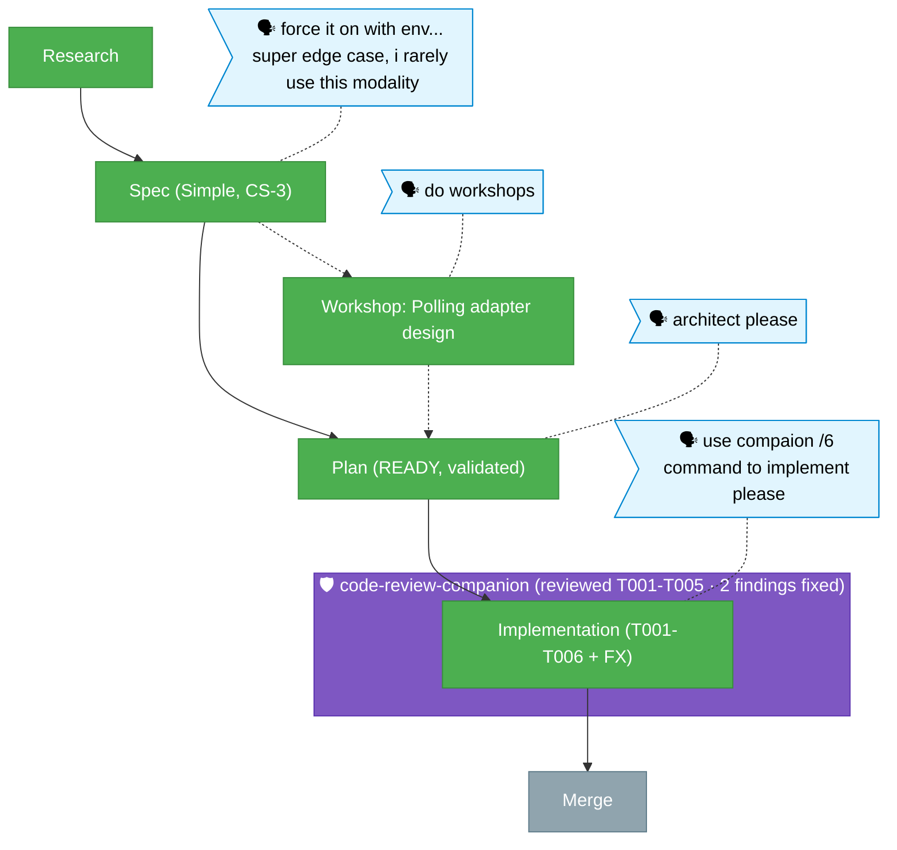

# Flight Plan — watch-polling-fallback

**Legend**: 🟩 done · 🟧 in progress · 🟥 blocked · 🟦 known (designed) · ⬜ assumed (speculative) · 🗣 your words · 🛡 companion reviewer

_Build complete (commits d31288ee → 38972ecf). Companion reviewed T001-T005; 2 findings (T004 HIGH barrel export, T002 MEDIUM unwatch lifecycle) both fixed. dist rebuilt + `just harness-verify` PASS. tsc 0 / biome clean / 41 watcher tests green. Next: merge (/plan-8)._
