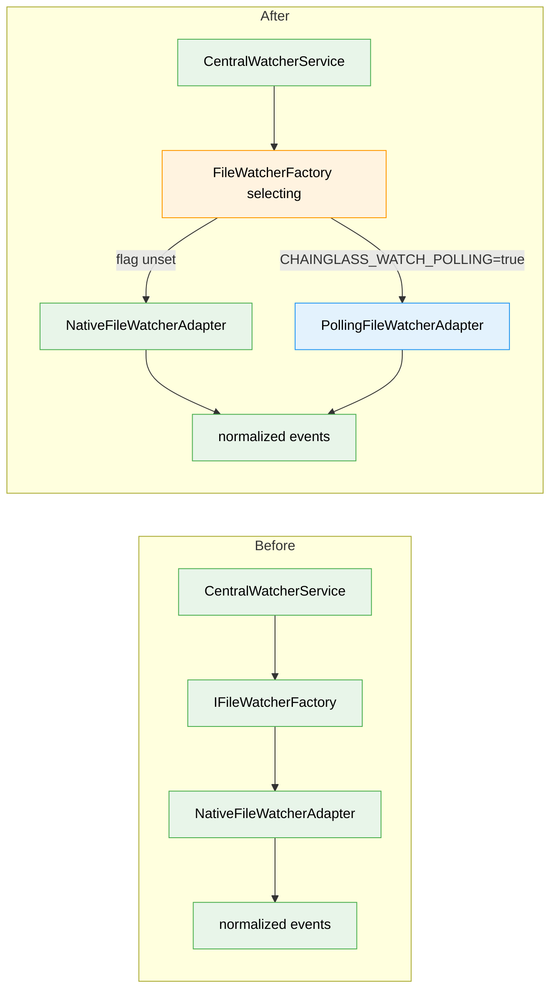

# Workshop: PollingFileWatcherAdapter design

**Type**: Integration Pattern
**Plan**: 085-watch-polling-fallback
**Spec**: [watch-polling-fallback-spec.md](../watch-polling-fallback-spec.md)
**Created**: 2026-06-04
**Status**: Draft

**Value Thesis**: Nails the one non-mechanical part of this feature — the poller's scan/diff
algorithm and its event-shape parity with the native adapter — so the implementation is a
transcription, not a design exercise, and so downstream consumers can't tell which watcher
they're behind.
**Target Proof Level**: Implementation Ready
**Current Proof Level**: Implementation Ready

**Selected Value Axes**:
- **Implementation Readiness**: a developer/agent can build the adapter from this doc with no
  further design decisions — the snapshot model, diff rules, and skeleton are all here.
- **Safety to Change (event parity)**: the adapter must emit the *identical* normalized event
  shape as the native one; this doc makes that contract explicit so the swap is invisible.
- **Proof Quality**: every decision has a rationale; edge cases and test scenarios are tabled.
- **Operational Reliability**: polling has a cost and failure profile (stat storms, slow 9P,
  overlapping scans) — this doc makes those explicit and chooses the mitigations.

**Related Documents**:
- [research-dossier.md](../research-dossier.md) — watcher subsystem survey
- `packages/workflow/src/adapters/native-file-watcher.adapter.ts` — the adapter to match
- `packages/workflow/src/interfaces/file-watcher.interface.ts` — the contract to implement
- `packages/workflow/src/features/023-central-watcher-notifications/source-watcher.constants.ts` — `SOURCE_WATCHER_IGNORED`

**Domain Context**:
- **Primary Domain**: file-watching (workflow package, unregistered) — `060-native-file-watcher`
- **Related Domains**: `_platform/file-ops` (consume — `readdir`/`stat`); no contract changes

---

## Purpose

Specify `PollingFileWatcherAdapter` precisely enough to implement directly: how it walks the
tree, detects changes by snapshot diff, maps those diffs to the existing `IFileWatcher`
events with parity to the native adapter, reuses the ignore list to stay cheap, and how the
factory selects it from an env flag.

## Fresh Entrant Outcome

A fresh human or agent should be able to use this workshop to reach **Implementation Ready**
with no additional context. They should be able to:

- Implement `PollingFileWatcherAdapter` conforming to `IFileWatcher` with correct event parity.
- Wire the env-driven factory selection without touching the native adapter.
- Know exactly which edge cases polling introduces and how each is handled.
- Write the lightweight tests from the provided scenarios.

## Key Questions Addressed

- What is the snapshot model, and what counts as a "change"?
- How do snapshot diffs map to `add` / `change` / `unlink` / `addDir` (and what about `unlinkDir`)?
- How is the ignore list applied so we never stat-walk `node_modules`/`.git`?
- How do we avoid overlapping scans on a slow (9P) filesystem?
- How is `ignoreInitial` honored so startup isn't an event storm?
- Where and how does the env flag select this adapter?

---

## Value Frame

| Field | Selection | Why It Matters |
|-------|-----------|----------------|
| Target Proof Level | Implementation Ready | The feature is small; the only risk is getting the diff/parity subtly wrong |
| Primary Value Axis | Implementation Readiness | Removes all design decisions from the build step |
| Supporting Value Axes | Safety to Change, Proof Quality, Operational Reliability | Parity + evidence + cost/failure clarity |
| Downstream Loop Improved | Implementation + Review | Reviewer checks against an explicit parity contract instead of reconstructing intent |

---

## Overview

The native adapter wraps `fs.watch({recursive:true})` and **normalizes** raw OS events into
`add` / `change` / `addDir` / `unlink`. The polling adapter reaches the **same** normalized
events by a different means: it periodically walks each watched root, builds a snapshot of
`(path → {size, mtimeMs, isDir})`, and **diffs** consecutive snapshots. Same interface, same
events, same ignore semantics — only the detection mechanism differs.



**Legend**: existing (green) | changed (orange) | new (blue)

---

## The contract to implement (recap)

```ts
type FileWatcherEvent = 'add' | 'change' | 'unlink' | 'addDir' | 'unlinkDir' | 'error';

interface IFileWatcher {
  add(paths: string | string[]): void;
  unwatch(paths: string | string[]): void;
  close(): Promise<void>;
  on(event: FileWatcherEvent, cb: (pathOrError: string | Error) => void): this;
}
// Options consumed: ignored, ignoreInitial, interval, usePolling, persistent, awaitWriteFinish
```

**Native adapter behaviors the poller MUST match** (verified against the source):
- New file → `add`; new directory → `addDir`.
- Modified file → `change`.
- Removed path → **`unlink`** — the native adapter emits `unlink` for *any* vanished path
  (file **or** dir; it never tracks type on removal and **never emits `unlinkDir`**).
- `ignoreInitial: true` (production default for both data + source watchers) → emit **nothing**
  for entries that already exist at start.
- `ignored` predicates → compiled the same way (string substring / RegExp / function).

---

## Snapshot model & change detection

```ts
interface Entry {
  mtimeMs: number;
  size: number;
  isDir: boolean;
}
// One snapshot per watched root:
type Snapshot = Map<string /* absolutePath */, Entry>;
```

**A file is "changed" when** `next.mtimeMs !== prev.mtimeMs || next.size !== prev.size`.

**Why both `mtimeMs` and `size`** (Decision D1): `mtimeMs` is the primary signal, but drvfs/9P
can report coarse mtime granularity; including `size` catches edits that land within the same
mtime tick. Together they avoid both false negatives (missed edit) and reliance on sub-second
precision. This is also naturally robust to atomic-rename writes (dossier **PL-02**): the
replacement file reappears with a new mtime/size and is detected as a `change`.

---

## Diff → event mapping (the parity contract)

For each tick, compare `prev` and `next` snapshots:

| Condition | Event | Notes |
|-----------|-------|-------|
| in `next`, not in `prev`, `isDir=false` | `add` | new file |
| in `next`, not in `prev`, `isDir=true` | `addDir` | new directory |
| in both, `isDir=false`, size/mtime differ | `change` | modified file (debounce per `awaitWriteFinish`) |
| in `prev`, not in `next` | `unlink` | removed file **or** dir — matches native; never `unlinkDir` |
| in both, `isDir` flipped (file↔dir) | `unlink` then `add`/`addDir` | path reused as a different type |

Directory `change` (mtime-only, no add/remove of children) is **not** emitted — the native
adapter doesn't surface bare directory modifications as `change` either. Children changes are
detected on their own paths.

---

## Walk strategy

**Decision D2 — full re-walk, no dir-mtime fast-path (v1).** Per the spec's non-goals, each
tick does a full recursive `readdir`+`stat`, pruning ignored directories. The ignore list is
the cost lever, not an optimization layer. (Dir-mtime short-circuit is a documented future
follow-up.)

**Decision D7 — prune at the directory level using the ignore predicates.** Ignored entries
must be skipped **before descending**, not merely filtered from emitted events — otherwise we
would stat all of `node_modules`. Check a directory's absolute path against the compiled
predicates; if it matches, do not `readdir` into it.

**Decision D8 — do not follow symlinked directories.** Use `readdir(root, {withFileTypes:true})`
and treat symlinks as leaf entries (don't recurse) to avoid cycles. This also mirrors that the
native recursive watch doesn't traverse symlink cycles.

**Decision D3 — never run overlapping scans.** A scan is async; on slow 9P a walk can exceed
the interval. A `scanning` guard makes a tick a **no-op if a scan is already in progress**
(skip, don't queue). This self-throttles on slow filesystems — the "don't kill us" guarantee.

---

## Skeleton (implementation-ready)

```ts
import { lstat, readdir, stat } from 'node:fs/promises';
import { join, resolve } from 'node:path';
import type {
  FileWatcherEvent, FileWatcherOptions, IFileWatcher, IFileWatcherFactory,
} from '../interfaces/file-watcher.interface.js';

interface Entry { mtimeMs: number; size: number; isDir: boolean; }
type Snapshot = Map<string, Entry>;

export class PollingFileWatcherAdapter implements IFileWatcher {
  private readonly listeners = new Map<FileWatcherEvent, Set<(p: string | Error) => void>>();
  private readonly snapshots = new Map<string, Snapshot>();   // root -> snapshot
  private readonly ignored: ((absPath: string) => boolean)[];
  private readonly ignoreInitial: boolean;
  private readonly interval: number;
  private readonly persistent: boolean;
  private readonly stabilityThreshold: number;
  private readonly stabilizationTimers = new Map<string, ReturnType<typeof setTimeout>>();
  private timer?: ReturnType<typeof setInterval>;
  private scanning = false;
  private closed = false;

  constructor(options: FileWatcherOptions = {}) {
    this.ignored = compileIgnorePatterns(options.ignored ?? []);   // reuse native adapter's helper
    this.ignoreInitial = options.ignoreInitial ?? false;
    this.interval = options.interval && options.interval > 0 ? options.interval : 1000;
    this.persistent = options.persistent ?? true;
    this.stabilityThreshold =
      options.awaitWriteFinish === true ? 200
      : (options.awaitWriteFinish && typeof options.awaitWriteFinish === 'object')
        ? (options.awaitWriteFinish.stabilityThreshold ?? 200)
        : 0;
  }

  add(paths: string | string[]): void {
    if (this.closed) return;
    for (const p of (Array.isArray(paths) ? paths : [paths])) {
      const root = resolve(p);
      if (this.snapshots.has(root)) continue;
      // Seed baseline; emit only if !ignoreInitial.
      void this.walk(root).then((snap) => {
        if (this.closed) return;
        if (!this.ignoreInitial) {
          for (const [abs, e] of snap) this.emit(e.isDir ? 'addDir' : 'add', abs);
        }
        this.snapshots.set(root, snap);
        // eslint-disable-next-line no-console
        console.log(`[file-watcher] polling ${root} every ${this.interval}ms (CHAINGLASS_WATCH_POLLING)`);
      }).catch((err) => this.emit('error', err instanceof Error ? err : new Error(String(err))));
    }
    this.ensureTimer();
  }

  unwatch(paths: string | string[]): void {
    for (const p of (Array.isArray(paths) ? paths : [paths])) this.snapshots.delete(resolve(p));
    if (this.snapshots.size === 0 && this.timer) { clearInterval(this.timer); this.timer = undefined; }
  }

  async close(): Promise<void> {
    this.closed = true;
    if (this.timer) clearInterval(this.timer);
    for (const t of this.stabilizationTimers.values()) clearTimeout(t);
    this.stabilizationTimers.clear();
    this.snapshots.clear();
    this.listeners.clear();
  }

  on(event: FileWatcherEvent, cb: (p: string | Error) => void): this {
    (this.listeners.get(event) ?? this.listeners.set(event, new Set()).get(event)!).add(cb);
    return this;
  }

  private ensureTimer(): void {
    if (this.timer || this.closed) return;
    this.timer = setInterval(() => void this.tick(), this.interval);
    if (!this.persistent) this.timer.unref();
  }

  private async tick(): Promise<void> {
    if (this.scanning || this.closed) return;           // D3: no overlapping scans
    this.scanning = true;
    try {
      for (const root of [...this.snapshots.keys()]) {
        const next = await this.walk(root);
        if (this.closed) return;
        this.diff(this.snapshots.get(root) ?? new Map(), next);
        this.snapshots.set(root, next);
      }
    } finally {
      this.scanning = false;
    }
  }

  private async walk(root: string): Promise<Snapshot> {
    const out: Snapshot = new Map();
    const visit = async (dir: string): Promise<void> => {
      let entries;
      try { entries = await readdir(dir, { withFileTypes: true }); }
      catch { return; }                                  // EACCES/ENOENT on a dir → skip subtree
      for (const d of entries) {
        const abs = join(dir, d.name);
        if (this.isIgnored(abs)) continue;               // D7: prune before descending
        try {
          if (d.isSymbolicLink()) {                      // D8: don't follow symlinks
            const s = await lstat(abs);
            out.set(abs, { mtimeMs: s.mtimeMs, size: s.size, isDir: false });
          } else if (d.isDirectory()) {
            const s = await stat(abs);
            out.set(abs, { mtimeMs: s.mtimeMs, size: s.size, isDir: true });
            await visit(abs);
          } else {
            const s = await stat(abs);
            out.set(abs, { mtimeMs: s.mtimeMs, size: s.size, isDir: false });
          }
        } catch { /* vanished mid-walk → treat as absent */ }
      }
    };
    await visit(root);
    return out;
  }

  private diff(prev: Snapshot, next: Snapshot): void {
    for (const [abs, e] of next) {
      const before = prev.get(abs);
      if (!before) { this.emit(e.isDir ? 'addDir' : 'add', abs); continue; }
      if (before.isDir !== e.isDir) {                    // file↔dir reuse
        this.emit('unlink', abs);
        this.emit(e.isDir ? 'addDir' : 'add', abs);
      } else if (!e.isDir && (before.mtimeMs !== e.mtimeMs || before.size !== e.size)) {
        this.emitChange(abs);
      }
    }
    for (const abs of prev.keys()) if (!next.has(abs)) this.emit('unlink', abs);  // file or dir
  }

  private emitChange(abs: string): void {                // mirror native awaitWriteFinish debounce
    if (this.stabilityThreshold <= 0) { this.emit('change', abs); return; }
    clearTimeout(this.stabilizationTimers.get(abs));
    this.stabilizationTimers.set(abs, setTimeout(() => {
      this.stabilizationTimers.delete(abs);
      this.emit('change', abs);
    }, this.stabilityThreshold));
  }

  private isIgnored(abs: string): boolean { return this.ignored.some((fn) => fn(abs)); }
  private emit(event: FileWatcherEvent, p: string | Error): void {
    for (const cb of this.listeners.get(event) ?? []) { try { cb(p); } catch { /* isolate */ } }
  }
}
```

> `compileIgnorePatterns` is the same logic the native adapter has (`native-file-watcher.adapter.ts:221-231`).
> **Decision**: extract it into a shared module (e.g. `ignore-patterns.ts`) and import from both
> adapters, rather than duplicating — keeps the two watchers' ignore semantics identical.

---

## Factory selection (the env seam)

**Decision D10 — a thin *selecting* factory; leave `NativeFileWatcherFactory` untouched.**
This keeps each adapter single-responsibility and makes the DI swap one line. The env is read
once at construction.

```ts
export class FileWatcherFactory implements IFileWatcherFactory {
  private readonly forcePolling: boolean;
  private readonly envInterval?: number;

  constructor(env: NodeJS.ProcessEnv = process.env) {
    this.forcePolling = env.CHAINGLASS_WATCH_POLLING === 'true';
    const raw = Number(env.CHAINGLASS_WATCH_POLL_INTERVAL);
    this.envInterval = Number.isFinite(raw) && raw > 0 ? raw : undefined;   // AC5: invalid → undefined
  }

  create(options: FileWatcherOptions = {}): IFileWatcher {
    const usePolling = options.usePolling ?? this.forcePolling;            // explicit option wins
    if (usePolling) {
      return new PollingFileWatcherAdapter({
        ...options,
        interval: options.interval ?? this.envInterval ?? 1000,
      });
    }
    return new NativeFileWatcherAdapter(options);
  }
}
```

**DI change** (`apps/web/src/lib/di-container.ts` ≈592-595): swap the registered factory from
`new NativeFileWatcherFactory()` to `new FileWatcherFactory()`. That single line is the entire
production wiring. `NativeFileWatcherFactory` stays for direct/test use.

---

## Decision Space

| Option | Description | Pros | Cons | Decision |
|--------|-------------|------|------|----------|
| Change detection: mtime only | Compare `mtimeMs` | Cheapest | Misses same-mtime edits on coarse 9P | Rejected |
| Change detection: mtime + size | Compare both | Robust on 9P; atomic-rename safe | Negligibly more work | **Selected** |
| Walk: full re-walk | readdir+stat each tick, prune ignored | Simple, correct | More stat calls | **Selected (v1)** |
| Walk: dir-mtime short-circuit | Descend only changed dirs | Cheaper | More complex; deferred per spec | Rejected (v1) |
| Factory: branch in NativeFactory | Add env branch in existing factory | Smallest file count | Misnomer (native factory returns poller) | Rejected |
| Factory: new selecting factory | `FileWatcherFactory` delegates | Clean SRP; 1-line DI swap | One new small class | **Selected** |
| Overlap: queue ticks | Run every interval regardless | Max responsiveness | Stat storms / pile-up on slow FS | Rejected |
| Overlap: skip-if-busy | Guard flag | Self-throttling | Effective interval ≥ scan time on slow FS (acceptable) | **Selected** |

---

## Edge cases

| # | Case | Handling |
|---|------|----------|
| E1 | Startup with `ignoreInitial:true` (production) | First walk seeds baseline, emits nothing |
| E2 | Startup with `ignoreInitial:false` | First walk emits `add`/`addDir` for every entry (native parity) |
| E3 | Sub-interval churn (create+delete within one tick) | Invisible — inherent polling limitation; **documented**, acceptable for this use case |
| E4 | Atomic-rename write | Detected as `change` via new mtime/size (PL-02) |
| E5 | Path reused as different type (file↔dir) | `unlink` then `add`/`addDir` |
| E6 | Directory deleted with children | `unlink` for the dir and each former child (per-path, native-compatible) |
| E7 | `EACCES`/`ENOENT` on a dir mid-walk | Skip that subtree; no `error` storm; root-level failure → single `error` |
| E8 | Symlinked directory (possible cycle) | Not followed; recorded as a leaf entry |
| E9 | Slow 9P scan > interval | `scanning` guard skips overlapping ticks; effective interval stretches |
| E10 | Invalid `CHAINGLASS_WATCH_POLL_INTERVAL` | Falls back to default 1000ms without error (AC5) |
| E11 | `persistent:false` | `timer.unref()` so it doesn't hold the process open |

---

## Attention Reduction

| Future Loop | Before Workshop | After Workshop |
|-------------|-----------------|----------------|
| Implementation | "how does a poller map to these events?" inferred | Diff→event table + working skeleton |
| Review | reviewer reconstructs parity intent | Explicit parity contract to check against |
| Testing | testers invent scenarios | Edge-case + scenario tables provided below |

---

## Test scenarios (Lightweight)

Real temp-dir filesystem; `FakeFileWatcher` not needed for the poller itself (it *is* the impl).

| ID | Scenario | Assert |
|----|----------|--------|
| T-add | Create a file in a watched temp dir | `add` fires with its abs path within ~interval |
| T-change | Append to that file | `change` fires; size/mtime diff detected |
| T-unlink | Delete that file | `unlink` fires |
| T-addDir | `mkdir` a subdir | `addDir` fires |
| T-ignore | Create `node_modules/x` under the root (with `SOURCE_WATCHER_IGNORED`) | **no** event; dir not walked |
| T-initial | Pre-populate files, start with `ignoreInitial:true` | no events on first interval |
| T-interval | Set `CHAINGLASS_WATCH_POLL_INTERVAL=250` | event latency tracks the override |
| T-factory-native | Flag unset → `create()` | returns `NativeFileWatcherAdapter` |
| T-factory-poll | `CHAINGLASS_WATCH_POLLING=true` → `create()` | returns `PollingFileWatcherAdapter` |
| T-factory-badint | invalid `*_POLL_INTERVAL` | adapter uses 1000ms default |

---

## Validation / Acceptance

This workshop reaches Implementation Ready when:
- The diff→event table covers every spec acceptance criterion (AC1–AC7) — ✅ mapped.
- The skeleton conforms to `IFileWatcher` signatures exactly — ✅ (matches the read interface).
- Every polling-specific edge case has a stated handling — ✅ (E1–E11).
- The factory selection is specified down to the one-line DI change — ✅.

## Open Questions

### Q1: Default interval value?
**RESOLVED**: 1000ms for v1 (balances responsiveness vs 9P stat cost). Tunable via env.
Revisit only if real use shows it's too slow/expensive.

### Q2: Apply `awaitWriteFinish` debounce, given the interval already coalesces?
**RESOLVED**: Yes — reuse the native adapter's per-path debounce for parity and to honor the
option, even though at a 1000ms interval it's largely redundant. Cheap, and keeps the two
adapters behaviorally aligned.

### Q3: Extract `compileIgnorePatterns` to share, or duplicate?
**RESOLVED**: Extract to a shared `ignore-patterns.ts` imported by both adapters — guarantees
identical ignore semantics and avoids drift.
