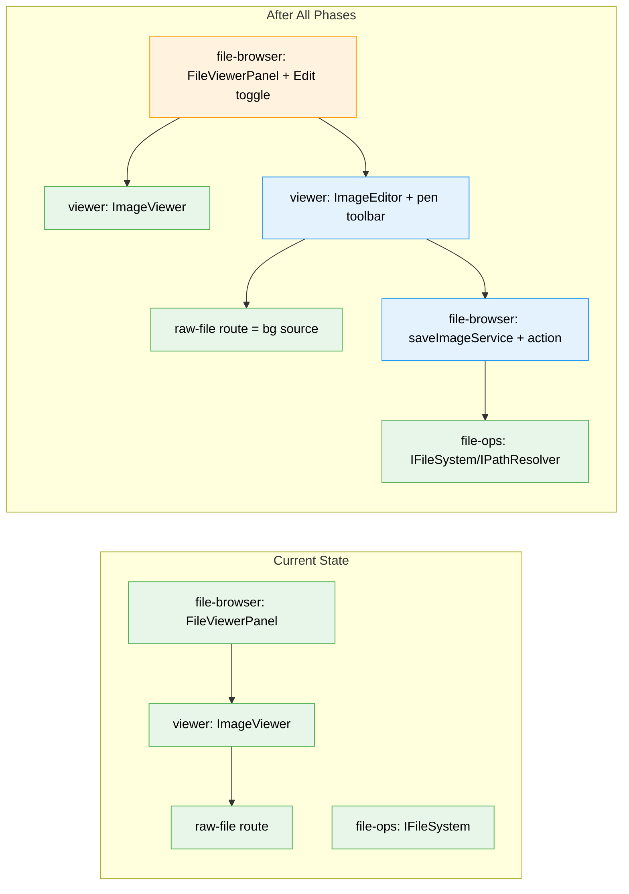

# Flight Plan: In-browser Image Editor (pen / annotation)

**Spec**: [image-editor-spec.md](./image-editor-spec.md)
**Plan**: [image-editor-plan.md](./image-editor-plan.md)
**Generated**: 2026-06-07
**Status**: Complete (landed 2026-06-08)

---

## The Mission

**What we're building**: An **Edit** button on the image viewer. Click it and the image-view area flips inline into a drawing canvas where you scribble freehand **pen** annotations (with a color picker and a couple of stroke widths) right on top of the picture. When you're done you either **Save over** the original or **Save as new** — which writes a `<name>-edited.<ext>` file next to it, replacing any existing `-edited`.

**Why it matters**: Today images are view-only. This turns the viewer into a quick annotation tool — circle the bug, mark up the screenshot — without leaving the app.

---

## Where We Are → Where We're Headed

```
TODAY:                                 AFTER this plan:
Images are view-only                   Images are annotatable

🔵 Select image → ImageViewer ()  🔵 Select image → ImageViewer (same)
❌ No edit affordance                   🔴 "Edit" button (raster images)
❌ No canvas / drawing                  🔴 Inline canvas editor (pen + color + width)
❌ No binary save path from browser     🔴 saveEditedImage action (Buffer, atomic)
🔵 Raw-file route serves bytes         🟢 Raw-file route = canvas background source
```



**Legend**: existing (green, unchanged) | changed (orange, modified) | new (blue, created)

---

## Scope

**Goals**:
- An **Edit** button on the full image view for raster image files (png/jpg/jpeg/gif/webp).
- A client-only, lazy-loaded **inline** canvas editor: freehand pen + color picker + stroke widths.
- **Save over** the original, or **Save as new** → `<name>-edited.<ext>` (replacing existing `-edited`; idempotent suffix).
- Edited file **preserves original format/extension**; saved bytes preserve native resolution.
- Reuse the markdown-editor precedents (lazy mount, toolbar, DI-injectable save, error boundary).

**Non-Goals**:
- Text, shapes, fill, selection, layers, zoom/pan (future).
- Editing SVG as vector (raster-only for now); animated-GIF frames; collaboration.

---

## Journey Map


**Legend**: green = done | yellow = active | grey = not started

---

## Phases Overview

| Phase | Title | Tasks | CS | Status |
|-------|-------|-------|----|--------|
| 1 | Implementation (Simple — single phase) | 19 | CS-4 | ✅ Complete |

_Plan is **READY** (all 7 gates pass). Simple mode → one phase with a 19-task table grouped as: save backend (T001–T006, TDD), canvas editor (T007–T012), integration (T013–T015), browser smoke + bundle verify (T016–T017), docs + domain refresh (T018), optional dep-direction guard (T019). Next: `/plan-6` (no `/plan-5` expansion needed in Simple mode)._

---

## Acceptance Criteria

- [x] Edit control appears for raster images; toggles inline into the canvas editor with the image as background.
- [x] Freehand pen drawing with color picker + stroke widths; smooth pointer/touch input.
- [x] Save over writes back to the original (with mtime-conflict detection).
- [x] Save as new writes `<name>-edited.<ext>`, replacing any existing `-edited` (no `-edited-edited`).
- [x] Edited image preserves the original format/extension and native pixel dimensions.
- [x] Save paths validated via `IPathResolver`; traversal → `PathSecurityError`, no write.
- [x] Saved bytes are valid image bytes (Buffer write, not string `saveFile`).
- [x] Editor + canvas lib are lazy-loaded (`ssr:false`); production build succeeds.

---

## Key Risks

| Risk | Mitigation |
|------|-----------|
| CORS-tainted canvas → `toBlob` throws | Background loads same-origin from raw-file route; verify in build |
| iOS Safari canvas size limit (~4096²/16.7M px) | Pixel-area guard / max-dimension handling |
| Next 15 `ssr:false` from server component breaks build | Wrap dynamic import in a thin client component (Plan 083 pattern) |
| Using string `saveFile` corrupts image bytes | Model save on Buffer-based `uploadFileService` |
| JPEG/WebP re-encode is lossy | Accepted; annotations stay sharp; PNG path lossless |

---

## Flight Log

<!-- Updated by /plan-6 and /plan-6a after each phase completes -->

### Phase 1: Implementation — Complete (2026-06-08)

**What was done**: Shipped the inline pen-annotation image editor end-to-end across all 19 tasks. Raster images gain an **Edit** affordance that swaps the view into a lazy canvas editor (`perfect-freehand` + Canvas 2D); **Save over** (mtime-guarded) and **Save as new** (`<name>-edited.<ext>`, GIF→PNG) persist via a Buffer-safe atomic `saveImageService` + `saveEditedImage` server action.

**Key changes**:
- `_platform/viewer` — `ImageEditor`, `ImageEditorLazy`, `ImageEditorToolbar`, `lib/canvas-coords.ts`, `lib/image-export.ts`; barrel exports.
- `file-browser` — `saveImageService`, `image-filename`, `saveEditedImage` action; `BinaryFileView` Edit toggle; route `browser-client` save relay.
- `apps/web` — `perfect-freehand` dep.
- Tests — 34 vitest (units + integration + AC-10 bundle guard + dep-direction guard) + Playwright+CDP browser smoke (desktop+tablet).
- Docs — `docs/how/image-editor.md` + viewer & file-browser `domain.md` refresh.

**Decisions made**: Conflict dialog placed in the editor (owns bytes+strokes) rather than browser-client, keeping the viewer↛file-browser boundary clean; binary payload crosses the action boundary as base64; GIF exports as PNG (canvas has no GIF encoder). Wired into the **route** `browser-client.tsx` (the plan's `features/.../browser-client.tsx` path doesn't exist).

**Verification**: All 17 ACs met; production build succeeds; browser smoke proved the full stack live (save-as-new wrote `-edited.png`, no `SecurityError`).
