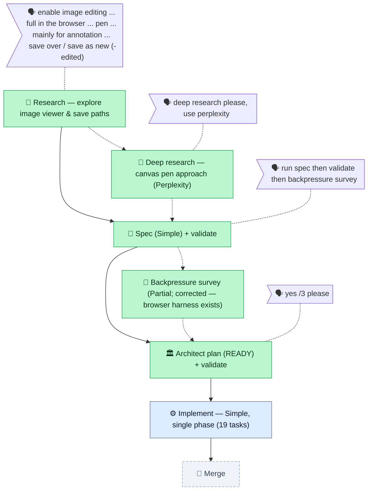

<!-- GENERATED from the-flow.json — do not hand-edit -->
# Flight plan — 086-image-editor

```mermaid
flowchart TD
  classDef done fill:#bbf7d0,stroke:#16a34a,color:#052e16;
  classDef wip fill:#fed7aa,stroke:#ea580c,color:#431407;
  classDef blocked fill:#fecaca,stroke:#dc2626,color:#450a0a;
  classDef known fill:#dbeafe,stroke:#64748b,color:#0f172a;
  classDef assumed fill:#f1f5f9,stroke:#94a3b8,color:#334155,stroke-dasharray:5 3;

  research["🔬 Research — explore image viewer & save paths"]:::done
  spec["📝 Spec (Simple) + validate"]:::done
  plan["🏛 Architect plan (READY) + validate"]:::done
  phase1["⚙️ Implement — Simple, single phase (19 tasks)"]:::known
  merge["🔀 Merge"]:::assumed

  research --> spec --> plan --> phase1 --> merge

  deepCanvas["🔎 Deep research — canvas pen approach (Perplexity)"]:::done
  research -.-> deepCanvas
  deepCanvas -.-> spec

  bp["🧪 Backpressure survey (Partial; corrected — browser harness exists)"]:::done
  spec -.-> bp
  bp -.-> plan

  said1>"🗣 enable image editing ... full in the browser ... pen ... mainly for annotation ... save over / save as new (-edited)"]
  said1 -.- research
  said2>"🗣 deep research please, use perplexity"]
  said2 -.- deepCanvas
  said3>"🗣 run spec then validate then backpressure survey"]
  said3 -.- spec
  said4>"🗣 yes /3 please"]
  said4 -.- plan

  %% Legend: 🟩 done · 🟧 in_progress · 🟥 blocked · 🟦 known · ⬜ assumed · 🗣 user input
```
