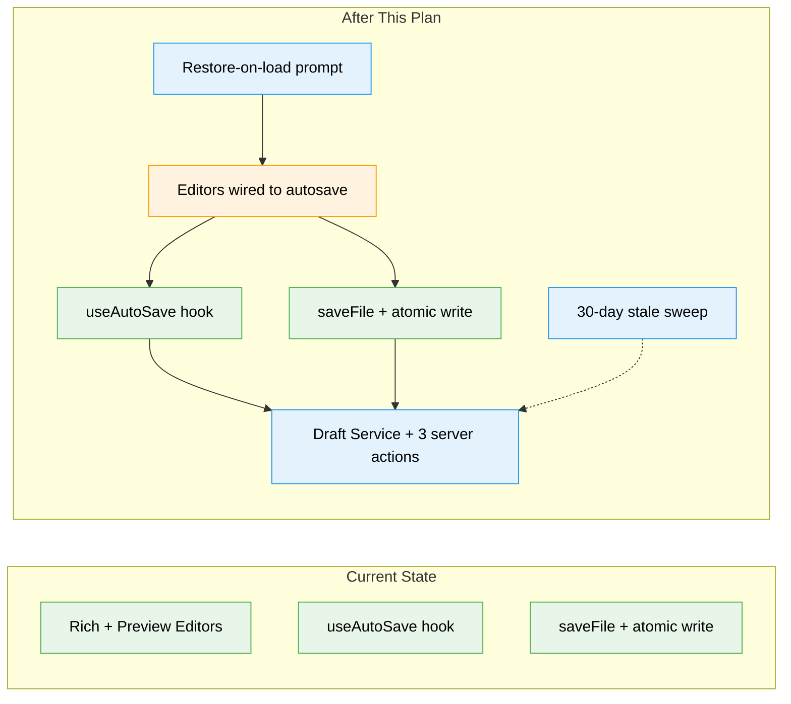

# Flight Plan: Auto-Save for File Editing

**Spec**: [auto-save-editing-spec.md](./auto-save-editing-spec.md)
**Plan**: Pending — run `/plan-3`
**Generated**: 2026-06-08
**Status**: Specifying

---

## The Mission

**What we're building**: While you edit a file in either the rich (WYSIWYG) or preview (source) editor, your in-progress work is quietly auto-saved to a private draft — never to the file itself. When you explicitly save, the real file is written atomically and the draft is cleared. If you crash, close the tab, or navigate away with unsaved edits, the next time you open that file the editor offers to restore your draft into the editor (without touching the file until you choose to save).

**Why it matters**: Users stop losing in-progress edits to crashes and accidental navigation — with zero risk of silently overwriting their actual files.

---

## Where We Are → Where We're Headed

```
TODAY:                                  AFTER this plan:
Manual save only, no recovery           Autosave-to-draft + crash recovery

🔵 useAutoSave hook (058)               🔵 useAutoSave hook (reused as-is)
🔵 Atomic write tmp→rename              🔵 Atomic write (reused as-is)
🔵 saveFile + mtime conflict            🔵 saveFile + mtime conflict (reused, backstop)
🔵 Rich + preview editors               🟡 Editors wired to autosave-to-draft
❌ No draft store                        🔴 Draft store + 3 server actions (NEW)
❌ No crash recovery                     🔴 Restore-on-load prompt + decision tree (NEW)
❌ Edits lost on crash                   🔴 30-day stale-draft sweep (NEW)
```



**Legend**: existing (green, unchanged) | changed (orange, modified) | new (blue, created)

---

## Scope

**Goals**:
- Auto-save in-progress content at idle intervals in both rich and preview modes — to a draft, never the target.
- Explicit save → atomic target write (existing `saveFile`) → delete draft.
- On load, if a draft differs from disk, offer Restore / Discard; Restore loads into the editor only.
- Restore can never silently clobber external edits (mtime conflict guard is the backstop).
- Drafts never trigger the file-watcher tree-refresh loop.

**Non-Goals**:
- No change to the explicit-save path, atomic write, or conflict dialog (reused unchanged).
- No client-only (`sessionStorage`) draft store in v1.
- No autosave for binary / oversized files.
- No shared `packages/shared` `IDraftService` in v1 (file-browser service only).
- No live diff/merge UI beyond the existing 3-way conflict dialog.

---

## Journey Map


**Legend**: green = done | yellow = active/next | grey = not started

---

## Phases Overview

_Phases not yet generated — run `/plan-3` to architect the implementation plan._

Indicative task clusters from the spec (Simple mode, single phase):
1. Draft service + `saveDraft`/`readDraft`/`deleteDraft` server actions (TDD, FakeFileSystem)
2. Autosave wiring into both editors via `useAutoSave` with a draft `saveFn`
3. Restore-on-load prompt + decision tree
4. Explicit-save → `deleteDraft` + session-start 30-day sweep
5. `docs/how/` guide

---

## Acceptance Criteria

- [ ] AC-1: Autosave writes to a draft in both modes; target mtime unchanged.
- [ ] AC-2: No `file-changes`/tree-refresh event fires on an autosave draft write.
- [ ] AC-3: Explicit save atomically writes the target and deletes the draft.
- [ ] AC-4: Draft differing from disk → Restore/Discard prompt before edit; Restore loads editor-only.
- [ ] AC-5: Draft equal to disk → silently deleted, no prompt.
- [ ] AC-6: After Restore, next explicit save uses live disk mtime; changed-on-disk → conflict dialog.
- [ ] AC-7: A draft from a session that ended without save is offered on next load.
- [ ] AC-8: Draft server actions `requireAuth()` + `resolvePath()` fail-closed; ENOENT delete = ok.
- [ ] AC-9: Autosave gated off for binary / oversized files.
- [ ] AC-10: Switching files flushes/resets draft state keyed by `filePath` (no cross-file leak).
- [ ] AC-11: Session-start sweep deletes drafts older than 30 days.

---

## Key Risks

| Risk | Mitigation |
|------|-----------|
| External edit under a draft → silent clobber | Restore loads editor-only; explicit-save mtime guard is the backstop; restore advisory on mtime drift. |
| Draft write trips the file-watcher loop | Drafts under `.chainglass` (source-watcher excluded, ADR-0008); confirm data-watcher scope (Q1); AC-2 verifies. |
| Path traversal / missing auth on draft actions | `requireAuth()` + `resolvePath()` fail-closed before any I/O (086 F003/F004). |
| Binary / oversized files corrupt drafts or churn disk | Gate autosave on `!isBinary && size < cap`. |
| Editor state leaks across file switches | Key autosave/draft state by `filePath`; flush + reset on change. |

---

## Flight Log

<!-- Updated by /plan-6 and /plan-6a after each phase completes -->

_No phases completed yet._
