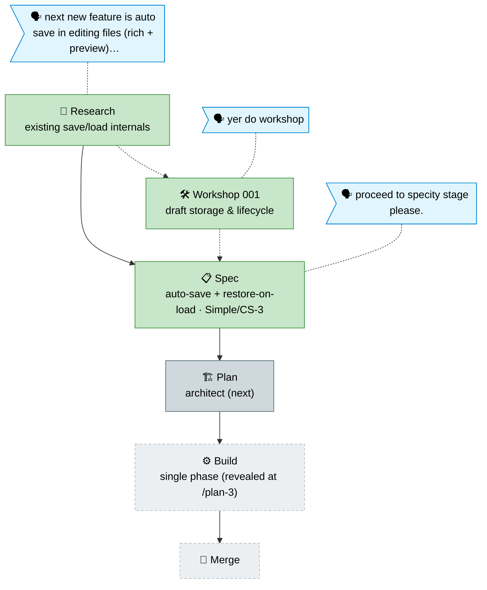

# Flight plan — auto-save-editing

> Generated from `the-flow.json` — do not hand-edit. Mode: **Simple** · Stage: **awaiting-3** (spec done, architect next).

**Legend**: 🟩 done · 🟧 in progress · 🟥 blocked · 🟦 known (designed future) · ⬜ assumed (speculative) · 🗣 your words · dotted = excursion

## Stage notes

- **research** ✅ — ~90% reuse; new surface = draft store + restore-on-load. → `research-dossier.md`
- **workshop-001** ✅ (excursion) — drafts under `.chainglass` (source watcher ignores it, ADR-0008), per-file JSON mirror, restore loads editor-only, `saveFile` mtime guard as backstop. Open Q1: data-watcher scope. → `workshops/001-…md`
- **spec** ✅ — Simple, CS-3 (conf 0.85); 30-day stale-draft sweep; 11 ACs; workshop folded in as authoritative. → `auto-save-editing-spec.md`, `auto-save-editing.fltplan.md`
- **plan** 🟦 next — `/plan-3` architects the single-phase implementation; must confirm Q1 (data-watcher scope) before build.
- **build / merge** ⬜ — revealed once `/plan-3` lands.
