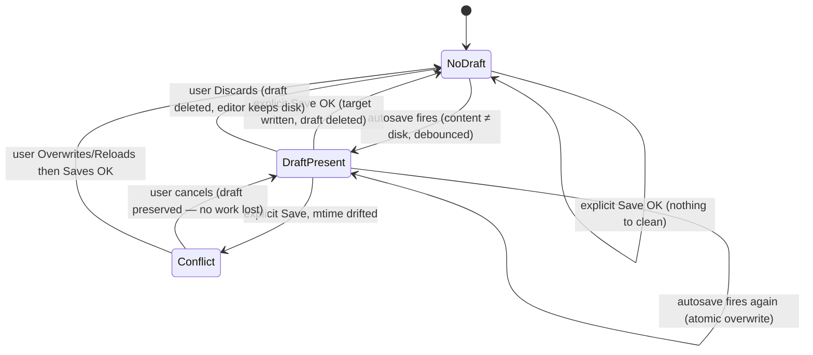
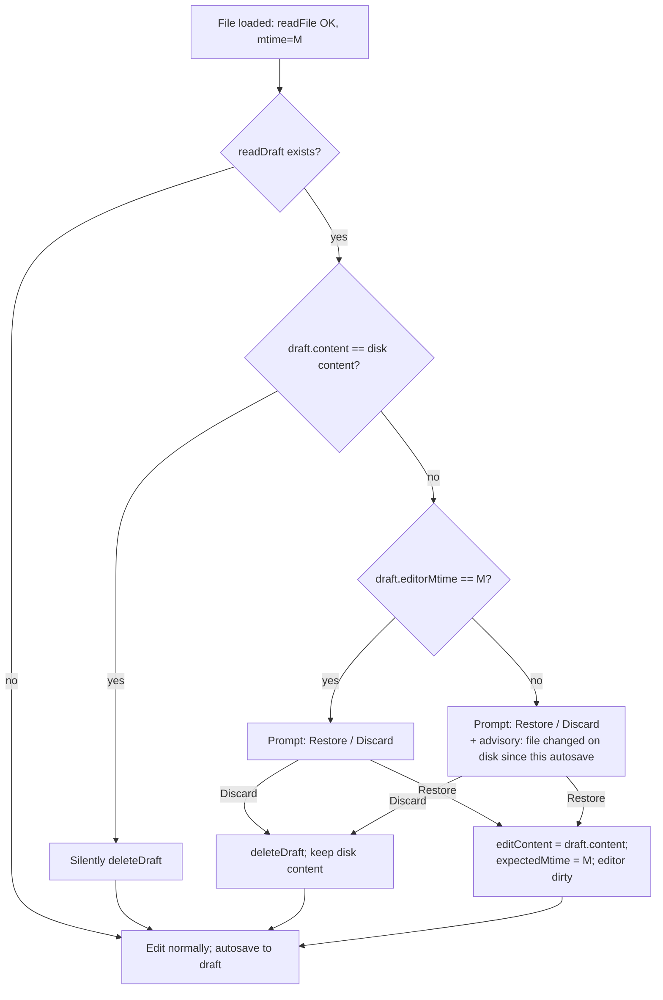

# Workshop: Draft Storage Model & Lifecycle for Auto-Save

**Type**: Storage Design + State Machine
**Plan**: 087-auto-save-editing
**Spec**: _(not yet written — this workshop precedes `/plan-1b`)_
**Created**: 2026-06-08
**Status**: Draft

**Value Thesis**: This workshop turns the single riskiest pair of decisions in the feature — *where drafts live* and *how their lifecycle disambiguates "crashed" from "in-progress"* — into a settled contract, so the spec and architect don't relitigate it and the implementer can't accidentally build a file-watcher feedback loop or a silent data-loss path.
**Target Proof Level**: Contract Ready (→ Implementation Ready for the storage shape + lifecycle)
**Current Proof Level**: Preferred Direction → Contract Ready

**Selected Value Axes**:
- **Implementation Readiness**: leaves the implementer concrete contracts (draft record schema, server-action signatures, draft-path derivation) so coding needs no further design.
- **Safety to Change / Operational Reliability**: pins down crash-recovery semantics, the watcher-loop avoidance, and the conflict backstop so the feature can't silently lose user edits or external changes.
- **Knowability**: makes the implicit "temp exists ⇒ crashed" heuristic explicit and provably correct (load-time check precedes session autosave).
- **Review Compression**: a reviewer can check the implementation against the decision table + state machine here instead of reconstructing intent.

**Related Documents**:
- `docs/plans/087-auto-save-editing/research-dossier.md` (WO-1, WO-2, RK-01…RK-07, KF-01…KF-12)
- `packages/workflow/src/features/023-central-watcher-notifications/source-watcher.constants.ts` (watcher ignore list)
- ADR-0008 (".chainglass is watched separately by data watchers")
- `apps/web/src/features/_platform/hooks/use-auto-save.ts` (reused debounce/status hook)
- `apps/web/src/features/041-file-browser/services/file-actions.ts` (`saveFile`, atomic write, mtime conflict)
- File-notes sidecar precedent: `.chainglass/data/notes.jsonl` + `INoteService`

**Domain Context**:
- **Primary Domain**: `file-browser` (business) — owns load/select, `FileViewerPanel`, restore decision + draft persistence service.
- **Related Domains**: `_platform/viewer` (infra) — provides the reused `useAutoSave` hook + editors; **must not import file-browser**. `_platform/file-ops` — atomic-write substrate (reused, not modified).

---

## Purpose

Decide and specify (1) **where autosave drafts are stored**, (2) the **exact draft lifecycle** (create / overwrite / delete), and (3) the **restore-vs-discard-vs-conflict decision tree** at load time — including how "a draft exists" is disambiguated from a crash vs. a normal in-progress edit, and how drafts avoid the file-watcher refresh loop.

## Fresh Entrant Outcome

A fresh human or agent should be able to use this workshop to reach **Contract Ready** with no additional context. They should be able to:

- State where a draft for `src/foo.md` physically lives and why it won't trip the file watcher.
- Write the `saveDraft` / `readDraft` / `deleteDraft` server actions + service from the signatures here.
- Implement the load-time restore prompt and explain why restoring is always safe (never writes the target).
- Explain, for any sequence of edit/save/crash/external-change events, whether a restore prompt appears and what baseline mtime the next explicit save uses.

## Key Questions Addressed

1. Server-side sibling file vs central `.chainglass/data/` sidecar vs client `sessionStorage`?
2. One draft file per edited file, or a single index? What's in a draft record?
3. How does "temp file exists ⇒ never saved properly" hold up, given a draft also exists during normal editing?
4. How do we avoid drafts triggering the file watcher → tree refresh loop?
5. On restore, what mtime baseline does the next explicit save use, and how do we prevent silently clobbering external edits?
6. When are drafts deleted? How are orphans cleaned up?

---

## Value Frame

| Field | Selection | Why It Matters |
|-------|-----------|----------------|
| Target Proof Level | Contract Ready | Spec + architect can consume contracts directly; no redesign downstream. |
| Primary Value Axis | Implementation Readiness | The storage shape + lifecycle is the bulk of the genuinely-new work. |
| Supporting Value Axes | Safety to Change, Operational Reliability, Knowability | Crash recovery + watcher-loop + conflict semantics are the failure-prone parts. |
| Downstream Loop Improved | Implementation + Review | Implementer builds from contracts; reviewer checks against the state machine. |

---

## Decision Space

### D1 — Where do drafts live? (the pivotal decision)

| Option | Description | Pros | Cons | Decision |
|--------|-------------|------|------|----------|
| **A. Server-side sibling** | `src/foo.md.autosave` next to the file | Matches the literal "temp location next to file" mental model; survives crash; cross-device | **Trips the source watcher** (only `.swp/.swo/~` + ignored-segments are skipped → feedback loop, RK-02); pollutes user tree + `git status`; orphan litter | ❌ Rejected |
| **B. Central `.chainglass/data/` sidecar** | `.chainglass/data/drafts/<mirrored path>.json` | **Source watcher already ignores `.chainglass`** (constants L30) per **ADR-0008**; matches existing `.chainglass/data/` convention (activity-log, pr-view, work-unit-state, file-notes); invisible to user tree + recent feed; carries metadata; survives crash; server-side | A separate **data watcher** covers `.chainglass` — must be scoped away from the drafts subtree (see D5); needs a path-derivation step | ✅ **Selected** |
| **C. Client `sessionStorage`/`localStorage`** | Draft kept in the browser | Zero server I/O; zero watcher interaction; simplest | **Contradicts the ask** ("temp location", "atomic cp", "removes the temp file" are server-side); `sessionStorage` dies on tab close; no server crash recovery; size limits | ❌ Rejected (may complement B as a fast in-memory cache, out of scope v1) |

**Why B wins:** the user's own description is server-side ("temp location", "atomic file update cp", "removes the temp file", "on loading… if temp file exists"). Between the two server-side options, the watcher constants make the call: a sibling file (A) is *watched*; `.chainglass` (B) is *deliberately excluded from the source watcher* and carved out for separate data watching (ADR-0008). B is the home the architecture already built for exactly this kind of state.

### D2 — One draft file per file, or a single index?

| Option | Pros | Cons | Decision |
|--------|------|------|----------|
| Per-file draft (`<mirrored path>.json`) | No whole-index rewrite per autosave; trivial read/delete; natural listing via readDir/glob | Many small files | ✅ **Selected** |
| Single `drafts.jsonl` index | One file | Every autosave rewrites/append-compacts the whole index; large content bloats it; concurrent-edit contention | ❌ Rejected |

### D3 — Draft filename derivation

| Option | Pros | Cons | Decision |
|--------|------|------|----------|
| **Mirror the relative path** under `drafts/` + `.json` | Human-debuggable; reversible (strip prefix/suffix); naturally unique; no hash dep; reuse `mkdir({recursive})` | Deeper nesting | ✅ **Selected** |
| Hash of path (`<sha>.json`) | Flat, short | Opaque; needs collision guard; must store path inside anyway | ❌ Rejected |

`src/foo.md` → `.chainglass/data/drafts/src/foo.md.json`. The draft path is derived **server-side** from the already-`resolvePath`-validated target, so it inherits the sandbox guarantee.

---

## The Draft Record (contract)

```typescript
/** A single autosave draft for one edited file. Stored as JSON at
 *  <worktree>/.chainglass/data/drafts/<relativeFilePath>.json */
export interface AutosaveDraft {
  schemaVersion: 1;
  /** Worktree-relative path of the target file (verification + reverse lookup). */
  filePath: string;
  /** Full editor content — for rich mode this is the ASSEMBLED markdown
   *  (frontmatter + body), identical to what an explicit save would write (KF-08). */
  content: string;
  /** ISO mtime of the TARGET file at the moment the editing session loaded it.
   *  Used to detect whether the disk changed under the draft (advisory). */
  editorMtime: string;
  /** ISO timestamp of this autosave write (staleness + cleanup). */
  savedAt: string;
}
```

## File Layout

```
<worktree>/
└── .chainglass/                 # source watcher ignores this segment (ADR-0008)
    └── data/
        └── drafts/
            ├── README.md            # "auto-generated autosave drafts; safe to delete"
            ├── src/
            │   └── foo.md.json       # draft for src/foo.md
            └── docs/
                └── notes.txt.json    # draft for docs/notes.txt
```

---

## Lifecycle State Machine

A file's draft, from the perspective of one browser editing session.



### Transition Table

| From | To | Trigger | Guard | Action |
|------|-----|---------|-------|--------|
| NoDraft | DraftPresent | autosave debounce elapses | `editContent ≠ fileData.content` and `!isBinary` and `size < cap` | `saveDraft(content, editorMtime=fileData.mtime)` (atomic tmp→rename) |
| DraftPresent | DraftPresent | autosave debounce elapses | dirty | overwrite draft atomically |
| DraftPresent | NoDraft | explicit Save | `saveFile` returns `ok` | `deleteDraft()`; clear autosave status |
| DraftPresent | NoDraft | Discard (restore prompt) | — | `deleteDraft()`; editor keeps disk content |
| DraftPresent | Conflict | explicit Save | `saveFile` → `error:'conflict'` | show existing 3-way conflict dialog; **draft NOT deleted** |
| any | NoDraft | session-start sweep | `savedAt` older than N days | `deleteDraft()` |

**Key invariant:** the draft is deleted **only** on explicit-save success or explicit discard. A `conflict` never deletes the draft — the user's autosaved work survives the conflict dialog.

---

## "Temp exists ⇒ crashed" — why the heuristic holds

The user's heuristic is correct **because of ordering**:

- On a **fresh load**, the current session has not autosaved yet. So any draft found at load belongs to a **previous** session.
- In normal operation a previous session deletes its draft on explicit Save. Therefore a draft surviving to the next load means the prior session ended (crash / tab close / navigation) **with unsaved autosaved edits** — exactly the recover case.

The one nuance the dossier flagged (a draft also exists mid-edit) does **not** break this: mid-edit drafts belong to the *live* session, and the load-time check runs *before* the live session starts autosaving. The check is "does a draft exist at the moment I load this file," not "does a draft ever exist."

**Redundant-draft suppression:** if the found draft's `content === disk content`, the draft is stale-but-harmless (e.g. saved elsewhere). Silently delete it — no prompt. Only prompt when the draft genuinely differs from disk.

---

## Restore Decision Tree (load time)



**Why restore is always safe:** restoring only loads draft content **into the editor** — it never writes the target (the user's explicit rule). The next **explicit** save runs the existing `saveFile` mtime guard, which is the backstop: if the disk changed since `M`, the user gets the existing conflict dialog. So a stale-base restore can never silently clobber external edits — at worst the user makes an informed overwrite choice at save time.

**Baseline mtime after restore:** set the editor's `expectedMtime` to the **live disk mtime `M`** (not `draft.editorMtime`). This makes the conflict guard fire only for changes happening after this load, while the `P2` advisory already warned about the pre-load drift.

---

## Contracts

### Server actions (`apps/web/app/actions/draft-actions.ts`, `'use server'`)

```typescript
// All require auth + fail-closed path validation (086 F003/F004 pattern).
export async function saveDraft(
  slug: string, worktreePath: string, filePath: string,
  content: string, editorMtime: string,
): Promise<{ ok: true } | { ok: false; error: 'security' | 'write-failed' }>;

export async function readDraft(
  slug: string, worktreePath: string, filePath: string,
): Promise<
  | { ok: true; draft: AutosaveDraft | null }
  | { ok: false; error: 'security' | 'read-failed' }
>;

export async function deleteDraft(
  slug: string, worktreePath: string, filePath: string,
): Promise<{ ok: true } | { ok: false; error: 'security' }>;  // ENOENT = ok:true
```

### Service (`apps/web/src/features/041-file-browser/services/draft-file-actions.ts`)

DI: `SHARED_DI_TOKENS.FILESYSTEM`, `SHARED_DI_TOKENS.PATH_RESOLVER`. Mirrors `save-image.ts` structure (testable with `FakeFileSystem`).

```typescript
function draftPathFor(worktreeRoot: string, relFilePath: string): string;
// → `${worktreeRoot}/.chainglass/data/drafts/${relFilePath}.json`

saveDraftFile({ worktreePath, filePath, content, editorMtime, fileSystem, pathResolver })
  // resolvePath(worktreePath, filePath) → validate; derive draftPath;
  // mkdir(dirname, {recursive}); atomic writeFile(tmp)→rename(tmp, draftPath)
readDraftFile({ ... })   // exists? readFile + JSON.parse → AutosaveDraft | null
deleteDraftFile({ ... }) // exists? unlink; swallow ENOENT
```

### Reused, unchanged
- `useAutoSave(saveFn, { delay })` — viewer hook; `saveFn = content => saveDraft(...)`; `flush()` on file switch/unmount.
- `saveFile(...expectedMtime, force)` — explicit save; on `ok` call `deleteDraft`.
- `SaveIndicator` — render autosave status in the toolbar.

---

## Sequence — happy path

```
load foo.md ──readFile──> {content, mtime:M}
            ──readDraft──> null  → edit normally
type… (debounce ~1s) ──saveDraft(content, editorMtime:M)──> .chainglass/data/drafts/src/foo.md.json
type… ──saveDraft (overwrite)──>
⌘S ──saveFile(content, expectedMtime:M)──> atomic tmp→rename foo.md; ok:{newMtime:M2}
   ──deleteDraft──> draft gone; status: Saved
```

## Sequence — crash & recover

```
edit foo.md; autosave wrote draft (editorMtime:M)
<tab closed / crash — no explicit save>
reopen foo.md ──readFile──> {content:disk, mtime:M}
              ──readDraft──> draft (content≠disk, editorMtime==M)
prompt: Restore / Discard
Restore → editor shows draft content (dirty), expectedMtime:M
⌘S ──saveFile(draft, expectedMtime:M)──> ok → deleteDraft
```

---

## Edge Cases & Mitigations (maps to dossier RK-*)

| Case | Handling | Ref |
|------|----------|-----|
| Draft write trips a watcher refresh loop | `.chainglass` excluded from **source** watcher (constants L30); **verify data watcher is scoped away from `…/drafts/`** (see Open Q1) | RK-02 |
| External edit under a draft → silent clobber | Restore never writes target; explicit save's mtime guard is the backstop; `P2` advisory at restore | RK-01, RK-03 |
| Binary / oversized files | Autosave gated on `!isBinary && size < cap` (reuse 5MB / 200KB-rich gates); no draft attempted | RK-04, KF-09 |
| Path traversal via crafted filePath | `resolvePath` before any draft I/O; `requireAuth` on every action | RK-05, KF-10 |
| Orphaned drafts after crash | Atomic rename ⇒ no partial target; session-start sweep of drafts older than N days | RK-06 |
| Editor state leaks across file switch | Key editor/draft hook by `filePath`; `flush()` then reset on path change | KF-06 |
| Rich-mode content loses frontmatter | Draft stores the assembled `onChange` value (frontmatter+body) | KF-08 |
| Restore prompt pops up after user starts typing | Resolve `readDraft` before enabling the edit surface; modal with focus trap | RK-07 |

---

## Attention Reduction

| Future Loop | Before Workshop | After Workshop |
|-------------|-----------------|----------------|
| Implementation | "Where do drafts go? Will they loop the watcher?" inferred per-dev | `.chainglass/data/drafts/<path>.json`, watcher-safe by ADR-0008; contracts given |
| Review | Reviewer reconstructs crash/conflict intent | Check against the state machine + restore decision tree |
| Testing | Invent scenarios | Happy-path + crash-recover + conflict + redundant-draft sequences provided |

---

## Open Questions

### Q1: Does the `.chainglass` **data** watcher react to `…/drafts/` writes? — OPEN (verify in spec/architect)
Source watcher is confirmed to ignore `.chainglass`. ADR-0008 says `.chainglass` is watched *separately* by data watchers. **Action**: confirm the data watcher's subscription scope; if it enumerates all of `.chainglass/data`, either (a) scope it to the specific known files (activity-log.jsonl, pr-view-state.jsonl, …) excluding `drafts/`, or (b) place drafts at `.chainglass/drafts/` (outside `data/`) if the data watcher is `data/`-scoped. Recommended mitigation: **place drafts at `.chainglass/drafts/` and confirm no watcher subscribes there.** _(Decision deferred to architect with this guidance.)_

### Q2: Autosave cadence — RESOLVED
Reuse `useAutoSave` debounce (~1000 ms idle). "Regular intervals" satisfied by debounce-on-idle (saves shortly after typing stops); an optional periodic `flush` can be added later. No fixed wall-clock timer needed for v1.

### Q3: Retention window for the session-start sweep — OPEN (spec)
Proposed default: delete drafts with `savedAt` older than **7 days**. Confirm in spec.

### Q4: `IDraftService` in `packages/shared` vs file-browser-only service — RESOLVED (v1)
Keep it a **file-browser service** (`draft-file-actions.ts`) — only file-browser consumes it, and the viewer↛file-browser rule is preserved (viewer only lends `useAutoSave`). Promote to a shared `IDraftService` later if CLI/agents need drafts.

---

## Validation / Acceptance

This workshop reaches Contract Ready when:

- A draft path can be derived for any target file, and it is provably outside the source watcher's view (cite constants L30 / ADR-0008).
- The `AutosaveDraft` record + the three server-action signatures are sufficient to implement save/read/delete with `FakeFileSystem` tests.
- For each branch of the restore decision tree there is a defined editor outcome and `expectedMtime` baseline.
- Every dossier Critical/High risk (RK-01…RK-05) maps to a handling row here.
- Q1 (data-watcher scope) is the only item the architect must still confirm before build.
