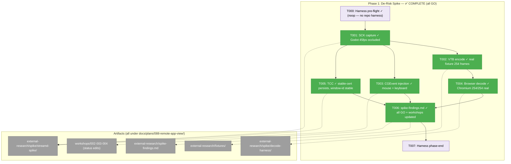
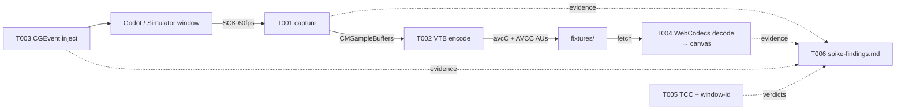
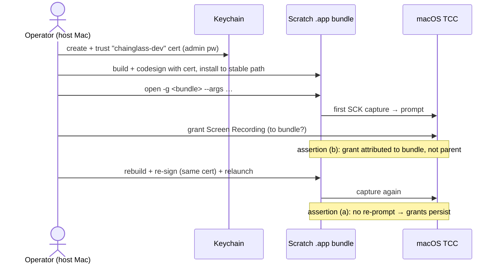

# Phase 1: De-Risk Spike — Tasks & Context Brief

**Plan**: [remote-app-view-plan.md](../../remote-app-view-plan.md) · **Phase**: 1 of 6 · **Spec**: [remote-app-view-spec.md](../../remote-app-view-spec.md)
**Status**: ✅ COMPLETE (2026-06-15) — **GO**: all 7 spike verdicts passed; see [spike-findings.md](../../external-research/spike-findings.md)
**Phase CS**: 3 (bounded scratch work, but every task touches a native API none of this repo has used)

---

## Executive Briefing

**Purpose**: Produce go/no-go evidence for the five load-bearing native assumptions — ScreenCaptureKit capture fidelity, VideoToolbox encode, CGEvent input injection, browser WebCodecs decode, and TCC-grant/window-id persistence — *before any production code is written*. A hard failure here re-scopes the plan before sunk cost (plan § Phase 1 Key risks).

**What We're Building**: Committed scratch code, not product: one small SwiftPM scratch package (capture/encode/inject subcommands), one static HTML WebCodecs decode harness, a recorded H.264 fixture set that seeds Phase 2's frame-replay fake, and `spike-findings.md` answering every spike-shaped workshop question with its consumer named.

**Goals**:
- ✅ Capture evidence: 60fps per-window capture of a live Godot window and a booted iOS Simulator, with occluded / minimized / Space-switch behavior documented (plan 1.1)
- ✅ A replayable AVCC H.264 fixture set committed under `external-research/fixtures/` (plan 1.2 — seed for Task 2.4's fake)
- ✅ Input-injection fidelity matrix for both target apps (plan 1.3)
- ✅ A working Chromium `VideoDecoder` config string; Safari results recorded for backlog (plan 1.4)
- ✅ Yes/no verdicts with evidence for: stable-cert TCC persistence across rebuild, `open -g --args` TCC attribution (Workshop 004 Q1), CGWindowID stability across daemon restart (Workshop 002 §Validation :163) (plan 1.5)
- ✅ `spike-findings.md` + workshop open-question statuses updated, each answer mapped to its consuming task (plan 1.6)

**Non-Goals**:
- ❌ No production daemon code — `native/streamd/` is Phase 4; spike code lives under the plan dir and is never imported by anything
- ❌ No web feature code, no protocol implementation, no Zod schemas (Phase 2)
- ❌ No polish: spike code is throwaway-quality, committed only as evidence/reference
- ❌ No pointer-lock / relative-mouse work (Workshop 003 Q1 — explicitly v1.1, T006 records the deferral)

---

## Prior Phase Context

None — Phase 1 is the first phase. Inputs are the plan, Workshops 001–004, and `external-research/streaming-stack.md` (the Perplexity deep-research synthesis that selected the SCK + VTB + WebCodecs stack — use it as the API-level reference for capture/encode configuration).

---

## Pre-Implementation Check

| File | Exists? | Domain Check | Notes |
|------|---------|-------------|-------|
| `docs/plans/088-remote-app-view/external-research/spike/streamd-spike/` | No → create | plan artifact (remote-view evidence) | SwiftPM scratch executable; outside pnpm/turbo and outside the future `native/streamd/` |
| `docs/plans/088-remote-app-view/external-research/spike/decode-harness/index.html` | No → create | plan artifact | Static HTML+JS; served via `python3 -m http.server`; no build step |
| `docs/plans/088-remote-app-view/external-research/fixtures/` | No → create | plan artifact | Fixture seed — see **Fixture landing path** below |
| `docs/plans/088-remote-app-view/external-research/spike-findings.md` | No → create | plan artifact | Phase deliverable |
| `docs/plans/088-remote-app-view/workshops/002-session-reattach-state-machine.md` | Yes → modify | plan artifact | T006: resolve §Validation :163 (CGWindowID/R6); mark grace-config OPEN (:171) as deliberately deferred |
| `docs/plans/088-remote-app-view/workshops/003-stream-ws-protocol.md` | Yes → modify | plan artifact | T006: mark Q1 pointer-lock (:196-197) as deferred-to-v1.1 (already OPEN (v1.1) — confirm status line names the deferral decision) |
| `docs/plans/088-remote-app-view/workshops/004-daemon-packaging-discovery.md` | Yes → modify | plan artifact | T006: resolve Q1 `open -g` TCC attribution (:155-156) with T005 verdict |

- **No production source files are touched in this phase** — create-only under `docs/plans/088-remote-app-view/`, plus workshop status edits. Domain duplication check: n/a (no new production concepts).
- **Contract changes**: none.
- **Harness availability**: router present (`~/.claude/skills/eng-harness-flow/SKILL.md`) → harness routing available via `/eng-harness-flow`; the implement verb fires the pre-implement seam before any code. Recorded seam outcome: repo has no `.harness/`, so seams route to adoption and noop calmly (`--prompt-optional=false`).

### Fixture landing path (task-expansion decision)

Plan task 1.2 names `protocol/fixtures/` as the fixture *destination*, but that directory lives inside `apps/web/src/features/088-remote-view/`, which Task 2.1 creates — it does not exist during Phase 1. Resolution (consistent with Phase 2's "folds Phase 1 fixtures in when ready"): fixtures land at `docs/plans/088-remote-app-view/external-research/fixtures/` in this phase; **Task 2.4 copies them into `protocol/fixtures/`** when the feature directory exists. The manifest format below is the contract between T002, T004, and Task 2.4.

```
external-research/fixtures/
├── manifest.json          # { codec: "avc1.<hex>", description: "<base64 avcC>",
│                          #   width, height, fps, frames: [{ file, keyframe, ptsMicros }] }
└── frames/
    ├── frame-0001.bin     # one AVCC access unit per file, length-prefixed NAL units
    └── …
```

Ownership after handoff: Task 2.4 copies this set into `protocol/fixtures/` and owns the copy from then on — any format evolution happens there (and in the Task 2.3 schemas), never by mutating this seed.

---

## Architecture Map



---

## Tasks

| Status | ID | Task | Domain | Path(s) | Done When | Notes |
|--------|-----|------|--------|---------|-----------|-------|
| [x] | T000 | **Harness pre-flight** — `/eng-harness-flow --event pre-implement --phase "Phase 1: De-Risk Spike" --plan-dir docs/plans/088-remote-app-view --prompt-optional=false` | — | — | Router envelope handled; verdict narrated verbatim before any spike work | Harness seam (plan 1.0); router installed, repo has no harness → expect calm adoption-track noop |
| [x] | T001 | SCK capture scratch: SwiftPM executable with a `capture` subcommand — enumerate shareable windows (`SCShareableContent`), capture one via `SCContentFilter(desktopIndependentWindow:)` at 60fps (`SCStream` + `minimumFrameInterval`), log per-second delivered-fps + save periodic stills. Run ≥60s against (a) a live Godot project window, (b) a booted iOS Simulator. Document occluded, minimized, and Space-switch behavior | remote-view | `/Users/jordanknight/substrate/084-random-enhancements-3/docs/plans/088-remote-app-view/external-research/spike/streamd-spike/` | 60s capture of each target with a committed per-second fps log (gate: sustained ≥30fps — AC-2 floor; 60fps is the target, record the actual); stills saved to `external-research/spike/captures/`; minimize behavior (frames stop) + restore path confirmed and written down | Plan 1.1 · CS 3 · API reference: `external-research/streaming-stack.md` §capture · 🖐 **Screen Recording grant** on first run (attributed to the invoking terminal app for T001–T003 — that is fine for the spike; T005 tests *bundle* attribution) · raw frames are not committed — T002's encoded output is the durable artifact |
| [x] | T002 | VTB encode: `encode` subcommand piping T001's `CMSampleBuffer`s through a VideoToolbox low-latency H.264 session (P-frames, no B-frames, keyframe-on-demand per streaming-stack.md); dump the `avcC` description + numbered AVCC access units + `manifest.json` (format above) to `external-research/fixtures/` | remote-view | `…/external-research/spike/streamd-spike/`, `…/external-research/fixtures/` | Replayable fixture set committed: manifest (codec string, base64 avcC, dimensions, fps) + numbered frames with keyframe markers; **validated by round-trip — T004 decodes it end-to-end** (the consumer decode is the manifest's acceptance test, no separate schema check) | Plan 1.2 · CS 3 · Feeds Task 2.4 (frame-replay fake) — manifest format is the cross-phase contract; keep one fixture set small (≤10s) for repo hygiene |
| [x] | T003 | CGEvent injection fidelity: `inject` subcommand — post click/drag/scroll/type sequences (`CGEvent` + `CGEventPost`) into the Godot window and the Simulator under focus-follows-stream (activate target app first, as the daemon will); verify Simulator click→tap translation and typed text arrival | remote-view | `…/external-research/spike/streamd-spike/` | Per-app results matrix documented: what lands and what doesn't, for click/drag/scroll/type × {Godot windowed, Godot fullscreen, Simulator} | Plan 1.3 · CS 3 · Workshop 003 input model is the spec for *what* to simulate · 🖐 **Accessibility grant** required before any event posts |
| [x] | T004 | Browser decode harness: static `index.html` + JS — fetch `manifest.json` + frames, configure WebCodecs `VideoDecoder` (`codec` from manifest, `description` from base64 avcC, `optimizeForLatency: true`), render to canvas, log decode timings/drops. Run on Chromium (gating result) and Safari (record-only) | remote-view | `…/external-research/spike/decode-harness/index.html` | Working `avc1.*` config string verified on Chromium with fixture frames rendering on canvas + decode timings logged; Safari results recorded for backlog | Plan 1.4 · CS 2 · Spec clarification: Chromium-gating, Safari informational · serve via `python3 -m http.server` from the fixtures dir |
| [x] | T005 | TCC + lifecycle assertions: (a) create stable self-signed cert "chainglass-dev" (Workshop 004 §cert), build a minimal `.app` bundle around the capture scratch, grant Screen Recording, **rebuild + re-sign with the same cert** → grants persist?; (b) spawn via `open -g <bundle> --args …` → TCC attributes to the bundle, not the parent? (Workshop 004 Q1); (c) capture a window's `CGWindowID`, kill + relaunch the capture process → same id still valid? (Workshop 002 §Validation :163, R6 assumption) | remote-view | `…/external-research/spike/streamd-spike/` (+ scratch bundle script) | Each of the three assertions answered **yes/no with evidence** (commands run + observed System Settings/TCC behavior); on any "no", the workshop-named fallback is selected and recorded | Plan 1.5 · CS 3 · Load-bearing for Phase 4 (4.1 signing) and Phase 5 (5.1 spawn) and Phase 2 (R6 reattach) · the bundle is a **throwaway codesign/TCC test shell** (script + Info.plist around the capture scratch) — not a prototype of the Phase 4 daemon · 🖐 **admin password** for cert create/trust in Keychain; 🖐 grant clicks in System Settings (possibly several rounds — that's the point of the test) |
| [x] | T006 | Write `external-research/spike-findings.md`: one section per question (1.1–1.5) with verdict, evidence, and **consumer mapping** (1.5a cert persistence → Task 4.1 signing; 1.5b `open -g` attribution → Task 5.1 spawn-on-demand fallback; 1.5c window-id → Task 2.5 R6 + 5.1; 1.2 fixtures → Task 2.4; 1.4 config string → Task 3.4; 1.3 matrix → Tasks 4.5). Update workshop statuses: resolve Workshop 004 Q1 (:155) and Workshop 002 §Validation :163 with verdicts; explicitly mark deferred v1.1 items (Workshop 003 Q1 pointer-lock :196, Workshop 002 grace-config :171) as DEFERRED with a pointer to this findings doc | remote-view | `…/external-research/spike-findings.md`, `…/workshops/002-*.md`, `…/workshops/003-*.md`, `…/workshops/004-*.md` | Findings doc committed with one `###` section per question (stable anchors downstream tasks can cite); no stale OPEN markers that the spike answered; every answer names its consuming task; deferrals explicit, not silent; **hard-stop gate: any "no" verdict is surfaced to the user before any Phase 2+ work proceeds — the user makes the re-scope call** | Plan 1.6 · CS 2 · This file is the go/no-go artifact — if any verdict is a hard "no", STOP and surface to the user before Phase 2+ proceeds (plan re-scope decision) |
| [ ] | T007 | **Harness phase-end** — `/eng-harness-flow --event phase-end --plan-dir docs/plans/088-remote-app-view --prompt-optional=false` | — | — | Router envelope handled at phase end | Harness seam (plan 1.z) |

---

## Context Brief

**Key findings from plan**:
- **Finding 02 (Critical)** — the TCC trap is the reason T005 exists: ad-hoc signing resets permission grants every rebuild. The stable self-signed cert + stable install path + `open -g` spawn are the mitigations Workshop 004 pinned; T005 verifies all three *before* Phase 4 builds the real daemon around them.
- **Finding 06 (High)** — the fixture set must eventually run inside the Docker harness container (Phase 3 smoke). That's why fixtures are plain files (JSON manifest + binary frames) with no Node/Swift dependency — anything can replay them.
- **Plan § Phase 1 Key risks** — this phase exists to *find* risks; a hard failure (e.g. SCK can't capture the Simulator usably) re-scopes the plan before sunk cost. T006's go/no-go framing is the mechanism.

**Domain dependencies**: none — this phase consumes no chainglass domains (evidence artifacts only). The platform dependencies are macOS frameworks: ScreenCaptureKit (capture), VideoToolbox (encode), CoreGraphics (`CGEvent`, `CGWindowID`), and browser WebCodecs.

**Domain constraints**:
- Spike code is committed under `docs/plans/088-remote-app-view/external-research/spike/` and must never be imported by production code (it sits outside the pnpm/turbo graph and outside the future `native/streamd/` SwiftPM package).
- The production daemon home is `native/streamd/` (Phase 4, Task 4.1) — do not scaffold it in this phase.

**Environment prerequisites (host Mac)**:
- Swift toolchain (Xcode or CLT), macOS 14+ (SCK `desktopIndependentWindow` filter)
- A Godot project that opens a windowed game (target app A)
- Xcode + a booted iOS Simulator (target app B)
- A Chromium-family browser (gating) and Safari (record-only)

**🖐 Human-required moments (one-time grants on the host Mac — flag to the user before starting)**:

> **This phase is explicitly human-in-the-loop.** The implement agent drives all commands, but macOS TCC dialogs and Keychain prompts can only be answered by a person at the host Mac (physically or via screen sharing) — they cannot be scripted or auto-accepted, by design. Schedule that presence before starting T001; the table below is the complete list, in execution order.

| When | What | Where |
|------|------|-------|
| T001 first run | **Screen Recording** grant for the invoking terminal app (prompt appears once; relaunch the terminal after granting) | System Settings → Privacy & Security → Screen Recording |
| T003 first run | **Accessibility** grant for the invoking terminal app (CGEvent posting silently no-ops without it) | System Settings → Privacy & Security → Accessibility |
| T005 (a) | **Admin password** to create + trust the "chainglass-dev" self-signed cert in Keychain | Keychain prompts during `just streamd-setup`-style script |
| T005 (a)(b) | **Screen Recording grant for the scratch bundle**, then re-grant checks across rebuild — several grant/verify rounds are the test itself | System Settings → Privacy & Security |

**Harness context** (router installed):
- **Entry point**: `/eng-harness-flow --event <seam> [--phase <id>] [--plan-dir <p>] --json` — the single door to the harness; child skills are never named here.
- **Pre-implement seam**: T000, fired by the implement verb before any spike work; verdict narrated verbatim from the envelope. `UNAVAILABLE` is not an error.
- **Phase-end seam**: T007, fired at phase end.
- **Backpressure**: no `backpressure-coverage.md` exists (post-spec seam nooped — repo has no harness); the phase uses the plan's spike/manual verification mode.

**Reusable from prior phases**: none (first phase). **This phase exports to later phases**: the fixture manifest format (→ Task 2.4), the Chromium decoder config string (→ Task 3.4), the cert + bundle scripts (→ Task 4.1's `make-bundle.sh` and `just streamd-setup`), and every T005/T003 verdict (→ Tasks 2.5, 4.4, 4.5, 5.1).

**Verification mode (Hybrid per spec)**: manual/spike — evidence is written observed-behavior records in `spike-findings.md` plus the replayable fixture set; no unit tests in this phase (covered by the plan's Constitution Deviation Ledger).

**Mermaid flow diagram** (evidence pipeline):


**Mermaid sequence diagram** (T005 TCC attribution test):


---

## Discoveries & Learnings

_Populated during implementation by the implement verb._

| Date | Task | Type | Discovery | Resolution | References |
|------|------|------|-----------|------------|------------|
| 2026-06-13 | T002 | insight | VideoToolbox **encode** and WebCodecs **decode** need no Screen Recording grant — only SCK **capture** does | Added a `synth` subcommand driving the same `FixtureEncoder` from generated pixel buffers; validated the fixture contract + decode round-trip while capture stays grant-blocked | encode.swift, synth.swift |
| 2026-06-13 | T004 | insight | `avc1.*` WebCodecs config **requires** the `avcC` `description`; omitting it fails `isConfigSupported` | Manifest carries base64 avcC; decoder config decodes it to `Uint8Array` | decode-harness/index.html |
| 2026-06-13 | T002 | decision | Committed fixture is *synthetic* until capture unblocks | Added additive `source` field (`synthetic-vt`/`sck-capture`); identical shape so Task 2.4/3.4 are source-agnostic; real capture overwrites the seed later | manifest.json, spike-findings.md §1.2 |
| 2026-06-13 | T001/T003/T005 | blocked | macOS TCC grants (Screen Recording, Accessibility) not granted after ~45min polling; requesting process attributes to **tmux** | Staged all code; flagged the exact System Settings entry (tmux) + "choose Later not Quit&Reopen" to user; resumes on grant | execution.log.md § Human-required moments |
| 2026-06-13 | T004 | unexpected-behavior | Safari would not load the harness via `open -a Safari` / AppleScript (0 requests, AppleEvent timeout) | Safari is record-only/non-gating; deferred to backlog per spec Chromium-gating | spike-findings.md §1.4 |
| 2026-06-15 | T001 | gotcha | Bare CLI `SCStream` aborts `CGS_REQUIRE_INIT` — never opens the WindowServer connection a GUI app makes at startup (even via `open`/`launchctl asuser`); `screencapture` works because it inits CG | Bring up headless `NSApplication` (`_ = NSApplication.shared; setActivationPolicy(.prohibited)`) before SCStream/CGEvent. **Carry-forward to Task 4.3** | capture.swift, spike-findings § Cross-cutting |
| 2026-06-15 | T005 | insight | Ad-hoc-signed bundle re-prompts TCC on every rebuild (cdhash DR); stable self-signed cert (`chainglass-dev` + `com.chainglass.streamd`) → grant survives rebuild+resign | Finding 02 confirmed live. Phase 4 (Task 4.1) MUST reuse the exact cert+id | setup-cert.sh, make-bundle.sh, spike-findings §1.5 |
| 2026-06-15 | T005 | gotcha | Apple `security import` rejects OpenSSL-3 default PKCS12 (SHA-256 MAC): "MAC verification failed" | Export with `-legacy -macalg sha1 -keypbe/-certpbe PBE-SHA1-3DES` | setup-cert.sh |
| 2026-06-15 | T001 | insight | SCK is deliver-on-change: a static window (idle iOS Simulator) drops to ~0 fps; an animating game sustains fps | Variable frame rate is normal; encoder keyframe-on-demand + HUD must handle it. **Carry-forward to Tasks 4.3/3.4** | spike-findings §1.1 |
| 2026-06-15 | T003 | gotcha | Keyboard injection drops silently unless the target is the key window at post time; a focus-changing event between click and type breaks it | Activate + click to focus immediately before typing; keep streamed window key. **Carry-forward to Task 4.5** | inject.swift, spike-findings §1.3 |

**Types**: `gotcha` | `research-needed` | `unexpected-behavior` | `workaround` | `decision` | `debt` | `insight`

---

## Directory Layout

```
docs/plans/088-remote-app-view/
├── remote-app-view-plan.md
├── remote-app-view-spec.md
├── workshops/001–004 (003/002/004 get status edits in T006)
├── external-research/
│   ├── streaming-stack.md            # existing — API reference for T001/T002
│   ├── spike/
│   │   ├── streamd-spike/            # T001/T002/T003/T005 SwiftPM scratch
│   │   └── decode-harness/           # T004 static HTML
│   ├── fixtures/                     # T002 output → Task 2.4 input
│   └── spike-findings.md             # T006 — the phase deliverable
└── tasks/phase-1-de-risk-spike/
    ├── tasks.md                      # this file
    └── execution.log.md              # created by the implement verb
```

---

## Validation Record (2026-06-13)

### Validation Thesis

**Raison d'être**: Expand plan Phase 1 (De-Risk Spike) into an executable dossier so the implement verb can run the spike without re-reading the plan/workshops or re-deriving decisions; pin landing paths and the fixture contract; surface human-in-the-loop TCC moments in advance.

**Value claim**: Spike implementation becomes turnkey while preserving the spike's purpose — go/no-go evidence for capture/input/decode/TCC/window-id *before* production code exists.

**Proof target**: Implementation. **Thesis source**: remote-app-view-plan.md § Phase 1 + the stage-5 verb contract. Not inferred.

| Agent | Lens | Issues | Verdict |
|-------|------|--------|---------|
| Source Truth | Workshop line anchors, plan fidelity, file existence, API claims vs streaming-stack.md | 0 — all anchors verified (W002:163/:171, W003:196-197, W004:155-156; Findings 02/06; external-research contents; native/streamd absent) | ✅ |
| Cross-Reference + Completeness | Plan↔dossier mapping, dependency chain, implement-agent completeness, CS challenge | 1 MEDIUM fixed (T006 consumer label: 1.5b spawn fallback consumer is Task **5.1**, not 4.4 — plan 1.6 example corrected too) | ⚠ → ✅ |
| Thesis Alignment | 9 thesis failure modes | 2 HIGH fixed (T001 fps gate quantified to AC-2 floor; T005 bundle scoped as throwaway codesign shell, not daemon prototype), 3 MEDIUM fixed (T002 round-trip-as-validation explicit; human-in-the-loop scoping stated; fixture ownership-after-handoff rule), 1 LOW fixed (T006 hard-stop gate moved into Done When) | ⚠ → ✅ |
| Forward-Compatibility | 5 FC failure modes across 6 named consumers | 0 — full matrix ✅ (stage-6 implement, Task 2.4 manifest contract, 2.5/5.1 window-id verdict, 3.4 decode config, 4.1/4.5/5.1 verdicts, workshop anchors) | ✅ |

**Thesis verdict**: understood (Yes, from plan § Phase 1); value claim advanced (Yes — post-fix); proof level Target = Implementation, Actual = Implementation (the *spike's own verdicts* are the contingency, by design); evidence quality Strong post-fix. Main risk: go/no-go is a human decision — now an explicit hard-stop gate in T006's Done When.

**Outcome alignment** (Forward-Compatibility agent, verbatim): The dossier advances the spec Outcome verbatim: "a live, interactive stream of ONE desktop app window … viewable and clickable from the browser. … The terminal keeps working over or beside it. Agents can list windows, attach, and detach via chainglass commands so they can hand the user a running app" — through T001 (capture evidence), T002 (replayable fixtures), T003 (input injection proving "clickable"), T004 (browser decode proving "viewable"), T005 (CGWindowID + TCC proving "attach/detach"), and T006 (no silent blockers for downstream).

**Standalone?**: No — six concrete downstream consumers enumerated.

Overall: VALIDATED WITH FIXES (7 fixes applied: 6 dossier edits + 1 plan example-label correction)
