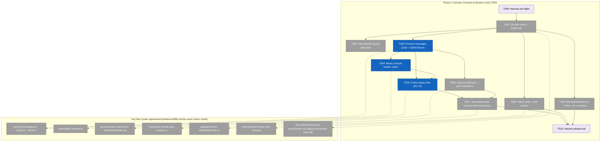
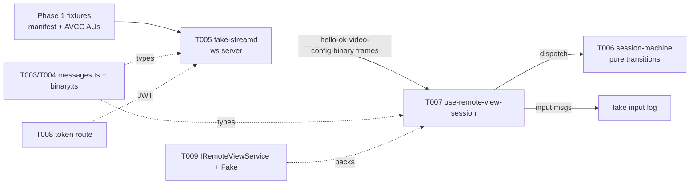

# Phase 2: Domain, Protocol & Session Core (TDD) — Tasks & Context Brief

**Plan**: [remote-app-view-plan.md](../../remote-app-view-plan.md) · **Phase**: 2 of 6 · **Spec**: [remote-app-view-spec.md](../../remote-app-view-spec.md)
**Status**: ⏳ NOT STARTED — VALIDATED WITH FIXES (2026-06-15); awaiting human GO
**Phase CS**: 4 (large — new domain, two state machines from the race matrix, a wire protocol with codec round-trips, a first-class fake, and the frozen-contract token route; all strictly TDD)

---

## Executive Briefing

**Purpose**: Stand up the entire **web side** of the remote-view feature with **no daemon present** — the protocol, the frame-replay fake, the session state machine, and the token route — all green under test. This is the AC-12 foundation: the full feature must run and pass tests against the fake before a single byte of Swift exists. It also pins the WS protocol contract that the Phase 4 Swift daemon mirrors, so the two build tracks proceed in parallel without coordination.

**What We're Building**: The `remote-view` domain (its first production code), registered in the domain registry/map. A Zod-typed wire protocol (`protocol/messages.ts`) + a 16-byte binary video-frame codec (`protocol/binary.ts`), both round-trip-tested, with a canonical JSON fixture set that doubles as the cross-language drift guard for Swift (Task 4.2). A first-class frame-replay **fake** (`testing/fake-streamd.ts`) — a real `ws` server speaking the full protocol, replaying the Phase 1 fixtures, scriptable to emit every Workshop 002 race cue. The session state machine (shared pure transitions + a React reconnect hook) passing Workshop 002's R1–R9 race matrix against the fake. The NextAuth-gated token route copying the terminal route's frozen HKDF contract, with committed auth test vectors. And the `IRemoteViewService` interface + `FakeRemoteViewService` + DI registration + contract suite.

**Goals**:
- ✅ `remote-view` domain created and registered (domain.md with `§ Concepts` per ADR-0011; row in registry.md; node+edges in domain-map.md); feature dir `apps/web/src/features/088-remote-view/` exists
- ✅ Dep-direction guard green (test-first): `_platform` never imports `remote-view`
- ✅ Every Workshop 003 message has a Zod schema; codec round-trips green; canonical JSON fixtures are the cross-language source of truth (consumed by Swift Task 4.2)
- ✅ 16-byte big-endian binary video-frame header encodes/decodes 1:1 to `EncodedVideoChunk` inputs
- ✅ `fake-streamd.ts` drives hello→hello-ok→video-config→keyframe→deltas, honours `request-keyframe`, emits `displaced`/`window-state`/`error` on cue, and logs received `input` messages (AC-12 first-class deliverable)
- ✅ Session FSM passes R1–R9 against the fake; reconnect uses the terminal `wsRef.current !== ws` guard idiom (PL-03)
- ✅ Token route: 401-without-session, 401-without-bootstrap-cookie, correct mint-shape; auth vectors (good + bad JWTs) committed to `test/contracts/remote-view-auth-vectors.json` for Task 4.4 to re-verify
- ✅ `IRemoteViewService` + `FakeRemoteViewService` + DI (`DI_TOKENS.REMOTE_VIEW_SERVICE`, useFactory) + contract suite green

**Non-Goals**:
- ❌ No UI — no picker, no viewport, no canvas, no `view=remote`/`rv` params (all Phase 3); this phase has zero React components beyond the session hook
- ❌ No Swift, no `native/streamd/` (Phase 4); this phase only *pins the contract* the daemon mirrors
- ❌ No real daemon lifecycle — no daemon-manager, reaper, spawn, SSE, GlobalState, CLI/MCP/SDK verbs (all Phase 5); the real `RemoteViewService` adapter joins the contract suite in Phase 5
- ❌ No live capture/decode — the fake replays pre-recorded fixtures; WebCodecs in a real browser is Phase 3 smoke
- ❌ No pointer-lock/relative-mouse (Workshop 003 Q1 — v1.1); no per-session grace config (Workshop 002 Q2 — v1.1)

---

## Prior Phase Context

Synthesized from [Phase 1 tasks.md](../phase-1-de-risk-spike/tasks.md) + [execution.log.md](../phase-1-de-risk-spike/execution.log.md) + [spike-findings.md](../../external-research/spike-findings.md). Phase 1 was a **throwaway de-risk spike** — none of its code is imported here; what crosses the seam is **the fixture set, the verified decoder config, and the verdicts**.

**A. Deliverables**
- **Real captured H.264 fixture set** at `docs/plans/088-remote-app-view/external-research/fixtures/` — `manifest.json` + `frames/frame-NNNN.bin` (254 frames, `avc1.640020`, 800×656, `source: "sck-capture"`). This is Task T005's replay seed (the plan's "synthetic ffmpeg until Phase 1 lands" caveat is **resolved** — a real captured set exists).
- Verified Chromium `VideoDecoder` config: `{ codec: "avc1.640020", description: <base64 avcC → Uint8Array>, optimizeForLatency: true }` — decoded 254/254, zero errors. (Phase 3 Task 3.4 consumes this; in Phase 2 the fake just streams the same fixtures.)
- `external-research/spike-findings.md` (go/no-go, all 7 verdicts GO) and the throwaway `external-research/spike/{streamd-spike,decode-harness}/` scratch (reference only, never imported).

**B. Dependencies Exported (the contract Phase 2 consumes)**
- **Fixture manifest format** (the cross-phase contract): `{ codec, description (base64 avcC), width, height, fps, source, frames: [{ file, keyframe, ptsMicros }] }`; each `frame-NNNN.bin` is **one AVCC access unit** (length-prefixed NALs). Task T005's fake reads this verbatim and maps each frame to the 16-byte binary header + payload.
- **R6 verdict — CGWindowID is stable** across daemon restart (id `34202` valid ~30 min + dozens of restarts). This is the assumption Workshop 002 R6 / Tasks T006–T007 reattach logic rest on; it **holds**, so the "picker-with-toast degrade" path stays a fallback, not the main line.
- Carry-forwards for **later** phases (not Phase 2): stable `chainglass-dev` cert + `com.chainglass.streamd` (→ Phase 4 Task 4.1), `NSApplication` CG-init before SCStream/CGEvent (→ Task 4.3), keyboard focus-before-type (→ Task 4.5).

**C. Gotchas & Debt**
- **SCK is deliver-on-change**: a static window drops to ~0 fps; an animating game sustains. Variable frame rate is normal → the fake should replay at the fixtures' recorded `ptsMicros` (not assume a fixed 30/60fps), and the session machine's "no frame for 2s → `degraded`" timer (Workshop 002) must tolerate legitimately sparse frames. Relevant to T005/T006/T007.
- Companion review did **not** run on Phase 1 (idle-timed-out before pings; throwaway code, low impact) — Phase 2 is the first phase whose code is worth a real companion/review pass.
- Safari decode deferred to backlog (Chromium-gating per spec) — does not affect Phase 2 (no real browser decode here).

**D. Incomplete Items / Blockers carrying forward**
- None block Phase 2. Phase 2 has **no daemon dependency** by design (plan: "green with no daemon").

**E. Patterns to Follow**
- **Fixtures are plain files with no Node/Swift dependency** — anything can replay them (Finding 06: the fake must run inside the Docker harness container in Phase 3). Keep the fake's fixture reader dependency-free (fs + the manifest).
- **Provenance via the `source` field** — `synthetic-vt` vs `sck-capture`; identical shape so consumers are source-agnostic. Task T005 copies the seed into `protocol/fixtures/` and **owns the copy from then on** (per Phase 1's ownership-after-handoff rule) — never mutate the `external-research/` seed.

---

## Pre-Implementation Check

| File | Exists? | Domain Check | Notes |
|------|---------|-------------|-------|
| `apps/web/src/features/088-remote-view/` | No → **create** | remote-view (NEW domain) | T001 creates the feature root; all `protocol/`, `server/`, `hooks/`, `testing/` subdirs land under it |
| `docs/domains/registry.md` | Yes → **modify (additive)** | docs | T001 adds one row: `| Remote View | remote-view | business | — | Plan 088 | active |` |
| `docs/domains/domain-map.md` | Yes → **modify (additive)** | docs | T001 adds node + edges (consumes _platform/auth, events, state, sdk; touches file-browser) |
| `docs/domains/remote-view/domain.md` | No → **create** | docs | T001; ADR-0011 `§ Concepts` table; Owns/Excludes from spec sketch |
| `test/unit/web/architecture/platform-no-remote-view.test.ts` | No → **create** | tests/contract | T002 copies the **mechanism** of `viewer-no-file-browser.test.ts` (exists ✓) |
| `test/unit/web/architecture/viewer-no-file-browser.test.ts` | Yes → **copy-from** | tests | Dep-direction guard precedent |
| `apps/web/src/features/088-remote-view/protocol/messages.ts` | No → **create** | remote-view (contract) | T003 — Zod schemas (zod v4.3.6 installed); `z.discriminatedUnion('t', …)` |
| `apps/web/src/features/088-remote-view/protocol/binary.ts` | No → **create** | remote-view (contract) | T004 — 16-byte big-endian header codec (DataView) |
| `apps/web/src/features/088-remote-view/protocol/fixtures/messages.json` | No → **create** | remote-view (contract) | T003 canonical JSON control-message fixtures (≠ the video AVCC fixtures); Swift Task 4.2 reads this file |
| `apps/web/src/features/088-remote-view/protocol/fixtures/frame-header.json` | No → **create** | remote-view (contract) | T004 cross-language binary-header fixture; Swift Task 4.2 reads this file too |
| `apps/web/src/features/088-remote-view/protocol/fixtures/video/` | No → **create** (copy) | remote-view | T005 copies the Phase 1 video fixture set here (web-internal) and owns it thereafter |
| `apps/web/src/features/088-remote-view/testing/fake-streamd.ts` | No → **create** | remote-view (contract, AC-12) | T005; `ws@8.19.0` installed ✓ |
| `apps/web/src/features/088-remote-view/server/session-machine.ts` | No → **create** | remote-view (internal) | T006 — pure transition functions |
| `apps/web/src/features/088-remote-view/hooks/use-remote-view-session.ts` | No → **create** | remote-view (internal) | T007 — reconnect hook; guard idiom from `use-terminal-socket.ts:111` (exists ✓) |
| `apps/web/app/api/remote-view/token/route.ts` | No → **create** | remote-view (internal) | T008 copies `app/api/terminal/token/route.ts` (exists ✓) verbatim-shape; `aud: 'remote-view-ws'` |
| `apps/web/app/api/terminal/token/route.ts` | Yes → **copy-from** | _platform/auth | Frozen HKDF contract — NextAuth `auth()` + `verifyCookieValue` + `SignJWT` raw Buffer key |
| `apps/web/src/features/064-terminal/server/terminal-auth.ts` | Yes → **copy-from** | _platform/auth | `buildDefaultAllowedOrigins`, `parseAllowedOrigins` (Origin allowlist — Swift mirrors in Task 4.4); ISSUER/AUDIENCE consts pattern |
| `test/contracts/remote-view-auth-vectors.json` | No → **create** | tests/contract | T008 — signed JWTs + expected claims (good + bad); Task 4.4 imports the same file |
| `apps/web/src/features/088-remote-view/server/IRemoteViewService` + `FakeRemoteViewService` | No → **create** | remote-view | T009 interface + fake adapter |
| `apps/web/src/lib/di-container.ts` | Yes → **modify (additive)** | infra | T009 — `DI_TOKENS.REMOTE_VIEW_SERVICE` + useFactory (prod + test); decorators banned (ADR-0004) |
| `test/contracts/remote-view-service.contract.ts` | No → **create** | tests/contract | T009 — contract suite (fake now; real adapter joins in Phase 5) |

- **Contract changes**: introduces new contracts (protocol types, service interface, auth vectors) — no *existing* contract is modified. The only edits to existing files are **additive** (domain registry/map, di-container registration). No `_platform` source is touched.
- **Domain duplication check**: `remote-view` is genuinely new (confirmed: no `088-remote-view` feature dir; not in registry). Concepts (Session, Wire Protocol, Frame-Replay Fake, Viewport Machine) are net-new.
- **Harness availability**: router present (`~/.agents/skills/eng-harness-flow/SKILL.md` ✓). The implement verb fires the pre-implement seam (T000) before any code. Recorded seam outcome (state): repo has no `.harness/` → seams route to adoption and noop calmly (`--prompt-optional=false`). Standard testing (vitest, `fileParallelism: false`) applies.

---

## Architecture Map



---

## Tasks

| Status | ID | Task | Domain | Path(s) | Done When | Notes |
|--------|-----|------|--------|---------|-----------|-------|
| [ ] | T000 | **Harness pre-flight** — `/eng-harness-flow --event pre-implement --phase "Phase 2: Domain, Protocol & Session Core (TDD)" --plan-dir docs/plans/088-remote-app-view --prompt-optional=false` | — | — | Router envelope handled; verdict narrated verbatim before any code | Plan 2.0 · Harness seam — router installed, repo has no harness → expect calm adoption-track noop |
| [x] | T001 | **Domain setup**: create `docs/domains/remote-view/domain.md` (Owns/Excludes from spec sketch + `§ Concepts` per ADR-0011: Session, Wire Protocol, Frame-Replay Fake, Viewport Machine, Token Route); add registry row `\| Remote View \| remote-view \| business \| — \| Plan 088 \| active \|`; add node + edges to `domain-map.md` (consumes _platform/auth·events·state·sdk; touches file-browser); create `apps/web/src/features/088-remote-view/` with `protocol/ server/ hooks/ testing/ params/ sdk/ components/` skeleton dirs | remote-view | `docs/domains/remote-view/domain.md`, `docs/domains/registry.md`, `docs/domains/domain-map.md`, `apps/web/src/features/088-remote-view/` | Registry + map render; domain.md states Owns/Excludes; feature dir exists; `just check` (or docs lint) clean | Plan 2.1 · CS 2 · First task of the first web phase — establishes the domain before any code lands in it |
| [x] | T002 | **Dep-direction guard (test-first)**: create `test/unit/web/architecture/platform-no-remote-view.test.ts` by **re-rooting** the scan mechanism of `viewer-no-file-browser.test.ts` (a single `VIEWER_DIR` recursive collect + import-specifier regex) — recursively scan `apps/web/src/features/_platform/` for any `from '…'` / `import('…')` specifier containing `088-remote-view`; assert zero matches. Include the 5-field Test Doc comment (Finding 06) | remote-view | `test/unit/web/architecture/platform-no-remote-view.test.ts` | Guard green (trivially now; the invariant forever after); scan root is `features/_platform/` recursive (precedent re-rooted), **not** a glob over feature names | Plan 2.2 · CS 1 · Spec Domain Review condition; guard exists *before* the domain has code. Scope = the `_platform/*` feature tree only (the precedent's single-dir mechanism, re-rooted); no separate "platform packages" sweep (none import features) |
| [x] | T003 | **Protocol messages TDD**: write round-trip + parse-rejection tests for **every** Workshop 003 message (`ClientMessage`: hello/input/request-keyframe/pause/resume/client-stats/ping/detach + `InputEvent` variants + `Mods`; `ServerMessage`: hello-ok/video-config/window-state/displaced/stats/pong/error/bye + all 7 `ErrorCode`s) and a canonical JSON fixture file → **then** implement `protocol/messages.ts` (Zod v4 `z.discriminatedUnion('t', …)`, `z.infer` types, parse-at-boundary). Receivers ignore unknown `t`/fields (forward-compat) | remote-view (contract) | `apps/web/src/features/088-remote-view/protocol/messages.ts`, `apps/web/src/features/088-remote-view/protocol/fixtures/messages.json`, `test/unit/web/features/088-remote-view/protocol-messages.test.ts` | All round-trips green; every message type + error code has a fixture entry; unknown-`t` ignored not thrown; the JSON fixture file is the cross-language source of truth | Plan 2.3 · CS 3 · **Tests before impl** (TDD). These **JSON control-message** fixtures (`fixtures/messages.json`) ≠ the **video AVCC** fixtures (`fixtures/video/`, T005). Swift Task 4.2 reads this exact `messages.json`. **zod resolves transitively in `apps/web` (proven by `064-terminal`, which imports `from 'zod'`); pin `zod@^4.3.5` in `apps/web/package.json` to guard the v4 `discriminatedUnion` semantics against hoist drift (v3 deps coexist in the monorepo).** Any protocol change regenerates the JSON **and** binary (T004) fixtures + re-runs T003 + T004 + Task 4.2 suites (drift rule) |
| [ ] | T004 | **Binary codec TDD**: write tests for the fixed 16-byte big-endian video-frame header (Workshop 003 §Binary): `[u8 frameType=0x01][u8 flags(bit0=keyframe)][u16 reserved][u32 sequence][u64 captureTimestampMicros][payload]` → **then** implement `protocol/binary.ts` (`encodeFrameHeader`/`decodeFrameHeader` via `DataView`). Round-trip must map 1:1 to `new EncodedVideoChunk({ type: flags&1?'key':'delta', timestamp: captureTimestampMicros, data: payload })`. Unknown `frameType` → drop silently. Commit a **cross-language** header fixture `protocol/fixtures/frame-header.json` (rows of `{sequence, keyframe, captureTimestampMicros, hex}`) that both this test **and** Swift Task 4.2 read | remote-view (contract) | `apps/web/src/features/088-remote-view/protocol/binary.ts`, `apps/web/src/features/088-remote-view/protocol/fixtures/frame-header.json`, `test/unit/web/features/088-remote-view/protocol-binary.test.ts` | Header encode→decode round-trips for keyframe + delta; big-endian byte layout asserted against the committed `frame-header.json` (not just an in-test constant); u64 timestamp uses BigInt safely; unknown frame-type dropped | Plan 2.3 · CS 2 · u64 micros needs `getBigUint64`/`setBigUint64`; the committed fixture is the **binary drift guard** so Swift Task 4.2 matches byte-for-byte (folded into the T003 drift rule) |
| [ ] | T005 | **Frame-replay fake** (AC-12, first-class deliverable): `testing/fake-streamd.ts` — a Node `ws` server speaking the full protocol. Copy the Phase 1 video fixture set into `protocol/fixtures/video/` (own it from here). On connect: verify presence of `?session&token` (shape only — real verify is the daemon's job), accept `hello` → send `hello-ok` → `video-config` (codec/description/width/height/fps from `video/manifest.json`) → binary keyframe → binary deltas paced at recorded `ptsMicros`. **`hello-ok.window` comes from a pinned descriptor** (the manifest has no window fields) — `{ id: 34202, app: 'Godot', title: 'spike-target', scale: 2, pixelWidth/Height from manifest }` — one source the fake, T009 service, and the Phase 3 picker share. **Model session reattach** (a 2nd `hello` on a live session id → `unwatched`→`streaming`, resume with a fresh keyframe — the R1 substrate). Respond to `ping` with `pong{sentAt,daemonAt}`; emit heartbeat `ping` on a scriptable interval and surface socket-death (R5 substrate). Honour `request-keyframe` (seek next keyframe), `pause`/`resume` (resume ⇒ keyframe). Scriptable cues: `displaced`, `window-state`, `error`, and a drop-simulation (sequence gap / no-frame interval). Record received `input` messages to an inspectable log | remote-view (contract) | `apps/web/src/features/088-remote-view/testing/fake-streamd.ts`, `apps/web/src/features/088-remote-view/protocol/fixtures/video/` (manifest + frames, copied), `test/unit/web/features/088-remote-view/fake-streamd.test.ts` | Fake drives hello→config→keyframe→deltas; reattach resumes a live session with a keyframe; `ping`→`pong` + heartbeat + socket-death observable; `request-keyframe`/`pause`/`resume` honoured; cue API emits each scripted message; drop-simulation produces an observable sequence gap T007's degraded test can assert; input-log captures serialized input; **the fake's own tests pass** | Plan 2.4 · CS 4 · `ws@8.19.0` ✓. Must run inside the Docker harness container (Phase 3 smoke, Finding 06) → keep fixture reader dependency-free. Serial suite (`fileParallelism:false`) → bind an **ephemeral port (`:0`)** and fully close the server in teardown so files don't leak listeners. Real `sck-capture` fixtures exist (Phase 1) — no synthetic fallback needed |
| [ ] | T006 | **Session machine — pure transitions (test-first)**: encode the **ten** Workshop 002 client-side viewport states (`picker/attaching/live/degraded/reconnecting/displaced/windowGone/sessionLost/daemonDown/error`) and the *pure* race rules as failing tests first → **then** implement `server/session-machine.ts` as pure transition functions (no I/O). Cover the deterministic race rules: R3 (`displaced` NEVER auto-reconnects — reclaim is click-only), R7 (attach-while-attaching = last-click-wins, abort in-flight), R9 (switch-away closes clean → `unwatched` not `closed`; explicit detach → `closed`), the `reconnecting`-exhausted fork (health healthy → `sessionLost`; health fails → `daemonDown`), error-code→landing-state mapping (Workshop 003 table → 002 states) | remote-view (internal) | `apps/web/src/features/088-remote-view/server/session-machine.ts`, `test/unit/web/features/088-remote-view/session-machine.test.ts` | Pure-transition tests green for all **ten** states + the R3/R7/R9 + reconnecting-fork + error-mapping rules; no auto-reconnect path reachable from `displaced` (grep-checkable, per Workshop 002 review row) | Plan 2.5 · CS 3 · "shared pure logic" half of plan 2.5. Workshop 002 is authoritative (its viewport chart has 10 states incl. `daemonDown`). Pure = trivially unit-testable, no fake needed here |
| [ ] | T007 | **Reconnect hook (test-first, against the fake)**: encode the *socket-dependent* races as failing tests against the T005 fake → **then** implement `hooks/use-remote-view-session.ts` wiring the T006 reducer to a real WS. Cover R1 (refresh → reattach same session ≤3s, first frame keyframe), R2 (second tab → `displaced` + reclaim), R5 (crashed tab → heartbeat → `unwatched`), R6 (daemon restart → `reconnecting` exhausted → health healthy ⇒ `E_SESSION_UNKNOWN` → `sessionLost` → auto re-create once by `windowId`; health **fails** ⇒ `daemonDown`), degraded/reconnecting backoff (250ms/1s/3s). Reconnect uses the `wsRef.current !== ws` stale-socket guard idiom from `use-terminal-socket.ts:111` (PL-03) | remote-view (internal) | `apps/web/src/features/088-remote-view/hooks/use-remote-view-session.ts`, `test/unit/web/features/088-remote-view/use-remote-view-session.test.ts` | R1/R2/R3/R5/R6/R7/R8/R9 green against the fake (R3/R7/R9 via T006; R1/R2/R5/R6/R8 via live fake socket); **R4 (agent-attach push) is Phase 5 (SSE) — its client half reduces to R2 (latest handshake wins), so it is not separately tested here**; backoff capped at 3 attempts; stale-socket guard prevents cross-attach races | Plan 2.5 · CS 4 · The "client reducer + reconnect" half; depends on T005 fake + T006 reducer. **Drive backoff/heartbeat/degraded timers with `vi.useFakeTimers()`** (advance virtual time — keeps the serial `fileParallelism:false` suite fast, avoids 30s heartbeat waits). R8 (minimize) is a daemon concern → client just blips `degraded`, assert no special handling needed |
| [ ] | T008 | **Token route TDD**: write tests — 401 without NextAuth session, 401 without bootstrap-cookie, 503 if bootstrap-unavailable, correct mint-shape (claims `sub/iss=chainglass/aud=remote-view-ws/iat/exp` 5-min, `{token, expiresIn:300}`) → **then** `app/api/remote-view/token/route.ts` **copying `app/api/terminal/token/route.ts`** with `aud: 'remote-view-ws'` (define `REMOTE_VIEW_JWT_AUDIENCE`) **and dropping the terminal-only `cwd` claim** (remote-view JWTs carry only `sub/iss/aud/iat/exp`), raw HKDF Buffer key to `SignJWT.sign` (no TextEncoder rewrap). Commit auth test vectors (signed JWTs + expected claims, good + bad: expired, wrong-aud, wrong-key) to `test/contracts/remote-view-auth-vectors.json`, **pinning the fixed test HKDF key bytes used to sign** so Task 4.4's Swift verifier reproduces them deterministically (not the live cwd-derived bootstrap key) | remote-view (internal) | `apps/web/app/api/remote-view/token/route.ts`, `test/contracts/remote-view-auth-vectors.json`, `test/unit/web/features/088-remote-view/token-route.test.ts` | Route tests green; vectors file committed **with its pinned signing key**; **Task 4.4 imports the same vectors + key** so the Swift verifier proves byte-identical HKDF | Plan 2.6 · CS 3 · **Finding 03 — frozen contract**: copy, don't redesign. Origin allowlist helpers (`buildDefaultAllowedOrigins`) are consumed by the daemon (Task 4.4), not this route. Cross-origin (the other half of AC-9) is the daemon's job (Task 4.4), not this route |
| [ ] | T009 | **Service interface + DI + contract suite**: define `IRemoteViewService` with a **pinned** session shape `SessionSummary = { sessionId, windowId, app, title, state }` (from `hello-ok.window` + R4/R6 needs) and methods `list(): SessionSummary[]`, `attach(windowId: number): Promise<SessionSummary>`, `detach(sessionId: string): Promise<void>`, `getSession(sessionId: string): SessionSummary \| null` + `FakeRemoteViewService` (backed by the fake's session model, same window descriptor as T005) + register `DI_TOKENS.REMOTE_VIEW_SERVICE` in `di-container.ts` via `useFactory` (prod + test containers; decorators banned, ADR-0004) + write `test/contracts/remote-view-service.contract.ts` running against the fake | remote-view | `apps/web/src/features/088-remote-view/server/remote-view-service.ts` (interface + fake), `apps/web/src/lib/di-container.ts`, `test/contracts/remote-view-service.contract.ts` | Contract suite passes for `FakeRemoteViewService`; DI resolves the token in both containers; the `SessionSummary` shape carries `windowId`+`title` (R4 SSE push + R6 auto-recreate both need them); real adapter slot reserved for Phase 5 | Plan 2.7 · CS 3 · Constitution P2 sequence (interface + fake now, real adapter Phase 5). The contract test is reused **verbatim** against the real adapter in Phase 5 — so the field set is frozen here |
| [ ] | T010 | **Harness phase-end** — `/eng-harness-flow --event phase-end --plan-dir docs/plans/088-remote-app-view --prompt-optional=false` | — | — | Router envelope handled at phase end → noop (repo has no `.harness/`) | Plan 2.z · Harness seam |

> **Testing conventions (apply to every task above)**: each `*.test.ts` carries the **5-field Test Doc comment** (Why / Contract / Usage Notes / Quality Contribution / Worked Example) per Finding 06; contract tests live in `test/contracts/`; the suite runs **serially** (`fileParallelism:false`), so any task standing up a server (T005) binds an **ephemeral port (`:0`)** and fully closes it in `afterEach`/`afterAll` to avoid listener leaks across serial files; T007 drives all timers with `vi.useFakeTimers()`.

---

## Context Brief

**Key findings from plan**:
- **Finding 03 (High)** — auth is **copy-not-design**: the terminal token route (`api/terminal/token/route.ts`, read in full during expansion) is the exact template. Double gate (NextAuth `auth()` → `verifyCookieValue`), then `SignJWT` with the **raw HKDF Buffer key passed directly to jose** (no `TextEncoder` rewrap — FX003: the WS verifier needs byte-identical key bytes). T008 changes exactly one thing: `aud: 'remote-view-ws'`.
- **Finding 06 (High)** — test infra: vitest runs `fileParallelism: false`; every test needs the 5-field Test Doc comment; contract tests live in `test/contracts/`; the frame-replay fake (T005) must run **inside** the Docker harness container in Phase 3 → keep its fixture reader dependency-free.
- **Finding 07 (Medium)** — protocol types stay **in-feature** (`features/088-remote-view/protocol/`), not in `packages/shared`, for v1 (one consumer) — avoids the `@chainglass/*`→`src` vs app→`dist` stale-dist trap (PL-08). No package rebuild needed.
- **Finding 01 (Critical)** — *not* this phase, but noted: the content-area mode switch already exists; Phase 3 extends it. Phase 2 writes zero file-browser code.

**Domain dependencies** (concepts/contracts this phase consumes — from `docs/domains/*/domain.md`):
- `_platform/auth`: bootstrap-code HKDF JWT mint (`verifyCookieValue`, `findWorkspaceRoot`, `getBootstrapCodeAndKey`, `SignJWT`) — **frozen contract**, consumed verbatim by T008 (Finding 03).
- `_platform/auth` (Origin allowlist): `buildDefaultAllowedOrigins`/`parseAllowedOrigins` in `features/064-terminal/server/terminal-auth.ts` — referenced for the daemon's Swift mirror (Task 4.4), not implemented in Phase 2.
- (Deferred to Phase 5, named only:) `_platform/events` (SSE envelope), `_platform/state` (GlobalState), `_platform/sdk` (USDK), `_platform/di` (`useFactory`).

**Domain constraints**:
- **Dependency direction**: `_platform` must NEVER import `remote-view` (T002 guard enforces from line one). `remote-view` may consume `_platform/*` interfaces only.
- **Protocol types are the contract** mirrored in Swift (Task 4.2) — the canonical JSON fixture (T003 `messages.json`) **and the binary-header fixture (T004 `frame-header.json`)** are the drift guards; any change regenerates **both** and re-runs T003 + T004 + Task 4.2 suites. Only these two files cross to Swift; the video set (`fixtures/video/`) is web-internal.
- **DI**: `useFactory` only, decorators banned (ADR-0004); register in both prod and test containers.
- Spike code under `external-research/spike/` must never be imported — Phase 2 production code is entirely fresh.

**Harness context** (router installed at `~/.agents/skills/eng-harness-flow/SKILL.md`):
- **Entry point**: `/eng-harness-flow --event <seam> [--phase <id>] [--plan-dir <p>] --json` — the single door; child skills are never named.
- **Pre-implement seam**: T000, fired by the implement verb before any code; verdict narrated verbatim. `UNAVAILABLE` is not an error.
- **Phase-end seam**: T010, fired at phase end.
- **Backpressure**: no `backpressure-coverage.md` (post-spec seam nooped — repo has no harness); standard vitest testing applies. Recorded outcome: seams route to adoption, `--prompt-optional=false`.

**Reusable from prior phases**:
- The **Phase 1 video fixture set** (`external-research/fixtures/`, real `sck-capture`, 254 frames) → T005 copies into `protocol/fixtures/video/`.
- The verified Chromium decoder config (`avc1.640020` + base64 avcC + `optimizeForLatency:true`) — Phase 3 viewport (Task 3.4); in Phase 2 the fake just replays the matching fixtures.
- Copy-from precedents (verified present): `api/terminal/token/route.ts` (T008), `terminal-auth.ts` (T008 consts/allowlist), `use-terminal-socket.ts:111` guard idiom (T007), `viewer-no-file-browser.test.ts` (T002).

**Mermaid flow diagram** (the contract under test, daemon-absent):


**Mermaid sequence diagram** (R2 displacement — the canonical race, all against the fake):
```mermaid
sequenceDiagram
    participant A as Tab A (viewer)
    participant FAKE as fake-streamd
    participant B as Tab B
    A->>FAKE: WS upgrade (?session&token) + hello
    FAKE-->>A: hello-ok · video-config · keyframe · deltas…
    B->>FAKE: WS upgrade (same session) + hello
    FAKE-->>A: {t:'displaced'} ; close(4002)
    FAKE-->>B: hello-ok · video-config · keyframe…
    Note over A: session-machine → displaced (no auto-reconnect, R3)
    A->>A: user clicks "reclaim" → attaching
```

---

## Discoveries & Learnings

_Populated during implementation by the implement verb._

| Date | Task | Type | Discovery | Resolution | References |
|------|------|------|-----------|------------|------------|

**Types**: `gotcha` | `research-needed` | `unexpected-behavior` | `workaround` | `decision` | `debt` | `insight`

---

## Directory Layout

```
docs/plans/088-remote-app-view/
├── remote-app-view-plan.md
├── external-research/fixtures/          # Phase 1 video seed → T005 copies into protocol/fixtures/
└── tasks/phase-2-domain-protocol-session-core-tdd/
    ├── tasks.md                         # this file
    └── execution.log.md                 # created by the implement verb

apps/web/src/features/088-remote-view/   # T001 creates
├── protocol/{messages.ts,binary.ts}             # T003/T004
├── protocol/fixtures/{messages.json,frame-header.json}  # T003/T004 — cross-language (Swift Task 4.2 reads these)
├── protocol/fixtures/video/{manifest.json,frames/}     # T005 — web-internal video set (copied from Phase 1)
├── server/{session-machine.ts,remote-view-service.ts}  # T006/T009
├── hooks/use-remote-view-session.ts     # T007
├── testing/fake-streamd.ts              # T005 (AC-12)
└── (params/ sdk/ components/ — skeletons; populated Phase 3/5)

apps/web/app/api/remote-view/token/route.ts   # T008
apps/web/src/lib/di-container.ts              # T009 (additive)
docs/domains/{remote-view/domain.md,registry.md,domain-map.md}  # T001
test/unit/web/architecture/platform-no-remote-view.test.ts     # T002
test/unit/web/features/088-remote-view/*.test.ts               # T003–T009
test/contracts/{remote-view-service.contract.ts,remote-view-auth-vectors.json}  # T008/T009
```

---

## Validation Record (2026-06-15)

### Validation Thesis

**Raison d'être**: Expand plan Phase 2 into an executable, test-first tasks dossier so the implement verb can build the remote-view **web side** (protocol, frame-replay fake, session FSM, token route, service+DI) WITHOUT re-reading the plan/workshops — pinning the protocol/fixture/auth-vector contracts that Phases 3/4/5 and the Swift daemon mirror consume.
**Value claim**: Phase 2 implementation becomes turnkey TDD; the AC-12 "full web feature runs + passes tests against the frame-replay fake with no daemon" foundation is built correctly and in dependency order.
**Proof target**: Implementation. **Beneficiaries**: stage-6 implement (Phase 2), stage-7 reviewer, Phases 3/4/5. **Thesis source**: remote-app-view-plan.md § Phase 2 + the-flow stage-5 verb contract. Not inferred.
**Failure consequence**: a contradicted protocol/auth contract breaks the Swift mirror (Tasks 4.2/4.4) and the Phase 3 viewport — re-introducing the cross-track ambiguity (Plan 064 PL-03) the plan was structured to avoid.

| Agent | Lens | Issues | Verdict |
|-------|------|--------|---------|
| Source Truth | Copy-from precedents, Workshop 002/003 fidelity, Phase 1 fixture shape, deps | 1 HIGH fixed (`daemonDown` state + R6 health-fork omitted), 2 LOW fixed (T008 `cwd` claim, spike-dir path) — all other cites verified first-hand correct | ⚠ → ✅ |
| Cross-Reference + Completeness | Plan↔dossier coverage, dependency DAG, TDD ordering, implementer-completeness, CS | 3 HIGH fixed (T002 guard scope vs precedent; T007 fake-timers + dropped R4; T005 reattach/heartbeat/pong obligations), 3 MEDIUM fixed (5-field doc surfacing, `fileParallelism` teardown, T009 shape), 1 LOW fixed (T005 drop-sim Done-When) | ⚠ → ✅ |
| Thesis Alignment | 9 thesis failure modes | 1 MEDIUM fixed (`hello-ok` window-meta had no manifest source → pinned descriptor), 3 LOW fixed (zod-transitive note, auth-vector signing-key pinned, control/video fixture split) — no thesis drift; AC-12 daemon-absent purpose preserved | ⚠ → ✅ |
| Forward-Compatibility | 5 FC modes across Phase 3/4/5 consumers | 1 MEDIUM fixed (binary header had no committed cross-language fixture → `frame-header.json` added + folded into drift rule), 1 LOW fixed (overlaps T009 `SessionSummary` field set) | ⚠ → ✅ |

**Thesis verdict**: understood (Yes, from plan § Phase 2); value claim advanced (Yes — post-fix, turnkey TDD with honest dependency order); proof level Target = Implementation, Actual = Implementation; evidence quality Strong (every load-bearing cite — token route, guard line :111, fixtures manifest, R6 verdict, DI pattern, test mechanism — verified first-party). Main risk retired: the `hello-ok` window descriptor is now pinned once and shared by the fake, the service, and the Phase 3 picker.

**Forward-Compatibility matrix** (post-fix): Phase 3 (types + fake) ✅ · Phase 3 harness (dependency-free fake) ✅ · Phase 4 Task 4.2 (JSON **and** binary cross-language fixtures) ✅ · Phase 4 Task 4.4 (auth vectors + pinned key) ✅ · Phase 5 routes/verbs (`IRemoteViewService` shapes) ✅ · Phase 5 real adapter (verbatim contract-suite reuse; frozen `SessionSummary`) ✅ · protocol drift (regen rule covers JSON + binary) ✅.

**Outcome alignment**: The dossier advances the spec Outcome verbatim — "a live, interactive stream of ONE desktop app window … viewable and clickable from the browser … The terminal keeps working over or beside it. Agents can list windows, attach, and detach via chainglass commands" — by building the entire testable web foundation (protocol, fake, session FSM, token route, service interface) that every later phase composes on, with no daemon present per AC-12.

**Standalone?**: No — concrete downstream consumers enumerated (stage-6 implement; Phase 3 viewport; Phase 4 Swift mirror + auth; Phase 5 lifecycle).

Overall: **VALIDATED WITH FIXES** (15 fixes applied: 4 HIGH, 5 MEDIUM, 6 LOW).

---

STOP: No code edited — this is the tasks dossier. Awaiting human GO to implement Phase 2.
