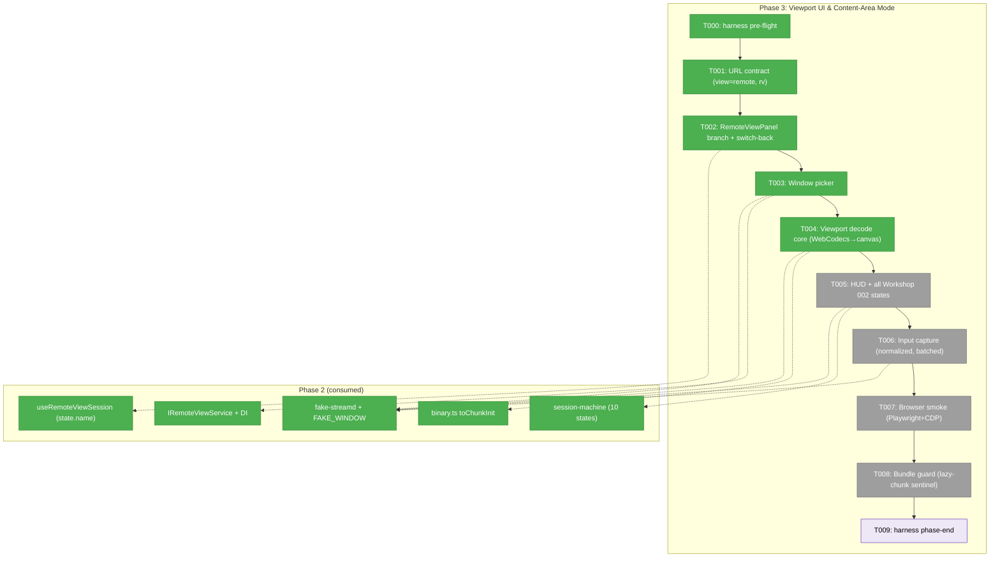
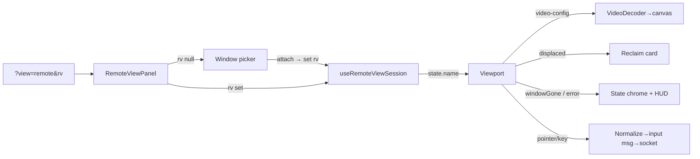
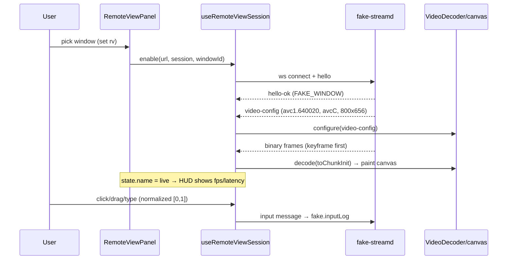

# Phase 3: Viewport UI & Content-Area Mode — Tasks

**Plan**: [remote-app-view-plan.md](../../remote-app-view-plan.md) · **Phase**: 3 of 6 · **Primary domain**: remote-view (+ additive `file-browser` touch)
**Depends on**: Phase 2 (domain, protocol, fake, session machine, hook, service+DI — all green, 56 tests)
**Testing mode**: **Hybrid (browser-smoke, not unit-TDD)** per spec + Constitution Deviation Ledger — T007 is the validation task; the guard tests (Phase 2 dep-direction + new bundle guard) backstop it.

---

## Executive Briefing

**Purpose**: Make the remote view *user-visible and interactive* — against the Phase 2 frame-replay fake, with **no daemon** (AC-12). This phase turns the tested-but-headless Phase 2 core (protocol codec, session FSM, reconnect hook, service interface) into a real content-area mode: a deep-linkable `view=remote` panel with a window picker, a WebCodecs-decoding canvas viewport with a live stats HUD, every Workshop 002 client state rendered, and mouse/keyboard capture serialized onto the wire.

**What we're building**:
- A `view=remote` content-area mode + `rv` session param (extends the existing `recent-feed` precedent — **no PanelShell changes**, Finding 01).
- A lazily-loaded `RemoteViewPanel` that mounts a window picker, then a viewport.
- A `viewport.tsx` that decodes the H.264 fixture stream via WebCodecs onto a canvas, shows a glass-to-glass-latency HUD, renders all 10 Workshop 002 states, and captures input.
- A browser smoke test (Playwright+CDP) and a bundle guard proving the heavy viewport is lazy-loaded.

**Goals**:
- ✅ `?view=remote&rv=<ses>` hydrates the panel; `rv` alone is inert (Workshop 001 URL rules).
- ✅ Picker → attach → live canvas → input, all driven by `FakeRemoteViewService` + `fake-streamd` (AC-1, AC-12).
- ✅ Every Workshop 002 viewport state is reachable and rendered (AC-7 reclaim, AC-10 windowGone, AC-14 named-grant error).
- ✅ Terminal-over and terminal-beside still work; switch-back restores prior file state (AC-5).
- ✅ Viewport is code-split; base bundle unchanged (AC-13).

**Non-Goals**:
- ❌ No real daemon, no real capture — everything runs against the fake (daemon is Phase 4; routes go daemon-backed in Phase 5).
- ❌ No live latency/fps measurement against real hardware — that's the Phase 6 sweep (AC-2). Here the *measurement path* is proven against the fake's synthetic timestamps.
- ❌ No unit-TDD of canvas/decode/pixels (Constitution Deviation Ledger — CI has no GPU); validation is browser-smoke + guards.
- ❌ No SDK/CLI/MCP agent surface or SSE push (Phase 5).
- ❌ No pointer-lock / relative-mouse (Workshop 003 Q1 — deferred to v1.1).

---

## Prior Phase Context

### Phase 1: De-Risk Spike (evidence — consumed indirectly)

- **A. Deliverables**: `external-research/spike-findings.md`; the real H.264 fixture set (254 frames, `avc1.640020`, 800×656, 39-byte avcC, `source: sck-capture`) — **already copied into** `apps/web/src/features/088-remote-view/protocol/fixtures/video/` in Phase 2; the WebCodecs decode-harness at `external-research/spike/decode-harness/`.
- **B. Dependencies exported (for the viewport decoder)**: a **proven WebCodecs config** — `{codec, codedWidth, codedHeight, description: Uint8Array(avcC), optimizeForLatency: true}`; omitting the base64 `avcC` `description` fails `VideoDecoder.isConfigSupported` on Chromium. Real fixture decoded **254/254 frames, 0 errors** on Chromium 149; first-frame latency ~21ms, ~33ms avg output interval. `EncodedVideoChunk.type` from the keyframe flag; `timestamp` from `ptsMicros`. **BigInt** required for u64 timestamps.
- **C. Gotchas & debt**: SCK is **deliver-on-change** — static windows drop to ~0fps; the HUD/decode path must treat low fps as normal and "viewer attaches after idle → needs keyframe" as the norm. Safari decode is record-only (non-gating). Keyboard injection is focus-sensitive (a Phase 4 concern, not Phase 3).
- **D. Incomplete (Phase 3 should know)**: pointer-lock and grace-config are deferred; Safari is backlog.
- **E. Patterns to follow**: `avc1.<hex>` codec string; avcC `description` mandatory; keyframe markers drive `'key'|'delta'`; the decoder config is **data-driven from the `video-config` message**, never hardcoded.

### Phase 2: Domain, Protocol & Session Core (consumed directly — this is the foundation)

- **A. Deliverables**: `protocol/messages.ts` (Zod), `protocol/binary.ts` (16-byte codec), `protocol/fixtures/` (cross-language + 254 video frames), `server/session-machine.ts` (pure reducer), `hooks/use-remote-view-session.ts` (reconnect hook), `server/remote-view-service.ts` (`IRemoteViewService` + Fake), `testing/fake-streamd.ts` (frame-replay fake), `testing/fixtures.ts` (`FAKE_WINDOW`), token route, DI token. 56 tests green.
- **B. Dependencies exported (the Phase 3 API surface)**:
  - **Hook** — `useRemoteViewSession(opts): { state: ViewportState, reclaim(), detach(), returnToPicker() }`. Options: `{ url, session, windowId?, enabled?, getToken?, healthCheck?, createSession?, stallMs?, backoffMs? }`. **The UI reads `state.name` to choose what to render.**
  - **Session FSM** — `ViewportState = { name, windowId, sessionId, reconnectAttempts, errorCode }`; `ViewportStateName = picker | attaching | live | degraded | reconnecting | displaced | windowGone | sessionLost | daemonDown | error`.
  - **Binary codec** — `decodeFrame(buf) → { header, payload }`, `toChunkInit(frame) → { type:'key'|'delta', timestamp, data }`. Header carries `keyframe`, `sequence`, `captureTimestampMicros` (BigInt).
  - **`video-config` message** — `{ t:'video-config', codec, description (base64 avcC), width, height, fps }` → feeds `VideoDecoder.configure`.
  - **Service** — `IRemoteViewService { list(), attach(windowId), detach(sessionId), getSession(sessionId) }`; `SessionSummary { sessionId, windowId, app, title, state }`; DI token `DI_TOKENS.REMOTE_VIEW_SERVICE` (consume via `useInjection`, never instantiate).
  - **Fake** — `startFakeStreamd(opts) → FakeStreamd` with `.url/.port/.inputLog/.received` and cues `pushFrames / dropFrames / sendDisplaced / sendWindowState / sendError / sendHeartbeatPing / dropViewer / failConnections / close`.
  - **`FAKE_WINDOW`** — `{ id: 34202, app:'Godot', title:'spike-target', pixelWidth:800, pixelHeight:656, scale:2 }`.
- **C. Gotchas & debt → Phase 3 constraints** (companion findings, all landed):
  - **F003 (input)**: x/y are **normalized `[0,1]`** (`z.number().min(0).max(1)`); the canvas must normalize+clamp before sending; wheel `dx/dy` stay unbounded.
  - **F004 (displaced)**: `displaced` **never** auto-recovers — only `RECLAIM`/`PICK_WINDOW`/`DETACH` escape it. **The UI must always render a Reclaim button in `displaced`** (no spinner-that-resolves-itself).
  - **F005 (dims)**: `hello-ok.window` == `FAKE_WINDOW` (800×656, scale 2) == manifest; the decoder takes dims from `video-config`, so this is data-driven, but the smoke fixture relies on the alignment.
  - **F007 (windowId)**: pass the `windowId` prop **only when picking**; omit it on a deep-link re-enter so the hook uses the `hello-ok`-learned id (don't clobber a null prop).
  - Two logged Phase 2 deviations (T007 real-timers; `zod` pinned `^4.3.5`) — no Phase 3 action.
- **D. Incomplete (left for Phase 3 / later)**: no UI yet (this phase); real decode in-browser (this phase); real service adapter + health route + `createSession` (Phase 5).
- **E. Patterns to follow**: 5-field Test Doc comment on every test; `// @vitest-environment node` **must be line 1** when used; vitest `fileParallelism:false` (serial — bind `:0`, close in teardown); consume the service via `useInjection(DI_TOKENS.REMOTE_VIEW_SERVICE)`; smoke tests drive the fake's cue API.

---

## Pre-Implementation Check

| File | Exists? | Domain Check | Notes |
|------|---------|-------------|-------|
| `apps/web/src/features/041-file-browser/params/file-browser.params.ts` | ✅ modify | file-browser (additive) | `view: parseAsStringLiteral(['recent-feed'] as const)` at **:30**, no default; composed into `fileBrowserPageParamsCache` (:34-37). One-literal extension. |
| `apps/web/src/features/088-remote-view/params/remote-view.params.ts` | ❌ create | remote-view (contract) | `rv` param; `params/` currently `.gitkeep` only |
| `apps/web/app/(dashboard)/workspaces/[slug]/browser/browser-client.tsx` | ✅ modify | file-browser (cross-domain) | lazy `dynamic()` precedent **:95-108**; desktop render branch `view==='recent-feed'` at **:1487** (`:226` only *extracts* `view`); switch-back `setParams({view:null})` in `handleFileSelect` at **:721**; mobile tab sync :233-256 |
| `apps/web/src/features/_platform/panel-layout/components/panel-shell.tsx` | ✅ **no change** | _platform (consume) | `data-terminal-overlay-anchor` on the `main` wrapper at **:88** — inherited by any content-area mode (Finding 01) |
| `apps/web/src/features/088-remote-view/components/remote-view-panel.tsx` | ❌ create | remote-view (internal) | `components/` is `.gitkeep` only |
| `apps/web/src/features/088-remote-view/components/window-picker.tsx` | ❌ create | remote-view (internal) | consumes `IRemoteViewService` via DI |
| `apps/web/src/features/088-remote-view/components/viewport.tsx` | ❌ create | remote-view (internal) | heaviest component (WebCodecs) → lazy-load target; bundle-guard sentinel host |
| `harness/src/remote-view-smoke.test.ts` | ❌ create | (tests) | precedent `harness/tests/smoke/browser-smoke.spec.ts` (Playwright+CDP, desktop/tablet/mobile projects) |
| `test/unit/web/features/088-remote-view/bundle-guard.test.ts` | ❌ create | (tests, contract) | copies `test/unit/web/features/086-image-editor/bundle-ac10.test.ts` (sentinel-in-lazy-chunk; skips if `.next` absent) |
| `test/unit/web/architecture/platform-no-remote-view.test.ts` | ✅ **exists** (Phase 2 T002) | (tests, contract) | dep-direction guard already green — backstops this phase |

**No new domain concepts** introduced (extends `recent-feed` view-mode precedent + Phase 2 remote-view surface) — no `domain.md § Concepts` additions needed beyond Phase 2's. No contract changes to Phase 2 exports; this phase is a **consumer** of them.

**Harness availability**: the `/eng-harness-flow` router **is installed** (`~/.agents` and `~/.claude`). Harness-seam rows (T000/T009) are included; the implement verb fires the pre-implement seam before any code and the phase-end seam at the end. Verdicts are narrated verbatim from the router envelope; `UNAVAILABLE` is not an error (falls back to standard testing).

---

## Architecture Map



---

## Tasks

| Status | ID | Task | Domain | Path(s) | Done When | Notes |
|--------|-----|------|--------|---------|-----------|-------|
| [x] | T000 | **Harness pre-flight** — `/eng-harness-flow --event pre-implement --phase "Phase 3" --plan-dir docs/plans/088-remote-app-view` | — | — | Router envelope handled; verdict narrated verbatim before any code | Harness seam (router installed); advisory, never gates — envelope `noop`/UNAVAILABLE (repo unadopted), proceed standard testing |
| [x] | T001 | **URL contract**: extend `view` literal to `['recent-feed','remote'] as const`; create `remote-view.params.ts` exporting `rv` (`parseAsString`, optional, null default); compose `rv` into the browser page params cache. `rv` without `view=remote` is inert. | file-browser / remote-view | `…/041-file-browser/params/file-browser.params.ts` (:30); `…/088-remote-view/params/remote-view.params.ts` (new); page params cache (:34-37) | Deep link `?view=remote&rv=ses_x` hydrates server+client; `rv` alone inert; existing recent-feed round-trip unaffected | AC-8 URL half; Finding 01; Workshop 001 §URL; additive literal |
| [x] | T002 | **RemoteViewPanel branch**: `dynamic()` lazy import (ssr:false + loading UI, copy RecentFeedView shape) + a `view==='remote'` render branch beside the recent-feed branch; extend `handleFileSelect` switch-back to reset `{view:null, rv:null}`. Panel owns the hook wiring. | file-browser / remote-view | `…/browser/browser-client.tsx` (:95, :1487, :721); `…/088-remote-view/components/remote-view-panel.tsx` (new) | Mode swaps both ways; selecting a file restores prior file state with `rv` cleared; recent-feed unaffected | AC-5 logic; Finding 01; **F007** — pass `windowId` prop only when picking, omit on deep-link re-enter; pre/post-handshake socket failures are the **Phase 2 hook's** job (the panel just renders `state.name`) |
| [x] | T003 | **Window picker**: grid of capturable windows (app, title, thumbnail) from `IRemoteViewService` (consume via `useInjection(DI_TOKENS.REMOTE_VIEW_SERVICE)`; `FakeRemoteViewService` in tests). Attach click → `setParams({rv})` → viewport mounts. | remote-view | `…/088-remote-view/components/window-picker.tsx` (new) | AC-1 — picker renders against fake data; attach sets `rv` and transitions to viewport; no direct service instantiation; empty list → "no capturable windows" message, auth/network error → disabled/toast (stubbed for Phase 5 real routes) | Window rows = `WindowDescriptor`/`SessionSummary`; routes fake-backed until Phase 5 |
| [x] | T004 | **Viewport decode core**: configure WebCodecs `VideoDecoder` from the `video-config` message (`codec`, `description`→`Uint8Array`, `width/height`, `optimizeForLatency:true`); map binary frames via `toChunkInit()` → `EncodedVideoChunk`; render to canvas in a paced loop; **drop-to-keyframe + send `request-keyframe` when decode queue >10**; request keyframe on attach/reattach; reconfigure on a new `video-config` (resize). | remote-view | `…/088-remote-view/components/viewport.tsx` (new) | Fake replay → 254-frame fixture renders on canvas; queue>10 drops to next keyframe; resize reconfigures decoder; `isConfigSupported()===false` → "video not supported" overlay (Safari / no-GPU fallback; full support Phase 6) | Phase 1 evidence: avcC `description` mandatory; **data-driven config** (real fixture `avc1.640020` 800×656); BigInt u64 timestamps; `binary.ts toChunkInit`; Workshop 003 decode policy |
| [ ] | T005 | **HUD + Workshop 002 state chrome**: stats HUD (fps, glass-to-glass latency, dropped, bitrate) — latency from Workshop 003 ping/pong clock-offset vs the fake's synthetic timestamps; render **every** state from `state.name`: attaching, live, degraded, displaced (**reclaim card — always show Reclaim, never auto-recover**), windowGone, sessionLost, daemonDown, error (every Workshop 003 `E_*` code → error card with code + message; `E_PERMISSION` additionally names the exact TCC grant). | remote-view | `…/088-remote-view/components/viewport.tsx` (HUD + chrome); optional `components/reclaim-card.tsx` | Each state reachable via fake cues (`sendDisplaced/sendWindowState/sendError/dropViewer/dropFrames`); HUD shows live latency; **F004** displaced always shows Reclaim | AC-2 measurement *path* proven vs fake (real ≥30fps/≤150ms = Phase 6); AC-7/AC-10 fake halves; AC-14 = error-state render only (fix-path UX + docs are Phase 6); **F004** displaced trap-guard already lives in Phase 2 `session-machine.ts` — Phase 3 UI just always renders Reclaim; hook field `state.name` (see §Validation clarifications for the full error-code map) |
| [ ] | T006 | **Input capture**: focus/capture rules (Workshop 001 §Focus — inlined in §Validation clarifications: focusable canvas, capture only while focused, `Meta+Shift+Escape` release chord, plain `Escape` passes through, visible "keys captured" indicator); **normalized `[0,1]` coords** (divide by canvas client rect, clamp — F003); rAF-batch mousemove; serialize as protocol `input` events and send over the socket. | remote-view | `…/088-remote-view/components/viewport.tsx` (input layer) and/or `hooks/use-input-capture.ts` (new) | AC-3 serialize half — `fake.inputLog` matches expected serialization for a click/drag/scroll/type script; all coords in `[0,1]`; out-of-range never sent | **F003** normalized coords (schema rejects <0/>1); wheel `dx/dy` unbounded; Workshop 003 input model |
| [ ] | T007 | **Browser smoke**: `harness/src/remote-view-smoke.test.ts` — attach→frames render on canvas; terminal-over + terminal-beside live; switch-back restores file; refresh reattach; two-context displace/reclaim (**assert displaced does NOT auto-recover** — only the Reclaim button escapes it, per F004) — all vs the fake. **Fake-streamd runs INSIDE the harness container** (same net namespace as headless Chromium; WS URL injected via fixture). | remote-view | `harness/src/remote-view-smoke.test.ts` (new); harness fixture wiring | Green on desktop+tablet projects (AC-5/6/7/12 smoke halves) via `just test-harness` | **The phase's validation task** (Hybrid); validates the *fake-backed* halves only — AC-2 real-latency + AC-14 fix-path are Phase 6 live; Finding 06; Phase 2 preconditions: `useRemoteViewSession`+FSM, `FAKE_WINDOW`, binary codec, fake cues `pushFrames/dropFrames/sendDisplaced/sendWindowState/sendError/dropViewer/failConnections`; precedent `harness/tests/smoke/browser-smoke.spec.ts` |
| [ ] | T008 | **Bundle guard**: add sentinel `data-testid="remote-view-viewport"` to the heavy viewport; `bundle-guard.test.ts` copying `086-image-editor/bundle-ac10.test.ts` (sentinel in lazy chunk, absent from initial/root/polyfill chunks; skip if `.next` absent). | remote-view / (tests) | `test/unit/web/features/088-remote-view/bundle-guard.test.ts` (new); `…/components/viewport.tsx` (sentinel) | AC-13 — guard green after `pnpm turbo build`; viewport absent from base bundle | Finding 06; copies `test/unit/web/features/086-image-editor/bundle-ac10.test.ts` |
| [ ] | T009 | **Harness phase-end** — `/eng-harness-flow --event phase-end --plan-dir docs/plans/088-remote-app-view` | — | — | Router envelope handled at phase end | Harness seam; advisory, never gates |

**Status legend**: `[ ]` pending · `[~]` in progress · `[x]` complete · `[!]` blocked

### Validation clarifications (from validate-v2)

**T006 — Workshop 001 §Focus rules (inlined so no workshop read is needed):**
- The viewport canvas is focusable (`tabindex`); pointer + keyboard captured **only while focused**.
- `keydown`/`keyup` forwarded only while focused; `Meta+Shift+Escape` is the **release chord** (drops capture); plain `Escape` passes **through** to the streamed app.
- A visible **"keys captured" indicator** shows while input is being forwarded.
- Browser-reserved combos (`Cmd+W`, `Cmd+T`, …) are a documented limitation — not forwarded.
- The terminal overlay taking focus **releases** viewport capture.

**T005 — error-code → chrome map:** every Workshop 003 error code renders the `error` card with its code + message — `E_AUTH`, `E_ORIGIN`, `E_VERSION`, `E_SESSION_UNKNOWN`, `E_WINDOW_GONE`, `E_PERMISSION`, `E_INTERNAL`. `E_PERMISSION` additionally names the exact TCC grant (the fix-path deep-link + how-to are Phase 6, AC-14).

**Phase-3 AC coverage — what these tasks prove here vs what is deferred:**

| AC | Phase-3 task | Proven here | Deferred to |
|----|--------------|-------------|-------------|
| AC-1 | T003 | picker renders + attach (fake) | Phase 6 live |
| AC-2 | T005 | measurement *path* vs fake timestamps | Phase 6 (≥30fps, ≤150ms live) |
| AC-3 | T006 | input *serialization* (`fake.inputLog`) | Phase 4/6 live fidelity |
| AC-5 | T002/T007 | terminal over/beside + switch-back | — |
| AC-6 | T007 | refresh reattach (fake) | Phase 6 live |
| AC-7 | T005/T007 | displace/reclaim, **no auto-recover** | Phase 6 live |
| AC-8 | T001/T002 | URL deep-link half | Phase 5 (CLI/MCP/SSE push) |
| AC-10 | T005 | `windowGone` state | Phase 4/6 live |
| AC-12 | T007 | full web side, daemon-absent | — |
| AC-13 | T008 | viewport lazy-loaded | — |
| AC-14 | T005 | error-state render (named grant) | Phase 6 (fix-path + docs) |

---

## Context Brief

**Key findings from plan (acting on this phase)**:
- **Finding 01 (Critical)** — the content-area mode switch *already exists*: extend the `view` literal + add `rv`, copy the `recent-feed` branch shape; **no PanelShell / FileViewerPanel changes**. Touch surface = two file-browser files (T001/T002).
- **Finding 06 (High)** — test infra: vitest `fileParallelism:false`; bundle guard needs a `.next` build + sentinel-in-lazy-chunk; browser smoke lives in `harness/` (Docker + CDP on :9222, `just test-harness`); 5-field Test Doc on every test; **fake-streamd must run inside the harness container** (T007).
- **Constitution Deviation Ledger** — Phase 3 canvas/decode is browser-smoke-validated, not unit-TDD'd (CI has no GPU); T007 + guards are the proof.

**Domain dependencies** (consumed — from Phase 2 + platform):
- `remote-view` (Phase 2): `useRemoteViewSession` (state machine surface), `binary.ts` (`toChunkInit`), `IRemoteViewService` + DI token, `fake-streamd` cue API, `FAKE_WINDOW`, the `video-config`/`input` protocol shapes.
- `file-browser`: `view` param literal + the `browser-client.tsx` content-area dispatch precedent (RecentFeedView).
- `_platform/panel-layout`: `data-terminal-overlay-anchor` on `main` (consume, no change) — gives terminal-over/beside for free.
- `_platform/state` + DI (`useInjection`): service resolution in components.

**Domain constraints**:
- One-directional dep: `_platform` must not import `088-remote-view` (guard `platform-no-remote-view.test.ts` already green). Phase 3 imports *from* platform and file-browser, never the reverse into platform.
- Components consume `IRemoteViewService` via `useInjection(DI_TOKENS.REMOTE_VIEW_SERVICE)` — never `new` it.
- No changes to Phase 2 protocol/FSM/hook exports — Phase 3 is a pure consumer (any protocol change would trigger the fixture-regen + 4.2 drift rule, out of scope here).

**Harness context** (router installed):
- **Entry point**: `/eng-harness-flow --event <seam> [--phase <id>] [--plan-dir <p>] --json` — the single door; child skills are private/never named.
- **Pre-implement seam** (T000): fired by the implement verb at phase start; envelope `decision: route|redirect|noop|ambiguous`; verdict narrated verbatim. `UNAVAILABLE` → standard testing, not an error.
- **Phase-end seam** (T009): fired at phase end.
- **Backpressure**: no `backpressure-coverage.md` in the plan dir (repo hasn't adopted a harness; the post-spec seam was a noop) — this phase uses the spec's standard Hybrid testing strategy.

**Reusable from prior phases**:
- `testing/fake-streamd.ts` — drive every UI state via cues; `.inputLog`/`.received` assert the serialize half (T006).
- `testing/fixtures.ts` — `FAKE_WINDOW`, `FAKE_SESSION_ID` for picker + smoke.
- `protocol/fixtures/video/` — 254 real frames + `manifest.json` (`avc1.640020`, 800×656) for the decoder (T004).
- `protocol/binary.ts` — `decodeFrame` + `toChunkInit` map the wire straight to `EncodedVideoChunk`.
- Phase 1 `external-research/spike/decode-harness/` — the reference WebCodecs configure→decode→canvas loop (data-driven config, BigInt timestamps, `optimizeForLatency:true`).
- Precedents to copy: `recent-feed-view.tsx` (lazy content-area panel), `bundle-ac10.test.ts` (guard), `browser-smoke.spec.ts` (harness CDP smoke).

**Mermaid flow diagram** (viewport state-render flow):


**Mermaid sequence diagram** (attach → live, against the fake):


---

## Discoveries & Learnings

_Populated during implementation by the implement verb._

| Date | Task | Type | Discovery | Resolution | References |
|------|------|------|-----------|------------|------------|

**Types**: `gotcha` | `research-needed` | `unexpected-behavior` | `workaround` | `decision` | `debt` | `insight`

| 2026-06-15 | T003 | gotcha | App has **no client-side DI / `useInjection`** — `IRemoteViewService` is server-only (tsyringe child containers, di-container.ts:719 prod / :953 test), resolved in routes/actions. The dossier (from recon) assumed components consume the service via `useInjection`. | Phase 3 client components use a **loader-hook abstraction** (`useRemoteViewWindows`) as the single Phase-5 swap point (→ `GET /api/remote-view/windows`); attach mints the session client-side (Phase 5 moves it server-side). No frozen-contract change. | di-container.ts; remote-view-service.ts |
| 2026-06-15 | T003 | decision | `IRemoteViewService` is documented FROZEN and has no window-list method; T003 needed one. | Did **not** extend the frozen interface; sourced windows via the loader hook instead (server route in Phase 5). Attach still flows toward the service contract (`attach(windowId)`) conceptually — Phase 5 wires it through the route. | remote-view-service.ts |

---

## Directory Layout

```
docs/plans/088-remote-app-view/
  ├── remote-app-view-plan.md
  └── tasks/phase-3-viewport-ui-content-area-mode/
      ├── tasks.md            # this file
      └── execution.log.md    # created by the implement verb
```

---

## Validation Record (2026-06-15)

**validate-v2** · 4 agents (Source Truth, Cross-Reference, Completeness+Thesis, Forward-Compatibility) · session model.

| Agent | Issues | Verdict |
|-------|--------|---------|
| Source Truth | 30/30 cited paths/lines/signatures **CONFIRMED, 0 mismatches** (file-browser.params.ts:30, browser-client.tsx:95/1487/721, panel-shell.tsx:88, bundle-ac10.test.ts, harness smoke, dep-guard exists; Phase 2 hook/FSM/binary/messages/fixtures/fake/DI signatures all exact) | ✅ |
| Cross-Reference | plan 3.0–3.z → T000–T009 **complete** (3.4 split into T004/T005, nothing dropped); ACs mapped; Findings 01/06 correct; F003/F004/F005/F007 faithfully applied — 1 MEDIUM + 4 LOW (clarity) fixed | ⚠ → ✅ |
| Completeness + Thesis | 3 MEDIUM (focus rules inline, error-code enumeration, AC smoke-vs-deferred clarity) + 5 LOW fixed; thesis Implementation-ready | ⚠ → ✅ |
| Forward-Compatibility | **all 5 consumers ✅** — Phase 5 service-swap transparent (DI + injectable hook), Phase 4 data-driven `video-config` + normalized input, 085/087 touch contained to 2 files, Phase 6 HUD measurement path; **0 fixes** | ✅ |

**Thesis verdict**: understood (explicit); value claim advanced (Implementation-ready); proof Target=Implementation, Actual=Implementation; evidence Adequate → Strong after fixes. **Main risk**: rests on Phase 2 exports (green, 56 tests) + the Phase 1 real H.264 fixture — both **already committed** (`protocol/fixtures/video/`, 254 frames `avc1.640020`).

**Outcome alignment**: advances the spec Outcome verbatim — "a live, interactive stream of ONE desktop app window … viewable and clickable from the browser; the terminal keeps working over or beside it" — Phase 3 is where it becomes user-visible.

**Fixes applied (9)**: T002 socket-failure ownership note; T003 empty/error picker handling; T004 `isConfigSupported` fallback; T005 error-code map + F004-guard-is-Phase-2 + AC-14 scope; T006 inlined focus rules; T007 displaced-no-auto-recover assertion + Phase-2 cue preconditions + AC smoke-vs-deferred; §Validation clarifications block (focus rules, error map, AC coverage matrix); this record.

Overall: **VALIDATED WITH FIXES**
