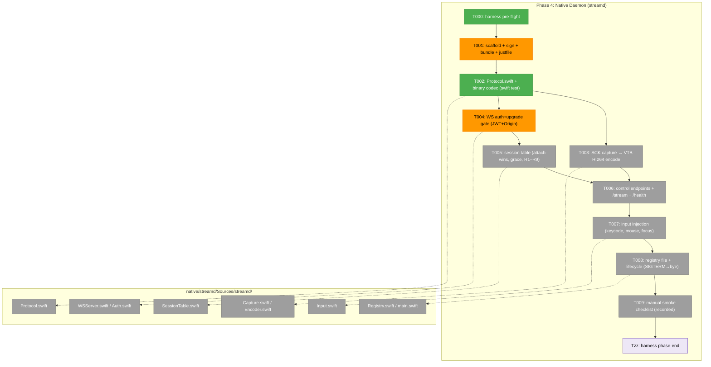
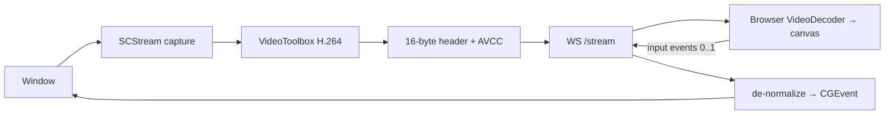
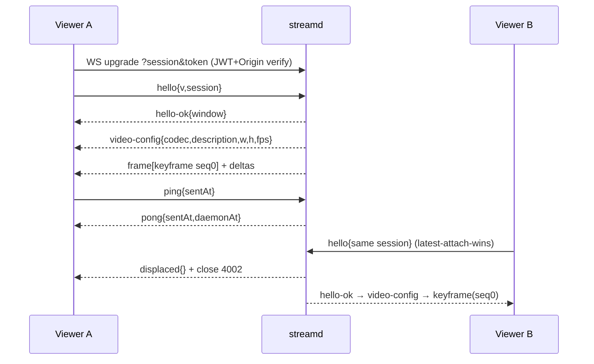

# Phase 4: Native Daemon (Swift) — Tasks & Context Brief

> **Plan**: [`remote-app-view-plan.md`](../../remote-app-view-plan.md) · **Phase**: 4 of 6 · **Primary domain**: `remote-view` (native composition; outside the pnpm/turbo graph)
> **Depends on**: Phase 1 (spike verdicts) · Phase 2 (protocol + fixtures + auth vectors) · feeds Phase 5 (lifecycle/routes) + Phase 6 (live AC sweep)
> **Testing mode (Hybrid per spec + Constitution Deviation Ledger)**: Swift-side **fixture-conformance tests are automated** (`swift test`, runnable on this host — Swift 6.2.4); capture/encode/input/lifecycle are **manual smoke, recorded** in the execution log (CI has no capture TCC, GPU, or CGEvent side-effects).

> ⚠️ **PERMISSION MOMENTS — the user must be physically at the host Mac.** This is the first native phase. `just streamd-setup` creates a self-signed **keychain certificate** (`chainglass-dev`); the first `just streamd-install` + run triggers the **TCC Screen-Recording grant** (and, for input, **Accessibility**). These cannot be done remotely. Flag each before running. **Note: Accessibility is a SECOND, SEPARATE grant — it first prompts during T007 (input/CGEvent), *after* the Screen-Recording grant in T001 — so plan one host-Mac visit covering BOTH grants, or expect a second trip.** (Reuse the Phase-1 spike's `chainglass-dev` cert + `com.chainglass.streamd` identity verbatim or the grant breaks — Finding 02.)

---

## Executive Briefing

- **Purpose**: Build `streamd` — the macOS native daemon that turns the frame-replay fake into a real streamer. It captures one window, encodes low-latency H.264, speaks the Workshop-003 wire protocol over an authenticated WebSocket, injects input, and manages session lifecycle — the only genuinely novel artifact in the plan (Finding 02).
- **What We're Building**: A SwiftPM package at `native/streamd/` producing a signed `ChainglassStreamd.app` (LSUIElement, stable cert + install path so TCC grants persist across rebuilds). Inside: a Codable protocol mirror byte-identical to Phase 2's fixtures, an ScreenCaptureKit→VideoToolbox capture/encode pipeline, a JWT+Origin-gated WS server, a latest-attach-wins session table with grace GC, CGEvent input injection, and a `.chainglass/` registry file for discovery.
- **Goals**:
  - ✅ `just streamd-install` produces a signed bundle at the stable install path; rebuild keeps TCC grants (Finding 02 / spike 1.5).
  - ✅ `swift test` passes the **same** canonical fixtures as Phase 2 (`protocol/fixtures/messages.json` + `frame-header.json`) and the **same** auth vectors (`test/contracts/remote-view-auth-vectors.json`) — cross-language drift guard.
  - ✅ A live window streams ≥30fps to the browser harness; latest-attach-wins displacement, grace GC, heartbeat work; bad token/origin rejected with `E_AUTH`/`E_ORIGIN`.
  - ✅ Click/drag/scroll/type land correctly in Godot; minimized windows auto-restore (AC-10); `/health` reports TCC grants precisely (AC-14).
- **Non-Goals** (❌ — owned elsewhere, do not scope in):
  - ❌ Spawn-on-demand / reaper / discovery from the web side (`open -g`, registry **read**) — that's **Phase 5**. This phase only **writes** the registry file + self-exits when it vanishes.
  - ❌ API routes, SDK/CLI/MCP verbs, SSE/GlobalState — **Phase 5**.
  - ❌ Live AC measurements (glass-to-glass ≤150ms, sustained 60fps numbers) — **Phase 6** sweep.
  - ❌ Pointer-lock / relative mouse, configurable grace, audio capture — **v1.1 deferrals** (Workshop 003 Q1 / Workshop 002 Q2 / v2 roadmap).
  - ❌ Direct-to-iOS-Simulator input — spike tested via Godot proxy; Simulator live fidelity is the Phase 6 sweep.

---

## Prior Phase Context

### Phase 1 — De-Risk Spike (evidence; bounds every Phase 4 task)

**A. Deliverables**: `external-research/spike-findings.md` (go/no-go verdicts); `external-research/spike/streamd-spike/` (Swift scratch + `Scripts/setup-cert.sh` + `make-bundle.sh` — **T001 reference**); recorded 254-frame H.264 fixture set (`avc1.640020`, seeded into Phase 2).

**B. Verdicts that bound Phase 4** (all ✅):
- **Cert/TCC (→ T001)**: self-signed `chainglass-dev` (CN=chainglass-dev) + bundle id `com.chainglass.streamd` → rebuild + re-sign with the **same** cert → Screen-Recording grant **persists, no re-prompt**. Ad-hoc signing re-prompts every rebuild (cdhash DR). **Mandatory** to reuse exact cert+id.
- **Spawn attribution (→ Phase 5, informs T001 bundle)**: `open -g` / `launchctl asuser … open` attributes TCC to the bundle id+cert leaf, path/binary-independent.
- **CGWindowID stability (→ T005 R6)**: window `34202` stayed valid ~30min across dozens of process launches. No picker-fallback needed.
- **Capture fps (→ T003)**: Godot windowed/occluded **45fps avg sustained 60s** (≥30 floor). SCK is **deliver-on-change** — static content (idle Simulator) drops to ~0fps (normal, not failure). Minimize stops frames; restore resumes; Space-switch keeps capturing the layer.
- **Encode params (→ T003)**: `avc1.640020` = H.264 **High Profile L3.2**, **P-frames only** (`AllowFrameReordering=false`, no B-frames), `MaxKeyFrameInterval=60` + forced keyframe on frame 0 + on demand. 254 frames decoded 254/254 clean on Chromium.
- **Input fidelity (→ T007)**: Godot click/drag ✅, unicode text ✅ **once the target is key window**; keyboard silently drops if a focus-changing event (drag/scroll) intervenes before type. Mitigation: keep streamed window focused; click immediately before type. Re-verify on standalone exported game.
- **Decoder config (already consumed by Phase 3)**: `{codec:"avc1.640020", codedWidth:800, codedHeight:656, description:<avcC bytes>, optimizeForLatency:true}`; `description` (avcC) **mandatory** or `isConfigSupported` fails.

**C. Fixture/encode contract**: each `frame-NNNN.bin` = one **AVCC access unit** (4-byte big-endian length-prefixed NALs); manifest carries `codec`, `description` (base64 avcC), `fps`, `width/height`, and `frames[]` with `file/keyframe/ptsMicros`. The daemon's encoder must emit frames the existing decoder + fixture replay accept.

**D. Gotchas carried in**:
- 🔴 **CoreGraphics init trap (→ T001/T003/T007)**: a bare Swift CLI calling `SCStream`/`CGEvent` aborts (`CGS_REQUIRE_INIT`). The daemon must bring up a headless NSApplication first: `_ = NSApplication.shared; setActivationPolicy(.prohibited)` **before** any SCK/CGEvent call. (The `.app`-via-`open -g` path gets an Aqua session, but code must still init CG explicitly.)
- 🟠 **Keyboard focus trap (→ T007)** as above.
- 🟠 **Variable fps (→ T003/T006)**: low fps on static windows is normal; keyframe-on-demand is essential for late joins.

**E. Verdict→task map**: 1.5 cert → **T001**; encode params → **T003**; window-id → **T005**; input matrix → **T007**; fixture format → **T002**; CG-init → **T001/T003/T007**.

### Phase 2 — Domain, Protocol & Session Core (the contracts the daemon mirrors)

**A. Deliverables**: `protocol/messages.ts` (Zod discriminated unions), `protocol/binary.ts` (16-byte codec), canonical fixtures (`messages.json`, `frame-header.json`, `video/manifest.json`), `testing/fake-streamd.ts` (**the reference implementation** — daemon must behaviorally match it), token route + `remote-view-auth-vectors.json`, session machine, `IRemoteViewService` + contract suite.

**B. Protocol contract** (daemon ↔ client — exact):
- **Server→client `t`**: `hello-ok{v,session,window}` · `video-config{codec,description(base64 avcC),width,height,fps}` · `window-state{state∈[minimized,restored,resized,moved,gone],pixelWidth?,pixelHeight?}` · `displaced{}` · `stats{captureFps,encodeFps,bitrateKbps,droppedFrames,bufferedAmount}` · `pong{sentAt,daemonAt}` · `error{code,message,fatal}` · `bye{reason∈[detached,window-gone,shutdown]}`.
- **Client→server `t`**: `hello{v,session}` · `input{events:InputEvent[]}` · `request-keyframe{}` · `pause{}` · `resume{}` · `client-stats{decodeFps,queueDepth,e2eLatencyMs}` · `ping{sentAt}` · `detach{}`.
- **ErrorCode**: `E_AUTH, E_ORIGIN, E_VERSION, E_SESSION_UNKNOWN, E_WINDOW_GONE, E_PERMISSION, E_INTERNAL`.
- **16-byte big-endian frame header**: `[0]u8 frameType (FRAME_TYPE_VIDEO=0x01)` · `[1]u8 flags (bit0=keyframe)` · `[2]u16 reserved=0` · `[4]u32 sequence (monotonic per attach)` · `[8]u64 captureTimestampMicros (BigInt)` · `[16…] AVCC payload`.
- **Handshake order**: `hello` → `hello-ok` → `video-config` → first frame is **always a keyframe (seq 0)** → deltas. `video-config` precedes any frame and is **resent on resize** (then a keyframe).
- **Protocol version pinned `v:1`**; mismatch → `E_VERSION` (fatal).

**C. Auth contract** (frozen — Finding 03/FX003):
- Token minted by copying the terminal route: HKDF-derived **raw 32-byte Buffer key passed directly to SignJWT** (no `TextEncoder` re-wrap — byte-identical for the Swift verifier). Claims: `sub,iss='chainglass',aud='remote-view-ws',iat,exp(+300s)`; **no `cwd` claim**.
- **Auth vectors** at `test/contracts/remote-view-auth-vectors.json`: `alg:HS256`, pinned `signingKeyHex=000102…1f`, vectors `good/expired/wrong-aud/wrong-key`. **Daemon (T004) imports the same file and must verify byte-identically.**
- **Origin allowlist** helpers `buildDefaultAllowedOrigins`/`parseAllowedOrigins`/`authorizeUpgrade` live in `apps/web/src/features/064-terminal/server/terminal-auth.ts` — daemon re-implements the same logic in Swift.
- **WS upgrade** requires `?session=` + `?token=`; reject → `E_AUTH` close 4401, `E_ORIGIN` close 4402.

**D. Fake-streamd reference behaviors** (T005/T006 must match): latest-attach-wins → old viewer gets `displaced` + close **4002**, becomes `unwatched`; keyframe on attach/reattach/resume/request-keyframe; **closed session is terminal** — a `hello` on it returns `E_SESSION_UNKNOWN` + close **4404** (no resurrection); `ping`→`pong{sentAt,daemonAt}`; socket close → `unwatched`; `stats` fields as above. Close codes: 1000 clean, 1011 unexpected (reconnect substrate), 4002 displaced, 4401 auth, 4404 unknown.

**E. Gotchas/patterns**: HKDF raw-Buffer key (no re-encode); fixtures = cross-language source of truth (any protocol change regenerates them + reruns T003/4.2 suites); `u64` timestamp needs BigInt-equivalent precision; normalized input coords validated `[0,1]` at the parse boundary; pinned `FAKE_WINDOW{id:34202,…}`.

### Phase 3 — Viewport UI (what the daemon must produce)

**B. Client requires from the daemon**:
- `video-config` **before** any frame (re-sent on resize/SPS-PPS change — client re-`configure()`s on signature change `codec:WxH:description`).
- `EncodedVideoChunk.type` = `'key'` iff header `keyframe` bit set; `timestamp` from `captureTimestampMicros`; `data` = payload bytes 16+.
- **Drop-to-keyframe**: when `decodeQueueSize > 10` the client discards deltas and sends `request-keyframe` → **daemon must send a keyframe promptly**.
- **C. Input serialization** the daemon must parse + inject: `input.events[]` with `mousemove{x,y}` (coalesced, latest per rAF), `mousedown/up{x,y,button∈0|1|2}`, `wheel{x,y,dx,dy}` (dx/dy **raw, unbounded**), `keydown/up{code(DOM e.code),modifiers{shift,ctrl,alt,meta}}`, `text{text}` (reserved). Coords **normalized [0,1]** — **daemon de-normalizes to window pixels**. Release chord `Meta+Shift+Escape` is consumed client-side (**not** forwarded); plain `Escape` **is** forwarded. Input only sent while canvas focused.
- **D. Telemetry**: client pings every 2s; daemon echoes `pong{sentAt,daemonAt}` (HUD shows RTT). `stats` 1Hz feeds fps/bitrate/dropped. (Glass-to-glass is Phase 6.)
- **E. State triggers**: `displaced` msg → reclaim card (**never auto-recovers** — daemon just closes after sending); `window-state{gone}` → windowGone; sequence gap → degraded; `error{E_PERMISSION,...}` with a **named grant message** (AC-14); unexpected close → client reconnect (backoff 250/1000/3000, 3×) → then `/health` decides `sessionLost` vs `daemonDown`.

---

## Pre-Implementation Check

| File / Surface | Exists? | Domain Check | Notes |
|----------------|---------|--------------|-------|
| `native/streamd/` (Package.swift, Sources, Tests, scripts) | ❌ create | remote-view (native; outside pnpm) | All-new. macOS 14 min; **this host = macOS 26.5 / Swift 6.2.4** → `swift test` runs locally. |
| `native/streamd/scripts/make-bundle.sh` | ❌ create | remote-view | Port the spike's `make-bundle.sh` + `setup-cert.sh` (`external-research/spike/streamd-spike/Scripts/`). |
| `justfile` (`streamd-setup/build/install/kill`) | ✅ modify | (infra) | No `streamd-*` lifecycle recipes yet — **T001 owns all four**. |
| `protocol/fixtures/messages.json` + `frame-header.json` | ✅ read-only | (contract) | T002 Swift round-trips these **unchanged** — cross-language drift guard. |
| `protocol/fixtures/video/manifest.json` (+254 frames) | ✅ read-only | (contract) | Encode-output realism reference for T003. |
| `test/contracts/remote-view-auth-vectors.json` | ✅ read-only | (contract) | T004 Swift verifier must pass the same vectors byte-for-byte. |
| `apps/web/.../064-terminal/server/terminal-auth.ts` | ✅ read-only | terminal (reference) | Origin allowlist logic to mirror in Swift (T004). |
| `.chainglass/streamd-<webPort>.json` | ❌ create at runtime | remote-view | T008 writes (atomic temp+rename); Phase 5 reads it. |

**Decisions / conflicts to resolve in T001** (logged so the implementer doesn't rediscover them):
- **Install path**: use **Workshop 004's** `~/Library/Application Support/chainglass/streamd/ChainglassStreamd.app` (authoritative, shared across worktrees). The spike scratch used a different path (`~/Applications/…`) — reconcile to Workshop 004.
- **Bundle name**: `ChainglassStreamd.app` (Workshop 004), not the spike's `Chainglass Streamer.app`.
- **Port**: default `webPort + 1501` (terminal sidecar owns `+1500`); override `CG_REMOTE_VIEW__DAEMON_PORT` (ADR-0003 `CG_*`). Browser never computes the offset.
- **CG init**: headless `NSApplication.shared` + `setActivationPolicy(.prohibited)` before SCK/CGEvent (spike gotcha).

**Harness availability**: router installed (`~/.claude/skills/eng-harness-flow`). The implement verb fires the pre-implement seam (T000) before any code and the phase-end seam (Tzz) after. The repo has **no adopted harness** (S2/S4 owed) — seams are advisory; fall back to the testing above.

---

## Architecture Map



---

## Tasks

| Status | ID | Task | Domain | Path(s) | Done When | Notes |
|--------|-----|------|--------|---------|-----------|-------|
| [x] | T000 | **Harness pre-flight** — `/eng-harness-flow --event pre-implement --phase "Phase 4" --plan-dir docs/plans/088-remote-app-view` | — | — | Router envelope handled; verdict narrated verbatim before any code | Harness seam — advisory |
| [~] | T001 | **Scaffold + signing + bundle + recipes** (CS-4). `native/streamd/Package.swift` (macOS 14 min, executable target + test target); `scripts/make-bundle.sh` (Info.plist: `CFBundleIdentifier=com.chainglass.streamd`, `LSUIElement=true`); `justfile` recipes `streamd-setup` (create `chainglass-dev` cert), `streamd-build`, `streamd-install` (build+sign+copy to install path), `streamd-kill`. Headless-NSApp CG-init scaffold + CLI-arg parsing (`--port`, `--registry <abs>`, `--bootstrap <abs>` — Phase 5 spawns via `open --args`; the registry path comes from `--registry`, never derived) in `main.swift`. | remote-view | `native/streamd/Package.swift`, `native/streamd/Sources/streamd/main.swift`, `native/streamd/scripts/make-bundle.sh`, `native/streamd/scripts/setup-cert.sh`, `justfile` | `just --list` shows all four recipes; `just streamd-install` produces a signed bundle at `~/Library/Application Support/chainglass/streamd/ChainglassStreamd.app`; rebuild+reinstall keeps the Screen-Recording grant (per spike 1.5) | ⚠️ keychain cert (setup) + TCC grant (first run) — **user at host Mac**. Reuse `chainglass-dev`+`com.chainglass.streamd` verbatim (Finding 02). Port spike scripts (handle OpenSSL-3 `-legacy`). |
| [x] | T002 | **Protocol.swift mirror + binary codec** (CS-3, automated). Codable structs for every Workshop-003 message (discriminate on `t`); 16-byte big-endian frame-header encode/decode; `swift test` round-trips the **same** `messages.json` + `frame-header.json` fixtures as Task 2.3. | remote-view | `native/streamd/Sources/streamd/Protocol.swift`, `native/streamd/Tests/streamdTests/ProtocolTests.swift` | Cross-language fixture suite green via `swift test` on this host; byte-identical to TS codec for every fixture row (u64 timestamps preserved) | Drift guard (Workshop 003). **Deterministic** — this is the automatable slice. |
| [ ] | T003 | **Capture + encode pipeline** (CS-5). `SCStream` per-window (`SCContentFilter(desktopIndependentWindow:)`) → VideoToolbox low-latency H.264 (`avc1.640020`, P-frames only, `AllowFrameReordering=false`, keyframe-on-demand + on frame 0); pause when no viewer, resume→keyframe; resize → new `video-config` + keyframe; window destroyed / `SCStream` ends → emit `window-state{gone}` + `E_WINDOW_GONE` / `bye{window-gone}` (never freeze on the last frame — AC-10). CG init before `SCStream`. | remote-view | `native/streamd/Sources/streamd/Capture.swift`, `native/streamd/Sources/streamd/Encoder.swift` | **Manual (recorded)**: live Godot window streams to the Phase-1 browser harness ≥30fps sustained; late-join attach yields an immediate keyframe; resize re-emits config+keyframe | Deepest new code (plan key risk). Variable fps on static content is expected. external-research encode decisions. |
| [~] | T004 | **WS auth + upgrade gate** (CS-3, partly automated). On `/stream` upgrade: verify JWT (HKDF raw-byte key, `iss=chainglass`, `aud=remote-view-ws`, exp) + Origin allowlist (mirror `terminal-auth.ts`) **before** accepting; reject bad token → `E_AUTH` close 4401, bad origin → `E_ORIGIN` close 4402. `swift test` verifies `remote-view-auth-vectors.json` (good/expired/wrong-aud/wrong-key). | remote-view | `native/streamd/Sources/streamd/Auth.swift`, `native/streamd/Sources/streamd/WSServer.swift`, `native/streamd/Tests/streamdTests/AuthVectorsTests.swift` | Auth-vector suite green via `swift test` (matches TS byte-for-byte); manual bad-token/bad-origin → correct error + close code | Plan 4.4(a) — **AC-9** (bad token/origin rejected). Frozen contract (Finding 03). Vector suite is **deterministic**. |
| [ ] | T005 | **Session table** (CS-3). In-memory sessions keyed by id; latest-attach-wins displacement (old viewer ← `displaced` + close 4002 → `unwatched`); `closed` is terminal (`hello` → `E_SESSION_UNKNOWN` close 4404); 300s grace GC; 15s heartbeat (dead after 2 misses → `unwatched`); **sequence resets to 0 on each attach/reattach** (first frame = keyframe seq 0); honor R1–R9 (Workshop 002). | remote-view | `native/streamd/Sources/streamd/SessionTable.swift`, `native/streamd/Tests/streamdTests/SessionTableTests.swift` | Unit tests for displacement/grace/heartbeat/terminal-closed green via `swift test`; **manual** two-client displacement check behaves per Workshop 002 | Plan 4.4(b). Matches `fake-streamd.ts` for displacement/terminal-closed; **heartbeat-miss→unwatched is a Workshop-002 R5/R9 rule NOT modeled in the fake** (which transitions only on socket close) — implement + unit-test from Workshop 002 directly. State logic is **unit-testable** (no capture). |
| [ ] | T006 | **Control endpoints + stream** (CS-5). **Endpoints**: `/health` (no auth) → `{ok, daemonVersion, protocolVersion, permissions:{screenRecording, accessibility}}` (named grants, AC-14); `/windows` (+ one-shot thumbnails); `/sessions` CRUD → flat `SessionSummary{sessionId,windowId,app,title,state}` (`state` projected from T005's table); `POST /shutdown` (JWT, graceful — Phase 6 version-mismatch respawn); `/stream` upgrade → handshake `hello-ok`→`video-config`→keyframe→deltas. **Control messages** (see § Validation addenda for the full ownership table): `ping`→`pong`; `request-keyframe`→**next emitted frame is a forced keyframe, no intervening deltas**; `pause`/`resume`; `detach`→terminal close + `bye{detached}` (1000); `client-stats`→decode + ignore; **unknown `t` ignored — never throws/closes** (Workshop 003 fwd-compat); `hello.v≠1`→`error{E_VERSION,fatal}` *before* `hello-ok`; capture-start-without-grant→`error{E_PERMISSION,<named grant>,fatal}`. Emit `stats` 1Hz; backpressure (`bufferedAmount` > 512KB → drop deltas + keyframe on drain). | remote-view | `native/streamd/Sources/streamd/WSServer.swift`, `native/streamd/Sources/streamd/Endpoints.swift` | **Manual (recorded)**: browser harness attaches → frames render; `/health` returns the full shape + both grants precisely; `hello.v≠1`→E_VERSION; `detach`→`bye{detached}`+close 1000; `/sessions` returns flat `SessionSummary`; HUD shows live stats + RTT; protocol conformance vs fixtures | Plan 4.4(c). **CS bumped 4→5** (4 endpoints + handshake + full control-message surface). Composes T002/T004/T005 with T003 frames. |
| [ ] | T007 | **Input injection** (CS-4). Parse `input.events[]`; DOM `code`→virtual-keycode table (Swift mirror) + `text` via unicode (`CGEventKeyboardSetUnicodeString`); mouse: de-normalize `[0,1]`→window pixels via ~30Hz `kCGWindowBounds` (Retina scale + chrome offset); buttons 0/1/2; focus-follows-stream; auto-restore minimized window (AC-10). **CG must be initialized (headless `NSApplication.shared` + `.prohibited`) before any `CGEvent` call** — same `CGS_REQUIRE_INIT` gotcha as T003. | remote-view | `native/streamd/Sources/streamd/Input.swift`, `native/streamd/Tests/streamdTests/KeycodeMapTests.swift` | Keycode-map unit test green (`swift test`); **manual**: click/drag/scroll/type land correctly in Godot (AC-3/AC-4 live halves); minimized window auto-restores | Plan 4.5. ⚠️ Accessibility TCC for CGEvent — **user at host Mac**. Focus trap (spike 1.3): keep window key; click before type. |
| [ ] | T008 | **Registry + lifecycle** (CS-2). On listen, write `.chainglass/streamd-<webPort>.json` (pid/port/protocolVersion/daemonVersion/bundleId/bundlePath/startedAt) via atomic temp+rename; poll (~30s) and self-exit when the file vanishes; `SIGTERM` → `bye{shutdown}` to viewer then clean close. | remote-view | `native/streamd/Sources/streamd/Registry.swift`, `native/streamd/Sources/streamd/main.swift` | **Manual (recorded)**: registry file appears on start; deleting it self-exits the daemon; `kill -TERM` sends `bye` then closes | Plan 4.6. Phase 5 **reads** this (spawn/reaper) — out of scope here. Registry field is **`port`**; Phase 5 surfaces it as **`daemonPort`** in API responses (the daemon never emits `daemonPort`). Registry path comes from the `--registry` arg (T001), never derived. |
| [ ] | T009 | **Manual smoke checklist (recorded)** (CS-2). Execute + record in the execution log the Hybrid verification: capture ≥30fps, two-client displacement, bad-token/bad-origin rejection, input fidelity, registry/SIGTERM lifecycle — each with observed evidence. | remote-view | `docs/plans/088-remote-app-view/tasks/phase-4-native-daemon-swift/execution.log.md` | Every checklist item has a written observed result (not just a verdict); failures logged with fallback | Plan "Verification (Hybrid)". Live AC numbers remain Phase 6. |
| [ ] | Tzz | **Harness phase-end** — `/eng-harness-flow --event phase-end --plan-dir docs/plans/088-remote-app-view` | — | — | Router envelope handled at phase end | Harness seam — advisory |

---

## Validation addenda (validate-v2, 2026-06-15)

The dossier validated **source-perfect** (0 contract/path/cert/port errors). These addenda close protocol-ownership + control-API-shape gaps the multi-agent pass found — honor them as part of the listed tasks (they are not new tasks).

### Protocol message ownership (no message goes un-owned — cross-language drift guard)

Every Workshop-003 message has a task that **sends or parses** it. An implementer who satisfies only the happy-path Done-Whens would otherwise fork the protocol on the rarer messages.

| Message | Dir | Owner | Behavior |
|---|---|---|---|
| `hello-ok`, `video-config` | →client | T006/T002 | handshake; config before any frame, resent on resize |
| binary frame (16-byte hdr) | →client | T003/T002 | keyframe seq 0 on attach; sequence resets per attach |
| `stats` (1Hz), `pong` | →client | T006 | HUD telemetry; `pong{sentAt,daemonAt}` |
| `displaced` | →client | T005 | latest-attach-wins; close 4002; **daemon just closes, never auto-recovers** |
| `window-state{minimized,restored,resized,gone}` | →client | T003 | minimize/restore/resize states; **`gone`** on window destroy |
| `error{E_AUTH,E_ORIGIN}` | →client | T004 | upgrade-gate rejects (close 4401/4402) |
| `error{E_VERSION}` | →client | T006 | `hello.v≠1` → fatal, before `hello-ok` |
| `error{E_SESSION_UNKNOWN}` | →client | T005 | `hello` on closed session → close 4404 (no resurrect) |
| `error{E_WINDOW_GONE}` | →client | T003/T006 | window destroyed mid-stream (companion to `window-state{gone}`) |
| `error{E_PERMISSION}` | →client | T006 | capture without TCC grant → **named grant** message (AC-14, also over WS, not just `/health`) |
| `error{E_INTERNAL}` | →client | T006 | catch-all (defensible) |
| `bye{detached}` | →client | T006 | response to `detach` |
| `bye{window-gone}` | →client | T003/T006 | companion to window destroy |
| `bye{shutdown}` | →client | T008 | SIGTERM |
| `hello`, `input` | client→ | T006/T007 | handshake / input injection |
| `request-keyframe` | client→ | T006 | → forced keyframe, no intervening deltas |
| `pause`, `resume` | client→ | T006 | resume ⇒ keyframe |
| `ping` | client→ | T006 | → `pong` |
| `detach` | client→ | T006 | → terminal close + `bye{detached}` (1000) |
| `client-stats` | client→ | T006 | **decode + ignore** (must not throw) |
| unknown `t` | client→ | T006 | **ignored, never throws/closes** (fwd-compat) |

### Control-API shapes Phase 5 will proxy (pin these now to avoid Phase-5 adapter rework)

- **`/health`** → `{ok:bool, daemonVersion:string, protocolVersion:1, permissions:{screenRecording:'granted'|'denied'|'not-determined', accessibility:…}}`. `daemonVersion`/`protocolVersion` are Phase 5's version-handshake gate keys.
- **`/sessions`** → flat **`SessionSummary{sessionId, windowId, app, title, state}`** (the frozen Phase-2 contract shape, `test/contracts/remote-view-service.contract.ts`), `state ∈ idle|streaming|unwatched|closed` projected from T005. If the daemon returns Workshop-004's nested `{sessionId, window}`, **state that Phase 5 flattens it** — don't leave it implicit. The contract suite's HTTP-`attach()` is idempotent-per-window (same `sessionId`); reconcile with the WS latest-attach-wins displacement.
- **`port` → `daemonPort`**: registry writes `port`; Phase 5 renames to `daemonPort` in API responses. Daemon never emits `daemonPort`.
- **CLI args**: `main.swift` parses `--port`, `--registry <abs>`, `--bootstrap <abs>` (Phase 5 passes via `open --args`).
- **`POST /shutdown`** (JWT, graceful) exists so Phase 6's version-mismatch respawn AC is reachable.

### Oracle caveats

- The `fake-streamd.ts` reference covers **close→unwatched**, displacement, and terminal-closed — but **not** the 15s/2-miss heartbeat timer (a Workshop-002 R5/R9 rule). Implement + unit-test that from Workshop 002 directly; don't expect it in the fake.
- **CG-init** (`CGS_REQUIRE_INIT`): headless `NSApplication.shared` + `.prohibited` before **any** `SCStream` *or* `CGEvent` — required in T001 (scaffold), T003 (capture), **and T007 (input)**.

### Validator verdict

Source Truth **0 issues**; Cross-Reference **1 LOW** (AC-9, now cited); Completeness/Thesis advanced **Partially → addressed** (5 unowned messages + CG-init-on-T007 + sequence/heartbeat invariants now owned above); Forward-Compat **advanced** (control-API shapes now pinned). Outcome: *"`streamd` turns the frame-replay fake into a real streamer"* — **advanced** by the dossier as amended.

---

## Context Brief

**Key findings from plan (action required)**:
- **Finding 02 (Critical)** — TCC trap is real: stable `chainglass-dev` cert + `com.chainglass.streamd` + stable install path. → T001, load-bearing.
- **Finding 03 (High)** — auth is copy-not-design: HKDF raw-Buffer key, `aud=remote-view-ws`, verify against shared vectors. → T004.
- **Finding 06 (High)** — test infra: `swift test` is the automated half; fixtures are the cross-language source of truth. → T002/T004.
- **Spike CG-init gotcha** — headless NSApp before SCK/CGEvent. → T001/T003/T007.

**Domain dependencies** (what this phase consumes):
- `remote-view` (Phase 2): `protocol/fixtures/{messages,frame-header}.json`, `video/manifest.json` — the wire + encode contracts; `testing/fake-streamd.ts` — the behavioral reference; `test/contracts/remote-view-auth-vectors.json` — the auth oracle.
- `terminal` (064): `server/terminal-auth.ts` — Origin-allowlist logic to mirror in Swift.
- `bootstrap` (frozen): HKDF key derivation contract (reused verbatim, never forked).

**Domain constraints**:
- `native/streamd/` is **outside** the pnpm/turbo graph — Swift toolchain only; no JS imports.
- The daemon is **single-audience**: it serves only the WS protocol; CLI/MCP/web reach it via Next routes (Phase 5), never directly (Workshop 004).
- Input goes **only** to the attached window's app — no general desktop-automation surface (security boundary).
- The stream socket meets the **same auth bar** as the terminal socket (JWT + Origin allowlist) — non-negotiable.

**Harness context** (router installed): pre-implement seam fires before T001 (envelope narrated verbatim — `healthy/SLOW/UNHEALTHY/UNAVAILABLE`); phase-end seam fires after Tzz. Repo has no adopted harness → advisory; standard testing (above) applies.

**Reusable from prior phases**: spike `setup-cert.sh` + `make-bundle.sh` (T001); the 254-frame fixture set + manifest (T003 realism); `fake-streamd.ts` as the conformance oracle for T005/T006; the pinned auth vectors (T004).

**System flow (capture→encode→stream)**:


**Attach / displace sequence**:


---

## Discoveries & Learnings

_Populated during implementation by the implement verb._

| Date | Task | Type | Discovery | Resolution | References |
|------|------|------|-----------|------------|------------|

**Types**: `gotcha` | `research-needed` | `unexpected-behavior` | `workaround` | `decision` | `debt` | `insight`

---

## Directory layout

```
docs/plans/088-remote-app-view/
  ├── remote-app-view-plan.md
  └── tasks/phase-4-native-daemon-swift/
      ├── tasks.md          # this file
      └── execution.log.md  # created by the implement verb

native/streamd/             # NEW — Swift daemon (outside pnpm graph)
  ├── Package.swift
  ├── Sources/streamd/{main,Protocol,Capture,Encoder,WSServer,Auth,SessionTable,Endpoints,Input,Registry}.swift
  ├── Tests/streamdTests/{ProtocolTests,AuthVectorsTests,SessionTableTests,KeycodeMapTests}.swift
  └── scripts/{setup-cert.sh,make-bundle.sh}
```

**STOP** — dossier complete. No code changed. Awaiting human GO to implement Phase 4.
