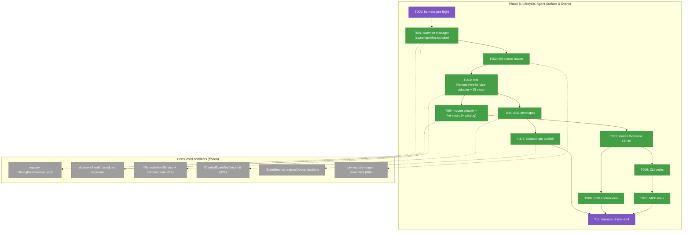
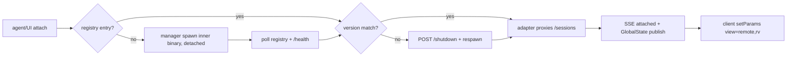
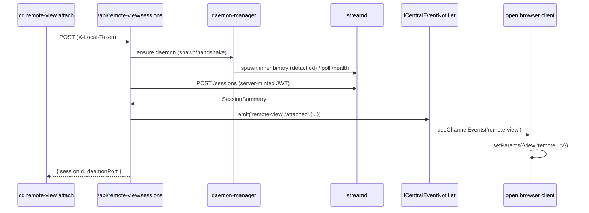

# Phase 5: Lifecycle, Agent Surface & Events — Tasks

**Plan**: [`../../remote-app-view-plan.md`](../../remote-app-view-plan.md)
**Phase**: Phase 5 — Lifecycle, Agent Surface & Events
**Primary domain**: `remote-view` (consumes `_platform/sdk`, `_platform/events`, `_platform/state`)
**Depends on**: Phase 2 (interfaces, fake, contract suite); Phase 4 only for *live* verification — every test in this phase runs against fakes/stubs.
**Status**: Ready for implementation (awaiting GO)

---

## Executive Briefing

- **Purpose**: The web server takes ownership of the native daemon's whole lifecycle (spawn → discover → reap), exposes the remote-view feature to agents through every surface (SDK / CLI / MCP), and pushes live session state to clients (SSE + GlobalState). This is the **assembly** phase — Key Finding 04: "Phase 5 is assembly, not invention; each task names its registry file."
- **What we're building**: A daemon manager + fail-closed reaper, the NextAuth-gated proxy routes the Phase 3 UI already calls, the real `RemoteViewService` adapter that joins the Phase 2 contract suite, SSE envelopes + GlobalState publishing, and the SDK/CLI/MCP verb trio.
- **Goals**:
  - ✅ Spawn-on-demand + readiness poll + version handshake + **fail-closed reaper** (AC-11 logic).
  - ✅ Real `IRemoteViewService` adapter passing the **same** Phase 2 contract suite verbatim.
  - ✅ `/windows`, `/sessions`, `/health` proxy routes (server-side JWT mint; `daemonPort` from registry); **web-side picker catalog** enumeration.
  - ✅ SSE `remote-view` envelopes (`attached`/`detached`/`daemon-state`) → client param switch on agent attach (AC-8 push half).
  - ✅ GlobalState `remote-view:<ses>:status/latency-ms/fps` (5s throttle).
  - ✅ `remote-view list|attach|detach` via SDK palette, `cg` CLI, and MCP tools (AC-8 CLI/MCP half).
- **Non-Goals**:
  - ❌ Live capture / encode / input fidelity — that's the daemon (Phase 4, done) verified live in Phase 6.
  - ❌ The viewport UI, picker component, decode path — built in Phase 3 (done).
  - ❌ Permissions-UX card + live AC sweep + docs — Phase 6.
  - ❌ Any change to the daemon's narrowed `/windows` single-window contract (F005/F006) — the catalog lives web-side.

---

## Prior Phase Context

### Phase 1 — De-Risk Spike (evidence, GO)
- **Deliverables**: `external-research/spike-findings.md` (7 GO verdicts + consumer mapping); H.264 fixture seed (copied into Phase 2's `protocol/fixtures/video/`).
- **Dependencies exported (Phase-5-binding)**:
  - **§1.5b** — `open -g` TCC attribution: the grant attaches to the **bundle identity** (`com.chainglass.streamd`), independent of the controlling terminal and of path/binary within that identity → **spawn-on-demand (T001) proceeds as designed**.
  - **§1.5c** — CGWindowID stable across ~30 min + dozens of capture-process restarts → **R6 reattach-by-windowId stays valid**; no picker-with-toast degrade needed.
- **Gotchas/Debt**: SCK is deliver-on-change (static window → ~0 fps); not a lifecycle concern but the daemon-state "alive but idle" must not be read as "dead".
- **Incomplete**: none affecting Phase 5.
- **Patterns**: stable TCC identity (cert `chainglass-dev` + bundle id) is permanent — reused by spawn.

### Phase 2 — Domain, Protocol & Session Core (TDD, complete)
- **Deliverables**: registered `remote-view` domain; `protocol/messages.ts` + `protocol/binary.ts` (cross-language fixtures); `testing/fake-streamd.ts`; `server/session-machine.ts`; `server/remote-view-service.ts`; `app/api/remote-view/token/route.ts`; `test/contracts/remote-view-service.contract.ts`; `test/contracts/remote-view-auth-vectors.json`.
- **Dependencies exported (CRITICAL — Phase 5 codes against these)**:
  - **`IRemoteViewService`** (`server/remote-view-service.ts`) — FROZEN:
    ```ts
    interface IRemoteViewService {
      list(): SessionSummary[];
      attach(windowId: number): Promise<SessionSummary>;
      detach(sessionId: string): Promise<void>;
      getSession(sessionId: string): SessionSummary | null;
    }
    interface SessionSummary { sessionId: string; windowId: number; app: string; title: string; state: 'idle'|'streaming'|'unwatched'|'closed'; }
    ```
  - **Contract suite** (`test/contracts/remote-view-service.contract.ts`): `remoteViewServiceContractTests(makeService: () => IRemoteViewService, name: string)` — 7 tests; the **real adapter must call this same factory** and pass it.
  - **DI**: `DI_TOKENS.REMOTE_VIEW_SERVICE` registered in `apps/web/src/lib/di-container.ts` — prod factory (~L719) is `createUnimplementedRemoteViewService()` (throws), test factory (~L953) is `new FakeRemoteViewService()`. Phase 5 swaps the **prod** factory only (`useFactory`, ADR-0004 — no decorators).
  - **Auth (FROZEN, Finding 03)**: token route mints HS256, `iss=chainglass`, `aud=remote-view-ws`, 300s, **raw Buffer key** (no TextEncoder re-wrap, FX003). Vectors in `remote-view-auth-vectors.json` (`good`/`expired`/`wrong-aud`/`wrong-key`) — Swift daemon already verifies them byte-identically.
- **Gotchas/Debt**: `/api/remote-view/health` and server-side session creation are **stubs** the hook falls back on (defaults to `false`/`null`) → Phase 5 implements both; `createUnimplementedRemoteViewService()` throws on every call until the real adapter lands.
- **Incomplete**: real adapter, health route, session creation — all Phase 5.
- **Patterns**: test-first (RED→GREEN); serial suite (`fileParallelism:false`, ephemeral `:0` ports, teardown in `afterEach`); 5-field Test Doc comments (Finding 06); **domain name = SSE channel id**.

### Phase 3 — Viewport UI & Content-Area Mode (complete)
- **Deliverables**: `components/{remote-view-panel,window-picker,viewport}.tsx`; `hooks/{use-remote-view-session,use-remote-view-windows,use-input-capture}.ts`; `params/remote-view.params.ts`.
- **Dependencies exported (Phase 5 must SATISFY these consumers)**:
  - **`use-remote-view-windows.ts` is the Phase-5 swap point** — Phase 3 returns `[FAKE_WINDOW]`; Phase 5 swaps the body to `GET /api/remote-view/windows`. Return type (`WindowDescriptor[]`) must not change — picker is transparent to the source.
  - Hook calls `GET /api/remote-view/token` (`{token}`) and `GET /api/remote-view/health` (ok-iff-healthy) at reconnect-exhaustion.
  - Param switch on agent attach: `browser-client.tsx` `setParams({view:'remote', rv:sessionId})` — Phase 5 SSE triggers this via `useChannelEvents`.
  - HUD reads stats via **hook callbacks** (`onStats`/`onPong`), not GlobalState — GlobalState publishing (T007) is for the **SDK/CLI/MCP** read surface, not the HUD.
- **Gotchas/Debt**: deep-link re-enter carries `windowId:null` (F007) — daemon `hello-ok.window.id` is the source of truth; don't clobber.
- **Incomplete**: real `/windows`/`/health`/session-create routes (Phase 5).
- **Patterns**: loader-hook abstraction (single swap point, interface frozen); presentational picker takes data via props.

### Phase 4 — Native Daemon (Swift, complete/APPROVED)
- **Deliverables**: `native/streamd/` SwiftPM package; signed `ChainglassStreamd.app` at `~/Library/Application Support/chainglass/streamd/`; `just streamd-{setup,build,test,smoke,install,kill}`.
- **Dependencies exported (manager/reaper code against these)**:
  - **Registry file**: `.chainglass/streamd-<webPort>.json` (filename keyed on **web** port), atomic temp+rename on listen, fields:
    ```jsonc
    { "pid": int, "port": int /* DAEMON port — not 'daemonPort' */, "protocolVersion": 1,
      "daemonVersion": "0.1.0", "bundleId": "com.chainglass.streamd", "bundlePath": string, "startedAt": ISO }
    ```
    Daemon **self-exits when the file vanishes** (poll ~30s, env `CG_REMOTE_VIEW__VANISH_POLL_SECONDS`).
  - **`GET /health`** (no auth): `{ ok, daemonVersion, protocolVersion, permissions:{ screenRecording, accessibility: 'granted'|'denied'|'not-determined' } }`.
  - **`GET /windows`** (JWT): `{ single:true, count:1, windows:[descriptor] }` — **single attached window only, no thumbnail** (F005). The picker catalog is web-side.
  - **`GET/POST /sessions`, `DELETE /sessions/{id}`** (JWT): flat `SessionSummary` objects. `POST` empty body → create default; malformed → 400 `E_BAD_BODY`. `POST /shutdown` → graceful (used by version-mismatch respawn).
  - **CLI**: `streamd --port <n> --registry <abs> --bootstrap <abs>` (all paths absolute; daemon never computes the port offset). Spawn the **inner binary** (`…/Contents/MacOS/streamd`) to keep TCC attribution.
  - **Auth**: WS upgrade verifies JWT (`aud=remote-view-ws`, HS256, constant-time) + Origin allowlist (`CG_REMOTE_VIEW__ALLOWED_ORIGINS`, default `http://{localhost,127.0.0.1}:<webPort>`); bad token → 4401, bad origin → 4402.
- **Gotchas/Debt**: TCC cert/bundle-id must be reused exactly; live AC items (resize-reconfig FT-006, denied-permission path FT-007, sustained fps) are code-complete but Phase-6-verified. Open review findings are all LOW (RFC 6455 masking, O(n·m) head scan) — none block Phase 5.
- **Incomplete (→ Phase 5)**: web-side daemon manager (spawn/reaper/version handshake), web-side picker catalog enumeration, version-mismatch respawn orchestration, agent surfaces.
- **Patterns**: registry atomic write + vanish-poll; ports via `CG_REMOTE_VIEW__*` env, fail-fast on bad config, never compute offsets in the daemon; loopback-only bind + JWT-gated proxy.

---

## Pre-Implementation Check

| File | Exists? | Domain | Action / Notes |
|------|---------|--------|----------------|
| `apps/web/src/features/088-remote-view/server/daemon-manager.ts` | ❌ | remote-view | **Create** — spawn/poll/version-handshake (T001) |
| `apps/web/src/features/088-remote-view/server/daemon-reaper.ts` | ❌ | remote-view | **Create** — fail-closed reaper (T002), pty-registry template |
| `apps/web/src/features/088-remote-view/server/remote-view-service.ts` | ✅ | remote-view | **Modify** — add `RealRemoteViewService` daemon adapter (T003) |
| `apps/web/app/api/remote-view/health/route.ts` | ❌ | remote-view | **Create** — proxy (T004) |
| `apps/web/app/api/remote-view/windows/route.ts` | ❌ | remote-view | **Create** — proxy + web-side catalog (T004) |
| `apps/web/app/api/remote-view/sessions/route.ts` | ✅ | remote-view | **Create** — CRUD proxy GET/POST (T005); `[sessionId]/route.ts` for DELETE |
| `apps/web/app/api/remote-view/token/route.ts` | ✅ | remote-view | Reuse (Phase 2) — server-side mint already here |
| `apps/web/src/lib/di-container.ts` | ✅ | _platform | **Modify** — swap prod factory (T003); additive only |
| `apps/web/src/features/088-remote-view/hooks/use-remote-view-windows.ts` | ✅ | remote-view | **Modify** — swap fake body → real `/windows` (T004) |
| `apps/web/src/features/088-remote-view/sdk/contribution.ts` | ❌ | remote-view | **Create** (T008) |
| `apps/web/src/features/088-remote-view/sdk/register.ts` | ❌ | remote-view | **Create** (T008) |
| `apps/web/src/app-composition/sdk-domain-registrations.ts` | ✅ | _platform | **Modify** — one line `registerRemoteViewSDK(sdk)` (T008) |
| `apps/web/src/features/088-remote-view/state/register.ts` | ❌ | remote-view | **Create** — GlobalState domain registration (T007) |
| `apps/web/src/features/088-remote-view/hooks/use-remote-view-session.ts` | ✅ | remote-view | **Modify** — wire `createSession` callback → `POST /sessions` (T005, R6) |
| `…/browser/browser-client.tsx` | ✅ | remote-view | **Modify** — add `useChannelEvents('remote-view')` listener (T006) |
| `apps/cli/src/commands/remote-view.command.ts` | ❌ | remote-view | **Create** (T009) |
| `apps/cli/src/bin/cg.ts` | ✅ | cli | **Modify** — `registerRemoteViewCommands(program)` (T009) |
| `packages/mcp-server/src/tools/remote-view.tools.ts` | ❌ | remote-view | **Create** (T010) |
| `packages/mcp-server/src/server.ts` | ✅ | mcp | **Modify** — `registerRemoteViewTools(...)` (T010) |
| `test/contracts/remote-view-service.contract.ts` | ✅ | remote-view | Reuse verbatim against real adapter (T003) |

No contract changes to the frozen Phase 2 surfaces (`IRemoteViewService`, protocol, auth) or the daemon's narrowed `/windows` (F005). All registry-file additions are additive (the new tasks name their registry file per Finding 04).

---

## Architecture Map



---

## Tasks

| Status | ID | Task | Domain | Path(s) | Done When | Notes |
|--------|-----|------|--------|---------|-----------|-------|
| [ ] | T000 | **Harness pre-flight** — `/eng-harness-flow --hook pre-flight --plan-dir docs/plans/088-remote-app-view` | — | — | Router envelope handled; boot verdict narrated verbatim before any code | _Harness seam — advisory, never gates_ (plan 5.0) |
| [x] | T001 | Daemon **manager** TDD: spawn-on-demand (detached **signed inner binary** `<bundle>/Contents/MacOS/streamd --port <p> --registry <abs> --bootstrap <abs>`; inner-binary spawn supersedes Workshop 004's `open -a`/`open -g` per spike §1.5b — TCC keys on bundle-id+cert), readiness poll (registry file appears **then** `/health` ok), version handshake (`/health` `daemonVersion`/`protocolVersion` vs pinned → mismatch = graceful `POST /shutdown` + respawn per Workshop 004). Port default `webPort+1501`, override `CG_REMOTE_VIEW__DAEMON_PORT` (ADR-0003); web computes the port, passes explicit `--port`. Tests use a **stub executable + temp registry dir** | remote-view | `apps/web/src/features/088-remote-view/server/daemon-manager.ts` (+ test) | Spawn/poll/handshake suite green incl. crashed-daemon + version-mismatch-respawn; reads `port` from registry, never derives it; exposes `ensureDaemon()` (spawn+poll+version-handshake) for routes to call | plan 5.1; spike §1.5b (grant by bundle id). **Load-bearing assumption**: the Phase 4 registry contract (filename keyed on **webPort**, JSON field `port`) is stable — spawn/poll fails if it drifts; mirror Phase 4 docs exactly |
| [x] | T002 | **Fail-closed reaper** TDD: for each registry entry kill **only if** `pid` alive (`kill(pid,0)`, EPERM⇒alive) **AND** exec path matches `bundlePath` — else leave it; clean the registry file on reap. Copy `pty-registry.ts` `isProcessAlive` + `ps -o command= -p` path-match idiom exactly (fail-closed: any probe error ⇒ skip kill). Stale-pid, path-mismatch, ps-fails cases | remote-view | `apps/web/src/features/088-remote-view/server/daemon-reaper.ts` (+ test) | Reaper suite green: stale entry cleaned, live-mismatched pid never killed, probe failure never kills (AC-11 logic) | plan 5.1; **key risk = reaper false-positives** → mirror `apps/web/src/features/064-terminal/server/pty-registry.ts` semantics. Phase 6's AC-11 live orphan-check seam is the `.chainglass/streamd-*.json` files themselves (inspect before/after `just dev` cycles) — no extra debug API needed |
| [x] | T003 | **Real `RemoteViewService` adapter** (daemon-backed): implements `IRemoteViewService` by proxying daemon `/sessions` (+ manager for spawn). Wire `remoteViewServiceContractTests(() => makeRealService(deps), 'RealRemoteViewService')` — **same** suite the fake passes. Swap the **prod** DI factory (`useFactory`, resolve logger + `CENTRAL_EVENT_NOTIFIER`) from `createUnimplementedRemoteViewService()` → real adapter; **test factory stays the fake** | remote-view | `apps/web/src/features/088-remote-view/server/remote-view-service.ts`; `apps/web/src/lib/di-container.ts` (~L719) | Contract suite passes for **both** fake and real adapter; prod container resolves the real adapter | plan 5.2/Constitution P2; ADR-0004 (no decorators); `SessionSummary` field set frozen (R4/R6 consume `windowId`+`title`) |
| [x] | T004 | **Routes** `/health` + `/windows` TDD (NextAuth-gated; server-side JWT mint via existing token mint; routes call `manager.ensureDaemon()` — incl. version handshake/respawn — before proxying). `/health` returns at least `{ ok: boolean, … }` (the Phase 3 hook reads `.ok`). **Web-side picker catalog**: enumerate all capturable windows + thumbnails **here** and return `WindowDescriptor[]` (daemon `/windows` stays single-window, F005/F006). Swap `use-remote-view-windows.ts` body fake→real | remote-view | `apps/web/app/api/remote-view/health/route.ts`, `…/windows/route.ts`; `apps/web/src/features/088-remote-view/hooks/use-remote-view-windows.ts` | Route tests green with `FakeRemoteViewService`; **401 for unauthenticated** (NextAuth gate); `/windows` returns `WindowDescriptor[]`; `/health` returns `{ok,…}` proxying the daemon verdict; picker unchanged behaviorally | plan 5.2; Finding 08 (CLI hits these). **HTTP-only rename**: read registry field `port`, expose as `daemonPort` in responses — never mutate the registry file (Phase 4 forbids `daemonPort` there). **⚠ OPEN DECISION — enumeration source**: a Node web server cannot call ScreenCaptureKit; the catalog needs a native window-list (precedent: the Phase 1 spike's `windowid` subcommand → add a `streamd --list-windows` discovery mode, or a tiny native helper). Confirm the source before T004 starts |
| [x] | T005 | **Routes** `/sessions` CRUD TDD (GET list / POST attach `{windowId}` / DELETE detach), NextAuth-gated, proxy to adapter; idempotent attach per window. **`POST {windowId}` is the session-create path** the Phase 3 hook's `createSession` callback wires to (R6 auto-recreate) — replace its Phase-2 `null` default | remote-view | `apps/web/app/api/remote-view/sessions/route.ts` (+ `[sessionId]` for DELETE) (+ test); `apps/web/src/features/088-remote-view/hooks/use-remote-view-session.ts` (wire `createSession`) | Route tests green with fake; **401 for unauthenticated**; attach idempotent per windowId; detach terminal; `createSession(windowId)` callback reachable for R6 | plan 5.2; mirrors daemon `/sessions` shape; closed session not resurrected (F006) |
| [x] | T006 | **SSE** envelopes: emit `remote-view` `attached`/`detached`/`daemon-state` via `ICentralEventNotifier.emit('remote-view', eventType, data)`; client `useChannelEvents('remote-view', …)` → `setParams({view:'remote', rv})` on **agent** attach (push the user's content area) | remote-view | emit from `server/remote-view-service.ts` (real adapter `attach`/`detach`) + `server/daemon-manager.ts` (`daemon-state`); client wiring adds a `useChannelEvents('remote-view', …)` listener in `browser-client.tsx` (new in Phase 5 — Phase 3 only added the picker `setParams`, not an SSE listener) | Fake-notifier test: agent-attach event switches an open client's params (AC-8 push half) | plan 5.3; Finding 05; Workshop 002 R4; **domain name = channel id** (no mapping table); token `WORKSPACE_DI_TOKENS.CENTRAL_EVENT_NOTIFIER` |
| [x] | T007 | **GlobalState**: `registerDomain('remote-view', { multiInstance:true, properties:[status, latency-ms, fps] })`; `publish('remote-view:<ses>:status'|':latency-ms'|':fps', v)` with **5s throttle** (Workshop 003 Q2) | remote-view | `apps/web/src/features/088-remote-view/state/register.ts`; **client-side** publish sites (corrected from "real adapter" — GlobalState is a client store, F002): `status` via `remote-view-state-route.ts` (SSE→state), `latency-ms`/`fps` via `use-remote-view-stats-publisher.ts`+`viewport.tsx` HUD sampler; the real adapter only emits SSE envelopes, never publishes GlobalState | `registerDomain('remote-view',{multiInstance:true, properties:['status','latency-ms','fps']})`; publish under `remote-view:<ses>:*` with **5s throttle verified by test**; `service.list('remote-view:')` enumerates live entries; HUD (callback-driven) unaffected | plan 5.4; pattern `apps/web/src/features/041-file-browser/state/register.ts`; key format `domain:instance:property`; throttle per Workshop 003 Q2 |
| [x] | T008 | **SDK contribution**: `sdk/contribution.ts` (`domain:'remote-view'`, commands `remote-view.list/attach/detach` with Zod params) + `sdk/register.ts` (`registerRemoteViewSDK`) + one line in `sdk-domain-registrations.ts`. Attach with no args opens the picker (Workshop 001 entry) | remote-view | `apps/web/src/features/088-remote-view/sdk/{contribution,register}.ts`; `apps/web/src/app-composition/sdk-domain-registrations.ts` | Commands appear in palette; `remote-view.attach` (no args) opens picker | plan 5.5; ADR-0013; pattern `features/041-file-browser/sdk/{contribution,register}.ts` |
| [x] | T009 | **CLI**: `remote-view.command.ts` (`registerRemoteViewCommands` in `cg.ts`; `readServerInfo()` for port + `X-Local-Token` header auth to dev server) — `cg remote-view list|attach|detach` | remote-view | `apps/cli/src/commands/remote-view.command.ts`; `apps/cli/src/bin/cg.ts` | `cg remote-view list|attach|detach` round-trips against dev server | plan 5.6; Finding 04; `readServerInfo` at `packages/shared/src/event-popper/port-discovery.ts`; pattern `apps/cli/src/commands/agent.command.ts`. **Load-bearing assumption**: `readServerInfo().localToken` + `X-Local-Token` auth (Plan 084) — auth fails silently if the bootstrap-code pattern shifts; depends on T004/T005 routes existing first |
| [x] | T010 | **MCP**: `remote-view.tools.ts` (`registerRemoteViewTools` in `server.ts`; tool names `remote_view_list/attach/detach`; the four annotations `readOnlyHint`/`destructiveHint`/`idempotentHint`/`openWorldHint` per ADR-0001; Zod input schema; `summary` in response) | remote-view | `packages/mcp-server/src/tools/remote-view.tools.ts`; `packages/mcp-server/src/server.ts` | MCP tools mirror the CLI verbs (AC-8 CLI/MCP half) | plan 5.6; ADR-0001; pattern `packages/mcp-server/src/tools/workflow.tools.ts` |
| [ ] | Tzz | **Harness phase-end** — `/eng-harness-flow --hook post-coding --plan-dir docs/plans/088-remote-app-view` | — | — | Router envelope handled at phase end (per-phase retro drain) | _Harness seam — advisory_ (plan 5.z) |

**Status**: `[ ]` pending · `[~]` in progress · `[x]` complete · `[!]` blocked

**T004-b DoD contract** (defended via `grill-agent-done`; see `backpressure-coverage.md`) — "401 for unauthenticated" is now a **deterministic** unit claim, not the deferred F010 blind spot:

| Claim | Grade | Sensor | Pass condition | Gap |
|---|---|---|---|---|
| remote-view routes reject anon callers | deterministic (unit) | `requireRemoteViewSession()` (in `server/remote-view-auth.ts`) + `test/.../remote-view-auth-gate.test.ts` (4 tests, negative-control verified) | null / nameless session → 401; valid session passes `userName` through | routes must **(1)** call `requireRemoteViewSession()` and return its 401 **before** `ensureDaemon()`, and **(2)** add a route-level 401 assertion (`vi.mock('@/auth')`→null). Residual: `auth()`'s own anon-detection → NextAuth contract + Phase-7 e2e |

---

## Context Brief

**Key findings from plan (Phase-5-relevant)**:
- **Finding 04** — every agent/registration surface is a one-line registry addition (`sdk-domain-registrations.ts`, `cg.ts`, `mcp-server/src/server.ts`, DI via `useFactory`). Each task above names its registry file. Assembly, not invention.
- **Finding 05** — SSE: domain name = channel id (no mapping table); emit via `ICentralEventNotifier.emit(domain, eventType, data)`; client subscribes with `useChannelEvents`.
- **Finding 08** — the CLI/MCP verbs hit the **same** `/windows` `/sessions` proxy routes; build the routes (T004/T005) before the agent surfaces (T009/T010).
- **F005/F006** — daemon `/windows` is single-window; the picker **catalog** (enumerate + thumbnails) is owned web-side in T004.

**Domain dependencies (concepts/contracts this phase consumes)**:
- `_platform/events`: `ICentralEventNotifier.emit(domain, eventType, data)` — interface `packages/shared/src/features/027-central-notify-events/central-event-notifier.interface.ts`; token `WORKSPACE_DI_TOKENS.CENTRAL_EVENT_NOTIFIER`; client `useChannelEvents` (`apps/web/src/lib/sse/use-channel-events.ts`).
- `_platform/state`: `IStateService.registerDomain/publish` — `packages/shared/src/interfaces/state.interface.ts`, impl `apps/web/src/lib/state/global-state-system.ts`; client `useGlobalState` (`apps/web/src/lib/state/use-global-state.ts`).
- `_platform/sdk`: `IUSDK` commands/settings — hub `apps/web/src/app-composition/sdk-domain-registrations.ts` (`registerAllDomains`).
- `cli`: `readServerInfo` (`packages/shared/src/event-popper/port-discovery.ts`) + `X-Local-Token` (`apps/web/src/lib/local-auth.ts`).
- `remote-view` (P2): `IRemoteViewService` + contract suite + frozen auth + protocol.
- `064-terminal`: `pty-registry.ts` reaper idiom (read-reference only — copy semantics, don't import).

**Domain constraints**:
- `_platform` must not import `remote-view` (guard test `platform-no-remote-view.test.ts` from Phase 2 stays green).
- DI registration is `useFactory` in both containers (ADR-0004 — decorators banned, RSC-incompatible). Phase 5 swaps the **prod** factory only.
- No change to frozen Phase 2 contracts or the daemon's narrowed `/windows`.
- Server-only services stay server-side; client reaches **routes/loaders**, never a server service directly (Phase 3 pattern).

**Reusable from prior phases**:
- `FakeRemoteViewService` + `remoteViewServiceContractTests` (drive both fake and real).
- `testing/fake-streamd.ts` (WS protocol fake) + `testing/fixtures.ts` (`FAKE_WINDOW`, `FAKE_SESSION_ID`).
- `remote-view-auth-vectors.json` (cross-language auth oracle).
- pty-registry `isProcessAlive` / path-match idiom (T002 template).
- Domain registration patterns from `041-file-browser` (state) + `064-terminal` (sdk) + `agent.command.ts` (CLI) + `workflow.tools.ts` (MCP).

**Mermaid flow diagram** (spawn-on-demand lifecycle):


**Mermaid sequence diagram** (CLI attach → push to user):


---

## Discoveries & Learnings

_Populated during implementation by the implement verb._

| Date | Task | Type | Discovery | Resolution | References |
|------|------|------|-----------|------------|------------|
| 2026-06-21 | T001 | decision | Workshop 004 specifies spawn via `open -a <bundle>` (LaunchServices), but Phase 1 spike §1.5b + the Phase 4 export establish that TCC grants key on bundle-id+cert (path/binary-independent within that identity). | Spawn the inner binary `…/Contents/MacOS/streamd` directly (detached) behind an **injectable spawner**; unit-tested deterministically; flagged for Phase-6 live TCC-persistence verification + companion review. | Workshop 004 §Spawn & Discovery; spike §1.5b; Phase 4 export |
| 2026-06-21 | T002 | decision | Workshop 004 §Reaper says "alive-but-mismatched → kill + delete entry" — that would SIGTERM an OS-recycled pid (an unrelated innocent process) and breaks fail-closed. | Followed the validated dossier + `pty-registry.ts` semantics instead: kill ONLY when alive **AND** exec-path matches `bundlePath`; alive-but-mismatched and probe-failure **never** kill. Per-webPort only (never globs all ports) so concurrent worktree daemons are never reaped. | Workshop 004 §Reaper; `064-terminal/server/pty-registry.ts`; tasks.md T002 Done-When |
| 2026-06-21 | T002 | debt | `Deferred` — the reaper function is complete + tested, but it is **not yet called** at web-server boot (no remote-view boot hook exists; the manager is lazy). | Wire `reapStreamdDaemon(root, webPort, …)` into the web startup path alongside the first integration point (mirror how the terminal sidecar calls `reapStalePtys` at startup). Surfaced for the phase-end rollup. | tasks.md T002; pty-registry startup reap |
| 2026-06-22 | T003 | decision | `IRemoteViewService` is **sync** for `list()`/`getSession()` but the daemon is **async HTTP** — a sync read can't await a daemon round-trip. | The real adapter keeps a **local session mirror** (sync source of truth for reads) updated by the async `attach()`/`detach()` daemon round-trips — same shape as `FakeRemoteViewService`, so it passes the frozen contract suite verbatim (12 tests: 7 contract + 5 orchestration). Daemon `/sessions` is reached via an **injectable `DaemonSessionsClient`** (HTTP in prod, a double in tests). | remote-view-service.ts; frozen `IRemoteViewService` |
| 2026-06-22 | T003 | debt | Production daemon wiring (webPort, signed-bundle inner-binary path, bootstrap-code path, manager spawn/fetch/shutdown deps, daemon-JWT mint) is **assembled but not unit-tested** — it binds node primitives + resolves live config. | Isolated in `server/remote-view-service.production.ts` (`createProductionRemoteViewService`); construction does **no I/O** (daemon spawns lazily on first `attach`). `webPort` defaults to `process.env.PORT`. **Phase-6 live-verifies** the spawn/proxy path + the registry-filename match; **T004** routes finalize the integration that calls `ensureDaemon`. SSE emit (T006) + GlobalState publish (T007) attach at the marked `attach()`/`detach()` seams. | remote-view-service.production.ts; tasks.md T004 |
| 2026-06-22 | T003 | gotcha | **Companion HIGH F001** — production wiring used raw `process.cwd()` for the daemon root, reintroducing the Plan 084 FX003 cwd split: `just dev` runs Next from `apps/web/` but auth mints from `findWorkspaceRoot(process.cwd())`, so the daemon would verify tokens against `apps/web/.chainglass/` while the server signs against `<repo>/.chainglass/` → first-attach auth/registry failure. | Extracted injectable `resolveProductionDaemonConfig({cwd,findRoot,env})` resolving `workspaceRoot = findWorkspaceRoot(process.cwd())` before `bootstrapPath`/manager; 2 unit tests pin `cwd=<repo>/apps/web ⇒ <repo>/.chainglass/…`. | execution.log §Companion T003; remote-view-service.production.ts |
| 2026-06-22 | T003 | gotcha | **Companion HIGH F002** — `attach()` returned a mirror entry with no `ensureDaemon()`/`POST /sessions`; a since-restarted daemon would make the adapter hand back a dead `sessionId`, skip respawn/handshake, and never create the daemon-side session (Workshop 002: daemon table is authority; sessions don't survive restart). | Dropped the local fast-path — every `attach()` re-runs `ensureDaemon()` + the daemon's idempotent `POST /sessions` (source of truth); mirror is a **read-cache** reconciled per create. Daemon-double made idempotent + `restart()`; fast-path test rewritten + restart regression added. | execution.log §Companion T003; remote-view-service.ts; Workshop 002 R6 |
| 2026-06-23 | T007 | decision | **Noteworthy** — the tasks-table named "publish sites in the real adapter" (server), but GlobalState is a **client** runtime store (`new GlobalStateSystem()` exists only in `state-provider.tsx`). A server-side publish would land in a store nobody reads. | Published **client-side** per the canonical pattern: `status` via a `ServerEventRoute` descriptor on the `remote-view` SSE channel (T006); `latency-ms`/`fps` via a 5s-throttled publisher tapped into the viewport HUD sampler; domain reg in `state/register.ts` (file-browser pattern). Same dossier↔reality drift class as T006's unregistered `WorkspaceDomain`. | `state-connector.tsx`; `remote-view-state-route.ts`; harness `INS-003` |
| 2026-06-23 | T007 | debt | **Deferred** — the viewport stats tap (`latency-ms`/`fps`) is wired but verified only by the Phase 6 browser smoke: the viewport is intentionally NOT unit-tested (jsdom lacks WebCodecs) and stats are real only against the live daemon (Phase 5 is fakes-only). | The throttle itself is unit-verified with an injected clock (`remote-view-state.test.ts`). `status` IS live now via the SSE route; the `fps`/`latency-ms` call-site rides Phase 6. | `viewport.tsx`; harness `INS-004` |
| 2026-06-23 | T008 | decision | **Noteworthy** — `remote-view.attach` (no args) opens the picker via `setParams`, which is page-level, not bootstrap-safe. | Split the handlers like file-browser: bootstrap-safe `list`/`detach` (pure fetch+toast) in `sdk/register.ts`; `attach` registered in `browser-client.tsx` where the live `setParams` closure lives. All 3 verbs declared in the static manifest so they surface in the palette. | `sdk/register.ts`; `browser-client.tsx` |
| 2026-06-23 | T009 | decision | **Noteworthy** — CLI verbs reuse the `/sessions` proxy (Finding 08) via an injectable `request` seam so handlers unit-test without a live dev server. | `createRemoteViewRequest` does `readServerInfo` (cwd→workspace root→apps/web) + `X-Local-Token` (Plan 084), `baseUrl http://localhost:<port>`; tolerates a 204 (empty body) on DELETE by reading text then JSON.parse-if-nonempty. Handlers take the seam; tests inject a typed fake. | `apps/cli/src/commands/remote-view.command.ts` |
| 2026-06-23 | T009 | gotcha | **Companion HIGH F004** — the CLI sends `X-Local-Token` but the `/sessions` routes gated NextAuth-only (`requireRemoteViewSession`), so `cg remote-view *` would 401 in production; the T009 unit tests inject the request seam and never exercised the real auth path. | Added `requireRemoteViewAccess(req)` (NextAuth session **or** Plan-084 local-token); switched the 3 `/sessions` routes to it; `remote-view-access-gate.test.ts` (3) + a route test proving a valid `X-Local-Token` reaches the service. `/windows`+`/health` stay session-only. | execution.log §Companion reconciliation; `remote-view-auth.ts` |
| 2026-06-23 | T008 | gotcha | **Companion HIGH F003** — `remote-view.attach` (windowId path) ignored `res.ok`, so a failed attach looked successful with no feedback. | Extracted `attachRemoteViewWindow(windowId,{toast,fetchFn})` with non-OK/throw handling → error toast; `browser-client.tsx` uses it; `attach-remote-view-window.test.ts` (3). | execution.log §Companion reconciliation; `sdk/attach-remote-view-window.ts` |
| 2026-06-23 | T010 | decision | **Noteworthy** — `openWorldHint` for the three MCP tools. The repo's other tools (workflow/phase/check_health) set `openWorldHint:false` ("local filesystem only"). | Set `openWorldHint:true` for `list/attach/detach`: they reach a native daemon capturing the host's **live** windows — which windows exist + whether attach succeeds depends on host state this process doesn't own (an open, non-deterministic world). Documented in the annotation block; flagged to the companion for a second opinion. Other three hints: list=readOnly+idempotent, attach=create+idempotent (idempotent per windowId, T005), detach=destructive+idempotent. | `remote-view.tools.ts`; ADR-0001; harness `INS-005` |
| 2026-06-23 | T010 | decision | **Noteworthy** — the request seam (`createRemoteViewRequest` + `RemoteViewRequest` + handlers) is a deliberate near-duplicate of `apps/cli/src/commands/remote-view.command.ts`. | A package cannot import an app (wrong dependency direction), and the repo's MCP tools (`workflow.tools.ts`) wire their own deps inline rather than sharing with the CLI — so inline reimplementation is the **pattern-consistent** choice, not a smell. Kept inline to avoid destabilising the shipped+tested CLI on the phase's final task; folding both onto a shared `@chainglass/shared` helper is a viable future cleanup (likely companion magicWand candidate). | `remote-view.tools.ts` header; `workflow.tools.ts` precedent |
| 2026-06-23 | T010 | decision | MCP unit-test strategy: the registry Map (`server.tools`) only carries `{name, description}`, so annotations aren't introspectable there (the SDK-client path needs a built `cli.cjs`). | Exported the four-hint annotation objects as `const`s and asserted them directly (deterministic, no build); registration asserted via `createMcpServer().tools.has(...)` (mirrors `phase-tools.test.ts`); handler behavior asserted via the injectable `request` fake (mirrors the T009 CLI test). 6/6 green, no live server. | `test/unit/mcp-server/remote-view-tools.test.ts` |

**Types**: `gotcha` | `research-needed` | `unexpected-behavior` | `workaround` | `decision` | `debt` | `insight`

---

## Directory layout

```
docs/plans/088-remote-app-view/
  ├── remote-app-view-plan.md
  └── tasks/phase-5-lifecycle-agent-surface-events/
      ├── tasks.md            # this file
      └── execution.log.md    # created by the implement verb
```

---

## Validation Record (2026-06-21)

### Validation Thesis

**Raison d'être**: Phase 5 is the *assembly* phase (plan Finding 04 — "assembly, not invention; each task names its registry file"). This dossier gives the implementer a contract-precise, registry-file-named build sheet so assembly doesn't drift into re-invention and doesn't break the frozen Phase 2 contracts (`IRemoteViewService`, protocol, auth) or the Phase 4 daemon contract.

**Value claim**: Implementation is faster + safer because exact signatures, absolute paths, registry-file shapes, DI swap points, and a named reaper template are pinned up front.

**Artifact promise**: An implementer can build Phase 5 TDD-first, pass the Phase 2 contract suite verbatim, and wire SSE/GlobalState/SDK/CLI/MCP without re-deriving contracts.

**Intended beneficiaries**: implementation agent (primary); reviewer (AC traceability); Phase 6 live-verification; Phase 3 UI (routes satisfied).

**Proof target**: Implementation

**Evidence standard**: source-code match (signatures/paths/registry shapes resolve), contract references valid, dependency chain correct, testable Done-When.

**Thesis source**: `remote-app-view-plan.md` Phase 5 + Findings 04/05/08 + `remote-app-view-spec.md` Summary/Goals.

**Thesis verdict**: Advanced

**Main thesis risk**: The web-side picker-catalog enumeration source is the one genuinely novel surface (Node can't call ScreenCaptureKit) — flagged as an OPEN DECISION on T004, with the Phase 1 spike's `windowid` subcommand as the grounded precedent.

---

| Agent | Lenses Covered | Thesis Axes Covered | Issues | Verdict |
|-------|---------------|---------------------|--------|---------|
| Source Truth | Evidence Sufficiency, Technical Constraints, Domain Boundaries, Concept Documentation | Contract Integrity, Implementation Readiness | 0 | ✅ |
| Cross-Reference + Completeness | Integration & Ripple, Edge Cases, Deployment/Ops, Hidden Assumptions, Security | Implementation Readiness | 1 MED + 1 LOW, fixed | ⚠️ → ✅ |
| Thesis Alignment | Thesis Alignment, Proof-Level Fit, User/Product Value | Thesis Alignment, Proof-Level Fit | 2 LOW, fixed | ✅ |
| Forward-Compatibility | Forward-Compatibility, Contract Integrity, Integration & Ripple | Downstream Usefulness, Contract Integrity | 1 HIGH + 3 MED + others; substantive ones fixed/flagged | ⚠️ → ✅ |

**Lens coverage**: 12/15. Thesis Alignment engaged. Forward-Compatibility engaged (not STANDALONE).

### Forward-Compatibility Matrix (post-fix)

| Consumer | Requirement | Failure Mode | Verdict | Evidence |
|----------|-------------|--------------|---------|----------|
| Phase 3 `use-remote-view-windows.ts` | `/windows` returns `WindowDescriptor[]` | shape mismatch | ✅ (fix) | T004 now states `WindowDescriptor[]` + enumeration-source OPEN DECISION named |
| Phase 3 `use-remote-view-session.ts` | `/health` returns `{ok,…}` | shape mismatch | ✅ (fix) | T004 Done-When now requires `{ok,…}` (hook reads `.ok`) |
| Phase 3 R6 auto-recreate | session-create endpoint reachable | encapsulation lockout | ✅ (fix) | T005 names `POST {windowId}` + wires `createSession` callback |
| Phase 6 AC-11 orphan check | reaper fail-closed verifiable live | test boundary | ✅ (fix) | T002 names `.chainglass/streamd-*.json` as the inspection seam |
| Phase 6 AC-11 version handshake | respawn integrated into spawn flow | lifecycle ownership | ✅ (fix) | T001 exposes `ensureDaemon()`; T004 routes call it before proxying |
| Phase 5 routes | registry `port` vs HTTP `daemonPort` | contract drift | ✅ (fix) | T004 note: HTTP-only rename, never mutate registry (Source Truth confirmed Swift test forbids `daemonPort`) |
| implement verb | actionable Done-When, correct order | test boundary | ✅ | DAG acyclic; routes (T004/T005) precede agent surfaces (T008–T010) |
| Phase 5 picker catalog | enumeration strategy implementable | encapsulation lockout | ⚠ OPEN | T004 flags it as an explicit decision (native `streamd --list-windows` / helper) — confirm before T004 |

**Thesis alignment**: Value claim advanced (Yes) at Implementation proof level; main risk is the picker-catalog enumeration source, now flagged as an explicit pre-T004 decision rather than silently assumed.

**Outcome alignment** (FC agent, verbatim): "The dossier advances the VPO Outcome ('Agents can list windows, attach, and detach via chainglass commands so they can hand the user a running app') **structurally** but **has critical shape ambiguities and untasked implementation details** that block clean TDD build and Phase 6 verification." → *Addressed*: the shape ambiguities (`/windows`, `/health`, session-create, port rename) are now pinned; the one remaining item (catalog enumeration source) is explicitly tasked as an OPEN DECISION on T004.

**Standalone?**: No — Phase 6 "Depends on Phases 3, 4, 5"; Phase 3 UI already consumes these routes.

Overall: VALIDATED WITH FIXES
