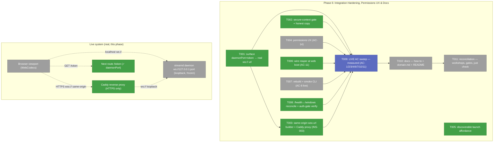
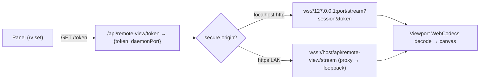
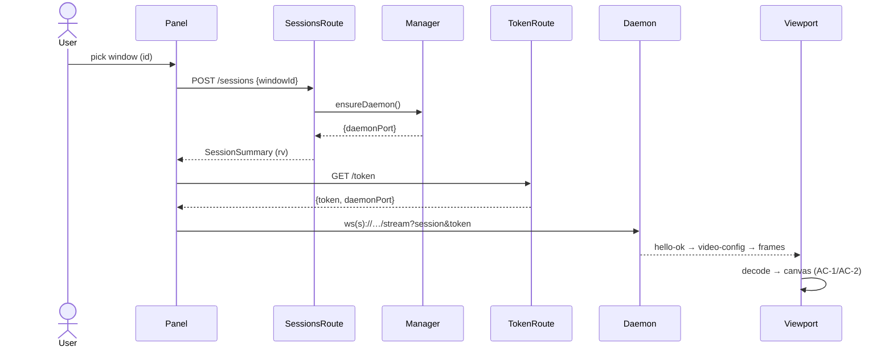

# Phase 6: Integration Hardening, Permissions UX & Docs — Tasks

**Plan**: `docs/plans/088-remote-app-view/remote-app-view-plan.md`
**Phase**: Phase 6 (final spine phase) · **Domain**: remote-view · **Mode**: Full
**Depends on**: Phases 3, 4, 5 (all complete)

> **Grounding note**: this dossier was written *after* a live Phase-6 pre-flight validation against the
> running dev server (`:3000`) on the host Mac. That sweep produced 9 buffered observations
> (`.harness/temp/agent/session-buffer.md`: WIN-001/002, DL-001..005, INS-001/002) which are the empirical
> basis for tasks **T001–T008** below. The plan's Phase-6 table (6.1–6.4) was written assuming the stream
> already worked end-to-end; it does **not**. The keystone gap: **no route surfaces the daemon's WS
> URL/port to the client**, so the viewport connects to `''` and nothing decodes. Phase 6 therefore builds
> the integration glue *first*, then runs the plan's live AC sweep on top of it.

---

## Executive Briefing

- **Purpose**: Make remote-view actually stream end-to-end in a real browser, then prove every live
  acceptance criterion with recorded numbers, ship the permissions story (AC-14), and document setup.
  Phase 5 delivered the daemon, routes, and agent surface but never connected the browser to the live
  daemon — Phase 6 closes that gap and hardens the integration.
- **What we're building**:
  1. The **client⇄daemon connection path** — surface `daemonPort` + token to the client and build the real
     `ws://` (localhost) / `wss://` (LAN) stream URL, replacing the Phase-3 `__REMOTE_VIEW_WS_URL__` stub.
  2. **Secure-context-aware** viewport gating with honest copy (localhost vs HTTPS, not "bad browser").
  3. **wss same-origin** access so an HTTPS page (LAN/tailnet) can stream without mixed-content blocks.
  4. **Permissions UX** (AC-14), a **discoverable launch affordance**, **reaper wired at boot**, a
     **rebuilt CLI**, and **/health↔/windows** reconciliation.
  5. The **live AC sweep** with measured numbers, **docs** (`docs/how/remote-view.md`), and **reconciliation**.
- **Goals**:
  - ✅ A real browser on `http://localhost:3000` attaches a window and decodes live frames on the canvas.
  - ✅ The same works from an HTTPS LAN origin (wss same-origin), with origin allow-listing documented.
  - ✅ Every live AC (AC-1/2/3/4/6/7/10/11/14) executed against real daemon + Godot + booted Simulator, numbers in `execution.log.md`.
  - ✅ Missing TCC grants named precisely with a fix path; `docs/how/remote-view.md` lets a fresh reader complete setup.
  - ✅ `just check` clean; bundle guard + dep-direction still green; no orphan daemons across `just dev` cycles.
- **Non-goals**:
  - ❌ Pointer-lock / relative-mouse (Workshop 003 Q1 → v1.1 backlog).
  - ❌ WebRTC/WHEP transport (documented v2 escape hatch, not built).
  - ❌ Safari support (Chromium-gated by spec clarification; record decode results → backlog only).
  - ❌ Re-architecting the daemon protocol or session FSM (frozen since Phases 2/4).

---

## Prior Phase Context

### Phase 3 — Viewport UI & Content-Area Mode
- **A. Deliverables**: `components/viewport.tsx` (WebCodecs decode→canvas, HUD, all 10 Workshop-002 states),
  `components/remote-view-panel.tsx` (picker⇄viewport orchestrator), `components/window-picker.tsx`,
  `hooks/use-input-capture.ts`, `hooks/use-remote-view-session.ts` (video+telemetry planes), the `?view=remote`
  content mode (`file-browser.params.ts` literal + `params/remote-view.params.ts` `rv`), bundle guard.
- **B. Exported**: `Viewport` props `{url, session, windowId, onExit}`; `WindowPicker` props `{windows, loading, error, onAttach, onRefresh}`; `useRemoteViewSession` adds `onVideoConfig/onFrame/onStats/onPong/requestKeyframe/ping/sendInput`; `WindowDescriptor{id,app,title,pixelWidth,pixelHeight,scale?}`.
- **C. Gotchas/Debt**: **wsUrl is the stub** (`remote-view-panel.tsx:65–69` → `window.__REMOTE_VIEW_WS_URL__ || env || ''`, comment: "Phase 5 replaces this"); **`supported` gate** (`viewport.tsx:95–96`) is mount-time `typeof VideoDecoder === 'undefined'` with **no secure-context distinction** — fires the "unsupported browser" overlay on any non-secure origin.
- **D. Incomplete → Phase 6**: real daemon stream, full-app attach→canvas smoke, true glass-to-glass latency, E_PERMISSION fix-path/how-to.
- **E. Patterns**: dynamic `ssr:false` bundle guard + `data-testid` sentinel; recent-feed content-mode precedent (extend `view` literal, branch in `browser-client.tsx`, switch-back clears both params); decode config is **data-driven from `video-config`** (never hardcode codec/avcC/dims).

### Phase 4 — Native Daemon (Swift)
- **A. Deliverables**: `ChainglassStreamd.app` (signed, `~/Library/Application Support/chainglass/streamd/`); modules incl. `WSServer.swift`, `Auth.swift`, `Endpoints.swift`, `Protocol.swift`, `Input.swift`, `Registry.swift`, `main.swift`; endpoints `/health` (no auth), `/windows`, `/sessions`, `GET /stream` (WS), `POST /shutdown`.
- **B. Exported**: **WS endpoint `ws://127.0.0.1:<port>/stream?session=<id>&token=<JWT>`** — **loopback-bound (FT-001), plain `ws://` only (no wss — "HTTPS proxy is Phase 5's job")**; port = `CG_REMOTE_VIEW__DAEMON_PORT` env or default; registry writes a **`port`** field. Protocol v1: `hello-ok`→`video-config{codec,description(b64 avcC),width,height,fps}`→keyframe→deltas; control `ping/pong{sentAt,daemonAt}`, `request-keyframe`, `input`, `detach`. Auth: HS256 JWT `?token=`, `aud=remote-view-ws`, `iss=chainglass`, `exp` required; bad token→close 4401, bad origin→4402. **Origin allowlist** from `CG_REMOTE_VIEW__ALLOWED_ORIGINS`. `/health` → `{ok, daemonVersion, protocolVersion, permissions:{screenRecording,accessibility}}` with grant enum `granted|denied|not-determined`. `--list-windows` one-shot JSON catalog. Bundle via `just streamd-install` (`make-bundle.sh` + `chainglass-dev` cert; rebuild **keeps** TCC grants — Finding 02).
- **C. Gotchas/Debt**: headless `CoreGraphicsInit.ensure()` mandatory before SCK/CGEvent; **stable cert+bundle-id load-bearing** (rebuild without it re-prompts TCC); input needs the **streamed app frontmost** (daemon raises it); **capture-at-spawn** must be on the active Space; `ws://` loopback only.
- **D. Incomplete → Phase 6 (live-verify)**: FT-006 live resize re-config, FT-007 `E_PERMISSION` denial sweep, FT-008 scroll/wheel fidelity, FT-009 minimized auto-restore — all code-complete, none live-verified.
- **E. Patterns**: auth copied byte-for-byte from `terminal-auth.ts` (shared vectors oracle); latest-attach-wins FSM (Workshop 002); `FrameSource` seam (fixtures vs live capture); manager spawns the **signed inner binary** with absolute `--registry`/`--bootstrap` + `CG_REMOTE_VIEW__WINDOW_ID`/`_DAEMON_PORT`.

### Phase 5 — Lifecycle, Agent Surface & Events
- **A. Deliverables**: `server/daemon-manager.ts` (`ensureDaemon()`), `server/daemon-reaper.ts` (`reapStreamdDaemon()`), `server/remote-view-service.production.ts` + DI swap (`di-container.ts:733`), routes `/health`, `/windows`, `/sessions` (GET/POST/DELETE), `/token`, SSE `remote-view` envelopes, GlobalState publish, SDK/CLI/MCP surface (T008/T009/T010).
- **B. Exported**: `/sessions` POST → `SessionSummary{sessionId,windowId,app,title,state}` (**no daemonPort/url/token**); GET → `{sessions:[]}`; **auth split** — `/sessions` use `requireRemoteViewAccess` (NextAuth **or** X-Local-Token), `/windows`+`/health` use `requireRemoteViewSession` (NextAuth-only, *per code*). `/token` mints HS256 JWT (`aud=remote-view-ws`, 300s) but **returns only the token**. `ensureDaemon()` → `DaemonInfo{daemonPort,daemonVersion,protocolVersion}` (server has the port). DI tokens `REMOTE_VIEW_SERVICE_TOKEN`, `REMOTE_VIEW_DAEMON_CONTROL_TOKEN`.
- **C. Gotchas/Debt (the headline)**: **client WS URL never wired** — no route returns `daemonPort`; panel still uses the Phase-3 stub → viewport gets `''`. **Reaper exists but is never called at web boot** (AC-11 orphan risk). Production service path not unit-tested (live-only). **Live finding INS-001**: `/health` answered a request carrying *only* `X-Local-Token` (no NextAuth cookie) with **200** — contradicts the "NextAuth-only" gate the code appears to declare; verify whether this is a real auth gap.
- **D. Incomplete → Phase 6**: real WS-url resolution pipeline; live spawn/proxy TCC-attribution; viewport live stats; `detached`/`daemon-state` client consumers (emitted, not consumed); wire `reapStreamdDaemon` at boot.
- **E. Patterns**: DI `useFactory` prod-only swap (ADR-0004); injectable auth gates before service resolution; registry field is **`port`** → HTTP maps to `daemonPort` (one-way, never derive); `readServerInfo` + `X-Local-Token` (CLI/MCP); inline `createRemoteViewRequest` duplicate (package can't import app).

---

## Pre-Implementation Check

| File | Exists? | Domain | Notes |
|------|---------|--------|-------|
| `apps/web/src/features/088-remote-view/components/remote-view-panel.tsx` | ✅ modify | remote-view | replace `wsUrl` stub (T001); add launch-affordance plumbing if needed (T005) |
| `apps/web/src/features/088-remote-view/components/viewport.tsx` | ✅ modify | remote-view | secure-context branch + copy (T002); E_PERMISSION fix-path card (T004) |
| `apps/web/src/features/088-remote-view/hooks/use-remote-view-session.ts` | ✅ modify | remote-view | already fetches `/token` — consume `daemonPort`/url from extended response (T001) |
| `apps/web/app/api/remote-view/token/route.ts` | ✅ modify | remote-view | extend response with `daemonPort` (+ resolved `wsUrl`) (T001) — **contract change, higher risk** |
| `apps/web/app/api/remote-view/stream/route.ts` | ❌ create | remote-view | wss same-origin WS proxy → loopback daemon (T003) |
| `apps/web/src/features/088-remote-view/server/daemon-manager.ts` | ✅ read/modify | remote-view | source of `daemonPort` for T001; reaper hook (T006) |
| `apps/web/src/features/088-remote-view/server/daemon-reaper.ts` | ✅ reuse | remote-view | wire `reapStreamdDaemon()` at boot (T006) |
| `apps/web/app/(dashboard)/workspaces/[slug]/browser/browser-client.tsx` | ✅ modify | file-browser | add discoverable launch affordance mirroring recent-feed (T005) |
| `apps/web/app/api/remote-view/windows/route.ts` + `health/route.ts` | ✅ modify | remote-view | reconcile daemon-control + bundle-state error code; verify auth gate (T008) |
| `apps/cli/dist/cli.cjs` | ⚠️ stale (21 Jun) | cli | rebuild so `cg remote-view` verbs ship (T007) |
| `docs/how/remote-view.md` | ❌ create | docs | setup + TCC + secure-context + Caddy LAN + troubleshooting (T010) |
| `docs/domains/remote-view/domain.md` | ✅ modify | remote-view | finalize § Concepts (T010) |
| `apps/web/.../088-remote-view/...` env: `CG_REMOTE_VIEW__ALLOWED_ORIGINS`, `AUTH_TRUST_HOST` | n/a config | remote-view | add LAN https origin + trust host (T003) |

**Contract-change flags (higher risk)**: T001 changes the `/token` response shape; T003 adds a new WS proxy route + origin-allowlist + auth-trust config. Both are additive but touch the auth/transport boundary — review carefully.

---

## Architecture Map



---

## Tasks

| Status | ID | Task | Domain | Path(s) | Done When | Notes |
|--------|-----|------|--------|---------|-----------|-------|
| [x] | T001 | **Surface the daemon connection to the client.** Extend `GET /api/remote-view/token` to return `{ token, daemonPort }` (read `daemonPort` from `ensureDaemon()`/registry — server already has it). In `use-remote-view-session.ts` (already fetches `/token`) / `remote-view-panel.tsx`, build the real URL `ws://127.0.0.1:<daemonPort>/stream?session=<rv>&token=<jwt>` and pass it as the `Viewport` `url` prop — **delete the `__REMOTE_VIEW_WS_URL__ \|\| env \|\| ''` stub** (`remote-view-panel.tsx:65-69`). | remote-view | `apps/web/app/api/remote-view/token/route.ts`, `apps/web/src/features/088-remote-view/components/remote-view-panel.tsx`, `apps/web/src/features/088-remote-view/hooks/use-remote-view-session.ts` | On `http://localhost:3000`, attaching the iOS Simulator (or Godot) yields a non-empty ws url, the WS connects, `video-config` arrives, and **≥1 frame decodes to the canvas** (no "isn't supported"/black screen). | **Keystone** (DL-005). **Additive contract change**: `/token` goes `{token,expiresIn}` → `{token,expiresIn,daemonPort}` — back-compat (existing readers keep using `.token`); update the `/token` route contract test + have `use-remote-view-session.ts` read `.daemonPort`. Keep token TTL 300s; url built client-side from the port. |
| [x] | T002 | **Secure-context-aware gate + honest copy.** In `viewport.tsx`, distinguish `!window.isSecureContext` from a genuinely missing WebCodecs API. Show the real reason + fix ("Open via https:// or http://localhost — this origin isn't a secure context") when insecure; keep "use a recent Chromium-based browser" **only** when `isSecureContext && typeof VideoDecoder === 'undefined'`. | remote-view | `apps/web/src/features/088-remote-view/components/viewport.tsx` | On a non-localhost HTTP origin the overlay names secure-context + the fix; on localhost/HTTPS Chrome the gate passes; the unit/smoke asserts both branches. | DL-004. Branch on `window.isSecureContext`: insecure → name secure-context + prescribe `http://localhost` or HTTPS; keep "use a recent Chromium-based browser" **only** when `isSecureContext && typeof VideoDecoder === 'undefined'`. Exact wording is the implementer's; the test asserts the two branches render distinct messages. |
| [x] | T003 | **Same-origin wss client url for LAN/HTTPS (canonical, INS-003).** RE-SCOPED after research: a Next route **cannot** upgrade a WS here (Next closes upgrades; WS is served by sidecars), and the daemon is loopback-only (frozen). The canonical/elegant path is a **same-origin reverse proxy** (Caddy+Porkbun) `wss://<host>/remote-view-ws` → `ws://127.0.0.1:<daemonPort>` — so the only product code is a client url builder: HTTPS → same-origin `wss://host/remote-view-ws`; `http://localhost` → direct `ws://127.0.0.1:<daemonPort>` (T001). Plus the daemon origin allowlist (inherited via spawn `process.env`) + `AUTH_TRUST_HOST`/`AUTH_URL`; Caddy recipe → T010 docs. **No Next route, no new sidecar.** | remote-view | `apps/web/src/features/088-remote-view/components/stream-url.ts` (new `buildStreamUrl`), `remote-view-panel.tsx`, `apps/web/.env.example` (origin/trust config), `docs/how/remote-view.md` (Caddy recipe → T010) | On an HTTPS origin the client builds same-origin `wss://host/remote-view-ws` (never a mixed-content `ws://`); on localhost it stays direct-loopback; `buildStreamUrl` branch logic unit-tested; daemon origin allowlist documented. Live HTTPS frame = T009. | INS-003 (research-backed pivot from the dossier's infeasible "Next route" plan). **Auth model unchanged**: the client `?session&token` rides through the proxy verbatim; the proxy only terminates TLS + presents the same-origin `Origin` the daemon allow-lists. Caddy + Porkbun DNS-01 recipe: **adapt** `jk-claw/scratch/local-ssl-porkbun-letsencrypt.md`. |
| [ ] | T004 | **Permissions UX (AC-14, plan 6.1).** Map `/health.permissions` + the WS `E_PERMISSION` close to a picker **preflight card** and a CLI message that names the exact missing grant (Screen Recording / Accessibility) + a deep-link to the System-Settings pane. No silent failure. | remote-view | `apps/web/src/features/088-remote-view/components/window-picker.tsx`, `viewport.tsx`, `apps/cli/.../remote-view.command.ts` | With a grant revoked, the picker card **and** `cg remote-view` each name the missing grant + the fix path; re-granting recovers. | Plan 6.1 / AC-14. **AC-14 is split**: T004 = in-app UX (preflight card + CLI message + System-Settings deep-link); T010 = the how-to docs — T004's fix-path link points at T010's `docs/how/remote-view.md` § TCC setup. Closes daemon FT-007 live. |
| [x] | T005 | **Discoverable launch affordance.** Add a visible entry point for `view=remote` mirroring recent-feed's (toolbar button / tab calling `setParams({view:'remote', rv:null})`), so remote-view isn't palette-only. | file-browser / remote-view | `apps/web/app/(dashboard)/workspaces/[slug]/browser/browser-client.tsx` | A first-time user can open remote-view from a visible control (no palette/URL knowledge needed); the existing palette `remote-view.attach` still works. | DL-003. recent-feed entry points at `browser-client.tsx:280/923/1446` are the precedent. **Done:** extracted `RemoteViewLaunchButton` (Monitor icon) into the ExplorerPanel `rightActions` slot beside the recent-feed `History` button (`browser-client.tsx:1454`); `onLaunch` closes the terminal overlay then `setParams({view:'remote', rv:null})`; palette `remote-view.attach` unchanged (`:965`). Unit test (3) pins accessible-name + fires-once + real-button. |
| [x] | T006 | **Wire the reaper at web boot (AC-11).** Call `reapStreamdDaemon()` on web-server startup so orphaned daemons from prior `just dev` cycles are reaped fail-closed at boot (function exists + tested since T002, never invoked). | remote-view | `apps/web/src/features/088-remote-view/server/daemon-reaper.ts`, `apps/web/instrumentation.ts` (Next.js `register()` server-boot hook) | After killing the web server mid-stream and restarting, no orphan `streamd` survives; reaper logs the fail-closed decision; AC-11 orphan check passes across cycles. | Phase-5 carried debt. Wire `reapStreamdDaemon()` into the existing `register()` in `apps/web/instrumentation.ts` (guard so it runs once, server-runtime only). Fail-closed semantics already TDD'd. |
| [ ] | T007 | **Rebuild + smoke the CLI (AC-8 live).** Rebuild `apps/cli` so the T009 `cg remote-view list\|attach\|detach` verbs ship in `dist/cli.cjs` (currently 21 Jun, pre-verbs), then round-trip all three against the running dev server. | cli / remote-view | `apps/cli/dist/cli.cjs` (rebuild), `apps/cli/.../remote-view.command.ts` | `cg remote-view list/attach/detach` each succeed against `:3000` (list shows the active session, attach creates one, detach 204s). | DL-001. Add a `just` guard/recipe flagging a `dist` older than `src` (suggested encoding). |
| [x] | T008 | **Reconcile `/health` ↔ `/windows` + verify auth gate.** Ensure both resolve the **same** daemon-control instance and agree on bundle-installed state; return a named `E_BUNDLE_MISSING` (prescribing `just streamd-install`) instead of `E_INTERNAL` when the bundle is unresolvable. Verify the documented session-only gate on `/health` + `/windows` actually holds (the live probe saw `/health` accept `X-Local-Token` alone). | remote-view | `apps/web/app/api/remote-view/windows/route.ts`, `health/route.ts`, `server/daemon-control.ts` | A missing bundle yields `E_BUNDLE_MISSING` on both routes; an unauthenticated (no NextAuth, no/!valid token) request to `/health`+`/windows` is rejected; both reflect the same daemon. | INS-001 + DL-002. Possible auth gap — treat as security-relevant. **Done:** (1) `E_BUNDLE_MISSING` code + injectable `bundleInstalled()` predicate (pure; prod wires `existsSync(innerBinaryPath)`), guarded up front in `listWindows/health/daemonPort`; both routes map → 503. (2) Same-instance: control was `useFactory` (transient; tsyringe ignores lifecycle for factories) → memoized per-container. (3) **Auth gap was a false alarm** — `/health`+`/windows` are `GET()` zero-arg → can't read `X-Local-Token` → NextAuth-only by construction; the live-probe acceptance was `DISABLE_AUTH` faking a session. Pinned structurally (`toHaveLength(0)`) + null-session 401-before-daemon. +10 tests; 201/201. |
| [ ] | T009 | **LIVE AC sweep — measured (plan 6.2).** Against real daemon + real Godot + booted Simulator, execute and **record numbers** in `execution.log.md`: AC-1 (live picker+attach), AC-2 (≥30fps sustained, HUD glass-to-glass ≤150ms), AC-3/AC-4 (click/drag/scroll/type fidelity — closes FT-008/009), AC-6 (refresh ≤3s reattach), AC-7 (two tabs displace/reclaim), AC-10 (minimize auto-restore / closed→"window gone", FT-006/009), AC-11 (orphan check across `just dev` cycles), Workshop-004 version-mismatch respawn (old daemon + new web build). | remote-view | `docs/plans/088-remote-app-view/tasks/phase-6-integration-hardening-permissions-ux-docs/execution.log.md` | Every row of the **T009 Measurement Sheet** (below the table) recorded in `execution.log.md` with its value + `PASS/FAIL`; any AC-2 miss notes the Workshop-003 knob applied (frame-request rate first, then encode bitrate). | **The integration moment.** Gated on T001–T008. Record per the Measurement Sheet. Latency budget 35–65ms typical (plan risk). |
| [ ] | T010 | **Docs (plan 6.3, AC-14).** Write `docs/how/remote-view.md`: one-time setup (`just streamd-setup` cert + `just streamd-install` + TCC grants), the **secure-context story** (localhost vs the Caddy/Porkbun HTTPS LAN pattern), agent verbs (CLI/MCP/palette), and a **troubleshooting table keyed by error code** (`E_PERMISSION`, `E_ORIGIN`, `E_VERSION`, `E_BUNDLE_MISSING`, secure-context overlay). Add a README mention; finalize `domain.md` § Concepts. | remote-view / docs | `docs/how/remote-view.md` (new), `README.md`, `docs/domains/remote-view/domain.md` | Docs build, links valid; a fresh reader completes setup from the how-to alone; every user-facing error code has a row. | Plan 6.3. Fold `just streamd-install` prereq (WIN-002) here. |
| [ ] | T011 | **Reconciliation (plan 6.4).** Close/route Workshop open questions; record Safari decode results → backlog; verify dependency-direction + bundle guards still green; `just check` clean. | remote-view | plan workshops, `docs/plans/088-remote-app-view/`, repo-wide gates | No stale OPENs the work answered; `just check` passes (Constitution §3.4); bundle guard + dep-direction green. | Plan 6.4. Scan `docs/plans/088-remote-app-view/workshops/{001,002,003,004}*.md` for remaining `OPEN` markers; resolve each (→ a T001–T010 outcome) or re-mark `DEFERRED-v1.1` (e.g. pointer-lock → v1.1). |

**Status legend**: `[ ]` pending · `[~]` in progress · `[x]` complete · `[!]` blocked.

### Acceptance-Criteria → Task coverage (for the review verb)

Only ACs the plan assigns to Phase 6 (live) are listed; AC-5/8/9/12/13 closed in earlier phases.

| AC | Plan tag | Closed by | Measurable Done-When |
|----|----------|-----------|----------------------|
| AC-1 | Phase 6 (live) | T001 → T009 | picker lists ≥1 window; attach decodes ≥1 frame |
| AC-2 | Phase 6 (measured) | T001 → T009 | HUD fps ≥30 sustained; glass-to-glass ≤150ms |
| AC-3 | Phases 4/6 live | T009 | click/drag/scroll/type land at correct coords (Godot) |
| AC-4 | Phases 4/6 live | T009 | Simulator clicks→taps, typed text arrives |
| AC-6 | Phase 6 live | T001 → T009 | refresh reattach ≤3s |
| AC-7 | Phase 6 live | T009 | latest-attach-wins; displaced shows reclaim; no wedge |
| AC-10 | Phases 3/4/6 | T009 | minimized auto-restores; closed → "window gone", never silent black |
| AC-11 | Phase 5 + 6 live | T006 → T009 | 0 orphan `streamd` across `just dev` cycles |
| AC-14 | Phase 6 | T004 + T010 | revoked grant → UI **and** CLI name it + fix path; how-to documents setup |

### T009 — AC Sweep Measurement Sheet

The implement verb records one row per AC in `execution.log.md` (table: `| AC | Measured value | Pass threshold | Verdict | Notes |`). Targets are from the plan's Acceptance Criteria + Workshop 003.

| AC | What to measure | Method | Pass threshold |
|----|-----------------|--------|----------------|
| AC-1 | attach succeeds; window shown | pick Simulator/Godot, observe canvas | frame visible (PASS/FAIL) |
| AC-2 fps | sustained frame rate under motion | read HUD fps over ~30s of activity | ≥30 fps sustained |
| AC-2 latency | glass-to-glass | HUD latency-ms (ping/pong clock-offset) over ~30s | ≤150 ms |
| AC-3 | click/drag/scroll/type fidelity (Godot, windowed) | each interaction, observe target response on Retina | lands at correct coord (PASS/FAIL per interaction) |
| AC-4 | Simulator clicks→taps + typed text | tap + type into a Simulator field | correct (PASS/FAIL) |
| AC-6 | refresh reattach time | `Date.now()` from reload to `video-config` arrival | ≤3 s |
| AC-7 | two-tab displace/reclaim | open 2nd tab, attach; reclaim in 1st | latest wins; reclaim works; no wedge (PASS/FAIL) |
| AC-10 | minimize auto-restore; closed→gone | minimize target; close target | auto-restores; "window gone" shown, no black frame (PASS/FAIL) |
| AC-11 | orphan daemons | count `streamd` PIDs after N `just dev` stop/start cycles | 0 stale |
| Workshop-004 | version-mismatch respawn | run old daemon + new web build, attach | graceful shutdown + respawn (PASS/FAIL) |

---

## Context Brief

**Key findings (live Phase-6 pre-flight + plan)**:
- **DL-005 (keystone)**: no route returns `daemonPort`/ws-url to the client; panel uses the Phase-3 stub → `url=''`, no stream. → T001.
- **DL-004**: the "unsupported browser" overlay is a **secure-context** false-negative (WebCodecs off on non-localhost HTTP), miscopied as a browser-version issue. → T002.
- **INS-002**: HTTPS forces wss; a secure page can't open the daemon's `ws://127.0.0.1` (mixed content) → need wss same-origin proxy + origin allow-list + `AUTH_TRUST_HOST`. → T003.
- **DL-003**: no discoverable UI button (palette/URL only). → T005.
- **WIN-002 / DL-002**: `just streamd-install` (rebuild+resign) is a hard prereq for live window enumeration; route should name `E_BUNDLE_MISSING`. → T008/T010.
- **DL-001**: shipped CLI binary stale (pre-T009 verbs). → T007.
- **INS-001**: `/health` accepted `X-Local-Token` alone — verify the gate. → T008.
- **WIN-001**: `/sessions` route + `requireRemoteViewAccess` + live adapter proven working end-to-end (the parts that *do* work).
- Plan risks carried: AC-2 latency first measured here (budget 35–65ms, headroom to 150ms); TCC-reset on rebuild mitigated by the stable cert (Finding 02).

**Domain dependencies (consumed)**:
- `remote-view`: `useRemoteViewSession` (video+telemetry WS plane) — the connection T001 feeds; `daemon-manager.ensureDaemon()` → `daemonPort`; `daemon-reaper.reapStreamdDaemon()` (T006).
- `remote-view` auth: HS256 JWT (`/token`), origin allowlist (`CG_REMOTE_VIEW__ALLOWED_ORIGINS`), `requireRemoteViewSession`/`requireRemoteViewAccess`.
- `file-browser`: the `view` content-mode param + `browser-client.tsx` branch (T005 launch affordance).
- `_platform/state`: GlobalState `remote-view:<ses>:status/latency/fps` (HUD numbers for AC-2).
- `auth` (NextAuth): trusted-host config for the LAN HTTPS origin (T003).

**Domain constraints**:
- Decode is **data-driven from `video-config`** — never hardcode codec/avcC/dims.
- Daemon WS is **loopback `ws://` only**; the *only* secure cross-host path is a same-origin wss proxy (T003) — do not expose the daemon port on the LAN.
- Registry field is **`port`**; HTTP/API surfaces it as **`daemonPort`** (one-way map, never derive).
- Auth gate must run **before** service resolution; the `/token` JWT requires `exp`.
- Bundle stability (cert + id) is load-bearing for TCC — never break it in a rebuild.

**Reusable from prior phases**:
- `testing/fake-streamd.ts` (frame-replay fake) + `protocol/fixtures/video/` — exercise the panel/secure-context branches without a daemon (T001/T002 unit/smoke).
- `harness/.../remote-view-smoke.test.ts` (Phase-3 Playwright+CDP smoke) — extend for the live attach path.
- Auth vectors oracle (`remote-view-auth-vectors.json`); `terminal-auth.ts` token pattern.
- recent-feed entry-point precedent (`browser-client.tsx:280/923/1446`) for T005.
- `just streamd-setup` / `streamd-install` / `streamd-kill` recipes.

**Mermaid — connection flow (T001/T003)**:


**Mermaid — live attach sequence (T001 → T009)**:


---

## Discoveries & Learnings

_Populated during implementation by the implement verb._

| Date | Task | Type | Discovery | Resolution | References |
|------|------|------|-----------|------------|------------|
| 2026-06-23 | T001 | decision | No route surfaced the daemon port → `RemoteViewDaemonControl` was the right home for a `daemonPort()` accessor (the non-frozen host surface, sibling to `health()`), not the frozen `IRemoteViewService` session contract. | Added `daemonPort()` to the control (real reads `ensureDaemon().daemonPort`; fake returns `FAKE_DAEMON_PORT`); `/token` resolves it; panel builds `ws://127.0.0.1:<port>`. | daemon-control.ts, token/route.ts |
| 2026-06-23 | T001 | decision | `/token` is fetched per-connect by the hook AND once by the panel; making daemon-port resolution best-effort (try/catch → omit) keeps token issuance independent of daemon liveness (back-compat + graceful daemonDown). | Route swallows resolution failure → `{token,expiresIn}` only; client shows a "Streamer not reachable" card. Tested both branches. | token-route.test.ts |
| 2026-06-23 | T001 | workaround | The token unit test would resolve the **production** control → `ensureDaemon()` → a real `streamd` spawn (non-hermetic). | Mocked **only** `@/lib/bootstrap-singleton` so the route resolves a fake control; rest of the file stays unmocked real-crypto (the one sanctioned mock, documented in-file). | token-route.test.ts |
| 2026-06-23 | T001 | **Noteworthy** | Live wiring CONFIRMED (daemon→port 4501, `/health` ok + grants, `/windows` lists Simulator id 649); the in-browser **frame decode** (the visual ≥1-frame Done-When) is folded into **T009**'s measured live sweep — it needs the user's authenticated browser session and is exactly AC-1/AC-2. | T001 marked code-complete + live-wiring-verified; visual decode → T009 (gated on T001–T008). | execution.log.md |
| 2026-06-23 | T001 | debt | `just typecheck` is RED on 4 **pre-existing** test-file type errors unrelated to Phase 6 (commander v11/v13; RequestInit/tuple/ProcessEnv). | Flagged for **T011**'s `just check` gate; T001's own files are tsc-clean. See observe `DL-006`. | T011 |
| 2026-06-23 | T003 | **Noteworthy** | Dossier↔reality drift (INS-003): T003's "add a Next route that upgrades the WS" is infeasible — Next can't upgrade WS (it closes upgrades); chainglass serves WS via sidecars; the daemon is loopback-only (frozen). Perplexity research confirmed the canonical pattern = same-origin reverse proxy. | RE-SCOPED with the user: T003 = a client `buildStreamUrl` (HTTPS→same-origin wss, localhost→loopback) + env config; the wss bridge is Caddy (the user's Porkbun pattern), recipe → T010. **No Next route, no sidecar.** | stream-url.ts, INS-003 |

**Types**: `gotcha` · `research-needed` · `unexpected-behavior` · `workaround` · `decision` · `debt` · `insight`

---

## Directory layout

```
docs/plans/088-remote-app-view/
  ├── remote-app-view-plan.md
  └── tasks/phase-6-integration-hardening-permissions-ux-docs/
      ├── tasks.md            # this file
      └── execution.log.md    # created by the implement verb (holds the T009 measured AC sweep)
```

---

## Validation Record (2026-06-23)

### Validation Thesis

**Raison d'être**: Convert plan Phase 6 into implementation-ready tasks **grounded in the live-validated reality** that remote-view does not stream — no route surfaces the daemon WS url/port to the client (the panel uses a Phase-3 stub → `url=''`). The dossier is what an implementer consumes to make remote-view stream end-to-end **and** prove every live AC.

**Value claim**: Phase 6 is built correctly the first time (no re-discovering the `wsUrl` stub mid-build); the live AC sweep (T009) is correctly gated behind the integration glue (T001–T008); the dossier↔reality drift a prior retro flagged does not recur.

**Artifact promise**: An implementer builds Phase 6 with minimal clarification — each task names concrete files + an observable Done-When; the dependency chain (T001 keystone → T009 gated) is explicit.

**Intended beneficiaries**: the implement verb (primary), the reviewer, the human running the live AC sweep, future maintainers (docs).

**Proof target**: Implementation.

**Evidence standard**: each task → concrete file (exists/create) + observable Done-When; current-state claims match source; plan ACs covered; acyclic deps.

**Thesis source**: `remote-app-view-plan.md` Phase 6 (L200–215) + ACs (L217–234) + 9 live observations in `.harness/temp/agent/session-buffer.md`.

**Thesis verdict**: Advanced (after fixes) — was *partially* advanced (uneven specification); the source-grounded fixes below close the main gaps.

**Main thesis risk**: T004/T005 in-app UX surface (card vs toast; button placement) is left to the implementer's design judgment — appropriate for a tasks dossier, not a blocker.

---

| Agent | Lenses Covered | Thesis Axes | Issues | Verdict |
|-------|---------------|-------------|--------|---------|
| Source Truth | Evidence Sufficiency, Hidden Assumptions, Security, Integration & Ripple | Evidence Sufficiency | 0 material (all source claims verified) | ✅ grounded |
| Cross-Reference + Completeness | Integration & Ripple, Edge Cases, Deployment & Ops, Domain Boundaries, Concept Docs | Downstream Usefulness | 0 material (9/9 findings, full AC coverage, acyclic) | ✅ complete |
| Thesis Alignment | Thesis Alignment, Proof-Level Fit, Implementation Readiness | Thesis Alignment, Proof-Level Fit | 1 HIGH + 5 MED + 3 LOW (uneven spec) → fixed | ⚠ → ✅ |
| Forward-Compatibility | Forward-Compatibility, Contract Integrity, Integration & Ripple | Contract Integrity, Downstream Usefulness | 3 HIGH + 4 MED → fixed | ⚠ → ✅ |

### Forward-Compatibility Matrix

| Consumer | Requirement | Failure Mode | Verdict | Evidence |
|----------|-------------|--------------|---------|----------|
| implement verb | concrete file + observable Done-When per task | encapsulation lockout / test boundary | ✅ (fixed) | T009 Measurement Sheet added; T006 seam = `instrumentation.ts:register()`; T003 env = `.env.local` |
| review verb | AC→task map | contract drift | ✅ (fixed) | explicit AC→Task coverage table added |
| execution.log.md | T009 specifies what to record | test boundary | ✅ (fixed) | Measurement Sheet defines per-AC value + threshold + log table shape |
| plan AC rollup | closes Phase-6 ACs + deliverables | contract drift | ✅ | every Phase-6 AC + deliverable (docs/how, README, domain.md) has a task; T001 `/token` change marked additive/back-compat |

**Thesis alignment**: Value claim advanced at the Implementation proof target after fixes — the keystone (T001) and the gated live sweep (T009) now carry observable, source-grounded Done-When; residual risk is only the T004/T005 UX surface, left to the implementer by design.

**Outcome alignment** (Forward-Compatibility agent, verbatim): *"The dossier, as written, puts that outcome on trajectory structurally — T001 unblocks the live WS connection (the keystone), T004+T010 deliver the permissions story, and T009 is the integration sweep. However, the dossier's Phase-6 promise is not deterministically completable because T009's measurement specification is missing, T001 breaks the Phase-5 /token contract without acknowledgment, and T006/T003 lack specific file paths."* — **All three named gaps were fixed in this validation pass** (T009 Measurement Sheet; T001 marked additive/back-compat; T006 = `instrumentation.ts`, T003 = `.env.local` + proxy auth model).

**Standalone?**: No — downstream consumers (implement verb, review verb, execution.log.md, plan AC rollup) exist; this is the terminal phase, so consumers are the flow verbs + the AC rollup, not a phase-7.

Overall: **VALIDATED WITH FIXES**
