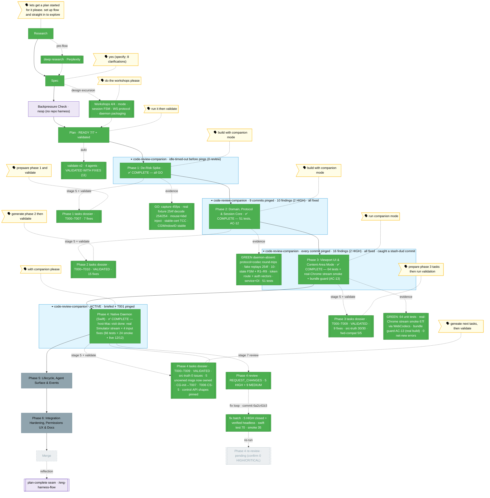

<!-- 🔄 RENDERED from the-flow.json — regenerate, never hand-edit this file as the primary. -->
# the-flow · remote-app-view (flight view)

**Plan**: remote-app-view · **Mode**: Full · **Phases**: 6 (locked at architect)
**Rail**: `[the-flow] ◆─◆─◆─[◆─◆─◆─◐─◇─◇]─◇  research · spec · plan · [build 4/6] · review · merge`   ·   **now**: Phase 4 review → **REQUEST_CHANGES** (5 HIGH + 9 MEDIUM) → **fix loop LANDED** (commit `6a2c41b3`). All **5 HIGH closed + verified headless** (loopback-only listener · JWT on every REST except /health · WS controls gated on the attached viewer · Content-Length validated → 400 + size caps · /windows narrowed to the single attached window). Safe MEDIUMs fixed (wheel · E_PERMISSION preflight · runtime display scale · AX minimize-restore) + docs (overclaims corrected · domain docs · streamd-kill); **FT-006 live resize re-config deferred to Phase 6**. Proof: `swift test` **70/70** (+4), `just streamd-smoke` **35/35** (+11 negatives incl. a real non-loopback-unreachable assertion).   ·   **next**: **re-run the Phase 4 review** to confirm zero HIGH/CRITICAL (`/the-flow 7 review --phase "Phase 4: Native Daemon (Swift)"`); when clean → continue the build → **Phase 5** tasks (`/the-flow 5 tasks --phase "Phase 5: Lifecycle, Agent Surface & Events"`)

**Legend**: 🟩 done · 🟧 in progress · 🟥 blocked · 🟦 known future (designed) · ⬜╴assumed future (dashed) · 🟨 🗣 verbatim user input · 🟪 harness seams · 🟦 companion (cyan)

_Generated from `the-flow.json`. **Phase 2 is implemented, reviewed, and green** — 11 tasks (T001–T010) + a companion review-response, **56 tests across 8 files** (51 + 5 finding tests), run serially. **AC-12 met**: the entire web side runs and passes with **no daemon** — the `remote-view` domain + dep-direction guard, the Zod wire protocol + 16-byte binary codec (with `messages.json` **and** `frame-header.json` as the cross-language drift guards for the Swift daemon, Task 4.2), the first-class frame-replay fake (254 owned `sck-capture` frames), the 10-state session machine + reconnect hook (R1/R2/R3/R5/R6/R7/R8/R9 incl. the `daemonDown` health fork), the frozen-contract token route (`aud=remote-view-ws`, no `cwd`) + pinned auth vectors (Task 4.4), and `IRemoteViewService` + Fake + DI + reusable contract suite. Two logged deviations: T007 uses real timers + injected short durations (fake-timer/real-socket deadlock), and `zod` pinned `^4.3.5` in `apps/web`. The live `code-review-companion` was booted + briefed, every commit pinged, and it **actively reviewed** — surfacing **10 findings (2 HIGH: F004 displaced-state R3-trap escape, F007 learned-windowId clobber breaking R6 deep-link recreate; 8 MEDIUM)** on the inside lane. (An earlier flight-plan note wrongly recorded "0 replies / non-engagement" — an operator read-path error querying the outside lane; corrected, anecdote filed as minih issue [#47](https://github.com/AI-Substrate/minih/issues/47).) **All actionable findings landed in the review-response commit** → stage-7 review is **effectively satisfied** by the companion + response. **Phase 3 is implemented, reviewed, and green** — the full user-visible web surface against the Phase 2 fake (AC-12, no daemon): `view=remote` + `rv` content-area mode (extends recent-feed; no PanelShell change), lazy RemoteViewPanel, window picker (loader-hook seam — **discovery: this app has no client DI**, `IRemoteViewService` is server-only), WebCodecs viewport (data-driven `video-config` decode + drop-to-keyframe + HUD fps/rtt/bitrate/dropped + all 10 Workshop-002 states incl. displaced reclaim card + named-grant error + WebCodecs-unsupported fallback) + normalized rAF-batched **focus-gated** input capture. The Phase 2 `useRemoteViewSession` hook gained an **additive** video+telemetry plane (`onVideoConfig/onFrame/onStats/onPong/requestKeyframe/ping/sendInput`; all 56 Phase-2 tests unchanged). **Validated**: 64 unit tests; a **host streaming smoke on real Chrome** (67 H.264 frames decoded via WebCodecs from fake-streamd — run on the Mac host per the user's directive, sidestepping Docker-on-Mac); a bundle guard **vs a real `next build`** (AC-13). The live `code-review-companion` (run …f894) **actively reviewed every commit** — 16 findings (2 HIGH: F003 WebCodecs-unsupported fallback, F009 input-before-focus), **all fixed** — and caught a process failure (the `bcf40d20` stash-mishap dud, recovered as `e7cdd9b3`). ⚠️ Companion F013–F015: the commits carry a `Co-Authored-By` trailer that **AGENTS.md:167 forbids** — dropped going forward; the 11 earlier ones await a user decision on rebase. **Phase 4 tasks are now generated + validated** (T000–T009 + a §Validation addenda message-ownership table; validate-v2 source-truth **0 issues**, 5 unowned wire messages now owned — `client-stats`/`bye{detached,window-gone}`/`window-state{gone}`+`E_WINDOW_GONE`/`E_VERSION`/`E_PERMISSION`-over-WS — CG-init added to T007, T006 bumped to CS-5, control-API shapes pinned for Phase 5; plan 4.4 split a/b/c → T004/T005/T006). **Swift 6.2.4 is on the host**, so the protocol-mirror (T002) + auth-vector (T004) conformance tests are automatable via `swift test`; capture/encode/input stay manual (Hybrid, per the Constitution Deviation Ledger). **Next: implement Phase 4** — the **first native phase**, needing the user **physically at the host Mac** for a keychain cert (`just streamd-setup` → `chainglass-dev`) + **two** TCC grants: Screen-Recording on first run (T001) and Accessibility for CGEvent input (T007) — plan **one** visit covering both. Companion mode optional (the Phase 1–3 pattern). A `/the-flow 7 review` pass on Phase 3 remains optional (companion covered it)._

_**Phase 4 update (implement, "keep building until we can do no more"):** the native Swift daemon is **built and proven to the limit of what's possible without the host Mac** — 10 of 12 tasks done. The frame-source seam (`FrameSource.swift`: live `CaptureFrameSource` vs `FixtureFrameSource`) let the hand-rolled RFC-6455 WS server be verified **headless, no TCC grant**: `just streamd-smoke` runs the real daemon binary streaming the recorded Phase-1 fixtures over a real authenticated socket and passes **24 live-socket checks** (wire 18: handshake → keyframe-seq0 → monotonic deltas, ping→pong, request-keyframe, latest-attach-wins displacement 4002, detach→bye+1000, E_VERSION, bad-token→E_AUTH/4401, bad-origin→E_ORIGIN/4402, unknown-t ignored, flat /sessions + /health named grants; lifecycle 6: registry write, SIGTERM→bye{shutdown}+exit, vanish→self-exit). `swift test` = **62**. T003 capture/encode + T007 CGEvent injection **compile on-host** but their live posting needs the Screen-Recording + Accessibility grants, so they — plus the keychain cert + signed install (T001) — are the **single host-Mac visit** (T009) that is now the ONLY remaining Phase-4 work. The live `code-review-companion` fell back to no-companion mode for Batch A.2 (boot didn't register a targetable run — minih coordination-state schema error, #47); Batch A was reviewed by run …69f6. A post-hoc `/the-flow 7 review` is the recovery path for T003/T006._

_**Phase 4 COMPLETE (host-Mac visit, 2026-06-16 — commit `faca063e`):** at the Mac, T001 produced the signed `ChainglassStreamd.app`; because the cert (`chainglass-dev`) + bundle id (`com.chainglass.streamd`) were reused verbatim, **both TCC grants (Screen-Recording + Accessibility) carried over from the Phase-1 spike with no prompt** (Finding 02 validated live; rebuild keeps the grant). T009 drove a **real iOS Simulator window** (id=649, iPhone 16e, 904×1900) end-to-end: live capture (avc1.640020@60, keyframe seq0, 20–51fps deliver-on-change), latest-attach-wins displacement (4002), live auth gate (4401/4402), registry + SIGTERM→bye + vanish→exit, and F001's abs-path rejection in production — `live-smoke.mjs` **12/12**, `swift test` **66**, `streamd-smoke` **24**. Live input testing exercised the CGEvent injector for the first time and **found + fixed 4 real bugs in `Input.swift`**: (1) focus-follows-stream was a macOS-14 no-op (`activateIgnoringOtherApps` "no effect") so input dropped unless the app was frontmost → raise via the Accessibility API (`kAXFrontmost`); (2) drags posted `.mouseMoved` not `.leftMouseDragged` → track the held button; (3) keyboard `text` posted key-down only (stuck-key) → post down+up; (4) per-keystroke focus churn dropped multi-key input → debounce focus to once per burst. Verified: tap/drag land and "tacos" types in full from a **backgrounded** app (the daemon fronts the streamed app, which the OS requires for synthetic input — capture itself works fully in the background). The 4 Input.swift fixes ran **no-companion**, so a focused `/the-flow 7 review` of Phase 4 is recommended before merge._

_**Phase 4 review + fix loop (2026-06-16 — commit `6a2c41b3`):** the recommended `/the-flow 7 review` ran and returned **REQUEST_CHANGES** — 5 HIGH (all in the daemon control surface) + 9 MEDIUM. Because the HIGH findings were headless-verifiable, the fix loop closed them on any Mac with no TCC: **F001** listener pinned to loopback (`requiredLocalEndpoint 127.0.0.1`); **F002** JWT required on every REST endpoint except `/health`; **F003** `input/pause/resume/request-keyframe` gated on the attached viewer (no pre-`hello`/displaced control); **F004** `Content-Length` validated (negative/malformed → 400) + head/body size caps; **F005** `/windows` formally narrowed to the single attached-window descriptor (the picker catalog + thumbnails move web-side to the Phase-5 daemon manager, per Workshop 004). Each HIGH carries a new negative smoke check — including a **real** "daemon not reachable on the host's LAN IP (192.168.1.32)" assertion. The safe MEDIUMs were also fixed (wheel focus+location, `E_PERMISSION` preflight routing, runtime display backing-scale, AX minimize-restore), the evidence overclaims corrected (≥30fps is the Phase-1 **Godot** spike; T009 was the **iOS Simulator** at 20–51fps; scroll/minimize/`E_PERMISSION`/closed-window are code-complete-not-live), domain docs refreshed, and `streamd-kill` de-fanged (no more broad `pkill` of the shared bundle path). **FT-006** (live resize re-config — `SCStream`/encoder reconfigure) is explicitly **deferred to Phase 6** rather than shipped blind. Proof: `swift test` **70/70** (+4 Content-Length cases), `just streamd-smoke` **35/35** (29 wire incl. 11 new negatives + 6 lifecycle). The fix batch ran **no-companion** → the **re-review** (`/the-flow 7 review`) is the second pair of eyes; the Graph holds at `awaiting-7` until it's clean, then the build continues to **Phase 5**._
