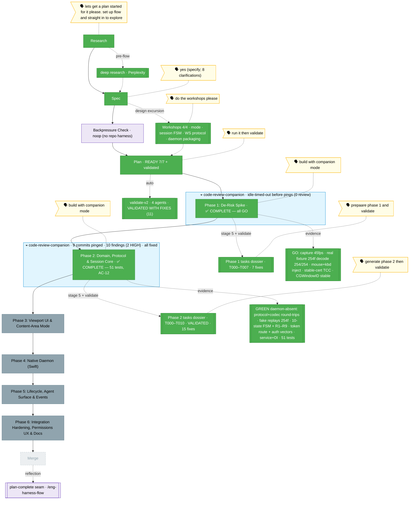

<!-- 🔄 RENDERED from the-flow.json — regenerate, never hand-edit this file as the primary. -->
# the-flow · remote-app-view (flight view)

**Plan**: remote-app-view · **Mode**: Full · **Phases**: 6 (locked at architect)
**Rail**: `[the-flow] ◆─◆─◆─◆─◐─◇─◇  research · spec · plan · tasks · [build 2/6] · review · merge`   ·   **now**: Phase 2 ✅ implemented + reviewed — 56 tests green, AC-12 (web side daemon-absent); companion caught 2 HIGH bugs, all fixed · **next**: Phase 3 tasks (review pass optional)

**Legend**: 🟩 done · 🟧 in progress · 🟥 blocked · 🟦 known future (designed) · ⬜╴assumed future (dashed) · 🟨 🗣 verbatim user input · 🟪 harness seams · 🟦 companion (cyan)

_Generated from `the-flow.json`. **Phase 2 is implemented, reviewed, and green** — 11 tasks (T001–T010) + a companion review-response, **56 tests across 8 files** (51 + 5 finding tests), run serially. **AC-12 met**: the entire web side runs and passes with **no daemon** — the `remote-view` domain + dep-direction guard, the Zod wire protocol + 16-byte binary codec (with `messages.json` **and** `frame-header.json` as the cross-language drift guards for the Swift daemon, Task 4.2), the first-class frame-replay fake (254 owned `sck-capture` frames), the 10-state session machine + reconnect hook (R1/R2/R3/R5/R6/R7/R8/R9 incl. the `daemonDown` health fork), the frozen-contract token route (`aud=remote-view-ws`, no `cwd`) + pinned auth vectors (Task 4.4), and `IRemoteViewService` + Fake + DI + reusable contract suite. Two logged deviations: T007 uses real timers + injected short durations (fake-timer/real-socket deadlock), and `zod` pinned `^4.3.5` in `apps/web`. The live `code-review-companion` was booted + briefed, every commit pinged, and it **actively reviewed** — surfacing **10 findings (2 HIGH: F004 displaced-state R3-trap escape, F007 learned-windowId clobber breaking R6 deep-link recreate; 8 MEDIUM)** on the inside lane. (An earlier flight-plan note wrongly recorded "0 replies / non-engagement" — an operator read-path error querying the outside lane; corrected, anecdote filed as minih issue [#47](https://github.com/AI-Substrate/minih/issues/47).) **All actionable findings landed in the review-response commit** → stage-7 review is **effectively satisfied** by the companion + response. **Next: generate Phase 3 tasks** — a separate `/the-flow 7 review` pass is optional. Phase 1 carry-forwards still hold for Phase 4 (CoreGraphics `NSApplication` init; reuse `chainglass-dev` cert + `com.chainglass.streamd`)._
