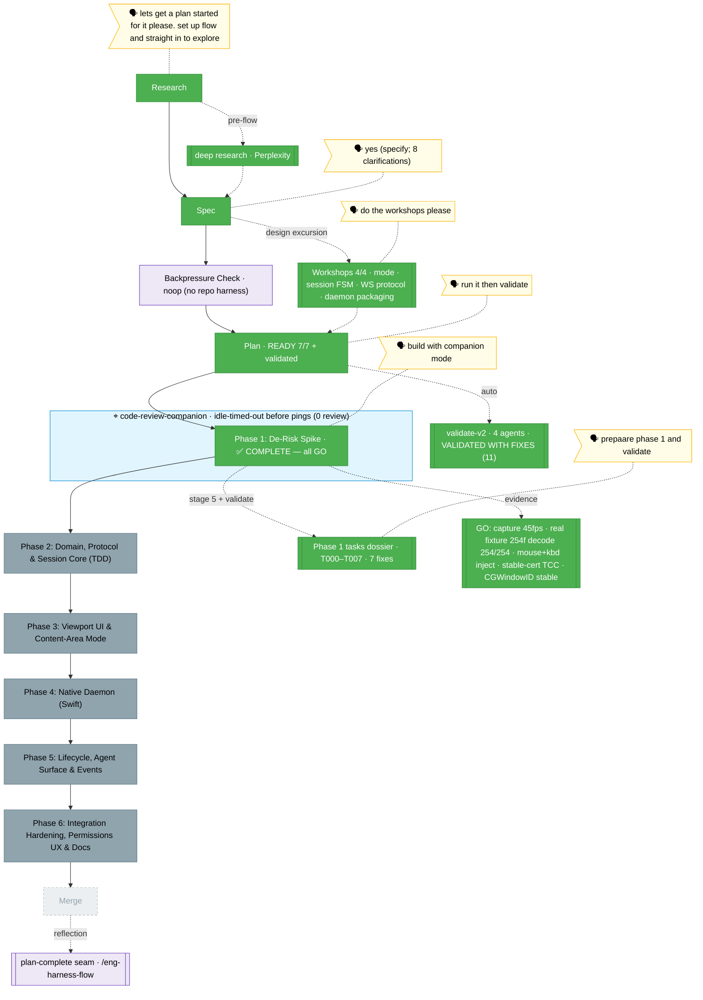

<!-- 🔄 RENDERED from the-flow.json — regenerate, never hand-edit this file as the primary. -->
# the-flow · remote-app-view (flight view)

**Plan**: remote-app-view · **Mode**: Full · **Phases**: 6 (locked at architect)
**Rail**: `[the-flow] ◆─◆─◆─◆─◐─◇─◇  research · spec · plan · tasks · [build 1/6] · review · merge`   ·   **now**: Phase 1 de-risk spike ✅ COMPLETE — all 7 verdicts GO · **next**: Phase 2 tasks (Domain, Protocol & Session Core)

**Legend**: 🟩 done · 🟧 in progress · 🟥 blocked · 🟦 known future (designed) · ⬜╴assumed future (dashed) · 🟨 🗣 verbatim user input · 🟪 harness seams · 🟦 companion (cyan)

_Generated from `the-flow.json`. **Phase 1 de-risk spike is COMPLETE — every verdict GO**, so the riskiest native unknowns (SCK capture, VideoToolbox encode, WebCodecs decode, CGEvent input, stable-cert TCC persistence, CGWindowID stability) are retired before web code commits. Key carry-forwards to Phase 4: the daemon must init CoreGraphics (`NSApplication`) and reuse the `chainglass-dev` cert + `com.chainglass.streamd` identity (the grant given during the spike carries over). The companion idle-timed-out during the multi-day human-blocked grant wait before its review pings landed (recorded honestly; throwaway spike code, post-hoc review optional)._
