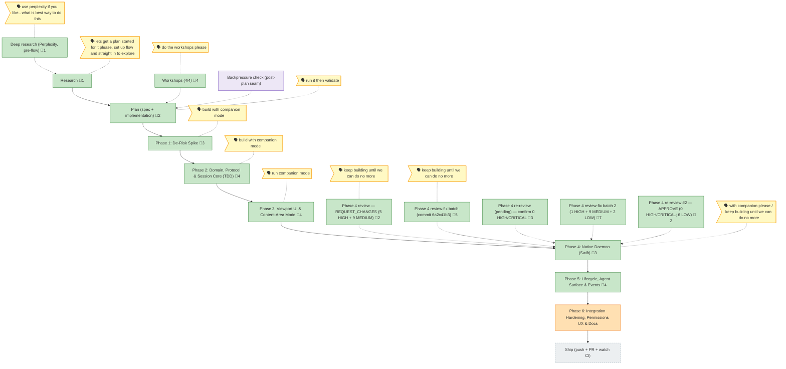

<!-- GENERATED by `harness flow render` — do not hand-edit; regenerate from the flow JSON. -->
# Flow · remote-app-view

**Kind**: flight-plan · **Now**: ph6 · **Next**: ship · **Intent**: Remote view mode for chainglass: stream a single desktop app window (Godot game, iOS Simulator) from the host Mac into the content area with mouse/keyboard input; terminal over/beside it; agent-controllable via CLI/URL endpoints · **Nodes**: 17 · **Events**: 55

**Rail**: ◆─◆─[ ◆─◆─◆─◆─◆─◐ ]─◇  ◆ Research · ◆ Plan (spec + implementation) · [ ◆ Phase 1: De-Risk Spike · ◆ Phase 2: Domain, Protocol & Session Core (TDD) · ◆ Phase 3: Viewport UI & Content-Area Mode · ◆ Phase 4: Native Daemon (Swift) · ◆ Phase 5: Lifecycle, Agent Surface & Events · ◐ Phase 6: Integration Hardening, Permissions UX & Docs ] · ◇ Ship (push + PR + watch CI)

**Legend**: 🟩 done · 🟧 in-progress · 🟥 blocked · 🟦 known (designed) · ⬜ assumed (speculative) · 🔶 decision · 🗣 user input · 🟪 harness loop · 🤖 companion · 🛠 worker · 🧰 chore (upkeep).

## Node log

### ph5 · Phase 5: Lifecycle, Agent Surface & Events
- `2026-06-21T07:00:40.129Z` · — · validation — validate-v2 VALIDATED WITH FIXES (2026-06-21): thesis advanced @ Implementation; FC matrix all green except T004 enumeration-source (flagged open).
- `2026-06-22T07:40:06.013Z` · — · decision — T004 enumeration source resolved: web-side picker catalog enumerates via a new 'streamd --list-windows' native daemon subcommand (Phase-1 spike 'windowid' precedent). Daemon /windows HTTP stays single-window (F005/F006 preserved). Route maps the native list -&gt; WindowDescriptor[].
- `2026-06-23T04:57:25.891Z` · agent · validation — T005 /sessions CRUD + R6 createSession wiring done (TDD). Companion (run …8ec5) returned 1 HIGH F001 (overpromised daemonDown wording vs the correct picker transition) → fixed (resolution B + new R6 picker hook test) → re-review APPROVE. 088 suite 124/124, tsc 0, biome clean. · refs: 11d7361a, 2ffd4af3
- `2026-06-23T06:28:58.205Z` · — · validation — T006 SSE envelopes done — adapter attached/detached + daemon-manager daemon-state(ready/down) + useRemoteViewEvents push (AC-8). 9 new tests; 088 suite 133/133; tsc 0; biome clean. Companion run …-8ec5 self-terminated mid-phase (no live T006 review — best-effort deviation logged). · refs: 5a1d06f3

### ph4 · Phase 4: Native Daemon (Swift)
- 📄 artifacts: tasks/phase-4-native-daemon-swift/tasks.md, tasks/phase-4-native-daemon-swift/execution.log.md, native/streamd/

### ph3 · Phase 3: Viewport UI & Content-Area Mode
- 📄 artifacts: tasks/phase-3-viewport-ui-content-area-mode/tasks.md, tasks/phase-3-viewport-ui-content-area-mode/execution.log.md, apps/web/src/features/088-remote-view/components/, harness/host/remote-view-stream-smoke.mts

### ph2 · Phase 2: Domain, Protocol & Session Core (TDD)
- 📄 artifacts: tasks/phase-2-domain-protocol-session-core-tdd/tasks.md, tasks/phase-2-domain-protocol-session-core-tdd/execution.log.md, apps/web/src/features/088-remote-view/, apps/web/app/api/remote-view/token/route.ts

### ph1 · Phase 1: De-Risk Spike
- 📄 artifacts: tasks/phase-1-de-risk-spike/tasks.md, tasks/phase-1-de-risk-spike/execution.log.md, external-research/spike-findings.md

### plan · Plan (spec + implementation)
- 📄 artifacts: remote-app-view-spec.md, remote-app-view-plan.md

### research · Research
- 📄 artifacts: research-dossier.md

### dr · Deep research (Perplexity, pre-flow)
- 📄 artifacts: external-research/streaming-stack.md

### ws · Workshops (4/4)
- 📄 artifacts: workshops/001-content-area-mode-mechanics.md, workshops/002-session-reattach-state-machine.md, workshops/003-stream-ws-protocol.md, workshops/004-daemon-packaging-discovery.md

### rv4 · Phase 4 review — REQUEST_CHANGES (5 HIGH + 9 MEDIUM)
- 📄 artifacts: tasks/phase-4-native-daemon-swift/reviews/review.phase-4-native-daemon-swift.md, tasks/phase-4-native-daemon-swift/reviews/fix-tasks.phase-4-native-daemon-swift.md

### fx4 · Phase 4 review-fix batch (commit 6a2c41b3)
- 📄 artifacts: native/streamd/Sources/streamd/WSServer.swift, native/streamd/Sources/streamd/Endpoints.swift, native/streamd/Sources/streamd/Capture.swift, native/streamd/Sources/streamd/Input.swift, native/streamd/scripts/smoke-headless.mjs

### rv4b · Phase 4 re-review (pending) — confirm 0 HIGH/CRITICAL
- 📄 artifacts: tasks/phase-4-native-daemon-swift/reviews/review.phase-4-native-daemon-swift.md, tasks/phase-4-native-daemon-swift/reviews/fix-tasks.phase-4-native-daemon-swift.md, tasks/phase-4-native-daemon-swift/reviews/_computed.diff

### fx4b · Phase 4 review-fix batch 2 (1 HIGH + 9 MEDIUM + 2 LOW)
- 📄 artifacts: justfile, native/streamd/Sources/streamd/WebSocket.swift, native/streamd/Sources/streamd/WSServer.swift, native/streamd/Sources/streamd/Input.swift, native/streamd/Sources/streamd/Capture.swift, native/streamd/Tests/streamdTests/BoundsAndCodecTests.swift, docs/c4/components/remote-view.md

### rv4c · Phase 4 re-review #2 — APPROVE (0 HIGH/CRITICAL; 6 LOW)
- 📄 artifacts: tasks/phase-4-native-daemon-swift/reviews/review.phase-4-native-daemon-swift.md, tasks/phase-4-native-daemon-swift/reviews/_computed.diff
