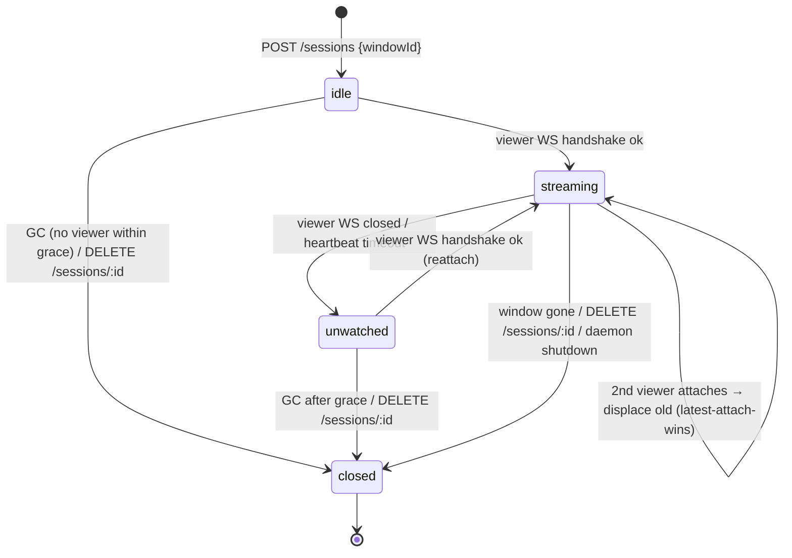
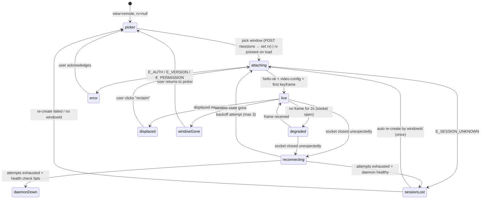

# Workshop: Session & Reattach State Machine

**Type**: State Machine
**Plan**: 088-remote-app-view
**Spec**: [remote-app-view-spec.md](../remote-app-view-spec.md)
**Created**: 2026-06-13
**Status**: Approved

**Value Thesis**: Refresh/second-tab/agent-attach races are exactly what bit Plan 064 (PL-03/PL-04/PL-06). Drawing both state machines (daemon-side session, client-side viewport) plus a race matrix turns the riskiest TDD target into enumerable test scenarios — the protocol/session phase can be written test-first directly from the tables here.
**Target Proof Level**: Implementation Ready
**Current Proof Level**: Contract Ready (Implementation Ready once the spike confirms daemon-restart window-id stability)

**Selected Value Axes**:
- **Proof Quality**: every transition is a row a vitest case can assert against the fake daemon.
- **Operational Reliability**: failure modes (crashed tab, dead daemon, gone window) each have a defined landing state — never a silent black frame (AC-10).
- **Learning Compounding**: encodes Plan 064's reconnection lessons instead of rediscovering them.

**Related Documents**:
- [001-content-area-mode-mechanics.md](./001-content-area-mode-mechanics.md) — `rv` URL param that carries the session id
- [003-stream-ws-protocol.md](./003-stream-ws-protocol.md) — the messages that trigger these transitions
- [004-daemon-packaging-discovery.md](./004-daemon-packaging-discovery.md) — daemon lifecycle that bounds session lifetime

**Domain Context**:
- **Primary Domain**: remote-view (new) — sessions are in-domain state, daemon-side authoritative
- **Related Domains**: `_platform/events` (SSE push on agent attach), `_platform/state` (`remote-view:<session>:*` publishing)

---

## Purpose

Define the authoritative session model (who owns what state), both state charts, the reattach mechanism, daemon-side GC, and the complete race matrix — so attach/detach/refresh behavior is decided once, here, and merely implemented later.

## Fresh Entrant Outcome

A fresh human or agent should be able to use this workshop to reach **Implementation Ready** and:

- Implement the daemon session table and viewer-slot policy without further decisions.
- Implement the client viewport reducer with named states matching the UI states in the spec's ACs.
- Write the TDD suite for the session service from the race matrix rows alone.

## Key Questions Addressed

- Full state chart: attaching → live → degraded → detached (and the states the spec's ACs imply: displaced, window-gone).
- Reattach token: what authorizes resuming a session after refresh?
- Daemon-side session GC: when do sessions die on their own?

---

## Ownership Model

| State | Owner | Lives | Survives |
|---|---|---|---|
| Session table (id → window, viewer slot, capture state) | **daemon** (authoritative) | in-memory | browser refresh ✔ · daemon restart ✘ |
| Viewport machine (what the user sees) | browser client | React state | nothing — rebuilt from `rv` param + WS handshake |
| `rv=<sessionId>` | URL | nuqs | refresh ✔ · deep-link ✔ |
| Connection/quality state | GlobalStateSystem `remote-view:<session>:*` | runtime state | session lifetime |

One session ↔ one target window ↔ **at most one viewer** (single-viewer v1). Sessions are deliberately *not* persisted: a daemon restart invalidates all sessions, and recovery is re-attach-by-window (R6), not state restoration.

- **Session id**: `ses_` + 12 lowercase base32 chars, generated by the daemon at creation. It is a *handle*, not a secret.
- **Reattach authorization**: a fresh short-lived JWT (same mint as initial attach — the frozen bootstrap-code HKDF contract) plus the session id. **No separate reattach token.** Rationale: the JWT already proves the same identity that created the session (single-user trust model, terminal-equivalent bar per AC-9); a per-session secret would add rotation/storage complexity with no added protection within that model. *Rejected alternative*: per-session bearer secret in sessionStorage — dies with the tab, breaking the refresh AC it was meant to serve.

## Daemon-Side Session Machine

| State | Capture (SCK stream) | Encoder | Viewer slot | GC timer |
|---|---|---|---|---|
| `idle` | off | off | empty | grace (300s) running |
| `streaming` | on | on | occupied | — |
| `unwatched` | **paused** (stream stopped, config retained) | off | empty | grace (300s) running |
| `closed` | released | released | — | — |

Decisions:

- **Capture pauses when unwatched** — no viewer means no reason to burn the host GPU; reattach restarts capture and the first frame sent is a keyframe (Workshop 003), so resume is one round-trip. This keeps AC-6's 3s budget comfortably.
- **Grace period 300s** (constant `SESSION_GRACE_MS`, daemon config). Long enough for a refresh, a laptop-lid blink, or an agent attaching ahead of the user opening the browser; short enough that stale sessions don't pin window references for hours.
- **Latest-attach-wins is a slot replacement, not a rejection** (AC-7): the new handshake always succeeds; the old viewer receives `displaced` then a server-side close. There is no lock to wedge — a crashed tab's stale socket is irrelevant because the new attach displaces it unconditionally.
- **Window gone** (CGWindowID disappears from the capture source, or SCK errors): broadcast `window-state {state:"gone"}`, transition to `closed`. The session does NOT linger waiting for the window to return — a relaunched app gets a new window id, so a new session is the honest model.

## Client-Side Viewport Machine

| State | UI | Input forwarded | Notes |
|---|---|---|---|
| `picker` | window grid + thumbnails | — | AC-1 |
| `attaching` | spinner over last frame if any | no | budget: ≤3s for reattach (AC-6) |
| `live` | canvas + stats HUD | yes | AC-2/AC-3 |
| `degraded` | canvas (last frame) + "stalled" badge | yes | sends `request-keyframe` once on entry |
| `reconnecting` | last frame dimmed + attempt counter | no | backoff 250ms/1s/3s (terminal's shape, PL-03) |
| `displaced` | dimmed frame + **"viewing elsewhere — click to reclaim"** | no | AC-7. **Never auto-reconnects** — see R3 |
| `windowGone` | "window gone" card + back-to-picker button | no | AC-10 — never a silent black frame |
| `sessionLost` | toast + auto re-create (once) | no | R6 |
| `error` | error card with specific cause (incl. which TCC grant is missing) | no | AC-14 |

## Race Matrix (the TDD checklist)

| # | Race | Sequence | Defined outcome |
|---|---|---|---|
| R1 | **Refresh while live** | tab unload closes WS → session `unwatched` → new page load reads `rv` → handshake | resume same session ≤3s, first frame keyframe (AC-6) |
| R2 | **Second tab attaches** | tab B handshakes with same `rv` while tab A is viewer | B becomes viewer; A gets `displaced` + close; A shows reclaim UI (AC-7) |
| R3 | **Reclaim ping-pong** | A reclaims, B sees `displaced`, B could auto-reclaim… | forbidden by design: `displaced` never auto-reconnects; reclaim is click-only. Two tabs can volley, but only at human speed, deliberately |
| R4 | **Agent attach** | CLI/MCP verb → web API `POST /sessions` → session `idle` → SSE envelope `{type:"remote-view.attached", sessionId, windowId, title}` → every open browser client setParams → viewport attaches | the *user's* client becomes viewer; if multiple browser contexts are open, latest handshake wins (R2 applies). Agent never holds the viewer slot |
| R5 | **Crashed tab (no clean close)** | no TCP FIN → daemon heartbeat (ping every 15s, dead after 2 misses) → `unwatched` | worst case 30s as zombie viewer — irrelevant in practice because any new attach displaces it instantly (R2) |
| R6 | **Daemon restart** | sessions are in-memory → client `reconnecting` → attempts exhausted → web `/api/remote-view/health` says daemon healthy (new pid) → handshake gets `E_SESSION_UNKNOWN` → `sessionLost` | client auto-creates ONE new session for the remembered `windowId` (CGWindowIDs are WindowServer-scoped and survive daemon restarts); on success, swap `rv` via `history: replace`. On failure → picker with toast |
| R7 | **Attach while attaching** | user clicks another window in picker before handshake settles | abort in-flight handshake (close socket with code 4001), start new; last click wins — mirrors the `wsRef.current !== ws` guard idiom in `use-terminal-socket.ts:111` |
| R8 | **Window minimized mid-stream** | SCK stops delivering frames | daemon detects via SCK callback → auto-restores the window (AC-10, dev-box trust) → frames resume; client may blip `degraded` but needs no special handling |
| R9 | **Detach vs switch-away** | user selects a file (Workshop 001 switch-back) | WS closes clean (code 1000) → `unwatched`, NOT closed — flipping back within grace resumes instantly. Explicit "detach" UI action and `remote-view detach` verb call `DELETE /sessions/:id` → `closed` |

## SSE & GlobalState Publishing

- SSE (ADR-0007/0010, additive domain envelope `remote-view`): `attached` (R4 push), `detached`, `daemon-state` (spawned/died). SSE is for *cross-client coordination*; per-frame/per-second quality data never rides SSE.
- GlobalState (`remote-view:<sessionId>:connection` = viewport state name, `remote-view:<sessionId>:quality` = last stats sample): drives the stats HUD and gives agents a readable signal (`remote-view list` shows live/unwatched per session).

## Attention Reduction

| Future Loop | Before Workshop | After Workshop |
|-------------|-----------------|----------------|
| Implementation | "Handle reconnects carefully" (vibes) | Two state charts + 9 defined races; reducer states enumerated |
| Testing | Invent race scenarios from scratch | R1–R9 are the test list; fake daemon asserts daemon-side transitions |
| Review | Re-derive whether displaced can loop | R3 rule is checkable: grep for auto-reconnect in displaced handler |
| Agent execution | Unclear what `attach` returns mid-race | R4 defines the full agent-attach causality chain |

## Validation / Acceptance

This workshop reaches Validated when:

- The session service TDD suite implements R1–R9 against the fake daemon and passes.
- Browser smoke proves R1 (refresh ≤3s) and R2/R3 (two contexts, displace + reclaim, no ping-pong) per AC-6/AC-7.
- Spike **CONFIRMED** CGWindowID stability across daemon restart (R6 assumption holds — id `34202` valid across ~30min + dozens of capture-process restarts; Phase 1 spike 1.5c, [spike-findings.md](../external-research/spike-findings.md)). R6 stays as designed; the picker-with-toast degrade path is not needed.

## Open Questions

### Q1: Should `unwatched` keep encoding a low-rate thumbnail for the picker?
**RESOLVED**: No. Picker thumbnails are one-shot captures via the control API (Workshop 004); keeping encoders warm for unwatched sessions spends GPU for a marginal UX gain.

### Q2: Grace period configurable per session (agent attach might want longer)?
**OPEN**: default 300s constant for v1; revisit only if agent workflows demonstrably outlive it. Not AC-gating.
