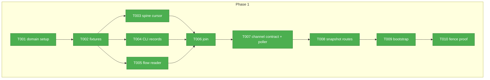
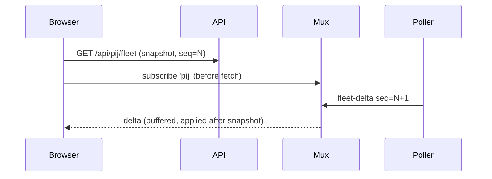

# Phase 1: Read layer + poller + channel — Tasks

**Plan**: `docs/plans/089-first-class-pij/first-class-pij-plan.md` (v1.1.0, READY)
**Phase**: 1 of 4 · **Created**: 2026-07-26

## Executive Briefing

- **Purpose**: Everything server-side for the pij observatory, contract-bound and test-proven before any UI exists: readers for the pij store (spine by file, records by CLI) and builder-flow files, the join, the two-loop poller, the typed `pij` SSE channel, and snapshot API routes.
- **What We're Building**: A read-only data pipeline: `~/.pij/spine` file cursor + `pij … --json` CLI reads + `docs/plans/*/the-flow.json` reads → join → poller → `sseManager.broadcast('pij', …)` + `/api/pij/*` snapshot routes, bootstrapped as a fourth HMR-safe singleton in `instrumentation.ts`.
- **Goals**: ✅ contract-typed channel events · ✅ five flow absence states classified correctly · ✅ 100:1 system-state filter · ✅ seq-consistent snapshots+deltas · ✅ fence proof (no writes) · ✅ fixtures encoding every ruled hazard
- **Non-Goals**: ❌ any UI component · ❌ any write to `~/.pij` or `the-flow.*` (C-02) · ❌ watching `~/.pij` with a file watcher (C-04) · ❌ stalled/anomaly rendering · ❌ archive tier

## Prior Phase Context

_None — Phase 1._

## Pre-Implementation Check

| File | Exists? | Domain Check | Notes |
|------|---------|-------------|-------|
| `apps/web/src/features/089-first-class-pij/**` | no — create | new feature domain | |
| `apps/web/app/api/pij/**` | no — create | new routes, follow mux route auth pattern | |
| `apps/web/instrumentation.ts` | yes — modify | app shell, cross-domain | follow the 3 existing HMR-safe global-flag blocks exactly |
| `apps/web/src/lib/sse-manager.ts` | yes — consume only | `broadcast(channelId, eventType, data)` | never modified |
| `test/fixtures/pij/**`, `test/fixtures/flows/**` | no — create | test tree | `tsconfig.test.json` exists at repo root (uncommitted) — check it covers new test paths |
| `docs/domains/registry.md`, `docs/domains/domain-map.md` | yes — modify | registry entries | |

## Architecture Map



## Tasks

| Status | ID | Task | Domain | Path(s) | Done When | Notes |
|--------|-----|------|--------|---------|-----------|-------|
| [x] | T001 | Domain setup: `domain.md`, source dirs, registry + domain-map entries | 089-first-class-pij | `apps/web/src/features/089-first-class-pij/domain.md`, `docs/domains/registry.md`, `docs/domains/domain-map.md` | Files exist; registry lists domain + contracts | Plan 1.1; follow 064's domain.md as the format exemplar |
| [x] | T002 | Fixtures: synthetic pij store (descriptors incl. single-segment id `shipname`, a `*.tmp-1234-uuid` file, `archive/` dir, spine ndjson with a torn line) + flow fixtures (kitchen-sink copied from harness repo, legacy-E308 no-provenance, pre-flow artifacts dir, empty dir, 088-like live flow) | 089-first-class-pij | `test/fixtures/pij/**`, `test/fixtures/flows/**` | Each fixture encodes exactly one ruled hazard; loader helper exports typed paths | Plan 1.2; kitchen-sink source: `/Users/jordanknight/substrate/harness-engineering/harness/cli/test/services/flow/fixtures/render/kitchen-sink.json`; lab flow additive later, never blocking |
| [x] | T003 | TDD spine cursor (`ISpineCursor` + file impl): exclusive `--since` seq semantics over ndjson, torn/corrupt line skip, `*.tmp-*` ignore, rename tolerance, cursor survives reader restart | 089-first-class-pij | `…/server/spine-cursor.interface.ts`, `…/server/spine-cursor.ts`, `test/unit/web/pij/spine-cursor.test.ts` | Red→green shown; torn line + tmp file change nothing; restart test passes | Plan 1.3; C-07/C-08; prove a test fails before its fix (repo doctrine) |
| [x] | T004 | TDD CLI record reader (`IPijRecords` + `execFile` impl): `pij list/tree/node show/state --json`, fixed argv, per-call `cwd`, timeout, E-code mapping; badges consumed, never re-derived | 089-first-class-pij | `…/server/pij-records.interface.ts`, `…/server/pij-records.ts`, `test/unit/web/pij/pij-records.test.ts` + fake executor | Fake-executor tests green; live smoke: global list returns >100 rows; wrong-cwd test catches silent repo-scoping | Plan 1.4; Finding 01; `execFile` never shell |
| [x] | T005 | TDD flow reader (`IFlowReader`): five absence states (live/legacy/untracked/not-started/corrupt), provenance gate, completion = `nav.bag.status` → terminal-node fallback, phases by `type=="phase"` ordered via `next[]`, activations from `cursor-moved`, reviews incl. excursions via `branch_of`, unknown enums tolerated | 089-first-class-pij | `…/server/flow-reader.interface.ts`, `…/server/flow-reader.ts`, `test/unit/web/pij/flow-reader.test.ts` | Every fixture → exactly its ruled state; kitchen-sink never crashes; live-flow fixture reads in_progress | Plan 1.5; C-09; contract: `references/flow-answers-for-chainglass-ui.md` in plan dir |
| [x] | T006 | TDD join: seat↔workspace (`folder` under workspace `path`), flow↔project (`provenance.plan_id` first, repo+plan-folder convention fallback, join-provenance recorded on the result), rows keyed by pij id ONLY | 089-first-class-pij | `…/server/join.ts`, `test/unit/web/pij/join.test.ts` | Single-segment id passes; types make paneId/pid keys impossible | Plan 1.6; C-03 |
| [x] | T007 | Channel contract THEN poller: `PijChannelEvent` union in `types.ts` (`fleet-delta` full rows, `flow-delta`, `poller-status`; every event carries spine `seq`) + serialization tests; poller service: fast loop 2s (spine cursor, system-state filtered), slow loop 8s (ONE global `pij list` — freshness+gauges; workspace scope = server-side folder filter), diff→broadcast; degraded mode emits `poller-status`, keeps last-known | 089-first-class-pij | `…/types.ts`, `…/server/pij-poller.service.ts`, `test/unit/web/pij/poller.test.ts` | Every broadcast type-checks against the union; fake-clock: 100 system-state events → ≤ configured fan-out; store error → status event, no crash | Plan 1.7; C-08/C-10, Finding 03 |
| [x] | T008 | Snapshot routes `/api/pij/{fleet,tree,flow}` + `/api/pij/status` (auth-gated per mux-route pattern; workspace param; every snapshot stamped with the cursor seq it was built at) | 089-first-class-pij | `apps/web/app/api/pij/fleet/route.ts`, `…/tree/route.ts`, `…/flow/route.ts`, `…/status/route.ts`, `test/unit/web/pij/routes.test.ts` | 401 unauthenticated; shapes from `types.ts`; seq present on every snapshot | Plan 1.8; the status route is what AC-08's trichotomy renders |
| [x] | T009 | Bootstrap: fourth HMR-safe singleton in `instrumentation.ts` (global flag + try/catch + SIGTERM cleanup, copying the existing idiom) | app shell | `apps/web/instrumentation.ts` | Typecheck + build pass; poller start is idempotent under HMR (flag test) | Plan 1.9; do NOT restart the dev server — Jordan's nod required; build+unit proof only |
| [x] | T010 | Fence proof: automated check that feature server code contains no write-mode fs calls under `~/.pij`/flow paths and no mutating pij verbs; demonstrated red→green (inject a violation, watch it fail, remove) | 089-first-class-pij | `test/unit/web/pij/fence.test.ts` | Red→green demonstrated in the execution log | Plan 1.10; C-02; AC-11 |

## Context Brief

**Environment-first posture**: friction is work, not an apology — fix small/reversible things; otherwise record a Discoveries row (harness-less fallback).

**Key findings from plan** (numbers = plan § Key Findings): 01 spine-by-file/records-by-CLI split; 02 two loops (freshness/gauges have no spine events); 03 filter 100:1 before fan-out; 05 mux + `sseManager.broadcast(channelId, eventType, data)` + `useChannelEvents` exist — join, don't build; 06 copy the instrumentation idiom exactly; 09 join tries `plan_id` first, convention second, records which.

**Domain dependencies**:
- `lib/sse`: `sseManager.broadcast` (`apps/web/src/lib/sse-manager.ts`) — the only egress to the mux
- app shell: `instrumentation.ts` register() — bootstrap slot
- auth: `auth()` guard exactly as `apps/web/app/api/events/mux/route.ts` does

**Domain constraints**: read-only against `~/.pij` and all flow files (C-02 — the two sole-writer fences are one policy); never watch `~/.pij` (C-04); never key on paneId/pid (C-03); constitution: interface-first, fakes over mocks, DI-style injectable deps (follow `MuxDeps` pattern in the mux route for route testability).

**Reusable**: `FakeTmuxExecutor`/`FakePty` patterns in `test/fakes/` as exemplars for the fake pij executor; mux contract tests under `test/unit/web/sse/` as route-test exemplars.

**External contracts** (read before coding): plan-dir `references/flow-answers-for-chainglass-ui.md` (flow safe subset), `references/pij-firstclass-discovery.md`, `/Users/jordanknight/pi-hacking/pij/docs/how/pij-platform.md`, `/Users/jordanknight/pi-hacking/pij/docs/how/pij-for-ui-consumers.md`.

```mermaid
flowchart LR
    S[spine ndjson] -->|file cursor 2s| P[poller]
    R[pij CLI --json] -->|slow loop 8s| P
    F[the-flow.json] -->|watch/classify| P
    P -->|PijChannelEvent| B[sseManager 'pij']
    P --> API[/api/pij/*]
```



## Discoveries & Learnings

_Populated during implementation. Full evidence in `execution.log.md`._

| Date | Task | Type | Discovery | Resolution | References |
|------|------|------|-----------|------------|------------|
| 2026-07-26 | T002 | Fence interpretation | The packet forbids writing `the-flow.json` "anywhere — including in fixtures", then qualifies with "never named exactly `the-flow.json` inside `docs/plans/`". Two readings, and the strict one makes a five-state classifier untestable at full fidelity. | Satisfied both: fixture documents are committed as `*.fixture.json` (**no file named `the-flow.json` is committed anywhere in this repo**) and `materializeFlowFixture()` copies a plan folder into an OS temp dir under the real filenames at test time. Flagged to the PM as an interpretation. | `test/fixtures/flows/index.ts` header |
| 2026-07-26 | T002 | Tooling friction | `biome check .` parses every `.json` in the repo, but the `corrupt-json` fixture is invalid JSON *by construction*. `biome.json` is outside the allowed write paths. | Gave that one fixture a `.txt` guard suffix; the materializer strips it. No config change needed. | `test/fixtures/flows/corrupt-json/` |
| 2026-07-26 | T003 | Design | Reading a multi-MB spine every 2s is wasteful, but a byte offset alone breaks on the documented rename/tier-migration window. | **Cursor by `seq`, offset by bytes**: `seq` is the correctness guard, the offset is only an optimisation. When they disagree the offset is discarded and `seq` alone prevents duplicates — rename tolerance falls out rather than being bolted on. | `server/spine-cursor.ts` |
| 2026-07-26 | T003 | Contract gap | A partial trailing line and a torn mid-file line look identical to a naive line splitter, but mean opposite things: a write in flight vs. a crash. Discarding the first loses real events; parsing it throws. | Split them by whether the chunk ends in a newline. The tail is buffered and completed next read; a newline-terminated unparseable line is a tear, skipped **and counted** (`tornLinesSkipped` is surfaced on `PollerStatus`). | `server/spine-cursor.ts`, AC-08 |
| 2026-07-26 | T004 | Live measurement | `pij list --json` returns **178 rows** today (discovery measured 179/177 — the fleet moves). `pij list` rows carry **no `badge` field**; only `node show` computes one. | `FleetRow.badge` is `undefined` until a `node show` is made, and the join deliberately never synthesises one (AC-03). Phase 2 must render the absence honestly. | Live smoke, `server/join.ts` |
| 2026-07-26 | T004 | Verified hazard | Repo-scoping is real and silent: `tree(cwd=chainglass)` → 3 roots, `tree(cwd=harness-engineering)` → 4 different roots. | `tree({ cwd })` makes cwd required by type; `/api/pij/tree` 400s without `?workspace=`. Both proved by a gate that was watched to fail. | Live smoke, T008 |
| 2026-07-26 | T005 | Contract confirmation | 088's `nodes[]` is stored **newest-first** (`ship, ph6 … research`), so array order renders the rail backwards — and its phases are `ph1…ph6`, so a `phase-N` id pattern finds **zero**. Both traps fire together. | Walk `next[]` from real roots; filter on `type == "phase"`. Injecting the id pattern turned 5 tests red, which is the measurement of how badly it would have failed. | `server/flow-reader.ts`, Q2 corrections |
| 2026-07-26 | T007 | Design | A spine event carries a peer id and a transition — **not** a folder, harness or model. There is no honest way to build a fleet row from one. | Events for seats not already in the fleet are ignored; the seat appears on the next slow loop with a real record behind it. Every rendered row is record-backed. | `server/pij-poller.service.ts` |
| 2026-07-26 | T010 | Method | A static fence whose glob has drifted passes perfectly while proving nothing. Demonstrated: with the guarded root renamed, **8 of 10 assertions passed vacuously**. | Added an anti-vacuous guard asserting a non-empty guarded file set and known member files; the open-mode assertion likewise requires `openCalls.length > 0`. Both caught the drift. | `test/unit/web/pij/fence.test.ts` |
| 2026-07-26 | Gates | Pre-existing failure | `pnpm test` reports 3 failures in `test/integration/web/dashboard-navigation.test.tsx` (`Unable to find an element with the text: /dev/i`). | **Proved pre-existing**: zero overlap with this phase's diff, and the same 3 failures reproduce with `apps/web/instrumentation.ts` restored to HEAD. `dashboard-sidebar.tsx` is on the do-not-modify list, so it is flagged to the PM, not fixed. | `execution.log.md` § Gates |
| 2026-07-26 | Gates | Build hygiene | The first build (exit 0) emitted 2 Turbopack NFT warnings traced to the runtime-resolved spine path — the tracer assumed the whole project was a data dependency. | Applied the documented `join(/* turbopackIgnore: true */ …)` remedy; the spine lives outside the repo entirely. 2 warnings → 1, and the remainder traces to `packages/workflow/dist/**`, untouched here. Net contribution: zero. | `server/spine-cursor.ts` |

```
docs/plans/089-first-class-pij/
  ├── first-class-pij-plan.md
  ├── research-dossier.md
  ├── references/
  ├── validations/
  └── tasks/phase-1-read-layer-poller-channel/
      ├── tasks.md
      └── execution.log.md   # created by the implement verb
```
