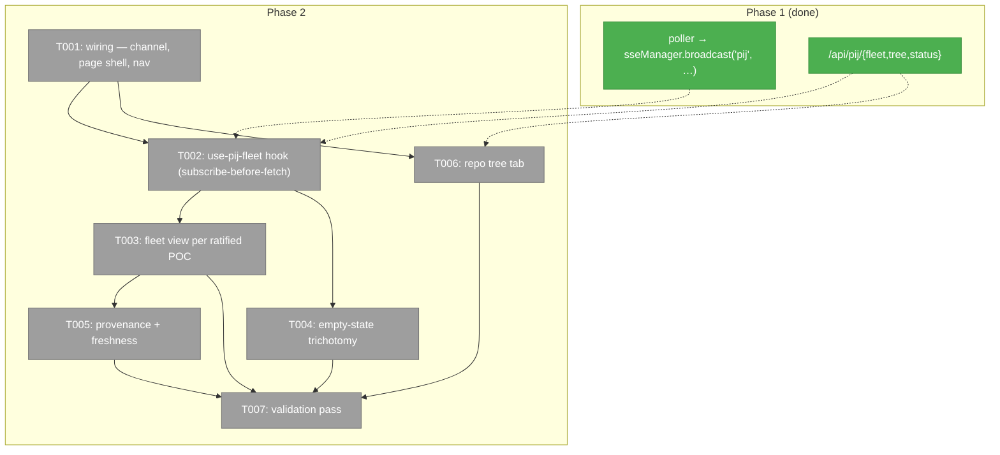
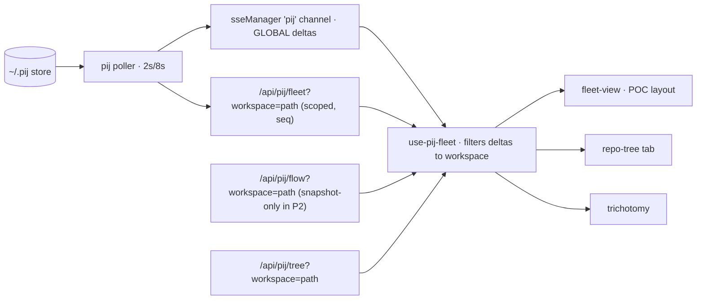
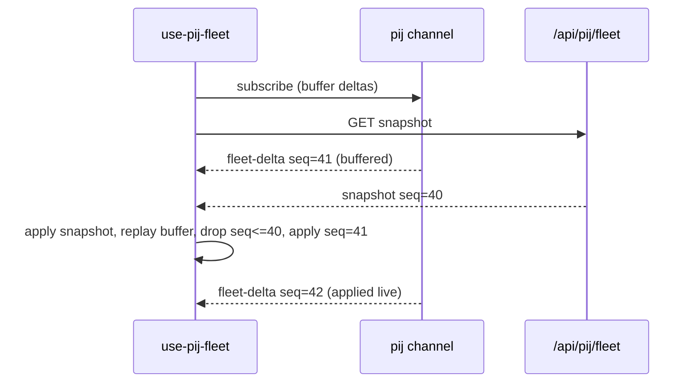

# Phase 2: Workspace fleet + repo tree page — Tasks & Context Brief

**Plan**: `docs/plans/089-first-class-pij/first-class-pij-plan.md` (v1.1.0, READY)
**Phase**: 2 of 4 · **Depends on**: Phase 1 (complete, review APPROVED)
**Design reference (RATIFIED)**: `scratch/pij-observatory-poc.html` — Jordan-approved 2026-07-26, light-mode default. Gitignored; open it in a browser before building. Its vocabulary is the contract: prime shells, one section per child, single role-chip vocabulary, stage strips, project+worktree meta lines.
**Complexity**: CS 3

---

## Executive Briefing

- **Purpose**: The first thing a human sees. Phase 1 built the read layer, poller, and `pij` channel; nothing renders yet. This phase delivers the workspace-scoped fleet page and repo tree tab — populated on day one against the live store (~178 rows), honest when empty.
- **What We're Building**: `workspaces/[slug]/pij` page with two tabs — **Fleet** (prime shells → per-child sections per the ratified POC, live via `useChannelEvents`) and **Repo tree** (CLI tree → collapsible tree). Plus the empty-state trichotomy, provenance/freshness rendering, and the sidebar nav entry.
- **Goals**:
  - ✅ Each running sub-project readable as one block: prime shell → section per child (PM team or standalone worker) → seats exactly once
  - ✅ Subscribe-before-fetch seq handling — no lost or double-applied deltas (race test proves it)
  - ✅ AC-03 (columns, never re-derive), AC-04 (workspace join), AC-05 repo half (tree), AC-08 (trichotomy + ruled fourth filtered-to-zero state), AC-09 (provenance/freshness)
  - ✅ Hot tier + idle < 2 days filter; workspace/global scope toggle
- **Non-Goals**:
  - ❌ Flow phase view (Phase 3), global prime tree / overlay panel / focus action (Phase 4)
  - ❌ Any mutating verb or route — Phase 2 is read-only everywhere (C-02, C-06)
  - ❌ Stalled badges or any verdict rendering (display doctrine: observations, never verdicts)
  - ❌ Inventing roles the data cannot attest (see Role chips note in the Context Brief)

## Prior Phase Context (Phase 1: Read layer + poller + channel)

**A. Deliverables**: Feature domain `apps/web/src/features/089-first-class-pij/` — `types.ts` (public contract), `domain.md` (Ruled Constraints C-01…C-10 + Deliberate Absences), `server/` (spine-cursor, pij-records, flow-reader, join, poller service, route-deps, start-pij-poller). Routes `apps/web/app/api/pij/{fleet,tree,flow,status}/route.ts` — each exports `GET` plus a testable `handlePij*Request(request, deps)`. Fixtures `test/fixtures/pij/` + `test/fixtures/flows/`; fakes `test/fakes/fake-pij-executor.ts`, `test/fakes/fake-pij-poller-deps.ts`; 124 tests green in `test/unit/web/pij/`. Bootstrap: 4th HMR-safe block in `apps/web/instrumentation.ts` (`__pijObservatoryBootstrapped`).

**B. Dependencies Exported** (what this phase consumes — all from `@/features/089-first-class-pij/types` unless noted):
- `PIJ_CHANNEL = 'pij'`; `PijChannelEvent` union, every member carries the spine `seq` it reflects:
  - `{ type: 'fleet-delta'; seq; at; rows: FleetRow[]; removed: PijId[] }` — rows are **complete replacements**, never patches; `removed` = "gone from this view" (archive migration), **not** dead
  - `{ type: 'flow-delta'; seq; at; flows: FlowSummary[] }` — **does NOT fire in Phase 2**: its only emitter `refreshFlows()` has zero production call sites until Phase 3's watcher. Do not wire a listener and debug silence.
  - `{ type: 'poller-status'; seq; at; status: PollerStatus }`
- ⚠ **Deltas are GLOBAL; snapshots are scoped — BY DESIGN (roadrunner ruling).** One shared `pij` mux channel fans the same bytes to every tab, and tabs sit in different workspaces, so the broadcast cannot be pre-scoped: client-side containment is a **designed consequence of the single-channel decision, not a workaround**. Do not "fix" it by splitting channels — that re-litigates a settled ruling (only roadrunner can unmake the one-channel call; if the filter proves fragile, escalate, don't route around). C-08's server-side filter still applies to `system-state` volume, not to workspace scope. The client MUST filter delta `rows` to the workspace before applying (same rule the server uses: `isFolderInWorkspace`-equivalent on `row.folder` — relative-path containment, NOT string prefix); `removed` applies unconditionally.
- `FleetRow`: `id: PijId` (branded; `asPijId()`), `folder`, `state?`, `activity?`, `liveness?`, `lastEventAt?`, `badge?` (undefined until a `nodeShow` happens — render the absence), `harness?`, `boundModel?`, `boundProvider?`, `effort?`, `bindHealth?`, `degraded?`, `failureReason?`, `prime?`, `unadopted?`, `currentTask?`, `currentAssignment?`, `contextMax?`, `contextCurrent?` (`value` can be the literal string `'unknown'`), `windowId?`, `extra`. **No `pid`/`paneId`/`dataDir` — by fence.**
- ⚠ **The `workspace` query param is an absolute filesystem PATH, never the slug.** Tree passes it straight as the CLI `cwd`; flow joins `docs/plans` onto it; fleet's join does `relative(resolve(workspacePath), resolve(folder))`. Passing the slug returns a silently plausible wrong answer (empty fleet / chainglass-shaped tree). The page gets the path from the workspace context the `[slug]` layout already resolves (`WorkspaceProvider`) — never rebuild it from the slug.
- Snapshots: every response is `PijSnapshot<T> = { seq; at; data }`. `/api/pij/fleet?workspace=<path>` (optional param) → `{ workspace, rows, status }` — **`PollerStatus` ships inside the fleet payload; the trichotomy needs no second request**. `/api/pij/tree?workspace=<path>` (required, 400 without) → `{ workspace, roots: PijTreeNode[] }`. `/api/pij/flow?workspace=<path>` (required, 400 without) → `{ workspace, flows: FlowSummary[] }` — **snapshot-only in Phase 2** (see flow-delta note above); this is the ONLY client-reachable flow source. `/api/pij/status` → `PollerStatus`. Errors: 401 pre-read, 400 `missingParam`, 503 with pij `E-` code (`storeUnreadable`).
- `PollerStatus`: `{ running, lastSpinePollAt, lastRecordsPollAt, seq, lastError, spineMissing, tornLinesSkipped, fleetSize }`. ⚠ **`fleetSize` is the GLOBAL fleet count** (unscoped `this.fleet.size`), never the workspace count — the "no seats here" discriminator is `rows.length === 0`, never `fleetSize`.
- `PijTreeNode`: `{ id, folder?, harness?, unadopted?, prime?, children?, [additive] }` — grouping source of truth.
- `FlowSummary` (`server/flow-reader.interface.ts`): `nowPhaseId`, `phases: FlowPhase[]` (`{ id, label, status, order, current, activations, offSpine }`), `phasesDone`, `phasesTotal`, `completion` — feeds flow chips + stage strips. Client gets these via the fleet page's flow snapshot/deltas, never by reading files.
- Fakes for tests: `FakePijExecutor` (keys by argv AND cwd), `FakeScheduler`, `FakeSpineCursor`, `FakeFlowReader`, `BroadcastRecorder`, `fake-pij-poller-deps.ts` helpers.

**C. Gotchas & Debt**:
- A spine event never fabricates a fleet row — a just-spawned seat appears on the next slow loop (≤8s). Don't render "missing seat" as an error.
- Only `system-state` events carry `row.state`; `removed[]` ≠ dead; `badge` absent ≠ empty-string.
- Pre-existing failure on `main`: 3 tests in `test/integration/web/dashboard-navigation.test.tsx` — zero overlap with this feature, PM-flagged. Do not chase; do not let it mask new failures (count them before and after).
- Turbopack: keep `join(/* turbopackIgnore: true */ …)` in `spine-cursor.ts` if touched.
- Gate 2 is `npx tsc -p tsconfig.test.json --noEmit`.

**D. Incomplete Items**: none — T001–T010 all complete, review APPROVED, 0 open findings.

**E. Patterns to Follow**: fake injection, never `vi.mock()` (constitution P4); fixture materializer (`*.fixture.json` committed, real names materialized to OS temp at test time); route testability via injected deps built at the boundary; fence tests are additive — never weaken `fence.test.ts`; doctrine: report what was observed, never what it means (absences stay absent, inference stays labelled, errors are rendered states).

## Pre-Implementation Check

| File | Exists? | Domain Check | Notes |
|------|---------|-------------|-------|
| `apps/web/app/(dashboard)/workspaces/[slug]/pij/page.tsx` | create | app shell → 089 | Follow sibling pattern `workflows/page.tsx` (server component, `dynamic = 'force-dynamic'`, thin — renders feature client component) |
| `apps/web/app/(dashboard)/workspaces/[slug]/layout.tsx` | modify (additive) | app shell | **Critical**: add `'pij'` to `WORKSPACE_SSE_CHANNELS` (line 34) or `useChannelEvents('pij', …)` never receives anything. Currently 6 of MAX_CHANNELS 20 |
| `apps/web/src/lib/navigation-utils.ts` | modify (additive) | app shell | One row in `WORKSPACE_NAV_ITEMS` (line 50): `{ id: 'pij', label: 'Fleet', href: '/pij', icon: … }` |
| `apps/web/src/features/089-first-class-pij/components/` | create dir | 089 | Feature owns its components; page imports via `@/features/089-first-class-pij/components/...` |
| `apps/web/src/features/089-first-class-pij/hooks/use-pij-fleet.ts` | create | 089 | Subscribe-before-fetch lives here, testable in isolation |
| `test/unit/web/pij/` | exists | 089 | Add UI/hook suites beside the 8 server suites |

No concept duplication found: no existing fleet/observatory component; `useChannelEvents` (`apps/web/src/lib/sse/`) is the sanctioned consumption hook (ADR-0015). Contract changes: none — Phase 2 only consumes Phase 1's exports and adds two additive rows to app-shell files.

## Architecture Map



## Tasks

| Status | ID | Task | Domain | Path(s) | Done When | Notes |
|--------|-----|------|--------|---------|-----------|-------|
| [x] | T001 | Wiring: add `'pij'` to `WORKSPACE_SSE_CHANNELS`; create `pij/page.tsx` (server component, sibling pattern of `workflows/page.tsx`) rendering a client shell with two tabs (Fleet / Repo tree); add `WORKSPACE_NAV_ITEMS` row | app shell + 089-first-class-pij | `apps/web/app/(dashboard)/workspaces/[slug]/layout.tsx`, `apps/web/app/(dashboard)/workspaces/[slug]/pij/page.tsx`, `apps/web/src/lib/navigation-utils.ts`, `apps/web/src/features/089-first-class-pij/components/pij-page-client.tsx` | Page reachable at `/workspaces/<slug>/pij` from sidebar; channel list carries `'pij'`; app-shell edits are two additive rows only; the client shell receives the workspace **absolute path** (from the layout's resolved workspace / `WorkspaceProvider`), never rebuilds it from the slug | Layout channel list is load-bearing — without it the hook is silent. `workspace` params are PATHS (§ B warning). Do NOT touch `dashboard-sidebar.tsx` |
| [x] | T002 | TDD: `use-pij-fleet` hook — owns ALL data acquisition for the page. Subscribe to `pij` channel BEFORE fetching `/api/pij/fleet?workspace=<path>`; drop deltas with `seq <= snapshot.seq`, apply the rest; **filter `fleet-delta` rows to the workspace before apply** (deltas are global — relative-path containment on `row.folder`, mirroring the server's `isFolderInWorkspace`; never string-prefix); `removed` applies unconditionally; rows replace whole rows (no field merge); `poller-status` updates status. Also fetches `/api/pij/tree?workspace=<path>` and `/api/pij/flow?workspace=<path>` snapshots (both snapshot-only in P2; refetch on tab focus and when a delta introduces an id absent from the tree index, debounced). Expose `{ rows, status, seq, phase: 'connecting'\|'live'\|'degraded', tree, flows, filteredOut }` where `filteredOut` counts delta rows excluded by the containment filter since mount (feeds T004's fourth state) | 089-first-class-pij | `apps/web/src/features/089-first-class-pij/hooks/use-pij-fleet.ts`, `test/unit/web/pij/use-pij-fleet.test.tsx` | Race test: a delta arriving between subscribe and snapshot response is neither lost nor double-applied (assert exact row content). Stale-delta test: `seq <=` snapshot dropped. **Foreign-row test (RED first): deltas arrive for a DIFFERENT workspace — `rows` stays provably zero-by-filter, not zero-by-absence (`filteredOut > 0`, `rows.length === 0`).** Full-replacement test: no merge logic exists | The plan's ONE ordering contract (1.7/1.8 seq). RED first for race + foreign-row tests. API reality: `useChannelEvents` returns an ACCUMULATING `messages` array (cap 1000) — keep an applied-index ref and slice from it, or use `useChannelCallback`; delivered type is the flat envelope `PijChannelEvent & { channel?: string }` |
| [x] | T003 | Fleet view per **ratified POC**: prime shells (border + "governs N sections"), one **section per child** of the prime (PM team or standalone worker) — section header = flow chip (`⛭ <plan> · phase N of M` + dots) + assignment title + seat count; meta line = `project:` + `worktree:`; seats exactly once; per-team stage strip (`research › plan › phN › ship`); "Outside any prime (unadopted roots)" section; idle filter (see Done When); workspace/global scope toggle (global = unfiltered list, same page). **Seat→flow join is server-side and additive**: extend `server/join.ts` with a labelled team→flow join (mirroring `joinFlowToProject`'s `via`/`confident` doctrine) surfaced through the fleet payload — rung 1: a seat-side plan-linkage field if the live records expose one (verify with `pij node show` on a seat spawned under a plan; record the evidence in the execution log); rung 2: none → `via:'none'`. **Never join by name similarity** between assignment titles and plan folders | 089-first-class-pij | `apps/web/src/features/089-first-class-pij/components/fleet-view.tsx` (+ subcomponents `prime-shell.tsx`, `team-section.tsx`, `seat-row.tsx`, `stage-strip.tsx`, `role-chip.tsx`), `apps/web/src/features/089-first-class-pij/server/join.ts` (additive), `test/unit/web/pij/fleet-view.test.tsx` | Grouping derived ONLY from tree structure (effective parent) from T002's `tree`, never re-derived from names; **rows absent from the current tree snapshot render under "Outside any prime" until a refetch places them**; flow chip renders ONLY on a `confident` join, else the POC-ratified "⛭ no flow" fallback (stage strip likewise); **idle filter = `lastEventAt` within 48h; rows with absent/null `lastEventAt` are SHOWN, never hidden** (hot-tier-only `pij list` assumption verified live and logged); **role chips render exactly `Prime`\|`PM`\|`Worker`** (Prime = tree `prime`, PM = prime child with children, Worker = leaf; Coder/Reviewer deliberately absent — flagged deviation from plan 2.1's five-chip vocabulary, pending Jordan's ack; no name/model/harness inference); each running sub-project reads as one block; AC-03 columns present; a seat id appears exactly once in the DOM; fixture-driven tests for grouping + placement-of-unknown-rows + filter + toggle + join-confidence rendering | Flow data comes from T002's `flows` (`/api/pij/flow` snapshot) — `flow-delta` does NOT fire in P2. Role-chip rationale: Context Brief § Role chips |
| [x] | T004 | Empty-state component — **FOUR distinguishable states** (AC-08's trichotomy + a fourth ruled by roadrunner as the cost of client-side containment): (1) fleet empty everywhere (`rows:0, fleetSize:0, running, no error`); (2) **no seats matched this workspace** (`rows:0, fleetSize>0, running, no error`) — show the workspace path being matched and "N seats live elsewhere", so a scope-key mismatch (trailing slash, symlink, case) is human-diagnosable instead of a confident lie; (3) poller stale-or-never-started (`running:false` or stale `lastRecordsPollAt`); (4) store unreadable (`lastError` set — show the `E-` code verbatim) | 089-first-class-pij | `apps/web/src/features/089-first-class-pij/components/fleet-empty-state.tsx`, `test/unit/web/pij/fleet-empty-state.test.tsx` | All four states reproducible in tests; **a test with `rows: []` and `fleetSize: 178` renders state (2) with the elsewhere-count, never bare "no seats"**; wording distinguishes empty from broken read from filtered-to-zero | Finding 04 + roadrunner ruling (this dispatch): a client-side filter makes "filter dropped everything" a real, silent failure mode — render it as an observation, never absorb it into "no seats" |
| [x] | T005 | Provenance + freshness: pinned-vs-observed wording where the row carries provenance (`contextCurrent.provenance`), "as of Xs" from `at`/`lastEventAt`, staleness banner when `lastRecordsPollAt` exceeds ~3× slow-loop interval | 089-first-class-pij | `apps/web/src/features/089-first-class-pij/components/freshness.tsx` (+ integration into seat-row), `test/unit/web/pij/freshness.test.tsx` | AC-09: with a stopped poller (fake status), banner renders; provenance wording matches domain.md doctrine; `contextCurrent.value === 'unknown'` renders as unknown, never 0 | C-05. Observations, never verdicts — "last heard Xs ago", never "stalled" |
| [x] | T006 | Repo tree tab: T002's `tree` (`/api/pij/tree?workspace=<path>`) → collapsible tree (`PijTreeNode.children`), `unadopted`/`prime` marks, 400/503 rendered as designed states | 089-first-class-pij | `apps/web/src/features/089-first-class-pij/components/repo-tree.tsx`, `test/unit/web/pij/repo-tree.test.tsx` | AC-05 repo half; **DOM audit test: rendered output contains no `pid`/`paneId`/pane-id-shaped strings (C-03)**; unknown extra node fields tolerated | Tree acquisition + refetch cadence live in T002 (snapshot-only; no tree deltas exist) |
| [x] | T007 | Validation pass: `pnpm vitest run test/unit/web/pij/` green; `npx tsc -p tsconfig.test.json --noEmit` exit 0; `pnpm build` clean; live smoke against the real store (~178 rows) recorded in execution log with the dashboard-navigation pre-existing-failure count unchanged (3); **AC-01 probe, honestly split**: the parts runnable headless (pij events visible on the mux stream within one slow loop; snapshot latency) run and logged — the in-browser checks (seat visible ≤10s after spawn, badge transition ≤3s, exactly ONE EventSource per browser) prepared as a written probe script for PM/Jordan at phase review | 089-first-class-pij | (whole phase) | All gates verbatim-logged; AC-01(headless half)/03/04/05(repo)/08/09 each demonstrable and named in the log; the AC-01 browser probe steps written into the execution log | No dev-server restart without Jordan's nod — build + tests + route smoke suffice; plan's Coverage Map assigns AC-01 to 2.1 |

## Context Brief

**Environment-first posture**: environment friction is work, not an apology — fix small/reversible things; otherwise record a Discoveries row (harness-less direct-jump fallback) and pay it forward.

**Key findings from plan applied here**:
- Finding 03/C-08/C-10 → seq handling is the ordering contract (T002); every delta and snapshot carries the `seq` it reflects.
- Finding 04 → trichotomy is first-class AC (T004), states designed not fallen-into.
- F-13 → workspace scoping is a server-side filter **for snapshots only**; deltas arrive global, so the client re-applies the same containment rule (relative-path, never string-prefix) to delta rows before applying (T002).
- C-03 → no pane/pid anywhere in the DOM (T006 audit test; `FleetRow` can't carry them by type).

**Role chips — honest limitation (read before T003; roadrunner-ratified)**: `pij list`/`tree` rows do not carry a `role` field (gap flagged to the pij o-prime; may land later, additive). Observable today: **Prime** (`prime` on the tree node), **PM** (a prime's child that itself has children), **Worker** (leaf — leaf seats under a PM render `Worker`). **Coder/Reviewer are NOT observable** — the POC showed them aspirationally. Roadrunner's ruling: "if the design implies four chips and the data supports three, the design changes, not the data" — never let the POC's visual richness pull an unobservable distinction into the UI. When the `role` field lands, chips upgrade additively. Do not infer role from seat names, models, or harnesses.

**Domain dependencies**:
- `089-first-class-pij` (server, Phase 1): everything in Prior Phase Context § B — types are the contract; import from `types.ts` and interfaces, never deep-import server internals into client code (client components import types only, data arrives via routes + channel).
- `_lib/sse`: `useChannelEvents(channel, …)` (`apps/web/src/lib/sse/use-channel-events.ts`) — the ONE consumption hook (ADR-0015, leader-elected mux); channel must be in the layout's `WORKSPACE_SSE_CHANNELS`.
- app shell: sidebar renders `WORKSPACE_NAV_ITEMS`; page pattern from `workflows/page.tsx`.

**Domain constraints**:
- Read-only everywhere: no mutating pij verbs, no writes under `~/.pij`, no flow-file writes, no new API routes (C-02; the one mutating route is Phase 4's `/api/pij/focus`).
- Never weaken `fence.test.ts` — additive assertions only.
- Client components never call the pij CLI or read the store; server data flows only through the Phase 1 routes + channel.
- Theme-aware components (light + dark), light is the default review lens.

**Reusable from prior phases**: `fake-pij-poller-deps.ts` (`BroadcastRecorder`, `FakeScheduler`, fixture rows), `FakePijExecutor` + `ANY_CWD`, fixture materializers, `handlePij*Request(request, deps)` for route-level tests without a server.

**Data flow**:


**Subscribe-before-fetch sequence** (the T002 contract):


## Discoveries & Learnings

_Populated during implementation._

| Date | Task | Type | Discovery | Resolution | References |
|------|------|------|-----------|------------|------------|
| 2026-07-26 | T001 | Constraint | `WorkspaceProvider` exposes slug/name/emoji/colour and a worktree *identity* — **not** the workspace's filesystem path — and the T001 fence caps app-shell edits at two additive rows, so the path could not come from context | The page resolves it exactly as the layout does (`WORKSPACE_SERVICE.list()` → `.toJSON().path`), preferring an already-resolved `?worktree=` param. A workspace with no path renders a designed state rather than guessing from the slug | `pij/page.tsx`, `page-wiring.test.ts` |
| 2026-07-26 | T002 | Hazard | The stale-delta rule "drop `seq <= snapshot.seq`" is correct for the replay window and WRONG for live events: `tickSlow` stamps deltas with the current cursor seq, which record-only changes never advance, so consecutive record refreshes repeat a seq. Applying it live freezes every gauge after the first refresh, with the page still looking healthy | The guard is scoped to the replay window (`replayUntilRef`); live events are applied whatever their seq. Pinned by `keeps applying live deltas that repeat a seq` | `use-pij-fleet.ts`, `use-pij-fleet.test.tsx` |
| 2026-07-26 | T002 | Debt | Client-side containment means the workspace rule now exists TWICE — `node:path` is unavailable in the browser, so `isFolderInWorkspace` could not be reused. Two copies of one rule drift | `lib/folder-containment.ts` mirrors it, and `folder-containment.test.ts` runs BOTH over the same 13-case hazard table, failing on any disagreement. The live smoke confirms they agree on the real 179-row fleet too | `folder-containment.ts`, `folder-containment.test.ts` |
| 2026-07-26 | T002 | Hazard | A refresh usually returns the SAME seq, so driving the replay effect from the seq lets React bail out of the state update and the deltas buffered during that refetch are never applied | A `snapshotToken` counter, bumped per applied snapshot, is the replay trigger (with a documented biome suppression, since it is deliberately not read in the body) | `use-pij-fleet.ts` |
| 2026-07-26 | T003 | Discovery | Rung 1 of the seat→flow join is unreachable today. Measured live: `pij list` (179 rows) carries no plan/project/assignment field; `pij tree` carries an assignment *id* but no project slug; only per-seat `pij node show` carries `assignments[].projectSlug` (179 spawns per slow loop); `pij project list` carries `planPath` for 3 of 17 projects and **null for this stream's own project**; and 302 of 19,380 spine events carry a `project` but **zero of those carry a peer/node ref** | `joinTeamToFlow` implemented with rung 1 ready and rung 2 (`via:'none'`) as the live outcome; the view draws the ratified "⛭ no flow". No name-similarity rung — its absence is executable (`never joins on the resemblance…`) | `server/join.ts`, `join.test.ts` |
| 2026-07-26 | T003 | Deviation | Role chips render three of plan 2.1's five. No record attests Coder or Reviewer; the only way to produce them is inference from names/models/harnesses | `Prime`/`PM`/`Worker`, all attested by tree structure. Roadrunner-ratified mid-build; flagged for Jordan's ack at phase review; upgrades additively when the `role` field lands | `role-chip.tsx` |
| 2026-07-26 | Phase close | Process | **Verification and single-writer discipline can conflict — the writer wins** (roadrunner ruling at P2 close): a mutation check writes into the working tree, so running one while the committer stages that tree is the double-writer race the one-committer rule exists to prevent. A verification that corrupts what it verifies is worse than a late one | Roadrunner deferred its containment-filter mutation pass until after the push, ran it against the landed tree, and reported separately | this row rides the P3 commit |
| 2026-07-26 | T007 | Discovery | Live smoke: the `currentTask` **key is not present in the `pij list` projection** (179/179) though the field IS populated (`pij node show` returns it) — original entry misread absent-key as empty-value; corrected per roadrunner's store measurement. Every section header read "(no assignment)" while `pij tree` nodes held the answer | `seatTask()` prefers the row, falls back to the tree node — both records, neither inferred — pinned by two tests. Ask relayed to dove: project the existing field into `list` (per-seat `node show` ≈ 80s/refresh is not viable). Lesson: `field in row`, never `not row.get(field)` | `fleet-grouping.ts`, `fleet-view.test.tsx`; PM correction |
| 2026-07-26 | T002 (fix 1) | Debt | `useChannelEvents` retains 1000 messages by default and then SLIDES, so an index cursor into that array is never behind again: past message 1,000 every delta was skipped and the page froze while still reporting `live` — a freeze with no error. Subscribing `{ maxMessages: 0 }` fixes it and makes retention page-lifetime-unbounded | Deliberate debt, accepted for Phase 2 volume (one delta per 8s slow loop). Phase 3's `flow-delta` raises the rate; the durable fix there is a cursor that survives trimming (an absolute message counter, not an index into a sliding array). Pinned by a test that really crosses the cap, delivering the first 1,000 in one `act()` so the cursor reaches it before event 1,001 | `use-pij-fleet.ts`, `use-pij-fleet.test.tsx`; terra finding 1 |
| 2026-07-26 | T004 (fix 1) | Hazard | The empty-state discriminator was receiving the POST-idle-filter count, so a workspace whose seats were all quiet beyond 48h rendered "No seats matched this workspace" — the filter's own doing reported as a path mismatch, sending a human hunting a bug that does not exist. Global scope could emit the same workspace-scoped claim | Two counts now reach `FleetEmptyState` — `visibleCount` (drawn) decides *whether* to speak, `rowCount` (scoped snapshot, pre-filter) decides *what* to say — plus `scope`. Fifth state `all-idle`; `filtered` gated to workspace scope. Ladder: unreadable → stale → all-idle → filtered → empty | `fleet-empty-state.tsx`, `fleet-view.tsx`; terra finding 2 |
| 2026-07-26 | T003 (fix 1) | Hazard | "Structure comes from the tree" held on the tree's *silence* but not on its *disagreement*: both `groupFleet` and `seatRole` OR-ed `row.prime` with the tree record, so a stale or disagreeing row promoted an in-tree seat into a shell governing sections the tree never gave it | Prime derives from `node.prime` alone in both places. Consequence, intended: a row the tree has not placed renders `Worker` even with `row.prime` set — unattested structure is not assumed structure. Pinned by a conflicting-record test (`row.prime` true, `node.prime` false) and two `seatRole` cases | `fleet-grouping.ts`, `role-chip.tsx`, `fleet-view.test.tsx`; terra finding 3 |

---

```
docs/plans/089-first-class-pij/
  ├── first-class-pij-plan.md
  └── tasks/phase-2-workspace-fleet-repo-tree-page/
      ├── tasks.md
      └── execution.log.md   # created by the implement verb
```
