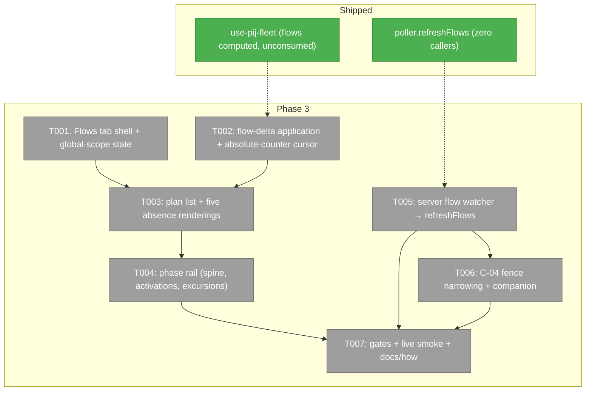
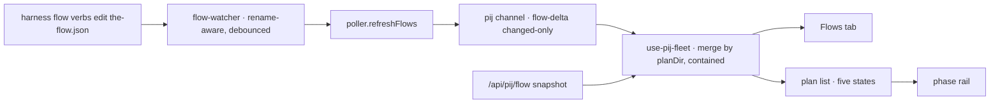
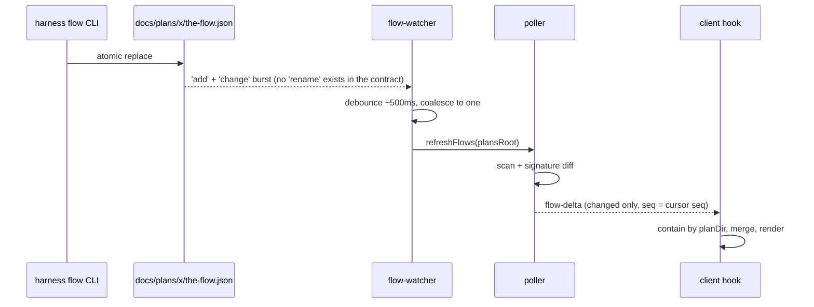

# Phase 3: Flow phase view — Tasks & Context Brief

**Plan**: `docs/plans/089-first-class-pij/first-class-pij-plan.md` (v1.1.0, READY)
**Phase**: 3 of 4 · **Depends on**: Phase 1 (shipped `1c8a0fcaf`), Phase 2 (shipped `2151a69fe`, review APPROVE)
**Design reference (RATIFIED)**: `scratch/pij-observatory-poc.html` — Flows tab: five absence-state cards, the 088 real phase rail, all-plans list. Light default, theme-aware.
**Complexity**: CS 3

---

## Executive Briefing

- **Purpose**: The work-spine view — which phase each plan is in, how far, how active — honest about absence. Phase 2 computed `flows` and `errors.flows` in the hook but nothing consumes them; this phase gives them their first consumer and makes `flow-delta` fire for the first time.
- **What We're Building**: a **Flows tab** on the existing pij page (plan list with per-plan state, five absence renderings, phase rails with activations and excursion reviews) + the **server-side flow-file watcher** that calls the already-built `refreshFlows()` — plus the client `flow-delta` application and the deliberately-parked retention-cursor fix.
- **Goals**:
  - ✅ AC-06 (phase rail correct against the 088 fixture: in-progress ph6, excursion reviews) and AC-07 (five absence states as five visually distinct designed states)
  - ✅ `flow-delta` fires end-to-end: edit a flow via `harness flow` verbs → view updates without reload (watcher → `refreshFlows` → channel → hook → tab)
  - ✅ The maxMessages retention debt retired: cursor survives trimming (absolute counter, not an index into a sliding array)
  - ✅ C-04 fence NARROWED (never deleted): watcher file explicitly excluded + companion assertion it watches only flow paths
- **Non-Goals**:
  - ❌ Global prime tree, overlay panel, focus action (Phase 4)
  - ❌ Watching anything under `~/.pij` (C-04 absolute); writing any flow file (C-02 — we watch, never write)
  - ❌ Seat/agent dimension on flows (contract: no seat dimension; `activations` are PHASE activations, labelled exactly that)
  - ❌ A third containment implementation (reuse the browser copy)

## Prior Phase Context

### Phase 1 (condensed — full detail in the P2 dossier § Prior Phase Context)
`IFlowReader { read(planDir, options?); scan(plansRoot) }` + `createFlowReader()` already classify the five states; `/api/pij/flow?workspace=<path>` (400 without param) returns `PijSnapshot<FlowSnapshotData> = { seq, at, data: { workspace, flows: FlowSummary[] } }`; `PijPollerService.refreshFlows(plansRoot)` (`server/pij-poller.service.ts:277`) scans, signature-diffs (`events[].length + ':' + nav.now`), and emits `flow-delta` **only on change** — production-injected (`start-pij-poller.ts:50` `flows: createFlowReader()`) but **zero production callers**: the watcher this phase builds is its first. Flow fixtures for all five states exist in `test/fixtures/flows/` (`live-088`, `legacy-e308`, `untracked-work`, `not-started`, `corrupt-json`, `corrupt-nav`, `orphan-node`, `kitchen-sink`; materializers `materializeFlowFixture`/`materializePlansRoot`).

### Phase 2 (the surface this phase extends)

**A. Deliverables**: pij page (`app/(dashboard)/workspaces/[slug]/pij/page.tsx` — resolves workspace absolute path server-side, honors `?worktree=`), `hooks/use-pij-fleet.ts` (the page's only data path), 10 components incl. `stage-strip.tsx` (exports `FlowContext`, `hasConfidentFlow`, `FlowChip`, `StageStrip`), `lib/folder-containment.ts` (browser containment), `fleet-empty-state.tsx` (the designed-states pattern), `server/join.ts` `joinTeamToFlow` (rung 1 dormant, `via:'none'` today). Fakes: `test/fakes/fake-pij-api.ts`; fixtures `test/fixtures/pij/fleet-ui.ts`.

**B. Dependencies Exported**:
- `usePijFleet({ workspacePath, scope?, fetchImpl?, treeRefetchDebounceMs? })` → `{ rows, status, seq, phase, tree, flows: FlowSummary[], filteredOut, errors: { fleet, tree, flows }, refresh }` — **`flows` and `errors.flows` are computed but never passed to any component; the Flows tab is their first consumer.** `refresh()` re-reads all three snapshots and already fires on tab change.
- **Tab mechanism** (`pij-page-client.tsx`): shadcn `Tabs`/`TabsTrigger`/`TabsContent`, `useState('fleet')`, `onTabChange = setTab + refresh()`. A third tab = one `<TabsTrigger value="flows">` + one `<TabsContent>`. Page-level `now` state (5s tick) available — no component reads its own clock.
- **The `flow-delta` insertion point**: the replay/apply effect in `use-pij-fleet.ts` (~lines 305–363) currently drops flow-deltas at `if (event.type !== 'fleet-delta') continue;`. Mechanics it inherits: `useChannelEvents<…>(PIJ_CHANNEL, { maxMessages: 0 })` flat envelope; index cursor `appliedIndexRef`; replay window `replayUntilRef`; `snapshotToken` state (NOT seq) as replay trigger.
- `flow-delta` payload `{ type:'flow-delta'; seq; at; flows: FlowSummary[] }` — **changed-only** summaries, merge by `FlowSummary.planDir` (absolute path); **no removal signal** — a deleted plan folder never emits; snapshot refetch (tab change / `refresh()`) is the deletion path.
- Full `FlowSummary` reaches the browser verbatim (type-only import from `../server/flow-reader.interface` is fence-legal): `planDir, planFolder, state ('live'|'legacy'|'untracked'|'not-started'|'corrupt'), reason?, slug?, provenance?, now?, nowPhaseId?, next? (ADVISORY only), completion, completionSource, phases: FlowPhase[] ({id,label,status,order,current,activations,offSpine}), phasesDone, phasesTotal, reviews, nodes, eventCount, signature, readAt`.
- `FakePijApi`: `setFleet/setTree/setFlows`, `failWith(route, status, body)`, `deferFleet()` (fleet-only race gate — **add a `deferFlow()` if a flow race test needs it**), `countOf(route)`, `calls` (verbatim URLs). No flow fixtures in `fleet-ui.ts` — use Phase 1's `test/fixtures/flows/`.
- Watcher's server home: `PijPollerDeps.flows` already injected; singleton `getPijPoller()`; bootstrap = 4th HMR-safe block in `apps/web/instrumentation.ts` (`__pijObservatoryBootstrapped`, SIGTERM/SIGINT cleanup).
- **`@chainglass/workflow` exports an injectable watcher contract**: `IFileWatcher`, `IFileWatcherFactory`, `FileWatcherEvent`, `FileWatcherOptions`, `NativeFileWatcherAdapter`, polling adapter, factory (`packages/workflow/src/adapters/`). Use it — do not hand-roll `fs.watch`, and it keeps the watcher fake-testable.

**C. Gotchas & Debt (each is a task input here)**:
1. **maxMessages retention debt is THIS phase's to retire** (Discoveries "T002 (fix 1)"): unbounded retention was acceptable at fleet rates; `flow-delta` raises the rate. Durable fix: an **absolute message counter** cursor that survives trimming, then retention can be re-capped.
2. **Seq guard is replay-only** — `refreshFlows` stamps `seq: this.deps.cursor.seq`, so consecutive flow refreshes with no spine traffic REPEAT a seq. Never add a "newer-than-last-applied" guard on live flow-deltas. Flow merges by `planDir` are idempotent — replays may simply re-apply (decide and pin with a test whether flow replays consult the fleet snapshot seq at all; bypassing the guard is legitimate because re-apply is harmless).
3. `snapshotToken` (not seq) drives the replay effect — React bails on identical state.
4. Deltas are GLOBAL: flow containment = `planDir` under `workspacePath`, **reusing `isFolderInWorkspacePath`** — no third implementation.
5. Global scope: `/api/pij/flow` requires `workspace`, so the Flows tab in global scope renders a **designed** "flows are workspace-scoped" state — never an error, never a silent blank.
6. Client fence forbids value-imports of `node:fs`/`node:path` and CLI strings in `components/`/`hooks/`/`lib/` — the watcher lives in `server/` only.
7. Pre-existing baseline: exactly 3 dashboard-navigation failures — count before and after.
8. `next` is ADVISORY (render as advisory or not at all); `activations` labelled "phase activations"; `offSpine` surfaced, never spliced into the spine.

**D. Incomplete riding forward**: AC-01 in-browser probe (written, awaits Jordan at phase review); role-chip deviation awaiting Jordan's ack; `joinTeamToFlow` rung 1 dormant pending dove's plan-id flag (brief delivered — additive when it lands, never blocking). **Landed on pij main mid-phase, adopt in Phase 4 (or a tracked fix), NOT in this phase's scope**: `pij list` rows now carry `currentTask`/`currentAssignment` (`24edcba` — section titles improve automatically, `seatTask()` already prefers the row); `pij list --badge` live (`afdb839`, hoisted AC-05 join, ~0.65s at 179 rows; opt-in — badge key ABSENT without the flag vs null-when-unknown with it; adoption = one-line argv change in the slow loop); `pij list --archived` fixed in the same commit (archived tier was never CLI-reachable — unblocks future dissolved-seat/admin history views).

**E. Patterns to Follow**: fence C-04 narrowing is **pre-authorized by the assertion's own Test Doc** (`fence.test.ts:308-324` — regex `/\b(chokidar|fs\.watch|watchFile|watch\s*\()/m` over `GUARDED_ROOTS`; "Flow files are the opposite and Phase 3 will watch them"). Mirror the `pij-records.ts` denylist-exclusion precedent (lines ~233–268): exclude exactly the watcher file from the general assertion, add a **companion assertion** that the excluded file watches only `the-flow.json`-shaped paths and nothing `~/.pij`-shaped. Five absence states mirror `fleet-empty-state.tsx`: exported reason union, **pure exported discriminator**, precedence ladder, distinct `data-reason` per state, a "five states five test ids — never look alike" test. TDD RED-first with verbatim log evidence; fake injection never `vi.mock()`; `now` as parameter; observations never verdicts.

## Pre-Implementation Check

| File | Exists? | Domain Check | Notes |
|------|---------|-------------|-------|
| `apps/web/src/features/089-first-class-pij/components/pij-page-client.tsx` | modify | 089 | third tab, two blocks |
| `apps/web/src/features/089-first-class-pij/hooks/use-pij-fleet.ts` | modify | 089 | flow-delta branch + absolute-counter cursor |
| `apps/web/src/lib/sse/use-channel-events.ts` | modify (ADDITIVE) | _lib/sse (shared!) | **the absolute counter cannot be derived client-side today**: the hook trims inside its state updater and returns only `{ messages, isConnected, clearMessages }` — once capped, "5 arrived 5 trimmed" is indistinguishable from "0 arrived". Add a monotonic `receivedCount` (total ever received for the channel) to the return. ADDITIVE ONLY — grep all existing consumers (`use-channel-callback` siblings, 058/088/050 hooks) and prove none break; their tests stay green |
| `apps/web/src/features/089-first-class-pij/components/flows-tab.tsx` (+ `flow-plan-card.tsx`, `flow-state-badge.tsx`, `phase-rail.tsx`) | create | 089 | extend/reuse `stage-strip.tsx` exports where they fit |
| `apps/web/src/features/089-first-class-pij/server/flow-watcher.ts` | create | 089 (server) | via `IFileWatcherFactory` from `@chainglass/workflow` |
| `apps/web/src/features/089-first-class-pij/server/start-pij-poller.ts` | modify (additive) | 089 (server) | wire watcher start/stop beside poller, same cleanup |
| `test/unit/web/pij/fence.test.ts` | modify (additive) | 089 | narrowing + companion assertion |
| `test/unit/web/pij/{flows-tab,phase-rail,flow-watcher,use-pij-fleet}.test.*` | create/extend | 089 | fixtures from `test/fixtures/flows/` |

No duplication: no existing flows/phase-rail component; watcher contract exists in `@chainglass/workflow` (reused, not duplicated). Contract changes: none — all additive.

## Architecture Map



## Tasks

| Status | ID | Task | Domain | Path(s) | Done When | Notes |
|--------|-----|------|--------|---------|-----------|-------|
| [x] | T001 | Flows tab shell: third `TabsTrigger`/`TabsContent` in `pij-page-client.tsx`; tab consumes `fleet.flows` + `fleet.errors.flows` (their FIRST consumer); `errors.flows` renders as a designed error state (503 code verbatim); **global scope renders the designed "flows are workspace-scoped" state** (the flow route requires a workspace) — never an error, never a blank | 089-first-class-pij | `apps/web/src/features/089-first-class-pij/components/pij-page-client.tsx`, `components/flows-tab.tsx`, `test/unit/web/pij/flows-tab.test.tsx` | Tab renders from `FakePijApi.setFlows` fixtures; tab change triggers `refresh()` (assert via `countOf('flow')`); global-scope state has its own `data-reason` and test; `flowsFilteredOut` rendered on THIS tab with flow-specific wording (never mixed into the fleet counter) | Two-block addition per P2 report; page-level `now` passed down, no own clock |
| [x] | T002 | TDD: `flow-delta` application + retention-debt retirement. (b) FIRST — retire the maxMessages debt across BOTH files: add a monotonic `receivedCount` to `useChannelEvents`' return (ADDITIVE — the shared hook trims inside its updater, so no counter is derivable outside it; prove existing consumers unbroken), then rework the hook cursor from index-into-sliding-array to the absolute counter and re-cap retention (e.g. `maxMessages: 1000`) — regression: with cap restored, message 1,001 and a post-trim delta both apply (adapt the delta-1001 test, keep its one-`act()`-per-batch shape). (a) THEN the `flow-delta` branch at the replay/apply insertion point: merge changed-only summaries by `planDir`, contain via `isFolderInWorkspacePath(planDir, workspacePath)` (REUSE — no third implementation), **count foreign flow rows into a SEPARATE `flowsFilteredOut`** — never into `filteredOut`, which the Fleet tab renders as a claim about SEAT updates and must stay true; live flow-deltas apply regardless of repeated seq (RED test: two flow-deltas with the SAME seq both apply); deletion path = snapshot refetch only (test: a vanished plan survives until `refresh()`) | 089-first-class-pij + _lib/sse | `apps/web/src/lib/sse/use-channel-events.ts`, `apps/web/src/features/089-first-class-pij/hooks/use-pij-fleet.ts`, `test/unit/web/pij/use-pij-fleet.test.tsx`, existing sse tests | RED first for: post-trim cursor survival, same-seq flow-deltas, foreign-planDir containment into `flowsFilteredOut` (fleet `filteredOut` unchanged by flow rejects — asserted). All existing 18 hook tests + all existing `_lib/sse` consumer tests stay green | Gotchas 1–4; the two halves share the same effect body — one task so tests co-evolve, (b) strictly before (a) |
| [x] | T003 | Plan list + five absence renderings: `flows-tab.tsx` lists every `FlowSummary` for the workspace (histogram header: N live / N legacy / N untracked / N not-started / N corrupt); each state a **designed state** mirroring the `fleet-empty-state` pattern — exported reason union, pure discriminator (trivially `FlowSummary.state`), distinct `data-reason`, exact wordings: legacy = "predates the flow CLI; needs re-creating" (never an error), untracked = "untracked work", not-started/corrupt per interface docs; live plans link to their rail (T004); `completion` from `completion`/`completionSource` only — never from the file set | 089-first-class-pij | `apps/web/src/features/089-first-class-pij/components/flows-tab.tsx`, `components/flow-plan-card.tsx`, `components/flow-state-badge.tsx`, `test/unit/web/pij/flows-tab.test.tsx` | AC-07: the five fixture states render five visually distinct, correctly-worded cards ("five states five test ids" test); kitchen-sink renders without crash; none renders as error or blank | C-09; fixtures from `test/fixtures/flows/` via materializers + `FakePijApi.setFlows` |
| [x] | T004 | Phase rail component: spine phases ordered by `FlowPhase.order` (NEVER array order — nodes are stored newest-first), position from `nowPhaseId`, done/total from `phasesDone`/`phasesTotal`, per-phase `activations` labelled exactly "phase activations" (no seat dimension), `current` highlighted, `offSpine` items rendered as excursions (never spliced into the spine), excursion reviews from `reviews` (`branch_of`), `next` rendered as advisory or omitted | 089-first-class-pij | `apps/web/src/features/089-first-class-pij/components/phase-rail.tsx`, `test/unit/web/pij/phase-rail.test.tsx` | AC-06 against the 088 fixture: shows in-progress ph6 AND the excursion reviews rv4/rv4b/rv4c **attached to ph4 via their `branch_of` — NOT hanging off the current phase** (misreading them as ph6's is the trap); array-order mutation test (shuffled `phases` input renders identically by `order` — fixture stores nodes newest-first) | Reuse `stage-strip.tsx` exports where they fit — extend, don't fork, the chip/strip vocabulary |
| [x] | T005 | TDD: server flow watcher `server/flow-watcher.ts` via `IFileWatcherFactory` (`@chainglass/workflow`) — injectable factory + injectable `refreshFlows` callback. **Workspace enumeration (the plansRoot source)**: `IWorkspaceService.list()` resolved once at bootstrap (same DI container the pij page uses) → `join(workspace.toJSON().path, 'docs', 'plans')` per workspace, PLUS lazy registration on a `/api/pij/flow` request whose workspace path is not yet watched (covers `?worktree=` roots); the set is watch-once (no duplicate watches). **Event reality (the contract has NO 'rename')**: `FileWatcherEvent = 'add'|'change'|'unlink'|'addDir'|'unlinkDir'|'error'`; on macOS one atomic replace fires BOTH `'add'` and `'change'` on the same path (adapter translates fs.watch renames) — register both, debounce (~500ms) coalesces to exactly one `refreshFlows(plansRoot)`; decide and pin `FileWatcherOptions.atomic` explicitly. Wired additively in `start-pij-poller.ts` with the same SIGTERM/SIGINT + HMR-safe cleanup; watcher failure degrades to snapshot-only with a logged note, never a crash; **never registers a watch on any `~/.pij`-shaped path** (asserted) | 089-first-class-pij | `apps/web/src/features/089-first-class-pij/server/flow-watcher.ts`, `server/start-pij-poller.ts`, `test/unit/web/pij/flow-watcher.test.ts` | Tests use the EXISTING `FakeFileWatcher`/`FakeFileWatcherFactory` exported by `@chainglass/workflow` (they expose `simulateAdd/simulateChange/...` — only real `FileWatcherEvent` values; there is no simulateRename and building a fake that emits 'rename' is a spec violation): `simulateAdd`+`simulateChange` burst on one path → exactly one debounced `refreshFlows` with the right plansRoot; unknown-workspace flow request → lazy watch registered once; a `~/.pij` path request throws; teardown stops all watches; HMR double-start impossible | The FIRST production caller of `refreshFlows`. C-02: we watch, never write. `IWorkspaceService` via `getContainer()` (see `pij/page.tsx` precedent); factory-injection precedent: `CentralWatcherService`. Recursive tree watching confirmed supported (`watch(resolved, { recursive: true })`, FSEvents on macOS). Dev server restart needed to activate (Jordan's nod at phase close) |
| [x] | T006 | Fence work (additive only). First CHECK whether exclusion is even needed: `toCode()` strips comments and import lines, and a factory-injected watcher (`factory.create(...)`/`watcher.add(...)`) may carry no literal `watch(`/`chokidar`/`fs.watch` token — if the general C-04 assertion passes over the real `flow-watcher.ts` untouched, DO NOT add an exclusion. Either way add the companion assertion: `flow-watcher.ts`'s watch targets are only `docs/plans`/`the-flow.json`-shaped and nothing `~/.pij`-shaped appears in it. If exclusion IS needed, mirror the `pij-records.ts` denylist-exclusion precedent (fence.test.ts:233-267). Prove the fence still bites: a `watch(` planted in any other guarded file trips it (mutation-style RED demonstration in the log) | 089-first-class-pij | `test/unit/web/pij/fence.test.ts` | Fence suite green; pij-side fence demonstrably unweakened (planted-offender RED verbatim); assertion count strictly increases | Pre-authorized by the assertion's own Test Doc; no-exclusion-needed is the PREFERRED outcome |
| [x] | T007 | Validation pass: `pnpm vitest run test/unit/web/pij/` green; `npx tsc -p tsconfig.test.json --noEmit` exit 0 (gate config tracked since `4f81a60b8` — a validation claim that it was untracked was disproven by the lead: `git ls-files` shows it, no diff vs HEAD); `pnpm build` clean; dashboard-navigation baseline exactly 3; live smoke: classification histogram of this repo's `docs/plans` (86 dirs) produced **via `IFlowReader.scan` — NEVER `harness flow list`, which cannot see flight plans and returns an empty result that looks legitimate**; expected **83 untracked-or-not-started / 2 legacy / 1 live** (plan said 82/2/1 pre-089-dir; investigate any drift, don't paper it), anchors verified (085/086 → legacy, 088 → live at ph6, 089's own dir state recorded as-is); end-to-end watcher demo prepared as a written probe (edit a fixture flow via `harness flow` verbs → `flow-delta` observed) — executed live at phase review after the dev-server restart; `docs/how/pij-observatory.md` § flow view drafted (deliberate absences listed: no seat dimension, no removal signal, advisory `next`) | 089-first-class-pij | (whole phase) + `docs/how/pij-observatory.md` | All gates verbatim-logged; AC-06/AC-07 named with their proving tests; histogram + anchors in the log | No dev-server restart without Jordan's nod — the watcher activates at phase close |

## Context Brief

**Environment-first posture**: friction is work — fix small/reversible, otherwise a Discoveries row; pay it forward.

**Key plan findings applied**: Finding 04 (absence states are designed states — AC-07); Finding 08 (flow files are watchable; atomic replace surfaces as rename); C-02 (watch, never write); C-04 (never watch `~/.pij` — narrowing pre-authorized for the flow side only); C-09 (flow reading rules: `type=="phase"` filter lives server-side already; order by `order`; completion never from file set).

**Domain dependencies**:
- `089-first-class-pij` (own server): `IFlowReader`/`FlowSummary` (types only on the client), `refreshFlows`, `getPijPoller`, fixtures + materializers.
- `@chainglass/workflow`: `IFileWatcher`/`IFileWatcherFactory`/adapters — the watcher contract (server-side value import is legal there).
- `_lib/sse`: ONE additive change — `useChannelEvents` gains a monotonic `receivedCount` in its return (T002's cursor prerequisite; see Pre-Implementation Check). Every other `_lib/sse` surface unchanged; the `pij` channel already carries `flow-delta` by type.

**Domain constraints**: read-only everywhere; client fence (no node imports/CLI strings in client dirs); no third containment implementation; theme-aware, light default.

**Reusable**: `FakePijApi` (+ add `deferFlow()` only if a flow race test needs it), `test/fixtures/flows/` (all five states + kitchen-sink + 088), `stage-strip.tsx` exports, `isFolderInWorkspacePath`, the `fleet-empty-state` designed-states shape, page-level `now`.

**Data flow**:


**Watcher sequence**:


## Discoveries & Learnings

_Populated during implementation by the implement verb._

| Date | Task | Type | Discovery | Resolution | References |
|------|------|------|-----------|------------|------------|
| 2026-07-26 | T002 | Debt retired | The Phase 2 debt is paid: retention is capped again (1,000) and the cursor is an absolute count, not an index into a sliding array. The enabling change is `receivedCount` on the SHARED `useChannelEvents` — the trim happens inside its own state updater, so no consumer could derive the count from outside it. | Additive to the shared hook (both values in one state object so they can never be read a render apart; `clearMessages()` leaves the count alone — it counts arrivals, not survivors). All 4 existing consumers + the hook's own contract suite proven green (517 tests). One documented clamp: if trimming removed unapplied events (>1,000 inside one fetch window) the effect takes what remains and the next snapshot re-establishes truth — bounded and self-healing, versus silent and permanent. | `apps/web/src/lib/sse/use-channel-events.ts`; `hooks/use-pij-fleet.ts`; `use-pij-fleet.test.tsx` § retention |
| 2026-07-26 | T002 | Ruling | Flow-deltas face NO seq guard, deliberately. The guard compares against the FLEET snapshot's seq, which says nothing about which flow scan a flow-delta reflects — different reads, different clocks, and `refreshFlows` stamps a cursor seq a flow file changing never moves. | Bypassed, with the cost stated at the decision: a flow-delta that raced the flow fetch can re-apply a superseded summary; the merge by `planDir` is idempotent and the next delta or refresh corrects it. Losing every live flow update was the alternative. Pinned by "applies two flow-deltas carrying the SAME seq". | `hooks/use-pij-fleet.ts` (flow-delta branch) |
| 2026-07-26 | T002 | Hazard | Flow containment is UNCONDITIONAL while the fleet's follows the scope toggle. `/api/pij/flow` requires a workspace, so a global-scope tab still holds exactly one workspace's plans and has no wider set to widen to. | `isFolderInWorkspacePath(planDir, workspacePath)` regardless of scope; rejects counted into `flowsFilteredOut`, never `filteredOut` (the Fleet tab renders that one as a sentence about SEATS and it must stay true). Both asserted in one test. | `hooks/use-pij-fleet.ts`; `use-pij-fleet.test.tsx` § flow deltas |
| 2026-07-26 | T005 | Capability dropped | The watcher subscribes to `add` + `change` only. Two reasons, both on the record: the CLI is the sole writer and never deletes (so a vanished document is a `rm`/branch switch/folder removal, which the snapshot covers), AND a bare `'unlink'` literal in a guarded file trips the C-02 mutating-verb fence, which reads it as the pij verb of the same name (verified RED before removal). | Removed on merit rather than bending a deliberately blunt fence; pinned as a test so the absence is a decision, not an omission. | `server/flow-watcher.ts`; `flow-watcher.test.ts`; execution log § T005 |
| 2026-07-26 | T005 | Hazard | `FileWatcherOptions.atomic` is NOT implemented by `NativeFileWatcherAdapter` — the constructor reads it nowhere; it translates fs.watch renames into add/unlink itself. Setting it `true` would be relying on a no-op to coalesce the burst. | Set explicitly `false` and asserted, with the 500ms per-root debounce named as the actual coalescing mechanism. | `server/flow-watcher.ts`; `flow-watcher.test.ts` |
| 2026-07-26 | T006 | Fence | The anticipated C-04 exclusion was NOT needed: the flow watcher reaches the filesystem through `IFileWatcherFactory`, so it names no watcher API and the general assertion passes over it untouched. An unnecessary exclusion is a hole. | No exclusion added. Instead: an `arrayContaining` guard so the general check is provably looking at the watcher, plus a companion assertion on its watch TARGETS (every `.add()` argument is `plansRoot`; `.pij` appears only inside the refusal, mirroring the `pij-records.ts` denylist split). Assertion count 13 → 14; both checks demonstrated biting against planted offenders. | `test/unit/web/pij/fence.test.ts` |
| 2026-07-26 | T001 | Environment | Radix activates a tab on `mousedown` AND on the following focus; inside one `act()` both land in a single React batch, so the guard that normally makes the second a no-op has not committed — `userEvent.click` produced two `refresh()` calls. A test-environment batching artefact, not browser behaviour. | Drove `fireEvent.mouseDown` (the one event Radix activates on) to keep the tab-change assertion exact rather than settling for "went up by at least one". Reason written into the test. | `flows-tab.test.tsx` § the page shell |
| 2026-07-26 | T001 | Seam | The tab mechanism lives in `pij-page-client.tsx`, not in the hook, so "a tab change re-reads the flow snapshot" is only assertable by driving the real shell. | Added an optional `fetchImpl` prop passed straight through to the hook's existing seam. The server component never sets it; production is unchanged. | `components/pij-page-client.tsx` |

---

```
docs/plans/089-first-class-pij/
  ├── first-class-pij-plan.md
  └── tasks/phase-3-flow-phase-view/
      ├── tasks.md
      └── execution.log.md   # created by the implement verb
```
